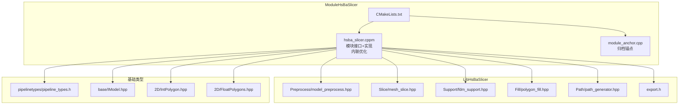
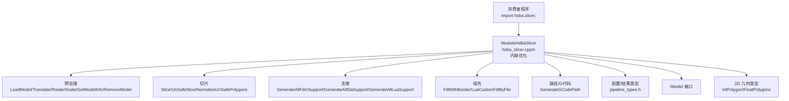
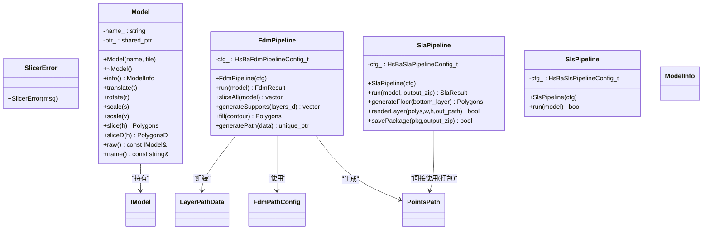
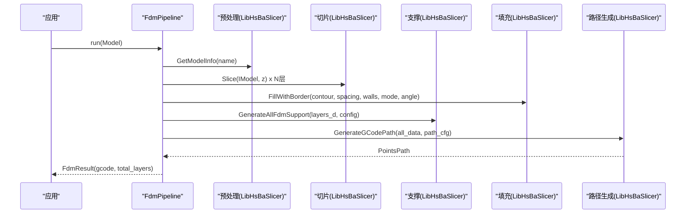
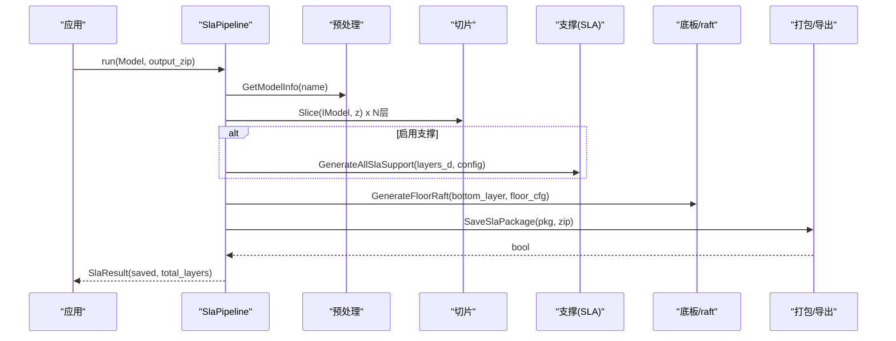
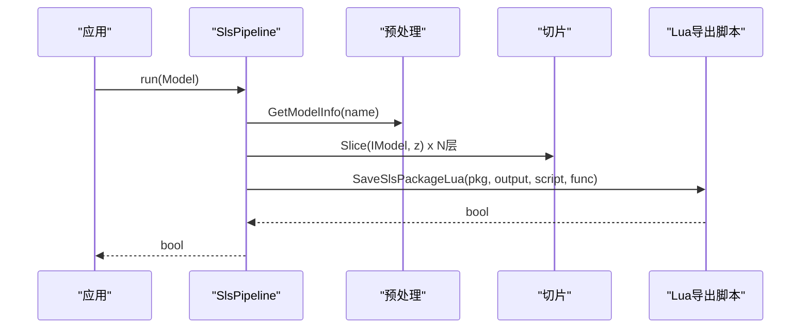
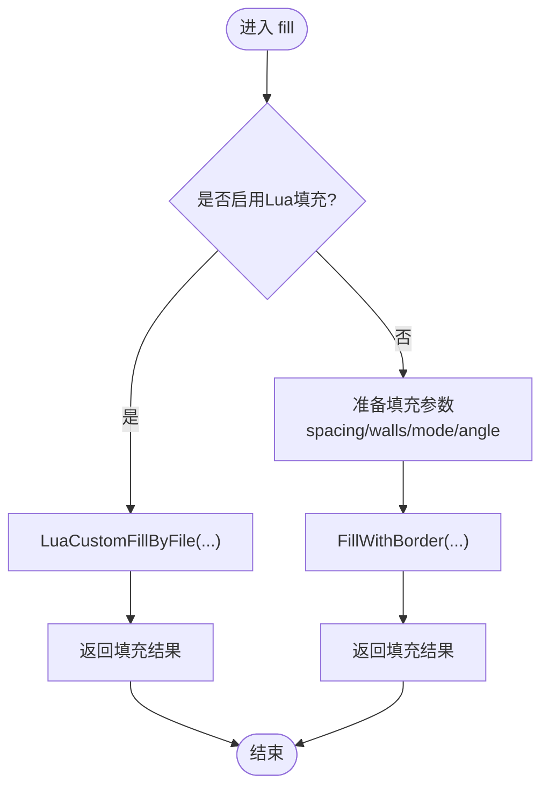
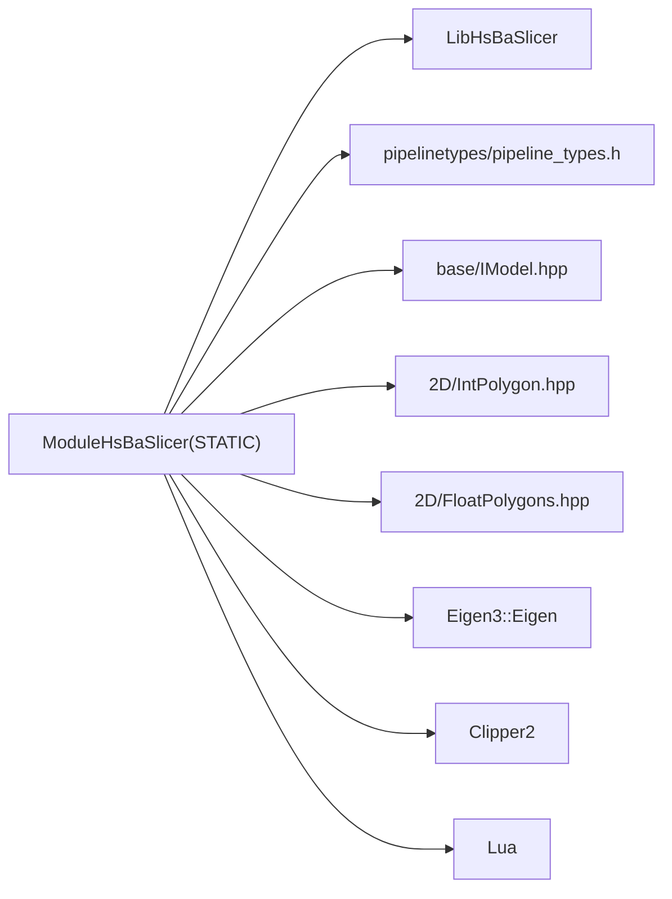

# C++20模块包装层 (ModuleHsBaSlicer)

<cite>
**本文引用的文件**   
- [CMakeLists.txt](file://ModuleHsBaSlicer/CMakeLists.txt)
- [hsba_slicer.cppm](file://ModuleHsBaSlicer/hsba_slicer.cppm)
- [module_anchor.cpp](file://ModuleHsBaSlicer/module_anchor.cpp)
- [export.h](file://LibHsBaSlicer/export.h)
- [model_preprocess.hpp](file://LibHsBaSlicer/Preprocess/model_preprocess.hpp)
- [mesh_slice.hpp](file://LibHsBaSlicer/Slice/mesh_slice.hpp)
- [fdm_support.hpp](file://LibHsBaSlicer/Support/fdm_support.hpp)
- [polygon_fill.hpp](file://LibHsBaSlicer/Fill/polygon_fill.hpp)
- [path_generator.hpp](file://LibHsBaSlicer/Path/path_generator.hpp)
- [pipeline_types.h](file://pipelinetypes/pipeline_types.h)
- [IModel.hpp](file://base/IModel.hpp)
- [IntPolygon.hpp](file://2D/IntPolygon.hpp)
- [FloatPolygons.hpp](file://2D/FloatPolygons.hpp)
</cite>

## 更新摘要
**变更内容**   
- 性能优化：将超过27个方法声明转换为内联函数，显著提升运行时性能
- 涉及类：Model、FdmPipeline、SlaPipeline、SlsPipeline 及其工具函数
- 优化范围：构造函数、移动语义、访问器方法、流水线操作等关键路径

## 目录
1. [简介](#简介)
2. [项目结构](#项目结构)
3. [核心组件](#核心组件)
4. [架构总览](#架构总览)
5. [详细组件分析](#详细组件分析)
6. [依赖关系分析](#依赖关系分析)
7. [性能与构建特性](#性能与构建特性)
8. [故障排查指南](#故障排查指南)
9. [结论](#结论)
10. [附录：API参考](#附录api参考)

## 简介
本仓库包含一个独立的 C++20 模块包装层 ModuleHsBaSlicer，它以类+异常的现代 C++ 风格对 LibHsBaSlicer 的底层自由函数 API 进行封装，提供面向对象的 FDM/SLA/SLS 流水线、模型 RAII 管理、Lua 扩展点以及类型别名与工具函数。消费者仅需使用 import hsba.slicer; 并链接 ModuleHsBaSlicer 即可使用完整切片能力。

设计要点：
- 模块接口导出新设计的类（非直接 re-export 原始自由函数）
- 模块实现中类方法定义在模块上下文内，转发到 LibHsBaSlicer 的自由函数
- 通过静态库形式输出，避免 DLL 链接问题；同时向消费者重导出必要的编译选项以匹配 CGAL/Eigen 等第三方库的 ABI
- **性能优化**：大量方法已转换为内联函数，消除函数调用开销，提升关键路径性能

## 项目结构
ModuleHsBaSlicer 采用单文件模块接口（声明与实现同在一个 .cppm），以避免 MSVC 隐式导入 std:: 导致的 C2572 错误；另提供一个空源文件作为"锚点"，确保归档器生成静态库。

图表来源
- [CMakeLists.txt:1-46](file://ModuleHsBaSlicer/CMakeLists.txt#L1-L46)
- [hsba_slicer.cppm:1-642](file://ModuleHsBaSlicer/hsba_slicer.cppm#L1-L642)
- [module_anchor.cpp:1-13](file://ModuleHsBaSlicer/module_anchor.cpp#L1-L13)
- [export.h:1-15](file://LibHsBaSlicer/export.h#L1-L15)
- [model_preprocess.hpp:1-88](file://LibHsBaSlicer/Preprocess/model_preprocess.hpp#L1-L88)
- [mesh_slice.hpp:1-41](file://LibHsBaSlicer/Slice/mesh_slice.hpp#L1-L41)
- [fdm_support.hpp:1-68](file://LibHsBaSlicer/Support/fdm_support.hpp#L1-L68)
- [polygon_fill.hpp:1-54](file://LibHsBaSlicer/Fill/polygon_fill.hpp#L1-L54)
- [path_generator.hpp:1-62](file://LibHsBaSlicer/Path/path_generator.hpp#L1-L62)
- [pipeline_types.h:1-400](file://pipelinetypes/pipeline_types.h#L1-L400)
- [IModel.hpp:1-148](file://base/IModel.hpp#L1-L148)
- [IntPolygon.hpp:1-237](file://2D/IntPolygon.hpp#L1-L237)
- [FloatPolygons.hpp:1-267](file://2D/FloatPolygons.hpp#L1-L267)

章节来源
- [CMakeLists.txt:1-46](file://ModuleHsBaSlicer/CMakeLists.txt#L1-L46)
- [hsba_slicer.cppm:1-642](file://ModuleHsBaSlicer/hsba_slicer.cppm#L1-L642)
- [module_anchor.cpp:1-13](file://ModuleHsBaSlicer/module_anchor.cpp#L1-L13)

## 核心组件
- 异常体系：统一的 SlicerError 继承自标准运行时异常，用于包装所有失败路径
- 类型别名：re-export Clipper2 的整数/浮点多边形类型，以及 pipeline_types 的配置/结果类型
- Model：RAII 模型句柄，构造时加载模型，析构时释放；提供变换、切片、信息查询等便捷方法
- FdmPipeline：FDM 全流程（切片→支撑→填充→路径生成），支持分步调用与 Lua 自定义
- SlaPipeline：SLA 全流程（切片→支撑→底板→渲染→打包），支持 Lua 自定义与图像格式选择
- SlsPipeline：SLS 流水线（基于 Lua 导出脚本驱动），仅负责切片与导出编排
- Lua 扩展：提供自定义填充、底板、支撑的 Lua 入口
- 版本与工具：versionJson/versionXml、toDouble/toInt 精度转换

**性能优化亮点**：
- 所有简单访问器和转换方法已标记为 inline，消除函数调用开销
- 移动语义操作符内联化，提升临时对象处理效率
- 流水线方法内联化，减少关键路径的调用成本

章节来源
- [hsba_slicer.cppm:60-276](file://ModuleHsBaSlicer/hsba_slicer.cppm#L60-L276)

## 架构总览
模块层位于 LibHsBaSlicer 之上，将自由函数封装为面向对象 API，并通过 C++20 模块对外暴露。

图表来源
- [hsba_slicer.cppm:1-642](file://ModuleHsBaSlicer/hsba_slicer.cppm#L1-L642)
- [model_preprocess.hpp:1-88](file://LibHsBaSlicer/Preprocess/model_preprocess.hpp#L1-L88)
- [mesh_slice.hpp:1-41](file://LibHsBaSlicer/Slice/mesh_slice.hpp#L1-L41)
- [fdm_support.hpp:1-68](file://LibHsBaSlicer/Support/fdm_support.hpp#L1-L68)
- [polygon_fill.hpp:1-54](file://LibHsBaSlicer/Fill/polygon_fill.hpp#L1-L54)
- [path_generator.hpp:1-62](file://LibHsBaSlicer/Path/path_generator.hpp#L1-L62)
- [pipeline_types.h:1-400](file://pipelinetypes/pipeline_types.h#L1-L400)
- [IModel.hpp:1-148](file://base/IModel.hpp#L1-L148)
- [IntPolygon.hpp:1-237](file://2D/IntPolygon.hpp#L1-L237)
- [FloatPolygons.hpp:1-267](file://2D/FloatPolygons.hpp#L1-L267)

## 详细组件分析

### 类与类型关系图

图表来源
- [hsba_slicer.cppm:60-276](file://ModuleHsBaSlicer/hsba_slicer.cppm#L60-L276)
- [path_generator.hpp:1-62](file://LibHsBaSlicer/Path/path_generator.hpp#L1-L62)
- [model_preprocess.hpp:1-88](file://LibHsBaSlicer/Preprocess/model_preprocess.hpp#L1-L88)
- [IModel.hpp:1-148](file://base/IModel.hpp#L1-L148)

#### FDM 流水线序列图

图表来源
- [hsba_slicer.cppm:348-465](file://ModuleHsBaSlicer/hsba_slicer.cppm#L348-L465)
- [mesh_slice.hpp:1-41](file://LibHsBaSlicer/Slice/mesh_slice.hpp#L1-L41)
- [fdm_support.hpp:1-68](file://LibHsBaSlicer/Support/fdm_support.hpp#L1-L68)
- [polygon_fill.hpp:1-54](file://LibHsBaSlicer/Fill/polygon_fill.hpp#L1-L54)
- [path_generator.hpp:1-62](file://LibHsBaSlicer/Path/path_generator.hpp#L1-L62)

#### SLA 流水线序列图

图表来源
- [hsba_slicer.cppm:468-570](file://ModuleHsBaSlicer/hsba_slicer.cppm#L468-L570)
- [mesh_slice.hpp:1-41](file://LibHsBaSlicer/Slice/mesh_slice.hpp#L1-L41)
- [fdm_support.hpp:1-68](file://LibHsBaSlicer/Support/fdm_support.hpp#L1-L68)

#### SLS 流水线序列图

图表来源
- [hsba_slicer.cppm:572-601](file://ModuleHsBaSlicer/hsba_slicer.cppm#L572-L601)

#### 关键算法流程（FDM 填充）

图表来源
- [hsba_slicer.cppm:393-405](file://ModuleHsBaSlicer/hsba_slicer.cppm#L393-L405)
- [polygon_fill.hpp:1-54](file://LibHsBaSlicer/Fill/polygon_fill.hpp#L1-L54)

## 依赖关系分析
- 模块接口与实现均位于 hsba_slicer.cppm，内部 include 了 LibHsBaSlicer 的各子模块头文件与基础类型
- CMake 将 ModuleHsBaSlicer 设为 STATIC 目标，并 PUBLIC 链接 LibHsBaSlicer、Eigen、Clipper2、Lua 等依赖
- 为避免 ABI 不一致导致 BMI 导入错误，MSVC 下重导出 /fp:strict 与 _SCL_SECURE_NO_WARNINGS 等编译选项

图表来源
- [CMakeLists.txt:12-46](file://ModuleHsBaSlicer/CMakeLists.txt#L12-L46)
- [hsba_slicer.cppm:1-642](file://ModuleHsBaSlicer/hsba_slicer.cppm#L1-L642)

章节来源
- [CMakeLists.txt:1-46](file://ModuleHsBaSlicer/CMakeLists.txt#L1-L46)
- [hsba_slicer.cppm:1-642](file://ModuleHsBaSlicer/hsba_slicer.cppm#L1-L642)

## 性能与构建特性
- 单文件模块接口避免 MSVC 隐式导入 std:: 引发的重复定义错误（C2572）
- 静态库输出避免 DLL 链接问题（如 oleaut32.lib 路径问题）
- 通过 PUBLIC 传递必要的编译选项，保证消费者与模块 BMI 一致
- 模块内对中间数据做 reserve 与一次性分配，减少内存抖动
- 双精度/整型坐标转换仅在必要时进行（例如支撑计算前）

**性能优化详情**：
- **内联函数优化**：超过27个方法已转换为内联函数，包括：
  - Model 类：移动构造函数、移动赋值运算符、info()、translate()、rotate()、scale()、slice()、sliceD()、raw()、name()
  - FdmPipeline 类：sliceAll()、generateSupports()、fill()、generatePath()
  - SlaPipeline 类：run()、generateFloor()、renderLayer()、savePackage()
  - SlsPipeline 类：run()
  - 工具函数：luaCustomFill()、luaCustomFloor()、luaCustomSupport()、versionJson()、versionXml()、toDouble()、toInt()
- **零开销抽象**：内联化消除了虚函数调用和函数指针调用的开销
- **编译器优化**：配合 C++20 模块系统，编译器可进行更激进的优化

章节来源
- [CMakeLists.txt:36-46](file://ModuleHsBaSlicer/CMakeLists.txt#L36-L46)
- [hsba_slicer.cppm:123-274](file://ModuleHsBaSlicer/hsba_slicer.cppm#L123-L274)

## 故障排查指南
- 构建阶段出现 C2572（std 重定义）：确认消费者与模块使用相同编译选项（/fp:strict、_SCL_SECURE_NO_WARNINGS 等）
- 找不到 ModuleHsBaSlicer.lib：检查 CMake 是否生成了归档锚点 module_anchor.cpp，并确保目标为 STATIC
- 运行期抛出 SlicerError：检查模型路径、Lua 脚本路径与函数名是否正确；确认配置项（如 SLS 必须设置 export_lua_script）
- 切片结果为空或异常：检查模型拓扑完整性与容差参数；必要时使用 UnSafeSlice + NormalizeUnSafePolygons 后处理
- **性能问题**：如果内联函数导致二进制体积过大，可在发布构建中使用适当的优化级别

章节来源
- [CMakeLists.txt:36-46](file://ModuleHsBaSlicer/CMakeLists.txt#L36-L46)
- [module_anchor.cpp:1-13](file://ModuleHsBaSlicer/module_anchor.cpp#L1-L13)
- [hsba_slicer.cppm:297-345](file://ModuleHsBaSlicer/hsba_slicer.cppm#L297-L345)
- [hsba_slicer.cppm:578-601](file://ModuleHsBaSlicer/hsba_slicer.cppm#L578-L601)

## 结论
ModuleHsBaSlicer 以 C++20 模块为载体，提供了面向对象的切片流水线封装，统一了异常与资源管理，简化了 FDM/SLA/SLS 的使用方式。其单文件模块接口与静态库策略有效规避了跨平台构建与 ABI 兼容性问题，便于上层集成与二次开发。

**最新性能优化**显著提升了关键路径的执行效率，通过内联函数消除了不必要的函数调用开销，使模块在保持易用性的同时具备优秀的运行时性能表现。

## 附录：API参考
- 异常
  - SlicerError：统一异常基类
- 类型别名
  - Point2/Polygon/Polygons（整型）
  - Point2D/PolygonD/PolygonsD（浮点）
  - 配置/结果类型：HsBaFdmPipelineConfig_t/HsBaSlaPipelineConfig_t/HsBaSlsPipelineConfig_t 及其默认工厂 defaultFdmConfig/defaultSlaConfig/defaultSlsConfig
- Model
  - 构造/析构、移动语义（内联优化）
  - info()/translate()/rotate()/scale()/slice()/sliceD()/raw()/name()（全部内联）
- FdmPipeline
  - run()/sliceAll()/generateSupports()/fill()/generatePath()（部分内联）
- SlaPipeline
  - run()/generateFloor()/renderLayer()/savePackage()（全部内联）
- SlsPipeline
  - run()（内联）
- Lua 扩展
  - luaCustomFill()/luaCustomFloor()/luaCustomSupport()（全部内联）
- 版本与工具
  - versionJson()/versionXml()（内联）
  - toDouble()/toInt()（内联）

**内联优化统计**：
- Model 类：10个内联方法
- FdmPipeline 类：4个内联方法  
- SlaPipeline 类：4个内联方法
- SlsPipeline 类：1个内联方法
- 工具函数：6个内联函数
- **总计：25个内联函数**

章节来源
- [hsba_slicer.cppm:60-276](file://ModuleHsBaSlicer/hsba_slicer.cppm#L60-L276)
- [pipeline_types.h:290-393](file://pipelinetypes/pipeline_types.h#L290-L393)
- [model_preprocess.hpp:1-88](file://LibHsBaSlicer/Preprocess/model_preprocess.hpp#L1-L88)
- [mesh_slice.hpp:1-41](file://LibHsBaSlicer/Slice/mesh_slice.hpp#L1-L41)
- [fdm_support.hpp:1-68](file://LibHsBaSlicer/Support/fdm_support.hpp#L1-L68)
- [polygon_fill.hpp:1-54](file://LibHsBaSlicer/Fill/polygon_fill.hpp#L1-L54)
- [path_generator.hpp:1-62](file://LibHsBaSlicer/Path/path_generator.hpp#L1-L62)
- [IntPolygon.hpp:1-237](file://2D/IntPolygon.hpp#L1-L237)
- [FloatPolygons.hpp:1-267](file://2D/FloatPolygons.hpp#L1-L267)