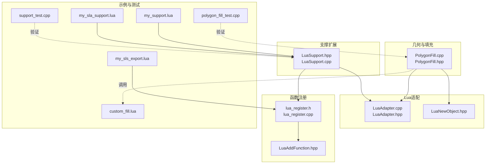
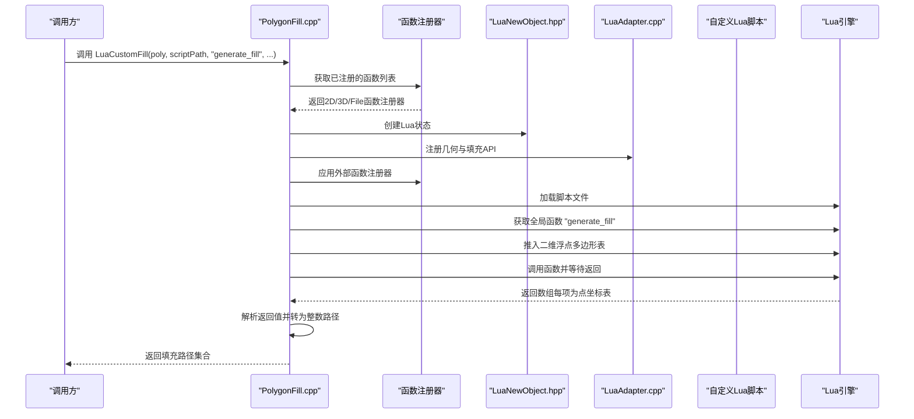
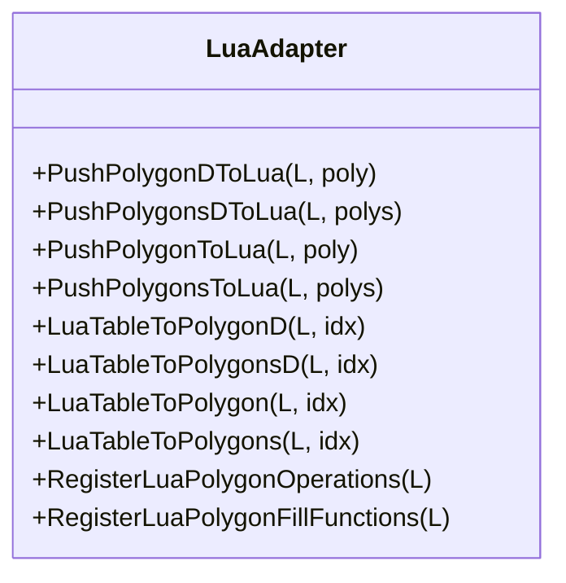
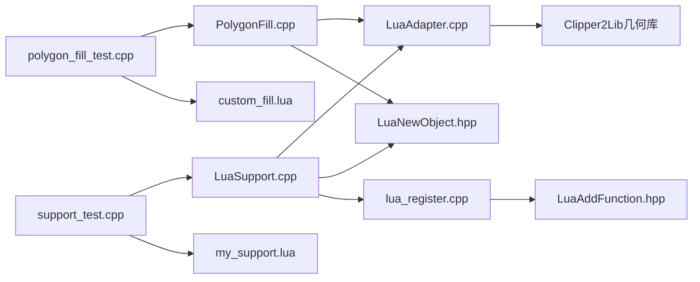

# Lua脚本扩展

<cite>
**本文引用的文件**
- [2D/LuaAdapter.cpp](file://2D/LuaAdapter.cpp)
- [2D/LuaAdapter.hpp](file://2D/LuaAdapter.hpp)
- [2D/PolygonFill.cpp](file://2D/PolygonFill.cpp)
- [2D/PolygonFill.hpp](file://2D/PolygonFill.hpp)
- [LibHsBaSlicer/Extends/LuaAddFunction.hpp](file://LibHsBaSlicer/Extends/LuaAddFunction.hpp)
- [DllHsBaSlicer/lua_register.h](file://DllHsBaSlicer/lua_register.h)
- [DllHsBaSlicer/lua_register.cpp](file://DllHsBaSlicer/lua_register.cpp)
- [support/LuaSupport.hpp](file://support/LuaSupport.hpp)
- [support/LuaSupport.cpp](file://support/LuaSupport.cpp)
- [samples/FDM/scripts/my_support.lua](file://samples/FDM/scripts/my_support.lua)
- [samples/SLA/scripts/my_sla_support.lua](file://samples/SLA/scripts/my_sla_support.lua)
- [samples/SLS/scripts/my_sls_export.lua](file://samples/SLS/scripts/my_sls_export.lua)
- [tests/PolygonFill/custom_fill.lua](file://tests/PolygonFill/custom_fill.lua)
- [tests/PolygonFill/polygon_fill_test.cpp](file://tests/PolygonFill/polygon_fill_test.cpp)
- [tests/PolygonFill/lua_polygon_operations_test.cpp](file://tests/PolygonFill/lua_polygon_operations_test.cpp)
- [tests/Support/support_test.cpp](file://tests/Support/support_test.cpp)
</cite>

## 更新摘要
**所做更改**
- 新增高级函数注册机制，支持2D函数（支撑、填充、SLA输出）、3D函数（切片、支撑）和文件函数（SLS、SLA输出）
- 添加事件回调注册功能，支持Zipper、数据库等系统事件
- 扩展LuaSupport类以支持外部函数注册和更丰富的配置选项
- 新增多个示例脚本展示不同流水线阶段的Lua扩展使用方式
- 更新API文档以反映新的函数类型和阶段映射关系

## 目录
1. [简介](#简介)
2. [项目结构](#项目结构)
3. [核心组件](#核心组件)
4. [架构总览](#架构总览)
5. [详细组件分析](#详细组件分析)
6. [依赖关系分析](#依赖关系分析)
7. [性能考量](#性能考量)
8. [故障排查指南](#故障排查指南)
9. [结论](#结论)
10. [附录](#附录)

## 简介
本文件系统性阐述HsBaSlicer如何通过Lua脚本实现路径填充算法的扩展与集成，重点围绕自定义路径填充函数的开发与调用流程。文档将解释LuaCustomFill函数的实现机制：如何加载Lua脚本、调用指定函数（如generate_fill）、如何向脚本传递二维浮点型多边形数据并接收填充路径结果；同时给出custom_fill.lua的编写规范、输入参数结构、输出格式要求以及可用的Lua注册函数（如几何操作）。结合PolygonFill.cpp中的lua_pcall调用流程与错误处理策略，展示C++与Lua之间的双向交互过程，并提供一个完整的锯齿形填充示例及在C++中的调用方式。最后总结常见问题与排查方法。

**更新** 新增高级函数注册机制，支持按流水线阶段分类的函数注册和事件回调系统。

## 项目结构
围绕Lua扩展的关键文件分布如下：
- 几何与填充逻辑：2D/PolygonFill.cpp、2D/PolygonFill.hpp
- Lua适配层：2D/LuaAdapter.cpp、2D/LuaAdapter.hpp
- 函数注册机制：LibHsBaSlicer/Extends/LuaAddFunction.hpp、DllHsBaSlicer/lua_register.h、DllHsBaSlicer/lua_register.cpp
- 支撑生成扩展：support/LuaSupport.hpp、support/LuaSupport.cpp
- 示例与测试：samples/*/scripts/*.lua、tests/PolygonFill/*、tests/Support/*



**图表来源**
- [2D/PolygonFill.cpp:1082-1240](file://2D/PolygonFill.cpp#L1082-L1240)
- [2D/LuaAdapter.cpp:282-287](file://2D/LuaAdapter.cpp#L282-L287)
- [LibHsBaSlicer/Extends/LuaAddFunction.hpp:1-39](file://LibHsBaSlicer/Extends/LuaAddFunction.hpp#L1-L39)
- [DllHsBaSlicer/lua_register.h:1-34](file://DllHsBaSlicer/lua_register.h#L1-L34)
- [support/LuaSupport.hpp:1-81](file://support/LuaSupport.hpp#L1-L81)

章节来源
- [2D/PolygonFill.cpp:1082-1240](file://2D/PolygonFill.cpp#L1082-L1240)
- [2D/LuaAdapter.cpp:1-287](file://2D/LuaAdapter.cpp#L1-L287)
- [LibHsBaSlicer/Extends/LuaAddFunction.hpp:1-39](file://LibHsBaSlicer/Extends/LuaAddFunction.hpp#L1-L39)
- [DllHsBaSlicer/lua_register.h:1-34](file://DllHsBaSlicer/lua_register.h#L1-L34)
- [support/LuaSupport.hpp:1-81](file://support/LuaSupport.hpp#L1-L81)
- [support/LuaSupport.cpp:1-171](file://support/LuaSupport.cpp#L1-L171)

## 核心组件
- **LuaCustomFill与LuaCustomFillString**：负责创建Lua状态、注册几何与填充API、加载脚本、调用用户函数并解析返回值。
- **Lua适配器（LuaAdapter）**：提供多边形与点表在C++与Lua之间的双向转换，以及常用几何操作的Lua注册函数。
- **高级函数注册机制**：通过LuaAddFunction.hpp和lua_register.h实现按阶段分类的函数注册，支持2D、3D和文件函数。
- **LuaSupport类**：增强的支撑生成器，支持外部函数注册和多种配置选项。
- **事件回调系统**：支持Zipper、数据库等系统事件的回调注册。
- **测试与示例**：提供最小可运行的自定义填充脚本与验证用例。

**更新** 新增高级函数注册机制和事件回调系统，提供更灵活的扩展能力。

章节来源
- [2D/PolygonFill.hpp:38-42](file://2D/PolygonFill.hpp#L38-L42)
- [2D/PolygonFill.cpp:1082-1240](file://2D/PolygonFill.cpp#L1082-L1240)
- [2D/LuaAdapter.cpp:1-287](file://2D/LuaAdapter.cpp#L1-L287)
- [LibHsBaSlicer/Extends/LuaAddFunction.hpp:1-39](file://LibHsBaSlicer/Extends/LuaAddFunction.hpp#L1-L39)
- [DllHsBaSlicer/lua_register.h:1-34](file://DllHsBaSlicer/lua_register.h#L1-L34)
- [support/LuaSupport.hpp:1-81](file://support/LuaSupport.hpp#L1-L81)

## 架构总览
下图展示了从C++到Lua再到返回路径的整体流程，包括新的函数注册机制。



**图表来源**
- [2D/PolygonFill.cpp:1082-1240](file://2D/PolygonFill.cpp#L1082-L1240)
- [LibHsBaSlicer/Extends/LuaAddFunction.hpp:19-35](file://LibHsBaSlicer/Extends/LuaAddFunction.hpp#L19-L35)
- [DllHsBaSlicer/lua_register.cpp:7-29](file://DllHsBaSlicer/lua_register.cpp#L7-L29)

## 详细组件分析

### 高级函数注册机制
**新增** 系统化的函数注册机制，支持按流水线阶段分类：

- **2D函数**：用于Support、Fill、SLA Output阶段
- **3D函数**：用于Slice、Support阶段  
- **File函数**：用于SLS Output、SLA Output阶段
- **事件回调**：用于Zipper、数据库等系统事件

```cpp
// C++ API
void HsBaAdd2DFunction(HsBaLuaRegFn func);
void HsBaAdd3DFunction(HsBaLuaRegFn func);
void HsBaAddFileFunction(HsBaLuaRegFn func);
void HsBaAddEventCallback(const char* event_name, HsBaLuaRegFn func);

// C++ 封装
void Add2DFunctions(LuaRegFunc func);
void Add3DFunctions(LuaRegFunc func);
void AddFileFunctions(LuaRegFunc func);
void AddEventCallback(const std::string& event_name, LuaRegFunc func);
```

**章节来源**
- [LibHsBaSlicer/Extends/LuaAddFunction.hpp:19-35](file://LibHsBaSlicer/Extends/LuaAddFunction.hpp#L19-L35)
- [DllHsBaSlicer/lua_register.h:17-27](file://DllHsBaSlicer/lua_register.h#L17-L27)
- [DllHsBaSlicer/lua_register.cpp:7-29](file://DllHsBaSlicer/lua_register.cpp#L7-L29)

### LuaSupport类增强
**更新** 增强的支撑生成器，支持外部函数注册：

- `SetExternalRegs()`：设置外部Lua注册函数
- 支持内联脚本和文件脚本两种模式
- 增强的配置传递机制
- 改进的错误处理和调试信息

```mermaid
classDiagram
class LuaSupport {
+SourceType source_type_
+std : : string script_
+std : : filesystem : : path script_file_
+std : : string func_name_
+std : : vector~std : : function<void(lua_State*)>~ ext_regs_
+Generate(current_layer, prev_layer, layer_height, config) PolygonsD
+SetExternalRegs(regs) void
}
class ISupport {
<<interface>>
+Generate(...) PolygonsD
+GenerateAll(...) std : : vector~PolygonsD~
}
LuaSupport --|> ISupport
```

**图表来源**
- [support/LuaSupport.hpp:36-77](file://support/LuaSupport.hpp#L36-L77)
- [support/LuaSupport.cpp:108-169](file://support/LuaSupport.cpp#L108-L169)

**章节来源**
- [support/LuaSupport.hpp:1-81](file://support/LuaSupport.hpp#L1-L81)
- [support/LuaSupport.cpp:1-171](file://support/LuaSupport.cpp#L1-L171)

### LuaCustomFill与LuaCustomFillString实现机制
- 创建Lua状态并打开标准库。
- 注册几何操作API与填充函数API。
- 加载脚本文件或直接执行字符串形式的脚本。
- 获取全局函数名（默认generate_fill），推入二维浮点多边形表作为唯一参数，调用后期望返回表。
- 遍历返回表，逐项读取点坐标{x,y}，构建浮点路径，再转换为整数路径并收集返回。


**图表来源**
- [2D/PolygonFill.cpp:1082-1240](file://2D/PolygonFill.cpp#L1082-L1240)

**章节来源**
- [2D/PolygonFill.cpp:1082-1240](file://2D/PolygonFill.cpp#L1082-L1240)

### Lua适配器：几何与填充API注册
- RegisterLuaPolygonOperations：将布尔运算、偏移、凸包、凹包、面积等几何操作注册为全局模块"PolygonOperations"，供脚本调用。
- RegisterLuaPolygonFillFunctions：将多种填充算法（直线、简单锯齿、锯齿、复合偏移、混合等）注册为全局模块"PolygonFill"，供脚本内部或外部调用。
- 提供双向转换函数：将C++侧的整数/浮点多边形与Lua侧的表结构互转，保证数据一致性。



**图表来源**
- [2D/LuaAdapter.cpp:149-287](file://2D/LuaAdapter.cpp#L149-L287)
- [2D/LuaAdapter.hpp:1-25](file://2D/LuaAdapter.hpp#L1-L25)

**章节来源**
- [2D/LuaAdapter.cpp:1-287](file://2D/LuaAdapter.cpp#L1-L287)
- [2D/LuaAdapter.hpp:1-25](file://2D/LuaAdapter.hpp#L1-L25)

### 自定义填充脚本编写规范（custom_fill.lua）
- 输入参数：poly（二维浮点型多边形表，包含外轮廓与可能的内孔）。
- 输出格式：返回一个数组，数组中每一项是一个路径（由点坐标表构成），每个点为{x=..., y=...}。
- 默认函数名：generate_fill（可通过LuaCustomFill指定其他函数名）。
- 可在脚本中使用已注册的几何与填充API（例如调用PolygonOperations或PolygonFill内的函数进行预处理）。

**更新** 新增多种示例脚本展示不同流水线阶段的使用方式：

- **FDM支撑脚本**：`samples/FDM/scripts/my_support.lua` - 演示FDM支撑生成
- **SLA支撑脚本**：`samples/SLA/scripts/my_sla_support.lua` - 演示SLA牺牲支撑
- **SLS导出脚本**：`samples/SLS/scripts/my_sls_export.lua` - 演示文件导出功能

**章节来源**
- [tests/PolygonFill/custom_fill.lua:1-16](file://tests/PolygonFill/custom_fill.lua#L1-L16)
- [samples/FDM/scripts/my_support.lua:1-83](file://samples/FDM/scripts/my_support.lua#L1-L83)
- [samples/SLA/scripts/my_sla_support.lua:1-76](file://samples/SLA/scripts/my_sla_support.lua#L1-L76)
- [samples/SLS/scripts/my_sls_export.lua:1-80](file://samples/SLS/scripts/my_sls_export.lua#L1-L80)
- [2D/PolygonFill.cpp:1082-1240](file://2D/PolygonFill.cpp#L1082-L1240)

### C++与Lua双向交互要点
- 数据传递：C++将整数多边形转换为浮点多边形后传入Lua；Lua返回的路径同样以浮点点表形式，C++再转换回整数路径。
- 错误处理：对脚本加载失败、函数不存在、调用失败、返回值类型不符等情况进行统一错误抛出。
- 栈管理：Lua适配器在读取表时遵循严格的栈平衡（push/pop），避免泄漏；LuaCustomFill在解析返回值时也保持栈平衡。
- **新增** 外部函数注册：在Lua状态初始化时应用所有注册的函数，确保脚本可以访问扩展功能。

**章节来源**
- [2D/LuaAdapter.cpp:149-287](file://2D/LuaAdapter.cpp#L149-L287)
- [2D/PolygonFill.cpp:1082-1240](file://2D/PolygonFill.cpp#L1082-L1240)
- [support/LuaSupport.cpp:117-119](file://support/LuaSupport.cpp#L117-L119)

### 完整示例：锯齿形填充（基于现有API）
虽然示例脚本未直接实现锯齿形填充，但可参考以下思路：
- 在脚本中调用PolygonFill模块的SimpleZigzagFill或ZigzagFill生成路径，再返回给C++。
- 或者在脚本中自行实现锯齿连接逻辑，返回路径数组。

**更新** 新增多种支撑生成示例：

- **FDM平面支撑**：使用内置悬垂检测器和平面支撑生成器
- **FDM树状支撑**：自动生成树状分支结构
- **FDM蜂窝支撑**：生成蜂窝状支撑结构
- **SLA牺牲支撑**：专为SLA工艺设计的牺牲支撑

**章节来源**
- [2D/PolygonFill.cpp:195-244](file://2D/PolygonFill.cpp#L195-L244)
- [tests/PolygonFill/polygon_fill_test.cpp:92-116](file://tests/PolygonFill/polygon_fill_test.cpp#L92-L116)
- [samples/FDM/scripts/my_support.lua:32-82](file://samples/FDM/scripts/my_support.lua#L32-L82)
- [samples/SLA/scripts/my_sla_support.lua:34-75](file://samples/SLA/scripts/my_sla_support.lua#L34-L75)

## 依赖关系分析
- PolygonFill.cpp依赖LuaAdapter进行数据转换与API注册。
- LuaAdapter依赖Clipper2Lib进行几何计算（布尔、偏移、凸包、凹包、面积等）。
- LuaNewObject.hpp提供Lua状态生命周期管理。
- **新增** LuaAddFunction.hpp提供函数注册机制的核心数据结构。
- **新增** lua_register.h/cpp提供C兼容的函数注册接口。
- **新增** LuaSupport类依赖LuaAdapter和LuaNewObject进行支撑生成的Lua扩展。
- 测试用例依赖PolygonFill接口与示例脚本验证行为。



**图表来源**
- [2D/PolygonFill.cpp:1082-1240](file://2D/PolygonFill.cpp#L1082-L1240)
- [2D/LuaAdapter.cpp:1-287](file://2D/LuaAdapter.cpp#L1-L287)
- [support/LuaSupport.cpp:1-171](file://support/LuaSupport.cpp#L1-L171)
- [LibHsBaSlicer/Extends/LuaAddFunction.hpp:1-39](file://LibHsBaSlicer/Extends/LuaAddFunction.hpp#L1-L39)
- [DllHsBaSlicer/lua_register.cpp:1-31](file://DllHsBaSlicer/lua_register.cpp#L1-L31)

**章节来源**
- [2D/PolygonFill.cpp:1082-1240](file://2D/PolygonFill.cpp#L1082-L1240)
- [2D/LuaAdapter.cpp:1-287](file://2D/LuaAdapter.cpp#L1-L287)
- [support/LuaSupport.cpp:1-171](file://support/LuaSupport.cpp#L1-L171)
- [LibHsBaSlicer/Extends/LuaAddFunction.hpp:1-39](file://LibHsBaSlicer/Extends/LuaAddFunction.hpp#L1-L39)
- [DllHsBaSlicer/lua_register.cpp:1-31](file://DllHsBaSlicer/lua_register.cpp#L1-L31)

## 性能考量
- 多边形精度转换：在C++与Lua之间往返转换浮点与整数坐标时，注意精度损失与开销；尽量在脚本中完成必要的几何预处理，减少重复计算。
- 填充算法复杂度：锯齿形填充涉及扫描线、区间重叠与桥接，时间复杂度较高；建议在脚本中控制spacing与angle_deg，避免过密网格。
- Lua状态复用：当前实现每次调用都会创建新的Lua状态；若频繁调用，可考虑在上层缓存Lua状态以降低初始化成本（需谨慎处理全局状态污染）。
- **新增** 函数注册开销：函数注册在启动时执行一次，运行时查找开销极小，适合大量扩展功能的场景。
- **新增** 事件回调性能：事件回调采用轻量级注册机制，仅在事件触发时执行，不影响正常流水线性能。

## 故障排查指南
- **Lua栈管理错误**
  - 现象：调用后栈不平衡导致崩溃或异常。
  - 排查：检查所有Push/Pop配对，确保在读取表项时及时弹出临时值；参考LuaAdapter与LuaCustomFill中的栈操作模式。
  - 参考位置：[2D/LuaAdapter.cpp:149-287](file://2D/LuaAdapter.cpp#L149-L287)，[2D/PolygonFill.cpp:1122-1166](file://2D/PolygonFill.cpp#L1122-L1166)

- **类型不匹配**
  - 现象：脚本返回非表、点字段缺失或类型错误。
  - 排查：确认返回值为数组，且每项为点表，点表包含x、y数值；参考测试用例的返回格式。
  - 参考位置：[tests/PolygonFill/custom_fill.lua:1-16](file://tests/PolygonFill/custom_fill.lua#L1-L16)，[2D/PolygonFill.cpp:1122-1166](file://2D/PolygonFill.cpp#L1122-L1166)

- **脚本路径无效**
  - 现象：加载脚本报错或找不到函数。
  - 排查：确认脚本路径存在且可读；检查函数名与调用一致；必要时先在独立环境中验证脚本语法。
  - 参考位置：[2D/PolygonFill.cpp:1099-1110](file://2D/PolygonFill.cpp#L1099-L1110)

- **函数不存在**
  - 现象：lua_isfunction检测失败。
  - 排查：确认脚本中定义了目标函数名；若使用LuaCustomFillString，请确保函数名与传入一致。
  - 参考位置：[2D/PolygonFill.cpp:1106-1110](file://2D/PolygonFill.cpp#L1106-L1110)

- **调用失败**
  - 现象：lua_pcall返回错误。
  - 排查：查看错误信息并定位脚本中的语法或运行时错误；优先在独立Lua环境中调试。
  - 参考位置：[2D/PolygonFill.cpp:1100-1103](file://2D/PolygonFill.cpp#L1100-L1103)，[2D/PolygonFill.cpp:1194-1205](file://2D/PolygonFill.cpp#L1194-L1205)

- **新增** 函数注册失败
  - 现象：脚本无法访问注册的扩展函数。
  - 排查：确认函数注册在流水线开始前执行；检查函数名称是否冲突；验证注册函数指针的有效性。
  - 参考位置：[DllHsBaSlicer/lua_register.cpp:7-29](file://DllHsBaSlicer/lua_register.cpp#L7-L29)

- **新增** 事件回调未触发
  - 现象：注册的事件回调没有被调用。
  - 排查：确认事件名称完全匹配；检查回调注册时机；验证事件触发条件是否满足。
  - 参考位置：[LibHsBaSlicer/Extends/LuaAddFunction.hpp:33-35](file://LibHsBaSlicer/Extends/LuaAddFunction.hpp#L33-L35)

## 结论
通过LuaCustomFill与LuaCustomFillString，HsBaSlicer实现了灵活的自定义路径填充扩展。**更新** 新增的高级函数注册机制和事件回调系统进一步增强了扩展能力，支持按流水线阶段分类的函数管理和系统事件处理。C++侧负责创建Lua状态、注册API、加载脚本与解析结果，Lua侧负责实现具体的填充算法或调用内置填充函数。借助LuaAdapter提供的几何与填充API，开发者可以在脚本中完成复杂的几何预处理与路径生成，最终以统一的数据格式返回给C++。配合完善的错误处理与测试用例，该机制既保证了易用性，又具备良好的可维护性与可扩展性。

## 附录

### API一览与使用建议
- **注册API（供脚本调用）**
  - PolygonOperations：布尔运算、偏移、凸包、凹包、面积等。
  - PolygonFill：直线填充、简单锯齿、锯齿、复合偏移、混合等。
  - Support模块：平面支撑、树状支撑、蜂窝支撑、SLA支撑生成器。
  - File操作：Zipper压缩、Cipher加密、数据库操作等。

- **函数注册API（供C++调用）**
  - HsBaAdd2DFunction：注册2D函数（Support、Fill、SLA Output）
  - HsBaAdd3DFunction：注册3D函数（Slice、Support）
  - HsBaAddFileFunction：注册文件函数（SLS Output、SLA Output）
  - HsBaAddEventCallback：注册事件回调（Zipper、数据库等）

- **调用方式**
  - 在脚本中直接调用：例如PolygonOperations.booleanOperation(...)、Support.generate(...)。
  - 在C++中调用：通过LuaCustomFill或LuaCustomFillString加载脚本并调用指定函数。
  - 注册扩展函数：在流水线开始前调用相应的注册函数。

**章节来源**
- [2D/LuaAdapter.cpp:134-145](file://2D/LuaAdapter.cpp#L134-L145)
- [2D/LuaAdapter.cpp:282-287](file://2D/LuaAdapter.cpp#L282-L287)
- [2D/PolygonFill.cpp:195-244](file://2D/PolygonFill.cpp#L195-L244)
- [DllHsBaSlicer/lua_register.h:17-27](file://DllHsBaSlicer/lua_register.h#L17-L27)
- [LibHsBaSlicer/Extends/LuaAddFunction.hpp:19-35](file://LibHsBaSlicer/Extends/LuaAddFunction.hpp#L19-L35)

### 示例脚本与测试对照
- **示例脚本**：
  - custom_fill.lua：返回两条对角线路径
  - my_support.lua：FDM支撑生成示例
  - my_sla_support.lua：SLA支撑生成示例  
  - my_sls_export.lua：SLS文件导出示例

- **测试用例**：验证LuaCustomFill与LuaCustomFillString的行为，确保返回路径均为2点线段。

**章节来源**
- [tests/PolygonFill/custom_fill.lua:1-16](file://tests/PolygonFill/custom_fill.lua#L1-L16)
- [tests/PolygonFill/polygon_fill_test.cpp:92-116](file://tests/PolygonFill/polygon_fill_test.cpp#L92-L116)
- [samples/FDM/scripts/my_support.lua:1-83](file://samples/FDM/scripts/my_support.lua#L1-L83)
- [samples/SLA/scripts/my_sla_support.lua:1-76](file://samples/SLA/scripts/my_sla_support.lua#L1-L76)
- [samples/SLS/scripts/my_sls_export.lua:1-80](file://samples/SLS/scripts/my_sls_export.lua#L1-L80)
- [tests/Support/support_test.cpp:211-292](file://tests/Support/support_test.cpp#L211-L292)

### 流水线阶段函数类型映射
| 流水线阶段 | 可用函数类型 | 说明 |
| --- | --- | --- |
| Slice（切片） | 3D | 3D模型操作 |
| Support（支撑） | 2D + 3D | 2D轮廓 + 3D模型 |
| Fill（填充） | 2D | 2D多边形操作 |
| SLS Output（SLS输出） | File | 文件输出操作 |
| SLA Output（SLA输出） | 2D + File | 2D + 文件输出 |

**章节来源**
- [docs/zh/LibHsBaSlicer/README.md:72-80](file://docs/zh/LibHsBaSlicer/README.md#L72-L80)
- [docs/en/DllHsBaSlicer/game_engine_integration.md:443-451](file://docs/en/DllHsBaSlicer/game_engine_integration.md#L443-L451)
- [docs/en/DllHsBaSlicer/qt_wxwidgets_integration.md:328-336](file://docs/en/DllHsBaSlicer/qt_wxwidgets_integration.md#L328-L336)