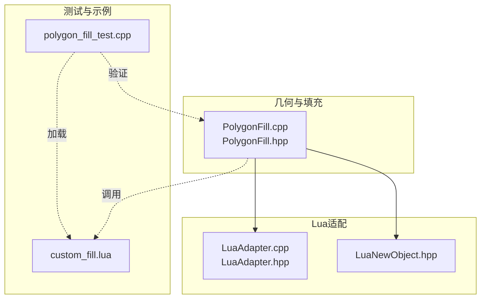
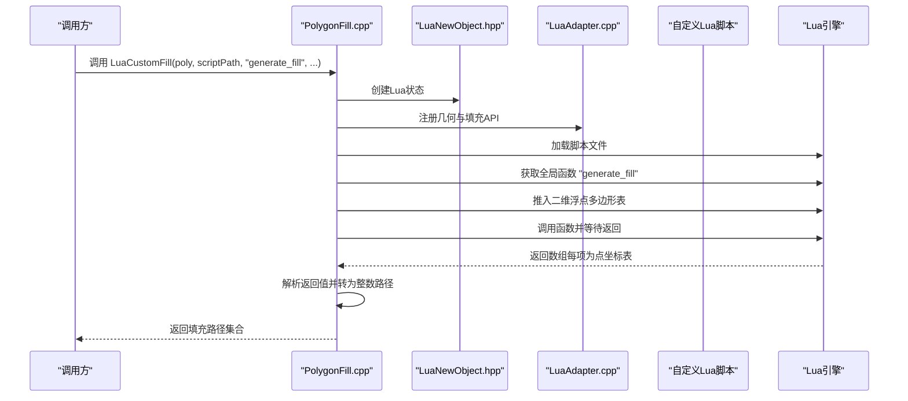
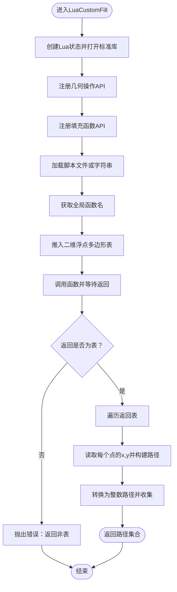
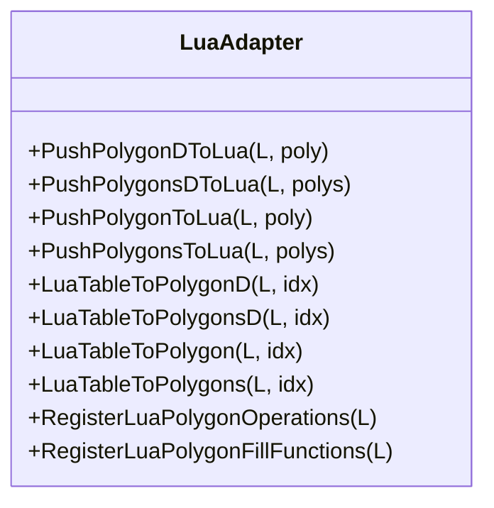
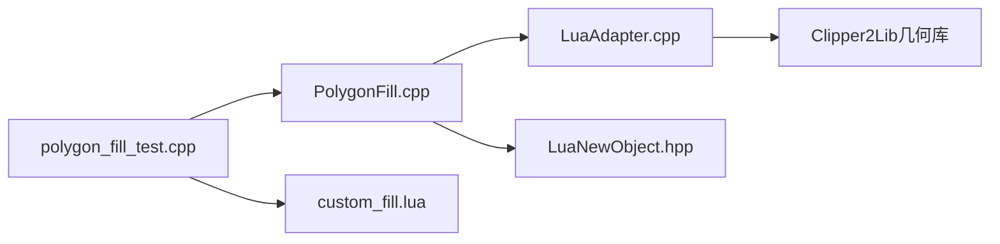

# Lua脚本扩展

<cite>
**本文引用的文件**
- [2D/LuaAdapter.cpp](file://2D/LuaAdapter.cpp)
- [2D/LuaAdapter.hpp](file://2D/LuaAdapter.hpp)
- [2D/PolygonFill.cpp](file://2D/PolygonFill.cpp)
- [2D/PolygonFill.hpp](file://2D/PolygonFill.hpp)
- [utils/LuaNewObject.hpp](file://utils/LuaNewObject.hpp)
- [tests/PolygonFill/custom_fill.lua](file://tests/PolygonFill/custom_fill.lua)
- [tests/PolygonFill/polygon_fill_test.cpp](file://tests/PolygonFill/polygon_fill_test.cpp)
</cite>

## 目录
1. [简介](#简介)
2. [项目结构](#项目结构)
3. [核心组件](#核心组件)
4. [架构总览](#架构总览)
5. [详细组件分析](#详细组件分析)
6. [依赖关系分析](#依赖关系分析)
7. [性能考量](#性能考量)
8. [故障排查指南](#故障排查指南)
9. [结论](#结论)
10. [附录](#附录)

## 简介
本文件系统性阐述HsBaSlicer如何通过Lua脚本实现路径填充算法的扩展与集成，重点围绕自定义路径填充函数的开发与调用流程。文档将解释LuaCustomFill函数的实现机制：如何加载Lua脚本、调用指定函数（如generate_fill）、如何向脚本传递二维浮点型多边形数据并接收填充路径结果；同时给出custom_fill.lua的编写规范、输入参数结构、输出格式要求以及可用的Lua注册函数（如几何操作）。结合PolygonFill.cpp中的lua_pcall调用流程与错误处理策略，展示C++与Lua之间的双向交互过程，并提供一个完整的锯齿形填充示例及在C++中的调用方式。最后总结常见问题与排查方法。

## 项目结构
围绕Lua扩展的关键文件分布如下：
- 几何与填充逻辑：2D/PolygonFill.cpp、2D/PolygonFill.hpp
- Lua适配层：2D/LuaAdapter.cpp、2D/LuaAdapter.hpp
- Lua状态管理：utils/LuaNewObject.hpp
- 示例与测试：tests/PolygonFill/custom_fill.lua、tests/PolygonFill/polygon_fill_test.cpp

图表来源
- [2D/PolygonFill.cpp](file://2D/PolygonFill.cpp#L1082-L1240)
- [2D/LuaAdapter.cpp](file://2D/LuaAdapter.cpp#L282-L287)
- [utils/LuaNewObject.hpp](file://utils/LuaNewObject.hpp#L47-L62)
- [tests/PolygonFill/custom_fill.lua](file://tests/PolygonFill/custom_fill.lua#L1-L16)
- [tests/PolygonFill/polygon_fill_test.cpp](file://tests/PolygonFill/polygon_fill_test.cpp#L92-L116)

章节来源
- [2D/PolygonFill.cpp](file://2D/PolygonFill.cpp#L1082-L1240)
- [2D/LuaAdapter.cpp](file://2D/LuaAdapter.cpp#L1-L287)
- [utils/LuaNewObject.hpp](file://utils/LuaNewObject.hpp#L1-L64)
- [tests/PolygonFill/custom_fill.lua](file://tests/PolygonFill/custom_fill.lua#L1-L16)
- [tests/PolygonFill/polygon_fill_test.cpp](file://tests/PolygonFill/polygon_fill_test.cpp#L1-L117)

## 核心组件
- LuaCustomFill与LuaCustomFillString：负责创建Lua状态、注册几何与填充API、加载脚本、调用用户函数并解析返回值。
- Lua适配器（LuaAdapter）：提供多边形与点表在C++与Lua之间的双向转换，以及常用几何操作的Lua注册函数。
- Lua状态管理：封装Lua状态生命周期，确保正确创建与释放。
- 测试与示例：提供最小可运行的自定义填充脚本与验证用例。

章节来源
- [2D/PolygonFill.hpp](file://2D/PolygonFill.hpp#L38-L42)
- [2D/PolygonFill.cpp](file://2D/PolygonFill.cpp#L1082-L1240)
- [2D/LuaAdapter.cpp](file://2D/LuaAdapter.cpp#L1-L287)
- [utils/LuaNewObject.hpp](file://utils/LuaNewObject.hpp#L47-L62)
- [tests/PolygonFill/custom_fill.lua](file://tests/PolygonFill/custom_fill.lua#L1-L16)
- [tests/PolygonFill/polygon_fill_test.cpp](file://tests/PolygonFill/polygon_fill_test.cpp#L92-L116)

## 架构总览
下图展示了从C++到Lua再到返回路径的整体流程。

图表来源
- [2D/PolygonFill.cpp](file://2D/PolygonFill.cpp#L1082-L1240)
- [2D/LuaAdapter.cpp](file://2D/LuaAdapter.cpp#L282-L287)
- [utils/LuaNewObject.hpp](file://utils/LuaNewObject.hpp#L47-L62)

## 详细组件分析

### LuaCustomFill与LuaCustomFillString实现机制
- 创建Lua状态并打开标准库。
- 注册几何操作API与填充函数API。
- 加载脚本文件或直接执行字符串形式的脚本。
- 获取全局函数名（默认generate_fill），推入二维浮点多边形表作为唯一参数，调用后期望返回表。
- 遍历返回表，逐项读取点坐标{x,y}，构建浮点路径，再转换为整数路径并收集返回。

图表来源
- [2D/PolygonFill.cpp](file://2D/PolygonFill.cpp#L1082-L1240)

章节来源
- [2D/PolygonFill.cpp](file://2D/PolygonFill.cpp#L1082-L1240)

### Lua适配器：几何与填充API注册
- RegisterLuaPolygonOperations：将布尔运算、偏移、凸包、凹包、面积等几何操作注册为全局模块“PolygonOperations”，供脚本调用。
- RegisterLuaPolygonFillFunctions：将多种填充算法（直线、简单锯齿、锯齿、复合偏移、混合等）注册为全局模块“PolygonFill”，供脚本内部或外部调用。
- 提供双向转换函数：将C++侧的整数/浮点多边形与Lua侧的表结构互转，保证数据一致性。

图表来源
- [2D/LuaAdapter.cpp](file://2D/LuaAdapter.cpp#L149-L287)
- [2D/LuaAdapter.hpp](file://2D/LuaAdapter.hpp#L1-L25)

章节来源
- [2D/LuaAdapter.cpp](file://2D/LuaAdapter.cpp#L1-L287)
- [2D/LuaAdapter.hpp](file://2D/LuaAdapter.hpp#L1-L25)

### 自定义填充脚本编写规范（custom_fill.lua）
- 输入参数：poly（二维浮点型多边形表，包含外轮廓与可能的内孔）。
- 输出格式：返回一个数组，数组中每一项是一个路径（由点坐标表构成），每个点为{x=..., y=...}。
- 默认函数名：generate_fill（可通过LuaCustomFill指定其他函数名）。
- 可在脚本中使用已注册的几何与填充API（例如调用PolygonOperations或PolygonFill内的函数进行预处理）。

章节来源
- [tests/PolygonFill/custom_fill.lua](file://tests/PolygonFill/custom_fill.lua#L1-L16)
- [2D/PolygonFill.cpp](file://2D/PolygonFill.cpp#L1082-L1240)

### C++与Lua双向交互要点
- 数据传递：C++将整数多边形转换为浮点多边形后传入Lua；Lua返回的路径同样以浮点点表形式，C++再转换回整数路径。
- 错误处理：对脚本加载失败、函数不存在、调用失败、返回值类型不符等情况进行统一错误抛出。
- 栈管理：Lua适配器在读取表时遵循严格的栈平衡（push/pop），避免泄漏；LuaCustomFill在解析返回值时也保持栈平衡。

章节来源
- [2D/LuaAdapter.cpp](file://2D/LuaAdapter.cpp#L149-L287)
- [2D/PolygonFill.cpp](file://2D/PolygonFill.cpp#L1082-L1240)

### 完整示例：锯齿形填充（基于现有API）
虽然示例脚本未直接实现锯齿形填充，但可参考以下思路：
- 在脚本中调用PolygonFill模块的SimpleZigzagFill或ZigzagFill生成路径，再返回给C++。
- 或者在脚本中自行实现锯齿连接逻辑，返回路径数组。

章节来源
- [2D/PolygonFill.cpp](file://2D/PolygonFill.cpp#L195-L244)
- [tests/PolygonFill/polygon_fill_test.cpp](file://tests/PolygonFill/polygon_fill_test.cpp#L92-L116)

## 依赖关系分析
- PolygonFill.cpp依赖LuaAdapter进行数据转换与API注册。
- LuaAdapter依赖Clipper2Lib进行几何计算（布尔、偏移、凸包、凹包、面积等）。
- LuaNewObject.hpp提供Lua状态生命周期管理。
- 测试用例依赖PolygonFill接口与示例脚本验证行为。

图表来源
- [2D/PolygonFill.cpp](file://2D/PolygonFill.cpp#L1082-L1240)
- [2D/LuaAdapter.cpp](file://2D/LuaAdapter.cpp#L1-L287)
- [utils/LuaNewObject.hpp](file://utils/LuaNewObject.hpp#L47-L62)
- [tests/PolygonFill/polygon_fill_test.cpp](file://tests/PolygonFill/polygon_fill_test.cpp#L92-L116)
- [tests/PolygonFill/custom_fill.lua](file://tests/PolygonFill/custom_fill.lua#L1-L16)

章节来源
- [2D/PolygonFill.cpp](file://2D/PolygonFill.cpp#L1082-L1240)
- [2D/LuaAdapter.cpp](file://2D/LuaAdapter.cpp#L1-L287)
- [utils/LuaNewObject.hpp](file://utils/LuaNewObject.hpp#L1-L64)
- [tests/PolygonFill/polygon_fill_test.cpp](file://tests/PolygonFill/polygon_fill_test.cpp#L1-L117)
- [tests/PolygonFill/custom_fill.lua](file://tests/PolygonFill/custom_fill.lua#L1-L16)

## 性能考量
- 多边形精度转换：在C++与Lua之间往返转换浮点与整数坐标时，注意精度损失与开销；尽量在脚本中完成必要的几何预处理，减少重复计算。
- 填充算法复杂度：锯齿形填充涉及扫描线、区间重叠与桥接，时间复杂度较高；建议在脚本中控制spacing与angle_deg，避免过密网格。
- Lua状态复用：当前实现每次调用都会创建新的Lua状态；若频繁调用，可考虑在上层缓存Lua状态以降低初始化成本（需谨慎处理全局状态污染）。

[本节为通用指导，不直接分析具体文件]

## 故障排查指南
- Lua栈管理错误
  - 现象：调用后栈不平衡导致崩溃或异常。
  - 排查：检查所有Push/Pop配对，确保在读取表项时及时弹出临时值；参考LuaAdapter与LuaCustomFill中的栈操作模式。
  - 参考位置：[2D/LuaAdapter.cpp](file://2D/LuaAdapter.cpp#L149-L287)，[2D/PolygonFill.cpp](file://2D/PolygonFill.cpp#L1122-L1166)

- 类型不匹配
  - 现象：脚本返回非表、点字段缺失或类型错误。
  - 排查：确认返回值为数组，且每项为点表，点表包含x、y数值；参考测试用例的返回格式。
  - 参考位置：[tests/PolygonFill/custom_fill.lua](file://tests/PolygonFill/custom_fill.lua#L1-L16)，[2D/PolygonFill.cpp](file://2D/PolygonFill.cpp#L1122-L1166)

- 脚本路径无效
  - 现象：加载脚本报错或找不到函数。
  - 排查：确认脚本路径存在且可读；检查函数名与调用一致；必要时先在独立环境中验证脚本语法。
  - 参考位置：[2D/PolygonFill.cpp](file://2D/PolygonFill.cpp#L1099-L1110)

- 函数不存在
  - 现象：lua_isfunction检测失败。
  - 排查：确认脚本中定义了目标函数名；若使用LuaCustomFillString，请确保函数名与传入一致。
  - 参考位置：[2D/PolygonFill.cpp](file://2D/PolygonFill.cpp#L1106-L1110)

- 调用失败
  - 现象：lua_pcall返回错误。
  - 排查：查看错误信息并定位脚本中的语法或运行时错误；优先在独立Lua环境中调试。
  - 参考位置：[2D/PolygonFill.cpp](file://2D/PolygonFill.cpp#L1100-L1103)，[2D/PolygonFill.cpp](file://2D/PolygonFill.cpp#L1194-L1205)

## 结论
通过LuaCustomFill与LuaCustomFillString，HsBaSlicer实现了灵活的自定义路径填充扩展。C++侧负责创建Lua状态、注册API、加载脚本与解析结果，Lua侧负责实现具体的填充算法或调用内置填充函数。借助LuaAdapter提供的几何与填充API，开发者可以在脚本中完成复杂的几何预处理与路径生成，最终以统一的数据格式返回给C++。配合完善的错误处理与测试用例，该机制既保证了易用性，又具备良好的可维护性与可扩展性。

[本节为总结，不直接分析具体文件]

## 附录

### API一览与使用建议
- 注册API（供脚本调用）
  - PolygonOperations：布尔运算、偏移、凸包、凹包、面积等。
  - PolygonFill：直线填充、简单锯齿、锯齿、复合偏移、混合等。
- 调用方式
  - 在脚本中直接调用：例如PolygonOperations.booleanOperation(...)、PolygonFill.zigzagFill(...)。
  - 在C++中调用：通过LuaCustomFill或LuaCustomFillString加载脚本并调用指定函数。

章节来源
- [2D/LuaAdapter.cpp](file://2D/LuaAdapter.cpp#L134-L145)
- [2D/LuaAdapter.cpp](file://2D/LuaAdapter.cpp#L282-L287)
- [2D/PolygonFill.cpp](file://2D/PolygonFill.cpp#L195-L244)

### 示例脚本与测试对照
- 示例脚本：返回两条对角线路径。
- 测试用例：验证LuaCustomFill与LuaCustomFillString的行为，确保返回路径均为2点线段。

章节来源
- [tests/PolygonFill/custom_fill.lua](file://tests/PolygonFill/custom_fill.lua#L1-L16)
- [tests/PolygonFill/polygon_fill_test.cpp](file://tests/PolygonFill/polygon_fill_test.cpp#L92-L116)