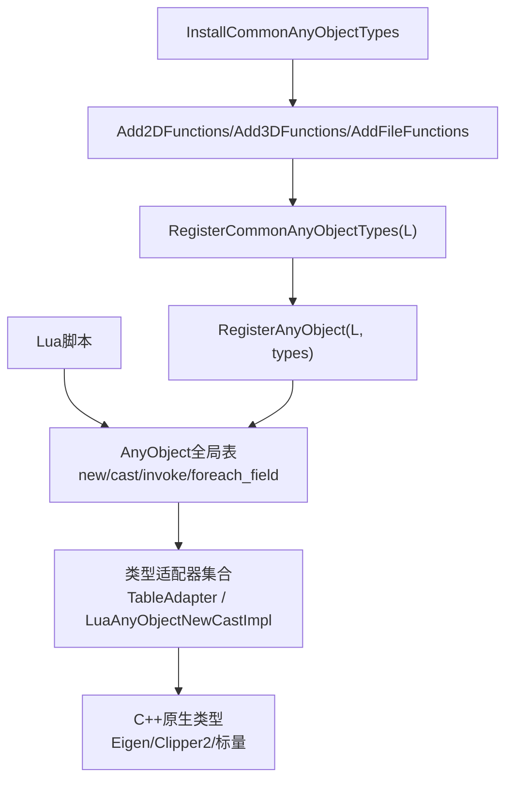
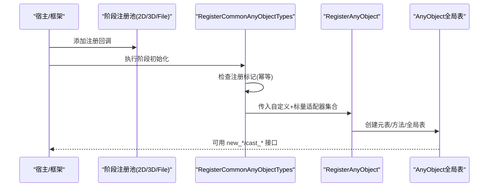
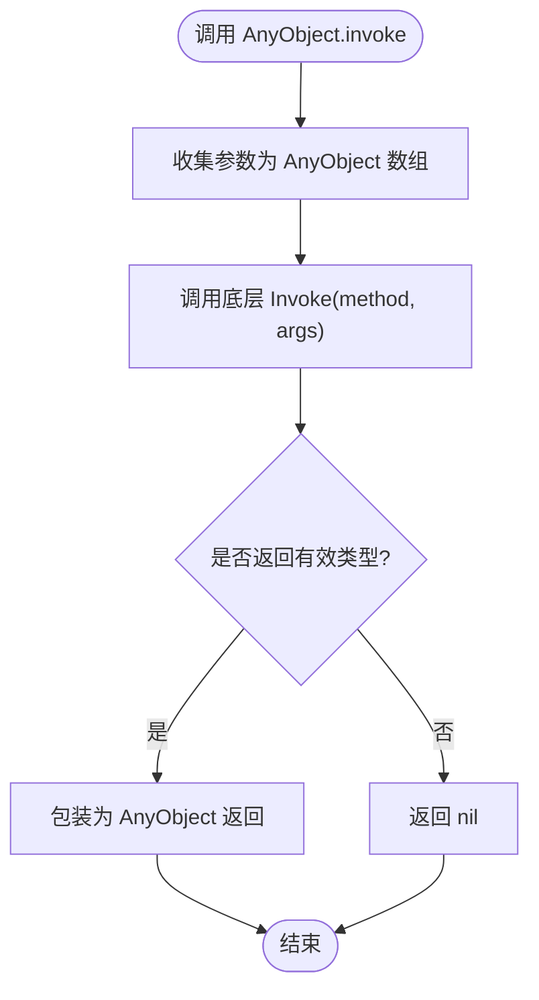
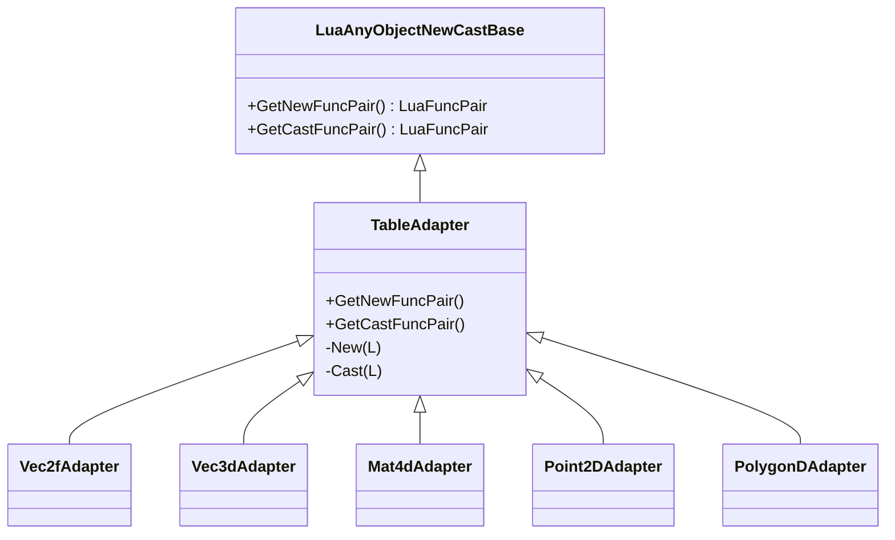
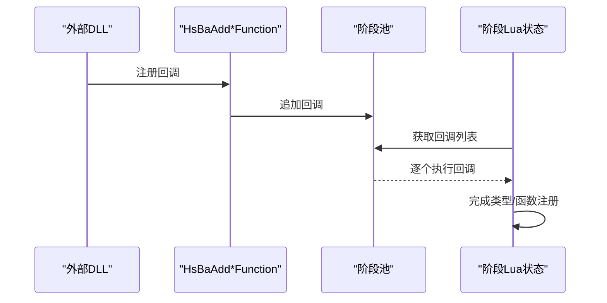
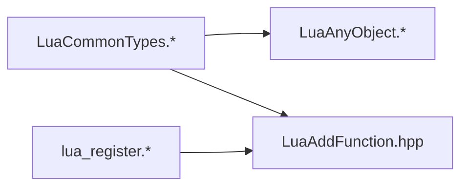

# Lua通用类型注册系统

<cite>
**本文引用的文件**
- [LuaCommonTypes.hpp](file://LibHsBaSlicer/Extends/LuaCommonTypes.hpp)
- [LuaCommonTypes.cpp](file://LibHsBaSlicer/Extends/LuaCommonTypes.cpp)
- [LuaAnyObject.hpp](file://utils/LuaAnyObject.hpp)
- [LuaAnyObject.cpp](file://utils/LuaAnyObject.cpp)
- [lua_register.h](file://DllHsBaSlicer/lua_register.h)
- [lua_register.cpp](file://DllHsBaSlicer/lua_register.cpp)
- [LuaAddFunction.hpp](file://LibHsBaSlicer/Extends/LuaAddFunction.hpp)
</cite>

## 目录
1. [简介](#简介)
2. [项目结构](#项目结构)
3. [核心组件](#核心组件)
4. [架构总览](#架构总览)
5. [详细组件分析](#详细组件分析)
6. [依赖关系分析](#依赖关系分析)
7. [性能与内存特性](#性能与内存特性)
8. [故障排查指南](#故障排查指南)
9. [结论](#结论)
10. [附录：类型与表格式约定](#附录类型与表格式约定)

## 简介
本系统为 HsBaSlicer 提供一套“Lua 通用类型注册机制”，将 C++ 常用几何与数值类型（如 Eigen 向量/矩阵/四元数、Clipper2 点与多边形）以及基础标量类型，统一通过 AnyObject 暴露给 Lua。其目标是：
- 在 Lua 中以表格形式读写复杂数据结构；
- 通过统一的 new_*/cast_* 接口在 Lua 与 C++ 之间进行零拷贝或受控拷贝转换；
- 以可插拔方式向不同流水线阶段（2D/3D/File）注入类型注册逻辑；
- 保证线程安全、幂等安装，避免重复注册导致的状态覆盖。

## 项目结构
围绕该系统的核心代码分布在以下模块：
- LibHsBaSlicer/Extends：定义并实现通用类型的反射元数据与 Lua 适配器，并提供按阶段注入的注册函数。
- utils：实现 AnyObject 的 Lua 绑定、元表与方法分发，以及基础标量类型的 new_/cast_ 适配。
- DllHsBaSlicer：对外暴露 C 风格的注册入口，供外部 DLL 或宿主进程调用。

图表来源
- [LuaCommonTypes.cpp:439-492](file://LibHsBaSlicer/Extends/LuaCommonTypes.cpp#L439-L492)
- [LuaAnyObject.cpp:123-171](file://utils/LuaAnyObject.cpp#L123-L171)
- [LuaAddFunction.hpp:17-35](file://LibHsBaSlicer/Extends/LuaAddFunction.hpp#L17-L35)

章节来源
- [LuaCommonTypes.hpp:20-45](file://LibHsBaSlicer/Extends/LuaCommonTypes.hpp#L20-L45)
- [LuaCommonTypes.cpp:1-20](file://LibHsBaSlicer/Extends/LuaCommonTypes.cpp#L1-L20)
- [LuaAnyObject.hpp:11-17](file://utils/LuaAnyObject.hpp#L11-L17)
- [lua_register.h:9-27](file://DllHsBaSlicer/lua_register.h#L9-L27)

## 核心组件
- AnyObject 绑定层（utils/LuaAnyObject.*）
  - 定义 AnyObject 的 Lua 元表与方法（invoke、foreach_field、__gc）。
  - 提供 RegisterAnyObject(L, added_types)，将各类型的 new_/cast_ 方法挂载到全局 AnyObject 表及实例方法表。
  - 内置基础标量类型的适配器（int/long/longlong/size_t/double/float/bool/string/cstring）。

- 通用类型反射与适配器（LibHsBaSlicer/Extends/LuaCommonTypes.*）
  - 通过宏为 Eigen 向量/矩阵/四元数、Clipper2 点/多边形等类型生成 TypeInfo，暴露字段 x/y/z/w 与 cast_<Name> 方法。
  - 使用 TableAdapter 模板为每种类型生成 Lua 表格与 C++ 对象之间的双向转换。
  - 提供 GetCommonAnyObjectTypes() 返回所有自定义类型适配器列表。
  - 提供 RegisterCommonAnyObjectTypes(L) 合并内置标量与自定义类型，一次性完成注册。
  - 提供 InstallCommonAnyObjectTypes() 将注册函数注入 2D/3D/File 三类管道池，确保各阶段可用。

- 插件化注册入口（DllHsBaSlicer/lua_register.*）
  - 暴露 HsBaAdd2DFunction/HsBaAdd3DFunction/HsBaAddFileFunction/HsBaAddEventCallback 等 C 接口，便于外部扩展。

章节来源
- [LuaAnyObject.hpp:21-44](file://utils/LuaAnyObject.hpp#L21-L44)
- [LuaAnyObject.cpp:123-171](file://utils/LuaAnyObject.cpp#L123-L171)
- [LuaCommonTypes.hpp:83-143](file://LibHsBaSlicer/Extends/LuaCommonTypes.hpp#L83-L143)
- [LuaCommonTypes.cpp:309-437](file://LibHsBaSlicer/Extends/LuaCommonTypes.cpp#L309-L437)
- [lua_register.h:17-27](file://DllHsBaSlicer/lua_register.h#L17-L27)
- [lua_register.cpp:5-30](file://DllHsBaSlicer/lua_register.cpp#L5-L30)

## 架构总览
系统采用“适配器 + 注册器”的分层设计：
- 适配器层：每个类型一个适配器，负责 Lua 表格与 C++ 对象的互转，并暴露 new_*/cast_* 两个函数。
- 注册器层：收集所有适配器，创建 AnyObject 元表与方法，并将 new_/cast_ 挂入全局表。
- 注入层：通过 AddXxxFunctions 将注册函数推入不同阶段的 Lua 状态构建池，由框架统一执行。
- 幂等保护：在 Lua 注册表中设置标记位，防止同一 lua_State 被重复注册导致全局表重建。

图表来源
- [LuaCommonTypes.cpp:439-492](file://LibHsBaSlicer/Extends/LuaCommonTypes.cpp#L439-L492)
- [LuaAnyObject.cpp:123-171](file://utils/LuaAnyObject.cpp#L123-L171)
- [LuaAddFunction.hpp:17-35](file://LibHsBaSlicer/Extends/LuaAddFunction.hpp#L17-L35)

## 详细组件分析

### AnyObject 绑定与分发（utils/LuaAnyObject.*）
- 职责
  - 创建 AnyObject 的 Lua 元表，绑定 __gc、invoke、foreach_field。
  - 将各类型的 new_/cast_ 方法注册到全局 AnyObject 表与实例方法表。
  - 处理参数收集与异常回传，保证 Lua 侧错误可追踪。
- 关键流程
  - RegisterAnyObject(L, added_types)：遍历适配器，获取 name+func 对，写入全局表与元表。
  - invoke：收集任意数量参数，封装为 AnyObject 数组，调用底层 Invoke，结果再包装回 Lua。
  - foreach_field：基于 TypeInfo.fields 迭代字段，回调 Lua 函数传递字段名与值。

图表来源
- [LuaAnyObject.cpp:13-80](file://utils/LuaAnyObject.cpp#L13-L80)
- [LuaAnyObject.cpp:123-171](file://utils/LuaAnyObject.cpp#L123-L171)

章节来源
- [LuaAnyObject.hpp:21-44](file://utils/LuaAnyObject.hpp#L21-L44)
- [LuaAnyObject.cpp:13-80](file://utils/LuaAnyObject.cpp#L13-L80)
- [LuaAnyObject.cpp:123-171](file://utils/LuaAnyObject.cpp#L123-L171)

### 通用类型反射与适配器（LibHsBaSlicer/Extends/LuaCommonTypes.*）
- 反射元数据
  - 通过 HSBA_DEFINE_REFLECTED_TYPEINFO/HSBA_DEFINE_OPAQUE_TYPEINFO 为类型生成 TypeInfo，包含 Name、字段偏移、cast_<Name> 方法。
  - 支持连续存储的向量/四元数暴露 x/y/z/w 字段，矩阵与容器仅暴露名称。
- 适配器实现
  - TableAdapter<T, Name, Push, Read>：统一封装 new_*/cast_*，内部调用 Read/Lua 表格解析与 Push/C++ 对象序列化。
  - 为 Eigen 向量/矩阵/四元数、Clipper2 点/多边形分别实现 Push/Read。
- 注册流程
  - GetCommonAnyObjectTypes()：返回静态单例适配器集合。
  - RegisterCommonAnyObjectTypes(L)：合并内置标量与自定义类型，调用 RegisterAnyObject，并在注册表中打标记防重。
  - InstallCommonAnyObjectTypes()：将注册函数注入 2D/3D/File 三类池，保证各阶段自动可用。

图表来源
- [LuaAnyObject.hpp:27-44](file://utils/LuaAnyObject.hpp#L27-L44)
- [LuaCommonTypes.cpp:309-437](file://LibHsBaSlicer/Extends/LuaCommonTypes.cpp#L309-L437)

章节来源
- [LuaCommonTypes.hpp:83-143](file://LibHsBaSlicer/Extends/LuaCommonTypes.hpp#L83-L143)
- [LuaCommonTypes.cpp:71-175](file://LibHsBaSlicer/Extends/LuaCommonTypes.cpp#L71-L175)
- [LuaCommonTypes.cpp:177-304](file://LibHsBaSlicer/Extends/LuaCommonTypes.cpp#L177-L304)
- [LuaCommonTypes.cpp:309-437](file://LibHsBaSlicer/Extends/LuaCommonTypes.cpp#L309-L437)
- [LuaCommonTypes.cpp:439-492](file://LibHsBaSlicer/Extends/LuaCommonTypes.cpp#L439-L492)

### 插件化注册入口（DllHsBaSlicer/lua_register.*）
- 职责
  - 暴露 C 风格 API，允许外部模块向 2D/3D/File 阶段注入注册函数或事件回调。
- 典型用法
  - 外部库实现 LuaRegFunc，调用 HsBaAddXxxFunction 将其加入对应阶段池。
  - 框架在构造各阶段 Lua 状态时，依次执行池中注册的回调，完成类型与函数注入。

图表来源
- [lua_register.h:17-27](file://DllHsBaSlicer/lua_register.h#L17-L27)
- [lua_register.cpp:5-30](file://DllHsBaSlicer/lua_register.cpp#L5-L30)
- [LuaAddFunction.hpp:17-35](file://LibHsBaSlicer/Extends/LuaAddFunction.hpp#L17-L35)

章节来源
- [lua_register.h:17-27](file://DllHsBaSlicer/lua_register.h#L17-L27)
- [lua_register.cpp:5-30](file://DllHsBaSlicer/lua_register.cpp#L5-L30)

## 依赖关系分析
- 组件耦合
  - LuaCommonTypes 依赖 utils/LuaAnyObject 提供的注册与 AnyObject 绑定能力。
  - DllHsBaSlicer 作为薄壳，转发至 LibHsBaSlicer 的注册池管理。
- 直接依赖
  - LuaCommonTypes.cpp -> LuaAnyObject.hpp/.cpp（注册与 AnyObject 绑定）
  - LuaCommonTypes.cpp -> LuaAddFunction.hpp（阶段池注入）
  - lua_register.cpp -> LuaAddFunction.hpp（阶段池注入）
- 潜在循环
  - 当前未见循环依赖；注册过程单向：池 -> 回调 -> 注册器 -> AnyObject。

图表来源
- [LuaCommonTypes.cpp:10-19](file://LibHsBaSlicer/Extends/LuaCommonTypes.cpp#L10-L19)
- [lua_register.cpp:1-4](file://DllHsBaSlicer/lua_register.cpp#L1-L4)
- [LuaAddFunction.hpp:17-35](file://LibHsBaSlicer/Extends/LuaAddFunction.hpp#L17-L35)

章节来源
- [LuaCommonTypes.cpp:10-19](file://LibHsBaSlicer/Extends/LuaCommonTypes.cpp#L10-L19)
- [lua_register.cpp:1-4](file://DllHsBaSlicer/lua_register.cpp#L1-L4)

## 性能与内存特性
- 适配器生命周期
  - 所有适配器以静态局部变量存在，避免重复分配；GetCommonAnyObjectTypes 返回非拥有指针，降低开销。
- 转换策略
  - new_*：从 Lua 表格解析构造 C++ 对象，再包装为 AnyObject；cast_*：从 AnyObject 中复制出值后序列化为 Lua 表格。
  - 对于需要跨边界传递的场景，优先使用 AnyObject 持有对象，减少频繁拷贝。
- 幂等注册
  - 通过注册表标记避免重复注册，防止多次重建全局表带来的额外开销。
- 建议
  - 批量处理大型多边形/矩阵时，尽量复用 AnyObject 实例，减少临时对象创建。
  - 在高频路径上，优先使用已有适配器，避免手写 Lua 栈操作。

[本节为通用指导，不直接分析具体文件]

## 故障排查指南
- 常见问题
  - 重复注册导致全局表被覆盖：确认仅在首次初始化时调用 InstallCommonAnyObjectTypes；RegisterCommonAnyObjectTypes 已做幂等保护。
  - 类型未生效：检查对应阶段是否已通过 AddXxxFunctions 注入注册回调；确认 GetCommonAnyObjectTypes 返回的适配器集合包含目标类型。
  - Lua 侧报错“Invalid AnyObject object”：检查传入 AnyObject 是否为空或已被释放；确保通过 AnyObject.new 或 new_* 创建的对象使用。
  - 字段访问失败：确认类型具有相应字段（如 Vector2/3/4 的 x/y/(z)/(w)），且 Lua 表格键名正确。
- 定位手段
  - 在 Lua 中使用 AnyObject.foreach_field 遍历字段，验证字段名与值。
  - 在 C++ 侧断点查看 RegisterAnyObject 的 added_types 列表，确认适配器已注册。

章节来源
- [LuaAnyObject.cpp:13-80](file://utils/LuaAnyObject.cpp#L13-L80)
- [LuaCommonTypes.cpp:439-492](file://LibHsBaSlicer/Extends/LuaCommonTypes.cpp#L439-L492)

## 结论
本系统通过统一的适配器与注册机制，将多种 C++ 类型无缝暴露给 Lua，既保证了易用性（表格读写），又兼顾了性能（受控拷贝与复用）。借助阶段池注入与幂等保护，可在多阶段、多线程环境下稳定工作。未来如需新增类型，仅需实现对应的 Push/Read 并纳入适配器集合即可。

[本节为总结，不直接分析具体文件]

## 附录：类型与表格式约定
- 固定向量/四元数：映射为带命名键的表 {x, y, (z), (w)}；读取时也接受顺序表 {v1, v2, ...}。
- 矩阵（固定/动态）：嵌套行序列，例如 {{1,0},{0,1}}。
- Clipper2 点：{x, y}。
- 多边形/多边形集合：点的序列或多边形的序列。

章节来源
- [LuaCommonTypes.hpp:36-44](file://LibHsBaSlicer/Extends/LuaCommonTypes.hpp#L36-L44)
- [LuaCommonTypes.cpp:71-175](file://LibHsBaSlicer/Extends/LuaCommonTypes.cpp#L71-L175)
- [LuaCommonTypes.cpp:177-304](file://LibHsBaSlicer/Extends/LuaCommonTypes.cpp#L177-L304)