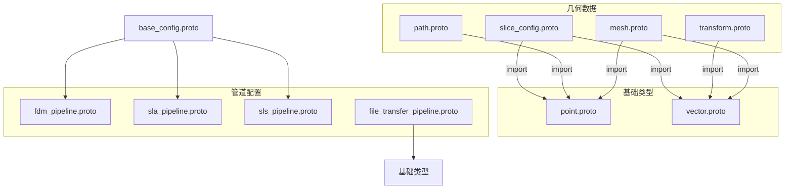
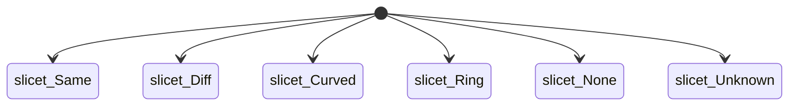
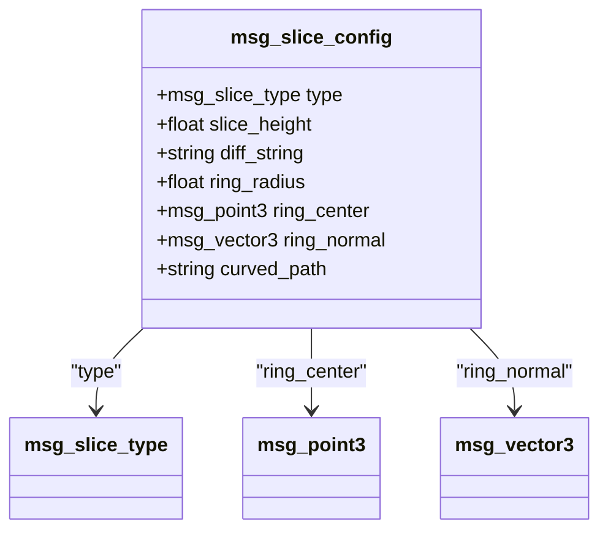
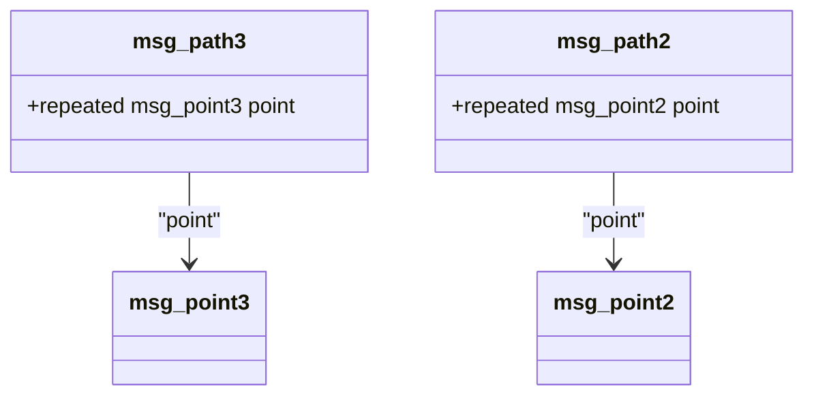
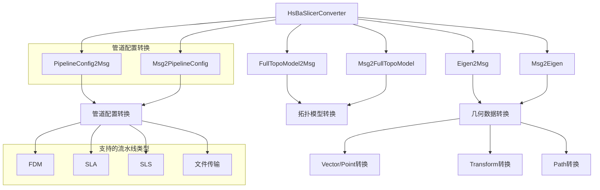
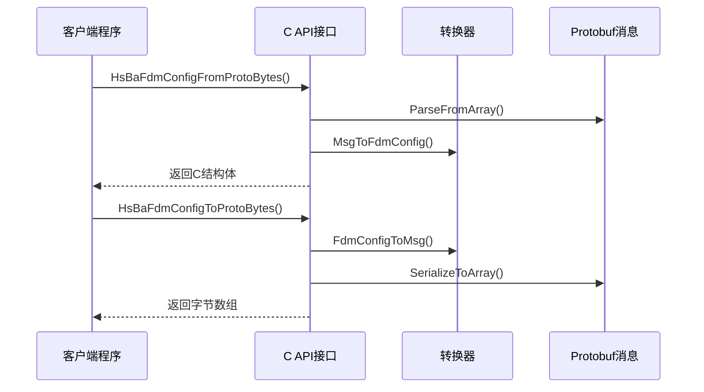
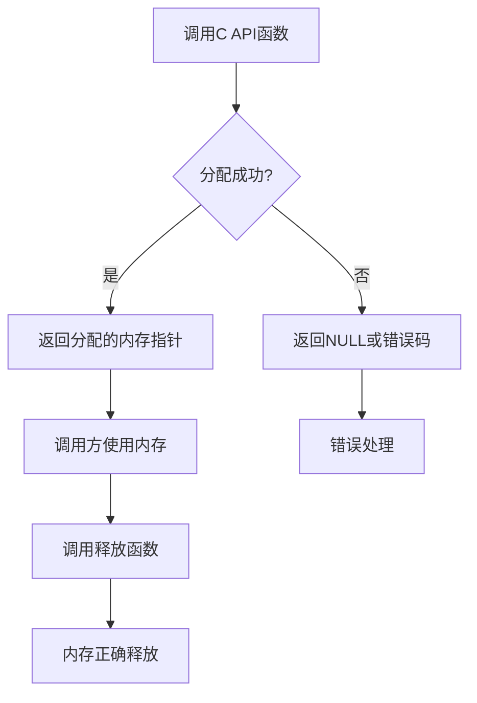

# Protobuf数据交换

<cite>
**本文档中引用的文件**   
- [slice_config.proto](file://proto/slice_config.proto)
- [path.proto](file://proto/path.proto)
- [vector.proto](file://proto/vector.proto)
- [point.proto](file://proto/point.proto)
- [transform.proto](file://proto/transform.proto)
- [base_config.proto](file://proto/base_config.proto)
- [mesh.proto](file://proto/mesh.proto)
- [fdm_pipeline.proto](file://proto/fdm_pipeline.proto)
- [sla_pipeline.proto](file://proto/sla_pipeline.proto)
- [sls_pipeline.proto](file://proto/sls_pipeline.proto)
- [file_transfer_pipeline.proto](file://proto/file_transfer_pipeline.proto)
- [Eigen2Msg.hpp](file://convert/Eigen2Msg.hpp)
- [Eigen2Msg.cpp](file://convert/Eigen2Msg.cpp)
- [Msg2Eigen.hpp](file://convert/Msg2Eigen.hpp)
- [Msg2Eigen.cpp](file://convert/Msg2Eigen.cpp)
- [PipelineConfig2Msg.hpp](file://convert/PipelineConfig2Msg.hpp)
- [PipelineConfig2Msg.cpp](file://convert/PipelineConfig2Msg.cpp)
- [Msg2PipelineConfig.hpp](file://convert/Msg2PipelineConfig.hpp)
- [Msg2PipelineConfig.cpp](file://convert/Msg2PipelineConfig.cpp)
- [pipeline_convert.h](file://DllHsBaSlicer/pipeline_convert.h)
- [pipeline_convert.cpp](file://DllHsBaSlicer/pipeline_convert.cpp)
- [fdm_pipeline.h](file://DllHsBaSlicer/fdm_pipeline.h)
- [sls_pipeline.h](file://DllHsBaSlicer/sls_pipeline.h)
- [file_transfer_pipeline.h](file://DllHsBaSlicer/file_transfer_pipeline.h)
- [CMakeLists.txt](file://proto/CMakeLists.txt)
- [CMakeLists.txt](file://convert/CMakeLists.txt)
- [error.hpp](file://base/error.hpp)
</cite>

## 更新摘要
**所做更改**   
- 新增文件传输管道完整的Protobuf支持和转换逻辑
- 扩展C API接口以支持文件传输配置的序列化和反序列化
- 完善FDM、SLA、SLS和文件传输四种流水线类型的统一转换架构
- 增强内存管理功能，新增文件传输相关的内存释放函数
- 更新多语言集成示例，涵盖文件传输流水线的跨语言支持

## 目录
1. [引言](#引言)
2. [核心Proto文件结构](#核心proto文件结构)
3. [几何数据序列化](#几何数据序列化)
4. [切片参数配置](#切片参数配置)
5. [路径数据组织](#路径数据组织)
6. [HsBaSlicerConverter库](#hsbaslicerconverter库)
7. [C API接口](#c-api接口)
8. [Eigen与Protobuf转换](#eigen与protobuf转换)
9. [CMake构建集成](#cmake构建集成)
10. [完整数据交换流程](#完整数据交换流程)
11. [多语言集成示例](#多语言集成示例)
12. [版本兼容性策略](#版本兼容性策略)
13. [内存管理考虑](#内存管理考虑)
14. [常见序列化错误与调试](#常见序列化错误与调试)

## 引言
HsBaSlicer项目采用Protocol Buffers（Protobuf）作为核心数据交换机制，实现跨语言、跨平台的数据序列化与反序列化。该机制支持C++、Python、Java、C#等多种编程语言，确保了切片配置、几何数据、路径信息以及文件传输等关键数据在不同组件间的高效传输。本文档详细阐述了基于Protobuf的数据交换机制，包括核心`.proto`文件的结构定义、HsBaSlicerConverter库的使用、C API接口的调用、Eigen矩阵与Protobuf消息之间的转换函数、CMake构建系统的集成方式、完整的数据交换流程、多语言集成示例、版本兼容性策略、内存管理考虑以及常见的序列化错误和调试建议。

**更新** 新增了文件传输流水线的完整Protobuf支持，实现了FDM、SLA、SLS和文件传输四种主流数据处理技术的统一数据交换架构。

## 核心Proto文件结构

HsBaSlicer项目中的Protobuf数据交换机制围绕一系列核心`.proto`文件构建，这些文件定义了切片参数、几何数据、路径信息以及文件传输等关键数据结构。所有`.proto`文件均遵循`proto3`语法，并位于`proto/`目录下，通过`HsbaProto`包进行组织。



**图表来源**
- [slice_config.proto:5-6](file://proto/slice_config.proto#L5-L6)
- [path.proto](file://proto/path.proto#L5)
- [mesh.proto:5-6](file://proto/mesh.proto#L5-L6)
- [sls_pipeline.proto:1-33](file://proto/sls_pipeline.proto#L1-L33)
- [file_transfer_pipeline.proto:1-21](file://proto/file_transfer_pipeline.proto#L1-L21)

**章节来源**
- [slice_config.proto:1-27](file://proto/slice_config.proto#L1-L27)
- [path.proto:1-15](file://proto/path.proto#L1-L15)
- [vector.proto:1-24](file://proto/vector.proto#L1-L24)
- [point.proto:1-16](file://proto/point.proto#L1-L16)
- [sls_pipeline.proto:1-33](file://proto/sls_pipeline.proto#L1-L33)
- [file_transfer_pipeline.proto:1-21](file://proto/file_transfer_pipeline.proto#L1-L21)

## 几何数据序列化

几何数据的序列化是HsBaSlicer数据交换的基础，主要通过`vector.proto`和`point.proto`两个文件定义。

### 向量与点的定义

`vector.proto`文件定义了不同维度的向量消息，用于表示方向、法线等几何属性。`point.proto`文件则定义了不同维度的点消息，用于表示空间中的位置坐标。

```mermaid
classDiagram
class msg_vector2 {
    +float x
    +float y
}
class msg_vector3 {
    +float x
    +float y
    +float z
}
class msg_vector4 {
    +float x
    +float y
    +float z
    +float w
}
class msg_point2 {
    +float x
    +float y
}
class msg_point3 {
    +float x
    +float y
    +float z
}
note right of msg_vector2: "二维向量"
note right of msg_vector3: "三维向量"
note right of msg_vector4: "四维向量含齐次坐标"
note right of msg_point2: "二维点"
note right of msg_point3: "三维点"
```

**图表来源**
- [vector.proto:5-24](file://proto/vector.proto#L5-L24)
- [point.proto:5-16](file://proto/point.proto#L5-L16)

**章节来源**
- [vector.proto:1-24](file://proto/vector.proto#L1-L24)
- [point.proto:1-16](file://proto/point.proto#L1-L16)

### 数据结构分析

- **`msg_vector2`/`msg_point2`**: 包含`x`和`y`两个浮点数字段，用于表示二维空间中的向量或点。
- **`msg_vector3`/`msg_point3`**: 包含`x`、`y`和`z`三个浮点数字段，用于表示三维空间中的向量或点。
- **`msg_vector4`**: 包含`x`、`y`、`z`和`w`四个浮点数字段，通常用于表示四元数或齐次坐标。

这些消息类型通过字段编号（1, 2, 3, 4）进行唯一标识，确保了序列化数据的稳定性和向后兼容性。

## 切片参数配置

切片参数的配置由`slice_config.proto`文件定义，该文件包含了控制切片过程的各种参数。

### 切片类型枚举

`msg_slice_type`枚举定义了不同的切片模式：



**图表来源**
- [slice_config.proto:8-16](file://proto/slice_config.proto#L8-L16)

**章节来源**
- [slice_config.proto:8-16](file://proto/slice_config.proto#L8-L16)

| 切片类型 | 字段编号 | 描述 |
| :--- | :--- | :--- |
| `slicet_Same` | 0 | 所有切片具有相同的高度和Z方向 |
| `slicet_Diff` | 1 | 切片具有不同的高度和Z方向，通过字符串指定 |
| `slicet_Curved` | 2 | 切片显示一个网格文件 |
| `slicet_Ring` | 3 | 切片形成一个环 |
| `slicet_None` | 4 | 无切片 |
| `slicet_Unknown` | 5 | 未知切片类型 |

### 切片配置消息

`msg_slice_config`消息包含了具体的切片参数：



**图表来源**
- [slice_config.proto:18-27](file://proto/slice_config.proto#L18-L27)

**章节来源**
- [slice_config.proto:18-27](file://proto/slice_config.proto#L18-L27)

| 字段名 | 字段编号 | 类型 | 描述 |
| :--- | :--- | :--- | :--- |
| `type` | 1 | `msg_slice_type` | 切片类型 |
| `slice_height` | 2 | `float` | 切片高度（毫米） |
| `diff_string` | 3 | `string` | 不同高度的切片字符串描述 |
| `ring_radius` | 4 | `float` | 环形切片的半径（毫米） |
| `ring_center` | 5 | `msg_point3` | 环形切片的中心点 |
| `ring_normal` | 6 | `msg_vector3` | 环形切片的法线向量 |
| `curved_path` | 7 | `string` | 曲面切片的网格文件路径 |

## 路径数据组织

路径数据的组织由`path.proto`文件定义，用于表示切片路径或机器人运动路径。

### 路径消息结构

`path.proto`文件定义了两种路径消息：`msg_path3`和`msg_path2`，分别用于三维和二维路径。



**图表来源**
- [path.proto:7-15](file://proto/path.proto#L7-L15)

**章节来源**
- [path.proto:7-15](file://proto/path.proto#L7-L15)

- **`msg_path3`**: 包含一个`repeated msg_point3`字段，表示一个由多个三维点组成的路径序列。
- **`msg_path2`**: 包含一个`repeated msg_point2`字段，表示一个由多个二维点组成的路径序列。

`repeated`关键字表示该字段可以包含零个或多个元素，非常适合表示路径这种可变长度的序列数据。

## HsBaSlicerConverter库

HsBaSlicerConverter库是HsBaSlicer项目的核心转换库，提供了丰富的数据类型转换功能，连接了高性能的C++计算（使用Eigen库）和跨平台的数据交换（使用Protobuf）。

### 库架构



**图表来源**
- [CMakeLists.txt:1-18](file://convert/CMakeLists.txt#L1-L18)
- [PipelineConfig2Msg.hpp:1-35](file://convert/PipelineConfig2Msg.hpp#L1-L35)
- [Msg2PipelineConfig.hpp:1-47](file://convert/Msg2PipelineConfig.hpp#L1-L47)

### 核心组件

#### Eigen2Msg组件
提供从Eigen数据类型到Protobuf消息的转换功能：
- 向量/点转换：`EigenVector3f2Msg`、`EigenVector2f2Msg`
- 变换矩阵转换：`EigenTransform3f2Msg`、`EigenIsometric3f2Msg`
- 路径转换：`EigenPath2Msg`

#### Msg2Eigen组件
提供从Protobuf消息到Eigen数据类型的转换功能：
- 向量/点转换：`MsgVector3f2Eigen`、`MsgPoint3f2Eigen`
- 变换矩阵转换：`MsgTransform3f2Eigen`、`MsgTransform2f2Eigen`
- 路径转换：`MsgPath2Eigen`

#### 管道配置转换
提供完整的FDM、SLA、SLS和文件传输管道配置的序列化/反序列化功能：
- FDM配置：`FdmConfigToMsg`、`MsgToFdmConfig`
- SLA配置：`SlaConfigToMsg`、`MsgToSlaConfig`
- SLS配置：`SlsConfigToMsg`、`MsgToSlsConfig`
- 文件传输配置：`FileTransferConfigToMsg`、`MsgToFileTransferConfig`

**更新** 新增了文件传输流水线的完整转换支持，实现了四种主流数据处理技术（FDM、SLA、SLS、文件传输）的统一转换架构。

**章节来源**
- [CMakeLists.txt:1-18](file://convert/CMakeLists.txt#L1-L18)
- [Eigen2Msg.hpp:1-34](file://convert/Eigen2Msg.hpp#L1-L34)
- [Msg2Eigen.hpp:1-33](file://convert/Msg2Eigen.hpp#L1-L33)
- [PipelineConfig2Msg.hpp:26-30](file://convert/PipelineConfig2Msg.hpp#L26-L30)
- [Msg2PipelineConfig.hpp:34-42](file://convert/Msg2PipelineConfig.hpp#L34-L42)

## C API接口

HsBaSlicer提供了完整的C API接口，使得非C++语言能够方便地使用切片功能和文件传输功能。这些接口主要位于`DllHsBaSlicer`模块中。

### FDM管道配置API



**图表来源**
- [pipeline_convert.cpp:23-60](file://DllHsBaSlicer/pipeline_convert.cpp#L23-L60)

### 主要C API函数

#### 配置转换函数
- `HsBaFdmConfigFromProtoBytes`: 从Protobuf字节流解析FDM配置
- `HsBaFdmConfigToProtoBytes`: 将FDM配置序列化为Protobuf字节流
- `HsBaSlaConfigFromProtoBytes`: 从Protobuf字节流解析SLA配置
- `HsBaSlaConfigToProtoBytes`: 将SLA配置序列化为Protobuf字节流
- `HsBaSlsConfigFromProtoBytes`: 从Protobuf字节流解析SLS配置
- `HsBaSlsConfigToProtoBytes`: 将SLS配置序列化为Protobuf字节流
- `HsBaFileTransferConfigFromProtoBytes`: 从Protobuf字节流解析文件传输配置
- `HsBaFileTransferConfigToProtoBytes`: 将文件传输配置序列化为Protobuf字节流

#### 结果处理函数
- `HsBaFdmResultFromProtoBytes`: 从Protobuf字节流解析FDM结果
- `HsBaFdmResultToProtoBytes`: 将FDM结果序列化为Protobuf字节流
- `HsBaSlaResultFromProtoBytes`: 从Protobuf字节流解析SLA结果
- `HsBaSlaResultToProtoBytes`: 将SLA结果序列化为Protobuf字节流
- `HsBaSlsResultFromProtoBytes`: 从Protobuf字节流解析SLS结果
- `HsBaSlsResultToProtoBytes`: 将SLS结果序列化为Protobuf字节流
- `HsBaFileTransferResultFromProtoBytes`: 从Protobuf字节流解析文件传输结果
- `HsBaFileTransferResultToProtoBytes`: 将文件传输结果序列化为Protobuf字节流

#### 内存管理函数
- `HsBaFreeFdmConfigStrings`: 释放FDM配置中的动态内存
- `HsBaFreeSlaConfigStrings`: 释放SLA配置中的动态内存
- `HsBaFreeSlsConfigStrings`: 释放SLS配置中的动态内存
- `HsBaFreeFileTransferConfigStrings`: 释放文件传输配置中的动态内存
- `HsBaFreePipelineResult`: 释放管道结果中的动态内存
- `HsBaFreeSlsPipelineResult`: 释放SLS管道结果中的动态内存
- `HsBaFreeFileTransferPipelineResult`: 释放文件传输管道结果中的动态内存

**更新** 新增了文件传输流水线的完整C API支持，包括配置和结果的序列化和反序列化功能，以及相应的内存管理函数。

**章节来源**
- [pipeline_convert.h:21-169](file://DllHsBaSlicer/pipeline_convert.h#L21-L169)
- [pipeline_convert.cpp:23-236](file://DllHsBaSlicer/pipeline_convert.cpp#L23-L236)
- [fdm_pipeline.h:35-156](file://DllHsBaSlicer/fdm_pipeline.h#L35-L156)
- [sls_pipeline.h:36-59](file://DllHsBaSlicer/sls_pipeline.h#L36-L59)
- [file_transfer_pipeline.h:1-62](file://DllHsBaSlicer/file_transfer_pipeline.h#L1-L62)

## Eigen与Protobuf转换

为了在高性能的C++计算（使用Eigen库）和跨平台的数据交换（使用Protobuf）之间架起桥梁，HsBaSlicer提供了`convert`模块，包含`Eigen2Msg`和`Msg2Eigen`两个核心组件。

### 转换函数接口

转换函数的接口定义在`Eigen2Msg.hpp`和`Msg2Eigen.hpp`头文件中。

```mermaid
classDiagram
class Eigen2Msg {
+EigenVector3f2Msg()
+EigenVector2f2Msg()
+EigenQuaternionf2Msg()
+EigenTransform3f2Msg()
+EigenTransform2f2Msg()
+EigenIsometric3f2Msg()
+EigenIsometric2f2Msg()
+EigenMatrix3f2Msg()
+EigenMatrix2f2Msg()
+EigenPath2Msg()
}
class Msg2Eigen {
+MsgVector3f2Eigen()
+MsgPoint3f2Eigen()
+MsgVector2f2Eigen()
+MsgPoint2f2Eigen()
+MsgTransform3f2Eigen()
+MsgTransform2f2Eigen()
+MsgPath2Eigen()
}
note right of Eigen2Msg
将Eigen数据转换为Protobuf消息
end note
note right of Msg2Eigen
将Protobuf消息转换为Eigen数据
end note
```

**图表来源**
- [Eigen2Msg.hpp:17-31](file://convert/Eigen2Msg.hpp#L17-L31)
- [Msg2Eigen.hpp:17-30](file://convert/Msg2Eigen.hpp#L17-L30)

**章节来源**
- [Eigen2Msg.hpp:1-34](file://convert/Eigen2Msg.hpp#L1-L34)
- [Msg2Eigen.hpp:1-33](file://convert/Msg2Eigen.hpp#L1-L33)

### 转换实现细节

转换的实现位于`Eigen2Msg.cpp`和`Msg2Eigen.cpp`源文件中。

#### Eigen到Protobuf (`Eigen2Msg`)

- **向量/点转换**: 通过`set_x()`、`set_y()`、`set_z()`等方法将Eigen向量的分量逐个赋值给Protobuf消息的对应字段。
- **变换矩阵转换**: 通过`add_matrix()`方法将Eigen变换矩阵的16个（4x4）或9个（3x3）元素依次添加到Protobuf的`repeated float matrix`字段中。
- **路径转换**: 遍历Eigen的`std::vector`，为每个点创建一个新的`msg_point3`或`msg_point2`消息，并调用`add_point()`方法将其添加到`msg_path3`或`msg_path2`中。

#### Protobuf到Eigen (`Msg2Eigen`)

- **向量/点转换**: 使用Eigen的逗号初始化语法（`<<`），直接从Protobuf消息的`x()`、`y()`、`z()`等访问器获取值并赋给Eigen向量。
- **变换矩阵转换**: 首先检查`matrix_size()`是否符合预期（16或9），然后遍历`matrix(i)`获取每个元素，并按行优先顺序填充到Eigen矩阵中。对于`Transform`和`Isometry`类型，会先构造一个临时的`Matrix`对象，再用它来初始化目标类型。
- **路径转换**: 先调用`resize()`方法根据Protobuf消息中的点数量调整Eigen向量的大小，然后遍历`point(i)`，调用相应的`MsgPoint3f2Eigen`或`MsgPoint2f2Eigen`函数进行转换。

```mermaid
sequenceDiagram
participant C++ as C++程序
participant Eigen as Eigen数据
participant Msg as Protobuf消息
participant Network as 网络/文件
C++->>Eigen : 生成切片配置
Eigen->>Msg : Eigen2Msg : : EigenVector3f2Msg()
Msg->>Network : SerializeToString()
Note right of Network : 字节流传输
Network->>Msg : ParseFromString()
Msg->>Eigen : Msg2Eigen : : MsgVector3f2Eigen()
Eigen->>C++ : 使用反序列化数据
```

**图表来源**
- [Eigen2Msg.cpp:5-16](file://convert/Eigen2Msg.cpp#L5-L16)
- [Msg2Eigen.cpp:7-14](file://convert/Msg2Eigen.cpp#L7-L14)

**章节来源**
- [Eigen2Msg.cpp:1-145](file://convert/Eigen2Msg.cpp#L1-L145)
- [Msg2Eigen.cpp:1-119](file://convert/Msg2Eigen.cpp#L1-L119)

### 错误处理

`Msg2Eigen`的实现中包含了严格的错误检查。例如，在转换变换矩阵时，会检查`matrix_size()`是否等于16（3D）或9（2D），如果不符，则抛出`InvalidArgumentError`异常，确保了数据的完整性和程序的健壮性。

**章节来源**
- [Msg2Eigen.cpp:28-33](file://convert/Msg2Eigen.cpp#L28-L33)
- [error.hpp:32-37](file://base/error.hpp#L32-L37)

## CMake构建集成

Protobuf代码的生成和编译通过`CMakeLists.txt`文件在CMake构建系统中自动化完成。

### Protobuf代码生成

`proto/CMakeLists.txt`文件负责调用`protoc`编译器生成C++、C#、Java、Python等多种语言的源代码。

```cmake
# 查找Protobuf包
find_package(Protobuf REQUIRED)

# 获取所有.proto文件
file(GLOB proto_files "${CMAKE_CURRENT_SOURCE_DIR}/*.proto")

# 为C++生成代码
PROTOBUF_GENERATE_CPP(PROTOSRCS PROTOHDRS ${proto_files})

# 创建静态库
add_library(HsBaSlicerProto STATIC ${PROTOSRCS} ${PROTOHDRS}) 
target_link_libraries(HsBaSlicerProto protobuf::libprotobuf) 
```

此配置会为每个`.proto`文件生成`.pb.cc`和`.pb.h`文件，并将它们编译成一个名为`HsBaSlicerProto`的静态库。

**章节来源**
- [CMakeLists.txt:3-134](file://proto/CMakeLists.txt#L3-L134)

### 转换模块构建

`convert/CMakeLists.txt`文件定义了`HsBaSlicerConverter`库，该库依赖于`Eigen`和`HsBaSlicerProto`库。

```cmake
add_library(HsBaSlicerConverter STATIC
    Eigen2Msg.hpp
    Eigen2Msg.cpp
    Msg2Eigen.hpp
    Msg2Eigen.cpp
    Msg2FullTopoModel.hpp
    Msg2FullTopoModel.cpp
    FullTopoModel2Msg.hpp
    FullTopoModel2Msg.cpp
    PipelineConfig2Msg.hpp
    PipelineConfig2Msg.cpp
    Msg2PipelineConfig.hpp
    Msg2PipelineConfig.cpp
    )

target_link_libraries(HsBaSlicerConverter PUBLIC Eigen3::Eigen HsBaSlicerProto
    HsBaSlicerMesh
    HsBaPipelineTypes
)
```

这确保了转换函数可以访问Eigen库的头文件和Protobuf生成的代码。

**更新** 转换模块现在支持FDM、SLA、SLS和文件传输四种流水线类型的完整转换功能。

**章节来源**
- [CMakeLists.txt:1-19](file://convert/CMakeLists.txt#L1-L19)

### protoc命令示例

虽然CMake自动化了构建过程，但手动调用`protoc`的命令示例如下：
```bash
protoc --proto_path=proto/ --cpp_out=generated_cpp/ proto/file_transfer_pipeline.proto
```
此命令会从`proto/`目录查找`.proto`文件，并将生成的C++代码输出到`generated_cpp/`目录。

## 完整数据交换流程

以下是一个从C++程序生成文件传输配置并传递给Python客户端的完整数据交换流程。

### C++端（序列化）

1. **创建并填充消息**: 在C++程序中，创建一个`file_transfer_pipe_config`对象，并设置其字段。
2. **序列化为字节流**: 调用`SerializeToString()`方法将Protobuf消息序列化为一个`std::string`字节流。
3. **传输**: 通过网络套接字发送或写入文件。

```cpp
// 文件传输配置示例
HsbaProto::file_transfer_pipe_config config;
config.set_file_transfer_config_host("192.168.1.100");
config.set_file_transfer_config_port("8080");
config.set_file_transfer_config_pool_size(4);
config.add_file_transfer_config_file_paths("/path/to/file1.stl");
config.add_file_transfer_config_file_paths("/path/to/file2.stl");
config.add_file_transfer_config_file_paths("/path/to/file3.stl");

std::string serialized_data;
config.SerializeToString(&serialized_data);

// 发送 serialized_data
```

### Python端（反序列化）

1. **接收字节流**: 从网络或文件读取字节流。
2. **反序列化**: 使用Python生成的`_pb2.py`模块中的类，调用`ParseFromString()`方法。
3. **读取参数**: 访问反序列化后消息对象的属性。

```python
# Python伪代码示例
import file_transfer_pipeline_pb2

config = file_transfer_pipeline_pb2.file_transfer_pipe_config()
config.ParseFromString(serialized_data)

print(f"主机地址: {config.file_transfer_config_host}")
print(f"端口号: {config.file_transfer_config_port}")
print(f"连接池大小: {config.file_transfer_config_pool_size}")
print(f"文件数量: {len(config.file_transfer_config_file_paths)}")
for i, path in enumerate(config.file_transfer_config_file_paths):
    print(f"  文件{i+1}: {path}")
```

此流程展示了Protobuf如何实现跨语言的数据交换，C++生成的文件传输配置数据可以被Python无缝读取。

**更新** 新增了文件传输流水线的完整数据交换流程示例，展示了远程主机连接、文件列表管理等文件传输特有功能的序列化传输。

## 多语言集成示例

HsBaSlicer的Protobuf数据交换机制支持多种编程语言的集成。

### Java集成示例

```java
// Java伪代码示例
import com.hsmbanlance.hsbaslicer.proto.FileTransferPipeline;

FileTransferPipeline.FileTransferPipeConfig config = FileTransferPipeline.FileTransferPipeConfig.newBuilder()
    .setFileTransferConfigHost("192.168.1.100")
    .setFileTransferConfigPort("8080")
    .setFileTransferConfigPoolSize(4)
    .addFileTransferConfigFilePaths("/path/to/file1.stl")
    .addFileTransferConfigFilePaths("/path/to/file2.stl")
    .build();

byte[] data = config.toByteArray();
// 发送或保存data
```

### C#集成示例

```csharp
// C#伪代码示例
using HsbaProto;

var config = new FileTransferPipeConfig
{
    FileTransferConfigHost = "192.168.1.100",
    FileTransferConfigPort = "8080",
    FileTransferConfigPoolSize = 4,
};
config.FileTransferConfigFilePaths.Add("/path/to/file1.stl");
config.FileTransferConfigFilePaths.Add("/path/to/file2.stl");

byte[] data = config.ToByteArray();
// 发送或保存data
```

### JavaScript集成示例

```javascript
// JavaScript伪代码示例
const protobuf = require('protobufjs');

protobuf.load('file_transfer_pipeline.proto', function(err, root) {
    const FileTransferPipeConfig = root.lookupType('HsbaProto.file_transfer_pipe_config');
    
    const config = FileTransferPipeConfig.create({
        file_transfer_config_host: "192.168.1.100",
        file_transfer_config_port: "8080",
        file_transfer_config_pool_size: 4,
        file_transfer_config_file_paths: ["/path/to/file1.stl", "/path/to/file2.stl"]
    });
    
    const buffer = FileTransferPipeConfig.encode(config).finish();
    // 发送或保存buffer
});
```

**更新** 新增了文件传输流水线的多语言集成示例，展示了跨语言的文件传输配置数据传输。

**章节来源**
- [CMakeLists.txt:42-120](file://proto/CMakeLists.txt#L42-L120)

## 版本兼容性策略

Protobuf的设计天然支持向后和向前兼容，HsBaSlicer项目遵循以下策略来管理`.proto`文件的演进。

### 字段编号的保留

一旦为某个字段分配了字段编号，该编号就永远不能被重新分配给其他字段。即使某个字段被删除，其编号也应被保留，以防止旧版本的客户端将新字段的数据误认为是已删除的旧字段。

### 新增字段

新增字段时，必须使用新的、未被使用的字段编号。新增的字段默认是可选的（在`proto3`中所有字段默认可选），因此旧版本的客户端在解析包含新字段的消息时不会出错，只是会忽略它们。

### 默认值设置

在`proto3`中，标量数值类型（如`int32`、`float`）的默认值为0，字符串的默认值为空字符串，布尔值的默认值为`false`。当消息中缺少某个字段时，读取该字段会返回其默认值。这确保了即使新版本的消息包含旧版本没有的字段，旧版本的代码也能安全地读取消息。

## 内存管理考虑

HsBaSlicer的C API接口提供了完善的内存管理机制，确保跨语言调用时的内存安全。

### 动态内存分配策略

C API函数使用标准的`malloc`函数分配内存，调用方负责释放这些内存。这种设计确保了不同语言间的内存管理一致性。

### 内存释放函数

- **配置内存释放**: `HsBaFreeFdmConfigStrings`、`HsBaFreeSlaConfigStrings`、`HsBaFreeSlsConfigStrings`和`HsBaFreeFileTransferConfigStrings`函数用于释放配置结构体中的动态字符串字段
- **结果内存释放**: `HsBaFreePipelineResult`、`HsBaFreeSlsPipelineResult`和`HsBaFreeFileTransferPipelineResult`函数用于释放管道结果中的动态内存

### 内存泄漏防护



**图表来源**
- [pipeline_convert.cpp:14-19](file://DllHsBaSlicer/pipeline_convert.cpp#L14-L19)

### 最佳实践

1. **立即释放**: 使用完动态分配的内存后立即释放
2. **成对使用**: 每个分配函数都有对应的释放函数
3. **空指针检查**: 在使用前检查指针是否为NULL
4. **异常安全**: 在C++代码中使用RAII模式管理内存

**更新** 新增了文件传输流水线的内存管理支持，包括`HsBaFreeFileTransferConfigStrings`和`HsBaFreeFileTransferPipelineResult`函数。

**章节来源**
- [pipeline_convert.cpp:183-236](file://DllHsBaSlicer/pipeline_convert.cpp#L183-L236)
- [file_transfer_pipeline.cpp:183-188](file://DllHsBaSlicer/file_transfer_pipeline.cpp#L183-L188)

## 常见序列化错误与调试

在使用Protobuf时，可能会遇到一些常见的错误，了解这些错误及其调试方法至关重要。

### 未初始化的消息

在调用`SerializeToString()`之前，如果消息对象未被正确初始化（例如，某些必需字段缺失），虽然`proto3`没有`required`字段，但逻辑上必需的字段缺失可能导致下游处理错误。**调试建议**: 在序列化前，使用`DebugString()`方法打印消息内容，检查所有关键字段是否已设置。

### 嵌套消息的内存管理

在`Eigen2Msg`中，当转换路径时，会通过`msg->add_point()`动态创建新的`msg_point3`对象。这些对象的生命周期由其父消息`msg_path3`管理。**调试建议**: 确保父消息的生命周期长于任何对其内部嵌套消息的引用，避免悬空指针。

### 变换矩阵大小不匹配

在`Msg2Eigen`中，`MsgTransform3f2Eigen`等函数会检查`matrix_size()`。如果序列化和反序列化的代码版本不一致，或者数据在传输过程中损坏，可能导致大小不匹配。**调试建议**: 捕获`InvalidArgumentError`异常，并在日志中记录详细的错误信息，包括期望的大小和实际的大小。

### C API内存泄漏

在C API调用中，忘记释放动态分配的内存会导致内存泄漏。**调试建议**: 使用内存分析工具（如Valgrind、Visual Studio Debugger）检测内存泄漏，确保所有分配的内存都被正确释放。

### 文件传输特定错误

文件传输流水线特有的错误包括：
- **网络连接失败**: 确保`host`和`port`字段指向有效的远程服务地址
- **文件路径无效**: 验证`file_paths`数组中的所有文件路径是否存在且可访问
- **连接池配置不当**: 确保`pool_size`参数在有效范围内（1-16）
- **权限问题**: 检查进程是否有足够的权限访问指定的文件路径

**更新** 新增了文件传输流水线的特定错误处理和调试建议。

**章节来源**
- [Msg2Eigen.cpp:28-33](file://convert/Msg2Eigen.cpp#L28-L33)
- [error.hpp:32-37](file://base/error.hpp#L32-L37)
- [pipeline_convert.cpp:183-236](file://DllHsBaSlicer/pipeline_convert.cpp#L183-L236)
- [file_transfer_pipeline.cpp:183-188](file://DllHsBaSlicer/file_transfer_pipeline.cpp#L183-L188)