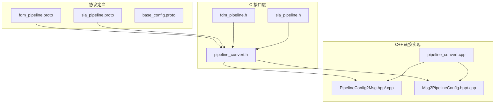
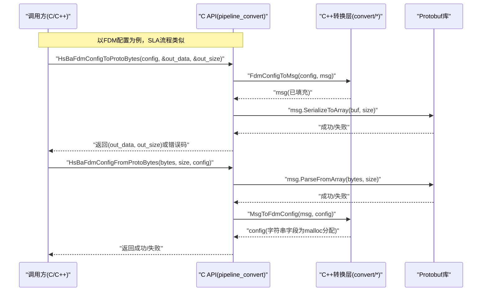
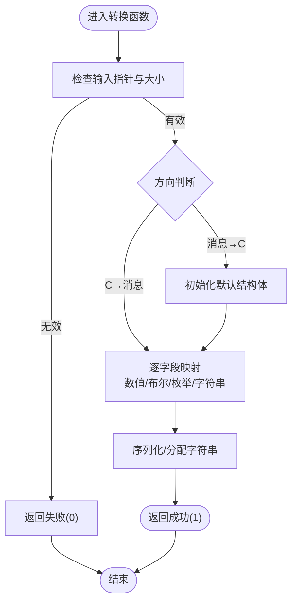
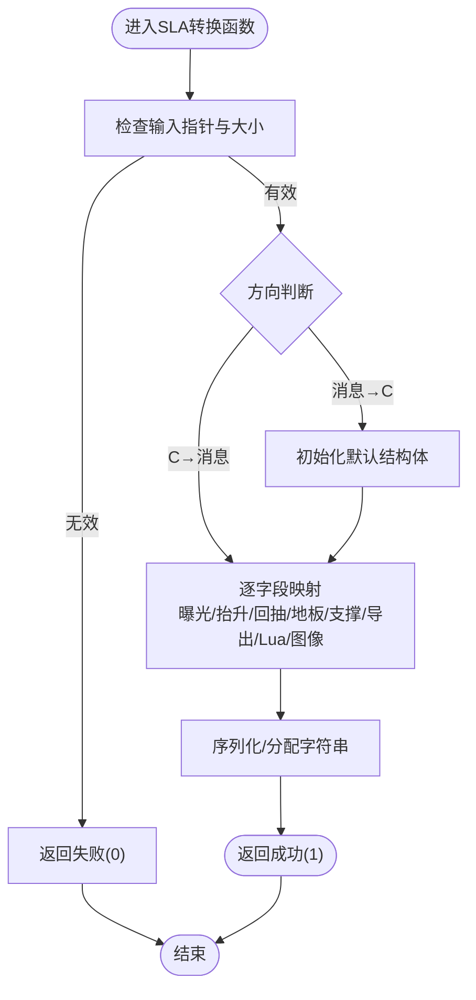
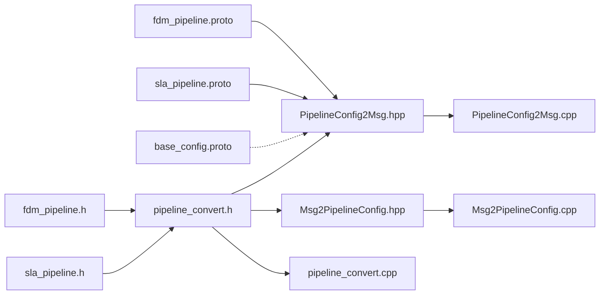

# 流水线配置Protobuf转换

<cite>
**本文引用的文件**   
- [pipeline_convert.h](file://DllHsBaSlicer/pipeline_convert.h)
- [pipeline_convert.cpp](file://DllHsBaSlicer/pipeline_convert.cpp)
- [PipelineConfig2Msg.hpp](file://convert/PipelineConfig2Msg.hpp)
- [PipelineConfig2Msg.cpp](file://convert/PipelineConfig2Msg.cpp)
- [Msg2PipelineConfig.hpp](file://convert/Msg2PipelineConfig.hpp)
- [Msg2PipelineConfig.cpp](file://convert/Msg2PipelineConfig.cpp)
- [fdm_pipeline.h](file://DllHsBaSlicer/fdm_pipeline.h)
- [sla_pipeline.h](file://DllHsBaSlicer/sla_pipeline.h)
- [fdm_pipeline.proto](file://proto/fdm_pipeline.proto)
- [sla_pipeline.proto](file://proto/sla_pipeline.proto)
- [base_config.proto](file://proto/base_config.proto)
</cite>

## 目录
1. [简介](#简介)
2. [项目结构](#项目结构)
3. [核心组件](#核心组件)
4. [架构总览](#架构总览)
5. [详细组件分析](#详细组件分析)
6. [依赖关系分析](#依赖关系分析)
7. [性能与内存管理](#性能与内存管理)
8. [故障排查指南](#故障排查指南)
9. [结论](#结论)

## 简介
本文件聚焦于“流水线配置 Protobuf 转换”能力，覆盖 FDM 与 SLA 两种切片工艺的配置与结果在 C 结构体与 Protobuf 消息之间的双向转换。该能力通过一组对外暴露的 C API 提供，内部由 C++ 实现完成字段映射、枚举对齐与字符串分配策略，确保跨语言（C/C++/其他）调用时的数据一致性与可维护性。

## 项目结构
围绕转换功能的关键目录与文件：
- proto：定义 FDM/SLA 相关的 Protobuf 消息与枚举
- DllHsBaSlicer：对外 C API 与导出头，包含转换入口与清理辅助
- convert：C++ 层实现，负责 C 结构与 Protobuf 消息之间的字段级映射

图示来源
- [pipeline_convert.h:1-124](file://DllHsBaSlicer/pipeline_convert.h#L1-L124)
- [fdm_pipeline.h:1-156](file://DllHsBaSlicer/fdm_pipeline.h#L1-L156)
- [sla_pipeline.h:1-160](file://DllHsBaSlicer/sla_pipeline.h#L1-L160)
- [PipelineConfig2Msg.hpp:1-29](file://convert/PipelineConfig2Msg.hpp#L1-L29)
- [Msg2PipelineConfig.hpp:1-37](file://convert/Msg2PipelineConfig.hpp#L1-L37)
- [fdm_pipeline.proto:1-63](file://proto/fdm_pipeline.proto#L1-L63)
- [sla_pipeline.proto:1-67](file://proto/sla_pipeline.proto#L1-L67)
- [base_config.proto:1-132](file://proto/base_config.proto#L1-L132)

章节来源
- [pipeline_convert.h:1-124](file://DllHsBaSlicer/pipeline_convert.h#L1-L124)
- [fdm_pipeline.h:1-156](file://DllHsBaSlicer/fdm_pipeline.h#L1-L156)
- [sla_pipeline.h:1-160](file://DllHsBaSlicer/sla_pipeline.h#L1-L160)
- [PipelineConfig2Msg.hpp:1-29](file://convert/PipelineConfig2Msg.hpp#L1-L29)
- [Msg2PipelineConfig.hpp:1-37](file://convert/Msg2PipelineConfig.hpp#L1-L37)
- [fdm_pipeline.proto:1-63](file://proto/fdm_pipeline.proto#L1-L63)
- [sla_pipeline.proto:1-67](file://proto/sla_pipeline.proto#L1-L67)
- [base_config.proto:1-132](file://proto/base_config.proto#L1-L132)

## 核心组件
- 对外 C API（序列化/反序列化）
  - FDM：配置与结果的双向转换
  - SLA：配置与结果的双向转换
  - 清理辅助：释放从 Protobuf 反序列化得到的 C 结构体中的字符串字段
- C++ 转换层
  - C 结构体 → Protobuf 消息
  - Protobuf 消息 → C 结构体（含字符串分配策略说明）
- 协议定义
  - FDM/SLA 专用消息与枚举
  - 基础通用类型（技术类型、输出类型等）

章节来源
- [pipeline_convert.h:1-124](file://DllHsBaSlicer/pipeline_convert.h#L1-L124)
- [pipeline_convert.cpp:1-210](file://DllHsBaSlicer/pipeline_convert.cpp#L1-L210)
- [PipelineConfig2Msg.hpp:1-29](file://convert/PipelineConfig2Msg.hpp#L1-L29)
- [PipelineConfig2Msg.cpp:1-124](file://convert/PipelineConfig2Msg.cpp#L1-L124)
- [Msg2PipelineConfig.hpp:1-37](file://convert/Msg2PipelineConfig.hpp#L1-L37)
- [Msg2PipelineConfig.cpp:1-129](file://convert/Msg2PipelineConfig.cpp#L1-L129)
- [fdm_pipeline.proto:1-63](file://proto/fdm_pipeline.proto#L1-L63)
- [sla_pipeline.proto:1-67](file://proto/sla_pipeline.proto#L1-L67)
- [base_config.proto:1-132](file://proto/base_config.proto#L1-L132)

## 架构总览
下图展示了从外部调用到内部实现的完整调用链，包括参数校验、Protobuf 解析/序列化、C++ 字段映射以及内存分配策略。

图示来源
- [pipeline_convert.cpp:23-60](file://DllHsBaSlicer/pipeline_convert.cpp#L23-L60)
- [pipeline_convert.cpp:62-99](file://DllHsBaSlicer/pipeline_convert.cpp#L62-L99)
- [PipelineConfig2Msg.cpp:6-48](file://convert/PipelineConfig2Msg.cpp#L6-L48)
- [Msg2PipelineConfig.cpp:27-64](file://convert/Msg2PipelineConfig.cpp#L27-L64)

## 详细组件分析

### FDM 配置与结果转换
- 目标
  - 将 C 结构体 HsBaFdmPipelineConfig_t/HsBaFdmPipelineResult_t 与 Protobuf 消息 msg_fdm_pipeline_config/msg_fdm_pipe_result 进行双向转换
- 关键行为
  - 数值型字段直接赋值；布尔值按 0/1 与 bool 互转
  - 枚举类型在两端进行显式 static_cast 对齐
  - 字符串字段在“消息→C”方向使用 malloc 分配，需调用者释放或通过运行接口内部拷贝后统一释放
- 对外 API
  - 序列化：HsBaFdmConfigToProtoBytes / HsBaFdmResultToProtoBytes
  - 反序列化：HsBaFdmConfigFromProtoBytes / HsBaFdmResultFromProtoBytes
  - 清理：HsBaFreeFdmConfigStrings（仅用于配置中字符串字段）

图示来源
- [pipeline_convert.cpp:23-60](file://DllHsBaSlicer/pipeline_convert.cpp#L23-L60)
- [pipeline_convert.cpp:62-99](file://DllHsBaSlicer/pipeline_convert.cpp#L62-L99)
- [PipelineConfig2Msg.cpp:6-48](file://convert/PipelineConfig2Msg.cpp#L6-L48)
- [Msg2PipelineConfig.cpp:27-64](file://convert/Msg2PipelineConfig.cpp#L27-L64)

章节来源
- [pipeline_convert.h:21-59](file://DllHsBaSlicer/pipeline_convert.h#L21-L59)
- [pipeline_convert.cpp:23-99](file://DllHsBaSlicer/pipeline_convert.cpp#L23-L99)
- [PipelineConfig2Msg.cpp:6-59](file://convert/PipelineConfig2Msg.cpp#L6-L59)
- [Msg2PipelineConfig.cpp:27-73](file://convert/Msg2PipelineConfig.cpp#L27-L73)
- [fdm_pipeline.h:35-93](file://DllHsBaSlicer/fdm_pipeline.h#L35-L93)
- [fdm_pipeline.proto:19-63](file://proto/fdm_pipeline.proto#L19-L63)

### SLA 配置与结果转换
- 目标
  - 将 C 结构体 HsBaSlaPipelineConfig_t/HsBaSlaPipelineResult_t 与 Protobuf 消息 sla_pipe_config/sla_pipe_result 进行双向转换
- 关键行为
  - 曝光、抬升、回抽等 SLA 特有参数一一映射
  - 支撑模式、图像格式等枚举进行对齐
  - 字符串字段同样遵循“消息→C”时 malloc 分配的策略
- 对外 API
  - 序列化：HsBaSlaConfigToProtoBytes / HsBaSlaResultToProtoBytes
  - 反序列化：HsBaSlaConfigFromProtoBytes / HsBaSlaResultFromProtoBytes
  - 清理：HsBaFreeSlaConfigStrings（仅用于配置中字符串字段）

图示来源
- [pipeline_convert.cpp:103-140](file://DllHsBaSlicer/pipeline_convert.cpp#L103-L140)
- [pipeline_convert.cpp:142-179](file://DllHsBaSlicer/pipeline_convert.cpp#L142-L179)
- [PipelineConfig2Msg.cpp:61-110](file://convert/PipelineConfig2Msg.cpp#L61-L110)
- [Msg2PipelineConfig.cpp:75-117](file://convert/Msg2PipelineConfig.cpp#L75-L117)

章节来源
- [pipeline_convert.h:61-99](file://DllHsBaSlicer/pipeline_convert.h#L61-L99)
- [pipeline_convert.cpp:103-179](file://DllHsBaSlicer/pipeline_convert.cpp#L103-L179)
- [PipelineConfig2Msg.cpp:61-121](file://convert/PipelineConfig2Msg.cpp#L61-L121)
- [Msg2PipelineConfig.cpp:75-126](file://convert/Msg2PipelineConfig.cpp#L75-L126)
- [sla_pipeline.h:36-98](file://DllHsBaSlicer/sla_pipeline.h#L36-L98)
- [sla_pipeline.proto:18-67](file://proto/sla_pipeline.proto#L18-L67)

### 清理辅助与内存所有权
- 目的
  - 当从 Protobuf 反序列化为 C 结构体时，字符串字段由转换层使用 malloc 分配，需要明确的释放路径以避免泄漏
- 可用接口
  - HsBaFreeFdmConfigStrings：释放 FDM 配置中的字符串字段
  - HsBaFreeSlaConfigStrings：释放 SLA 配置中的字符串字段
- 注意
  - 结果结构体的字符串字段释放应使用各自的结果释放接口（例如 FDM 的 HsBaFreePipelineResult、SLA 的 HsBaFreeSlaPipelineResult），而非配置清理接口

章节来源
- [pipeline_convert.h:101-117](file://DllHsBaSlicer/pipeline_convert.h#L101-L117)
- [pipeline_convert.cpp:183-209](file://DllHsBaSlicer/pipeline_convert.cpp#L183-L209)
- [fdm_pipeline.h:141-149](file://DllHsBaSlicer/fdm_pipeline.h#L141-L149)
- [sla_pipeline.h:146-153](file://DllHsBaSlicer/sla_pipeline.h#L146-L153)

## 依赖关系分析
- 模块耦合
  - C API 层依赖 C++ 转换层，后者再依赖 Protobuf 生成的头文件
  - C 结构体定义来自 fdm_pipeline.h 与 sla_pipeline.h
  - Protobuf 消息定义位于 proto 目录
- 可能的循环依赖
  - 当前设计通过头文件解耦，未见循环引用
- 外部依赖
  - Protobuf 运行时库（序列化/反序列化）
  - 标准库（malloc/free/cstring）

图示来源
- [fdm_pipeline.h:1-156](file://DllHsBaSlicer/fdm_pipeline.h#L1-156)
- [sla_pipeline.h:1-160](file://DllHsBaSlicer/sla_pipeline.h#L1-160)
- [pipeline_convert.h:1-124](file://DllHsBaSlicer/pipeline_convert.h#L1-124)
- [PipelineConfig2Msg.hpp:1-29](file://convert/PipelineConfig2Msg.hpp#L1-L29)
- [Msg2PipelineConfig.hpp:1-37](file://convert/Msg2PipelineConfig.hpp#L1-L37)
- [fdm_pipeline.proto:1-63](file://proto/fdm_pipeline.proto#L1-L63)
- [sla_pipeline.proto:1-67](file://proto/sla_pipeline.proto#L1-L67)
- [base_config.proto:1-132](file://proto/base_config.proto#L1-L132)

章节来源
- [pipeline_convert.cpp:1-210](file://DllHsBaSlicer/pipeline_convert.cpp#L1-L210)
- [PipelineConfig2Msg.cpp:1-124](file://convert/PipelineConfig2Msg.cpp#L1-L124)
- [Msg2PipelineConfig.cpp:1-129](file://convert/Msg2PipelineConfig.cpp#L1-L129)

## 性能与内存管理
- 序列化/反序列化
  - 采用 Protobuf 原生序列化/解析，整体开销取决于消息体积与字段数量
  - 建议批量处理时复用缓冲区以减少频繁分配
- 内存分配
  - “消息→C”方向对字符串字段使用 malloc 分配，务必在合适时机释放
  - 若直接将配置传入流水线运行接口，内部会进行拷贝，避免外部持有临时分配的字符串过久
- 枚举与布尔
  - 显式 static_cast 保证两端枚举一致，避免隐式转换带来的歧义
- 错误路径
  - 所有对外 API 在入参非法或序列化/解析失败时返回 0，调用方应据此分支处理

[本节为通用指导，不直接分析具体文件]

## 故障排查指南
- 常见错误
  - 传入空指针或长度为 0 的字节数组导致反序列化失败
  - 未释放从 Protobuf 反序列化得到的 C 结构体字符串字段造成内存泄漏
  - 枚举值越界或不匹配导致语义不一致
- 定位方法
  - 检查返回值是否为 1（成功）
  - 确认调用顺序：先反序列化得到 C 结构体，再执行流水线；完成后按需释放
  - 核对两端枚举定义是否一致（如填充模式、支撑模式、图像类型等）
- 修复建议
  - 对所有字符串字段增加判空与释放逻辑
  - 在调试模式下打印关键字段，验证映射正确性
  - 使用最小可复现用例隔离问题

章节来源
- [pipeline_convert.cpp:23-60](file://DllHsBaSlicer/pipeline_convert.cpp#L23-L60)
- [pipeline_convert.cpp:62-99](file://DllHsBaSlicer/pipeline_convert.cpp#L62-L99)
- [pipeline_convert.cpp:103-140](file://DllHsBaSlicer/pipeline_convert.cpp#L103-L140)
- [pipeline_convert.cpp:142-179](file://DllHsBaSlicer/pipeline_convert.cpp#L142-L179)
- [pipeline_convert.cpp:183-209](file://DllHsBaSlicer/pipeline_convert.cpp#L183-L209)

## 结论
本转换层以清晰的职责划分实现了 C 结构体与 Protobuf 消息之间的高内聚映射，配合统一的清理接口与严格的入参校验，提供了稳定可靠的跨语言数据交换能力。建议在集成时严格遵循内存所有权约定，并在新增字段时同步更新两端映射与测试用例，以保持长期一致性。