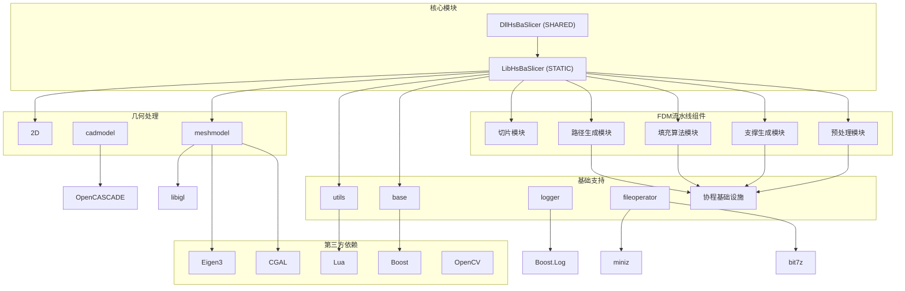
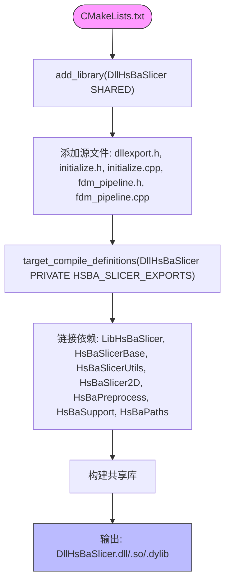
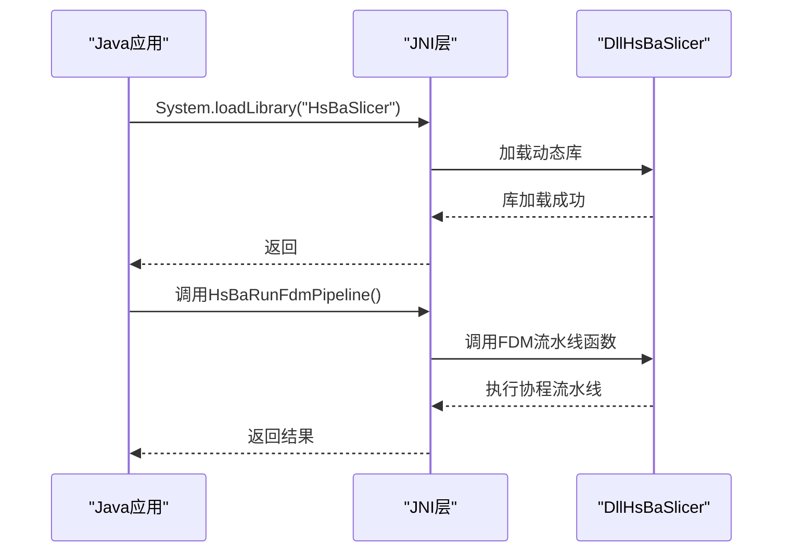
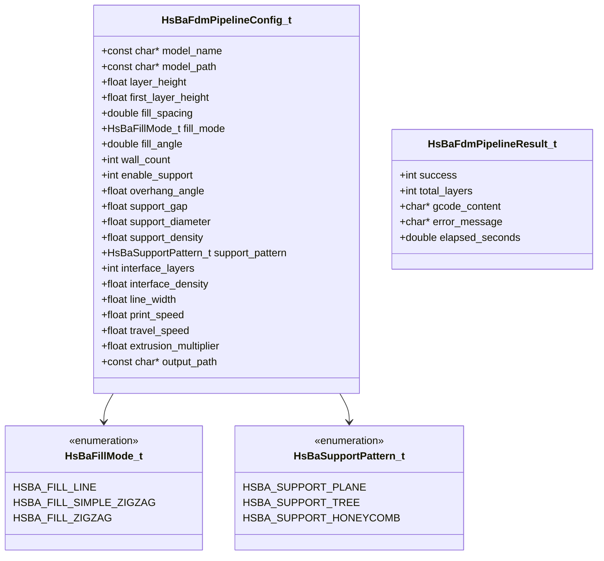
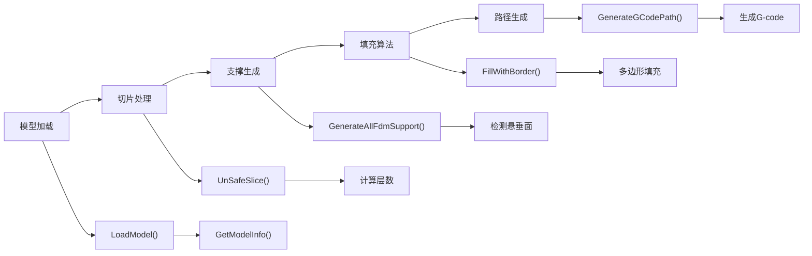
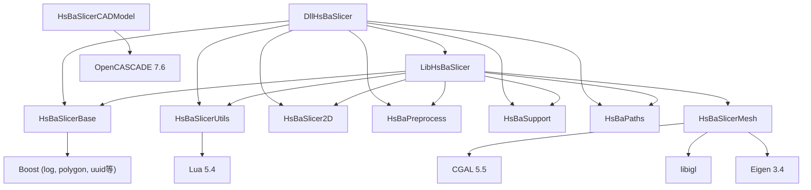

# 动态库集成

<cite>
**本文档中引用的文件**  
- [dllexport.h](file://DllHsBaSlicer/dllexport.h)
- [initialize.h](file://DllHsBaSlicer/initialize.h)
- [initialize.cpp](file://DllHsBaSlicer/initialize.cpp)
- [fdm_pipeline.h](file://DllHsBaSlicer/fdm_pipeline.h)
- [fdm_pipeline.cpp](file://DllHsBaSlicer/fdm_pipeline.cpp)
- [CMakeLists.txt](file://DllHsBaSlicer/CMakeLists.txt)
- [model_preprocess.hpp](file://LibHsBaSlicer/Preprocess/model_preprocess.hpp)
- [model_preprocess.cpp](file://LibHsBaSlicer/Preprocess/model_preprocess.cpp)
- [fdm_support.hpp](file://LibHsBaSlicer/Support/fdm_support.hpp)
- [fdm_support.cpp](file://LibHsBaSlicer/Support/fdm_support.cpp)
- [polygon_fill.hpp](file://LibHsBaSlicer/Fill/polygon_fill.hpp)
- [polygon_fill.cpp](file://LibHsBaSlicer/Fill/polygon_fill.cpp)
- [path_generator.hpp](file://LibHsBaSlicer/Path/path_generator.hpp)
- [path_generator.cpp](file://LibHsBaSlicer/Path/path_generator.cpp)
- [CMakeLists.txt](file://LibHsBaSlicer/CMakeLists.txt)
- [coroutine.hpp](file://base/coroutine.hpp)
- [SupportConfig.hpp](file://support/SupportConfig.hpp)
- [HsBaSlicer.h](file://HsBaSlicer/HsBaSlicer.h)
- [CMakeLists.txt](file://HsBaSlicer/CMakeLists.txt)
- [vcpkg.json](file://vcpkg.json)
- [MainActivity.java](file://android/app/src/main/java/com/hsmbanlance/hsbaslicer/example/MainActivity.java)
- [build.gradle](file://android/app/build.gradle)
</cite>

## 更新摘要
**变更内容**   
- 扩展了`DllHsBaSlicer`模块的接口，从简单的`initialize()`函数发展为完整的FDM全流程协程Pipeline
- 新增了预处理、支撑、填充、路径生成等核心切片功能的封装接口
- 实现了基于C++20协程的异步流水线执行机制
- 提供了同步和异步两种调用方式，支持进度回调和错误处理
- 更新了构建配置以支持新的模块依赖关系

## 目录
1. [简介](#简介)
2. [项目结构](#项目结构)
3. [核心组件](#核心组件)
4. [架构概述](#架构概述)
5. [详细组件分析](#详细组件分析)
6. [FDM全流程协程接口](#fdm全流程协程接口)
7. [依赖分析](#依赖分析)
8. [性能考虑](#性能考虑)
9. [故障排除指南](#故障排除指南)
10. [结论](#结论)

## 简介
本文档为希望在C#、Python、Java等语言中调用HsBaSlicer核心功能的开发者提供权威的动态库集成指南。文档详细解析`DllHsBaSlicer`模块提供的C风格导出接口，特别是新增的完整FDM全流程协程Pipeline接口。说明`HSBA_SLICER_API`宏的跨平台导出机制（Windows下为`__declspec(dllexport)`，其他平台为空）。提供在不同语言中调用DLL的代码示例：C#中使用`DllImport`声明`RunFdmPipeline`函数；Python中通过`ctypes.CDLL`加载并调用；Java中通过JNI封装实现调用。阐述调用约定（calling convention）的一致性要求，避免栈损坏。说明动态库的依赖关系：`DllHsBaSlicer`依赖`LibHsBaSlicer`静态库，后者现在包含完整的预处理、支撑、填充、路径生成等切片功能。提供构建动态库的CMake配置要点，并指出Android平台下生成`.so`文件的注意事项。

## 项目结构
HsBaSlicer项目采用模块化设计，核心动态库`DllHsBaSlicer`位于独立目录中，通过C风格接口暴露功能。项目顶层CMakeLists.txt文件协调所有子模块的构建，包括基础库、工具模块、2D处理、路径生成、文件操作、日志系统、网格模型、CAD模型等。`DllHsBaSlicer`作为共享库构建，依赖于`LibHsBaSlicer`静态库，后者现在封装了完整的FDM切片算法和数据处理逻辑，包括预处理、支撑生成、填充算法和路径生成等功能。



**图表来源**
- [CMakeLists.txt:1-157](file://CMakeLists.txt#L1-L157)
- [CMakeLists.txt:1-20](file://DllHsBaSlicer/CMakeLists.txt#L1-L20)
- [CMakeLists.txt:1-59](file://LibHsBaSlicer/CMakeLists.txt#L1-L59)

**章节来源**
- [CMakeLists.txt:1-157](file://CMakeLists.txt#L1-L157)
- [CMakeLists.txt:1-20](file://DllHsBaSlicer/CMakeLists.txt#L1-L20)

## 核心组件
`DllHsBaSlicer`模块的核心现在是完整的FDM全流程协程Pipeline接口，包括`initialize()`初始化函数和一系列FDM流水线相关函数。该模块通过`HSBA_SLICER_API`宏导出，确保在不同平台上具有正确的链接属性。`dllexport.h`头文件定义了`HSBA_SLICER_API`宏，根据平台和编译选项决定使用`__declspec(dllexport)`或`__declspec(dllimport)`，在非Windows平台则为空定义。

**章节来源**
- [dllexport.h:1-15](file://DllHsBaSlicer/dllexport.h#L1-L15)
- [initialize.h:1-12](file://DllHsBaSlicer/initialize.h#L1-L12)
- [initialize.cpp:1-6](file://DllHsBaSlicer/initialize.cpp#L1-L6)
- [fdm_pipeline.h:1-147](file://DllHsBaSlicer/fdm_pipeline.h#L1-L147)

## 架构概述
HsBaSlicer的架构分为三层：顶层应用`HsBaSlicer`、中间动态库`DllHsBaSlicer`和底层静态库`LibHsBaSlicer`。`DllHsBaSlicer`作为桥梁，将C++的复杂协程功能通过C风格接口暴露给外部语言。这种设计实现了良好的封装性和跨语言兼容性。在Android平台上，主应用`HsBaSlicer`被构建为共享库，以便打包进APK，并通过JNI加载。

```mermaid
graph TD
A["外部语言 (C#/Python/Java)"] --> B["DllHsBaSlicer (C接口)"]
B --> C["LibHsBaSlicer (C++核心)"]
C --> D["协程基础设施 (Task/Generator)"]
C --> E["FDM流水线组件"]
E --> F["预处理 -> 切片 -> 支撑 -> 填充 -> 路径生成"]
C --> G["基础库 (base/utils)"]
C --> H["几何库 (CGAL/libigl/OpenCASCADE)"]
C --> I["第三方库 (Boost/Lua/Eigen)"]
J["Android应用"] --> K["System.loadLibrary(\"HsBaSlicer\")"]
K --> L["HsBaSlicer (共享库)"]
L --> B
```

**图表来源**
- [CMakeLists.txt:1-76](file://HsBaSlicer/CMakeLists.txt#L1-L76)
- [MainActivity.java:1-20](file://android/app/src/main/java/com/hsmbanlance/hsbaslicer/example/MainActivity.java#L1-L20)
- [build.gradle:1-44](file://android/app/build.gradle#L1-L44)
- [coroutine.hpp:1-200](file://base/coroutine.hpp#L1-L200)

## 详细组件分析

### DllHsBaSlicer模块分析
`DllHsBaSlicer`模块现在提供了完整的FDM全流程协程Pipeline接口，包括模型预处理、切片、支撑生成、填充算法和路径生成等完整流程。该模块使用C++20协程实现异步执行，同时提供同步和异步两种调用方式。

#### 主要接口函数
```mermaid
classDiagram
class DllHsBaSlicer {
+HSBA_SLICER_API void initialize()
+HSBA_SLICER_API HsBaFdmPipelineConfig_t HsBaCreateDefaultConfig()
+HSBA_SLICER_API HsBaFdmPipelineResult_t HsBaRunFdmPipeline(config, callback, user_data)
+HSBA_SLICER_API void HsBaRunFdmPipelineAsync(config, callback, user_data, result_callback, result_user_data)
+HSBA_SLICER_API void HsBaFreePipelineResult(result)
}
note right of DllHsBaSlicer
C风格导出接口
使用extern "C"避免名称修饰
协程驱动的FDM全流程
支持同步和异步调用
end note
```

**图表来源**
- [fdm_pipeline.h:98-140](file://DllHsBaSlicer/fdm_pipeline.h#L98-L140)
- [dllexport.h:5-13](file://DllHsBaSlicer/dllexport.h#L5-L13)

#### 构建配置


**图表来源**
- [CMakeLists.txt:1-20](file://DllHsBaSlicer/CMakeLists.txt#L1-L20)

**章节来源**
- [CMakeLists.txt:1-20](file://DllHsBaSlicer/CMakeLists.txt#L1-L20)
- [initialize.h:1-12](file://DllHsBaSlicer/initialize.h#L1-L12)
- [dllexport.h:1-15](file://DllHsBaSlicer/dllexport.h#L1-L15)
- [fdm_pipeline.h:1-147](file://DllHsBaSlicer/fdm_pipeline.h#L1-L147)

### 跨语言集成分析
#### C#集成
在C#中，使用`DllImport`特性声明`HsBaRunFdmPipeline`函数，指定DLL名称和调用约定。需要定义相应的结构体来匹配C接口的数据结构。

**章节来源**
- [fdm_pipeline.h:111-112](file://DllHsBaSlicer/fdm_pipeline.h#L111-L112)

#### Python集成
在Python中，使用`ctypes.CDLL`加载动态库并调用`HsBaRunFdmPipeline`函数。需要定义相应的结构体和回调函数类型。

**章节来源**
- [fdm_pipeline.h:111-112](file://DllHsBaSlicer/fdm_pipeline.h#L111-L112)

#### Java集成
在Java中，通过JNI机制调用本地方法。Android应用通过`System.loadLibrary("HsBaSlicer")`加载共享库。



**图表来源**
- [MainActivity.java:8-10](file://android/app/src/main/java/com/hsmbanlance/hsbaslicer/example/MainActivity.java#L8-L10)
- [fdm_pipeline.h:111-112](file://DllHsBaSlicer/fdm_pipeline.h#L111-L112)

**章节来源**
- [MainActivity.java:1-20](file://android/app/src/main/java/com/hsmbanlance/hsbaslicer/example/MainActivity.java#L1-L20)

## FDM全流程协程接口

### 接口设计概述
`DllHsBaSlicer`模块现在提供了完整的FDM（熔融沉积成型）全流程协程接口，从简单的模型加载到最终的G-code生成，形成完整的3D打印流水线。该接口基于C++20协程实现，提供高性能的异步处理能力。

### 核心数据结构

#### 配置结构体


**图表来源**
- [fdm_pipeline.h:35-84](file://DllHsBaSlicer/fdm_pipeline.h#L35-L84)

### 协程流水线实现
FDM流水线内部使用C++20协程实现，包含五个主要阶段：



**图表来源**
- [fdm_pipeline.cpp:182-292](file://DllHsBaSlicer/fdm_pipeline.cpp#L182-L292)

### 主要API函数

#### 同步调用接口
```cpp
// 创建默认配置
HsBaFdmPipelineConfig_t HsBaCreateDefaultConfig(void);

// 同步运行FDM流水线
HsBaFdmPipelineResult_t HsBaRunFdmPipeline(
    const HsBaFdmPipelineConfig_t* config,
    HsBaProgressCallback callback, 
    void* user_data
);
```

#### 异步调用接口
```cpp
// 异步运行FDM流水线
void HsBaRunFdmPipelineAsync(
    const HsBaFdmPipelineConfig_t* config,
    HsBaProgressCallback callback,
    void* user_data,
    HsBaResultCallback result_callback,
    void* result_user_data
);
```

#### 内存管理
```cpp
// 释放流水线结果
void HsBaFreePipelineResult(HsBaFdmPipelineResult_t* result);
```

### 进度回调机制
系统支持进度回调，允许调用者实时了解流水线执行状态：

```cpp
typedef void (*HsBaProgressCallback)(int percent, const char* stage, void* user_data);
```

回调参数说明：
- `percent`: 进度百分比（0-100）
- `stage`: 当前阶段描述字符串
- `user_data`: 用户自定义数据指针

**章节来源**
- [fdm_pipeline.h:98-140](file://DllHsBaSlicer/fdm_pipeline.h#L98-L140)
- [fdm_pipeline.cpp:182-292](file://DllHsBaSlicer/fdm_pipeline.cpp#L182-L292)

### LibHsBaSlicer新增模块

#### 预处理模块
提供模型加载、变换和信息获取功能：
- `LoadModel(name, filePath)`: 加载3D模型文件
- `TranslateModel/RotateModel/ScaleModel`: 模型变换操作
- `GetModelInfo(name)`: 获取模型包围盒和体积信息

#### 支撑生成模块
提供FDM支撑算法封装：
- `GenerateFdmSupport()`: 单层支撑生成
- `GenerateAllFdmSupport()`: 全层支撑生成

#### 填充算法模块
提供多种填充模式：
- `FillPolygon()`: 基础多边形填充
- `FillWithBorder()`: 带边框的填充

#### 路径生成模块
提供G-code路径生成：
- `GenerateGCodePath()`: 生成完整G-code路径
- `PolygonsToGPoints()`: 多边形转G点序列

**章节来源**
- [model_preprocess.hpp:35-77](file://LibHsBaSlicer/Preprocess/model_preprocess.hpp#L35-L77)
- [fdm_support.hpp:21-31](file://LibHsBaSlicer/Support/fdm_support.hpp#L21-L31)
- [polygon_fill.hpp:19-31](file://LibHsBaSlicer/Fill/polygon_fill.hpp#L19-L31)
- [path_generator.hpp:45-57](file://LibHsBaSlicer/Path/path_generator.hpp#L45-L57)

## 依赖分析
HsBaSlicer项目依赖多个第三方库，这些依赖通过vcpkg包管理器管理。`DllHsBaSlicer`直接依赖`LibHsBaSlicer`静态库以及多个基础模块，而`LibHsBaSlicer`又依赖于多个基础模块和第三方库。



**图表来源**
- [vcpkg.json:1-72](file://vcpkg.json#L1-L72)
- [CMakeLists.txt:36-119](file://CMakeLists.txt#L36-L119)
- [CMakeLists.txt:37-45](file://LibHsBaSlicer/CMakeLists.txt#L37-L45)
- [CMakeLists.txt:12-20](file://DllHsBaSlicer/CMakeLists.txt#L12-L20)

**章节来源**
- [vcpkg.json:1-72](file://vcpkg.json#L1-L72)
- [CMakeLists.txt:36-119](file://CMakeLists.txt#L36-L119)
- [CMakeLists.txt:37-45](file://LibHsBaSlicer/CMakeLists.txt#L37-L45)
- [CMakeLists.txt:12-20](file://DllHsBaSlicer/CMakeLists.txt#L12-L20)

## 性能考虑
动态库的初始化过程应尽可能轻量，避免在`initialize()`函数中执行耗时操作。FDM流水线内部使用C++20协程优化，支持逐层并行处理和异步执行。建议将资源密集型的初始化延迟到实际使用时进行。对于Android平台，应注意ABI过滤，目前配置为仅构建`arm64-v8a`架构，以减小APK体积。协程流水线支持进度回调，便于实现用户界面更新和任务取消功能。

## 故障排除指南
常见问题包括：
- 动态库加载失败：检查依赖的第三方库是否在系统路径中
- 函数调用失败：确保调用约定一致，避免栈损坏
- Android平台找不到库：确认`.so`文件已正确复制到`jniLibs`目录
- 协程执行异常：检查C++20协程编译器支持情况
- 内存泄漏：确保调用`HsBaFreePipelineResult`释放结果内存
- 模型加载失败：验证模型文件格式和路径正确性

**章节来源**
- [CMakeLists.txt:32-38](file://HsBaSlicer/CMakeLists.txt#L32-L38)
- [build.gradle](file://android/app/build.gradle#L34)
- [fdm_pipeline.h:140-141](file://DllHsBaSlicer/fdm_pipeline.h#L140-L141)

## 结论
HsBaSlicer通过`DllHsBaSlicer`模块提供了强大的跨语言集成能力，特别是新增的完整FDM全流程协程Pipeline接口。其清晰的架构设计、跨平台的导出机制、完善的依赖管理和先进的协程技术，使得在C#、Python、Java等语言中集成复杂的3D打印流水线成为可能。开发者应遵循文档中的集成指南，注意调用约定、内存管理和协程使用，以确保稳定高效的运行。新架构不仅保持了向后兼容性，还为未来的功能扩展奠定了坚实基础。