# 动态库集成

<cite>
**本文档中引用的文件**  
- [dllexport.h](file://DllHsBaSlicer/dllexport.h)
- [initialize.h](file://DllHsBaSlicer/initialize.h)
- [initialize.cpp](file://DllHsBaSlicer/initialize.cpp)
- [fdm_pipeline.h](file://DllHsBaSlicer/fdm_pipeline.h)
- [fdm_pipeline.cpp](file://DllHsBaSlicer/fdm_pipeline.cpp)
- [sla_pipeline.h](file://DllHsBaSlicer/sla_pipeline.h)
- [sla_pipeline.cpp](file://DllHsBaSlicer/sla_pipeline.cpp)
- [sls_pipeline.h](file://DllHsBaSlicer/sls_pipeline.h)
- [sls_pipeline.cpp](file://DllHsBaSlicer/sls_pipeline.cpp)
- [pipeline_convert.h](file://DllHsBaSlicer/pipeline_convert.h)
- [pipeline_convert.cpp](file://DllHsBaSlicer/pipeline_convert.cpp)
- [CMakeLists.txt](file://DllHsBaSlicer/CMakeLists.txt)
- [IModel.hpp](file://base/IModel.hpp)
- [error.hpp](file://base/error.hpp)
- [UserCustomCADModel.hpp](file://cadmodel/UserCustomCADModel.hpp)
- [UserCustomCADModel.cpp](file://cadmodel/UserCustomCADModel.cpp)
- [mock_cad_dll.cpp](file://tests/CADModel/mock_cad_dll.cpp)
- [user_custom_cad_model_test.cpp](file://tests/CADModel/user_custom_cad_model_test.cpp)
- [LuaDllLoader.hpp](file://utils/LuaDllLoader.hpp)
- [pipeline_types.h](file://pipelinetypes/pipeline_types.h)
- [sls_export.hpp](file://LibHsBaSlicer/Path/sls_export.hpp)
- [Msg2PipelineConfig.hpp](file://convert/Msg2PipelineConfig.hpp)
- [PipelineConfig2Msg.hpp](file://convert/PipelineConfig2Msg.hpp)
- [MainActivity.java](file://android/app/src/main/java/com/hsmbanlance/hsbaslicer/example/MainActivity.java)
- [build.gradle](file://android/app/build.gradle)
- [HsBaSlicerBridge.h](file://ios/HsBaSlicerExample/HsBaSlicerBridge.h)
- [main.cpp](file://samples/SLS/main.cpp)
</cite>

## 更新摘要
**变更内容**   
- 增强了动态库加载机制，改进了函数签名解析和错误处理
- 实现了TriangleMesh接口的完整支持，用于动态加载的CAD模型
- 完善了用户自定义CAD模型的动态加载框架
- 增强了跨DLL边界的函数调用安全性和可靠性
- 改进了错误处理和异常管理机制

## 目录
1. [简介](#简介)
2. [项目结构](#项目结构)
3. [核心组件](#核心组件)
4. [架构概述](#架构概述)
5. [详细组件分析](#详细组件分析)
6. [多工艺流水线支持](#多工艺流水线支持)
7. [动态库加载增强](#动态库加载增强)
8. [跨语言集成指南](#跨语言集成指南)
9. [平台特定集成](#平台特定集成)
10. [依赖分析](#依赖分析)
11. [性能考虑](#性能考虑)
12. [故障排除指南](#故障排除指南)
13. [结论](#结论)

## 简介
本文档为希望在C#、Python、Java等语言中调用HsBaSlicer核心功能的开发者提供权威的动态库集成指南。文档详细解析`DllHsBaSlicer`模块提供的C风格导出接口，特别是新增的完整SLS流水线支持和增强的动态库加载机制。说明`HSBA_SLICER_API`宏的跨平台导出机制（Windows下为`__declspec(dllexport)`，其他平台为空）。提供在不同语言中调用DLL的代码示例：C#中使用`DllImport`声明各工艺流水线函数；Python中通过`ctypes.CDLL`加载并调用；Java中通过JNI封装实现调用。阐述调用约定（calling convention）的一致性要求，避免栈损坏。说明动态库的依赖关系：`DllHsBaSlicer`依赖`LibHsBaSlicer`静态库，后者现在包含完整的FDM/SLA/SLS切片功能。提供构建动态库的CMake配置要点，并指出Android和iOS平台下的注意事项。

## 项目结构
HsBaSlicer项目采用模块化设计，核心动态库`DllHsBaSlicer`位于独立目录中，通过C风格接口暴露功能。项目顶层CMakeLists.txt文件协调所有子模块的构建，包括基础库、工具模块、2D处理、路径生成、文件操作、日志系统、网格模型、CAD模型等。`DllHsBaSlicer`作为共享库构建，依赖于`LibHsBaSlicer`静态库，后者现在封装了完整的FDM/SLA/SLS切片算法和数据处理逻辑，包括预处理、支撑生成、填充算法和路径生成等功能。

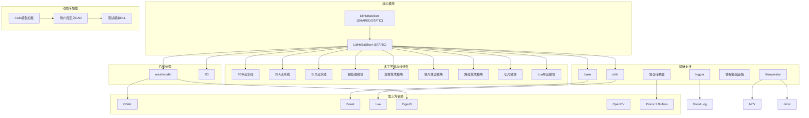

**图表来源**
- [CMakeLists.txt:1-58](file://DllHsBaSlicer/CMakeLists.txt#L1-L58)
- [pipeline_types.h:1-400](file://pipelinetypes/pipeline_types.h#L1-L400)
- [sls_export.hpp:1-52](file://LibHsBaSlicer/Path/sls_export.hpp#L1-L52)

**章节来源**
- [CMakeLists.txt:1-58](file://DllHsBaSlicer/CMakeLists.txt#L1-L58)

## 核心组件
`DllHsBaSlicer`模块的核心现在是完整的多工艺流水线接口，包括FDM、SLA、SLS三种3D打印工艺的完整支持。该模块通过`HSBA_SLICER_API`宏导出，确保在不同平台上具有正确的链接属性。`dllexport.h`头文件定义了`HSBA_SLICER_API`宏，根据平台和编译选项决定使用`__declspec(dllexport)`或`__declspec(dllimport)`，在非Windows平台则为空定义。

**章节来源**
- [dllexport.h:1-16](file://DllHsBaSlicer/dllexport.h#L1-L16)
- [pipeline_types.h:1-400](file://pipelinetypes/pipeline_types.h#L1-L400)

## 架构概述
HsBaSlicer的架构分为三层：顶层应用、中间动态库`DllHsBaSlicer`和底层静态库`LibHsBaSlicer`。`DllHsBaSlicer`作为桥梁，将C++的复杂协程功能通过C风格接口暴露给外部语言。这种设计实现了良好的封装性和跨语言兼容性。在Android平台上，主应用被构建为共享库，以便打包进APK，并通过JNI加载。在iOS平台上，通过桥接头文件支持Swift直接调用。

```mermaid
graph TD
A["外部语言 (C#/Python/Java/Swift)"] --> B["DllHsBaSlicer (C接口)"]
B --> C["LibHsBaSlicer (C++核心)"]
C --> D["协程基础设施 (Task/Generator)"]
C --> E["多工艺流水线组件"]
E --> F["FDM: 预处理->切片->支撑->填充->路径生成"]
E --> G["SLA: 预处理->切片->底板->支撑->导出"]
E --> H["SLS: 预处理->切片->Lua导出"]
C --> I["基础库 (base/utils)"]
C --> J["几何库 (CGAL/libigl/OpenCASCADE)"]
C --> K["第三方库 (Boost/Lua/Eigen/Protobuf)"]
L["动态库加载器"] --> M["UserCustomCADModel"]
M --> N["IModel接口"]
N --> O["TriangleMesh接口"]
P["Android应用"] --> Q["System.loadLibrary(\"HsBaSlicer\")"]
Q --> R["HsBaSlicer (共享库)"]
R --> B
S["iOS应用"] --> T["Swift桥接头"]
T --> U["HsBaSlicerBridge.h"]
U --> B
```

**图表来源**
- [MainActivity.java:1-46](file://android/app/src/main/java/com/hsmbanlance/hsbaslicer/example/MainActivity.java#L1-L46)
- [HsBaSlicerBridge.h:1-31](file://ios/HsBaSlicerExample/HsBaSlicerBridge.h#L1-L31)
- [pipeline_types.h:1-400](file://pipelinetypes/pipeline_types.h#L1-L400)

## 详细组件分析

### DllHsBaSlicer模块分析
`DllHsBaSlicer`模块现在提供了完整的多工艺流水线接口，包括FDM、SLA、SLS三种3D打印工艺的完整支持。每个工艺都有独立的流水线实现，使用C++20协程实现异步执行，同时提供同步和异步两种调用方式。

#### 主要接口函数
```mermaid
classDiagram
class DllHsBaSlicer {
+HSBA_SLICER_API void initialize()
+HSBA_SLICER_API HsBaFdmPipelineConfig_t HsBaCreateDefaultFdmConfig()
+HSBA_SLICER_API HsBaFdmPipelineResult_t HsBaRunFdmPipeline(config, callback, user_data)
+HSBA_SLICER_API void HsBaRunFdmPipelineAsync(config, callback, user_data, result_callback, result_user_data)
+HSBA_SLICER_API HsBaSlaPipelineConfig_t HsBaCreateDefaultSlaConfig()
+HSBA_SLICER_API HsBaSlaPipelineResult_t HsBaRunSlaPipeline(config, callback, user_data)
+HSBA_SLICER_API void HsBaRunSlaPipelineAsync(config, callback, user_data, result_callback, result_user_data)
+HSBA_SLICER_API HsBaSlsPipelineConfig_t HsBaCreateDefaultSlsConfig()
+HSBA_SLICER_API HsBaSlsPipelineResult_t HsBaRunSlsPipeline(config, callback, user_data)
+HSBA_SLICER_API void HsBaRunSlsPipelineAsync(config, callback, user_data, result_callback, result_user_data)
+HSBA_SLICER_API void HsBaFreeFdmPipelineResult(result)
+HSBA_SLICER_API void HsBaFreeSlaPipelineResult(result)
+HSBA_SLICER_API void HsBaFreeSlsPipelineResult(result)
}
note right of DllHsBaSlicer
C风格导出接口
使用extern "C"避免名称修饰
协程驱动的多工艺流水线
支持同步和异步调用
end note
```

**图表来源**
- [fdm_pipeline.h:1-147](file://DllHsBaSlicer/fdm_pipeline.h#L1-L147)
- [sla_pipeline.h:1-147](file://DllHsBaSlicer/sla_pipeline.h#L1-L147)
- [sls_pipeline.h:1-60](file://DllHsBaSlicer/sls_pipeline.h#L1-L60)
- [dllexport.h:5-13](file://DllHsBaSlicer/dllexport.h#L5-L13)

#### 构建配置
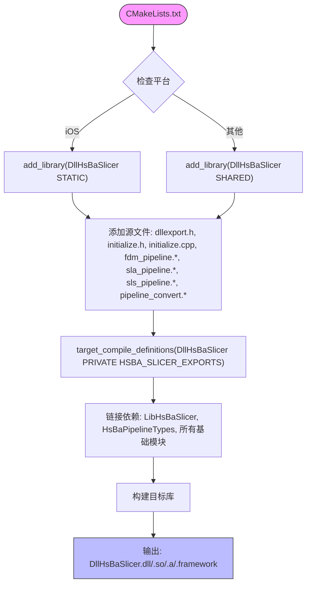

**图表来源**
- [CMakeLists.txt:1-58](file://DllHsBaSlicer/CMakeLists.txt#L1-L58)

**章节来源**
- [CMakeLists.txt:1-58](file://DllHsBaSlicer/CMakeLists.txt#L1-L58)
- [fdm_pipeline.h:1-147](file://DllHsBaSlicer/fdm_pipeline.h#L1-L147)
- [sla_pipeline.h:1-147](file://DllHsBaSlicer/sla_pipeline.h#L1-L147)
- [sls_pipeline.h:1-60](file://DllHsBaSlicer/sls_pipeline.h#L1-L60)

## 多工艺流水线支持

### FDM流水线（熔融沉积成型）
FDM流水线提供完整的熔融沉积成型支持，包括模型预处理、切片、支撑生成、填充算法和路径生成等完整流程。

#### 核心数据结构
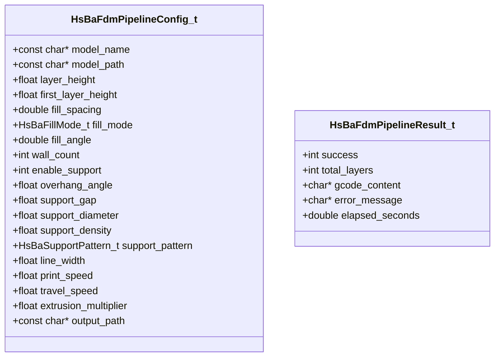

### SLA流水线（立体光刻）
SLA流水线提供立体光刻支持，包括模型预处理、切片、底板生成、支撑创建和图像导出等功能。

#### 核心数据结构
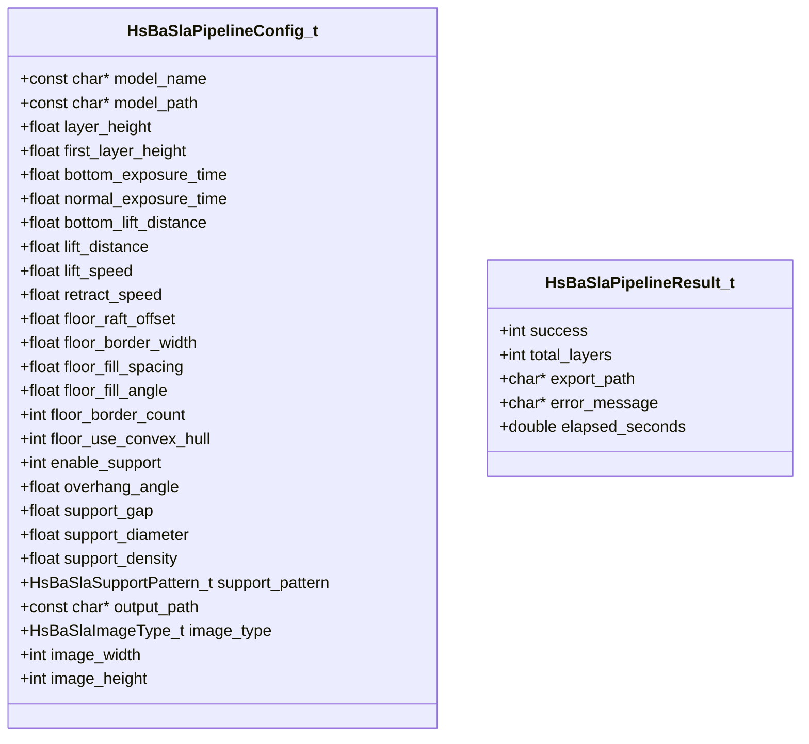

### SLS流水线（选择性激光烧结）**新增**
SLS流水线提供选择性激光烧结支持，这是最新的工艺支持。SLS使用粉末床工艺，无需底板和支撑结构，输出格式完全由Lua脚本控制。

#### 核心数据结构
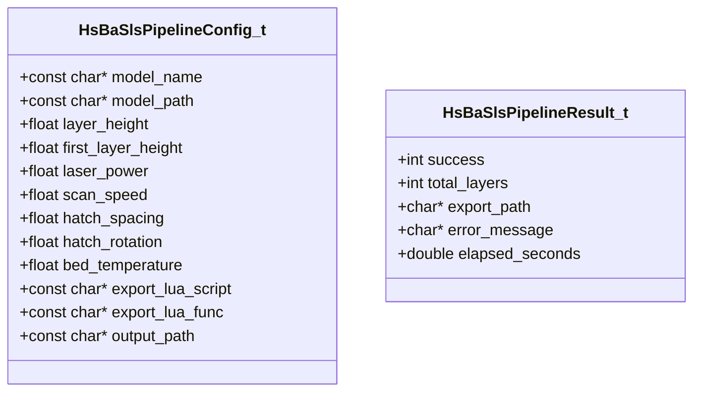

#### SLS流水线实现
SLS流水线内部使用C++20协程实现，包含三个主要阶段：

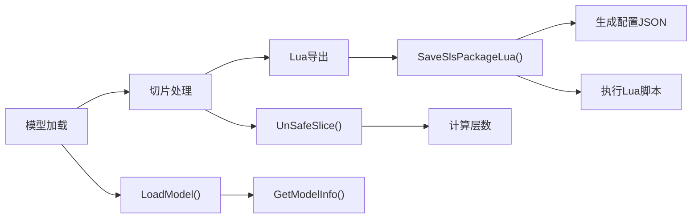

**图表来源**
- [sls_pipeline.cpp:169-270](file://DllHsBaSlicer/sls_pipeline.cpp#L169-L270)
- [sls_export.hpp:1-52](file://LibHsBaSlicer/Path/sls_export.hpp#L1-L52)

**章节来源**
- [pipeline_types.h:1-400](file://pipelinetypes/pipeline_types.h#L1-L400)
- [sls_pipeline.h:1-60](file://DllHsBaSlicer/sls_pipeline.h#L1-L60)
- [sls_pipeline.cpp:1-316](file://DllHsBaSlicer/sls_pipeline.cpp#L1-316)
- [sls_export.hpp:1-52](file://LibHsBaSlicer/Path/sls_export.hpp#L1-L52)

## 动态库加载增强

### 用户自定义CAD模型支持
系统现在支持动态加载用户自定义的CAD模型DLL，通过统一的接口规范实现跨DLL边界的模型操作。

#### IModel接口定义
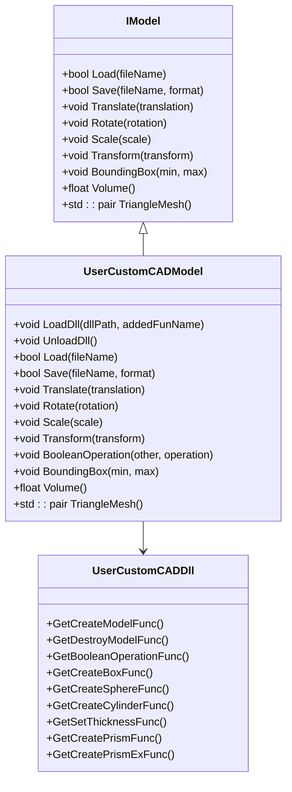

**图表来源**
- [IModel.hpp:110-138](file://base/IModel.hpp#L110-L138)
- [UserCustomCADModel.hpp:59-87](file://cadmodel/UserCustomCADModel.hpp#L59-L87)
- [UserCustomCADModel.hpp:16-57](file://cadmodel/UserCustomCADModel.hpp#L16-L57)

### 动态函数解析机制
系统使用Boost.DLL库进行运行时函数符号解析，支持类型安全的函数指针获取和调用。

#### 函数解析流程
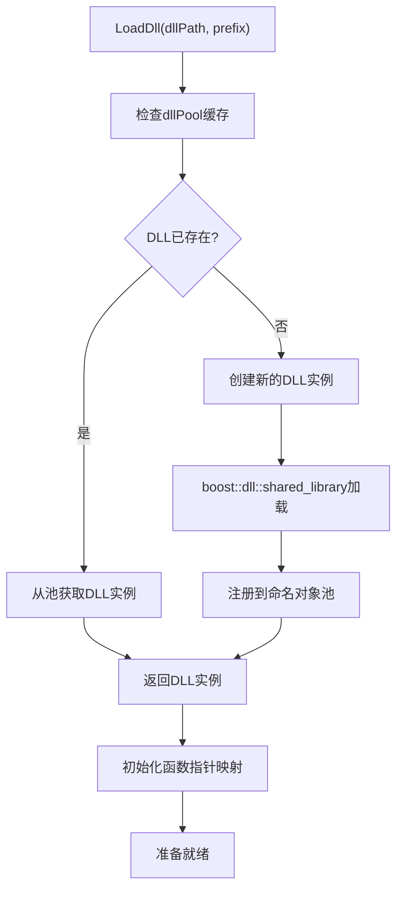

**图表来源**
- [UserCustomCADModel.cpp:130-145](file://cadmodel/UserCustomCADModel.cpp#L130-L145)
- [UserCustomCADModel.cpp:27-29](file://cadmodel/UserCustomCADModel.cpp#L27-L29)

### 错误处理增强
系统实现了完善的错误处理机制，包括DLL加载失败、函数解析失败、模型操作异常等情况的处理。

#### 错误类型定义
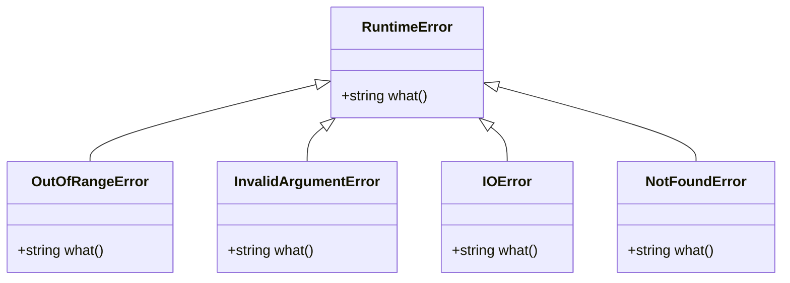

**图表来源**
- [error.hpp:20-144](file://base/error.hpp#L20-L144)

### TriangleMesh接口实现
TriangleMesh接口提供了IGL风格的三角网格数据访问，用于动态加载的CAD模型。

#### 接口实现细节
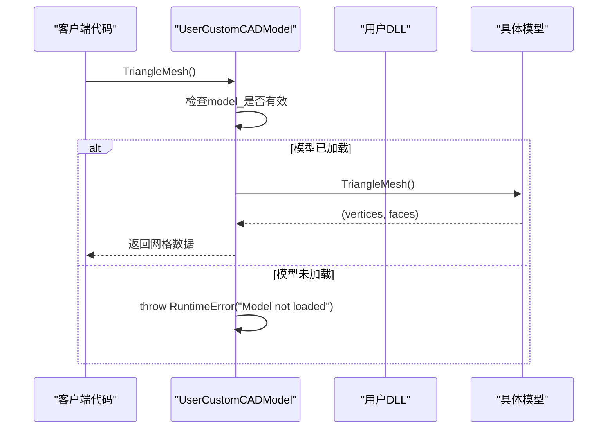

**图表来源**
- [UserCustomCADModel.cpp:311-321](file://cadmodel/UserCustomCADModel.cpp#L311-L321)
- [IModel.hpp:137](file://base/IModel.hpp#L137)

**章节来源**
- [UserCustomCADModel.hpp:1-92](file://cadmodel/UserCustomCADModel.hpp#L1-L92)
- [UserCustomCADModel.cpp:1-326](file://cadmodel/UserCustomCADModel.cpp#L1-L326)
- [IModel.hpp:1-150](file://base/IModel.hpp#L1-L150)
- [error.hpp:1-147](file://base/error.hpp#L1-L147)

## 跨语言集成指南

### C#集成
在C#中，使用`DllImport`特性声明各工艺流水线函数，指定DLL名称和调用约定。需要定义相应的结构体来匹配C接口的数据结构。

```csharp
// FDM流水线示例
[DllImport("DllHsBaSlicer", CallingConvention = CallingConvention.Cdecl)]
private static extern HsBaFdmPipelineResult_t HsBaRunFdmPipeline(
    ref HsBaFdmPipelineConfig_t config,
    ProgressCallback callback,
    IntPtr user_data);

// SLA流水线示例
[DllImport("DllHsBaSlicer", CallingConvention = CallingConvention.Cdecl)]
private static extern HsBaSlaPipelineResult_t HsBaRunSlaPipeline(
    ref HsBaSlaPipelineConfig_t config,
    SlaProgressCallback callback,
    IntPtr user_data);

// SLS流水线示例
[DllImport("DllHsBaSlicer", CallingConvention = CallingConvention.Cdecl)]
private static extern HsBaSlsPipelineResult_t HsBaRunSlsPipeline(
    ref HsBaSlsPipelineConfig_t config,
    SlsProgressCallback callback,
    IntPtr user_data);
```

### Python集成
在Python中，使用`ctypes.CDLL`加载动态库并调用各工艺流水线函数。需要定义相应的结构体和回调函数类型。

```python
import ctypes

# 加载动态库
dll = ctypes.CDLL('DllHsBaSlicer')

# 定义回调函数类型
progress_callback = ctypes.CFUNCTYPE(None, ctypes.c_int, ctypes.c_char_p, ctypes.c_void_p)

# 调用FDM流水线
result = dll.HsBaRunFdmPipeline(ctypes.byref(config), progress_callback, None)
```

### Java集成
在Java中，通过JNI机制调用本地方法。Android应用通过`System.loadLibrary("HsBaSlicer")`加载共享库。

```java
public class MainActivity extends Activity {
    static {
        System.loadLibrary("HsBaSlicer");
    }
    
    private native void runPipelineExamples();
    
    @Override
    protected void onCreate(Bundle savedInstanceState) {
        super.onCreate(savedInstanceState);
        try {
            runPipelineExamples();
        } catch (Exception e) {
            // 错误处理
        }
    }
}
```

**章节来源**
- [MainActivity.java:1-46](file://android/app/src/main/java/com/hsmbanlance/hsbaslicer/example/MainActivity.java#L1-L46)

## 平台特定集成

### Android平台集成
Android平台通过JNI机制集成HsBaSlicer。主应用加载本地库并调用流水线示例函数。

#### JNI桥接实现
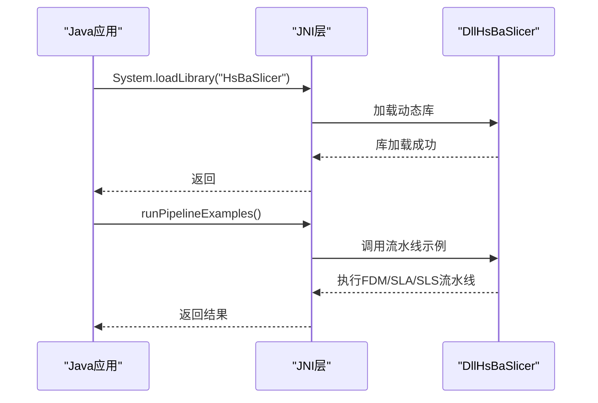

**图表来源**
- [MainActivity.java:17-44](file://android/app/src/main/java/com/hsmbanlance/hsbaslicer/example/MainActivity.java#L17-L44)

#### 构建配置
Android构建配置使用Gradle，指定jniLibs目录和ABI过滤器。

**章节来源**
- [MainActivity.java:1-46](file://android/app/src/main/java/com/hsmbanlance/hsbaslicer/example/MainActivity.java#L1-L46)
- [build.gradle:1-45](file://android/app/build.gradle#L1-L45)

### iOS平台集成
iOS平台通过桥接头文件支持Swift直接调用。桥接头文件声明了从C++静态库导出的流水线示例入口函数。

#### Swift桥接头
```objc
/**
 * @brief 运行 FDM / SLA / SLS 三种工艺流水线示例。
 *
 * 内部调用 initialize() 后依次执行 FDM、SLA、SLS 流水线。
 * 仅供示例演示和功能测试，非生产环境实际入口。
 */
void HsBaRunPipelineExamples(void);
```

#### Swift调用示例
```swift
import Foundation

@objc class ViewController: UIViewController {
    override func viewDidLoad() {
        super.viewDidLoad()
        HsBaRunPipelineExamples()
    }
}
```

**章节来源**
- [HsBaSlicerBridge.h:1-31](file://ios/HsBaSlicerExample/HsBaSlicerBridge.h#L1-L31)

## 依赖分析
HsBaSlicer项目依赖多个第三方库，这些依赖通过vcpkg包管理器管理。`DllHsBaSlicer`直接依赖`LibHsBaSlicer`静态库以及多个基础模块，而`LibHsBaSlicer`又依赖于多个基础模块和第三方库。

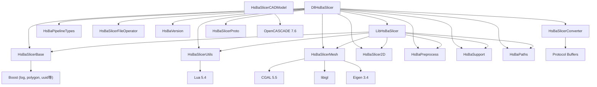

**图表来源**
- [CMakeLists.txt:42-58](file://DllHsBaSlicer/CMakeLists.txt#L42-L58)
- [pipeline_types.h:1-400](file://pipelinetypes/pipeline_types.h#L1-L400)

**章节来源**
- [CMakeLists.txt:42-58](file://DllHsBaSlicer/CMakeLists.txt#L42-L58)

## 性能考虑
动态库的初始化过程应尽可能轻量，避免在`initialize()`函数中执行耗时操作。多工艺流水线内部使用C++20协程优化，支持逐层并行处理和异步执行。建议将资源密集型的初始化延迟到实际使用时进行。对于Android平台，应注意ABI过滤，目前配置为仅构建`arm64-v8a`架构，以减小APK体积。协程流水线支持进度回调，便于实现用户界面更新和任务取消功能。SLS流水线特别优化了Lua脚本导出性能，支持高效的粉末床数据处理。

**动态库加载性能优化**：
- 使用命名对象池缓存已加载的DLL实例，避免重复加载开销
- 实现懒加载机制，仅在首次使用时加载DLL
- 支持DLL卸载功能，释放不再使用的资源
- 提供函数存在性检查，减少无效调用尝试

## 故障排除指南
常见问题包括：
- 动态库加载失败：检查依赖的第三方库是否在系统路径中
- 函数调用失败：确保调用约定一致，避免栈损坏
- Android平台找不到库：确认`.so`文件已正确复制到`jniLibs`目录
- iOS平台桥接失败：检查桥接头文件是否正确配置
- 协程执行异常：检查C++20协程编译器支持情况
- 内存泄漏：确保调用相应的释放函数释放结果内存
- 模型加载失败：验证模型文件格式和路径正确性
- SLS导出失败：确认Lua导出脚本路径和函数名正确
- **DLL加载失败**：检查DLL路径和函数前缀是否正确
- **函数解析失败**：确认用户DLL导出了预期的函数符号
- **跨DLL边界调用崩溃**：验证函数签名和数据类型一致性
- **TriangleMesh接口异常**：确保模型已正确加载且支持网格数据访问

**章节来源**
- [build.gradle:39-41](file://android/app/build.gradle#L39-L41)
- [sls_pipeline.h:24-44](file://DllHsBaSlicer/sls_pipeline.h#L24-L44)

## 结论
HsBaSlicer通过`DllHsBaSlicer`模块提供了强大的跨语言集成能力，特别是新增的完整SLS流水线支持和增强的动态库加载机制。其清晰的架构设计、跨平台的导出机制、完善的依赖管理和先进的协程技术，使得在C#、Python、Java、Swift等语言中集成复杂的3D打印流水线成为可能。新架构不仅保持了向后兼容性，还为未来的功能扩展奠定了坚实基础。开发者应遵循文档中的集成指南，注意调用约定、内存管理和协程使用，以确保稳定高效的运行。

**增强的动态库加载特性**：
- 类型安全的函数符号解析
- 完善的错误处理和异常机制
- 支持用户自定义CAD模型的动态加载
- 跨DLL边界的可靠函数调用
- 内存安全的模型生命周期管理
- 支持TriangleMesh等高级接口的统一访问