# 扩展与集成

<cite>
**本文档中引用的文件**   
- [LuaAdapter.cpp](file://2D/LuaAdapter.cpp)
- [LuaAdapter.hpp](file://2D/LuaAdapter.hpp)
- [cipher/LuaAdapter.cpp](file://cipher/LuaAdapter.cpp)
- [cipher/LuaAdapter.hpp](file://cipher/LuaAdapter.hpp)
- [custom_fill.lua](file://tests/PolygonFill/custom_fill.lua)
- [my_infill.lua](file://samples/FDM/scripts/my_infill.lua)
- [my_support.lua](file://samples/FDM/scripts/my_support.lua)
- [IPath.hpp](file://paths/IPath.hpp)
- [pointspath.hpp](file://paths/pointspath.hpp)
- [robotpath.hpp](file://paths/robotpath.hpp)
- [imagespath.hpp](file://paths/imagespath.hpp)
- [layerspath.hpp](file://paths/layerspath.hpp)
- [dllexport.h](file://DllHsBaSlicer/dllexport.h)
- [initialize.h](file://DllHsBaSlicer/initialize.h)
- [initialize.cpp](file://DllHsBaSlicer/initialize.cpp)
- [fdm_pipeline.h](file://DllHsBaSlicer/fdm_pipeline.h)
- [fdm_pipeline.cpp](file://DllHsBaSlicer/fdm_pipeline.cpp)
- [slice_config.proto](file://proto/slice_config.proto)
- [path.proto](file://proto/path.proto)
- [Eigen2Msg.cpp](file://convert/Eigen2Msg.cpp)
- [Msg2Eigen.cpp](file://convert/Msg2Eigen.cpp)
- [MainActivity.java](file://android/app/src/main/java/com/hsmbanlance/hsbaslicer/example/MainActivity.java)
- [ModelLoader.hpp](file://preprocess/ModelLoader.hpp)
- [LuaSupport.hpp](file://support/LuaSupport.hpp)
- [LuaSupport.cpp](file://support/LuaSupport.cpp)
- [LuaAdapter.hpp](file://support/LuaAdapter.hpp)
- [LuaAdapter.cpp](file://support/LuaAdapter.cpp)
</cite>

## 更新摘要
**所做更改**   
- 新增完整Lua脚本扩展机制，支持支撑生成和填充模式自定义
- 更新Pipeline架构，实现独立模型池管理
- 增强LuaSupport模块，提供完整的支撑生成器API
- 添加详细的Lua脚本示例和最佳实践

## 目录
1. [简介](#简介)
2. [项目结构](#项目结构)
3. [核心组件](#核心组件)
4. [架构概述](#架构概述)
5. [详细组件分析](#详细组件分析)
6. [依赖分析](#依赖分析)
7. [性能考虑](#性能考虑)
8. [故障排除指南](#故障排除指南)
9. [结论](#结论)
10. [附录](#附录)（如有必要）

## 简介
本文档提供关于如何扩展和集成HsBaSlicer功能的权威指南。重点介绍Lua脚本扩展机制：开发者如何编写custom_fill.lua脚本来实现自定义填充算法，并通过LuaCustomFill函数在C++中调用；如何利用LuaAdapter将C++对象暴露给Lua环境，实现双向交互。说明如何通过paths模块的Lua脚本支持来自定义输出格式（如G-code或SVG）。阐述动态库集成方案，包括DllHsBaSlicer导出的C风格API，如何在C#、Python或Java中通过P/Invoke、ctypes或JNI进行调用。详细解释Protobuf消息格式（如slice_config.proto和path.proto）的结构，以及如何在跨语言系统中使用这些消息进行数据交换。提供实际的集成示例和最佳实践。

**更新** 新增了完整的Lua脚本扩展能力，支持支撑生成和填充模式的自定义，以及Pipeline独立模型池管理。

## 项目结构
HsBaSlicer项目采用模块化架构，主要分为以下几个核心模块：2D几何处理、路径生成、加密解密、文件操作、日志记录、模型处理、协议缓冲区定义等。每个模块都有明确的职责和接口定义，便于扩展和维护。

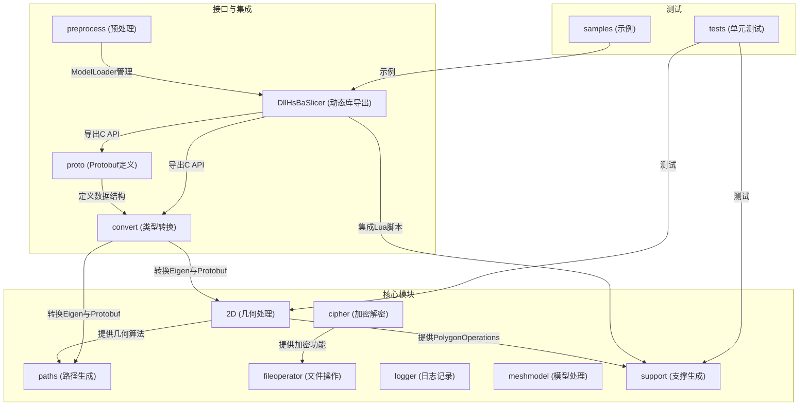

**Diagram sources**
- [2D/LuaAdapter.cpp:1-287](file://2D/LuaAdapter.cpp#L1-L287)
- [support/LuaAdapter.cpp:1-250](file://support/LuaAdapter.cpp#L1-L250)
- [preprocess/ModelLoader.hpp:1-131](file://preprocess/ModelLoader.hpp#L1-L131)
- [DllHsBaSlicer/fdm_pipeline.cpp:1-440](file://DllHsBaSlicer/fdm_pipeline.cpp#L1-L440)

**Section sources**
- [2D/LuaAdapter.cpp:1-287](file://2D/LuaAdapter.cpp#L1-L287)
- [support/LuaAdapter.cpp:1-250](file://support/LuaAdapter.cpp#L1-L250)
- [preprocess/ModelLoader.hpp:1-131](file://preprocess/ModelLoader.hpp#L1-L131)
- [DllHsBaSlicer/fdm_pipeline.cpp:1-440](file://DllHsBaSlicer/fdm_pipeline.cpp#L1-L440)

## 核心组件
HsBaSlicer的核心组件包括Lua脚本扩展机制、路径生成系统、动态库导出接口和Protobuf数据交换格式。这些组件共同构成了系统的可扩展性和集成能力。

**更新** 新增了完整的Lua支撑生成系统和Pipeline独立模型池管理。

**Section sources**
- [2D/LuaAdapter.cpp:1-287](file://2D/LuaAdapter.cpp#L1-L287)
- [support/LuaSupport.hpp:1-72](file://support/LuaSupport.hpp#L1-L72)
- [support/LuaAdapter.cpp:1-250](file://support/LuaAdapter.cpp#L1-L250)
- [preprocess/ModelLoader.hpp:1-131](file://preprocess/ModelLoader.hpp#L1-L131)

## 架构概述
HsBaSlicer采用分层架构设计，从底层的几何算法到高层的路径生成和数据交换，各层之间通过清晰的接口进行通信。系统支持通过Lua脚本进行功能扩展，并通过动态库导出C风格API供外部调用。

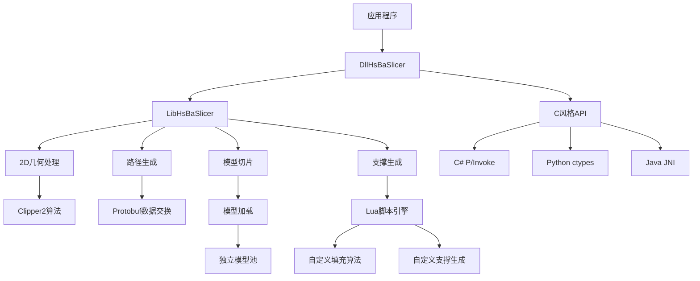

**Diagram sources**
- [DllHsBaSlicer/fdm_pipeline.cpp:203-367](file://DllHsBaSlicer/fdm_pipeline.cpp#L203-L367)
- [support/LuaSupport.cpp:103-160](file://support/LuaSupport.cpp#L103-L160)
- [preprocess/ModelLoader.hpp:26-127](file://preprocess/ModelLoader.hpp#L26-L127)

## 详细组件分析

### Lua脚本扩展机制分析
HsBaSlicer通过LuaAdapter实现C++与Lua的双向交互，允许开发者编写自定义脚本来扩展系统功能。

#### LuaAdapter实现
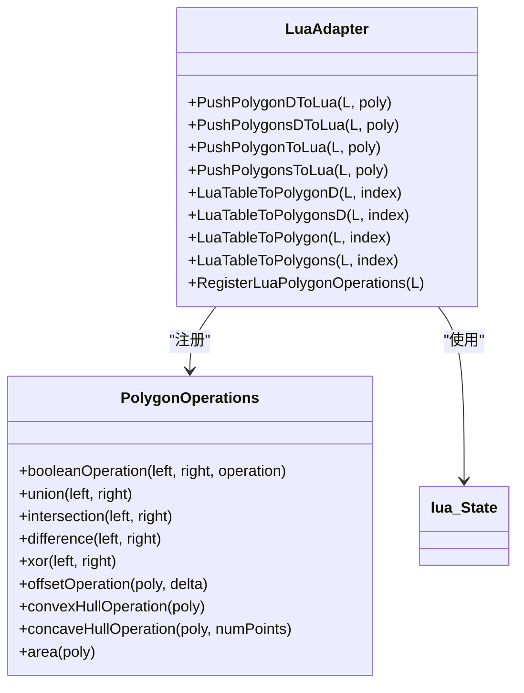

**Diagram sources**
- [2D/LuaAdapter.cpp:1-287](file://2D/LuaAdapter.cpp#L1-L287)
- [2D/LuaAdapter.hpp:1-25](file://2D/LuaAdapter.hpp#L1-L25)

#### 自定义填充算法实现
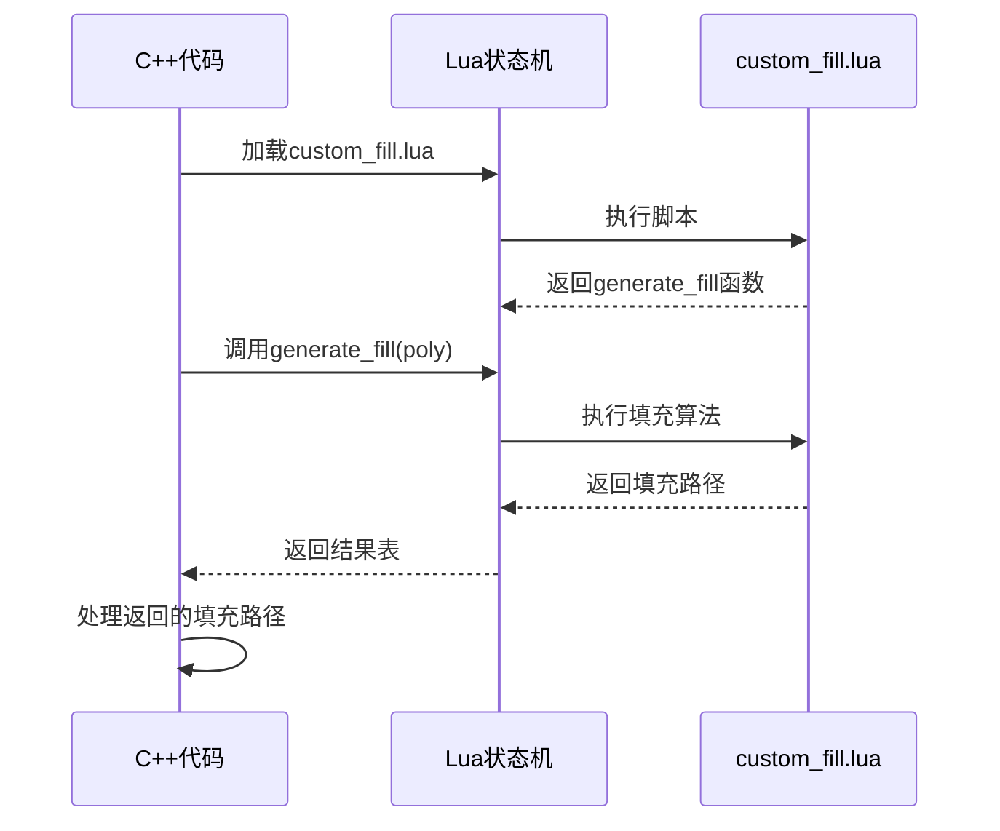

**Diagram sources**
- [2D/LuaAdapter.cpp:1272-1359](file://2D/LuaAdapter.cpp#L1272-L1359)
- [tests/PolygonFill/custom_fill.lua:1-16](file://tests/PolygonFill/custom_fill.lua#L1-L16)

**更新** 新增了完整的支撑生成Lua支持系统。

#### 支撑生成Lua支持系统
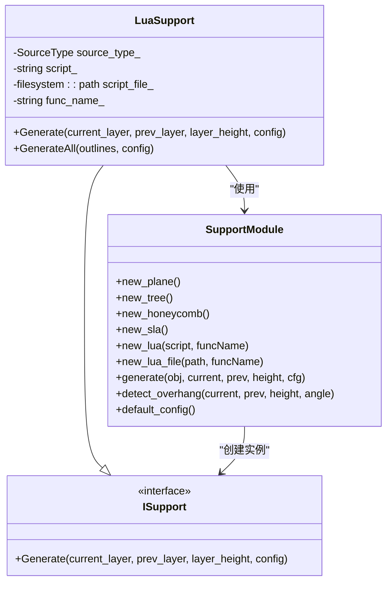

**Diagram sources**
- [support/LuaSupport.hpp:32-69](file://support/LuaSupport.hpp#L32-L69)
- [support/LuaAdapter.cpp:226-249](file://support/LuaAdapter.cpp#L226-L249)

**Section sources**
- [2D/LuaAdapter.cpp:1-287](file://2D/LuaAdapter.cpp#L1-L287)
- [support/LuaSupport.hpp:1-72](file://support/LuaSupport.hpp#L1-L72)
- [support/LuaAdapter.cpp:1-250](file://support/LuaAdapter.cpp#L1-L250)
- [tests/PolygonFill/custom_fill.lua:1-16](file://tests/PolygonFill/custom_fill.lua#L1-L16)

### Pipeline独立模型池分析
**新增** HsBaSlicer现在为每个Pipeline实例提供独立的模型池，避免多次运行时的模型名冲突问题。

#### ModelLoader类图
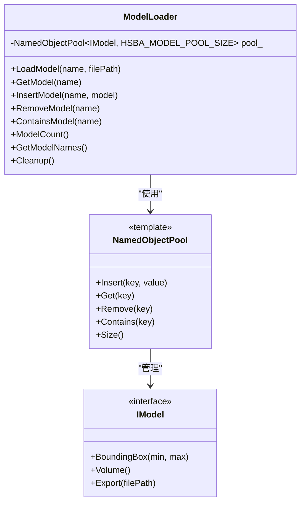

**Diagram sources**
- [preprocess/ModelLoader.hpp:26-127](file://preprocess/ModelLoader.hpp#L26-L127)

#### Pipeline集成流程
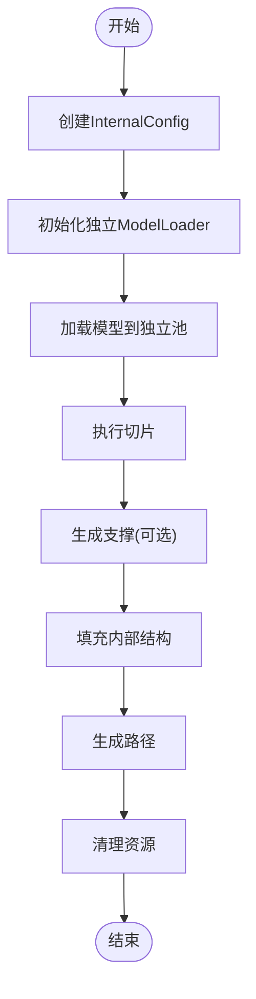

**Diagram sources**
- [DllHsBaSlicer/fdm_pipeline.cpp:203-367](file://DllHsBaSlicer/fdm_pipeline.cpp#L203-L367)

**Section sources**
- [preprocess/ModelLoader.hpp:1-131](file://preprocess/ModelLoader.hpp#L1-L131)
- [DllHsBaSlicer/fdm_pipeline.cpp:197-236](file://DllHsBaSlicer/fdm_pipeline.cpp#L197-L236)

### 路径生成系统分析
HsBaSlicer的路径生成系统通过IPath接口和多个具体实现类来支持不同类型的路径输出。

#### 路径生成类图
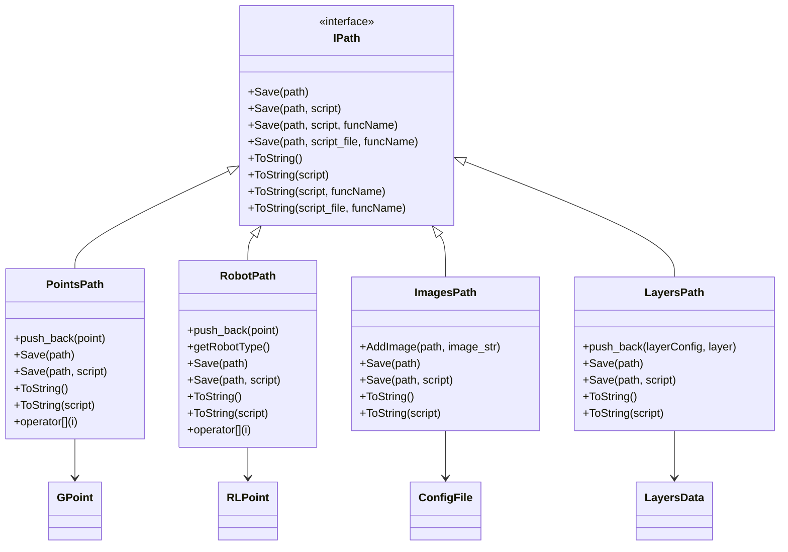

**Diagram sources**
- [paths/IPath.hpp:1-34](file://paths/IPath.hpp#L1-L34)
- [paths/pointspath.hpp:1-69](file://paths/pointspath.hpp#L1-L69)
- [paths/robotpath.hpp:1-75](file://paths/robotpath.hpp#L1-L75)
- [paths/imagespath.hpp:1-38](file://paths/imagespath.hpp#L1-L38)
- [paths/layerspath.hpp:1-39](file://paths/layerspath.hpp#L1-L39)

#### 路径生成流程
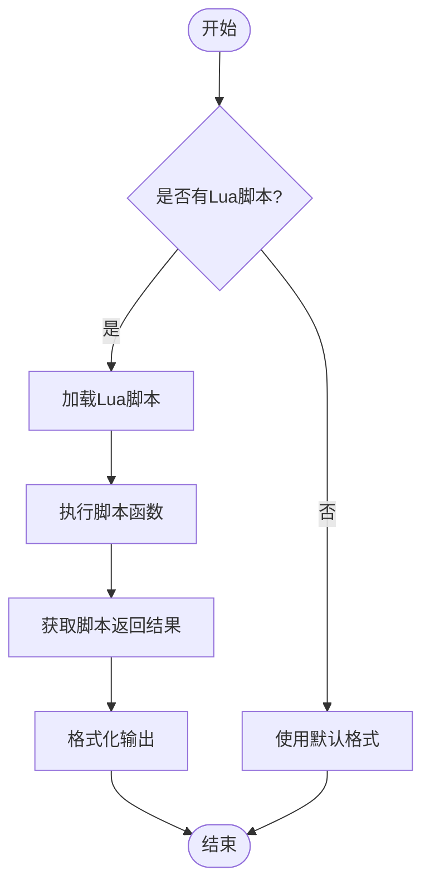

**Diagram sources**
- [paths/IPath.hpp:1-34](file://paths/IPath.hpp#L1-L34)
- [paths/pointspath.hpp:1-69](file://paths/pointspath.hpp#L1-L69)

**Section sources**
- [paths/IPath.hpp:1-34](file://paths/IPath.hpp#L1-L34)
- [paths/pointspath.hpp:1-69](file://paths/pointspath.hpp#L1-L69)
- [paths/robotpath.hpp:1-75](file://paths/robotpath.hpp#L1-L75)
- [paths/imagespath.hpp:1-38](file://paths/imagespath.hpp#L1-L38)
- [paths/layerspath.hpp:1-39](file://paths/layerspath.hpp#L1-L39)

### 动态库集成方案分析
HsBaSlicer通过DllHsBaSlicer模块导出C风格API，支持跨语言调用。

#### 动态库导出接口
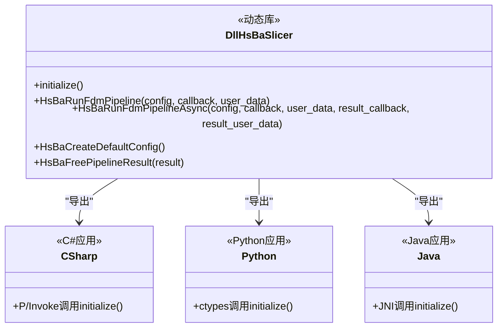

**Diagram sources**
- [DllHsBaSlicer/dllexport.h:1-16](file://DllHsBaSlicer/dllexport.h#L1-L16)
- [DllHsBaSlicer/fdm_pipeline.h:107-149](file://DllHsBaSlicer/fdm_pipeline.h#L107-L149)
- [android/app/src/main/java/com/hsmbanlance/hsbaslicer/example/MainActivity.java:1-20](file://android/app/src/main/java/com/hsmbanlance/hsbaslicer/example/MainActivity.java#L1-L20)

#### 跨语言调用流程
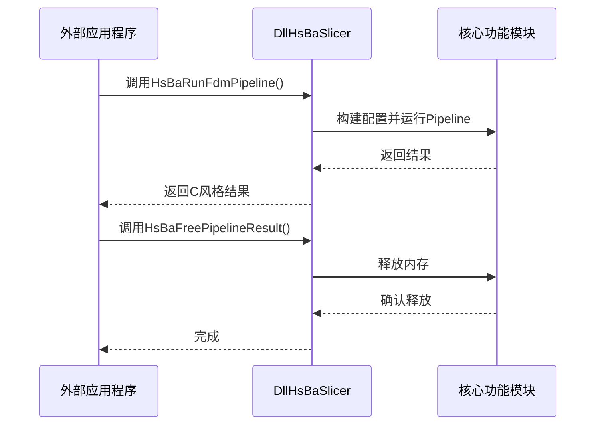

**Diagram sources**
- [DllHsBaSlicer/fdm_pipeline.h:120-149](file://DllHsBaSlicer/fdm_pipeline.h#L120-L149)
- [DllHsBaSlicer/fdm_pipeline.cpp:406-435](file://DllHsBaSlicer/fdm_pipeline.cpp#L406-L435)

**Section sources**
- [DllHsBaSlicer/dllexport.h:1-16](file://DllHsBaSlicer/dllexport.h#L1-L16)
- [DllHsBaSlicer/fdm_pipeline.h:1-156](file://DllHsBaSlicer/fdm_pipeline.h#L1-L156)
- [DllHsBaSlicer/fdm_pipeline.cpp:371-435](file://DllHsBaSlicer/fdm_pipeline.cpp#L371-L435)

### Protobuf数据交换格式分析
HsBaSlicer使用Protobuf定义数据交换格式，确保跨语言系统间的数据一致性。

#### Protobuf消息结构
```mermaid
erDiagram
slice_config {
msg_slice_type type PK
float slice_height
string diff_string
float ring_radius
msg_point3 ring_center
msg_vector3 ring_normal
string curved_path
}
path3 {
repeated msg_point3 point PK
}
path2 {
repeated msg_point2 point PK
}
point3 {
float x PK
float y
float z
}
point2 {
float x PK
float y
}
slice_config ||--o{ path3 : "包含"
slice_config ||--o{ path2 : "包含"
path3 ||--o{ point3 : "包含"
path2 ||--o{ point2 : "包含"
```

**Diagram sources**
- [proto/slice_config.proto:1-27](file://proto/slice_config.proto#L1-L27)
- [proto/path.proto:1-15](file://proto/path.proto#L1-L15)

#### 数据转换流程
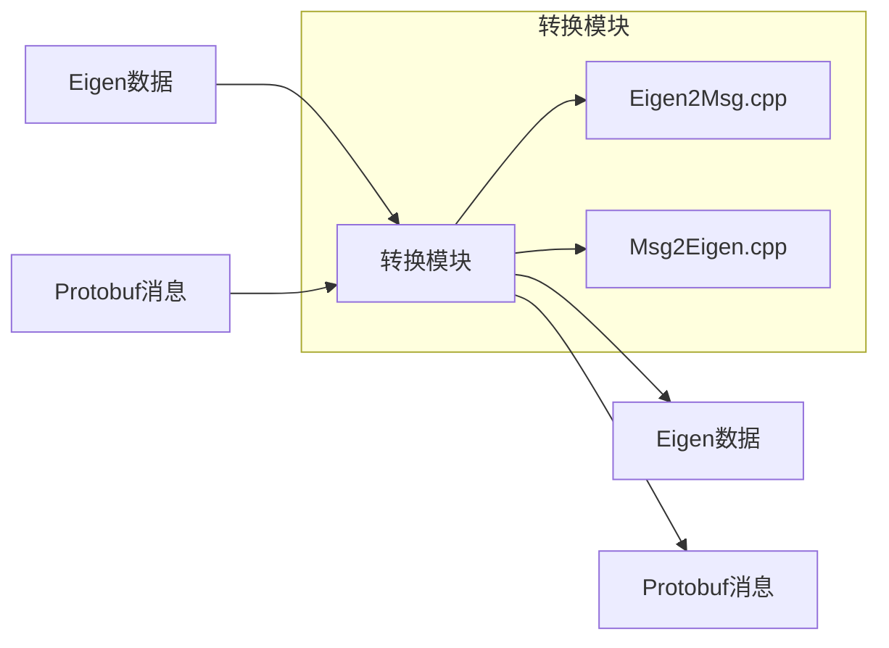

**Diagram sources**
- [convert/Eigen2Msg.cpp:1-145](file://convert/Eigen2Msg.cpp#L1-L145)
- [convert/Msg2Eigen.cpp:1-115](file://convert/Msg2Eigen.cpp#L1-L115)

**Section sources**
- [proto/slice_config.proto:1-27](file://proto/slice_config.proto#L1-L27)
- [proto/path.proto:1-15](file://proto/path.proto#L1-L15)
- [convert/Eigen2Msg.cpp:1-145](file://convert/Eigen2Msg.cpp#L1-L145)
- [convert/Msg2Eigen.cpp:1-115](file://convert/Msg2Eigen.cpp#L1-L115)

## 依赖分析
HsBaSlicer的各个模块之间存在明确的依赖关系，这些依赖关系通过CMakeLists.txt文件进行管理。

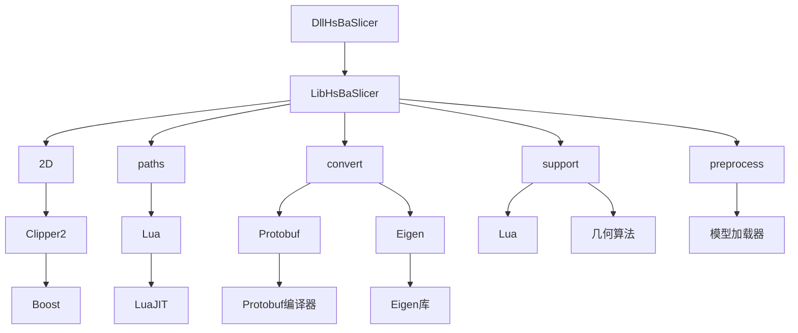

**Diagram sources**
- [DllHsBaSlicer/CMakeLists.txt:1-10](file://DllHsBaSlicer/CMakeLists.txt#L1-L10)
- [paths/CMakeLists.txt:1-15](file://paths/CMakeLists.txt#L1-L15)
- [proto/CMakeLists.txt:1-10](file://proto/CMakeLists.txt#L1-L10)

**Section sources**
- [DllHsBaSlicer/CMakeLists.txt:1-10](file://DllHsBaSlicer/CMakeLists.txt#L1-L10)
- [paths/CMakeLists.txt:1-15](file://paths/CMakeLists.txt#L1-L15)
- [proto/CMakeLists.txt:1-10](file://proto/CMakeLists.txt#L1-L10)

## 性能考虑
在扩展和集成HsBaSlicer时，需要考虑以下几个性能因素：

1. **Lua脚本执行性能**：Lua脚本的执行效率直接影响填充算法的性能，建议对复杂算法进行性能测试。
2. **数据转换开销**：Eigen与Protobuf之间的数据转换会带来一定的性能开销，建议在必要时进行批量转换。
3. **动态库调用开销**：跨语言调用会带来额外的性能开销，建议尽量减少频繁的小数据量调用。
4. **内存管理**：注意Lua状态机的内存管理，避免内存泄漏。
5. **模型池管理**：使用独立模型池可以避免全局状态冲突，提高并发安全性。
6. **Pipeline优化**：每个Pipeline实例独立管理资源，减少资源竞争和锁竞争。

**更新** 新增了模型池管理和Pipeline优化的性能考虑。

## 故障排除指南
在使用HsBaSlicer的扩展和集成功能时，可能会遇到以下常见问题：

**更新** 新增了Lua脚本和Pipeline相关的故障排除指南。

### Lua脚本相关问题
- **脚本加载失败**：检查脚本路径是否正确，确保文件存在且可读
- **函数未找到**：确认脚本中定义的函数名称与配置中的函数名一致
- **数据类型错误**：确保传入的参数类型与期望类型匹配
- **内存泄漏**：检查Lua脚本中是否正确释放资源

### Pipeline相关问题
- **模型加载失败**：检查模型文件格式是否受支持，路径是否正确
- **模型名冲突**：使用独立模型池后，不同Pipeline实例不会共享模型缓存
- **Lua脚本执行异常**：查看错误日志，定位具体的Lua运行时错误

### 支撑生成问题
- **悬垂检测不准确**：调整overhang_angle_threshold参数
- **支撑密度不合适**：根据模型复杂度调整support_density参数
- **支撑与模型干涉**：增加support_gap参数值

**Section sources**
- [support/LuaSupport.cpp:123-137](file://support/LuaSupport.cpp#L123-L137)
- [2D/PolygonFill.cpp:1292-1295](file://2D/PolygonFill.cpp#L1292-L1295)
- [DllHsBaSlicer/fdm_pipeline.cpp:357-361](file://DllHsBaSlicer/fdm_pipeline.cpp#L357-L361)

## 结论
HsBaSlicer提供了强大的扩展和集成能力，通过Lua脚本、动态库导出和Protobuf数据交换等多种机制，支持开发者根据具体需求进行功能扩展和系统集成。本文档详细介绍了这些机制的使用方法和最佳实践，为开发者提供了权威的参考指南。

**更新** 新增了完整的Lua支撑生成系统、Pipeline独立模型池管理和详细的故障排除指南，进一步增强了系统的可扩展性和易用性。

## 附录
### Protobuf消息定义
#### slice_config.proto
```proto
syntax = "proto3";

package HsbaProto;

import "point.proto";
import "vector.proto";

enum msg_slice_type 
{
    slicet_Same=0; // slices have the same heights and z_direction
    slicet_Diff=1; // slices have different heights and z_direction, a string with [0-X]:h1, [X+1-Y]:h2, [Y+1-Z]:h3, ..., [N-1]:hN
    slicet_Curved=2;// slices display a mesh file
    slicet_Ring=3;// slices form a ring
    slicet_None=4;// no slice
    slicet_Unknown=5;// unknown slice type
}

message msg_slice_config
{
    msg_slice_type type = 1; // 0: same, 1: diff, 2: curved, 3: ring
    float slice_height = 2; // mm z_direction
    string diff_string = 3; // diff string 
    float ring_radius = 4; // mm
    msg_point3 ring_center = 5;// ring center
    msg_vector3 ring_normal = 6;// ring normal
    string curved_path =7; // curved surface path, as a mesh file
}
```

#### path.proto
```proto
syntax = "proto3";

package HsbaProto;

import "point.proto";

message msg_path3
{
	repeated msg_point3 point=1;
}

message msg_path2
{
	repeated msg_point2 point=1;
}
```

### Lua脚本示例
#### 自定义填充脚本 (my_infill.lua)
```lua
-- my_infill.lua
-- 自定义填充生成脚本（不含壁厚）
--
-- Lua 环境全局变量:
--   current_layer : 当前层多边形（已扣除壁厚区域）
--   layer_index   : 当前层索引（从 0 开始）
--   layer_height  : 层高（mm）
--   config        : 填充配置表，含 fill_spacing, fill_mode, fill_angle 等
--
-- 可用 PolygonOperations 函数:
--   offsetOperation(polys, delta)   -- 偏移
--   union / intersection / difference / xor
--   makeCircle / makeRectangle / makeRegularPolygon
--   area(poly)
--
-- 返回值: 填充多边形表

local PO = PolygonOperations

function generate_fill()
    if #current_layer == 0 then
        return {}
    end

    local spacing = config.fill_spacing or 0.4
    local angle = config.fill_angle or 45.0

    -- 计算当前层的填充角度（逐层旋转 60°，形成更均匀的力学结构）
    local layer_angle = angle + (layer_index % 6) * 60.0
    local rad = layer_angle * math.pi / 180.0

    -- 计算当前层的边界框
    local min_x, min_y = math.huge, math.huge
    local max_x, max_y = -math.huge, -math.huge

    for _, poly in ipairs(current_layer) do
        for _, pt in ipairs(poly) do
            if pt.x < min_x then min_x = pt.x end
            if pt.y < min_y then min_y = pt.y end
            if pt.x > max_x then max_x = pt.x end
            if pt.y > max_y then max_y = pt.y end
        end
    end

    -- 生成对角线填充
    local result = {}
    local step = spacing
    
    while min_x < max_x do
        table.insert(result, {
            {x = min_x, y = min_y},
            {x = max_x, y = max_y}
        })
        min_x = min_x + step
    end

    return result
end
```

#### 自定义支撑脚本 (my_support.lua)
```lua
-- my_support.lua
-- 自定义支撑生成脚本 —— 使用内置支撑生成器
--
-- Lua 环境全局变量:
--   current_layer : 当前层多边形 { { {x=..,y=..}, ... }, ... }
--   prev_layer    : 上一层多边形（首层为空）
--   layer_height  : 层高（mm）
--   config        : 支撑配置表，含 overhang_angle_threshold, support_diameter,
--                   support_gap, support_density, support_pattern 等字段
--
-- 可用 PolygonOperations 函数:
--   offsetOperation(polys, delta)   -- 偏移（正=膨胀，负=收缩）
--   intersection(polys_a, polys_b)  -- 交集
--   difference(polys_a, polys_b)    -- 差集
--   union(polys_a, polys_b)         -- 并集
--   makeCircle(cx, cy, r)           -- 生成圆形多边形
--   area(poly)                      -- 计算面积
--
-- 可用 Support 模块:
--   Support.new_plane()             -- 创建平面支撑生成器
--   Support.new_tree()              -- 创建树状支撑生成器
--   Support.new_honeycomb()         -- 创建蜂窝支撑生成器
--   Support.new_sla()               -- 创建 SLA 支撑生成器
--   Support.generate(obj, current, prev, height, cfg) -- 用指定生成器生成支撑
--   Support.detect_overhang(current, prev, height, angle) -- 检测悬垂区域
--   Support.default_config()        -- 获取默认支撑配置表
--
-- 返回值: 支撑截面多边形表（格式同 current_layer）

local PO = PolygonOperations

function generate_support()
    -- 首层无需支撑
    if #prev_layer == 0 then
        return {}
    end

    -- 1. 使用内置悬垂检测器找出需要支撑的区域
    local overhang_angle = config.overhang_angle_threshold or 45.0
    local overhang_regions = Support.detect_overhang(
        current_layer, prev_layer, layer_height, overhang_angle)

    if #overhang_regions == 0 then
        return {}
    end

    -- 2. 根据配置中的支撑模式选择对应生成器
    local generator
    local pattern = config.support_pattern or 0
    if pattern == 0 then
        -- 平面支撑
        generator = Support.new_plane()
    elseif pattern == 1 then
        -- 树状支撑
        generator = Support.new_tree()
    elseif pattern == 2 then
        -- 蜂窝支撑
        generator = Support.new_honeycomb()
    else
        -- 默认使用平面支撑
        generator = Support.new_plane()
    end

    -- 3. 使用选定的生成器生成支撑结构
    local support_cfg = Support.default_config()
    support_cfg.overhang_angle_threshold = overhang_angle
    support_cfg.layer_height = layer_height
    support_cfg.support_gap = config.support_gap or 0.5
    support_cfg.support_diameter = config.support_diameter or 2.0
    support_cfg.support_density = config.support_density or 0.5

    local result = Support.generate(
        generator, current_layer, prev_layer, layer_height, support_cfg)

    -- 4. 可选：用多边形操作进一步处理（如缩小支撑接触点）
    --    此处演示将支撑结果收缩 0.1mm 使接触更精细
    local refined = PO.offsetOperation(result, -0.1)

    return refined
end

return generate_support()
```

**Section sources**
- [proto/slice_config.proto:1-27](file://proto/slice_config.proto#L1-L27)
- [proto/path.proto:1-15](file://proto/path.proto#L1-L15)
- [samples/FDM/scripts/my_infill.lua:1-40](file://samples/FDM/scripts/my_infill.lua#L1-L40)
- [samples/FDM/scripts/my_support.lua:1-83](file://samples/FDM/scripts/my_support.lua#L1-L83)