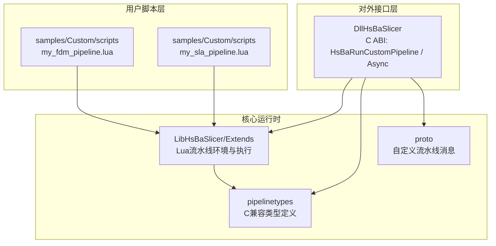
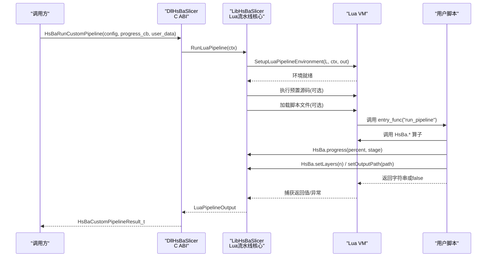
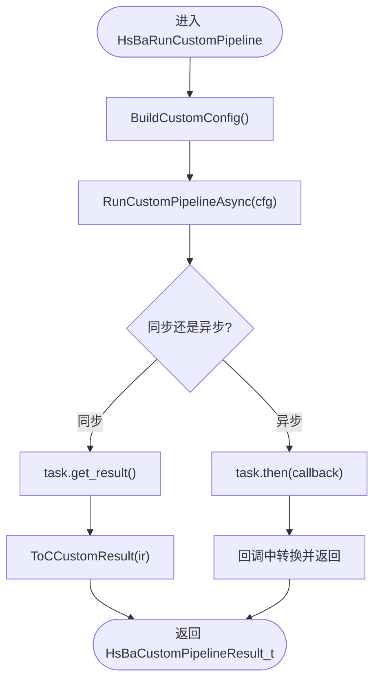
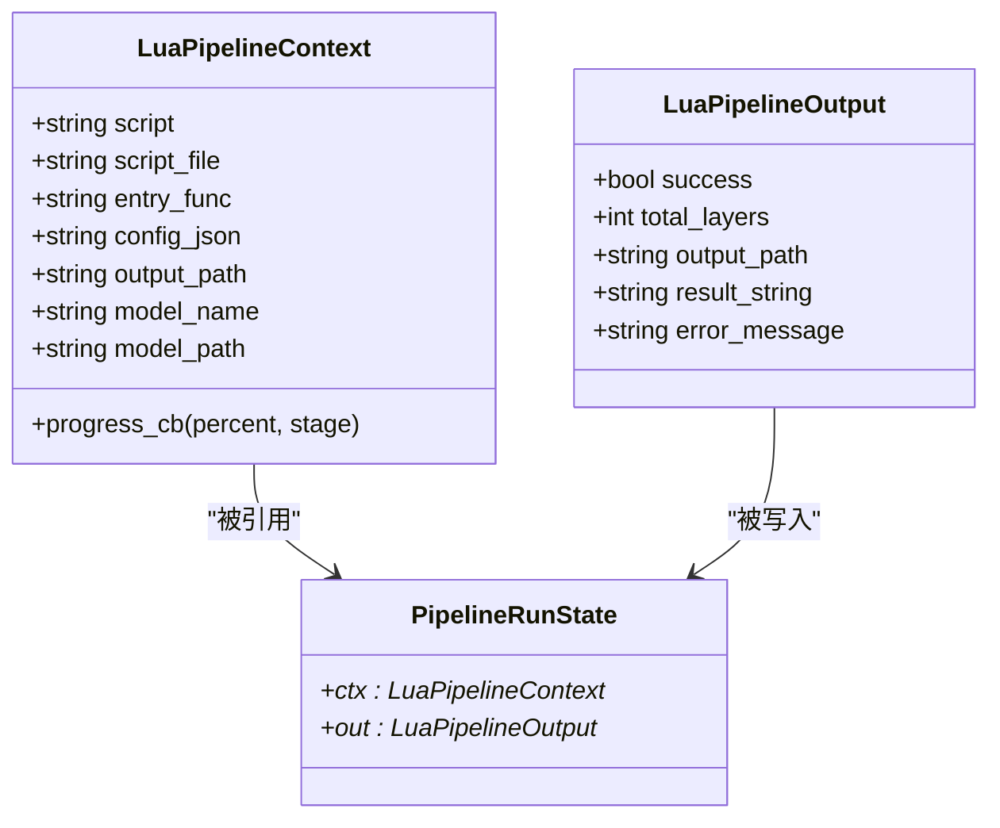
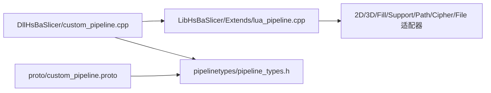

# 自定义Lua流水线系统

<cite>
**本文引用的文件**   
- [README.md](file://README.md)
- [custom_pipeline.h](file://DllHsBaSlicer/custom_pipeline.h)
- [custom_pipeline.cpp](file://DllHsBaSlicer/custom_pipeline.cpp)
- [lua_pipeline.hpp](file://LibHsBaSlicer/Extends/lua_pipeline.hpp)
- [lua_pipeline.cpp](file://LibHsBaSlicer/Extends/lua_pipeline.cpp)
- [pipeline_types.h](file://pipelinetypes/pipeline_types.h)
- [custom_pipeline.proto](file://proto/custom_pipeline.proto)
- [my_fdm_pipeline.lua](file://samples/Custom/scripts/my_fdm_pipeline.lua)
- [my_sla_pipeline.lua](file://samples/Custom/scripts/my_sla_pipeline.lua)
- [main.cpp](file://samples/Custom/main.cpp)
</cite>

## 目录
1. [简介](#简介)
2. [项目结构](#项目结构)
3. [核心组件](#核心组件)
4. [架构总览](#架构总览)
5. [详细组件分析](#详细组件分析)
6. [依赖关系分析](#依赖关系分析)
7. [性能与并发特性](#性能与并发特性)
8. [故障排查指南](#故障排查指南)
9. [结论](#结论)
10. [附录：API与数据模型速查](#附录api与数据模型速查)

## 简介
本仓库提供面向3D打印切片的高性能C++框架，并内置“完全由Lua驱动的自定义流水线”能力。与FDM/SLA/SLS等固定阶段顺序的流水线不同，自定义Lua流水线将工作流编排、参数选择、阶段顺序和输出格式全部交由Lua脚本决定；C++侧仅负责创建Lua环境、暴露算子表（模型加载、切片、支撑、填充、路径生成、打包等），并管理生命周期、进度回调与异步执行。

该能力通过三层接口暴露：
- C ABI接口：供外部语言或进程调用，定义在共享库导出头中。
- C++封装接口：用于静态库或模块内使用。
- Lua API：全局`HsBa`表，向脚本暴露所有流水线构建块。

## 项目结构
围绕自定义Lua流水线的关键目录与文件如下：
- DllHsBaSlicer：对外导出的C ABI接口，包含自定义流水线的同步/异步入口与结果释放函数。
- LibHsBaSlicer/Extends：Lua流水线运行时与环境搭建，包括上下文、输出结构体、环境初始化、全局`HsBa`表注册。
- pipelinetypes：跨模块共享的C兼容类型定义，包含自定义流水线的配置与结果结构体。
- proto：自定义流水线的Protobuf消息定义，便于跨语言序列化。
- samples/Custom：示例脚本与主程序，演示FDM与SLA两种典型Lua流水线。

图表来源
- [custom_pipeline.h:1-66](file://DllHsBaSlicer/custom_pipeline.h#L1-L66)
- [lua_pipeline.hpp:1-84](file://LibHsBaSlicer/Extends/lua_pipeline.hpp#L1-L84)
- [pipeline_types.h:358-415](file://pipelinetypes/pipeline_types.h#L358-L415)
- [custom_pipeline.proto:1-31](file://proto/custom_pipeline.proto#L1-L31)

章节来源
- [README.md:25-39](file://README.md#L25-L39)

## 核心组件
- C ABI自定义流水线接口
  - 默认配置构造：`HsBaCreateDefaultCustomConfig`
  - 同步执行：`HsBaRunCustomPipeline`
  - 异步执行：`HsBaRunCustomPipelineAsync`
  - 结果释放：`HsBaFreeCustomPipelineResult`
- Lua流水线运行时
  - 上下文：`LuaPipelineContext`（脚本源、脚本文件、入口函数名、JSON配置、模型信息、进度回调）
  - 输出：`LuaPipelineOutput`（成功标志、层数、输出路径、返回字符串、错误信息）
  - 环境搭建：`SetupLuaPipelineEnvironment`
  - 执行入口：`RunLuaPipeline`
- C兼容类型
  - `HsBaCustomPipelineConfig_t`：脚本路径/源码、入口函数、JSON配置、模型名/路径、默认输出路径
  - `HsBaCustomPipelineResult_t`：成功标志、层数、输出路径、返回字符串、错误信息、耗时
  - 回调类型：进度回调与结果回调
- Protobuf消息
  - `custom_pipe_config`：与C结构字段一一对应
  - `custom_pipe_result`：与C结果结构字段一一对应

章节来源
- [custom_pipeline.h:13-59](file://DllHsBaSlicer/custom_pipeline.h#L13-L59)
- [lua_pipeline.hpp:15-79](file://LibHsBaSlicer/Extends/lua_pipeline.hpp#L15-L79)
- [pipeline_types.h:358-415](file://pipelinetypes/pipeline_types.h#L358-L415)
- [custom_pipeline.proto:5-30](file://proto/custom_pipeline.proto#L5-L30)

## 架构总览
自定义Lua流水线从C ABI进入，内部转换为C++内部配置，再驱动Lua环境执行脚本。脚本通过全局`HsBa`表调用切片、填充、支撑、路径生成、打包等算子，并通过`HsBa.progress`上报进度，通过`HsBa.setLayers`/`HsBa.setOutputPath`回传元数据。

图表来源
- [custom_pipeline.cpp:112-154](file://DllHsBaSlicer/custom_pipeline.cpp#L112-L154)
- [lua_pipeline.cpp:728-815](file://LibHsBaSlicer/Extends/lua_pipeline.cpp#L728-L815)

## 详细组件分析

### C ABI层：自定义流水线入口
- 职责
  - 将C结构体配置转换为内部C++配置
  - 基于协程实现同步阻塞与异步非阻塞两种模式
  - 将内部结果转换为C兼容结构体，并分配UTF-8字符串内存
- 关键点
  - 同步调用通过协程任务直接获取结果
  - 异步调用通过then回调传递结果
  - 结果中的字符串由内部OwnedCString管理，需调用释放函数

图表来源
- [custom_pipeline.cpp:81-154](file://DllHsBaSlicer/custom_pipeline.cpp#L81-L154)
- [custom_pipeline.cpp:165-199](file://DllHsBaSlicer/custom_pipeline.cpp#L165-L199)

章节来源
- [custom_pipeline.h:13-59](file://DllHsBaSlicer/custom_pipeline.h#L13-L59)
- [custom_pipeline.cpp:17-154](file://DllHsBaSlicer/custom_pipeline.cpp#L17-L154)
- [custom_pipeline.cpp:160-199](file://DllHsBaSlicer/custom_pipeline.cpp#L160-L199)

### Lua流水线运行时：环境与执行
- 职责
  - 创建Lua状态，打开标准库
  - 注册通用AnyObject类型与2D/3D/File扩展函数
  - 安装PolygonOperations、Support、PolygonFill、PathOptimize、Zipper、Cipher、SQLite/MySQL/PostgreSQL适配器
  - 绑定运行态到Registry，注入全局`HsBa`表与上下文全局变量
  - 执行预置源码与脚本文件，调用入口函数，收集输出
- 关键数据结构
  - PipelineRunState：保存ctx/out指针，供各HsBa函数访问
  - REG_CTX/REG_LAYERS/REG_OUTPATH：Registry键位，避免每函数upvalue开销
- 关键流程
  - SetupLuaPipelineEnvironment：初始化环境并注入全局变量
  - RunLuaPipeline：创建VM、设置环境、执行脚本、调用入口函数、处理返回值与异常

图表来源
- [lua_pipeline.hpp:15-79](file://LibHsBaSlicer/Extends/lua_pipeline.hpp#L15-L79)
- [lua_pipeline.cpp:42-65](file://LibHsBaSlicer/Extends/lua_pipeline.cpp#L42-L65)

章节来源
- [lua_pipeline.hpp:15-79](file://LibHsBaSlicer/Extends/lua_pipeline.hpp#L15-L79)
- [lua_pipeline.cpp:42-128](file://LibHsBaSlicer/Extends/lua_pipeline.cpp#L42-L128)
- [lua_pipeline.cpp:658-776](file://LibHsBaSlicer/Extends/lua_pipeline.cpp#L658-L776)
- [lua_pipeline.cpp:778-815](file://LibHsBaSlicer/Extends/lua_pipeline.cpp#L778-L815)

### Lua API：全局`HsBa`表
- 模型操作
  - loadModel(name, path)
  - modelInfo(name)
  - translateModel/rotateModel/scaleModel/removeModel/modelNames
- 切片与坐标
  - layerCount(name, layerHeight, firstLayerHeight)
  - layerZ(index, layerHeight, firstLayerHeight)
  - slice(name, z) / sliceUnsafe(name, z)
  - toInt/toDouble
- 填充与支撑
  - fill(polygons, cfg)
  - fdmSupport(layers, cfg)
  - slaSupport(layers, cfg)
- SLA地板
  - floor(bottomPolygons, cfg)
- 路径与G-code
  - toGcode(layers_data, cfg)
- 打包与渲染
  - saveSlsPackage(...)
  - saveSlaPackage(...)
  - renderImage(polygons, width, height, path)
- 进度与结果回传
  - progress(percent, stage)
  - setLayers(n)
  - setOutputPath(path)
  - readFile/writeFile

章节来源
- [lua_pipeline.cpp:205-686](file://LibHsBaSlicer/Extends/lua_pipeline.cpp#L205-L686)

### 示例脚本：FDM与SLA
- FDM脚本（my_fdm_pipeline.lua）
  - 加载模型、计算层数、逐层切片+填充、可选支撑、组装路径数据、生成G-code、写文件、清理模型
  - 通过machine表覆盖参数，体现Lua对工艺策略的完全控制
- SLA脚本（my_sla_pipeline.lua）
  - 加载模型、逐层切片、生成SLA支撑、生成地板/Raft、打包zip（含层图、支撑图、地板图与config.json）

章节来源
- [my_fdm_pipeline.lua:1-172](file://samples/Custom/scripts/my_fdm_pipeline.lua#L1-L172)
- [my_sla_pipeline.lua:1-105](file://samples/Custom/scripts/my_sla_pipeline.lua#L1-L105)

### 示例主程序：C API与Protobuf用法
- 展示同步/异步调用C ABI
- 展示以Protobuf字节流驱动Custom流水线（请求/响应结构与proto一致）

章节来源
- [main.cpp:178-219](file://samples/Custom/main.cpp#L178-L219)
- [main.cpp:375-392](file://samples/Custom/main.cpp#L375-L392)

## 依赖关系分析
- DllHsBaSlicer::custom_pipeline
  - 依赖LibHsBaSlicer::Extends::lua_pipeline（环境搭建与执行）
  - 依赖base/coroutine（协程任务）
  - 依赖pipelinetypes（C兼容类型）
- LibHsBaSlicer::Extends::lua_pipeline
  - 依赖2D/3D/Fill/Support/Path等模块的Lua适配器
  - 依赖cipher/fileoperator等工具库的Lua适配器
  - 依赖utils/LuaNewObject等辅助
- pipelinetypes
  - 独立于DLL，供convert等下游模块直接使用
- proto
  - 与C结构字段对齐，便于跨语言序列化

图表来源
- [custom_pipeline.cpp:1-13](file://DllHsBaSlicer/custom_pipeline.cpp#L1-L13)
- [lua_pipeline.cpp:12-31](file://LibHsBaSlicer/Extends/lua_pipeline.cpp#L12-L31)
- [pipeline_types.h:358-415](file://pipelinetypes/pipeline_types.h#L358-L415)
- [custom_pipeline.proto:5-30](file://proto/custom_pipeline.proto#L5-L30)

章节来源
- [custom_pipeline.cpp:1-13](file://DllHsBaSlicer/custom_pipeline.cpp#L1-L13)
- [lua_pipeline.cpp:12-31](file://LibHsBaSlicer/Extends/lua_pipeline.cpp#L12-L31)

## 性能与并发特性
- 协程异步执行
  - 异步接口使用C++20协程，避免阻塞调用线程，适合UI或高并发服务场景
- 进度回调
  - Lua侧通过`HsBa.progress`主动上报进度，C侧透传给调用方，便于UI刷新与监控
- 资源管理
  - 结果字符串由内部OwnedCString分配，需在调用方使用`HsBaFreeCustomPipelineResult`释放
- 脚本执行
  - 支持先执行预置源码（prelude），再加载脚本文件，便于动态覆盖参数而不修改脚本

章节来源
- [custom_pipeline.cpp:112-154](file://DllHsBaSlicer/custom_pipeline.cpp#L112-L154)
- [custom_pipeline.cpp:192-199](file://DllHsBaSlicer/custom_pipeline.cpp#L192-L199)
- [lua_pipeline.cpp:714-724](file://LibHsBaSlicer/Extends/lua_pipeline.cpp#L714-L724)

## 故障排查指南
- 常见错误
  - 未提供脚本路径或源码：会返回错误消息，提示必须提供pipeline_lua_script或pipeline_lua_source
  - 脚本文件无法打开：返回错误消息，包含脚本路径
  - 入口函数不存在：Lua报错，错误信息会被捕获并返回
  - 模型未加载或无效：切片相关函数会抛出Lua错误
- 调试建议
  - 使用`HsBa.progress`分段上报进度，定位瓶颈阶段
  - 检查`pipeline_config`与`machine`参数是否正确注入
  - 确认`setLayers`与`setOutputPath`是否被脚本正确调用
  - 对于打包失败，检查saveSlaPackage/saveSlsPackage的参数完整性

章节来源
- [custom_pipeline.cpp:120-126](file://DllHsBaSlicer/custom_pipeline.cpp#L120-L126)
- [lua_pipeline.cpp:798-809](file://LibHsBaSlicer/Extends/lua_pipeline.cpp#L798-L809)
- [lua_pipeline.cpp:400-421](file://LibHsBaSlicer/Extends/lua_pipeline.cpp#L400-L421)

## 结论
自定义Lua流水线为HsBaSlicer提供了高度灵活的切片工作流编排能力。C++侧专注于环境搭建、资源管理与异步执行，Lua侧掌控业务逻辑与工艺策略。通过统一的`HsBa`表，脚本可以组合模型加载、切片、填充、支撑、路径生成与打包等能力，形成可定制、可扩展的端到端流水线。配合C ABI与Protobuf，该系统易于集成到多语言生态与分布式服务中。

## 附录：API与数据模型速查

### C ABI函数
- HsBaCreateDefaultCustomConfig
- HsBaRunCustomPipeline
- HsBaRunCustomPipelineAsync
- HsBaFreeCustomPipelineResult

章节来源
- [custom_pipeline.h:13-59](file://DllHsBaSlicer/custom_pipeline.h#L13-L59)

### C兼容类型
- HsBaCustomPipelineConfig_t
- HsBaCustomPipelineResult_t
- HsBaCustomProgressCallback
- HsBaCustomResultCallback

章节来源
- [pipeline_types.h:358-415](file://pipelinetypes/pipeline_types.h#L358-L415)

### Protobuf消息
- custom_pipe_config
- custom_pipe_result

章节来源
- [custom_pipeline.proto:5-30](file://proto/custom_pipeline.proto#L5-L30)

### Lua API（部分）
- HsBa.loadModel / modelInfo / translateModel / rotateModel / scaleModel / removeModel / modelNames
- HsBa.layerCount / layerZ / slice / sliceUnsafe
- HsBa.toInt / toDouble
- HsBa.fill / fdmSupport / slaSupport
- HsBa.floor
- HsBa.toGcode
- HsBa.saveSlsPackage / saveSlaPackage / renderImage
- HsBa.progress / setLayers / setOutputPath / readFile / writeFile

章节来源
- [lua_pipeline.cpp:205-686](file://LibHsBaSlicer/Extends/lua_pipeline.cpp#L205-L686)