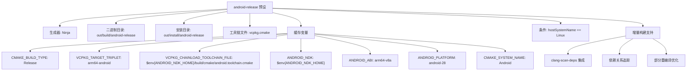
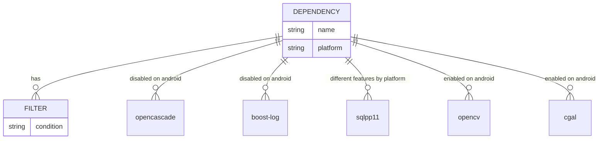
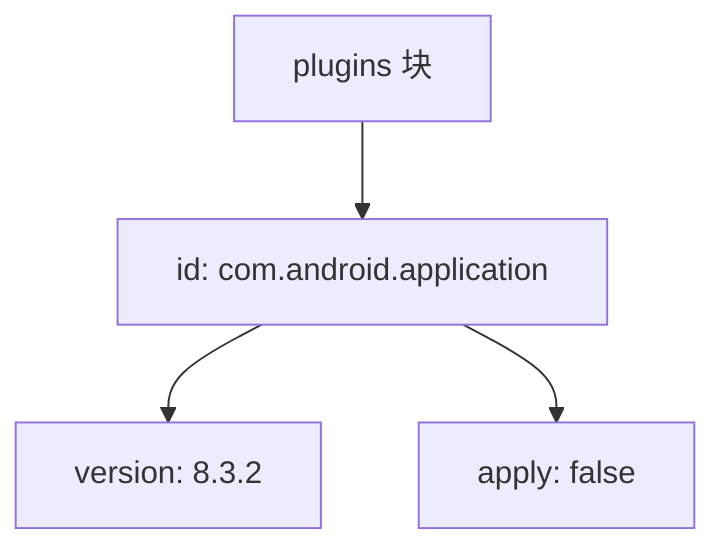
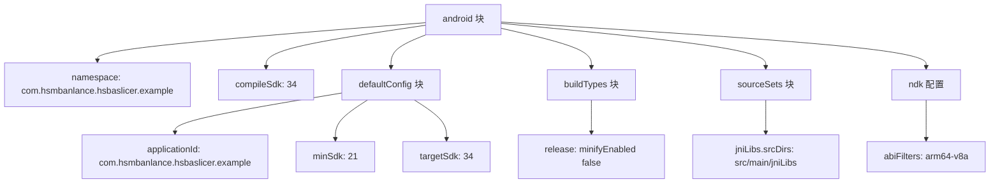
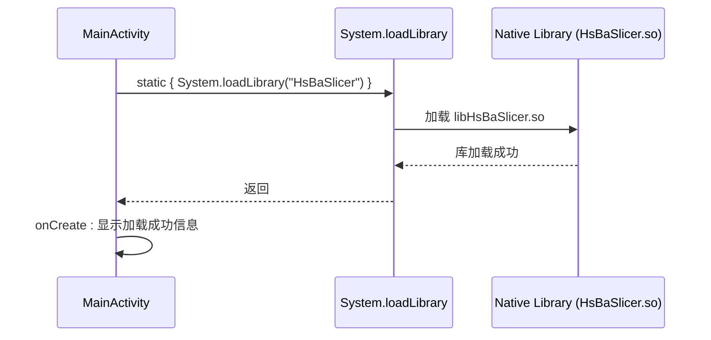
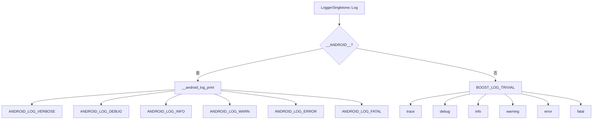
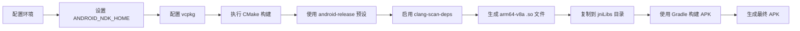

# Android 构建指南

<cite>
**本文档中引用的文件**  
- [CMakePresets.json](file://CMakePresets.json)
- [vcpkg.json](file://vcpkg.json)
- [android/build.gradle](file://android/build.gradle)
- [android/app/build.gradle](file://android/app/build.gradle)
- [android/gradle/wrapper/gradle-wrapper.properties](file://android/gradle/wrapper/gradle-wrapper.properties)
- [android/app/src/main/java/com/hsmbanlance/hsbaslicer/example/MainActivity.java](file://android/app/src/main/java/com/hsmbanlance/hsbaslicer/example/MainActivity.java)
- [logger/logger.cpp](file://logger/logger.cpp)
- [HsBaSlicer/CMakeLists.txt](file://HsBaSlicer/CMakeLists.txt)
- [.github/workflows/build-android.yml](file://.github/workflows/build-android.yml)
</cite>

## 更新摘要
**变更内容**   
- 升级 Android 构建基础设施至 Java JDK 21、Android SDK 34、Gradle 8.7 和 Android Gradle Plugin 8.3.2
- 采用新的插件 DSL 格式和属性配置语法
- 更新了 Gradle Wrapper 配置以使用最新版本的 Gradle
- 改进了 Android 应用模块的构建配置，支持最新的 API 级别

## 目录
1. [简介](#简介)
2. [构建环境配置](#构建环境配置)
3. [CMake 预设配置详解](#cmake-预设配置详解)
4. [vcpkg 依赖管理](#vcpkg-依赖管理)
5. [Gradle 构建系统](#gradle-构建系统)
6. [JNI 接口与本地库集成](#jni-接口与本地库集成)
7. [日志系统实现机制](#日志系统实现机制)
8. [GitHub Actions CI/CD 集成](#github-actions-cicd-集成)
9. [构建流程总结](#构建流程总结)

## 简介

本指南详细说明如何在 Android 平台上构建 HsBaSlicer 项目，重点介绍 `android-release` 构建预设的配置、NDK 集成、依赖过滤以及 Gradle 构建流程。项目采用 CMake 与 vcpkg 进行跨平台构建管理，并通过 Gradle 将本地库集成到 Android 应用中。**最新更新**：Android 构建基础设施已全面升级至最新版本，包括 Java JDK 21、Android SDK 34、Gradle 8.7 和 Android Gradle Plugin 8.3.2，显著提升了构建性能和兼容性。

**章节来源**
- [README.md:180-195](file://README.md#L180-L195)
- [android/README.md:1-22](file://android/README.md#L1-L22)

## 构建环境配置

构建 Android 版本需要以下环境组件：
- **Java JDK 21**：推荐使用 OpenJDK 21 以获得最佳兼容性和性能
- **Android NDK r27d**：通过 `ANDROID_NDK_HOME` 环境变量指定路径，支持 C++20 和 clang-scan-deps
- **Android SDK 34**：至少需要支持 API 级别 34，提供最新的 Android 功能和工具
- **Gradle 8.7**：用于 APK 打包，与 Android Gradle Plugin 8.3.2 完美配合
- **Android Gradle Plugin 8.3.2**：最新的 AGP 版本，支持新的 DSL 语法和构建优化
- **vcpkg**：用于管理第三方依赖库，建议使用最新版本
- **CMake**：版本需支持跨平台构建和依赖扫描功能

`ANDROID_NDK_HOME` 必须正确设置，以便 CMake 能够找到 `android.toolchain.cmake` 工具链文件和 `clang-scan-deps` 依赖扫描器，实现 Android 平台的交叉编译和增量构建优化。

**更新** 现在推荐使用 `ANDROID_NDK` 环境变量，GitHub Actions 会自动设置此变量指向正确的 NDK 路径，并自动配置 clang-scan-deps 依赖扫描器。

**章节来源**
- [CMakePresets.json:83-108](file://CMakePresets.json#L83-L108)
- [.github/workflows/build-android.yml:16](file://.github/workflows/build-android.yml#L16)
- [.github/workflows/build-android.yml:37](file://.github/workflows/build-android.yml#L37)

## CMake 预设配置详解

### android-release 预设配置

`CMakePresets.json` 文件中定义了 `android-release` 构建预设，专用于 Android 平台的发布版本构建。该预设仅适用于 Linux 主机系统，并支持增量构建优化。



**图表来源**
- [CMakePresets.json:83-108](file://CMakePresets.json#L83-L108)

**章节来源**
- [CMakePresets.json:83-108](file://CMakePresets.json#L83-L108)

### 关键配置项说明

| 配置项 | 值 | 说明 |
|--------|-----|------|
| "VCPKG_TARGET_TRIPLET" | "arm64-android" | 指定 vcpkg 目标三元组，用于获取 Android 平台的预编译库 |
| "VCPKG_CHAINLOAD_TOOLCHAIN_FILE" | "$env{ANDROID_NDK_HOME}/build/cmake/android.toolchain.cmake" | 链式加载 Android NDK 的工具链文件，实现交叉编译 |
| "ANDROID_ABI" | "arm64-v8a" | 指定目标 ABI 为 64 位 ARM 架构 |
| "ANDROID_PLATFORM" | "android-28" | 指定目标 API 级别为 Android 9.0 (Pie) |
| "CMAKE_SYSTEM_NAME" | "Android" | 告知 CMake 当前构建目标为 Android 系统 |
| "condition" | "hostSystemName == Linux" | 限定仅在 Linux 主机上可用 |

**更新** 新增了平台条件限制，确保 Android 构建仅在 Linux 主机上进行，避免在其他平台上误用。同时为 CI/CD 环境提供了优化的增量构建支持。

**章节来源**
- [CMakePresets.json:90-108](file://CMakePresets.json#L90-L108)

## vcpkg 依赖管理

### 依赖项平台过滤

`vcpkg.json` 文件使用 `platform` 条件对依赖项进行平台级过滤，确保 Android 平台仅包含兼容的库。



**图表来源**
- [vcpkg.json:3-93](file://vcpkg.json#L3-L93)

**章节来源**
- [vcpkg.json:3-93](file://vcpkg.json#L3-L93)

### Android 平台禁用的组件

以下组件在 Android 平台上被显式禁用：

| 组件 | 禁用原因 |
|------|---------|
| OpenCASCADE | 不支持 Android 平台，缺少必要的 X11 和 OpenGL 依赖 |
| boost-log | Android 平台使用 `__android_log_print` 替代 Boost.Log |
| boost-locale | Android 的本地化机制与标准 Boost.Locale 不兼容 |
| boost-nowide | Android 使用 UTF-8 编码，无需宽字符转换 |
| boost-dll | Android 平台动态库加载机制不同 |
| fontconfig | Android 有自己的字体管理系统 |
| bit7z | 移动应用通常不需要 7z 压缩功能 |
| sqlpp11 (mysql,postgresql) | 仅启用 sqlite3 特性，避免引入大型数据库客户端 |
| vcpkg-pkgconfig-get-modules | Android 构建系统不需要 pkg-config |

**更新** 详细说明了各个组件被禁用的具体原因，帮助开发者理解平台差异。

**章节来源**
- [vcpkg.json:3-93](file://vcpkg.json#L3-L93)

## Gradle 构建系统

### 项目级构建配置

`android/build.gradle` 文件采用了新的插件 DSL 格式，定义了项目级的构建脚本。



**图表来源**
- [android/build.gradle:1-4](file://android/build.gradle#L1-L4)

**章节来源**
- [android/build.gradle:1-4](file://android/build.gradle#L1-L4)

### 模块级构建配置

`android/app/build.gradle` 文件配置了应用模块的详细构建参数，使用了新的 DSL 语法。



**图表来源**
- [android/app/build.gradle:5-33](file://android/app/build.gradle#L5-L33)

**章节来源**
- [android/app/build.gradle:5-33](file://android/app/build.gradle#L5-L33)

### Gradle Wrapper 配置

`android/gradle/wrapper/gradle-wrapper.properties` 文件指定了 Gradle 版本为 8.7，确保构建的一致性和可重现性。

**更新** Gradle Wrapper 已更新至 8.7 版本，提供更好的构建性能和内存管理。

**章节来源**
- [android/gradle/wrapper/gradle-wrapper.properties:1-8](file://android/gradle/wrapper/gradle-wrapper.properties#L1-L8)

## JNI 接口与本地库集成

### 本地库加载

`MainActivity.java` 通过静态代码块加载名为 `HsBaSlicer` 的本地共享库，该库由 CMake 构建生成。



**图表来源**
- [android/app/src/main/java/com/hsmbanlance/hsbaslicer/example/MainActivity.java:17-20](file://android/app/src/main/java/com/hsmbanlance/hsbaslicer/example/MainActivity.java#L17-L20)

**章节来源**
- [android/app/src/main/java/com/hsmbanlance/hsbaslicer/example/MainActivity.java:17-20](file://android/app/src/main/java/com/hsmbanlance/hsbaslicer/example/MainActivity.java#L17-L20)

### 库文件集成路径

CMake 构建系统将生成的 `.so` 文件输出到 `android_libs/arm64-v8a/` 目录，该路径与 Gradle 的 `jniLibs.srcDirs` 配置匹配，确保库文件能被正确打包进 APK。

**更新** 增强了库文件复制逻辑，自动复制相关的依赖库文件到目标目录。

**章节来源**
- [HsBaSlicer/CMakeLists.txt:16-39](file://HsBaSlicer/CMakeLists.txt#L16-L39)
- [android/app/build.gradle:24-28](file://android/app/build.gradle#L24-L28)

## 日志系统实现机制

### 条件编译切换

日志系统通过 `__ANDROID__` 预处理器宏在不同平台间切换实现。



**图表来源**
- [logger/logger.cpp:238-339](file://logger/logger.cpp#L238-L339)

**章节来源**
- [logger/logger.cpp:238-339](file://logger/logger.cpp#L238-L339)

### 实现逻辑

1. **Android 平台**：包含 `<android/log.h>`，使用 `__android_log_print` 函数将日志输出到 Android 系统日志。
2. **非 Android 平台**：包含 Boost.Log 头文件，使用 `BOOST_LOG_TRIVIAL` 宏进行日志记录。
3. **日志级别映射**：在 `GetAndroidLogPriority` 函数中将内部日志级别映射到 Android 的日志优先级。

**更新** 完善了日志系统的实现细节，包括 iOS 平台的日志支持和更详细的错误处理。

**章节来源**
- [logger/logger.cpp:238-339](file://logger/logger.cpp#L238-L339)

## GitHub Actions CI/CD 集成

### 增强的 Android 构建工作流

GitHub Actions 工作流提供了完整的 Android 构建自动化流程，包括依赖安装、CMake 配置、原生库构建和 APK 打包。**重大更新**：集成了 clang-scan-deps 编译器依赖扫描器，显著提升构建性能。

```mermaid
flowchart LR
A[Checkout Code] --> B[Install Java & Dependencies]
B --> C[Install Android SDK & NDK]
C --> D[Bootstrap vcpkg]
D --> E[Configure CMake for Android]
E --> F[Enable clang-scan-deps]
F --> G[Build Native Libraries]
G --> H[Copy .so to jniLibs]
H --> I[Generate Gradle Wrapper]
I --> J[Build APK with Gradle]
J --> K[Upload Artifact]
```



**图表来源**
- [.github/workflows/build-android.yml:12-143](file://.github/workflows/build-android.yml#L12-L143)

### 关键改进特性

| 特性 | 描述 |
|------|------|
| **Java JDK 21 支持** | 使用最新的 OpenJDK 21 获得更好的性能和安全性 |
| **Android SDK 34** | 支持最新的 Android API 级别和功能 |
| **Gradle 8.7** | 使用最新的 Gradle 版本提升构建性能 |
| **Android Gradle Plugin 8.3.2** | 采用最新的 AGP 版本，支持新的 DSL 语法 |
| **依赖安装顺序优化** | 按依赖关系顺序安装 Java、Android SDK、NDK 和 vcpkg |
| **CMake 错误检查** | 在配置前验证 CMakeLists.txt 文件存在性 |
| **路径参数处理** | 改进 VCPKG 工具链文件和 Android NDK 路径参数处理 |
| **缓存机制** | 使用 actions/cache 缓存 vcpkg 下载和构建产物 |
| **APK 上传** | 自动上传构建的 APK 作为构建产物 |
| **clang-scan-deps 集成** | 启用编译器依赖扫描器，提升增量构建性能 |

**更新** 大幅增强了 CI/CD 工作流的健壮性和可维护性，添加了完善的错误检查和缓存机制，并集成了先进的编译器依赖扫描功能。

**章节来源**
- [.github/workflows/build-android.yml:12-143](file://.github/workflows/build-android.yml#L12-L143)

## 构建流程总结

完整的 Android 构建流程如下：



**图表来源**
- [CMakePresets.json:83-108](file://CMakePresets.json#L83-L108)
- [HsBaSlicer/CMakeLists.txt:16-39](file://HsBaSlicer/CMakeLists.txt#L16-L39)
- [android/app/build.gradle:24-28](file://android/app/build.gradle#L24-L28)

### 手动构建步骤

1. **设置环境变量**：
   ```bash
   export ANDROID_NDK_HOME=/path/to/android-ndk-r27d
   export VCPKG_ROOT=/path/to/vcpkg
   ```

2. **使用 CMake 预设构建**：
   ```bash
   cmake . --preset android-release
   cd out/build/android-release
   cmake ..
   cmake --build . --config Release
   ```

3. **复制库文件到 Android 项目**：
   ```bash
   cp build-android/android_libs/arm64-v8a/*.so android/app/src/main/jniLibs/arm64-v8a/
   ```

4. **使用 Gradle 构建 APK**：
   ```bash
   cd android
   ./gradlew assembleDebug
   ```

**更新** 完善了构建步骤说明，包含了完整的环境变量设置、clang-scan-deps 配置和错误处理建议。

**章节来源**
- [android/README.md:7-17](file://android/README.md#L7-L17)
- [HsBaSlicer/CMakeLists.txt:11-39](file://HsBaSlicer/CMakeLists.txt#L11-L39)
- [.github/workflows/build-android.yml:79-137](file://.github/workflows/build-android.yml#L79-L137)