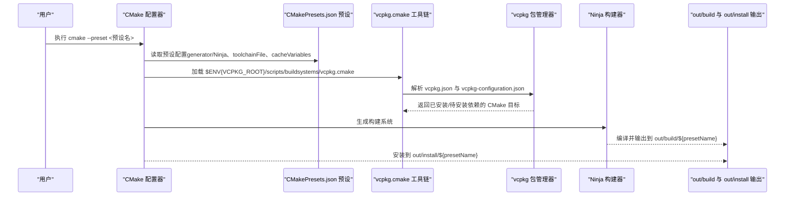
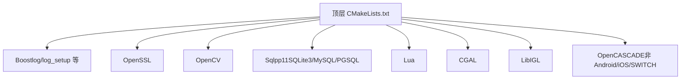

# Linux 与 macOS 构建指南

<cite>
**本文引用的文件**
- [CMakePresets.json](file://CMakePresets.json)
- [vcpkg-configuration.json](file://vcpkg-configuration.json)
- [vcpkg.json](file://vcpkg.json)
- [CMakeLists.txt](file://CMakeLists.txt)
- [README.md](file://README.md)
- [base/CMakeLists.txt](file://base/CMakeLists.txt)
- [LibHsBaSlicer/CMakeLists.txt](file://LibHsBaSlicer/CMakeLists.txt)
- [DllHsBaSlicer/CMakeLists.txt](file://DllHsBaSlicer/CMakeLists.txt)
- [HsBaSlicer/CMakeLists.txt](file://HsBaSlicer/CMakeLists.txt)
</cite>

## 目录
1. [简介](#简介)
2. [项目结构](#项目结构)
3. [核心组件](#核心组件)
4. [架构总览](#架构总览)
5. [详细组件分析](#详细组件分析)
6. [依赖关系分析](#依赖关系分析)
7. [性能考虑](#性能考虑)
8. [故障排查指南](#故障排查指南)
9. [结论](#结论)
10. [附录](#附录)

## 简介
本指南面向 Linux 与 macOS 用户，围绕 CMakePresets.json 中的 linux-debug、linux-release、macos-debug、macos-release 四个预设，系统讲解跨平台构建的条件判断机制（基于 hostSystemName）、Ninja 构建系统与 vcpkg 工具链的统一集成方式、依赖安装与环境变量配置（尤其是 VCPKG_ROOT）、CMAKE_BUILD_TYPE 的作用与 cmake --preset 启动流程、macOS 权限与路径注意事项，以及 Linux 下 OpenSSL 与 Sqlpp11 的依赖处理。同时说明编译产物的输出位置（out/build 目录结构）。

## 项目结构
该仓库采用多模块 CMake 组织方式，顶层 CMakeLists.txt 负责全局配置与子模块聚合；各功能域以独立子目录组织，例如 base、utils、fileoperator、meshmodel、cadmodel、convert、2D、paths、logger、cipher、LibHsBaSlicer、DllHsBaSlicer、HsBaSlicer 等。顶层还提供 CMakePresets.json 预设与 vcpkg.json/vcpkg-configuration.json 用于跨平台工具链与依赖管理。

```mermaid
graph TB
Root["顶层 CMakeLists.txt<br/>全局配置与子模块聚合"]
Base["base/CMakeLists.txt<br/>基础库 HsBaSlicerBase"]
Utils["utils/CMakeLists.txt<br/>工具与日志等"]
FileOp["fileoperator/CMakeLists.txt<br/>文件与数据库操作"]
Mesh["meshmodel/CMakeLists.txt<br/>CGAL/IGL 模型"]
Cad["cadmodel/CMakeLists.txt<br/>OpenCASCADE 模型"]
Convert["convert/CMakeLists.txt<br/>类型转换与协议"]
TwoD["2D/CMakeLists.txt<br/>2D 多边形与填充"]
Paths["paths/CMakeLists.txt<br/>路径与输出路径"]
Logger["logger/CMakeLists.txt<br/>日志"]
Cipher["cipher/CMakeLists.txt<br/>加密与编码"]
Lib["LibHsBaSlicer/CMakeLists.txt<br/>静态库 LibHsBaSlicer"]
Dll["DllHsBaSlicer/CMakeLists.txt<br/>动态库 DllHsBaSlicer"]
Exe["HsBaSlicer/CMakeLists.txt<br/>可执行程序 HsBaSlicer"]
Root --> Base
Root --> Utils
Root --> FileOp
Root --> Mesh
Root --> Cad
Root --> Convert
Root --> TwoD
Root --> Paths
Root --> Logger
Root --> Cipher
Root --> Lib
Root --> Dll
Root --> Exe
```

图表来源
- [CMakeLists.txt](file://CMakeLists.txt#L120-L157)
- [base/CMakeLists.txt](file://base/CMakeLists.txt#L1-L36)
- [LibHsBaSlicer/CMakeLists.txt](file://LibHsBaSlicer/CMakeLists.txt#L1-L15)
- [DllHsBaSlicer/CMakeLists.txt](file://DllHsBaSlicer/CMakeLists.txt#L1-L8)
- [HsBaSlicer/CMakeLists.txt](file://HsBaSlicer/CMakeLists.txt#L1-L77)

章节来源
- [CMakeLists.txt](file://CMakeLists.txt#L120-L157)

## 核心组件
- 预设与条件判断
  - 通过 hostSystemName 判断当前主机系统，分别启用 linux-debug/linux-release 或 macos-debug/macos-release 预设。
  - 预设统一使用 Ninja 生成器与 vcpkg 工具链文件，二进制输出目录为 out/build/${presetName}，安装目录为 out/install/${presetName}。
- CMAKE_BUILD_TYPE
  - 在预设中显式设置 Debug 或 Release，影响编译宏、优化级别与链接策略。
- vcpkg 集成
  - 通过 VCPKG_ROOT 环境变量定位工具链文件，统一拉取与构建依赖。
- 依赖清单
  - vcpkg.json 声明了 cgal、opencv、lua、openssl、sqlpp11 等关键依赖，并按平台进行条件选择。
- 顶层构建脚本
  - 顶层 CMakeLists.txt 负责检测与链接 Boost、OpenSSL、OpenCV、Sqlpp11、Lua、CGAL、LibIGL 等库，并根据构建类型启用/禁用某些特性（如布尔运算）。

章节来源
- [CMakePresets.json](file://CMakePresets.json#L41-L81)
- [CMakePresets.json](file://CMakePresets.json#L110-L151)
- [vcpkg.json](file://vcpkg.json#L1-L71)
- [CMakeLists.txt](file://CMakeLists.txt#L1-L21)
- [CMakeLists.txt](file://CMakeLists.txt#L77-L119)

## 架构总览
下图展示从用户执行 cmake --preset 到最终产物输出的整体流程，涵盖预设选择、工具链加载、依赖安装与构建阶段。

图表来源
- [CMakePresets.json](file://CMakePresets.json#L41-L81)
- [CMakePresets.json](file://CMakePresets.json#L110-L151)
- [vcpkg.json](file://vcpkg.json#L1-L71)
- [vcpkg-configuration.json](file://vcpkg-configuration.json#L1-L14)

## 详细组件分析

### 预设与条件判断机制（hostSystemName）
- Linux 预设
  - linux-debug：使用 Ninja 生成器，二进制输出至 out/build/linux-debug，安装至 out/install/linux-debug，设置 CMAKE_BUILD_TYPE=Debug，条件为 hostSystemName=Linux。
  - linux-release：同上，但 CMAKE_BUILD_TYPE=Release。
- macOS 预设
  - macos-debug：使用 Ninja 生成器，二进制输出至 out/build/macos-debug，安装至 out/install/macos-debug，设置 CMAKE_BUILD_TYPE=Debug，条件为 hostSystemName=Darwin。
  - macos-release：同上，但 CMAKE_BUILD_TYPE=Release。
- 条件判断
  - 通过 preset 的 condition 字段比较 ${hostSystemName} 与期望值，仅当匹配时才会被激活。

章节来源
- [CMakePresets.json](file://CMakePresets.json#L41-L81)
- [CMakePresets.json](file://CMakePresets.json#L110-L151)

### Ninja 构建系统与 vcpkg 工具链的统一集成
- 工具链文件
  - 预设统一指定 toolchainFile=$ENV{VCPKG_ROOT}/scripts/buildsystems/vcpkg.cmake，确保所有平台使用同一套依赖解析与链接策略。
- 生成器
  - 预设统一使用 Ninja 作为生成器，提升跨平台构建速度与一致性。
- 输出目录
  - binaryDir 与 installDir 均采用 out/build/${presetName} 与 out/install/${presetName}，便于区分不同预设的构建产物。

章节来源
- [CMakePresets.json](file://CMakePresets.json#L41-L81)
- [CMakePresets.json](file://CMakePresets.json#L110-L151)

### CMAKE_BUILD_TYPE 的作用
- Debug 模式
  - 在顶层 CMakeLists.txt 中，当 CMAKE_BUILD_TYPE=Debug 时，会添加 DISABLE_BOOLEAN_OPERATIONS 宏，提示布尔运算在 Debug 模式下可能较慢且占用内存较高，从而降低编译时间与内存压力。
- Release 模式
  - Release 模式下默认启用更严格的优化与更少的调试信息，适合发布与性能测试。

章节来源
- [CMakeLists.txt](file://CMakeLists.txt#L91-L95)

### cmake --preset 启动构建流程
- Linux/macOS 使用方法
  - 通过 cmake --preset linux-debug 或 cmake --preset linux-release 启动配置与构建；或使用 cmake --preset macos-debug、cmake --preset macos-release。
- 产物位置
  - out/build/${presetName}：包含中间对象、可执行文件与库文件。
  - out/install/${presetName}：包含安装后的头文件、库文件与可执行文件（若配置了安装规则）。

章节来源
- [CMakePresets.json](file://CMakePresets.json#L41-L81)
- [CMakePresets.json](file://CMakePresets.json#L110-L151)

### Linux 环境下的依赖与安装要点
- vcpkg 安装与环境变量
  - 克隆 vcpkg 并执行 bootstrap 脚本；将 vcpkg 根目录设置到 VCPKG_ROOT 环境变量，使预设能正确加载工具链文件。
- 必备工具
  - CMake、Ninja、g++、gdb、make、rsync、zip 等。
- 依赖安装（按 README 提示）
  - Ubuntu/Debian 可通过 apt 安装 X11 开发包、libncurses-dev、libtirpc-dev、bison、flex、libfontconfig1-dev、pkg-config、automake、libtool、m4、autoconf、python3-distutils 等。
- 顶层 CMake 依赖检测
  - 顶层 CMakeLists.txt 会查找并链接 Boost、OpenSSL、OpenCV、Sqlpp11、Lua、CGAL、LibIGL 等库；Debug 模式下会禁用布尔运算相关特性以优化构建性能。

章节来源
- [README.md](file://README.md#L62-L136)
- [CMakeLists.txt](file://CMakeLists.txt#L32-L119)

### macOS 环境下的注意事项
- 权限与路径
  - 若使用 Homebrew 安装依赖，注意系统完整性保护（SIP）与签名要求；必要时调整安装路径或使用 sudo（谨慎）。
  - 避免将可执行文件放置在受保护的系统目录，优先使用用户目录或 out/build 下的本地输出。
- 依赖安装
  - 通过 vcpkg 安装 cgal、opencv、lua、openssl、sqlpp11 等依赖；确保 VCPKG_ROOT 环境变量指向 vcpkg 根目录。
- 预设使用
  - 使用 cmake --preset macos-debug 或 cmake --preset macos-release 进行构建。

章节来源
- [CMakePresets.json](file://CMakePresets.json#L110-L151)
- [vcpkg.json](file://vcpkg.json#L1-L71)

### 依赖清单与平台差异
- 关键依赖
  - cgal、opencv、lua、openssl、sqlpp11（SQLite3、MySQL、PostgreSQL 多组件，非 Android 平台默认启用多组件）。
- 平台条件
  - bit7z、boost-locale、boost-log、boost-nowide、opencascade、vcpkg-pkgconfig-get-modules 等在 Android/iOS 平台被排除。
- 顶层链接
  - 顶层 CMakeLists.txt 会根据平台与构建类型查找并链接上述库，确保模块间依赖关系正确。

章节来源
- [vcpkg.json](file://vcpkg.json#L1-L71)
- [CMakeLists.txt](file://CMakeLists.txt#L32-L119)

### 顶层构建脚本与模块化组织
- 全局配置
  - 设置 C++ 标准、Debug 后缀、UTF-8 编译选项等。
- 库查找与链接
  - 顶层 CMakeLists.txt 查找并链接 Boost、OpenSSL、OpenCV、Sqlpp11、Lua、CGAL、LibIGL 等；根据平台与构建类型决定是否启用 CAD 内核与数据库后端。
- 子模块聚合
  - 通过 add_subdirectory 聚合 base、utils、fileoperator、meshmodel、cadmodel、convert、2D、paths、logger、cipher、LibHsBaSlicer、DllHsBaSlicer、HsBaSlicer 等模块。

章节来源
- [CMakeLists.txt](file://CMakeLists.txt#L1-L21)
- [CMakeLists.txt](file://CMakeLists.txt#L120-L157)

### 可执行文件与库的输出位置
- out/build/${presetName}
  - 包含各模块编译产物（静态库、动态库、可执行文件）及中间文件。
- out/install/${presetName}
  - 包含安装阶段产出的头文件、库文件与可执行文件（若配置了安装规则）。
- HsBaSlicer 可执行程序
  - 在 HsBaSlicer/CMakeLists.txt 中定义；在非 Android 平台下为可执行文件，在 Android 平台下为共享库并输出到 android_libs/<ABI> 目录。

章节来源
- [CMakePresets.json](file://CMakePresets.json#L41-L81)
- [CMakePresets.json](file://CMakePresets.json#L110-L151)
- [HsBaSlicer/CMakeLists.txt](file://HsBaSlicer/CMakeLists.txt#L1-L77)

## 依赖关系分析
下图展示顶层 CMakeLists.txt 对关键库的依赖关系与平台/构建类型的影响。

图表来源
- [CMakeLists.txt](file://CMakeLists.txt#L32-L119)

章节来源
- [CMakeLists.txt](file://CMakeLists.txt#L32-L119)

## 性能考虑
- Debug 模式优化
  - Debug 模式下禁用布尔运算相关特性，减少编译时间与内存占用。
- Ninja 生成器
  - 相比 Unix Makefiles，Ninja 在多核环境下构建更快，尤其在大型项目中优势明显。
- 依赖缓存
  - 通过 vcpkg 的二进制缓存与预编译包，缩短首次安装与后续增量构建时间。

章节来源
- [CMakeLists.txt](file://CMakeLists.txt#L91-L95)
- [CMakePresets.json](file://CMakePresets.json#L41-L81)
- [vcpkg-configuration.json](file://vcpkg-configuration.json#L1-L14)

## 故障排查指南
- 无法找到 vcpkg 工具链
  - 症状：CMake 报错找不到 vcpkg.cmake。
  - 排查：确认 VCPKG_ROOT 环境变量已设置为 vcpkg 根目录；预设中的 toolchainFile 使用 $ENV{VCPKG_ROOT}。
- 依赖缺失或版本冲突
  - 症状：CMake 查找库失败或链接错误。
  - 排查：检查 vcpkg.json 中的依赖声明与平台条件；在 Linux 上确认系统已安装必要的 pkg-config、X11、bison/flex 等；在 macOS 上确认 Homebrew 或其他包管理器安装路径有效。
- Debug 模式编译缓慢
  - 症状：Debug 模式下编译耗时长。
  - 说明：顶层 CMakeLists.txt 在 Debug 模式下禁用布尔运算相关特性，建议在频繁迭代时使用 Debug，发布前切换到 Release。
- macOS 权限问题
  - 症状：无法写入系统目录或签名验证失败。
  - 排查：避免将可执行文件放置在受保护目录；使用 out/build 下的本地输出；必要时调整权限或使用沙盒外目录。
- Linux OpenSSL 与 Sqlpp11 依赖
  - OpenSSL：确保系统已安装 OpenSSL 开发包；顶层 CMakeLists.txt 会查找并链接。
  - Sqlpp11：非 Android 平台默认启用 SQLite3、MySQL、PostgreSQL 三个组件；若仅需 SQLite3，可在 vcpkg.json 中按需调整或在应用层只链接所需组件。

章节来源
- [CMakePresets.json](file://CMakePresets.json#L41-L81)
- [vcpkg.json](file://vcpkg.json#L1-L71)
- [CMakeLists.txt](file://CMakeLists.txt#L77-L119)
- [README.md](file://README.md#L62-L136)

## 结论
通过 CMakePresets.json 的 hostSystemName 条件判断与统一的 vcpkg 工具链集成，Linux 与 macOS 用户可以一致地使用 Ninja 生成器与预设进行构建。配合 VCPKG_ROOT 环境变量与 vcpkg.json 的依赖声明，能够快速拉取并链接 cgal、opencv、lua、openssl、sqlpp11 等关键库。Debug/Release 模式的差异化配置有助于在开发效率与发布性能之间取得平衡。遵循本文的安装与排错建议，可顺利在 Linux/macOS 上完成构建并获得清晰的产物输出结构。

## 附录
- 常用命令
  - Linux/macOS：cmake --preset linux-debug | linux-release | macos-debug | macos-release
  - 产物位置：out/build/${presetName} 与 out/install/${presetName}
- 环境变量
  - VCPKG_ROOT：指向 vcpkg 根目录，预设通过 $ENV{VCPKG_ROOT}/scripts/buildsystems/vcpkg.cmake 加载工具链
- 依赖参考
  - vcpkg.json 声明了 cgal、opencv、lua、openssl、sqlpp11 等依赖及平台条件
  - 顶层 CMakeLists.txt 负责查找与链接上述库