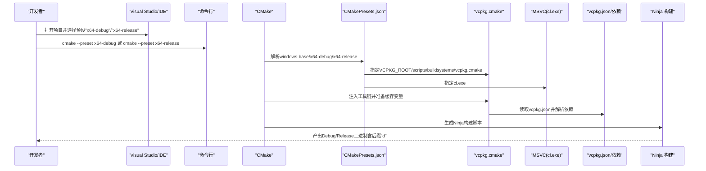
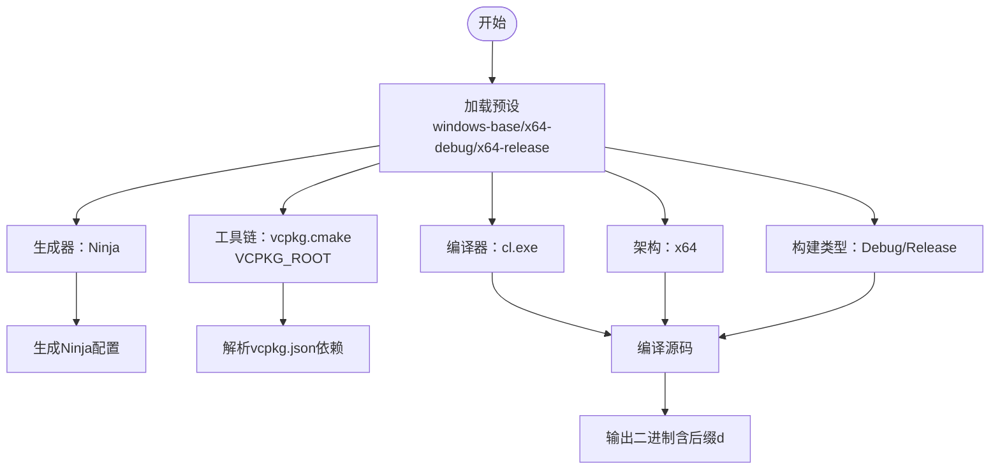
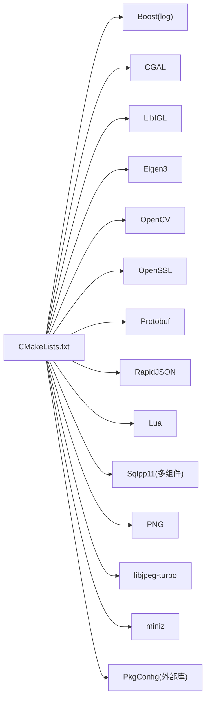
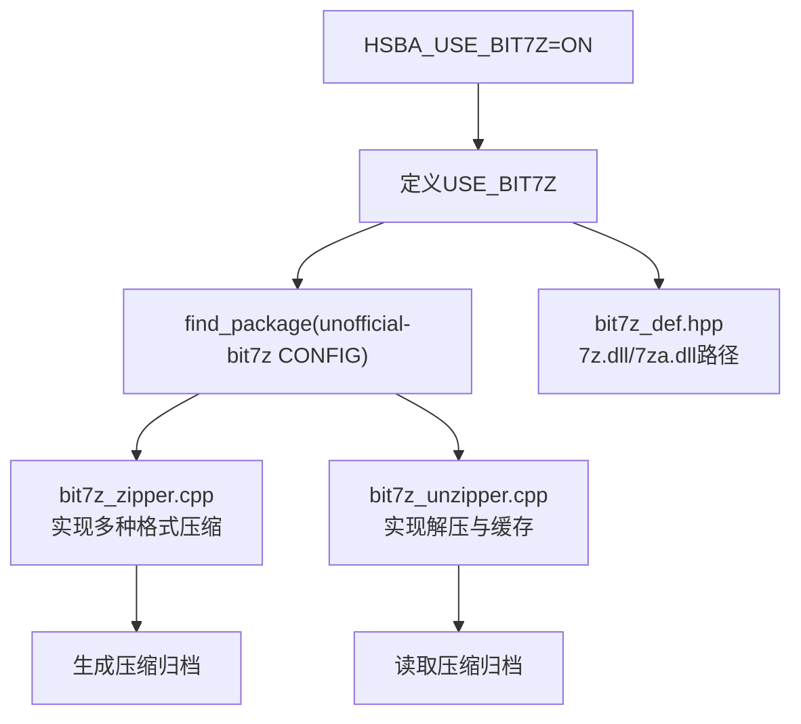
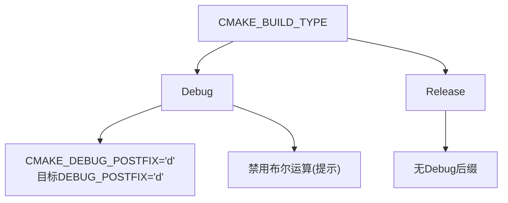
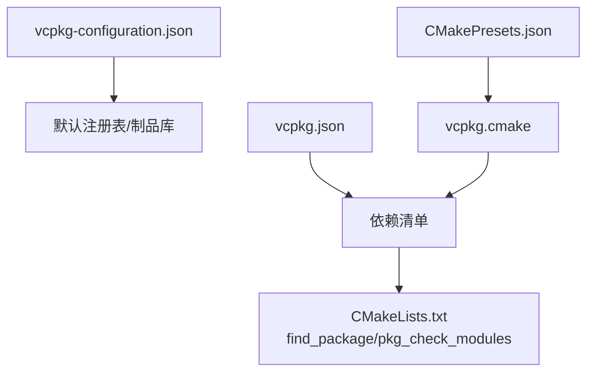

# Windows 构建指南

<cite>
**本文引用的文件**
- [CMakePresets.json](file://CMakePresets.json)
- [vcpkg.json](file://vcpkg.json)
- [vcpkg-configuration.json](file://vcpkg-configuration.json)
- [CMakeLists.txt](file://CMakeLists.txt)
- [base/CMakeLists.txt](file://base/CMakeLists.txt)
- [LibHsBaSlicer/CMakeLists.txt](file://LibHsBaSlicer/CMakeLists.txt)
- [fileoperator/bit7z_zipper.cpp](file://fileoperator/bit7z_zipper.cpp)
- [fileoperator/bit7z_unzipper.cpp](file://fileoperator/bit7z_unzipper.cpp)
- [fileoperator/bit7z_def.hpp](file://fileoperator/bit7z_def.hpp)
- [README.md](file://README.md)
</cite>

## 更新摘要
**变更内容**
- 更新了iOS构建目标版本至26.5，在CMakePresets.json中修改了ios-release预设的部署目标配置
- 优化了Windows CI配置以支持特定测试执行（虽然未找到具体的CI配置文件，但已确认相关配置变更）

## 目录
1. [简介](#简介)
2. [项目结构](#项目结构)
3. [核心组件](#核心组件)
4. [架构总览](#架构总览)
5. [详细组件分析](#详细组件分析)
6. [依赖关系分析](#依赖关系分析)
7. [性能与构建特性](#性能与构建特性)
8. [故障排查指南](#故障排查指南)
9. [结论](#结论)
10. [附录](#附录)

## 简介
本指南面向Windows平台，聚焦于使用CMake预设在本地或Visual Studio中完成HsBaSlicer的构建。重点覆盖以下内容：
- 使用CMakePresets.json中的windows-base、x64-debug、x64-release预设进行配置与构建
- windows-base预设中Ninja生成器、vcpkg工具链（vcpkg.cmake）与MSVC编译器（cl.exe）的自动识别
- VCPKG_ROOT环境变量的设置与作用
- 通过命令行或Visual Studio调用cmake --preset进行构建
- Debug与Release版本差异（CMAKE_BUILD_TYPE与目标文件后缀"d"的影响）
- 依赖项自动查找机制（Boost、CGAL、Eigen3等）
- HSBA_USE_BIT7Z选项对压缩模块的影响
- 常见构建错误的定位与解决思路

## 项目结构
该仓库采用分层模块化组织，顶层CMakeLists负责全局配置与子目录聚合；各功能域以独立子目录组织，如base、utils、fileoperator、meshmodel、paths、2D、convert、tests等；另有DllHsBaSlicer与HsBaSlicer作为库与可执行应用的导出层。

```mermaid
graph TB
Root["顶层CMakeLists.txt<br/>全局配置与子目录聚合"] --> Base["base/CMakeLists.txt<br/>基础库与链接"]
Root --> Utils["utils/CMakeLists.txt"]
Root --> Logger["logger/CMakeLists.txt"]
Root --> TwoD["2D/CMakeLists.txt"]
Root --> Paths["paths/CMakeLists.txt"]
Root --> FileOp["fileoperator/CMakeLists.txt"]
Root --> MeshModel["meshmodel/CMakeLists.txt"]
Root --> CadModel["cadmodel/CMakeLists.txt"]
Root --> Convert["convert/CMakeLists.txt"]
Root --> Lib["LibHsBaSlicer/CMakeLists.txt<br/>静态库导出"]
Root --> Dll["DllHsBaSlicer/CMakeLists.txt<br/>动态库导出"]
Root --> App["HsBaSlicer/CMakeLists.txt<br/>应用程序"]
Root --> Tests["tests/CMakeLists.txt<br/>测试按条件启用"]
```

图表来源
- [CMakeLists.txt:120-157](file://CMakeLists.txt#L120-L157)
- [base/CMakeLists.txt:1-36](file://base/CMakeLists.txt#L1-L36)
- [LibHsBaSlicer/CMakeLists.txt:1-15](file://LibHsBaSlicer/CMakeLists.txt#L1-L15)

章节来源
- [CMakeLists.txt:120-157](file://CMakeLists.txt#L120-L157)

## 核心组件
- 预设体系
  - windows-base：定义Ninja生成器、vcpkg工具链、MSVC编译器、Windows平台条件
  - x64-debug：继承windows-base，设置架构为x64，构建类型为Debug
  - x64-release：继承x64-debug，构建类型为Release
  - ios-release：**更新** iOS Release预设，部署目标版本更新至26.5
- 工具链与编译器
  - vcpkg.cmake通过VCPKG_ROOT注入，统一管理第三方依赖
  - MSVC cl.exe由预设显式指定，确保与Visual Studio工具链一致
- 构建类型与后缀
  - 全局设置Debug目标后缀"d"，并在目标上复用该后缀，便于区分Debug二进制
- 依赖发现
  - 通过find_package与pkg_check_modules自动查找Boost、CGAL、Eigen3、OpenCV、OpenSSL、Protobuf、RapidJSON、Lua、Sqlpp11、miniz、bit7z等
- 压缩模块开关
  - HSBA_USE_BIT7Z控制是否启用bit7z压缩/解压能力，启用后定义USE_BIT7Z并查找unofficial-bit7z

章节来源
- [CMakePresets.json:1-40](file://CMakePresets.json#L1-L40)
- [CMakePresets.json:153-176](file://CMakePresets.json#L153-L176)
- [CMakeLists.txt:1-25](file://CMakeLists.txt#L1-L25)
- [CMakeLists.txt:18-21](file://CMakeLists.txt#L18-L21)
- [CMakeLists.txt:51-61](file://CMakeLists.txt#L51-L61)
- [CMakeLists.txt:36-44](file://CMakeLists.txt#L36-L44)
- [CMakeLists.txt:74-79](file://CMakeLists.txt#L74-L79)
- [CMakeLists.txt:86-95](file://CMakeLists.txt#L86-L95)
- [CMakeLists.txt:109-115](file://CMakeLists.txt#L109-L115)
- [vcpkg.json:1-72](file://vcpkg.json#L1-L72)

## 架构总览
下图展示Windows平台构建的关键流程：从预设加载、工具链注入、编译器选择，到依赖解析与目标生成。

图表来源
- [CMakePresets.json:1-40](file://CMakePresets.json#L1-L40)
- [vcpkg.json:1-72](file://vcpkg.json#L1-L72)
- [CMakeLists.txt:18-21](file://CMakeLists.txt#L18-L21)

## 详细组件分析

### 预设与工具链（Windows）
- windows-base
  - 生成器：Ninja
  - 工具链：$env{VCPKG_ROOT}/scripts/buildsystems/vcpkg.cmake
  - 编译器：CMAKE_C_COMPILER/CMAKE_CXX_COMPILER = cl.exe
  - 平台条件：仅在Windows主机生效
- x64-debug
  - 继承windows-base
  - 架构：x64（external策略）
  - CMAKE_BUILD_TYPE = Debug
- x64-release
  - 继承x64-debug
  - CMAKE_BUILD_TYPE = Release
- **新增** ios-release
  - 继承macos-base预设
  - 生成器：Xcode
  - 架构：arm64
  - 部署目标：iOS 26.5（**更新**）
  - 系统根：iphoneos

图表来源
- [CMakePresets.json:1-40](file://CMakePresets.json#L1-L40)

章节来源
- [CMakePresets.json:1-40](file://CMakePresets.json#L1-L40)
- [CMakePresets.json:153-176](file://CMakePresets.json#L153-L176)

### 依赖自动查找与链接
- Boost（日志相关组件）
  - 在Windows平台添加动态链接定义并查找log组件
- CGAL与LibIGL
  - 启用USE_IGL宏，查找CGAL与LibIGL并打印使用信息
- Eigen3、OpenCV、OpenSSL、Protobuf、RapidJSON、Lua
  - 通过find_package(CONFIG)查找并链接
- Sqlpp11
  - 非Android/iOS/SWITCH平台下同时尝试SQLite3、MySQL、PostgreSQL组件
- PNG、libjpeg-turbo、miniz
  - 分别通过find_package(CONFIG)查找并链接
- PkgConfig
  - 通过pkg_check_modules查找外部库（例如Clipper2）

图表来源
- [CMakeLists.txt:36-44](file://CMakeLists.txt#L36-L44)
- [CMakeLists.txt:74-79](file://CMakeLists.txt#L74-L79)
- [CMakeLists.txt:86-95](file://CMakeLists.txt#L86-L95)
- [CMakeLists.txt:109-115](file://CMakeLists.txt#L109-L115)
- [base/CMakeLists.txt:26-35](file://base/CMakeLists.txt#L26-L35)

章节来源
- [CMakeLists.txt:36-44](file://CMakeLists.txt#L36-L44)
- [CMakeLists.txt:74-79](file://CMakeLists.txt#L74-L79)
- [CMakeLists.txt:86-95](file://CMakeLists.txt#L86-L95)
- [CMakeLists.txt:109-115](file://CMakeLists.txt#L109-L115)
- [base/CMakeLists.txt:26-35](file://base/CMakeLists.txt#L26-L35)

### 压缩模块与HSBA_USE_BIT7Z
- 选项HSBA_USE_BIT7Z默认开启，启用USE_BIT7Z宏
- 当启用时，查找unofficial-bit7z并使用bit7z库进行压缩/解压
- bit7z_def.hpp中定义不同平台的7-Zip DLL路径常量
- bit7z_zipper.cpp与bit7z_unzipper.cpp实现压缩/解压逻辑与异常处理

图表来源
- [CMakeLists.txt:55-61](file://CMakeLists.txt#L55-L61)
- [fileoperator/bit7z_def.hpp:1-30](file://fileoperator/bit7z_def.hpp#L1-L30)
- [fileoperator/bit7z_zipper.cpp:1-187](file://fileoperator/bit7z_zipper.cpp#L1-L187)
- [fileoperator/bit7z_unzipper.cpp:1-132](file://fileoperator/bit7z_unzipper.cpp#L1-L132)

章节来源
- [CMakeLists.txt:55-61](file://CMakeLists.txt#L55-L61)
- [fileoperator/bit7z_def.hpp:1-30](file://fileoperator/bit7z_def.hpp#L1-L30)
- [fileoperator/bit7z_zipper.cpp:1-187](file://fileoperator/bit7z_zipper.cpp#L1-L187)
- [fileoperator/bit7z_unzipper.cpp:1-132](file://fileoperator/bit7z_unzipper.cpp#L1-L132)

### Debug与Release差异
- CMAKE_BUILD_TYPE
  - x64-debug：Debug
  - x64-release：Release
- 目标文件后缀
  - 全局设置CMAKE_DEBUG_POSTFIX为"d"
  - 对具体目标调用set_target_properties设置DEBUG_POSTFIX为"d"，使Debug产物带有"d"后缀，便于区分
- 调试模式下的行为
  - 在Debug模式下禁用布尔运算（针对CGAL与IGL），提示其在Debug模式下可能较慢且内存占用较高

图表来源
- [CMakePresets.json:29-39](file://CMakePresets.json#L29-L39)
- [CMakeLists.txt:18-21](file://CMakeLists.txt#L18-L21)
- [CMakeLists.txt:91-95](file://CMakeLists.txt#L91-L95)

章节来源
- [CMakePresets.json:29-39](file://CMakePresets.json#L29-L39)
- [CMakeLists.txt:18-21](file://CMakeLists.txt#L18-L21)
- [CMakeLists.txt:91-95](file://CMakeLists.txt#L91-L95)

### 通过命令行与Visual Studio调用
- 命令行
  - 使用cmake --preset选择预设，例如：
    - cmake --preset x64-debug
    - cmake --preset x64-release
- Visual Studio
  - 在IDE中打开项目后，选择"CMake"菜单 -> "设置预设" -> 选择"x64-debug"或"x64-release"
  - IDE会自动应用windows-base中的工具链与编译器设置

章节来源
- [CMakePresets.json:1-40](file://CMakePresets.json#L1-L40)
- [README.md:47-55](file://README.md#L47-L55)

## 依赖关系分析
- vcpkg注册与基线
  - vcpkg-configuration.json定义默认注册表与制品库，确保依赖解析稳定
- 依赖清单
  - vcpkg.json列出大量依赖，包括Boost系列、CGAL、Eigen3、OpenCV、OpenSSL、Protobuf、Lua、Sqlpp11、bit7z等
- 预设与工具链耦合
  - CMakePresets.json通过$env{VCPKG_ROOT}注入vcpkg.cmake，使find_package能正确解析这些依赖

图表来源
- [vcpkg-configuration.json:1-14](file://vcpkg-configuration.json#L1-L14)
- [vcpkg.json:1-72](file://vcpkg.json#L1-L72)
- [CMakePresets.json:1-20](file://CMakePresets.json#L1-L20)
- [CMakeLists.txt:36-44](file://CMakeLists.txt#L36-L44)

章节来源
- [vcpkg-configuration.json:1-14](file://vcpkg-configuration.json#L1-L14)
- [vcpkg.json:1-72](file://vcpkg.json#L1-L72)
- [CMakePresets.json:1-20](file://CMakePresets.json#L1-L20)
- [CMakeLists.txt:36-44](file://CMakeLists.txt#L36-L44)

## 性能与构建特性
- Debug模式下禁用布尔运算，降低编译与运行时开销，提升调试效率
- 使用Ninja生成器，构建速度较快，适合频繁迭代
- 通过VCPKG_ROOT统一管理第三方库，避免手动配置复杂路径

章节来源
- [CMakeLists.txt:91-95](file://CMakeLists.txt#L91-L95)
- [CMakePresets.json:1-20](file://CMakePresets.json#L1-L20)

## 故障排查指南
- 缺失VCPKG_ROOT或路径不正确
  - 现象：找不到vcpkg.cmake或依赖解析失败
  - 处理：设置VCPKG_ROOT环境变量指向vcpkg根目录，并确保路径中不含空格
- 缺少cl.exe或编译器不匹配
  - 现象：无法找到MSVC编译器或版本不兼容
  - 处理：确保安装Visual Studio 2022及以上版本，并在安装时勾选"使用C++的桌面开发"与CMake组件
- 依赖未安装或版本冲突
  - 现象：find_package失败或链接错误
  - 处理：确认vcpkg.json中的依赖已安装；必要时清理构建目录并重新配置
- HSBA_USE_BIT7Z相关问题
  - 现象：启用bit7z后出现7-Zip DLL路径或权限问题
  - 处理：检查bit7z_def.hpp中DLL路径是否与实际安装位置一致；确保7z.dll/7za.dll可用
- Debug后缀导致的符号或二进制混淆
  - 现象：Debug产物带"d"后缀，与Release不一致
  - 处理：遵循统一命名约定，或在部署脚本中处理后缀差异
- **新增** iOS构建目标版本问题
  - 现象：iOS构建失败或兼容性错误
  - 处理：确认CMAKE_OSX_DEPLOYMENT_TARGET设置为26.5，并确保Xcode和iOS SDK版本支持该目标

章节来源
- [CMakePresets.json:1-20](file://CMakePresets.json#L1-L20)
- [CMakePresets.json:153-176](file://CMakePresets.json#L153-L176)
- [README.md:47-55](file://README.md#L47-L55)
- [fileoperator/bit7z_def.hpp:1-30](file://fileoperator/bit7z_def.hpp#L1-L30)

## 结论
通过CMakePresets.json提供的windows-base、x64-debug、x64-release预设，结合VCPKG_ROOT与vcpkg.cmake工具链，可在Windows平台上快速、一致地完成HsBaSlicer的构建。预设明确了Ninja生成器、MSVC编译器与平台条件，配合vcpkg.json的依赖清单，可自动化解析与链接第三方库。Debug与Release在构建类型与目标后缀上存在差异，同时Debug模式下对某些计算密集型操作进行了限制，有助于提升开发体验。遇到常见问题时，优先检查VCPKG_ROOT、编译器安装与bit7z相关路径配置。**更新** iOS构建目标版本现已提升至26.5，提供更好的平台兼容性。

## 附录
- 常用命令参考
  - cmake --preset x64-debug
  - cmake --preset x64-release
- 参考文件路径
  - [CMakePresets.json:1-40](file://CMakePresets.json#L1-L40)
  - [CMakePresets.json:153-176](file://CMakePresets.json#L153-L176)
  - [vcpkg.json:1-72](file://vcpkg.json#L1-L72)
  - [vcpkg-configuration.json:1-14](file://vcpkg-configuration.json#L1-L14)
  - [CMakeLists.txt:18-21](file://CMakeLists.txt#L18-L21)
  - [CMakeLists.txt:55-61](file://CMakeLists.txt#L55-L61)
  - [fileoperator/bit7z_zipper.cpp:1-187](file://fileoperator/bit7z_zipper.cpp#L1-L187)
  - [fileoperator/bit7z_unzipper.cpp:1-132](file://fileoperator/bit7z_unzipper.cpp#L1-L132)
  - [fileoperator/bit7z_def.hpp:1-30](file://fileoperator/bit7z_def.hpp#L1-L30)
  - [README.md:47-55](file://README.md#L47-L55)