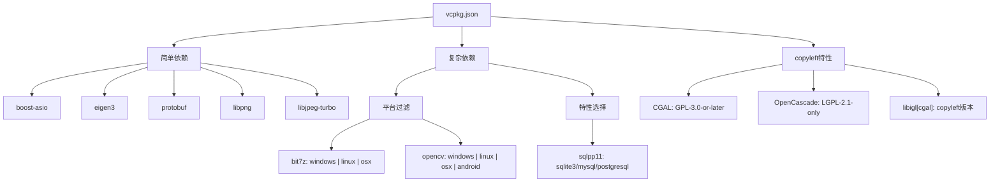
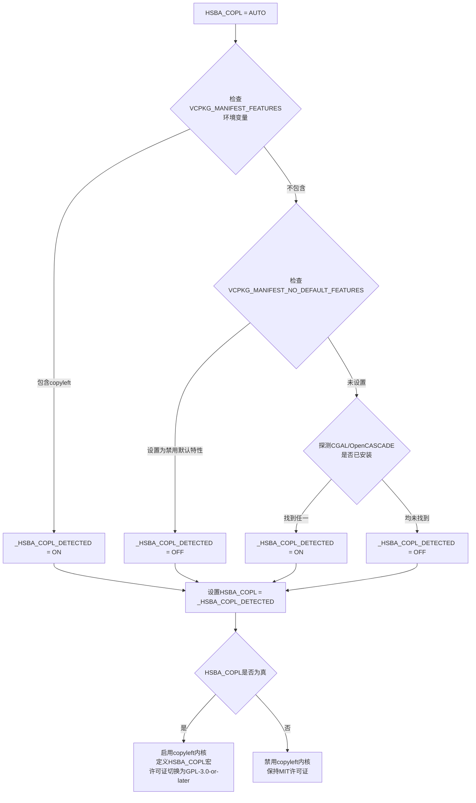
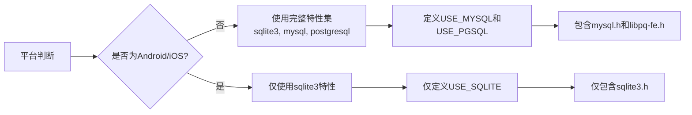
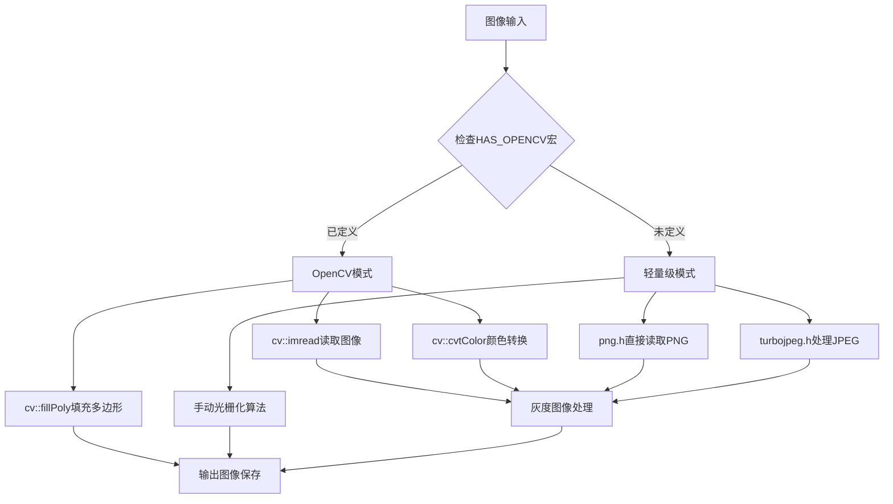
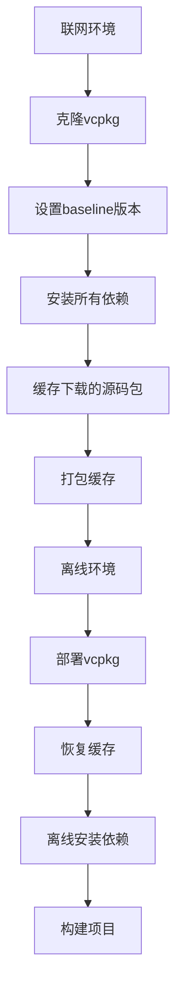

# 依赖管理与 vcpkg 集成

<cite>
**本文档中引用的文件**  
- [vcpkg.json](file://vcpkg.json)
- [CMakeLists.txt](file://CMakeLists.txt)
- [CMakePresets.json](file://CMakePresets.json)
- [meshmodel/CgalModel.cpp](file://meshmodel/CgalModel.cpp)
- [cadmodel/OcctModel.cpp](file://cadmodel/OcctModel.cpp)
- [preprocess/ModelLoader.cpp](file://preprocess/ModelLoader.cpp)
- [version/version.cpp.in](file://version/version.cpp.in)
- [docs/zh/vcpkg-dependencies.md](file://docs/zh/vcpkg-dependencies.md)
</cite>

## 更新摘要
**所做更改**   
- 更新了copyleft特性依赖管理机制，详细说明CGAL和OpenCascade作为可选特性的实现
- 新增HSBA_COPL三态配置系统的完整说明
- 更新了条件性依赖管理的架构设计
- 完善了许可证切换机制的实现细节
- 增强了平台特定依赖处理的指导

## 目录
1. [简介](#简介)
2. [vcpkg依赖声明分析](#vcpkg依赖声明分析)
3. [Copyleft特性依赖管理](#copyleft特性依赖管理)
4. [HSBA_COPL三态配置系统](#hsba_copl三态配置系统)
5. [条件性依赖集成架构](#条件性依赖集成架构)
6. [许可证动态切换机制](#许可证动态切换机制)
7. [平台条件依赖管理](#平台条件依赖管理)
8. [带特性依赖配置](#带特性依赖配置)
9. [图像处理依赖架构](#图像处理依赖架构)
10. [CMake集成与find_package映射](#cmake集成与find_package映射)
11. [CMakePresets.json中的vcpkg工具链配置](#cmakepresetsjson中的vcpkg工具链配置)
12. [vcpkg安装与本地集成](#vcpkg安装与本地集成)
13. [添加和更新依赖](#添加和更新依赖)
14. [离线环境部署](#离线环境部署)
15. [最佳实践与故障排除](#最佳实践与故障排除)

## 简介
本指南深入分析HsBaSlicer项目中vcpkg依赖管理的实现机制。项目采用vcpkg作为第三方库管理工具，通过vcpkg.json文件声明所有依赖，利用CMakePresets.json实现跨平台构建配置，并通过条件编译处理不同平台的依赖差异。**重要更新**：项目现已实现了灵活的copyleft特性依赖管理系统，将CGAL（GPL-3.0-or-later）和OpenCascade（LGPL-2.1-only）等copyleft内核作为可选特性，支持在MIT许可和GPL-3.0-or-later许可之间动态切换，显著提升了项目的许可证灵活性和部署适应性。文档将详细解释依赖声明、平台过滤、特性选择、CMake集成等关键方面，为开发者提供权威的vcpkg集成指南。

## vcpkg依赖声明分析
项目通过vcpkg.json文件集中管理所有第三方依赖，采用结构化JSON格式声明依赖项。依赖分为简单依赖和复杂依赖两种形式：简单依赖直接使用包名字符串，复杂依赖使用对象形式以支持平台过滤和特性选择。



**图源**  
- [vcpkg.json:1-113](file://vcpkg.json#L1-L113)

**节源**  
- [vcpkg.json:1-113](file://vcpkg.json#L1-L113)

## Copyleft特性依赖管理
项目实现了先进的copyleft特性依赖管理系统，将CGAL和OpenCascade等具有copyleft许可证的内核作为可选特性，允许项目在MIT许可和GPL-3.0-or-later许可之间灵活切换。

### Copyleft特性定义
在vcpkg.json中，copyleft特性被定义为顶层特性，包含以下核心组件：

```json
{
  "features": {
    "copyleft": {
      "description": "Build with copyleft kernels (CGAL GPL-3.0-or-later, OpenCascade LGPL-2.1-only). Enabling this feature switches the project license from MIT to GPL-3.0-or-later.",
      "license": "GPL-3.0-or-later",
      "dependencies": [
        {
          "name": "cgal",
          "platform": "windows | linux | osx | android"
        },
        {
          "name": "libigl",
          "features": ["cgal"],
          "platform": "windows | linux | osx | android"
        },
        {
          "name": "opencascade",
          "platform": "windows | linux | osx"
        }
      ]
    }
  }
}
```

### 默认特性配置
项目设置了默认特性，在大多数桌面平台上自动启用copyleft功能：

```json
{
  "default-features": [
    {
      "name": "copyleft",
      "platform": "windows | linux | osx | android"
    }
  ]
}
```

**节源**  
- [vcpkg.json:4-111](file://vcpkg.json#L4-L111)

## HSBA_COPL三态配置系统
项目实现了强大的HSBA_COPL三态配置系统，支持AUTO、ON、OFF三种模式，提供了灵活的copyleft内核控制机制。

### 配置逻辑流程


**图源**  
- [CMakeLists.txt:158-185](file://CMakeLists.txt#L158-L185)

### 三态配置详解
- **AUTO模式**：自动检测并决定copyleft内核的使用
- **ON模式**：强制启用copyleft内核，需要相应的许可证
- **OFF模式**：完全禁用copyleft内核，保持MIT许可证

**节源**  
- [CMakeLists.txt:158-185](file://CMakeLists.txt#L158-L185)

## 条件性依赖集成架构
项目实现了完整的条件性依赖集成架构，根据HSBA_COPL配置动态决定是否查找和链接copyleft内核。

### 条件性依赖流程图
```mermaid
sequenceDiagram
participant CMake as CMake配置
participant Condition as 条件判断
participant Find as find_package
participant Link as target_link_libraries
participant Build as 构建系统
CMake->>Condition : 检查HSBA_COPL状态
alt HSBA_COPL = ON
Condition->>Find : 查找CGAL和OpenCASCADE
Find->>vcpkg : 查询copyleft内核
vcpkg-->>Find : 返回copyleft内核信息
Find->>Link : 链接CGAL : : CGAL和OpenCASCADE
Link->>Build : 启用USE_CGAL和USE_OCCT宏
else HSBA_COPL = OFF
Condition->>Build : 仅使用基础功能
Build->>Build : 禁用高级几何操作
end
```

**图源**  
- [CMakeLists.txt:267-299](file://CMakeLists.txt#L267-L299)
- [meshmodel/CMakeLists.txt:17-26](file://meshmodel/CMakeLists.txt#L17-L26)

### 模块级条件编译
各个模块根据HSBA_COPL状态进行条件编译：

```cmake
# meshmodel模块中的条件编译
if(HSBA_COPL)
  target_sources(HsBaSlicerMesh PRIVATE
      CgalModel.hpp
      CgalModel.cpp)
  target_link_libraries(HsBaSlicerMesh PUBLIC 
      CGAL::CGAL
      igl_copyleft::igl_copyleft_cgal igl_copyleft::igl_copyleft_core
  )
endif()
```

**节源**  
- [CMakeLists.txt:267-299](file://CMakeLists.txt#L267-L299)
- [meshmodel/CMakeLists.txt:17-26](file://meshmodel/CMakeLists.txt#L17-L26)

## 许可证动态切换机制
项目实现了智能的许可证动态切换机制，根据是否使用copyleft内核自动调整项目的许可证状态。

### 许可证检测流程
```mermaid
flowchart LR
A[构建开始] --> B{是否使用copyleft内核?}
B --> |是| C[许可证切换为GPL-3.0-or-later]
B --> |否| D[保持MIT许可证]
C --> E[生成version.cpp中的许可证信息]
D --> E
E --> F[运行时可通过GetVersionInfo()查询]
F --> G[HsBaGetVersionJson()获取详细信息]
```

### 版本信息中的许可证
版本信息中包含动态生成的许可证信息：

```cpp
VersionInfo GetVersionInfo()
{
    VersionInfo info;
    info.librariesName = "HsBaSlicer";
    info.license = "GPL-3.0-or-later";  // 由 Generator_Version.ps1 动态判定
    // ... 其他版本信息
}
```

**节源**  
- [version/version.cpp.in:8-9](file://version/version.cpp.in#L8-L9)
- [CMakeLists.txt:180-185](file://CMakeLists.txt#L180-L185)

## 平台条件依赖管理
项目使用vcpkg的平台过滤功能实现跨平台依赖管理，通过"platform"字段指定依赖的适用平台。这种机制确保特定平台不需要的库不会被安装，优化构建环境并减少潜在冲突。

### 条件依赖模式
项目实现了多种平台条件依赖模式：


**图源**  
- [vcpkg.json:11-88](file://vcpkg.json#L11-L88)
- [CMakeLists.txt:128-136](file://CMakeLists.txt#L128-L136)

**节源**  
- [vcpkg.json:11-88](file://vcpkg.json#L11-L88)
- [CMakeLists.txt:128-136](file://CMakeLists.txt#L128-L136)

## 带特性依赖配置
项目利用vcpkg的特性（features）机制定制依赖的功能集，确保只包含必要的组件，避免不必要的依赖和潜在冲突。

### sqlpp11特性配置
sqlpp11库的配置展示了特性选择的完整实现：



在vcpkg.json中，sqlpp11的配置明确区分了桌面平台和移动平台：

```json
{
  "name": "sqlpp11",
  "features": ["sqlite3", "mysql", "postgresql"],
  "platform": "windows | linux | osx"
},
{
  "name": "sqlpp11",
  "features": ["sqlite3"],
  "platform": "android | ios"
}
```

**节源**  
- [vcpkg.json:67-82](file://vcpkg.json#L67-L82)
- [CMakeLists.txt:311-317](file://CMakeLists.txt#L311-L317)

## 图像处理依赖架构
项目现已实现灵活的图像处理架构，支持OpenCV可选模式和轻量级PNG/JPEG直接处理模式。

### 双模式图像处理架构
项目通过条件编译实现了两种图像处理模式：



**图源**  
- [CMakeLists.txt:257-261](file://CMakeLists.txt#L257-L261)

### OpenCV可选依赖配置
OpenCV现在作为可选依赖，仅在非iOS和非游戏主机平台上启用：

```cmake
# OpenCV - 可选依赖
if(NOT IOS AND NOT HSBA_GAME_CONSOLE)
  find_package(OpenCV REQUIRED)
  add_compile_definitions(HAS_OPENCV)
endif()
```

**节源**  
- [CMakeLists.txt:257-261](file://CMakeLists.txt#L257-L261)

## CMake集成与find_package映射
项目通过CMake的find_package机制与vcpkg包进行映射，实现依赖的查找和链接。vcpkg自动为每个安装的包生成相应的CMake配置文件，使得find_package能够正确找到并配置依赖。

### 核心依赖映射关系
以下是项目中主要依赖的find_package调用与vcpkg包的映射关系：

| vcpkg包名 | CMake find_package调用 | 目标链接名 | 用途 | 平台限制 |
|-----------|------------------------|------------|------|----------|
| libpng | find_package(libpng REQUIRED) | PNG::PNG | PNG图像处理 | 全平台 |
| libjpeg-turbo | find_package(libjpeg-turbo REQUIRED) | libjpeg-turbo::turbojpeg | JPEG图像处理 | 全平台 |
| opencv | find_package(OpenCV REQUIRED) | ${OpenCV_LIBRARIES} | 高级图像处理 | 非iOS/游戏主机 |
| cgal | find_package(CGAL CONFIG REQUIRED) | CGAL::CGAL | 计算几何 | copyleft特性 |
| opencascade | find_package(OpenCASCADE CONFIG REQUIRED) | ${OpenCASCADE_LIBRARIES} | CAD内核 | copyleft特性 |
| bit7z | find_package(unofficial-bit7z CONFIG REQUIRED) | unofficial::bit7z::bit7z64 | 压缩解压功能 | Windows/Linux/macOS |
| boost-log | find_package(Boost REQUIRED log) | Boost::log | 日志记录 | Windows/Linux/macOS |
| clipper2 | pkg_check_modules(Clipper2 REQUIRED IMPORTED_TARGET Clipper2) | Clipper2::Clipper2 | 几何裁剪 | 全平台 |
| miniz | find_package(miniz CONFIG REQUIRED) | miniz::miniz | 压缩功能 | 全平台 |
| sqlpp11 | find_package(Sqlpp11 CONFIG REQUIRED COMPONENTS ...) | sqlpp11::sqlite3, sqlpp11::mysql等 | 数据库访问 | 按平台特性 |
| libigl | find_package(libigl CONFIG REQUIRED) | igl::igl_core等 | 网格处理 | 全平台 |

### 条件性依赖集成
项目实现了条件性依赖集成，根据平台和配置选项决定是否查找和链接特定依赖：

```mermaid
sequenceDiagram
participant CMake as CMake配置
participant Condition as 条件判断
participant Find as find_package
participant Link as target_link_libraries
CMake->>Condition : 检查平台和选项
alt iOS或游戏主机
Condition->>Find : 跳过OpenCV和CGAL
Condition->>Link : 仅链接PNG/JPEG
else 其他平台
Condition->>Find : 查找OpenCV和CGAL
Find->>vcpkg : 查找包配置
vcpkg-->>Find : 返回包信息
Find->>Link : 提供目标名称
Link->>CMake : 链接依赖库
end
```

**图源**  
- [CMakeLists.txt:257-299](file://CMakeLists.txt#L257-L299)

**节源**  
- [CMakeLists.txt:257-299](file://CMakeLists.txt#L257-L299)

## CMakePresets.json中的vcpkg工具链配置
项目通过CMakePresets.json文件配置vcpkg的自动集成，利用"toolchainFile"字段指向vcpkg的CMake工具链文件，实现无缝集成。

### 工具链配置结构
CMakePresets.json中的工具链配置具有以下特点：

```json
{
  "configurePresets": [
    {
      "name": "windows-base",
      "toolchainFile": "$env{VCPKG_ROOT}/scripts/buildsystems/vcpkg.cmake",
      "condition": {
        "type": "equals",
        "lhs": "${hostSystemName}",
        "rhs": "Windows"
      }
    },
    {
      "name": "linux-debug",
      "toolchainFile": "$env{VCPKG_ROOT}/scripts/buildsystems/vcpkg.cmake"
    },
    {
      "name": "android-release",
      "toolchainFile": "$env{VCPKG_ROOT}/scripts/buildsystems/vcpkg.cmake",
      "cacheVariables": {
        "VCPKG_TARGET_TRIPLET": "arm64-android"
      }
    }
  ]
}
```

### 预设配置继承关系
预设配置通过继承机制实现配置复用：

```mermaid
classDiagram
class ConfigurePreset {
+string name
+string displayName
+string generator
+string binaryDir
+string installDir
+string toolchainFile
+map cacheVariables
+string[] inherits
}
class WindowsBase {
+name : "windows-base"
+toolchainFile : "$env{VCPKG_ROOT}/scripts/buildsystems/vcpkg.cmake"
+condition : Windows系统
}
class X64Debug {
+name : "x64-debug"
+inherits : "windows-base"
+cacheVariables : Debug构建类型
}
class X64Release {
+name : "x64-release"
+inherits : "x64-debug"
+cacheVariables : Release构建类型
}
class LinuxDebug {
+name : "linux-debug"
+toolchainFile : "$env{VCPKG_ROOT}/scripts/buildsystems/vcpkg.cmake"
+condition : Linux系统
}
class AndroidRelease {
+name : "android-release"
+toolchainFile : "$env{VCPKG_ROOT}/scripts/buildsystems/vcpkg.cmake"
+cacheVariables : VCPKG_TARGET_TRIPLET=arm64-android
}
ConfigurePreset <|-- WindowsBase
ConfigurePreset <|-- X64Debug
ConfigurePreset <|-- X64Release
ConfigurePreset <|-- LinuxDebug
ConfigurePreset <|-- AndroidRelease
X64Debug --> WindowsBase : 继承
X64Release --> X64Debug : 继承
```

**图源**  
- [CMakePresets.json:1-179](file://CMakePresets.json#L1-L179)

**节源**  
- [CMakePresets.json:1-179](file://CMakePresets.json#L1-L179)

## vcpkg安装与本地集成
项目提供了完整的vcpkg安装和本地集成方案，支持全局和项目级的vcpkg工具链引用。

### 安装步骤
1. 克隆vcpkg仓库：
```bash
git clone https://github.com/Microsoft/vcpkg.git
```

2. 构建vcpkg：
```bash
./vcpkg/bootstrap-vcpkg.bat  # Windows
./vcpkg/bootstrap-vcpkg.sh   # Linux/MacOS
```

3. 设置环境变量：
```bash
set VCPKG_ROOT=C:\path\to\vcpkg  # Windows
export VCPKG_ROOT=/path/to/vcpkg # Linux/MacOS
```

### 项目级集成
项目通过以下方式实现vcpkg的本地集成：

1. **vcpkg-configuration.json**：配置vcpkg注册表，指定基础版本和附加注册表
2. **CMakePresets.json**：通过toolchainFile字段启用vcpkg自动集成
3. **条件性依赖**：通过平台条件和特性选择优化依赖集

**节源**  
- [CMakePresets.json:10-11](file://CMakePresets.json#L10-L11)
- [vcpkg.json:4-111](file://vcpkg.json#L4-L111)

## 添加和更新依赖
项目提供了标准化的流程来添加新依赖和更新现有包版本。

### 添加新依赖
1. 确定需要的vcpkg包名
2. 在vcpkg.json的dependencies数组中添加新条目
3. 根据需要添加平台条件和特性
4. 在相应的CMakeLists.txt中添加find_package调用
5. 在target_link_libraries中添加链接目标

示例：添加新依赖
```json
{
  "name": "new-package",
  "platform": "!android",
  "features": ["feature1", "feature2"]
}
```

### 更新包版本
1. 更新vcpkg-configuration.json中的baseline字段
2. 运行vcpkg update命令
3. 测试构建和功能
4. 提交更新后的配置文件

版本锁定确保构建可重复性：
```json
"default-registry": {
  "kind": "git",
  "baseline": "3a3285c4878c7f5a957202201ba41e6fdeba8db4",
  "repository": "https://github.com/microsoft/vcpkg"
}
```

**节源**  
- [vcpkg.json:4-111](file://vcpkg.json#L4-L111)
- [CMakeLists.txt:257-299](file://CMakeLists.txt#L257-L299)

## 离线环境部署
项目通过版本锁定和预下载机制支持离线环境部署，确保构建的可重复性和可靠性。

### 离线部署策略
1. **版本锁定**：通过vcpkg-configuration.json中的baseline字段锁定vcpkg版本
2. **依赖固定**：vcpkg.json中声明的依赖版本在baseline确定的vcpkg版本下是确定的
3. **预下载缓存**：在联网环境中预先下载所有依赖的源码包
4. **离线安装**：使用预下载的包在离线环境中安装依赖

### 实现机制


通过这种方式，即使在没有网络连接的环境中，也能确保依赖的完整性和构建的一致性。

**节源**  
- [vcpkg.json:4-111](file://vcpkg.json#L4-L111)

## 最佳实践与故障排除
### 最佳实践
1. **版本控制**：将vcpkg-configuration.json和vcpkg.json纳入版本控制
2. **定期更新**：定期更新baseline版本以获取安全补丁和新功能
3. **最小化依赖**：只包含必要的特性，避免过度依赖
4. **平台适配**：合理使用平台条件，优化不同平台的构建环境
5. **许可证管理**：正确使用copyleft特性，确保许可证合规性
6. **图像处理优化**：考虑使用轻量级PNG/JPEG模式而非OpenCV以减少依赖复杂度

### 常见问题与解决方案
1. **依赖找不到**：确保VCPKG_ROOT环境变量正确设置
2. **平台条件不生效**：检查CMakePresets.json中的条件配置
3. **特性未正确链接**：验证find_package的COMPONENTS参数
4. **构建失败**：检查vcpkg install命令是否成功执行所有依赖
5. **OpenCV相关错误**：确认iOS或游戏主机平台正确跳过了OpenCV依赖
6. **PNG/JPEG链接问题**：检查libpng和libjpeg-turbo是否正确配置
7. **copyleft许可证问题**：确认HSBA_COPL配置与许可证要求一致
8. **CGAL/OpenCascade链接失败**：检查copyleft特性是否正确启用

### 图像处理模式选择建议
- **开发环境**：建议使用OpenCV模式以获得更好的调试功能和性能
- **生产部署**：推荐使用轻量级PNG/JPEG模式以减少依赖和二进制大小
- **移动平台**：默认使用轻量级模式，避免OpenCV的复杂性
- **资源受限环境**：优先选择PNG/JPEG模式以降低内存占用

### Copyleft特性使用建议
- **商业软件**：建议使用MIT许可构建，禁用copyleft特性
- **开源项目**：可根据项目需求选择是否启用copyleft特性
- **混合许可项目**：提供两种构建选项，让用户选择适合的版本
- **许可证合规**：确保最终产品的许可证与使用的内核许可证兼容

通过遵循本指南，开发者可以有效地管理项目依赖，确保跨平台构建的一致性和可靠性，同时正确处理复杂的许可证要求。