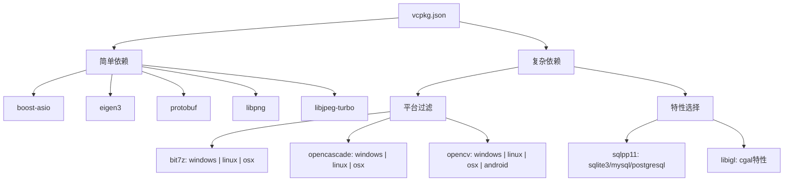
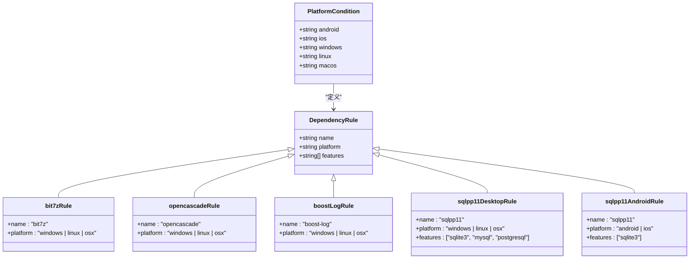
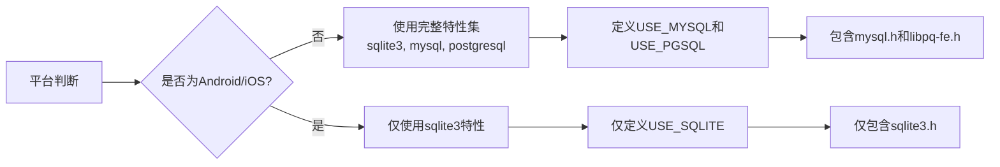
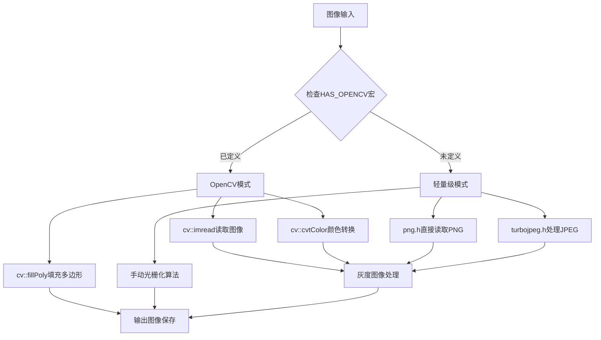
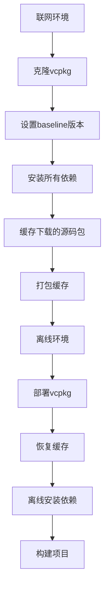

# 依赖管理与 vcpkg 集成

<cite>
**本文档中引用的文件**  
- [vcpkg.json](file://vcpkg.json)
- [vcpkg-configuration.json](file://vcpkg-configuration.json)
- [CMakeLists.txt](file://CMakeLists.txt)
- [CMakePresets.json](file://CMakePresets.json)
- [2D\CMakeLists.txt](file://2D\CMakeLists.txt)
- [2D\ImageToPolygons.cpp](file://2D\ImageToPolygons.cpp)
- [base\CMakeLists.txt](file://base\CMakeLists.txt)
- [fileoperator\CMakeLists.txt](file://fileoperator\CMakeLists.txt)
- [cadmodel\CMakeLists.txt](file://cadmodel\CMakeLists.txt)
- [fileoperator\sql_adapter.cpp](file://fileoperator\sql_adapter.cpp)
- [fileoperator\bit7z_zipper.cpp](file://fileoperator\bit7z_zipper.cpp)
</cite>

## 更新摘要
**所做更改**   
- 更新了OpenCV依赖管理说明，强调项目现在支持无OpenCV构建模式
- 新增PNG和JPEG库作为核心图像处理的替代方案
- 更新了条件编译机制，展示HAS_OPENCV宏的使用
- 完善了依赖矩阵，反映新的图像处理架构
- 更新了CMake集成说明，包含libpng和libjpeg-turbo的配置

## 目录
1. [简介](#简介)
2. [vcpkg依赖声明分析](#vcpkg依赖声明分析)
3. [平台条件依赖管理](#平台条件依赖管理)
4. [带特性依赖配置](#带特性依赖配置)
5. [图像处理依赖架构](#图像处理依赖架构)
6. [CMake集成与find_package映射](#cmake集成与find_package映射)
7. [CMakePresets.json中的vcpkg工具链配置](#cmakepresetsjson中的vcpkg工具链配置)
8. [vcpkg安装与本地集成](#vcpkg安装与本地集成)
9. [添加和更新依赖](#添加和更新依赖)
10. [离线环境部署](#离线环境部署)
11. [最佳实践与故障排除](#最佳实践与故障排除)

## 简介
本指南深入分析HsBaSlicer项目中vcpkg依赖管理的实现机制。项目采用vcpkg作为第三方库管理工具，通过vcpkg.json文件声明所有依赖，利用CMakePresets.json实现跨平台构建配置，并通过条件编译处理不同平台的依赖差异。**重要更新**：项目现已支持无OpenCV构建模式，通过libpng和libjpeg-turbo库提供核心图像处理功能，显著降低了依赖复杂度和构建时间。文档将详细解释依赖声明、平台过滤、特性选择、CMake集成等关键方面，为开发者提供权威的vcpkg集成指南。

## vcpkg依赖声明分析
项目通过vcpkg.json文件集中管理所有第三方依赖，采用结构化JSON格式声明依赖项。依赖分为简单依赖和复杂依赖两种形式：简单依赖直接使用包名字符串，复杂依赖使用对象形式以支持平台过滤和特性选择。



**图源**  
- [vcpkg.json:1-93](file://vcpkg.json#L1-L93)

**节源**  
- [vcpkg.json:1-93](file://vcpkg.json#L1-L93)

## 平台条件依赖管理
项目使用vcpkg的平台过滤功能实现跨平台依赖管理，通过"platform"字段指定依赖的适用平台。这种机制确保特定平台不需要的库不会被安装，优化构建环境并减少潜在冲突。

### 条件依赖模式
项目实现了多种平台条件依赖模式：



**图源**  
- [vcpkg.json:4-90](file://vcpkg.json#L4-L90)
- [CMakeLists.txt:128-136](file://CMakeLists.txt#L128-L136)

**节源**  
- [vcpkg.json:4-90](file://vcpkg.json#L4-L90)
- [CMakeLists.txt:128-136](file://CMakeLists.txt#L128-L136)
- [fileoperator\bit7z_zipper.cpp:5-186](file://fileoperator\bit7z_zipper.cpp#L5-L186)

## 带特性依赖配置
项目利用vcpkg的特性（features）机制定制依赖的功能集，确保只包含必要的组件，避免不必要的依赖和潜在冲突。

### sqlpp11特性配置
sqlpp11库的配置展示了特性选择的完整实现：



在vcpkg.json中，sqlpp11的配置明确区分了桌面平台和移动平台：

```json
{
  "name": "sqlpp11",
  "features": ["sqlite3", "mysql", "postgresql"],
  "platform": "windows | linux | osx"
},
{
  "name": "sqlpp11",
  "features": ["sqlite3"],
  "platform": "android | ios"
}
```

在CMakeLists.txt中，通过条件编译定义相应的宏：

```cmake
if(NOT ANDROID AND NOT IOS AND NOT HSBA_GAME_CONSOLE)
    find_package(Sqlpp11 CONFIG REQUIRED COMPONENTS SQLite3 MySQL PostgreSQL)
    add_compile_definitions(HSBA_USE_MYSQL)
    add_compile_definitions(HSBA_USE_PGSQL)
else()
    find_package(Sqlpp11 CONFIG REQUIRED COMPONENTS SQLite3)
endif()
```

在sql_adapter.cpp中，这些宏控制着实际的头文件包含和功能实现：

```cpp
#ifdef HSBA_USE_MYSQL
#include <mysql/mysql.h>
#endif // HSBA_USE_MYSQL

#ifdef HSBA_USE_PGSQL
#include <libpq-fe.h>
#endif // HSBA_USE_PGSQL
```

**图源**  
- [vcpkg.json:70-85](file://vcpkg.json#L70-L85)
- [CMakeLists.txt:250-257](file://CMakeLists.txt#L250-L257)
- [fileoperator\sql_adapter.cpp:8-15](file://fileoperator\sql_adapter.cpp#L8-L15)

**节源**  
- [vcpkg.json:70-85](file://vcpkg.json#L70-L85)
- [CMakeLists.txt:250-257](file://CMakeLists.txt#L250-L257)
- [fileoperator\sql_adapter.cpp:8-15](file://fileoperator\sql_adapter.cpp#L8-L15)

## 图像处理依赖架构

**新增** 项目现已实现灵活的图像处理架构，支持OpenCV可选模式和轻量级PNG/JPEG直接处理模式。

### 双模式图像处理架构
项目通过条件编译实现了两种图像处理模式：



**图源**  
- [2D\ImageToPolygons.cpp:11-81](file://2D\ImageToPolygons.cpp#L11-L81)
- [2D\ImageToPolygons.cpp:352-389](file://2D\ImageToPolygons.cpp#L352-L389)

### OpenCV可选依赖配置
OpenCV现在作为可选依赖，仅在非iOS和非游戏主机平台上启用：

```cmake
# OpenCV - 可选依赖
if(NOT IOS AND NOT HSBA_GAME_CONSOLE)
  find_package(OpenCV REQUIRED)
  add_compile_definitions(HAS_OPENCV)
endif()
```

### PNG和JPEG核心依赖
无论是否启用OpenCV，PNG和JPEG库都是必需的：

```cmake
# 2D模块中的图像处理依赖
find_package(libpng REQUIRED)
find_package(libjpeg-turbo REQUIRED)

target_link_libraries(HsBaSlicer2D PUBLIC 
    PNG::PNG 
    $<IF:$<TARGET_EXISTS:libjpeg-turbo::turbojpeg>,libjpeg-turbo::turbojpeg,libjpeg-turbo::turbojpeg-static>
    ${OpenCV_LIBRARIES}  # 仅在OpenCV可用时链接
)
```

### 条件编译实现细节
在ImageToPolygons.cpp中，代码根据HAS_OPENCV宏选择不同的实现路径：

```cpp
bool LoadImageGray(const std::string& path, std::vector<uint8_t>& out, int& w, int& h)
{
#ifdef HAS_OPENCV
    try
    {
        cv::Mat img = cv::imread(path, cv::IMREAD_UNCHANGED);
        // OpenCV实现...
        return true;
    }
    catch (const cv::Exception&)
    {
        return false;
    }
#else
    // 返回false，表示需要降级处理
    return false;
#endif
}
```

**节源**  
- [CMakeLists.txt:208-212](file://CMakeLists.txt#L208-L212)
- [2D\CMakeLists.txt:31-41](file://2D\CMakeLists.txt#L31-L41)
- [2D\ImageToPolygons.cpp:30-81](file://2D\ImageToPolygons.cpp#L30-L81)
- [2D\ImageToPolygons.cpp:352-389](file://2D\ImageToPolygons.cpp#L352-L389)

## CMake集成与find_package映射
项目通过CMake的find_package机制与vcpkg包进行映射，实现依赖的查找和链接。vcpkg自动为每个安装的包生成相应的CMake配置文件，使得find_package能够正确找到并配置依赖。

### 核心依赖映射关系
以下是项目中主要依赖的find_package调用与vcpkg包的映射关系：

| vcpkg包名 | CMake find_package调用 | 目标链接名 | 用途 | 平台限制 |
|-----------|------------------------|------------|------|----------|
| libpng | find_package(libpng REQUIRED) | PNG::PNG | PNG图像处理 | 全平台 |
| libjpeg-turbo | find_package(libjpeg-turbo REQUIRED) | libjpeg-turbo::turbojpeg | JPEG图像处理 | 全平台 |
| opencv | find_package(OpenCV REQUIRED) | ${OpenCASCADE_LIBRARIES} | 高级图像处理 | 非iOS/游戏主机 |
| bit7z | find_package(unofficial-bit7z CONFIG REQUIRED) | unofficial::bit7z::bit7z64 | 压缩解压功能 | Windows/Linux/macOS |
| boost-log | find_package(Boost REQUIRED log) | Boost::log | 日志记录 | Windows/Linux/macOS |
| clipper2 | pkg_check_modules(Clipper2 REQUIRED IMPORTED_TARGET Clipper2) | Clipper2::Clipper2 | 几何裁剪 | 全平台 |
| miniz | find_package(miniz CONFIG REQUIRED) | miniz::miniz | 压缩功能 | 全平台 |
| opencascade | find_package(OpenCASCADE CONFIG REQUIRED) | ${OpenCASCADE_LIBRARIES} | CAD内核 | Windows/Linux/macOS |
| sqlpp11 | find_package(Sqlpp11 CONFIG REQUIRED COMPONENTS ...) | sqlpp11::sqlite3, sqlpp11::mysql等 | 数据库访问 | 按平台特性 |
| libigl | find_package(libigl CONFIG REQUIRED) | igl::igl_core等 | 网格处理 | 全平台 |
| CGAL | find_package(CGAL CONFIG REQUIRED) | CGAL::CGAL | 计算几何 | 非iOS/游戏主机 |

### 条件性依赖集成
项目实现了条件性依赖集成，根据平台和配置选项决定是否查找和链接特定依赖：

```mermaid
sequenceDiagram
participant CMake as CMake配置
participant Condition as 条件判断
participant Find as find_package
participant Link as target_link_libraries
CMake->>Condition : 检查平台和选项
alt iOS或游戏主机
Condition->>Find : 跳过OpenCV和CGAL
Condition->>Link : 仅链接PNG/JPEG
else 其他平台
Condition->>Find : 查找OpenCV和CGAL
Find->>vcpkg : 查找包配置
vcpkg-->>Find : 返回包信息
Find->>Link : 提供目标名称
Link->>CMake : 链接依赖库
end
```

**图源**  
- [CMakeLists.txt:208-248](file://CMakeLists.txt#L208-L248)
- [2D\CMakeLists.txt:28-54](file://2D\CMakeLists.txt#L28-L54)
- [base\CMakeLists.txt:26-35](file://base\CMakeLists.txt#L26-L35)
- [fileoperator\CMakeLists.txt:22-50](file://fileoperator\CMakeLists.txt#L22-L50)

**节源**  
- [CMakeLists.txt:208-248](file://CMakeLists.txt#L208-L248)
- [2D\CMakeLists.txt:28-54](file://2D\CMakeLists.txt#L28-L54)
- [base\CMakeLists.txt:26-35](file://base\CMakeLists.txt#L26-L35)
- [fileoperator\CMakeLists.txt:22-50](file://fileoperator\CMakeLists.txt#L22-L50)

## CMakePresets.json中的vcpkg工具链配置
项目通过CMakePresets.json文件配置vcpkg的自动集成，利用"toolchainFile"字段指向vcpkg的CMake工具链文件，实现无缝集成。

### 工具链配置结构
CMakePresets.json中的工具链配置具有以下特点：

```json
{
  "configurePresets": [
    {
      "name": "windows-base",
      "toolchainFile": "$env{VCPKG_ROOT}/scripts/buildsystems/vcpkg.cmake",
      "condition": {
        "type": "equals",
        "lhs": "${hostSystemName}",
        "rhs": "Windows"
      }
    },
    {
      "name": "linux-debug",
      "toolchainFile": "$env{VCPKG_ROOT}/scripts/buildsystems/vcpkg.cmake"
    },
    {
      "name": "android-release",
      "toolchainFile": "$env{VCPKG_ROOT}/scripts/buildsystems/vcpkg.cmake",
      "cacheVariables": {
        "VCPKG_TARGET_TRIPLET": "arm64-android"
      }
    }
  ]
}
```

### 预设配置继承关系
预设配置通过继承机制实现配置复用：

```mermaid
classDiagram
class ConfigurePreset {
+string name
+string displayName
+string generator
+string binaryDir
+string installDir
+string toolchainFile
+map cacheVariables
+string[] inherits
}
class WindowsBase {
+name : "windows-base"
+toolchainFile : "$env{VCPKG_ROOT}/scripts/buildsystems/vcpkg.cmake"
+condition : Windows系统
}
class X64Debug {
+name : "x64-debug"
+inherits : "windows-base"
+cacheVariables : Debug构建类型
}
class X64Release {
+name : "x64-release"
+inherits : "x64-debug"
+cacheVariables : Release构建类型
}
class LinuxDebug {
+name : "linux-debug"
+toolchainFile : "$env{VCPKG_ROOT}/scripts/buildsystems/vcpkg.cmake"
+condition : Linux系统
}
class AndroidRelease {
+name : "android-release"
+toolchainFile : "$env{VCPKG_ROOT}/scripts/buildsystems/vcpkg.cmake"
+cacheVariables : VCPKG_TARGET_TRIPLET=arm64-android
}
ConfigurePreset <|-- WindowsBase
ConfigurePreset <|-- X64Debug
ConfigurePreset <|-- X64Release
ConfigurePreset <|-- LinuxDebug
ConfigurePreset <|-- AndroidRelease
X64Debug --> WindowsBase : 继承
X64Release --> X64Debug : 继承
```

**图源**  
- [CMakePresets.json:1-153](file://CMakePresets.json#L1-L153)

**节源**  
- [CMakePresets.json:1-153](file://CMakePresets.json#L1-L153)

## vcpkg安装与本地集成
项目提供了完整的vcpkg安装和本地集成方案，支持全局和项目级的vcpkg工具链引用。

### 安装步骤
1. 克隆vcpkg仓库：
```bash
git clone https://github.com/Microsoft/vcpkg.git
```

2. 构建vcpkg：
```bash
./vcpkg/bootstrap-vcpkg.bat  # Windows
./vcpkg/bootstrap-vcpkg.sh   # Linux/MacOS
```

3. 设置环境变量：
```bash
set VCPKG_ROOT=C:\path\to\vcpkg  # Windows
export VCPKG_ROOT=/path/to/vcpkg # Linux/MacOS
```

### 项目级集成
项目通过以下方式实现vcpkg的本地集成：

1. **vcpkg-configuration.json**：配置vcpkg注册表，指定基础版本和附加注册表
```json
{
  "default-registry": {
    "kind": "git",
    "baseline": "3a3285c4878c7f5a957202201ba41e6fdeba8db4",
    "repository": "https://github.com/microsoft/vcpkg"
  },
  "registries": [
    {
      "kind": "artifact",
      "location": "https://github.com/microsoft/vcpkg-ce-catalog/archive/refs/heads/main.zip",
      "name": "microsoft"
    }
  ]
}
```

2. **CMakePresets.json**：通过toolchainFile字段启用vcpkg自动集成
```json
"toolchainFile": "$env{VCPKG_ROOT}/scripts/buildsystems/vcpkg.cmake"
```

3. **条件性依赖**：通过平台条件和特性选择优化依赖集

**节源**  
- [vcpkg-configuration.json:1-14](file://vcpkg-configuration.json#L1-L14)
- [CMakePresets.json:10-11](file://CMakePresets.json#L10-L11)
- [vcpkg.json:1-93](file://vcpkg.json#L1-L93)

## 添加和更新依赖
项目提供了标准化的流程来添加新依赖和更新现有包版本。

### 添加新依赖
1. 确定需要的vcpkg包名
2. 在vcpkg.json的dependencies数组中添加新条目
3. 根据需要添加平台条件和特性
4. 在相应的CMakeLists.txt中添加find_package调用
5. 在target_link_libraries中添加链接目标

示例：添加新依赖
```json
{
  "name": "new-package",
  "platform": "!android",
  "features": ["feature1", "feature2"]
}
```

### 更新包版本
1. 更新vcpkg-configuration.json中的baseline字段
2. 运行vcpkg update命令
3. 测试构建和功能
4. 提交更新后的配置文件

版本锁定确保构建可重复性：
```json
"default-registry": {
  "kind": "git",
  "baseline": "3a3285c4878c7f5a957202201ba41e6fdeba8db4",
  "repository": "https://github.com/microsoft/vcpkg"
}
```

**节源**  
- [vcpkg-configuration.json:1-14](file://vcpkg-configuration.json#L1-L14)
- [vcpkg.json:1-93](file://vcpkg.json#L1-L93)
- [CMakeLists.txt:208-248](file://CMakeLists.txt#L208-L248)

## 离线环境部署
项目通过版本锁定和预下载机制支持离线环境部署，确保构建的可重复性和可靠性。

### 离线部署策略
1. **版本锁定**：通过vcpkg-configuration.json中的baseline字段锁定vcpkg版本
2. **依赖固定**：vcpkg.json中声明的依赖版本在baseline确定的vcpkg版本下是确定的
3. **预下载缓存**：在联网环境中预先下载所有依赖的源码包
4. **离线安装**：使用预下载的包在离线环境中安装依赖

### 实现机制


通过这种方式，即使在没有网络连接的环境中，也能确保依赖的完整性和构建的一致性。

**节源**  
- [vcpkg-configuration.json:1-14](file://vcpkg-configuration.json#L1-L14)
- [vcpkg.json:1-93](file://vcpkg.json#L1-L93)

## 最佳实践与故障排除
### 最佳实践
1. **版本控制**：将vcpkg-configuration.json和vcpkg.json纳入版本控制
2. **定期更新**：定期更新baseline版本以获取安全补丁和新功能
3. **最小化依赖**：只包含必要的特性，避免过度依赖
4. **平台适配**：合理使用平台条件，优化不同平台的构建环境
5. **图像处理优化**：考虑使用轻量级PNG/JPEG模式而非OpenCV以减少依赖复杂度

### 常见问题与解决方案
1. **依赖找不到**：确保VCPKG_ROOT环境变量正确设置
2. **平台条件不生效**：检查CMakePresets.json中的条件配置
3. **特性未正确链接**：验证find_package的COMPONENTS参数
4. **构建失败**：检查vcpkg install命令是否成功执行所有依赖
5. **OpenCV相关错误**：确认iOS或游戏主机平台正确跳过了OpenCV依赖
6. **PNG/JPEG链接问题**：检查libpng和libjpeg-turbo是否正确配置

### 图像处理模式选择建议
- **开发环境**：建议使用OpenCV模式以获得更好的调试功能和性能
- **生产部署**：推荐使用轻量级PNG/JPEG模式以减少依赖和二进制大小
- **移动平台**：默认使用轻量级模式，避免OpenCV的复杂性
- **资源受限环境**：优先选择PNG/JPEG模式以降低内存占用

通过遵循本指南，开发者可以有效地管理项目依赖，确保跨平台构建的一致性和可靠性。