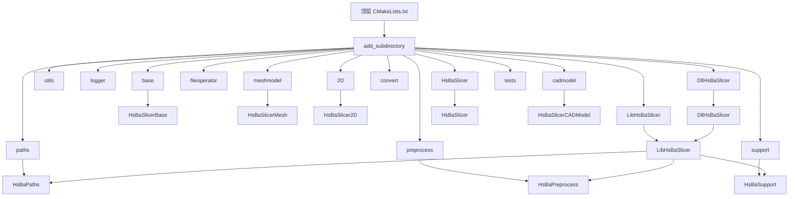
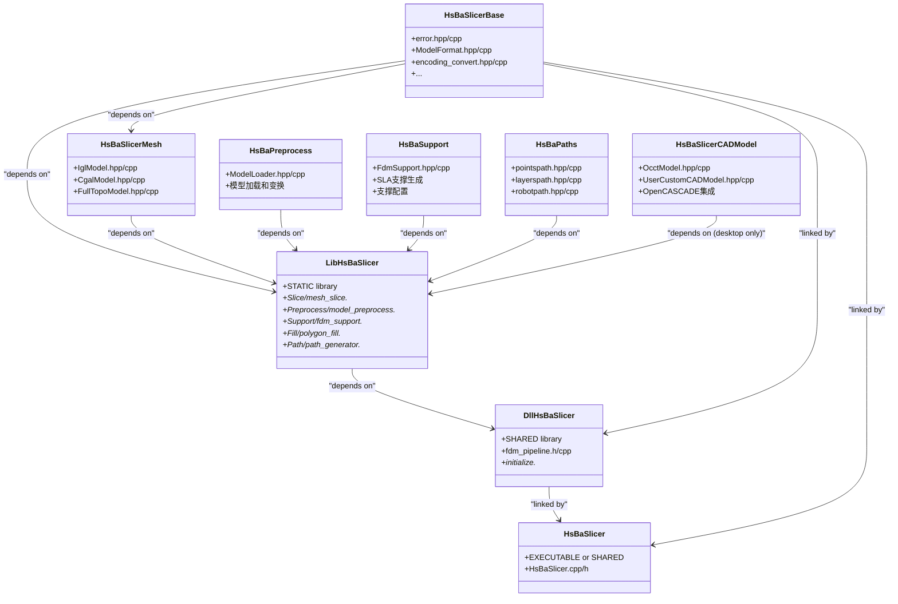
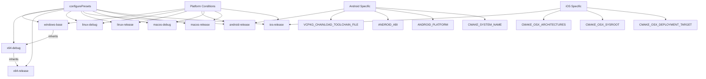

# 构建与部署

<cite>
**本文引用的文件**
- [CMakeLists.txt](file://CMakeLists.txt)
- [cmake/HsBaSlicerConfig.cmake.in](file://cmake/HsBaSlicerConfig.cmake.in)
- [cmake/deploy_dlls.cmake](file://cmake/deploy_dlls.cmake)
- [CMakePresets.json](file://CMakePresets.json)
- [vcpkg.json](file://vcpkg.json)
- [vcpkg-configuration.json](file://vcpkg-configuration.json)
- [README.md](file://README.md)
- [android/README.md](file://android/README.md)
- [android/app/build.gradle](file://android/app/build.gradle)
- [android/build.gradle](file://android/build.gradle)
- [android/settings.gradle](file://android/settings.gradle)
- [LibHsBaSlicer/CMakeLists.txt](file://LibHsBaSlicer/CMakeLists.txt)
- [DllHsBaSlicer/CMakeLists.txt](file://DllHsBaSlicer/CMakeLists.txt)
- [HsBaSlicer/CMakeLists.txt](file://HsBaSlicer/CMakeLists.txt)
- [base/CMakeLists.txt](file://base/CMakeLists.txt)
- [meshmodel/CMakeLists.txt](file://meshmodel/CMakeLists.txt)
- [preprocess/CMakeLists.txt](file://preprocess/CMakeLists.txt)
- [support/CMakeLists.txt](file://support/CMakeLists.txt)
- [paths/CMakeLists.txt](file://paths/CMakeLists.txt)
- [2D/CMakeLists.txt](file://2D/CMakeLists.txt)
- [utils/CMakeLists.txt](file://utils/CMakeLists.txt)
- [cadmodel/CMakeLists.txt](file://cadmodel/CMakeLists.txt)
- [fileoperator/CMakeLists.txt](file://fileoperator/CMakeLists.txt)
</cite>

## 更新摘要
**所做更改**
- 增强了CMake配置，添加了针对游戏主机和嵌入式平台的条件安装逻辑
- 实现了平台特定的构建优化，包括移动平台和嵌入式设备的内存池大小调整
- 改进了跨平台兼容性，支持Xbox、Nintendo Switch、PlayStation等游戏主机平台
- 完善了CADModel目标的条件编译和链接逻辑
- 增强了动态库加载器的平台特定处理

## 目录
1. [简介](#简介)
2. [项目结构](#项目结构)
3. [CMakeLists.txt 结构分析](#cmakeliststxt-结构分析)
4. [CMake安装系统详解](#cmake安装系统详解)
5. [CMakePresets.json 预设配置详解](#cmakepresetsjson-预设配置详解)
6. [vcpkg 依赖管理](#vcpkg-依赖管理)
7. [平台构建指南](#平台构建指南)
8. [库构建选项](#库构建选项)
9. [Android 构建配置](#android-构建配置)
10. [打包与分发](#打包与分发)
11. [故障排除](#故障排除)

## 简介

本指南旨在为 HsBaSlicer 项目提供全面的构建与部署说明。项目采用 CMake 作为构建系统，vcpkg 作为第三方依赖管理工具，支持跨平台构建（Windows、Linux、macOS、Android 和 iOS）。项目现已具备完整的安装系统和包配置功能，并增强了对游戏主机和嵌入式平台的支持。

**Section sources**
- [README.md:1-156](file://README.md#L1-L156)

## 项目结构

HsBaSlicer 项目采用模块化设计，将功能划分为多个子目录，每个子目录包含其自身的 `CMakeLists.txt` 文件。这种结构提高了代码的可维护性和可重用性。

主要模块包括：
- **base**: 基础类型、工具和接口定义。
- **utils**: 扩展的工具函数。
- **fileoperator**: 文件操作、数据库和压缩功能。
- **meshmodel**: 网格模型处理（使用 CGAL 和 libigl）。
- **cadmodel**: CAD 模型处理（使用 OpenCASCADE）。
- **preprocess**: 模型预处理和加载功能。
- **support**: FDM 支撑生成算法。
- **2D**: 二维几何处理和填充算法。
- **paths**: G-code 路径生成和管理。
- **LibHsBaSlicer**: 核心功能的静态库，包含预处理、支撑、填充、路径生成等封装接口。
- **DllHsBaSlicer**: 系统 API 导出的动态库，实现 FDM 全流程协程管道。
- **HsBaSlicer**: 主应用程序。
- **proto**: Protocol Buffers 定义。



**Diagram sources**
- [CMakeLists.txt:314-337](file://CMakeLists.txt#L314-L337)
- [base/CMakeLists.txt:1-31](file://base/CMakeLists.txt#L1-L31)
- [meshmodel/CMakeLists.txt:1-34](file://meshmodel/CMakeLists.txt#L1-L34)
- [preprocess/CMakeLists.txt:1-14](file://preprocess/CMakeLists.txt#L1-L14)
- [support/CMakeLists.txt:1-23](file://support/CMakeLists.txt#L1-L23)
- [LibHsBaSlicer/CMakeLists.txt:1-59](file://LibHsBaSlicer/CMakeLists.txt#L1-L59)
- [DllHsBaSlicer/CMakeLists.txt:1-20](file://DllHsBaSlicer/CMakeLists.txt#L1-L20)
- [HsBaSlicer/CMakeLists.txt:1-67](file://HsBaSlicer/CMakeLists.txt#L1-L67)
- [cadmodel/CMakeLists.txt:1-22](file://cadmodel/CMakeLists.txt#L1-L22)

**Section sources**
- [README.md:7-40](file://README.md#L7-L40)

## CMakeLists.txt 结构分析

顶层 `CMakeLists.txt` 文件是整个项目的构建入口，负责全局配置和子项目的包含。

### 全局配置
文件首先设置最低 CMake 版本要求（3.21），并强制使用 UTF-8 编码。项目标准设置为 C++20。**重要更新**：新增了位置无关代码编译设置 `CMAKE_POSITION_INDEPENDENT_CODE ON`，这对于构建共享库至关重要。`CMAKE_DEBUG_POSTFIX` 被设置为 "d"，这意味着调试版本的库文件将带有 "d" 后缀。

### 编译器特性检测
文件包含详细的编译器特性检测机制，检查 C++20 概念、范围、源位置、非类型模板参数等现代 C++ 特性。这些检测确保编译器支持项目所需的语言特性。

### 平台检测和条件编译
**重大更新**：项目现在支持多种平台类型的检测：

#### 游戏主机平台检测
通过 `VCPKG_TARGET_TRIPLET` 变量检测游戏主机平台：
- Xbox、Nintendo Switch、PlayStation、Stadia 等平台会被识别为游戏主机
- 自动设置 `HSBA_GAME_CONSOLE` 标志和相关编译定义
- 禁用日志系统和其他不适用于游戏主机的功能

#### 桌面和移动平台检测
- **桌面平台**：Windows、Linux、macOS（非iOS）
- **移动平台**：Android、iOS
- 根据平台类型启用或禁用特定功能

### 依赖查找
文件使用 `find_package` 和 `pkg_check_modules` 来查找项目所需的第三方库。这些库包括：
- **Boost**: 用于日志、多精度计算等。
- **Clipper2**: 用于 2D 多边形操作。
- **miniz/bit7z**: 用于压缩功能。
- **PNG/libjpeg-turbo**: 用于图像处理。
- **Protobuf/RapidJSON**: 用于序列化。
- **Eigen3**: 用于线性代数计算。
- **OpenSSL**: 用于加密。
- **OpenCV**: 用于计算机视觉。
- **libigl/CGAL**: 用于网格处理。
- **OpenCASCADE**: 用于 CAD 模型处理（非 Android/iOS/游戏主机平台）。
- **Sqlpp11**: 用于数据库操作。
- **Lua**: 用于脚本扩展。

### 环境特定配置
**重要更新**：新增了环境特定的模型池大小设置：
- 在非移动平台且支持 CGAL 时，设置 `HSBA_MODEL_POOL_SIZE=10`
- 在移动平台或游戏主机上，设置 `HSBA_MODEL_POOL_SIZE=1`

这优化了不同平台的内存使用策略。

### 条件编译
文件包含多个条件编译块，以适应不同平台：
- 在 Windows 上，使用 MSVC 编译器选项 `/utf-8`。
- 在 Android 上，不查找 Boost.Log 并禁用 CAD 内核。
- 在非 Android/iOS/游戏主机平台上，启用 OpenCASCADE 和完整的 Sqlpp11 功能。
- **新增**：在游戏主机平台上禁用日志系统和动态库加载器。

### 子目录组织
通过 `add_subdirectory` 命令，顶层 CMakeLists.txt 按顺序包含所有子模块。**重要更新**：新增了 `preprocess` 和 `support` 子目录的包含，这两个新模块提供了模型预处理和支撑生成的核心功能。

### 统一输出目录
**重大更新**：项目现在使用统一的输出目录结构：
- `CMAKE_RUNTIME_OUTPUT_DIRECTORY`: 可执行文件和DLL输出到 `${CMAKE_BINARY_DIR}/bin/$<CONFIG>`
- `CMAKE_LIBRARY_OUTPUT_DIRECTORY`: 库文件输出到 `${CMAKE_BINARY_DIR}/bin/$<CONFIG>`

这确保了所有平台上的输出目录结构一致，简化了部署过程。

### 库链接逻辑
库的链接逻辑在各自的 `CMakeLists.txt` 文件中定义。**重要更新**：`LibHsBaSlicer` 现在链接了新增的 `HsBaPreprocess`、`HsBaSupport` 和 `HsBaPaths` 依赖，形成了更完整的切片流水线架构。



**Diagram sources**
- [CMakeLists.txt:314-337](file://CMakeLists.txt#L314-L337)
- [base/CMakeLists.txt:1-31](file://base/CMakeLists.txt#L1-L31)
- [meshmodel/CMakeLists.txt:1-34](file://meshmodel/CMakeLists.txt#L1-L34)
- [preprocess/CMakeLists.txt:1-14](file://preprocess/CMakeLists.txt#L1-L14)
- [support/CMakeLists.txt:1-23](file://support/CMakeLists.txt#L1-L23)
- [paths/CMakeLists.txt:1-15](file://paths/CMakeLists.txt#L1-L15)
- [LibHsBaSlicer/CMakeLists.txt:37-45](file://LibHsBaSlicer/CMakeLists.txt#L37-L45)
- [DllHsBaSlicer/CMakeLists.txt:12-20](file://DllHsBaSlicer/CMakeLists.txt#L12-L20)
- [HsBaSlicer/CMakeLists.txt:25-47](file://HsBaSlicer/CMakeLists.txt#L25-L47)
- [cadmodel/CMakeLists.txt:14-22](file://cadmodel/CMakeLists.txt#L14-L22)

**Section sources**
- [CMakeLists.txt:1-496](file://CMakeLists.txt#L1-L496)

## CMake安装系统详解

**新增功能**：项目现已实现完整的CMake安装系统，支持标准化的库安装和包发现。

### 安装目标配置
顶层CMakeLists.txt包含了完整的安装规则：

#### 库目标安装
```cmake
install(TARGETS
    DllHsBaSlicer LibHsBaSlicer HsBaSlicerLog
    HsBaSlicerBase HsBaSlicerUtils HsBaSlicerMesh
    HsBaSlicer2D HsBaPreprocess HsBaSupport HsBaPaths
    HsBaSlicerFileOperator HsBaSlicerProto HsBaCipher
    EXPORT HsBaSlicerTargets
    RUNTIME DESTINATION ${CMAKE_INSTALL_BINDIR}      # DLLs (Windows) / exe
    LIBRARY DESTINATION ${CMAKE_INSTALL_LIBDIR}      # .so (Linux/macOS)
    ARCHIVE DESTINATION ${CMAKE_INSTALL_LIBDIR}      # .lib/.a (import lib)
)
```

**重要更新**：CADModel目标的安装现在是条件性的，仅在非移动端和非游戏主机平台上安装：
```cmake
if(NOT ANDROID AND NOT IOS AND NOT HSBA_GAME_CONSOLE)
  list(APPEND _HSBA_INSTALL_TARGETS HsBaSlicerCADModel)
endif()
```

#### 头文件安装
项目按模块组织头文件安装：
- **公共API**: `DllHsBaSlicer/dllexport.h`, `fdm_pipeline.h`, `initialize.h`
- **基础模块**: `base/IModel.hpp`, `singleton.hpp`
- **日志模块**: `logger/logger.hpp`, `export.h`
- **核心库API**: `LibHsBaSlicer/export.h` 及各个功能模块头文件
- **传递依赖**: 2D、meshmodel、support、paths等模块的头文件

#### CMake包配置
项目生成了完整的CMake包配置文件：
- **HsBaSlicerConfig.cmake**: 包配置文件，包含依赖查找和目标导入
- **HsBaSlicerConfigVersion.cmake**: 版本兼容性文件
- **HsBaSlicerTargets.cmake**: 目标导出文件

### 包配置文件详解
`cmake/HsBaSlicerConfig.cmake.in` 定义了包的依赖关系：

```cmake
@PACKAGE_INIT@

include(CMakeFindDependencyMacro)

# Public dependencies required by HsBaSlicer headers
find_dependency(Eigen3)
find_dependency(magic_enum)
find_dependency(Clipper2)
find_dependency(Lua)
find_dependency(Protobuf)
find_dependency(OpenSSL)

include("${CMAKE_CURRENT_LIST_DIR}/HsBaSlicerTargets.cmake")

check_required_components(HsBaSlicer)
```

### 使用已安装的库
安装完成后，其他项目可以通过以下方式找到并使用HsBaSlicer：

```cmake
find_package(HsBaSlicer REQUIRED)
target_link_libraries(myapp PRIVATE HsBaSlicer::LibHsBaSlicer)
```

支持的命名空间目标：
- `HsBaSlicer::LibHsBaSlicer` - 核心库
- `HsBaSlicer::DllHsBaSlicer` - 动态库接口
- `HsBaSlicer::HsBaSlicerBase` - 基础库
- 以及其他内部库目标

**Section sources**
- [CMakeLists.txt:346-452](file://CMakeLists.txt#L346-L452)
- [cmake/HsBaSlicerConfig.cmake.in:1-16](file://cmake/HsBaSlicerConfig.cmake.in#L1-L16)

## CMakePresets.json 预设配置详解

`CMakePresets.json` 文件定义了跨平台的构建预设，简化了不同环境下的配置过程。

### 预设结构
该文件包含多个 `configurePresets`，每个预设定义了特定平台和配置的构建选项。

### 基础预设 (windows-base)
`windows-base` 是一个隐藏的预设，作为其他 Windows 预设的基础。它指定了：
- **generator**: 使用 Ninja 构建系统。
- **binaryDir**: 二进制文件输出目录。
- **installDir**: 安装目录。
- **toolchainFile**: 指向 vcpkg 的工具链文件。
- **cacheVariables**: 设置 MSVC 编译器。
- **condition**: 仅在 Windows 主机上激活。

### x64-debug 和 x64-release
这两个预设继承自 `windows-base`，并指定 x64 架构。`x64-debug` 设置 `CMAKE_BUILD_TYPE` 为 `Debug`，而 `x64-release` 继承 `x64-debug` 并将其覆盖为 `Release`。

### linux-debug 和 linux-release
这两个预设专为 Linux 平台设计。它们不继承 Windows 预设，而是独立定义。它们设置了相同的 `CMAKE_BUILD_TYPE` 和 vcpkg 工具链，并通过 `condition` 限制在 Linux 主机上使用。

### android-release
这是 Android 平台的发布预设，配置了 Android NDK 构建环境：
- **CMAKE_BUILD_TYPE**: `Release`
- **VCPKG_TARGET_TRIPLET**: `arm64-android`，指定目标三元组。
- **VCPKG_CHAINLOAD_TOOLCHAIN_FILE**: 指向 Android NDK 的 `android.toolchain.cmake`，这是 Android 构建的关键。
- **ANDROID_NDK**: 通过环境变量 `ANDROID_NDK_HOME` 指定 NDK 路径。
- **ANDROID_ABI**: `arm64-v8a`，目标 ABI。
- **ANDROID_PLATFORM**: `android-28`，目标 Android API 级别。
- **CMAKE_SYSTEM_NAME**: `Android`，告知 CMake 正在进行交叉编译。

### macos-debug 和 macos-release
这两个预设为 macOS 平台设计，配置与 Linux 预设类似，但通过 `condition` 限制在 Darwin（macOS）系统上。

### ios-release
**新增**：iOS 平台预设，使用 Xcode 生成器：
- **CMAKE_SYSTEM_NAME**: `iOS`
- **CMAKE_OSX_ARCHITECTURES**: `arm64`
- **CMAKE_OSX_SYSROOT**: `iphoneos`
- **CMAKE_OSX_DEPLOYMENT_TARGET**: `16.3`



**Diagram sources**
- [CMakePresets.json:1-179](file://CMakePresets.json#L1-L179)

**Section sources**
- [CMakePresets.json:1-179](file://CMakePresets.json#L1-L179)

## vcpkg 依赖管理

vcpkg 是本项目的核心依赖管理工具，通过 `vcpkg.json` 和 `vcpkg-configuration.json` 文件进行配置。

### vcpkg.json
此文件列出了项目所需的所有第三方库及其版本约束。
- **dependencies**: 包含了 Boost、CGAL、OpenCV、Eigen3 等关键库。
- **平台条件**: 使用 `platform` 字段进行条件依赖。例如，`bit7z` 和 `opencascade` 仅在非 Android/iOS 平台上安装。`sqlpp11` 根据平台选择不同的特性（Android 仅使用 SQLite3）。
- **特性 (features)**: `libigl` 启用了 `cgal` 特性，`sqlpp11` 启用了 `sqlite3`、`mysql` 和 `postgresql`。

### vcpkg-configuration.json
此文件配置了 vcpkg 注册表。
- **default-registry**: 指向官方的 Microsoft vcpkg Git 仓库，并通过 `baseline` 锁定了一个特定的提交哈希，确保依赖版本的可重现性。
- **registries**: 添加了一个名为 `microsoft` 的附加注册表，指向 `vcpkg-ce-catalog`，可能包含一些社区扩展包。

这种配置确保了所有开发者和 CI/CD 系统都能使用完全相同的依赖版本，避免了"在我机器上能运行"的问题。

**Section sources**
- [vcpkg.json:1-72](file://vcpkg.json#L1-L72)
- [vcpkg-configuration.json:1-15](file://vcpkg-configuration.json#L1-L15)

## 平台构建指南

本节提供在不同平台上构建项目的详细步骤。

### Windows
1. 安装 Visual Studio 2022 或更高版本，确保包含"使用 C++ 的桌面开发"工作负载、CMake 和 vcpkg。
2. 安装 Git。
3. 克隆项目仓库。
4. 使用支持 CMake Presets 的 IDE（如 Visual Studio 或 VS Code）打开项目，选择 `x64-debug` 或 `x64-release` 预设进行配置和构建。
5. 或者，使用命令行：
   ```cmd
   mkdir build
   cd build
   cmake .. -DCMAKE_TOOLCHAIN_FILE=<vcpkg_root>/scripts/buildsystems/vcpkg.cmake -G "Ninja"
   cmake --build . --config Release
   ```

### Linux
1. 安装必要的系统包：
   ```bash
   sudo apt install cmake git g++ ninja-build pkg-config libx11-dev libglu1-mesa-dev libxi-dev libxmu-dev libfontconfig1-dev libncurses-dev libtirpc-dev bison flex
   ```
2. 克隆并构建 vcpkg：
   ```bash
   git clone https://github.com/microsoft/vcpkg.git
   cd vcpkg
   ./bootstrap-vcpkg.sh
   export VCPKG_ROOT=$(pwd)
   ```
3. 构建项目：
   ```bash
   cd /path/to/HsBaSlicer
   mkdir build && cd build
   cmake .. -DCMAKE_TOOLCHAIN_FILE=$VCPKG_ROOT/scripts/buildsystems/vcpkg.cmake -G Ninja
   cmake --build .
   ```

### macOS
1. 安装 Homebrew。
2. 安装必要工具：
   ```bash
   brew install cmake git ninja
   ```
3. 安装 vcpkg 并设置 `VCPKG_ROOT` 环境变量。
4. 构建项目，使用 `macos-debug` 或 `macos-release` 预设。

### iOS
**新增**：iOS 平台构建需要特殊的配置：
1. 确保安装了 Xcode 和 iOS SDK。
2. 使用 `ios-release` 预设进行构建：
   ```bash
   cmake --preset ios-release
   cmake --build --preset ios-release
   ```
3. 构建产物将包含适用于 iPhone 的静态库。

### 游戏主机平台
**新增**：支持 Xbox、Nintendo Switch、PlayStation 等游戏主机平台：
1. 设置相应的 `VCPKG_TARGET_TRIPLET`：
   - Xbox: `xbox-x64`
   - Nintendo Switch: `switch-arm64`
   - PlayStation: `ps5-x64`
2. 项目会自动检测游戏主机平台并禁用不适用的功能。

**Section sources**
- [README.md:47-137](file://README.md#L47-L137)

## 库构建选项

项目支持构建静态库和动态库，通过 `BUILD_SHARED_LIBS` CMake 变量控制。

- **静态库 (默认)**: 当 `BUILD_SHARED_LIBS` 未定义或为 `OFF` 时，`LibHsBaSlicer` 等库将被构建为静态库（`.lib` 或 `.a`）。这会将所有代码链接到最终的可执行文件中，生成一个独立的二进制文件。
- **动态库**: 当 `BUILD_SHARED_LIBS=ON` 时，库将被构建为共享库（`.dll` 或 `.so`）。这对于减小可执行文件大小和在多个应用程序间共享库非常有用。

**重要更新**：`LibHsBaSlicer` 现在包含四个主要模块：
- **Preprocess**: 模型预处理接口 (`model_preprocess.hpp`)
- **Support**: FDM 支撑生成接口 (`fdm_support.hpp`)
- **Fill**: 多边形填充接口 (`polygon_fill.hpp`)
- **Path**: G-code 路径生成接口 (`path_generator.hpp`)

这些模块分别链接到对应的底层库：`HsBaPreprocess`、`HsBaSupport`、`HsBaPaths`。

在 `HsBaSlicer` 的 `CMakeLists.txt` 中，`DllHsBaSlicer` 始终被构建为 `SHARED` 库，而 `LibHsBaSlicer` 在其 `CMakeLists.txt` 中被定义为 `STATIC`。`BUILD_SHARED_LIBS` 主要影响 vcpkg 管理的第三方库的构建方式。

**Section sources**
- [README.md:148-151](file://README.md#L148-L151)
- [LibHsBaSlicer/CMakeLists.txt:1-59](file://LibHsBaSlicer/CMakeLists.txt#L1-L59)
- [HsBaSlicer/CMakeLists.txt:1-67](file://HsBaSlicer/CMakeLists.txt#L1-L67)

## Android 构建配置

Android 构建需要特殊的配置，主要通过 `CMakePresets.json` 中的 `android-release` 预设或命令行参数完成。

### 环境准备
1. 安装 Android Studio 和 Android NDK。
2. 设置 `ANDROID_NDK_HOME` 环境变量指向 NDK 安装目录。
3. 确保 `VCPKG_ROOT` 环境变量已设置。

### 构建步骤
1. 创建构建目录并运行 CMake：
   ```bash
   mkdir -p build-android && cd build-android
   cmake -DCMAKE_BUILD_TYPE=Release \
         -DCMAKE_TOOLCHAIN_FILE=$VCPKG_ROOT/scripts/buildsystems/vcpkg.cmake \
         -DVCPKG_CHAINLOAD_TOOLCHAIN_FILE=$ANDROID_NDK_HOME/build/cmake/android.toolchain.cmake \
         -DVCPKG_TARGET_TRIPLET=arm64-android \
         -DANDROID_ABI=arm64-v8a \
         -DANDROID_PLATFORM=android-28 \
         ..
   cmake --build . --config Release
   ```
2. 构建成功后，原生库（`.so` 文件）将被复制到 `android_libs/arm64-v8a/` 目录。
3. 将生成的 `.so` 文件复制到 Android 项目的 `jniLibs` 目录：
   ```bash
   cp ${CMAKE_BINARY_DIR}/android_libs/arm64-v8a/*.so android/app/src/main/jniLibs/arm64-v8a/
   ```
4. 使用 Android Studio 打开 `android` 目录，构建或运行 APK。

**重要更新**：Android 构建现在包含对新增模块的支持，包括预处理、支撑生成、填充和路径生成功能。同时禁用了不适用于移动平台的 CAD 功能和日志系统。

`android` 目录包含一个最小的 Android 应用骨架，其 `build.gradle` 文件配置了 `abiFilters` 以仅包含 `arm64-v8a` 架构。

**Section sources**
- [CMakePresets.json:84-108](file://CMakePresets.json#L84-L108)
- [android/README.md:1-22](file://android/README.md#L1-L22)
- [android/app/build.gradle:1-45](file://android/app/build.gradle#L1-L45)
- [HsBaSlicer/CMakeLists.txt:11-48](file://HsBaSlicer/CMakeLists.txt#L11-L48)

## 打包与分发

**重大更新**：项目现在支持多种打包和分发方式，包括标准CMake安装和自定义部署脚本。

### 标准CMake安装
构建完成后，可以使用CMake的标准安装功能：

```bash
# 安装到默认位置 (/usr/local 或 C:\Program Files)
cmake --install build

# 安装到指定前缀
cmake --install build --prefix /opt/HsBaSlicer

# 卸载
cmake --install build --prefix /opt/HsBaSlicer --remove-prefix
```

安装后的目录结构：
```
/opt/HsBaSlicer/
├── bin/           # 可执行文件和DLL
├── lib/           # 库文件 (.so, .a, .lib)
├── include/HsBaSlicer/  # 头文件
│   ├── DllHsBaSlicer/
│   ├── base/
│   ├── logger/
│   ├── LibHsBaSlicer/
│   ├── 2D/
│   ├── meshmodel/
│   ├── support/
│   ├── paths/
│   └── proto/
└── lib/cmake/HsBaSlicer/  # CMake包配置
    ├── HsBaSlicerConfig.cmake
    ├── HsBaSlicerConfigVersion.cmake
    └── HsBaSlicerTargets.cmake
```

**重要更新**：CADModel相关的头文件和库仅在桌面平台上安装，移动端和游戏主机平台不会包含这些文件。

### 使用已安装的库
其他项目可以直接使用已安装的HsBaSlicer：

```cmake
find_package(HsBaSlicer REQUIRED)
target_link_libraries(myapp PRIVATE HsBaSlicer::LibHsBaSlicer)
```

### Windows部署
- **静态链接**: 如果所有库都是静态链接的，只需分发 `HsBaSlicer` 可执行文件。
- **动态链接**: 需要将所有依赖的 `.dll` 文件与可执行文件一起分发。对于 Windows，vcpkg 会自动处理运行时 DLL（如 MSVCRT），但第三方 DLL 需要手动复制。
- **调试符号**: 项目包含 `deploy_dlls.cmake` 脚本，自动复制PDB调试符号文件。

### Linux/macOS部署
- 使用标准CMake安装后，系统会自动处理库依赖。
- 确保目标系统安装了所有必需的依赖库。
- 可以使用 `ldd` (Linux) 或 `otool` (macOS) 检查依赖关系。

### Android部署
- 打包过程由 Android Gradle 插件完成。将原生库放入 `jniLibs` 目录后，构建 APK 时会自动将它们打包进 `lib/arm64-v8a/` 目录。
- 最终的 APK 文件包含了所有必要的原生库和 Java/Kotlin 代码，可以直接安装。

### iOS部署
**新增**：iOS 平台部署：
- 构建产物为静态库，可以直接链接到 iOS 应用中。
- 确保目标架构为 `arm64`，与 iPhone 设备兼容。
- 可以在 Xcode 项目中直接添加构建生成的静态库。

### 游戏主机平台部署
**新增**：游戏主机平台部署注意事项：
- 所有不适用于游戏主机的功能都会被自动禁用。
- 日志系统被替换为平台特定的实现或完全禁用。
- 动态库加载器不可用，所有依赖必须静态链接。

### 自定义部署脚本
项目提供了 `cmake/deploy_dlls.cmake` 脚本，用于Windows平台的调试符号部署。

**Section sources**
- [CMakeLists.txt:346-452](file://CMakeLists.txt#L346-L452)
- [cmake/deploy_dlls.cmake:1-27](file://cmake/deploy_dlls.cmake#L1-L27)
- [HsBaSlicer/CMakeLists.txt:50-63](file://HsBaSlicer/CMakeLists.txt#L50-L63)

## 故障排除

### 常见问题
- **vcpkg 依赖未找到**: 确保 `VCPKG_ROOT` 环境变量已正确设置，并且 `vcpkg install` 已为相应三元组（如 `x64-windows`）安装了所有依赖。
- **Android NDK 错误**: 确认 `ANDROID_NDK_HOME` 指向正确的 NDK 版本，并且 `android.toolchain.cmake` 文件存在。
- **Boost 编译错误**: 确保 CMake 版本足够新（>=3.12），并且 vcpkg 成功构建了 Boost 库。
- **OpenCASCADE 缺少 X11 头文件**: 在 Linux 上，确保已安装 `libx11-dev` 等 X11 开发包。
- **位置无关代码错误**: 如果遇到 `-fPIC` 相关错误，确认顶层 `CMakeLists.txt` 中的 `CMAKE_POSITION_INDEPENDENT_CODE ON` 设置正确。

### 平台特定问题
**新增**：针对不同平台的特殊问题：

#### 游戏主机平台
- **功能缺失**：某些桌面功能在游戏主机平台上不可用是正常行为。
- **日志系统**：游戏主机平台使用平台特定的日志实现或完全禁用日志。
- **动态库加载**：动态库加载器在游戏主机平台上不可用。

#### 移动端平台
- **内存限制**：移动平台的模型池大小被限制为1，这是预期的优化行为。
- **功能裁剪**：CAD 功能、OpenCV 等在移动端被禁用。
- **数据库支持**：移动端仅支持 SQLite3，不支持 MySQL 和 PostgreSQL。

### 安装相关问题
- **CMake包未找到**: 确保已运行 `cmake --install` 并将安装目录添加到 `CMAKE_PREFIX_PATH`。
- **头文件路径错误**: 检查安装目录结构是否正确，特别是 `include/HsBaSlicer/` 目录。
- **库链接错误**: 确认目标系统的库路径包含安装目录的 `lib/` 文件夹。

### 调试技巧
- 使用 `cmake --build . --verbose` 查看详细的编译命令。
- 检查 `CMakeCache.txt` 文件以确认缓存变量是否正确设置。
- 对于 Android 构建，可以使用 `adb logcat` 查看运行时日志。
- 使用 `cmake --install build --dry-run` 预览安装操作而不实际执行。

**Section sources**
- [README.md:51-55](file://README.md#L51-L55)
- [HsBaSlicer/CMakeLists.txt:50-63](file://HsBaSlicer/CMakeLists.txt#L50-L63)