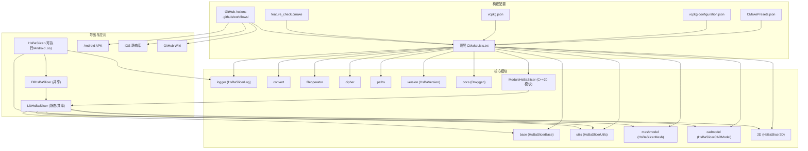
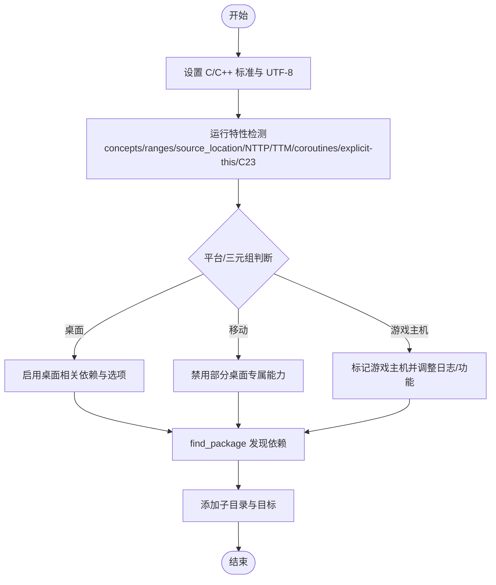
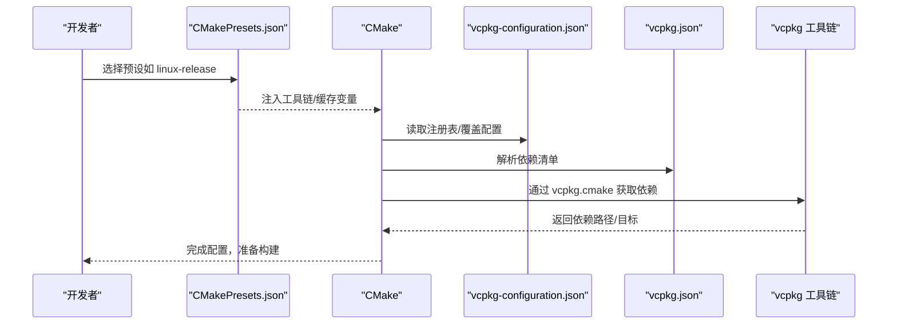
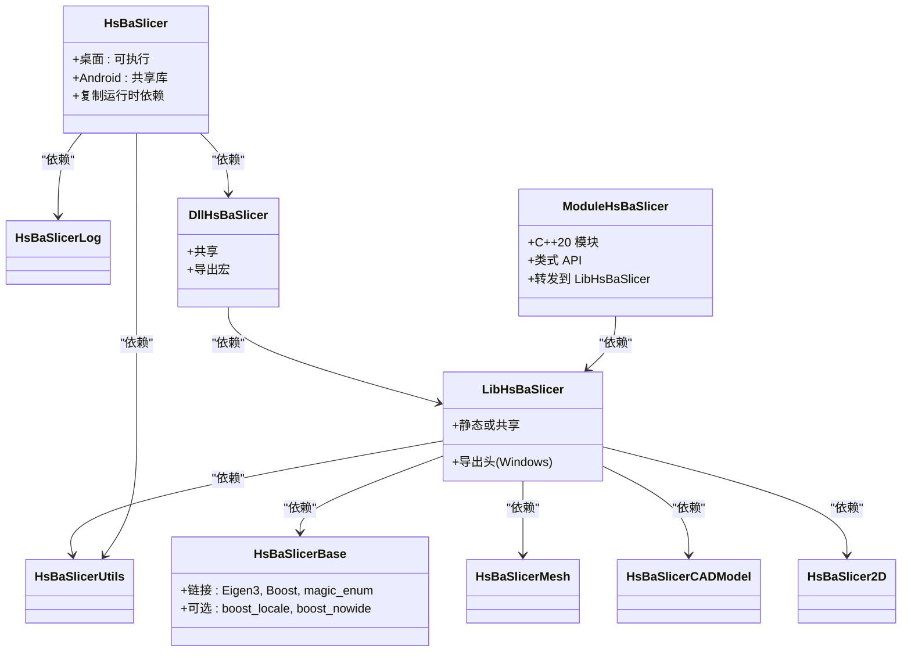
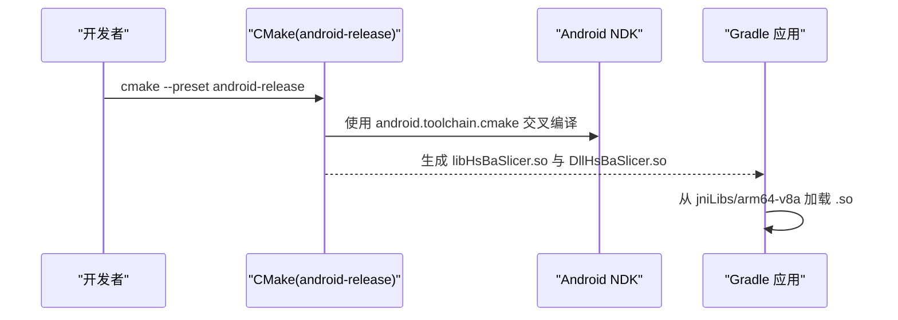
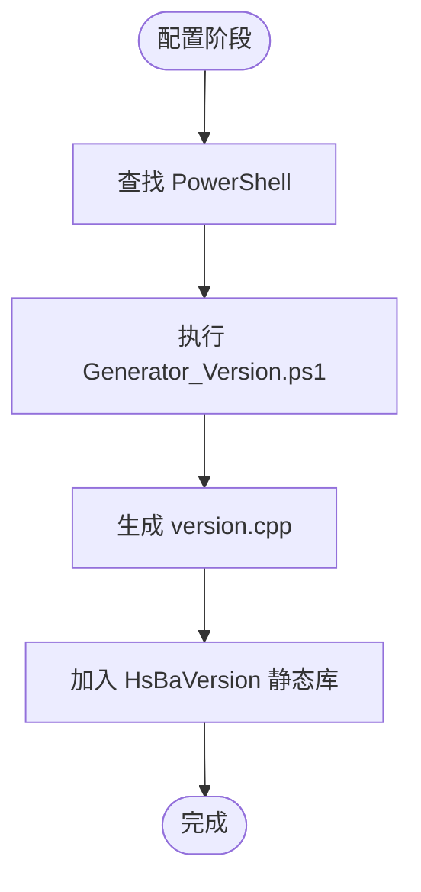
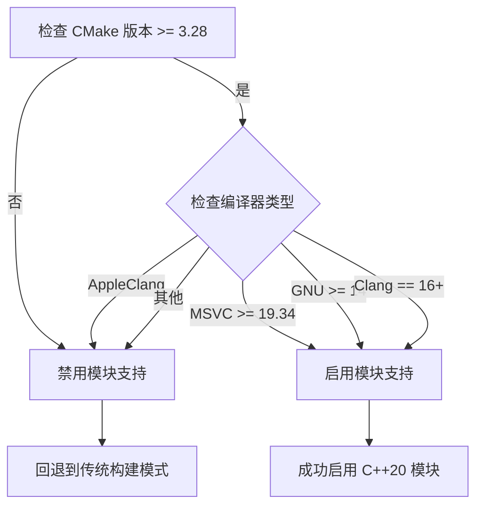
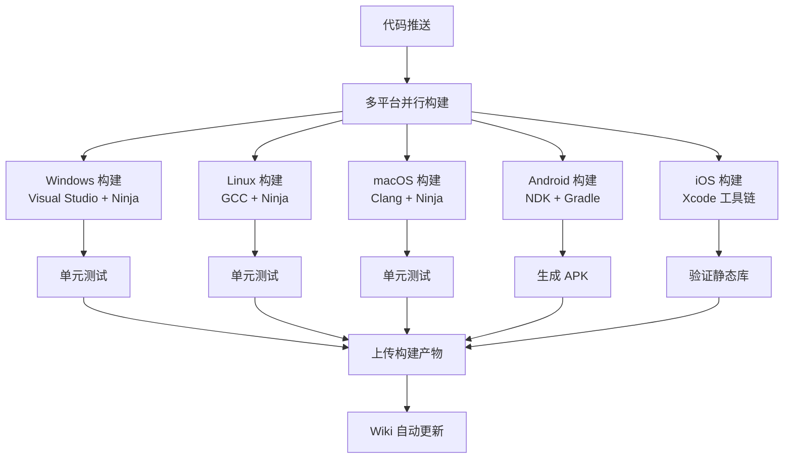
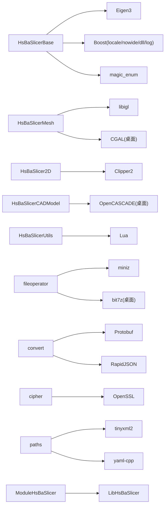

# 跨平台构建系统

<cite>
**本文引用的文件**   
- [CMakeLists.txt](file://CMakeLists.txt)
- [README.md](file://README.md)
- [vcpkg.json](file://vcpkg.json)
- [CMakePresets.json](file://CMakePresets.json)
- [vcpkg-configuration.json](file://vcpkg-configuration.json)
- [feature_check.cmake](file://static_check/feature_check.cmake)
- [base/CMakeLists.txt](file://base/CMakeLists.txt)
- [LibHsBaSlicer/CMakeLists.txt](file://LibHsBaSlicer/CMakeLists.txt)
- [DllHsBaSlicer/CMakeLists.txt](file://DllHsBaSlicer/CMakeLists.txt)
- [HsBaSlicer/CMakeLists.txt](file://HsBaSlicer/CMakeLists.txt)
- [ModuleHsBaSlicer/CMakeLists.txt](file://ModuleHsBaSlicer/CMakeLists.txt)
- [android/build.gradle](file://android/build.gradle)
- [android/app/build.gradle](file://android/app/build.gradle)
- [version/CMakeLists.txt](file://version/CMakeLists.txt)
- [docs/CMakeLists.txt](file://docs/CMakeLists.txt)
</cite>

## 更新摘要
**变更内容**   
- 修复 Apple Clang 兼容性：在静态分析配置中将 CMake 条件从 MATCHES 更正为 STREQUAL 比较，以正确检测 Clang 编译器 ID
- 排除 AppleClang 的 C++ 模块支持：由于缺少 import-graph 发现功能，避免在不支持的编译器上启用模块特性
- 优化编译器检测逻辑：确保不同 Clang 变体（AppleClang、LLVM Clang）的正确识别和处理

## 目录
1. [简介](#简介)
2. [项目结构](#项目结构)
3. [核心组件](#核心组件)
4. [架构总览](#架构总览)
5. [详细组件分析](#详细组件分析)
6. [持续集成与自动化](#持续集成与自动化)
7. [依赖分析](#依赖分析)
8. [性能考虑](#性能考虑)
9. [故障排查指南](#故障排查指南)
10. [结论](#结论)
11. [附录](#附录)

## 简介
本仓库采用 CMake + vcpkg 的跨平台构建体系，现已全面升级支持 Windows、Linux、macOS、Android 与 iOS 五大平台的完整构建流水线。通过 GitHub Actions 实现了自动化多平台构建、测试和文档发布，显著提升了项目的可维护性和跨平台兼容性。整体设计强调：
- **全平台覆盖**：从桌面到移动设备的完整构建支持
- **自动化程度高**：从代码提交到产物发布的完整 CI/CD 流程
- **缓存优化**：智能的依赖缓存机制提升构建速度
- **质量保障**：多平台并行测试和验证

## 项目结构
从构建视角看，顶层 CMake 将工程划分为多个子模块，按职责分层：
- base：基础类型、通用工具与接口
- cipher/utils/fileoperator/meshmodel/cadmodel/convert：领域功能与转换层
- LibHsBaSlicer/DllHsBaSlicer：对外导出的静态/动态库
- HsBaSlicer：最终可执行程序（或 Android 下的共享库）
- ModuleHsBaSlicer：C++20 模块包装层（可选）
- version/docs：版本信息与文档生成
- .github/workflows：GitHub Actions 工作流配置

```mermaid
graph TB
A["顶层 CMake<br/>CMakeLists.txt"] --> B["基础库 base<br/>base/CMakeLists.txt"]
A --> C["工具 utils<br/>utils/CMakeLists.txt"]
A --> D["加密 cipher<br/>cipher/CMakeLists.txt"]
A --> E["文件操作 fileoperator<br/>fileoperator/CMakeLists.txt"]
A --> F["二维几何 2D<br/>2D/CMakeLists.txt"]
A --> G["路径 paths<br/>paths/CMakeLists.txt"]
A --> H["网格模型 meshmodel<br/>meshmodel/CMakeLists.txt"]
A --> I["CAD 模型 cadmodel<br/>cadmodel/CMakeLists.txt"]
A --> J["数据转换 convert<br/>convert/CMakeLists.txt"]
A --> K["导出库 LibHsBaSlicer<br/>LibHsBaSlicer/CMakeLists.txt"]
A --> L["导出 DLL DllHsBaSlicer<br/>DllHsBaSlicer/CMakeLists.txt"]
A --> M["应用 HsBaSlicer<br/>HsBaSlicer/CMakeLists.txt"]
A --> N["版本 HsBaVersion<br/>version/CMakeLists.txt"]
A --> O["文档 docs<br/>docs/CMakeLists.txt"]
A --> P["C++20 模块 ModuleHsBaSlicer<br/>ModuleHsBaSlicer/CMakeLists.txt"]
P["GitHub Actions<br/>.github/workflows/"] --> A
P --> Q["Android 构建<br/>android/"]
P --> R["iOS 构建<br/>ios/"]
```

**图表来源**
- [CMakeLists.txt:294-316](file://CMakeLists.txt#L294-L316)

**章节来源**
- [CMakeLists.txt:294-316](file://CMakeLists.txt#L294-L316)

## 核心组件
- **顶层配置与特性检测**
  - 设置 C/C++ 标准、UTF-8 编码、Debug 后缀
  - 运行静态特性检测（概念、ranges、source_location、NTTP、模板模板匹配、协程、显式 this、C23 constexpr）
  - 根据 VCPKG_TARGET_TRIPLET 识别游戏主机并启用相应宏
  - 平台分类（桌面/移动/未知）并设置 HSBA_DESKTOP/HSBA_MOBILE
  - 依赖发现：Boost、Clipper2、miniz/bit7z、Protobuf、RapidJSON、Eigen3、OpenSSL、OpenCV、libigl/CGAL、OpenCASCADE、sqlpp11、Lua、tinyxml2、yaml-cpp、magic_enum
  - 选项控制：动态库加载器、线程池协程、测试、文档、C++20 模块
- **依赖管理**
  - vcpkg.json 声明跨平台依赖及平台/特性过滤
  - vcpkg-configuration.json 指定默认注册表、镜像与覆盖端口/三元组
  - CMakePresets.json 提供多平台预设（Windows/Linux/macOS/iOS/Android），统一二进制/安装目录与工具链
- **模块构建**
  - base 作为公共基础库，链接 Eigen、Boost、magic_enum，并在非移动端引入 locale/nowide
  - LibHsBaSlicer 聚合业务模块，按需输出静态或共享库，并处理导出头
  - DllHsBaSlicer 为统一的导出入口动态库
  - HsBaSlicer 为目标应用（Windows/Linux/macOS 为可执行，Android 为共享库），并自动复制运行时依赖
  - ModuleHsBaSlicer 为 C++20 模块包装层（可选，需要编译器支持）
  - version 在配置阶段调用 PowerShell 生成版本源文件，封装为静态库
  - docs 可选生成 Doxygen 文档

**章节来源**
- [CMakeLists.txt:1-355](file://CMakeLists.txt#L1-L355)
- [vcpkg.json:1-93](file://vcpkg.json#L1-L93)
- [vcpkg-configuration.json:1-21](file://vcpkg-configuration.json#L1-L21)
- [CMakePresets.json:1-179](file://CMakePresets.json#L1-L179)
- [base/CMakeLists.txt:1-49](file://base/CMakeLists.txt#L1-L49)
- [LibHsBaSlicer/CMakeLists.txt:1-36](file://LibHsBaSlicer/CMakeLists.txt#L1-L36)
- [DllHsBaSlicer/CMakeLists.txt:1-8](file://DllHsBaSlicer/CMakeLists.txt#L1-L8)
- [HsBaSlicer/CMakeLists.txt:1-77](file://HsBaSlicer/CMakeLists.txt#L1-L77)
- [ModuleHsBaSlicer/CMakeLists.txt:1-46](file://ModuleHsBaSlicer/CMakeLists.txt#L1-L46)
- [version/CMakeLists.txt:1-53](file://version/CMakeLists.txt#L1-L53)
- [docs/CMakeLists.txt:1-13](file://docs/CMakeLists.txt#L1-L13)

## 架构总览
下图展示了构建期关键工件与依赖关系：顶层 CMake 驱动各子模块，vcpkg 提供依赖，预设统一构建环境，Android 通过 Gradle 消费生成的 .so，GitHub Actions 实现自动化构建。

**图表来源**
- [CMakeLists.txt:294-316](file://CMakeLists.txt#L294-L316)

## 详细组件分析

### 顶层 CMake 与特性检测
- 语言标准与编码：强制 UTF-8，C++20，C11/C23 自适应
- 特性检测：使用 feature_check.cmake 中的函数进行编译期探测，失败则终止或降级
- 平台与目标：依据 CMAKE_SYSTEM_NAME/VCPKG_TARGET_TRIPLET 判定桌面/移动/游戏主机，设置对应宏与选项
- 依赖发现：find_package/pkg_check_modules 组合，按平台选择性启用 OpenCV、CGAL、OpenCASCADE、sqlpp11 组件
- 构建产物：统一 Debug 后缀，按平台选择静态/共享库策略，复制运行时依赖到输出目录

**图表来源**
- [CMakeLists.txt:1-104](file://CMakeLists.txt#L1-L104)
- [feature_check.cmake:1-104](file://static_check/feature_check.cmake#L1-L104)

**章节来源**
- [CMakeLists.txt:1-104](file://CMakeLists.txt#L1-L104)
- [feature_check.cmake:1-104](file://static_check/feature_check.cmake#L1-L104)

### 依赖管理与 vcpkg
- vcpkg.json：集中声明依赖及其平台/特性约束（如 sqlpp11 在桌面包含 MySQL/PostgreSQL，在移动端仅 SQLite3）
- vcpkg-configuration.json：指定默认 git 注册表、制品注册表与覆盖端口/三元组目录
- CMakePresets.json：定义多平台预设，统一 Ninja/Xcode 生成器、工具链、输出目录、交叉编译参数（Android/iOS）

**图表来源**
- [CMakePresets.json:1-179](file://CMakePresets.json#L1-L179)
- [vcpkg-configuration.json:1-21](file://vcpkg-configuration.json#L1-L21)
- [vcpkg.json:1-93](file://vcpkg.json#L1-L93)

**章节来源**
- [vcpkg.json:1-93](file://vcpkg.json#L1-L93)
- [vcpkg-configuration.json:1-21](file://vcpkg-configuration.json#L1-L21)
- [CMakePresets.json:1-179](file://CMakePresets.json#L1-L179)

### 模块构建与导出
- base：基础库，链接 Eigen、Boost、magic_enum；在非移动端额外链接 locale/nowide
- LibHsBaSlicer：聚合业务模块，按 BUILD_SHARED_LIBS 决定静态/共享；Windows 下导出宏与导出头
- DllHsBaSlicer：统一导出入口的动态库
- HsBaSlicer：桌面为可执行，Android 为共享库；后构建事件复制运行时依赖（dll/so/pdb）
- ModuleHsBaSlicer：C++20 模块包装层，提供类式 API，内部转发到 LibHsBaSlicer 自由函数

**图表来源**
- [base/CMakeLists.txt:1-49](file://base/CMakeLists.txt#L1-L49)
- [LibHsBaSlicer/CMakeLists.txt:1-36](file://LibHsBaSlicer/CMakeLists.txt#L1-L36)
- [DllHsBaSlicer/CMakeLists.txt:1-8](file://DllHsBaSlicer/CMakeLists.txt#L1-L8)
- [HsBaSlicer/CMakeLists.txt:1-77](file://HsBaSlicer/CMakeLists.txt#L1-L77)
- [ModuleHsBaSlicer/CMakeLists.txt:1-46](file://ModuleHsBaSlicer/CMakeLists.txt#L1-L46)

**章节来源**
- [base/CMakeLists.txt:1-49](file://base/CMakeLists.txt#L1-L49)
- [LibHsBaSlicer/CMakeLists.txt:1-36](file://LibHsBaSlicer/CMakeLists.txt#L1-L36)
- [DllHsBaSlicer/CMakeLists.txt:1-8](file://DllHsBaSlicer/CMakeLists.txt#L1-L8)
- [HsBaSlicer/CMakeLists.txt:1-77](file://HsBaSlicer/CMakeLists.txt#L1-L77)
- [ModuleHsBaSlicer/CMakeLists.txt:1-46](file://ModuleHsBaSlicer/CMakeLists.txt#L1-L46)

### Android 集成
- 顶层预设 android-release 通过 ANDROID_NDK_HOME 与 vcpkg 工具链完成交叉编译，输出 arm64-v8a
- HsBaSlicer 在 Android 下构建为共享库，并将 DllHsBaSlicer 的 .so 复制到相同 ABI 目录
- Gradle 工程引用 jniLibs 目录以打包 .so 到 APK

**图表来源**
- [CMakePresets.json:84-109](file://CMakePresets.json#L84-L109)
- [HsBaSlicer/CMakeLists.txt:12-39](file://HsBaSlicer/CMakeLists.txt#L12-L39)
- [android/app/build.gradle:32-41](file://android/app/build.gradle#L32-L41)

**章节来源**
- [CMakePresets.json:84-109](file://CMakePresets.json#L84-L109)
- [HsBaSlicer/CMakeLists.txt:12-39](file://HsBaSlicer/CMakeLists.txt#L12-L39)
- [android/build.gradle:1-17](file://android/build.gradle#L1-L17)
- [android/app/build.gradle:1-45](file://android/app/build.gradle#L1-L45)

### iOS 构建支持
- 在 macOS 上使用 Xcode 工具链进行交叉编译，目标架构为 arm64
- 所有库在 iOS 上均为静态库（无 dylib 支持）
- 包含完整的构建产物验证和符号检查
- 提供 Swift 桥接示例应用

**章节来源**
- [CMakeLists.txt:141-149](file://CMakeLists.txt#L141-L149)

### 版本信息生成
- 配置阶段查找 PowerShell，调用 Generator_Version.ps1 生成 version.cpp
- 将生成的源文件加入 HsBaVersion 静态库，供上层查询构建元信息

**图表来源**
- [version/CMakeLists.txt:1-53](file://version/CMakeLists.txt#L1-L53)

**章节来源**
- [version/CMakeLists.txt:1-53](file://version/CMakeLists.txt#L1-L53)

### 文档生成
- 顶层检测 Doxygen，若存在则启用 docs 子目录
- docs/CMakeLists.txt 创建自定义目标，基于 Doxyfile 生成 API 文档

**章节来源**
- [CMakeLists.txt:342-354](file://CMakeLists.txt#L342-L354)
- [docs/CMakeLists.txt:1-13](file://docs/CMakeLists.txt#L1-L13)

### C++20 模块支持与 Apple Clang 兼容性修复

**更新** 针对 Apple Clang 兼容性问题进行了重要修复，改进了编译器检测逻辑。

- **问题背景**：之前的实现使用 `MATCHES` 进行编译器 ID 匹配，导致 AppleClang 被错误地识别为 Clang 并启用了 C++20 模块支持
- **解决方案**：将条件检查从 `MATCHES "Clang"` 改为 `STREQUAL "Clang"`，精确匹配 LLVM Clang 编译器
- **影响范围**：AppleClang 现在被正确排除在 C++20 模块支持之外，因为缺少 import-graph 发现功能
- **检测逻辑**：仅在 CMake 3.28+ 且编译器版本满足要求时启用模块支持（MSVC 19.34+、GCC 14+、Clang 16+）

**图表来源**
- [feature_check.cmake:96-113](file://static_check/feature_check.cmake#L96-L113)

**章节来源**
- [feature_check.cmake:96-113](file://static_check/feature_check.cmake#L96-L113)
- [CMakeLists.txt:108-119](file://CMakeLists.txt#L108-L119)

## 持续集成与自动化

### GitHub Actions 多平台构建
项目现已实现完整的 GitHub Actions 自动化构建流水线，支持三大桌面平台和移动平台：

#### 多平台并行构建
- **Windows**：使用 Visual Studio 2022 + Ninja，支持 x64 架构
- **Linux**：使用 GCC 编译器，最大化磁盘空间优化
- **macOS**：使用 Clang 编译器，支持完整功能测试

#### Android 自动化构建
- 自动安装 Android SDK 和 NDK r27d
- 使用 vcpkg 链式工具链进行交叉编译
- 集成 Gradle 7.5.1 构建完整 APK
- 自动生成并上传构建产物

#### iOS 自动化构建
- 在 macOS 上使用 Xcode 工具链
- 目标架构 arm64，部署目标 26.5
- 完整的静态库验证和符号检查
- 示例应用源码验证

**图表来源**
- [CMakeLists.txt:108-119](file://CMakeLists.txt#L108-L119)

### 缓存优化机制
- **vcpkg 下载缓存**：按平台和依赖哈希值缓存第三方库下载
- **二进制缓存后端**：使用 GitHub Actions Cache 作为 vcpkg 二进制缓存
- **Gradle 包装器缓存**：避免重复生成 Gradle wrapper
- **构建空间优化**：Linux 环境下清理不必要的系统组件

## 依赖分析
- **直接依赖**
  - 基础库：Eigen3、Boost（locale/nowide/dll/log）、magic_enum
  - 几何与网格：Clipper2、libigl、CGAL（桌面）
  - CAD：OpenCASCADE（桌面）
  - 序列化/文本：Protobuf、RapidJSON、tinyxml2、yaml-cpp
  - 安全/压缩：OpenSSL、miniz、bit7z（桌面）
  - 数据库：sqlpp11（桌面含 MySQL/PostgreSQL，移动端仅 SQLite3）
  - 脚本：Lua
  - 图像：OpenCV（桌面）
- **间接依赖**
  - 通过 vcpkg 注册表与覆盖端口解析具体版本与特性
- **潜在循环**
  - 当前模块间为单向依赖（应用→导出DLL→导出库→基础/业务模块），未见循环

**图表来源**
- [CMakeLists.txt:135-260](file://CMakeLists.txt#L135-L260)
- [vcpkg.json:1-93](file://vcpkg.json#L1-L93)

**章节来源**
- [CMakeLists.txt:135-260](file://CMakeLists.txt#L135-L260)
- [vcpkg.json:1-93](file://vcpkg.json#L1-L93)

## 性能考虑
- **调试模式关闭布尔运算**：在 Debug 下禁用 CGAL/IGL 的布尔运算以避免高内存与慢速
- **预编译头**：对导出库启用预编译头以提升编译速度
- **静态/动态库策略**：根据平台与三元组自动选择，减少运行时开销与部署复杂度
- **可选特性**：线程池协程、动态库加载器可按需开启，避免不必要的开销
- **CI 缓存优化**：智能的依赖缓存机制显著提升构建速度
- **并行构建**：多平台并行执行，充分利用 CI 资源
- **模块构建优化**：C++20 模块提供更快的编译速度和更好的依赖管理

## 故障排查指南
- **编译器特性缺失**
  - 现象：配置阶段报错"不支持 concepts/ranges/source_location"等
  - 处理：升级编译器至满足 C++20 要求，或调整 CMake 标准与特性检测逻辑
- **缺少 PowerShell**
  - 现象：版本生成失败提示未找到 PowerShell
  - 处理：安装 pwsh 或 powershell，并确保在 PATH 中
- **依赖未找到**
  - 现象：find_package 失败（如 OpenCASCADE/sqlpp11/OpenCV）
  - 处理：确认 vcpkg 已正确安装并配置环境变量；检查 vcpkg.json 的平台限制；必要时切换三元组
- **Android 交叉编译失败**
  - 现象：无法定位 NDK 或工具链
  - 处理：设置 ANDROID_NDK_HOME；确保预设中的 ANDROID_PLATFORM/ABI 与 NDK 兼容
- **iOS 构建失败**
  - 现象：Xcode 工具链问题或架构不匹配
  - 处理：检查 Xcode 版本和命令行工具安装；确认目标架构为 arm64
- **C++20 模块构建失败**
  - 现象：AppleClang 环境下模块导入错误或缺少 import-graph 支持
  - 处理：确认编译器版本满足要求（Clang 16+），或使用 STREQUAL 而非 MATCHES 进行编译器检测
- **GitHub Actions 构建失败**
  - 现象：缓存失效或依赖下载超时
  - 处理：清理 GitHub Actions 缓存；检查网络连接；手动触发重新构建
- **Wiki 发布失败**
  - 现象：权限不足或 Wiki 仓库未初始化
  - 处理：确保 Wiki 仓库已初始化；检查 GITHUB_TOKEN 权限；手动创建第一个 Wiki 页面

**章节来源**
- [CMakeLists.txt:46-101](file://CMakeLists.txt#L46-L101)
- [version/CMakeLists.txt:23-45](file://version/CMakeLists.txt#L23-L45)
- [HsBaSlicer/CMakeLists.txt:50-73](file://HsBaSlicer/CMakeLists.txt#L50-L73)
- [feature_check.cmake:96-113](file://static_check/feature_check.cmake#L96-L113)

## 结论
该构建系统以 CMake 为核心，结合 vcpkg 与预设，现已实现全面的跨平台一致构建体验。通过 GitHub Actions 自动化流水线，支持 Windows、Linux、macOS、Android 和 iOS 五大平台的完整构建、测试和发布流程。通过特性检测与平台分支，灵活裁剪功能；通过模块化与导出层，清晰划分边界；通过版本生成与文档目标，完善工程生态。最新的 Apple Clang 兼容性修复确保了在不同 Clang 变体下的正确行为，特别是避免了在不支持 import-graph 发现的编译器上启用 C++20 模块功能。建议在持续集成中复用预设，保持依赖与三元组稳定，以获得稳定的跨平台构建结果。

## 附录
- **快速构建命令参考**（见 README）
  - Windows：使用 Visual Studio 2022 与 CMake/Vcpkg，选择预设 windows-release
  - Linux：安装依赖后使用预设 linux-release
  - macOS：brew 安装必要工具后使用预设 macos-release
  - Android：设置 ANDROID_NDK_HOME 并使用预设 android-release
  - iOS：在 Darwin 上使用预设 ios-release（最低部署目标 16.3）

- **GitHub Actions 工作流**
  - 多平台构建：`.github/workflows/cmake-multi-platform.yml`
  - 独立平台构建：`.github/workflows/build-windows.yml`、`.github/workflows/build-macos.yml`
  - Wiki 自动发布：`.github/workflows/publish-wiki.yml`

**章节来源**
- [README.md:41-194](file://README.md#L41-L194)
- [CMakeLists.txt:108-119](file://CMakeLists.txt#L108-L119)
- [feature_check.cmake:96-113](file://static_check/feature_check.cmake#L96-L113)