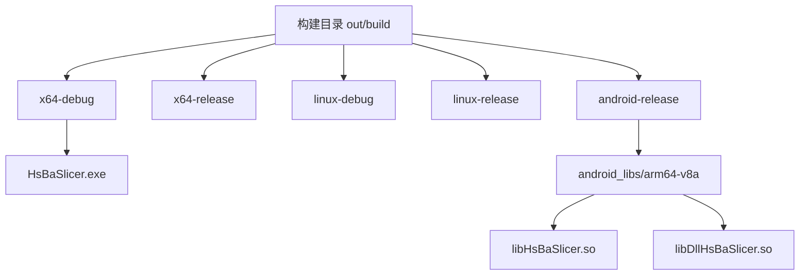
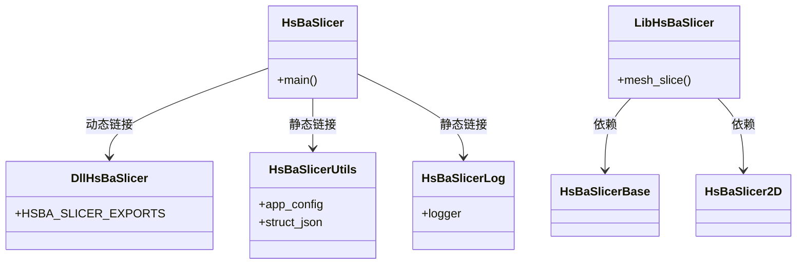
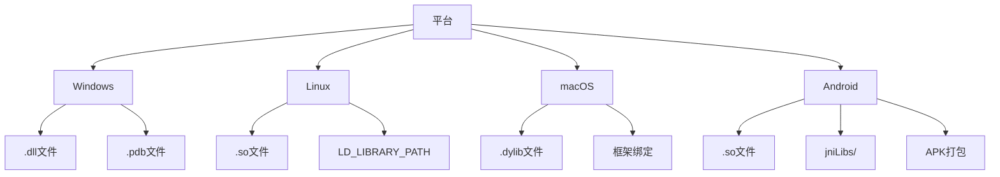

# 部署与分发

<cite>
**本文档引用的文件**  
- [CMakeLists.txt](file://CMakeLists.txt)
- [utils/logcfg.ini](file://utils/logcfg.ini)
- [DllHsBaSlicer/CMakeLists.txt](file://DllHsBaSlicer/CMakeLists.txt)
- [LibHsBaSlicer/CMakeLists.txt](file://LibHsBaSlicer/CMakeLists.txt)
- [HsBaSlicer/CMakeLists.txt](file://HsBaSlicer/CMakeLists.txt)
- [base/CMakeLists.txt](file://base/CMakeLists.txt)
- [utils/CMakeLists.txt](file://utils/CMakeLists.txt)
- [logger/CMakeLists.txt](file://logger/CMakeLists.txt)
- [meshmodel/CMakeLists.txt](file://meshmodel/CMakeLists.txt)
- [vcpkg.json](file://vcpkg.json)
- [CMakePresets.json](file://CMakePresets.json)
- [README.md](file://README.md)
- [android/README.md](file://android/README.md)
</cite>

## 目录
1. [简介](#简介)
2. [构建产物结构](#构建产物结构)
3. [资源文件部署](#资源文件部署)
4. [库输出结构](#库输出结构)
5. [跨平台部署策略](#跨平台部署策略)
6. [发布包创建](#发布包创建)
7. [静态链接版本](#静态链接版本)
8. [依赖完整性验证](#依赖完整性验证)

## 简介
本文档详细说明HsBaSlicer项目的部署与分发策略，涵盖从构建产物打包到跨平台部署的完整流程。项目采用CMake作为构建系统，通过vcpkg管理第三方依赖，支持Windows、Linux、macOS和Android多平台构建。文档重点描述如何确保运行时配置可用、动态库与静态库的输出结构、主可执行文件的依赖关系以及各平台的部署清单。

**Section sources**
- [README.md](file://README.md#L1-L156)

## 构建产物结构
项目构建产物根据平台和构建类型组织在`out/build`目录下。使用CMakePresets.json中定义的预设（如x64-debug、x64-release）进行配置，确保跨平台构建的一致性。主可执行文件HsBaSlicer的输出路径由CMAKE_BINARY_DIR/HsBaSlicer确定，Android平台的共享库则输出到CMAKE_BINARY_DIR/android_libs/<ABI>目录。



**Diagram sources**
- [CMakePresets.json](file://CMakePresets.json#L1-L154)
- [HsBaSlicer/CMakeLists.txt](file://HsBaSlicer/CMakeLists.txt#L1-L77)

**Section sources**
- [CMakePresets.json](file://CMakePresets.json#L1-L154)
- [HsBaSlicer/CMakeLists.txt](file://HsBaSlicer/CMakeLists.txt#L1-L77)

## 资源文件部署
为确保运行时配置可用，CMakeLists.txt中使用file(COPY)指令将必要的资源文件复制到输出目录。核心配置文件logcfg.ini位于utils目录，通过以下指令复制到HsBaSlicer输出目录：

```cmake
file(COPY ${CMAKE_CURRENT_SOURCE_DIR}/utils/logcfg.ini DESTINATION ${CMAKE_BINARY_DIR}/HsBaSlicer)
```

该配置文件定义了日志级别、日志格式和输出路径等关键参数，是应用程序正常运行所必需的资源。

```mermaid
flowchart TD
A[源目录 utils/] --> |file(COPY)| B[构建输出目录 HsBaSlicer/]
B --> C[logcfg.ini]
C --> D[应用程序运行时读取]
```

**Diagram sources**
- [CMakeLists.txt](file://CMakeLists.txt#L126)
- [utils/logcfg.ini](file://utils/logcfg.ini#L1-L8)

**Section sources**
- [CMakeLists.txt](file://CMakeLists.txt#L126)
- [utils/logcfg.ini](file://utils/logcfg.ini#L1-L8)

## 库输出结构
项目构建两种类型的库：动态库DllHsBaSlicer和静态库LibHsBaSlicer，以及主可执行文件HsBaSlicer。

### 动态库 (DllHsBaSlicer)
动态库通过SHARED类型构建，输出为平台特定的共享库文件（Windows: .dll, Linux/macOS: .so）。其CMakeLists.txt定义了导出符号：

```cmake
add_library(DllHsBaSlicer SHARED ...)
target_compile_definitions(DllHsBaSlicer PRIVATE HSBA_SLICER_EXPORTS)
```

### 静态库 (LibHsBaSlicer)
静态库通过STATIC类型构建，包含核心切片功能：

```cmake
add_library(LibHsBaSlicer STATIC ...)
target_link_libraries(LibHsBaSlicer PRIVATE HsBaSlicerBase HsBaSlicerUtils ...)
```

### 主可执行文件依赖
主可执行文件HsBaSlicer链接多个组件，包括工具库、日志库和动态库：

```cmake
target_link_libraries(HsBaSlicer PRIVATE HsBaSlicerUtils HsBaSlicerLog DllHsBaSlicer)
```

构建后，使用自定义命令将依赖的DLL/SO文件复制到可执行文件同目录，确保运行时可加载。



**Diagram sources**
- [DllHsBaSlicer/CMakeLists.txt](file://DllHsBaSlicer/CMakeLists.txt#L1-L8)
- [LibHsBaSlicer/CMakeLists.txt](file://LibHsBaSlicer/CMakeLists.txt#L1-L15)
- [HsBaSlicer/CMakeLists.txt](file://HsBaSlicer/CMakeLists.txt#L1-L77)

**Section sources**
- [DllHsBaSlicer/CMakeLists.txt](file://DllHsBaSlicer/CMakeLists.txt#L1-L8)
- [LibHsBaSlicer/CMakeLists.txt](file://LibHsBaSlicer/CMakeLists.txt#L1-L15)
- [HsBaSlicer/CMakeLists.txt](file://HsBaSlicer/CMakeLists.txt#L1-L77)

## 跨平台部署策略
不同平台有不同的部署要求和依赖管理方式。

### Windows平台
- 必须包含vcpkg管理的第三方库DLL文件
- 调试版本有"d"后缀（如HsBaSlicerd.exe）
- PDB文件用于调试，通过CMake命令复制
- 不支持MinGW/MSYS2构建

### Linux平台
- 需正确设置LD_LIBRARY_PATH环境变量
- 依赖X11开发包和OpenGL库
- 使用系统包管理器安装基础依赖
- 共享库路径通常为/usr/local/lib或~/.local/lib

### macOS平台
- 需注意框架绑定和dylib路径
- 推荐使用Homebrew安装依赖
- 构建配置与Linux类似，但系统名称为Darwin

### Android平台
- 已通过AAR集成，构建为共享库
- 使用Gradle构建APK
- SO文件按ABI架构组织在jniLibs目录
- 构建需指定ANDROID_NDK和目标ABI



**Diagram sources**
- [vcpkg.json](file://vcpkg.json#L1-L72)
- [CMakePresets.json](file://CMakePresets.json#L1-L154)
- [android/README.md](file://android/README.md#L1-L22)

**Section sources**
- [vcpkg.json](file://vcpkg.json#L1-L72)
- [CMakePresets.json](file://CMakePresets.json#L1-L154)
- [android/README.md](file://android/README.md#L1-L22)

## 发布包创建
创建发布包的标准化流程如下：

1. 选择合适的构建预设（如x64-release）
2. 执行完整构建生成所有产物
3. 收集必要文件：
   - 主可执行文件
   - 依赖的DLL/SO文件
   - 配置文件（如logcfg.ini）
   - 许可证文件（LICENSE.txt）
4. 按平台组织文件结构
5. 打包为ZIP（Windows）或TAR（Linux/macOS）

对于Android，使用Gradle构建AAR或APK，SO文件自动包含在包中。

## 静态链接版本
为减少外部依赖，可生成静态链接版本：

1. 修改CMake配置，设置BUILD_SHARED_LIBS=OFF
2. 重新配置和构建项目
3. 所有依赖库将被静态链接到主可执行文件
4. 输出单一可执行文件，无需额外DLL/SO

此方式提升部署便捷性，但会增加可执行文件大小。

## 依赖完整性验证
验证部署包完整性的步骤：

1. 检查所有必需文件是否存在
2. 验证动态库的依赖关系（Windows用Dependency Walker，Linux用ldd）
3. 测试应用程序启动和基本功能
4. 确认日志配置文件被正确读取
5. 验证跨平台兼容性