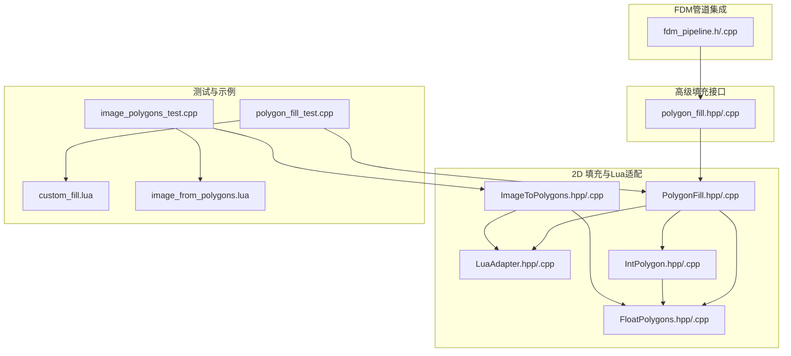
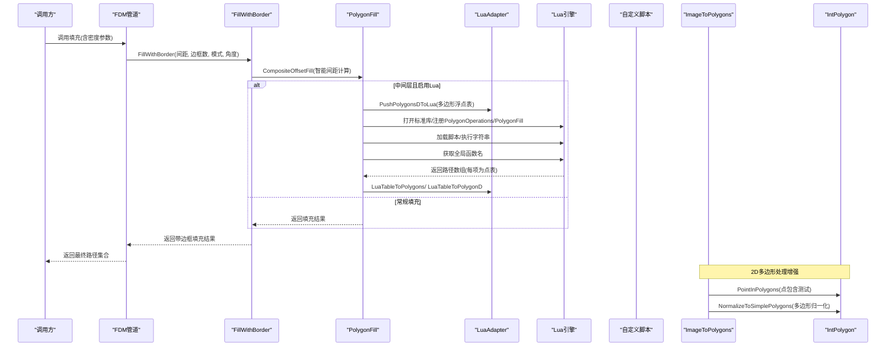
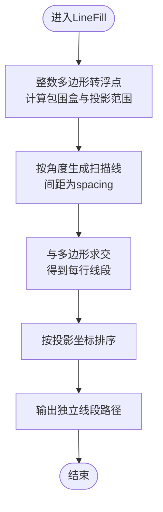
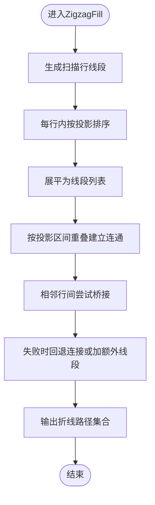
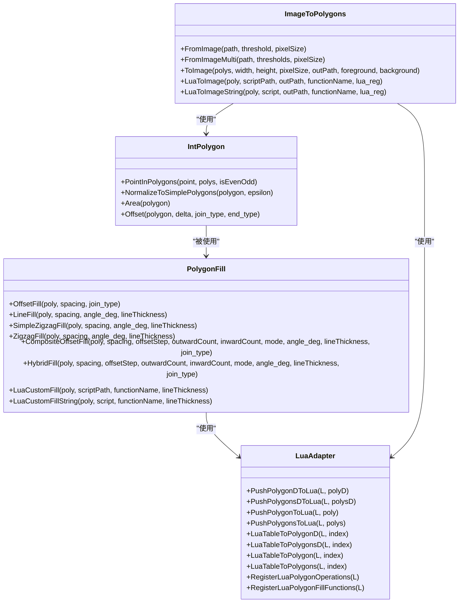
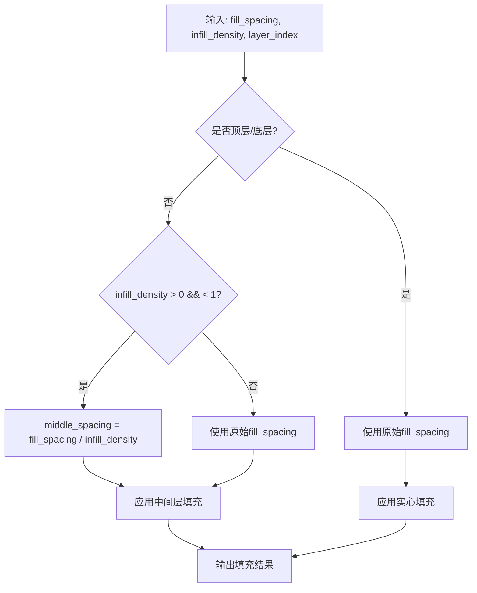
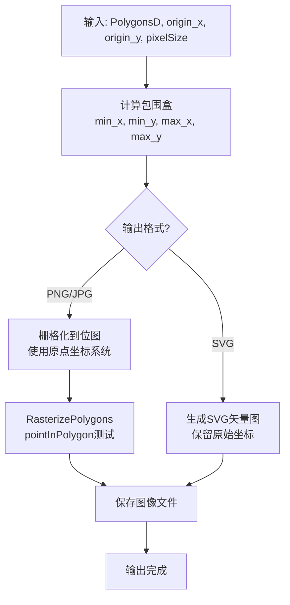
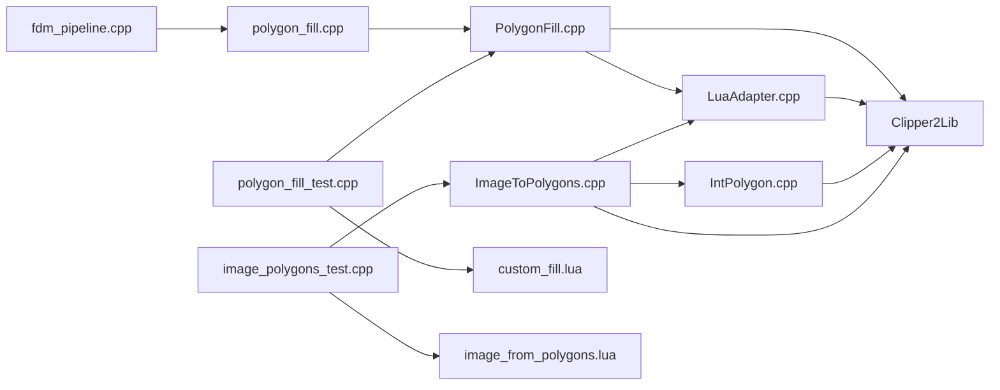

# 2D路径填充

<cite>
**本文引用的文件列表**
- [PolygonFill.hpp](file://2D/PolygonFill.hpp)
- [PolygonFill.cpp](file://2D/PolygonFill.cpp)
- [LuaAdapter.hpp](file://2D/LuaAdapter.hpp)
- [LuaAdapter.cpp](file://2D/LuaAdapter.cpp)
- [IntPolygon.hpp](file://2D/IntPolygon.hpp)
- [IntPolygon.cpp](file://2D/IntPolygon.cpp)
- [FloatPolygons.hpp](file://2D/FloatPolygons.hpp)
- [FloatPolygons.cpp](file://2D/FloatPolygons.cpp)
- [ImageToPolygons.hpp](file://2D/ImageToPolygons.hpp)
- [ImageToPolygons.cpp](file://2D/ImageToPolygons.cpp)
- [polygon_fill_test.cpp](file://tests/PolygonFill/polygon_fill_test.cpp)
- [custom_fill.lua](file://tests/PolygonFill/custom_fill.lua)
- [image_from_polygons.lua](file://tests/PolygonFill/image_from_polygons.lua)
- [image_polygons_test.cpp](file://tests/PolygonFill/image_polygons_test.cpp)
- [fdm_pipeline.h](file://DllHsBaSlicer/fdm_pipeline.h)
- [fdm_pipeline.cpp](file://DllHsBaSlicer/fdm_pipeline.cpp)
- [polygon_fill.hpp](file://LibHsBaSlicer/Fill/polygon_fill.hpp)
- [polygon_fill.cpp](file://LibHsBaSlicer/Fill/polygon_fill.cpp)
</cite>

## 更新摘要
**变更内容**   
- 新增分层密度控制功能，支持顶层/底层与中间层使用不同的填充密度
- 实现基于密度的智能间距计算算法
- **新增** ImageToPolygons模块增强：图像到多边形转换现在接受原点坐标而非居中定位，提供更精确的坐标映射
- **新增** IntPolygon模块增强：PointInPolygons点和多边形归一化函数，支持更精确的点包含测试和几何规范化
- 增强填充算法的参数配置说明，包含密度对路径质量的影响分析
- 更新性能基准测试建议，涵盖不同密度设置下的性能对比

## 目录
1. [简介](#简介)
2. [项目结构](#项目结构)
3. [核心组件](#核心组件)
4. [架构总览](#架构总览)
5. [详细组件分析](#详细组件分析)
6. [分层密度控制机制](#分层密度控制机制)
7. [2D多边形处理增强](#2d多边形处理增强)
8. [依赖关系分析](#依赖关系分析)
9. [性能与参数影响](#性能与参数影响)
10. [故障排查指南](#故障排查指南)
11. [结论](#结论)
12. [附录](#附录)

## 简介
本文件系统性介绍PolygonFill模块提供的四种填充算法：直线填充（Line Fill）、锯齿填充（Zigzag Fill）、偏移填充（Offset Fill）与复合填充（CompositeOffsetFill）、混合填充（HybridFill）。文档深入解析参数配置（间距、角度、线宽/厚度、偏移步长、内外偏移数量、连接类型等）对路径的影响；重点说明Lua脚本扩展机制，展示如何通过LuaAdapter将C++多边形数据传递给Lua环境并执行自定义填充函数；提供custom_fill.lua的完整示例，解释Lua API绑定规则与数据类型转换机制；最后给出算法对比表、路径可视化示意与性能基准建议。

**更新** 新增分层密度控制功能，允许顶层/底层与中间层使用不同的填充密度，并通过智能间距计算算法自动调整填充间距。**新增** 2D多边形处理增强：ImageToPolygons现在接受原点坐标而非居中定位，IntPolygon新增PointInPolygons点和多边形归一化函数。

## 项目结构
- 2D目录包含多边形几何、填充算法与Lua适配器：
  - PolygonFill.hpp/cpp：定义并实现四种填充算法与Lua自定义接口
  - LuaAdapter.hpp/cpp：提供Lua与C++之间的多边形数据互转与注册函数
  - IntPolygon.hpp/cpp：整数多边形类型与布尔运算、偏移、面积、点包含测试、归一化等基础能力
  - FloatPolygons.hpp/cpp：浮点多边形类型与几何构造、文本转多边形等高级功能
  - ImageToPolygons.hpp/cpp：图像到多边形转换与多边形渲染功能
- LibHsBaSlicer/Fill目录包含高级填充接口：
  - polygon_fill.hpp/cpp：提供带边框的填充接口FillWithBorder
- DllHsBaSlicer目录包含管道集成：
  - fdm_pipeline.h/cpp：实现分层密度控制的FDM管道逻辑
- tests/PolygonFill目录包含单元测试与示例脚本，验证算法正确性与Lua扩展用法



**图表来源**
- [PolygonFill.hpp:1-130](file://2D/PolygonFill.hpp#L1-L130)
- [PolygonFill.cpp:1-1439](file://2D/PolygonFill.cpp#L1-L1439)
- [LuaAdapter.hpp:1-25](file://2D/LuaAdapter.hpp#L1-L25)
- [LuaAdapter.cpp:1-120](file://2D/LuaAdapter.cpp#L1-L120)
- [IntPolygon.hpp:1-237](file://2D/IntPolygon.hpp#L1-L237)
- [IntPolygon.cpp:1-435](file://2D/IntPolygon.cpp#L1-L435)
- [FloatPolygons.hpp:1-267](file://2D/FloatPolygons.hpp#L1-L267)
- [FloatPolygons.cpp:1-427](file://2D/FloatPolygons.cpp#L1-L427)
- [ImageToPolygons.hpp:1-79](file://2D/ImageToPolygons.hpp#L1-L79)
- [ImageToPolygons.cpp:1-545](file://2D/ImageToPolygons.cpp#L1-L545)
- [polygon_fill.hpp:1-36](file://LibHsBaSlicer/Fill/polygon_fill.hpp#L1-L36)
- [polygon_fill.cpp:1-29](file://LibHsBaSlicer/Fill/polygon_fill.cpp#L1-L29)
- [fdm_pipeline.h:43-89](file://DllHsBaSlicer/fdm_pipeline.h#L43-L89)
- [fdm_pipeline.cpp:287-349](file://DllHsBaSlicer/fdm_pipeline.cpp#L287-L349)
- [polygon_fill_test.cpp:1-132](file://tests/PolygonFill/polygon_fill_test.cpp#L1-L132)
- [image_polygons_test.cpp:1-149](file://tests/PolygonFill/image_polygons_test.cpp#L1-L149)
- [custom_fill.lua:1-16](file://tests/PolygonFill/custom_fill.lua#L1-L16)
- [image_from_polygons.lua:1-47](file://tests/PolygonFill/image_from_polygons.lua#L1-L47)

## 核心组件
- 四种填充算法
  - 直线填充（LineFill）：沿指定方向生成平行线段，适合简单实心区域快速填充
  - 锯齿填充（ZigzagFill）：在相邻扫描行之间建立桥接路径，减少材料收缩应力
  - 简单锯齿填充（SimpleZigzagFill）：连接同一行或相邻行的线段中心，形成连续折线
  - 偏移填充（OffsetFill）：对多边形进行连续内/外偏移，得到闭合路径集合
  - 复合偏移填充（CompositeOffsetFill）：先按模式填充基底多边形，再对外/内偏移层逐层填充
  - 混合填充（HybridFill）：先向外偏移若干层，再向内偏移若干层，最后对最内层进行指定模式填充
- 高级填充接口
  - FillWithBorder：提供带边框的填充功能，内部调用CompositeOffsetFill实现边框+内部填充
- Lua扩展接口
  - LuaCustomFill/LuaCustomFillString：加载外部脚本或字符串，调用用户自定义函数生成路径集合
  - LuaAdapter：提供PolygonOperations与PolygonFill两组全局Lua库，负责多边形数据的双向转换与注册
- **新增** 2D多边形处理增强
  - PointInPolygons：精确的点在多边形内的测试，支持偶数奇数和非零环绕规则
  - NormalizeToSimplePolygons：多边形归一化函数，确保正确的方向和拓扑关系
  - ImageToPolygons增强：支持原点坐标定位，提供更精确的图像到多边形转换

**章节来源**
- [PolygonFill.hpp:12-127](file://2D/PolygonFill.hpp#L12-L127)
- [PolygonFill.cpp:414-1439](file://2D/PolygonFill.cpp#L414-L1439)
- [polygon_fill.hpp:19-31](file://LibHsBaSlicer/Fill/polygon_fill.hpp#L19-L31)
- [polygon_fill.cpp:20-26](file://LibHsBaSlicer/Fill/polygon_fill.cpp#L20-L26)
- [LuaAdapter.hpp:1-25](file://2D/LuaAdapter.hpp#L1-L25)
- [LuaAdapter.cpp:149-287](file://2D/LuaAdapter.cpp#L149-L287)
- [IntPolygon.hpp:172-206](file://2D/IntPolygon.hpp#L172-L206)
- [IntPolygon.cpp:75-117](file://2D/IntPolygon.cpp#L75-L117)
- [IntPolygon.cpp:325-412](file://2D/IntPolygon.cpp#L325-L412)
- [ImageToPolygons.hpp:25-75](file://2D/ImageToPolygons.hpp#L25-L75)

## 架构总览
下图展示了从C++到Lua再到返回路径的整体流程，以及各算法在不同阶段的职责。



**图表来源**
- [fdm_pipeline.cpp:287-349](file://DllHsBaSlicer/fdm_pipeline.cpp#L287-L349)
- [polygon_fill.cpp:20-26](file://LibHsBaSlicer/Fill/polygon_fill.cpp#L20-L26)
- [PolygonFill.cpp:1166-1270](file://2D/PolygonFill.cpp#L1166-L1270)
- [LuaAdapter.cpp:149-287](file://2D/LuaAdapter.cpp#L149-L287)
- [IntPolygon.cpp:75-117](file://2D/IntPolygon.cpp#L75-L117)
- [IntPolygon.cpp:325-412](file://2D/IntPolygon.cpp#L325-L412)

## 详细组件分析

### 直线填充（LineFill）
- 功能要点
  - 在指定角度下生成平行扫描线，按间距采样，截取多边形内部线段
  - 输出为独立线段（每条路径仅两点），保证路径连续性
- 关键参数
  - spacing：扫描线间距
  - angle_deg：扫描方向角度（度）
  - lineThickness：线宽/厚度（用于内部计算，LineFill中固定为1）
- 数据流
  - 先将整数多边形转换为浮点多边形，计算包围盒与投影范围
  - 沿法向量方向生成矩形条带，与多边形求交，得到每行线段
  - 对每行线段排序后输出为独立线段路径



**图表来源**
- [PolygonFill.cpp:446-465](file://2D/PolygonFill.cpp#L446-L465)

**章节来源**
- [PolygonFill.cpp:446-465](file://2D/PolygonFill.cpp#L446-L465)

### 锯齿填充（ZigzagFill）
- 功能要点
  - 在相邻扫描行之间建立桥接路径，形成连续折线，减少材料收缩应力
  - 使用连通性分析与区间重叠判断，避免跨行环路
- 关键参数
  - spacing：扫描线间距
  - angle_deg：扫描方向角度
  - lineThickness：线宽/厚度（影响桥接采样步长与裁剪精度）
- 数据流
  - 与LineFill类似，但对每行线段按投影坐标排序
  - 将所有线段展平为列表，基于投影区间重叠建立连通分量
  - 对相邻行间尝试桥接，若失败则回退到直接连接或添加额外线段



**图表来源**
- [PolygonFill.cpp:668-1164](file://2D/PolygonFill.cpp#L668-L1164)

**章节来源**
- [PolygonFill.cpp:668-1164](file://2D/PolygonFill.cpp#L668-L1164)

### 简单锯齿填充（SimpleZigzagFill）
- 功能要点
  - 连接同一行或相邻行的线段端点，形成连续折线
  - 通过二分查找确定线段在多边形内的有效区间，避免越界
- 关键参数
  - spacing、angle_deg、lineThickness
- 数据流
  - 生成扫描行线段，按行交错方向处理
  - 对每条线段做微小偏移裁剪，确保端点位于多边形内部
  - 同行或相邻行连接，不同行则新开折线

**章节来源**
- [PolygonFill.cpp:469-666](file://2D/PolygonFill.cpp#L469-L666)

### 偏移填充（OffsetFill）
- 功能要点
  - 对多边形进行连续内/外偏移，得到一系列闭合路径
  - 逐步增加偏移距离，直到结果为空或达到上限
- 关键参数
  - spacing：每次偏移步长
  - join_type：连接类型（Square/Bevel/Round/Miter）
- 数据流
  - 以负步长依次内偏移，添加首尾闭合路径
  - 以正步长依次外偏移，同样添加闭合路径

**章节来源**
- [PolygonFill.cpp:414-443](file://2D/PolygonFill.cpp#L414-L443)

### 复合偏移填充（CompositeOffsetFill）
- 功能要点
  - 先按指定模式（Line/SimpleZigzag/Zigzag）填充基底多边形
  - 再对外/内偏移层逐层填充，形成"同心"填充效果
- 关键参数
  - spacing、offsetStep、outwardCount、inwardCount、mode、angle_deg、lineThickness、join_type
- 数据流
  - 基底填充后加入结果集
  - 外偏移层：按正步长逐层偏移并填充
  - 内偏移层：按负步长逐层偏移并填充

**章节来源**
- [PolygonFill.cpp:1166-1217](file://2D/PolygonFill.cpp#L1166-L1217)

### 混合填充（HybridFill）
- 功能要点
  - 先向外偏移若干层，再向内偏移若干层，最后对最内层进行指定模式填充
  - 通过面积阈值过滤无效岛屿，避免过小区域
- 关键参数
  - spacing、offsetStep、outwardCount、inwardCount、mode、angle_deg、lineThickness、join_type
- 数据流
  - 外偏移：收集闭合路径
  - 内偏移：逐层检查面积阈值，收集有效岛屿
  - 最内层：按模式填充并合并

**章节来源**
- [PolygonFill.cpp:1219-1270](file://2D/PolygonFill.cpp#L1219-L1270)

### Lua脚本扩展机制与API绑定
- 数据类型与转换
  - 浮点多边形（PolygonD/PolygonsD）：Lua侧使用数组表，每个点为{x=..., y=...}
  - 整数多边形（Polygon/Polygons）：Lua侧返回数组表，点坐标以浮点形式提供（内部按integerization还原）
- 注册函数
  - PolygonOperations：布尔运算、偏移、凸包/凹包、面积等
  - PolygonFill：offsetFill、lineFill、simpleZigzagFill、zigzagFill、compositeOffsetFill、hybridFill、offsetOnly
- 自定义脚本调用
  - LuaCustomFill：加载外部脚本文件，调用指定函数（默认generate_fill）
  - LuaCustomFillString：直接执行字符串脚本
  - 返回值：数组表，每项为一个折线/路径，路径由点表组成



**图表来源**
- [PolygonFill.hpp:12-127](file://2D/PolygonFill.hpp#L12-L127)
- [PolygonFill.cpp:1272-1436](file://2D/PolygonFill.cpp#L1272-L1436)
- [LuaAdapter.hpp:1-25](file://2D/LuaAdapter.hpp#L1-L25)
- [LuaAdapter.cpp:149-287](file://2D/LuaAdapter.cpp#L149-L287)
- [IntPolygon.hpp:172-206](file://2D/IntPolygon.hpp#L172-L206)
- [IntPolygon.cpp:75-117](file://2D/IntPolygon.cpp#L75-L117)
- [IntPolygon.cpp:325-412](file://2D/IntPolygon.cpp#L325-L412)
- [ImageToPolygons.hpp:25-75](file://2D/ImageToPolygons.hpp#L25-L75)

**章节来源**
- [PolygonFill.cpp:1272-1436](file://2D/PolygonFill.cpp#L1272-L1436)
- [LuaAdapter.cpp:149-287](file://2D/LuaAdapter.cpp#L149-L287)

### Lua API绑定规则与数据类型转换
- 浮点多边形到Lua
  - PushPolygonsDToLua：将PolygonsD写入Lua表，每点为{x=..., y=...}
- Lua到整数多边形
  - LuaTableToPolygons：遍历数组表，读取每个点的x/y字段，乘以integerization并四舍五入
- 偏移与布尔运算
  - 通过PolygonOperations提供offsetOperation、union、intersection、difference、xor、convexHullOperation、concaveHullOperation、area等
- 填充函数注册
  - 通过RegisterLuaPolygonFillFunctions将PolygonFill库注册为全局变量，供脚本调用

**章节来源**
- [LuaAdapter.cpp:149-287](file://2D/LuaAdapter.cpp#L149-L287)
- [PolygonFill.cpp:398-411](file://2D/PolygonFill.cpp#L398-L411)

### custom_fill.lua 完整示例与说明
- 示例脚本功能
  - 接收多边形参数，返回两条对角折线
- 调用约定
  - 默认函数名：generate_fill
  - 参数：poly（浮点多边形表）
  - 返回：数组表，每项为点表（{x=..., y=...}）

**章节来源**
- [custom_fill.lua:1-16](file://tests/PolygonFill/custom_fill.lua#L1-L16)

## 分层密度控制机制

### 智能间距计算算法
系统实现了基于密度的智能间距计算，根据填充密度值自动调整填充间距：

- **密度范围映射**
  - 当 `infill_density` 在 (0, 1) 范围内时，中间层间距计算公式：`middle_spacing = fill_spacing / infill_density`
  - 密度越低，间距越大，填充越稀疏
  - 密度越高，间距越小，填充越密集

- **分层差异化处理**
  - **顶层/底层**：使用原始 `fill_spacing` 进行实心填充，确保表面质量
  - **中间层**：根据 `infill_density` 动态计算间距，实现密度控制
  - **Lua自定义填充**：仅在非实心层生效，保持灵活性



**图表来源**
- [fdm_pipeline.cpp:290-323](file://DllHsBaSlicer/fdm_pipeline.cpp#L290-L323)

### FillWithBorder高级接口
提供带边框的填充功能，内部使用CompositeOffsetFill实现：

- **功能特性**
  - 自动生成多层边框轮廓
  - 内部区域按指定模式填充
  - 支持自定义边框数量和填充模式

- **参数说明**
  - `spacing`：内部填充间距
  - `border_count`：边框层数
  - `fill_mode`：内部填充模式（Line/SimpleZigzag/Zigzag）
  - `angle_deg`：填充角度

**章节来源**
- [polygon_fill.cpp:20-26](file://LibHsBaSlicer/Fill/polygon_fill.cpp#L20-L26)
- [polygon_fill.hpp:20-31](file://LibHsBaSlicer/Fill/polygon_fill.hpp#L20-L31)

### FDM管道集成
在FDM管道中实现分层密度控制的核心逻辑：

- **配置参数**
  - `infill_density`：填充密度 [0,1]，默认0.2
  - `top_layer_count`：顶层实心层数，默认3
  - `bottom_layer_count`：底层实心层数，默认3
  - `interface_density`：界面层密度 [0,1]，默认0.5

- **处理流程**
  1. 计算中间层智能间距
  2. 遍历所有层，区分实心层和中间层
  3. 根据层类型选择填充策略
  4. 应用相应的填充算法

**章节来源**
- [fdm_pipeline.h:45-62](file://DllHsBaSlicer/fdm_pipeline.h#L45-L62)
- [fdm_pipeline.cpp:287-349](file://DllHsBaSlicer/fdm_pipeline.cpp#L287-L349)

## 2D多边形处理增强

### PointInPolygons点包含测试
新增的PointInPolygons函数提供了精确的点在多边形内的测试功能：

- **功能特性**
  - 支持偶数奇数规则和NonZero环绕规则
  - 处理复杂多边形拓扑结构
  - 返回详细的包含状态（Inside/Outside/On）

- **参数说明**
  - `point`：测试点坐标
  - `polys`：多边形集合
  - `isEvenOdd`：是否使用偶数奇数规则

- **应用场景**
  - 图像栅格化时的像素包含判断
  - 多边形布尔运算前的边界检查
  - 路径规划中的碰撞检测

**章节来源**
- [IntPolygon.hpp:172-174](file://2D/IntPolygon.hpp#L172-L174)
- [IntPolygon.cpp:75-117](file://2D/IntPolygon.cpp#L75-L117)

### 多边形归一化函数
NormalizeToSimplePolygons函数实现了多边形几何的规范化处理：

- **功能特性**
  - 自动纠正多边形方向（顺时针/逆时针）
  - 分离嵌套的多边形和孔洞
  - 移除无效的退化多边形

- **处理流程**
  1. 简化输入多边形，移除共线点
  2. 分割自相交的多边形
  3. 标准化多边形方向
  4. 构建父子关系树
  5. 输出规范化的多边形集合

- **应用场景**
  - 确保多边形数据的拓扑正确性
  - 为后续几何操作准备标准化的输入
  - 修复来自CAD软件的不规范多边形

**章节来源**
- [IntPolygon.hpp:54-62](file://2D/IntPolygon.hpp#L54-L62)
- [IntPolygon.cpp:325-412](file://2D/IntPolygon.cpp#L325-L412)

### ImageToPolygons增强功能
ImageToPolygons模块增强了图像到多边形的转换能力：

- **原点坐标支持**
  - ToImage函数现在支持origin_x和origin_y参数
  - 提供更精确的坐标映射，不再自动居中定位
  - 支持SVG格式输出，保留原始坐标信息

- **栅格化优化**
  - RasterizePolygons函数使用新的原点坐标系统
  - 改进的像素采样算法，提高渲染精度
  - 支持多种图像格式输出（PNG、JPG、SVG）

- **Lua集成增强**
  - LuaToImage和LuaToImageString函数支持自定义渲染脚本
  - 提供完整的PolygonOperations库供Lua脚本使用
  - 支持动态图像生成和处理



**图表来源**
- [ImageToPolygons.cpp:287-389](file://2D/ImageToPolygons.cpp#L287-L389)
- [ImageToPolygons.cpp:256-275](file://2D/ImageToPolygons.cpp#L256-L275)

**章节来源**
- [ImageToPolygons.hpp:25-75](file://2D/ImageToPolygons.hpp#L25-L75)
- [ImageToPolygons.cpp:287-389](file://2D/ImageToPolygons.cpp#L287-L389)
- [ImageToPolygons.cpp:256-275](file://2D/ImageToPolygons.cpp#L256-L275)
- [ImageToPolygons.cpp:413-542](file://2D/ImageToPolygons.cpp#L413-L542)

## 依赖关系分析
- 组件耦合
  - PolygonFill依赖Clipper2Lib进行布尔运算、偏移与点位置判断
  - PolygonFill依赖LuaAdapter进行数据转换与函数注册
  - LuaAdapter依赖Clipper2Lib进行几何运算
  - FillWithBorder依赖CompositeOffsetFill实现边框填充
  - FDM管道依赖FillWithBorder和PolygonFill进行分层填充
  - **新增** IntPolygon提供PointInPolygons和归一化功能，被ImageToPolygons和PolygonFill使用
  - **新增** ImageToPolygons依赖IntPolygon进行几何运算，依赖LuaAdapter进行Lua集成
- 外部依赖
  - Lua 5.4运行时
  - Clipper2 几何库
  - OpenCV（可选，用于图像处理）
  - libpng/turbojpeg（图像格式支持）



**图表来源**
- [PolygonFill.cpp:1-1439](file://2D/PolygonFill.cpp#L1-L1439)
- [LuaAdapter.cpp:1-120](file://2D/LuaAdapter.cpp#L1-L120)
- [polygon_fill.cpp:1-29](file://LibHsBaSlicer/Fill/polygon_fill.cpp#L1-L29)
- [fdm_pipeline.cpp:287-349](file://DllHsBaSlicer/fdm_pipeline.cpp#L287-L349)
- [IntPolygon.cpp:1-435](file://2D/IntPolygon.cpp#L1-L435)
- [ImageToPolygons.cpp:1-545](file://2D/ImageToPolygons.cpp#L1-L545)
- [polygon_fill_test.cpp:1-132](file://tests/PolygonFill/polygon_fill_test.cpp#L1-L132)
- [image_polygons_test.cpp:1-149](file://tests/PolygonFill/image_polygons_test.cpp#L1-L149)
- [custom_fill.lua:1-16](file://tests/PolygonFill/custom_fill.lua#L1-L16)
- [image_from_polygons.lua:1-47](file://tests/PolygonFill/image_from_polygons.lua#L1-L47)

**章节来源**
- [PolygonFill.cpp:1-1439](file://2D/PolygonFill.cpp#L1-L1439)
- [LuaAdapter.cpp:1-120](file://2D/LuaAdapter.cpp#L1-L120)
- [polygon_fill.cpp:1-29](file://LibHsBaSlicer/Fill/polygon_fill.cpp#L1-L29)
- [fdm_pipeline.cpp:287-349](file://DllHsBaSlicer/fdm_pipeline.cpp#L287-L349)
- [IntPolygon.cpp:1-435](file://2D/IntPolygon.cpp#L1-L435)
- [ImageToPolygons.cpp:1-545](file://2D/ImageToPolygons.cpp#L1-L545)
- [polygon_fill_test.cpp:1-132](file://tests/PolygonFill/polygon_fill_test.cpp#L1-L132)
- [image_polygons_test.cpp:1-149](file://tests/PolygonFill/image_polygons_test.cpp#L1-L149)
- [custom_fill.lua:1-16](file://tests/PolygonFill/custom_fill.lua#L1-L16)
- [image_from_polygons.lua:1-47](file://tests/PolygonFill/image_from_polygons.lua#L1-L47)

## 性能与参数影响
- 参数对路径质量与效率的影响
  - **间距（spacing）**
    - 较小间距：路径更密集，填充更均匀，但路径数量增多，路径规划与移动时间增加
    - 较大间距：路径稀疏，效率提升，但可能产生空隙或材料不均
  - **角度（angle_deg）**
    - 影响扫描方向，对复杂几何的桥接与连接连续性有显著影响
    - 与几何方向匹配可减少桥接次数
  - **线宽/厚度（lineThickness）**
    - 影响锯齿桥接采样步长与裁剪精度，进而影响路径连续性与连接稳定性
  - **偏移步长（offsetStep）**
    - 复合/混合填充中控制同心层间距，影响整体路径密度与材料分布
  - **内外偏移数量（outwardCount/inwardCount）**
    - 增加层数可改善材料收缩应力，但会显著增加路径数量
  - **连接类型（join_type）**
    - Square/Bevel/Round/Miter影响路径转折处的几何连续性与打印稳定性
  - **填充密度（infill_density）**
    - **新增**：密度值直接影响中间层填充间距，密度越低间距越大
    - 合理设置密度可在保证强度的同时优化打印时间和材料用量
    - 顶层/底层通常使用较高密度确保表面质量，中间层可根据需求调整

- **分层密度控制的性能优势**
  - **资源优化**：中间层降低密度可显著减少打印时间和材料消耗
  - **质量平衡**：顶层/底层保持高密度确保外观质量和结构强度
  - **自适应调节**：智能间距计算自动适应不同密度需求

- **2D多边形处理增强的性能改进**
  - **PointInPolygons优化**：使用Clipper2Lib的高效点包含测试算法
  - **多边形归一化**：预处理阶段确保几何正确性，减少后续计算错误
  - **原点坐标支持**：避免不必要的坐标变换，提高渲染性能

- 算法选择建议
  - 实心快速填充：LineFill
  - 需要减少收缩应力：ZigzagFill 或 SimpleZigzagFill
  - 需要保持路径连续性：ZigzagFill（桥接更稳健）
  - 需要同心层填充：CompositeOffsetFill 或 HybridFill
  - **需要分层密度控制**：使用FDM管道的FillWithBorder接口
  - **需要精确点包含测试**：使用IntPolygon.PointInPolygons
  - **需要几何规范化**：使用IntPolygon.NormalizeToSimplePolygons
  - **需要图像到多边形转换**：使用ImageToPolygons模块

- **性能基准建议**
  - 基准测试应覆盖不同多边形形状（矩形、圆、复杂轮廓）、不同spacing/angle/lineThickness组合
  - **新增**：测试不同密度设置（0.1-0.9）对填充质量和性能的影响
  - **新增**：评估PointInPolygons和归一化函数在处理复杂几何时的性能
  - **新增**：测试ImageToPolygons在不同分辨率和原点坐标下的渲染性能
  - 记录指标：路径数量、总长度、连接断点数、桥接次数、执行时间、材料用量
  - 对比不同算法在同一参数下的路径质量与效率
  - **新增**：评估分层密度控制在大型模型上的性能提升效果

## 故障排查指南
- Lua脚本加载失败
  - 检查脚本路径与函数名是否正确
  - 确认已注册PolygonOperations与PolygonFill库
- Lua函数未返回表
  - 确保脚本返回数组表，且每项为点表
- 数据类型不匹配
  - 确认传入poly为浮点多边形表（{x=..., y=...}）
  - 确认返回路径点表被正确转换为整数路径
- 偏移结果为空
  - 检查spacing与join_type设置，确认多边形尺寸足够容纳偏移
- **分层密度相关问题**
  - **密度值为0或1**：检查infill_density是否在有效范围(0,1)内
  - **中间层填充异常**：确认top_layer_count和bottom_layer_count设置合理
  - **间距计算错误**：验证fill_spacing是否为正值
- **2D多边形处理增强相关问题**
  - **PointInPolygons返回异常**：检查多边形拓扑结构，必要时先进行归一化处理
  - **归一化后多边形丢失**：确认epsilon参数设置合理，避免过度简化
  - **ImageToPolygons坐标偏移**：检查origin_x和origin_y参数，确认像素大小设置正确
  - **SVG输出坐标不正确**：确认使用了正确的坐标系，避免自动居中行为
- 单元测试参考
  - polygon_fill_test.cpp展示了基本用法与期望行为
  - image_polygons_test.cpp验证了图像到多边形转换的正确性

**章节来源**
- [polygon_fill_test.cpp:1-132](file://tests/PolygonFill/polygon_fill_test.cpp#L1-L132)
- [image_polygons_test.cpp:1-149](file://tests/PolygonFill/image_polygons_test.cpp#L1-L149)
- [PolygonFill.cpp:1272-1436](file://2D/PolygonFill.cpp#L1272-L1436)
- [LuaAdapter.cpp:149-287](file://2D/LuaAdapter.cpp#L149-L287)
- [fdm_pipeline.cpp:290-323](file://DllHsBaSlicer/fdm_pipeline.cpp#L290-L323)
- [IntPolygon.cpp:75-117](file://2D/IntPolygon.cpp#L75-L117)
- [IntPolygon.cpp:325-412](file://2D/IntPolygon.cpp#L325-L412)
- [ImageToPolygons.cpp:287-389](file://2D/ImageToPolygons.cpp#L287-L389)

## 结论
PolygonFill模块提供了从简单直线到复杂锯齿、从单一偏移到复合/混合策略的完整填充方案。通过新增的分层密度控制机制，系统能够智能地根据不同层级需求调整填充密度，在保证打印质量的同时优化性能和材料使用。Lua扩展功能为用户提供了灵活的自定义填充逻辑能力。

**新增的2D多边形处理增强功能**进一步提升了系统的几何处理能力：PointInPolygons提供了精确的点包含测试，NormalizeToSimplePolygons确保了多边形拓扑的正确性，ImageToPolygons的原点坐标支持提高了图像处理的精度。这些增强功能为复杂的几何操作和图像处理任务提供了坚实的基础。

合理配置参数可平衡填充质量、路径连续性与打印效率。建议在实际工程中结合几何特征、材料特性和性能要求选择合适的算法和密度设置，并通过基准测试持续优化参数配置。对于需要高精度几何处理的场景，建议充分利用新增的PointInPolygons和归一化功能来确保数据的正确性。

## 附录

### 算法对比表
- **直线填充（LineFill）**
  - 特点：简单、快速、路径连续性好
  - 适用：实心区域快速填充
  - 参数：spacing、angle_deg、lineThickness
- **简单锯齿填充（SimpleZigzagFill）**
  - 特点：行内/邻行连接，路径连续
  - 适用：中等复杂度几何
  - 参数：spacing、angle_deg、lineThickness
- **锯齿填充（ZigzagFill）**
  - 特点：跨行桥接，减少收缩应力
  - 适用：高要求几何与材料
  - 参数：spacing、angle_deg、lineThickness
- **偏移填充（OffsetFill）**
  - 特点：同心环路径，适合环形/薄壁
  - 适用：环形、薄壁结构
  - 参数：spacing、join_type
- **复合偏移填充（CompositeOffsetFill）**
  - 特点：基底+多层偏移，兼顾密度与连续性
  - 适用：复杂轮廓与厚壁
  - 参数：spacing、offsetStep、outwardCount、inwardCount、mode、angle_deg、lineThickness、join_type
- **混合填充（HybridFill）**
  - 特点：外偏移+内偏移+末层填充，综合最优路径
  - 适用：厚壁与复杂内部结构
  - 参数：spacing、offsetStep、outwardCount、inwardCount、mode、angle_deg、lineThickness、join_type
- **带边框填充（FillWithBorder）**
  - 特点：自动生成边框+内部填充，简化API使用
  - 适用：需要高质量表面的填充场景
  - 参数：spacing、border_count、fill_mode、angle_deg
- **新增** 2D多边形处理增强
  - **PointInPolygons**：精确的点包含测试，支持多种填充规则
  - **NormalizeToSimplePolygons**：多边形归一化，确保拓扑正确性
  - **ImageToPolygons增强**：原点坐标支持，提高渲染精度

### 填充路径可视化示意
- **直线填充**：平行线段，无桥接
- **简单锯齿**：同/邻行连接，折线连续
- **锯齿填充**：跨行桥接，路径连续且减少收缩
- **偏移填充**：同心环路径
- **复合/混合填充**：多层同心+末层填充
- **分层密度填充**：顶层/底层高密度 + 中间层可调密度
- **新增** 2D多边形处理增强
  - **点包含测试**：精确判断点在多边形内的位置
  - **归一化多边形**：修正方向和拓扑关系
  - **原点坐标渲染**：保持原始坐标信息的图像输出

### 分层密度控制配置示例
```cpp
// FDM管道配置示例
HsBaFdmPipelineConfig_t config = {};
config.fill_spacing = 0.4;           // 基础间距
config.infill_density = 0.2;         // 中间层密度
config.top_layer_count = 3;          // 顶层实心层数
config.bottom_layer_count = 3;       // 底层实心层数
config.interface_density = 0.5;      // 界面层密度
```

### 2D多边形处理增强使用示例
```cpp
// PointInPolygons使用示例
Clipper2Lib::Point64 test_point(100, 100);
Polygons polygons = {...}; // 多边形集合
auto result = PointInPolygons(test_point, polygons, true);
if (result == Clipper2Lib::PointInPolygonResult::IsInside) {
    // 点在多边形内部
}

// 多边形归一化示例
Polygon input_polygon = {...}; // 输入多边形
std::vector<Polygon> normalized = NormalizeToSimplePolygons(input_polygon, 1e-3);
for (const auto& poly : normalized) {
    // 处理规范化的多边形
}

// ImageToPolygons增强使用示例
PolygonsD polys = {...}; // 多边形集合
double origin_x = 0.0;   // 原点X坐标
double origin_y = 0.0;   // 原点Y坐标
bool success = ToImage(polys, 100, 100, 1.0, "output.png", 255, 0, origin_x, origin_y);
```

**章节来源**
- [fdm_pipeline.h:45-62](file://DllHsBaSlicer/fdm_pipeline.h#L45-L62)
- [fdm_pipeline.cpp:290-323](file://DllHsBaSlicer/fdm_pipeline.cpp#L290-L323)
- [IntPolygon.hpp:172-206](file://2D/IntPolygon.hpp#L172-L206)
- [IntPolygon.cpp:75-117](file://2D/IntPolygon.cpp#L75-L117)
- [IntPolygon.cpp:325-412](file://2D/IntPolygon.cpp#L325-L412)
- [ImageToPolygons.hpp:25-75](file://2D/ImageToPolygons.hpp#L25-L75)
- [ImageToPolygons.cpp:287-389](file://2D/ImageToPolygons.cpp#L287-L389)