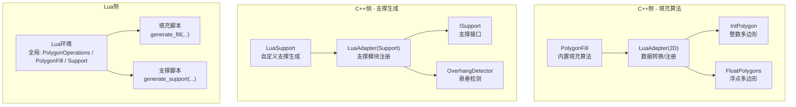
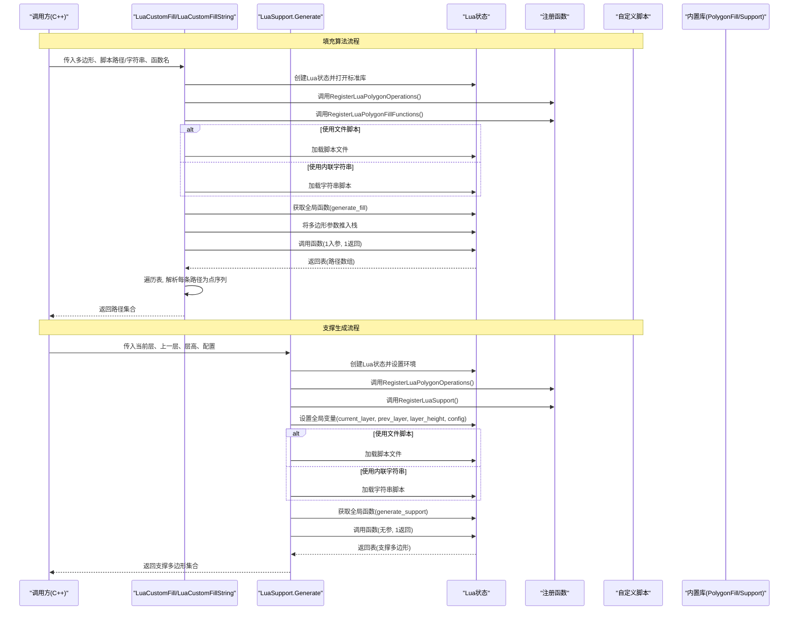
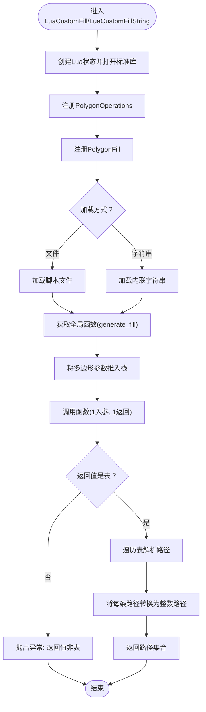
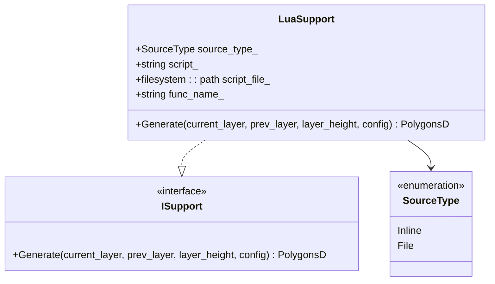
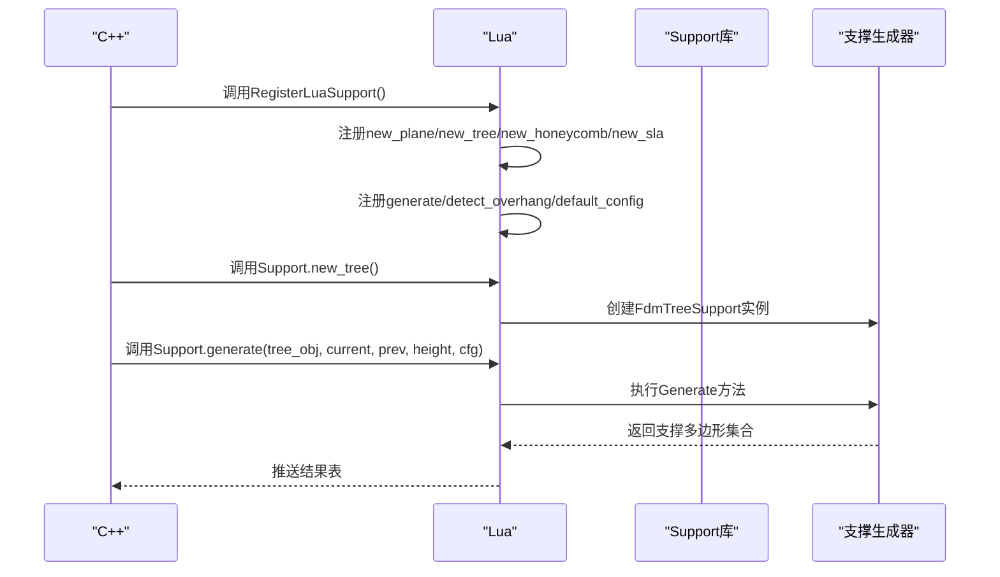
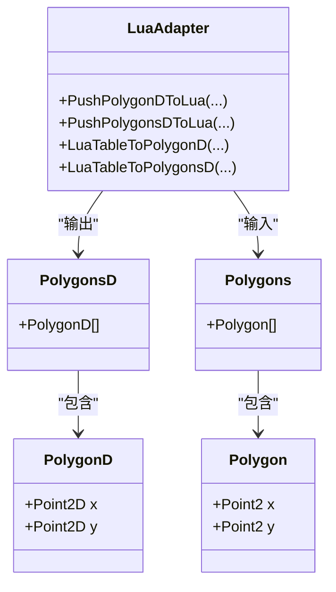
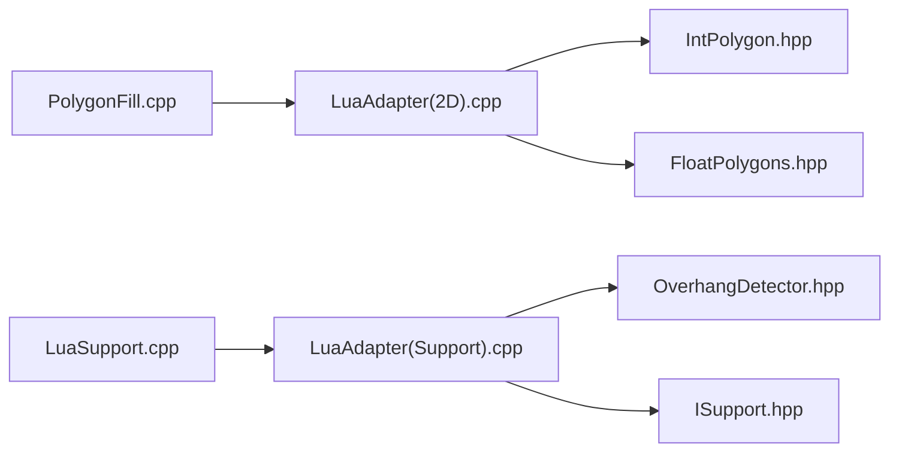

# Lua自定义填充与支撑生成

<cite>
**本文引用的文件列表**
- [2D/PolygonFill.hpp](file://2D/PolygonFill.hpp)
- [2D/PolygonFill.cpp](file://2D/PolygonFill.cpp)
- [2D/LuaAdapter.hpp](file://2D/LuaAdapter.hpp)
- [2D/LuaAdapter.cpp](file://2D/LuaAdapter.cpp)
- [support/LuaSupport.hpp](file://support/LuaSupport.hpp)
- [support/LuaSupport.cpp](file://support/LuaSupport.cpp)
- [support/LuaAdapter.hpp](file://support/LuaAdapter.hpp)
- [support/LuaAdapter.cpp](file://support/LuaAdapter.cpp)
- [samples/FDM/scripts/my_support.lua](file://samples/FDM/scripts/my_support.lua)
- [tests/PolygonFill/custom_fill.lua](file://tests/PolygonFill/custom_fill.lua)
- [tests/PolygonFill/polygon_fill_test.cpp](file://tests/PolygonFill/polygon_fill_test.cpp)
- [tests/Support/support_test.cpp](file://tests/Support/support_test.cpp)
</cite>

## 更新摘要
**变更内容**
- 新增完整的自定义支撑生成系统，支持通过Lua脚本实现复杂的支撑结构算法
- 扩展Lua环境，提供Support模块用于创建和管理不同类型的支撑生成器
- 新增`new_plane`、`new_tree`、`new_honeycomb`、`new_sla`等支撑生成器创建函数
- 新增`generate`、`detect_overhang`、`default_config`等支撑相关工具函数
- 提供完整的支撑生成示例脚本和测试用例

## 目录
1. [简介](#简介)
2. [项目结构](#项目结构)
3. [核心组件](#核心组件)
4. [架构总览](#架构总览)
5. [详细组件分析](#详细组件分析)
6. [依赖关系分析](#依赖关系分析)
7. [性能考量](#性能考量)
8. [故障排查指南](#故障排查指南)
9. [结论](#结论)
10. [附录](#附录)

## 简介
本文档系统性阐述如何通过Lua脚本扩展多边形填充算法和支撑生成算法，重点包括：
- **填充算法扩展**：LuaCustomFill与LuaCustomFillString接口如何加载外部脚本或内联字符串，调用用户自定义函数生成路径集合。
- **支撑生成扩展**：LuaSupport类如何实现自定义支撑生成算法，支持平面、树状、蜂窝等多种支撑模式。
- **C++端注册机制**：RegisterLuaPolygonFillFunctions和RegisterLuaSupport如何向Lua环境注册内置函数库。
- **数据传递机制**：C++与Lua之间多边形数据的双向转换机制，包括浮点坐标处理和精度控制。
- **错误处理流程**：统一的错误包装器和异常处理机制，便于问题定位和调试。
- **完整示例**：提供custom_fill.lua和my_support.lua示例，展示如何接收输入、调用内置函数并返回结果。
- **API文档**：详细的Lua API参考、数据类型映射表和常见错误排查指南。

## 项目结构
围绕"Lua自定义填充与支撑生成"的关键文件组织如下：
- **填充算法**：2D/PolygonFill.hpp/.cpp定义内置填充算法及LuaCustomFill接口。
- **支撑生成**：support/LuaSupport.hpp/.cpp实现自定义支撑生成，support/LuaAdapter.hpp/.cpp提供Lua绑定。
- **数据转换**：2D/LuaAdapter.hpp/.cpp提供通用的多边形数据转换功能。
- **几何基础**：2D/IntPolygon.hpp、2D/FloatPolygons.hpp定义整数/浮点多边形类型。
- **示例脚本**：samples/FDM/scripts/my_support.lua展示完整的支撑生成逻辑。
- **测试用例**：tests/PolygonFill/和tests/Support/包含填充和支撑的测试验证。

**图表来源**
- [2D/PolygonFill.cpp:1082-1240](file://2D/PolygonFill.cpp#L1082-L1240)
- [support/LuaSupport.cpp:103-162](file://support/LuaSupport.cpp#L103-L162)
- [support/LuaAdapter.cpp:238-250](file://support/LuaAdapter.cpp#L238-L250)

**章节来源**
- [2D/PolygonFill.hpp:1-130](file://2D/PolygonFill.hpp#L1-L130)
- [support/LuaSupport.hpp:1-72](file://support/LuaSupport.hpp#L1-L72)
- [support/LuaAdapter.hpp:1-29](file://support/LuaAdapter.hpp#L1-L29)

## 核心组件
- **填充算法扩展**：LuaCustomFill/LuaCustomFillString在C++中创建独立Lua状态，加载PolygonOperations与PolygonFill库，执行脚本并调用指定函数。
- **支撑生成扩展**：LuaSupport类实现ISupport接口，支持从文件或内联脚本加载自定义支撑生成逻辑。
- **注册机制**：RegisterLuaPolygonFillFunctions注册填充函数，RegisterLuaSupport注册支撑模块函数。
- **数据转换**：PushPolygonsDToLua/LuaTableToPolygonsD在C++与Lua间传递多边形数据，支持浮点坐标精确传输。
- **错误处理**：统一的异常包装机制，将Lua运行时错误转换为C++异常便于上层处理。
- **内置算法**：OffsetFill、LineFill、SimpleZigzagFill、ZigzagFill、CompositeOffsetFill、HybridFill等填充算法；Plane、Tree、Honeycomb、SLA等支撑生成器。

**章节来源**
- [2D/PolygonFill.hpp:102-127](file://2D/PolygonFill.hpp#L102-L127)
- [support/LuaSupport.hpp:32-69](file://support/LuaSupport.hpp#L32-L69)
- [support/LuaAdapter.cpp:226-236](file://support/LuaAdapter.cpp#L226-L236)

## 架构总览
下图展示了从C++调用Lua自定义填充和支撑生成到返回结果的完整流程。

**图表来源**
- [2D/PolygonFill.cpp:1082-1240](file://2D/PolygonFill.cpp#L1082-L1240)
- [support/LuaSupport.cpp:103-162](file://support/LuaSupport.cpp#L103-L162)

## 详细组件分析

### 1) 填充算法扩展：LuaCustomFill与LuaCustomFillString
- **功能要点**
  - 创建独立Lua状态，打开标准库并注册PolygonOperations与PolygonFill两个库。
  - 支持从文件或内联字符串加载脚本，获取全局函数并调用。
  - 将返回的表解析为路径集合，对Lua运行时错误进行捕获并转换为C++异常。
- **关键流程**
  - 打开库与注册：调用RegisterLuaPolygonOperations与RegisterLuaPolygonFillFunctions。
  - 脚本加载与执行：luaL_loadfile/luaL_loadstring + lua_pcall。
  - 参数传递：PushPolygonsDToLua将整数多边形转换为浮点表后传入Lua。
  - 结果解析：遍历返回表，逐条路径读取点表，再转换回整数路径。
- **错误处理**
  - l_report用于统一包装错误消息，便于在C++抛出RuntimeError。
  - 对脚本加载失败、函数不存在、调用失败、返回值非表等情况均进行异常抛出。

**图表来源**
- [2D/PolygonFill.cpp:1082-1240](file://2D/PolygonFill.cpp#L1082-L1240)

**章节来源**
- [2D/PolygonFill.cpp:1082-1240](file://2D/PolygonFill.cpp#L1082-L1240)

### 2) 支撑生成扩展：LuaSupport类
- **功能特性**
  - 实现ISupport接口，支持完全替换内置支撑生成算法。
  - 支持从文件或内联脚本加载自定义支撑生成逻辑。
  - 提供灵活的函数名配置，默认使用"generate_support"函数。
- **Lua环境设置**
  - 全局变量：current_layer（当前层多边形）、prev_layer（上一层多边形）、layer_height（层高）、config（配置表）。
  - 支持两种返回方式：直接返回多边形表或通过global变量support_polys。
  - 可选调用指定的Lua函数，函数应返回支撑多边形集合。
- **错误处理**
  - 统一的异常包装，将Lua错误转换为C++ RuntimeError。
  - 支持脚本加载错误、运行时错误、函数调用错误的详细报告。

**图表来源**
- [support/LuaSupport.hpp:32-69](file://support/LuaSupport.hpp#L32-L69)

**章节来源**
- [support/LuaSupport.hpp:13-69](file://support/LuaSupport.hpp#L13-L69)
- [support/LuaSupport.cpp:103-162](file://support/LuaSupport.cpp#L103-L162)

### 3) Support模块：内置支撑生成器与工具函数
- **支撑生成器创建**
  - `Support.new_plane()`：创建平面支撑生成器（FdmPlaneSupport）。
  - `Support.new_tree()`：创建树状支撑生成器（FdmTreeSupport）。
  - `Support.new_honeycomb()`：创建蜂窝支撑生成器（FdmHoneycombSupport）。
  - `Support.new_sla()`：创建SLA支撑生成器（SlaSacrificialSupport）。
  - `Support.new_lua(script[, funcName])`：创建Lua脚本支撑生成器。
  - `Support.new_lua_file(path, funcName)`：从文件创建Lua脚本支撑生成器。
- **支撑生成工具**
  - `Support.generate(obj, current_layer, prev_layer, layer_height, config_table)`：使用指定生成器生成支撑。
  - `Support.detect_overhang(current_layer, prev_layer, layer_height, angle_deg)`：检测悬垂区域。
  - `Support.default_config()`：获取默认支撑配置表。
- **配置参数**
  - overhang_angle_threshold：悬垂角度阈值（度）。
  - support_diameter：支撑直径（mm）。
  - support_gap：支撑间距（mm）。
  - support_density：支撑密度。
  - tree_branch_angle：树状支撑分支角度。
  - honeycomb_cell_size：蜂窝支撑单元尺寸。

**图表来源**
- [support/LuaAdapter.cpp:226-236](file://support/LuaAdapter.cpp#L226-L236)

**章节来源**
- [support/LuaAdapter.cpp:87-175](file://support/LuaAdapter.cpp#L87-L175)
- [support/LuaAdapter.hpp:9-26](file://support/LuaAdapter.hpp#L9-L26)

### 4) C++与Lua的多边形数据传递机制
- **坐标系处理**
  - 整数坐标系用于高精度几何运算，浮点坐标系用于Lua交互。
  - 通过UnIntegerization/Integerization在两种坐标系间转换，避免精度丢失。
- **数据结构映射**
  - C++多边形类型：Polygon、Polygons（整数）、PolygonD、PolygonsD（浮点）。
  - Lua表结构：数组元素为点表，每个点表含x、y字段。
- **转换函数**
  - PushPolygonsDToLua：将PolygonsD推送为Lua表（数组）。
  - LuaTableToPolygonsD：从Lua表解析为PolygonsD。
  - PushPolygonsToLua/LuaTableToPolygons：对应整数多边形版本。
- **注意事项**
  - 浮点坐标经UnIntegerization后传入Lua，确保数值精度。
  - 返回路径经Integerization回到整数坐标，保证后续几何运算可用。

**图表来源**
- [2D/LuaAdapter.cpp:149-287](file://2D/LuaAdapter.cpp#L149-L287)

**章节来源**
- [2D/LuaAdapter.cpp:149-287](file://2D/LuaAdapter.cpp#L149-L287)

### 5) 内置填充算法与组合策略
- **OffsetFill**：沿内外方向以固定间距生成一系列偏移轮廓，闭合路径后返回。
- **LineFill**：按给定角度与间距生成直线段集合。
- **SimpleZigzagFill/ZigzagFill**：在扫描线上提取线段并连接成折线路径，支持同行/相邻行连接与桥接逻辑。
- **CompositeOffsetFill**：先对基多边形进行一次填充，再向外/向内按步长偏移多次并分别填充。
- **HybridFill**：先向外偏移若干次形成轮廓路径，再对最内层有效区域进行填充，结合偏移与填充策略。
- **offsetOnly**：仅执行偏移操作，不进行内部填充。

**章节来源**
- [2D/PolygonFill.cpp:395-1080](file://2D/PolygonFill.cpp#L395-L1080)

### 6) 完整示例脚本分析

#### 填充示例：custom_fill.lua
- **功能目标**：接收多边形输入，返回两条对角折线。
- **关键点**：
  - 脚本导出函数generate_fill，参数为多边形表。
  - 返回值为路径数组，每条路径为点数组。
  - 可选择返回一个包含函数的表，以便在C++侧通过不同函数名调用。

#### 支撑示例：my_support.lua
- **功能目标**：使用内置支撑生成器实现智能支撑生成。
- **主要逻辑**：
  1. 首层检查：如果prev_layer为空则无需支撑。
  2. 悬垂检测：使用Support.detect_overhang识别需要支撑的区域。
  3. 生成器选择：根据config.support_pattern选择平面、树状或蜂窝支撑。
  4. 配置调整：使用Support.default_config获取默认配置并覆盖必要参数。
  5. 支撑生成：调用Support.generate执行具体支撑生成。
  6. 后处理：可选的多边形操作（如offsetOperation）优化支撑接触点。

**章节来源**
- [tests/PolygonFill/custom_fill.lua:1-16](file://tests/PolygonFill/custom_fill.lua#L1-L16)
- [samples/FDM/scripts/my_support.lua:1-83](file://samples/FDM/scripts/my_support.lua#L1-L83)

### 7) Lua API文档与数据类型映射

#### 全局库一览
- **PolygonOperations**：布尔运算、偏移、凸包、凹包、面积等几何操作。
- **PolygonFill**：各种填充算法函数（offsetFill、lineFill、simpleZigzagFill、zigzagFill、compositeOffsetFill、hybridFill、offsetOnly）。
- **Support**：支撑生成相关函数（new_plane、new_tree、new_honeycomb、new_sla、new_lua、new_lua_file、generate、detect_overhang、default_config）。

#### 参数与返回值约定
- **多边形表格式**：数组，元素为点表，点表含x、y数值字段。
- **角度单位**：度（degrees）。
- **线宽/间距**：毫米（mm）。
- **返回值**：多边形/折线集合（浮点坐标）。

#### 数据类型映射表
- **C++ -> Lua**
  - PolygonsD/PolygonD -> { {x=..., y=...}, ... }
  - Polygons/Polygon -> { {x=..., y=...}, ... }（内部坐标经integerization归一）
- **Lua -> C++**
  - 表数组 -> PolygonD/PolygonsD 或 Polygon/Polygons

**章节来源**
- [2D/LuaAdapter.cpp:149-287](file://2D/LuaAdapter.cpp#L149-L287)
- [support/LuaAdapter.cpp:38-85](file://support/LuaAdapter.cpp#L38-L85)

### 8) 如何实现自定义蜂窝或螺旋填充模式
- **思路设计**
  - 利用PolygonOperations的布尔运算（union/intersection/difference/xor）构造规则形状。
  - 使用offsetFill/offsetOnly生成环状或同心结构，再用lineFill/simpleZigzagFill/zigzagFill填充。
  - 对于螺旋/蜂窝，可在Lua中通过循环与数学计算生成路径点，然后以折线形式返回。
- **实现步骤**
  1. 在Lua中定义generate_fill函数，接收多边形表参数。
  2. 可选：调用PolygonOperations对输入多边形进行裁剪或合并。
  3. 可选：调用PolygonFill的offsetFill/offsetOnly生成骨架。
  4. 计算自定义路径点集，封装为路径数组并返回。
- **注意事项**
  - 保证路径点顺序与方向正确，避免自相交。
  - 控制线宽与间距，确保路径落在多边形内部。

**章节来源**
- [2D/PolygonFill.cpp:377-393](file://2D/PolygonFill.cpp#L377-L393)
- [2D/LuaAdapter.cpp:134-146](file://2D/LuaAdapter.cpp#L134-L146)

### 9) 如何实现自定义支撑生成模式
- **高级支撑算法设计**
  - 结合悬垂检测与几何分析，实现自适应支撑密度分布。
  - 支持多种支撑模式混合使用，如底部平面支撑+上部树状支撑。
  - 集成材料优化算法，减少支撑材料用量同时保证打印质量。
- **实现框架**
  1. 使用Support.detect_overhang识别悬垂区域和角度。
  2. 根据悬垂程度动态调整支撑密度和间距。
  3. 结合多层信息（current_layer和prev_layer）实现跨层支撑连接。
  4. 使用PolygonOperations进行支撑结构的几何优化。
- **性能优化**
  - 缓存重复计算的几何操作结果。
  - 使用增量计算避免全量重算。
  - 合理设置支撑密度平衡强度与材料消耗。

**章节来源**
- [samples/FDM/scripts/my_support.lua:32-83](file://samples/FDM/scripts/my_support.lua#L32-L83)
- [support/LuaAdapter.cpp:177-188](file://support/LuaAdapter.cpp#L177-L188)

## 依赖关系分析
- **组件耦合**
  - PolygonFill依赖2D/LuaAdapter进行数据转换与注册。
  - LuaSupport依赖support/LuaAdapter进行支撑模块注册。
  - 两者都依赖基础的几何类型和多边形操作函数。
- **外部依赖**
  - LuaJIT/Lua C API用于脚本执行环境。
  - Clipper2Lib用于几何运算与偏移操作。
  - OverhangDetector用于悬垂区域检测。
- **循环依赖**
  - 未发现循环依赖；模块职责清晰，接口边界明确。

**图表来源**
- [2D/PolygonFill.cpp:1-120](file://2D/PolygonFill.cpp#L1-L120)
- [support/LuaSupport.cpp:1-10](file://support/LuaSupport.cpp#L1-L10)
- [support/LuaAdapter.cpp:1-12](file://support/LuaAdapter.cpp#L1-L12)

**章节来源**
- [2D/PolygonFill.cpp:1-120](file://2D/PolygonFill.cpp#L1-L120)
- [support/LuaSupport.cpp:1-10](file://support/LuaSupport.cpp#L1-L10)
- [support/LuaAdapter.cpp:1-12](file://support/LuaAdapter.cpp#L1-L12)

## 性能考量
- **坐标转换优化**
  - 大量几何运算建议在整数坐标系完成，浮点坐标仅用于Lua交互。
  - 批量处理多边形转换，减少频繁的坐标空间切换。
- **内存管理**
  - 复杂填充（如zigzag）会产生大量短路径，注意后续挤出/路径优化阶段的处理成本。
  - 支撑生成可能产生大量支撑结构，需考虑内存占用和GC压力。
- **Lua状态复用**
  - 若频繁调用，可在上层缓存Lua状态并重用，减少创建销毁开销（当前实现每次调用新建状态）。
- **算法选择策略**
  - 对于简单需求优先使用lineFill/offsetFill；需要连续路径时选用zigzagFill/simpleZigzagFill。
  - 支撑生成根据模型复杂度选择合适的生成器，避免过度计算。

## 故障排查指南
- **常见错误与定位**
  - **脚本加载失败**：检查脚本路径/字符串是否正确，确认语法无误。
  - **函数不存在**：确认脚本中导出的函数名与调用一致（generate_fill或generate_support）。
  - **返回值非表**：确保函数返回数组，数组元素为点表。
  - **调用失败/运行时错误**：查看错误包装的错误信息，定位具体行号与原因。
  - **支撑生成异常**：检查悬垂检测参数、支撑配置值是否合理。
- **调试建议**
  - 在Lua中打印中间结果（如多边形顶点数、面积、悬垂区域大小）辅助验证。
  - 使用PolygonOperations对输入多边形进行预处理（如union/intersection），确保输入合法。
  - 逐步注释掉复杂逻辑，缩小问题范围。
  - 对于支撑生成，先使用简单的平面支撑验证基本流程。

**章节来源**
- [2D/PolygonFill.cpp:1082-1240](file://2D/PolygonFill.cpp#L1082-L1240)
- [support/LuaSupport.cpp:123-137](file://support/LuaSupport.cpp#L123-L137)

## 结论
通过LuaCustomFill/LuaCustomFillString与LuaSupport类，配合PolygonFill和Support模块，用户可以在Lua环境中灵活组合内置几何与填充算法，以及实现复杂的自定义支撑生成算法。系统提供了完整的API接口、丰富的内置函数和完善的错误处理机制，能够覆盖从简单直线填充到复杂蜂窝/螺旋填充，从基础平面支撑到智能自适应支撑等多种应用场景。建议在实际工程中充分利用数据转换与错误处理机制，确保脚本健壮性与性能表现。

## 附录

### A. Lua API一览（摘要）

#### PolygonOperations
- booleanOperation(left, right, op)
- union(left, right)
- intersection(left, right)
- difference(left, right)
- xor(left, right)
- offsetOperation(poly, delta)
- convexHullOperation(poly)
- concaveHullOperation(poly, numAdditionalPoints)
- area(poly)

#### PolygonFill
- offsetFill(poly, spacing, options?)
- lineFill(poly, spacing, angle_deg, lineThickness)
- simpleZigzagFill(poly, spacing, angle_deg, lineThickness)
- zigzagFill(poly, spacing, angle_deg, lineThickness)
- compositeOffsetFill(poly, spacing, offsetStep, outwardCount, inwardCount, mode, angle_deg, lineThickness, options?)
- hybridFill(poly, spacing, offsetStep, outwardCount, inwardCount, mode, angle_deg, lineThickness, options?)
- offsetOnly(poly, delta, inner, outer, options?)

#### Support
- new_plane() -> support_object
- new_tree() -> support_object
- new_honeycomb() -> support_object
- new_sla() -> support_object
- new_lua(script[, funcName]) -> support_object
- new_lua_file(path, funcName) -> support_object
- generate(support_obj, current_layer, prev_layer, layer_height, config_table) -> polygons
- detect_overhang(current_layer, prev_layer, layer_height, angle_deg) -> polygons
- default_config() -> config_table

**章节来源**
- [2D/PolygonFill.cpp:377-393](file://2D/PolygonFill.cpp#L377-L393)
- [support/LuaAdapter.cpp:226-236](file://support/LuaAdapter.cpp#L226-L236)

### B. 数据类型映射表（摘要）
- **C++ -> Lua**
  - PolygonsD/PolygonD -> { {x=..., y=...}, ... }
  - Polygons/Polygon -> { {x=..., y=...}, ... }
- **Lua -> C++**
  - 表数组 -> PolygonD/PolygonsD 或 Polygon/Polygons

**章节来源**
- [2D/LuaAdapter.cpp:149-287](file://2D/LuaAdapter.cpp#L149-L287)
- [support/LuaAdapter.cpp:38-85](file://support/LuaAdapter.cpp#L38-L85)

### C. 示例脚本参考
- **custom_fill.lua**：最小化填充示例，返回两条对角折线。
- **my_support.lua**：完整支撑生成示例，演示智能支撑生成逻辑。
- **polygon_fill_test.cpp**：演示LuaCustomFill/LuaCustomFillString的用法与断言。
- **support_test.cpp**：包含LuaSupport的各种测试用例。

**章节来源**
- [tests/PolygonFill/custom_fill.lua:1-16](file://tests/PolygonFill/custom_fill.lua#L1-L16)
- [samples/FDM/scripts/my_support.lua:1-83](file://samples/FDM/scripts/my_support.lua#L1-L83)
- [tests/PolygonFill/polygon_fill_test.cpp:97-131](file://tests/PolygonFill/polygon_fill_test.cpp#L97-L131)
- [tests/Support/support_test.cpp:210-293](file://tests/Support/support_test.cpp#L210-L293)