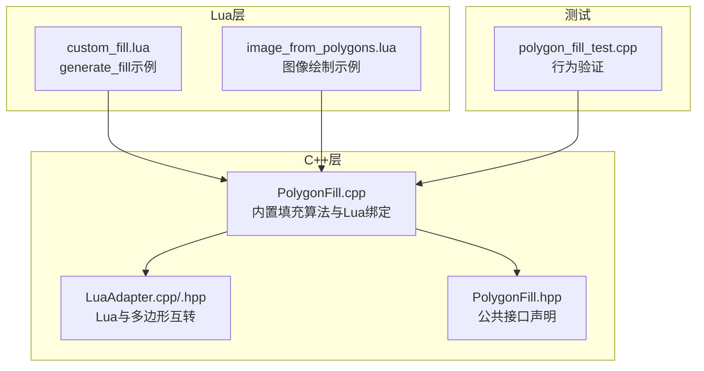
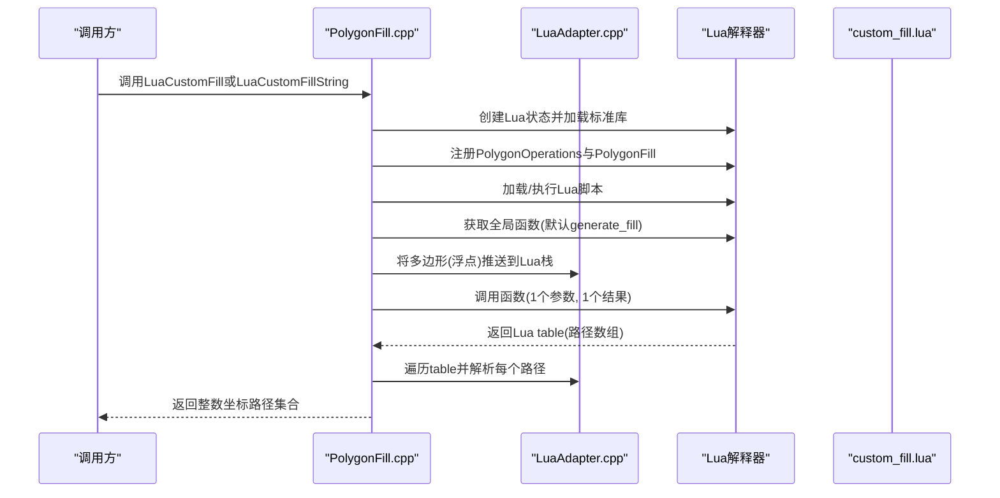
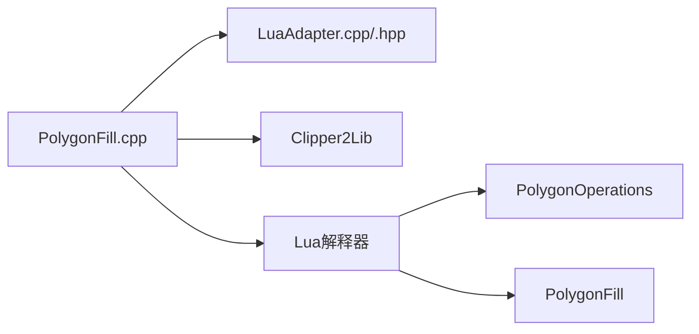

# Lua自定义填充开发指南

<cite>
**本文引用的文件列表**
- [PolygonFill.hpp](file://2D/PolygonFill.hpp)
- [PolygonFill.cpp](file://2D/PolygonFill.cpp)
- [LuaAdapter.hpp](file://2D/LuaAdapter.hpp)
- [LuaAdapter.cpp](file://2D/LuaAdapter.cpp)
- [custom_fill.lua](file://tests/PolygonFill/custom_fill.lua)
- [polygon_fill_test.cpp](file://tests/PolygonFill/polygon_fill_test.cpp)
- [image_from_polygons.lua](file://tests/PolygonFill/image_from_polygons.lua)
</cite>

## 目录
1. [简介](#简介)
2. [项目结构](#项目结构)
3. [核心组件](#核心组件)
4. [架构总览](#架构总览)
5. [详细组件分析](#详细组件分析)
6. [依赖关系分析](#依赖关系分析)
7. [性能考量](#性能考量)
8. [故障排查指南](#故障排查指南)
9. [结论](#结论)
10. [附录](#附录)

## 简介
本指南面向希望使用Lua脚本实现自定义填充逻辑的开发者。目标是帮助你在HsBaSlicer中编写custom_fill.lua，使其导出generate_fill函数（或通过functionName参数指定），接收包含多边形的table作为输入，并返回一个包含填充路径的table。文档涵盖：
- Lua与C++之间的数据类型映射
- PolygonFill命名空间下的内置函数及其Lua调用方式
- 如何通过lineThickness参数控制路径宽度
- 蜂窝（honeycomb）与螺旋（spiral）填充模式的完整Lua实现思路与示例
- 常见错误排查方法与最佳实践

## 项目结构
围绕Lua自定义填充的核心代码位于2D目录，测试样例位于tests/PolygonFill目录。关键文件包括：
- 2D/PolygonFill.hpp：声明C++侧填充算法与Lua自定义入口
- 2D/PolygonFill.cpp：实现扫描线、偏移、复合与混合填充算法，并提供Lua绑定
- 2D/LuaAdapter.hpp/.cpp：提供Lua与C++多边形数据结构的双向转换
- tests/PolygonFill/custom_fill.lua：最小可运行的自定义填充示例
- tests/PolygonFill/polygon_fill_test.cpp：验证Lua自定义填充与内置算法的行为
- tests/PolygonFill/image_from_polygons.lua：另一个Lua示例（图像绘制）

图表来源
- [PolygonFill.cpp](file://2D/PolygonFill.cpp#L1082-L1240)
- [LuaAdapter.cpp](file://2D/LuaAdapter.cpp#L149-L287)
- [PolygonFill.hpp](file://2D/PolygonFill.hpp#L1-L46)
- [custom_fill.lua](file://tests/PolygonFill/custom_fill.lua#L1-L16)
- [polygon_fill_test.cpp](file://tests/PolygonFill/polygon_fill_test.cpp#L92-L116)

章节来源
- [PolygonFill.hpp](file://2D/PolygonFill.hpp#L1-L46)
- [PolygonFill.cpp](file://2D/PolygonFill.cpp#L1082-L1240)
- [LuaAdapter.cpp](file://2D/LuaAdapter.cpp#L149-L287)
- [custom_fill.lua](file://tests/PolygonFill/custom_fill.lua#L1-L16)
- [polygon_fill_test.cpp](file://tests/PolygonFill/polygon_fill_test.cpp#L92-L116)

## 核心组件
- Lua自定义填充入口
  - C++提供LuaCustomFill与LuaCustomFillString两个入口，分别从文件或字符串加载Lua脚本，调用指定函数名（默认generate_fill），并将输入多边形以浮点坐标table传入，期望返回包含路径的table。
- 内置填充算法（PolygonFill命名空间）
  - offsetFill、lineFill、simpleZigzagFill、zigzagFill、compositeOffsetFill、hybridFill、offsetOnly等，均在C++中实现，同时在Lua侧注册为全局模块PolygonFill，供Lua脚本直接调用。
- 数据类型映射
  - 多边形：Lua table数组，元素为包含x、y字段的点对象；C++侧内部以整数坐标存储，Lua与C++之间通过适配器进行浮点/整数转换。

章节来源
- [PolygonFill.hpp](file://2D/PolygonFill.hpp#L12-L46)
- [PolygonFill.cpp](file://2D/PolygonFill.cpp#L1082-L1240)
- [LuaAdapter.cpp](file://2D/LuaAdapter.cpp#L149-L287)

## 架构总览
Lua自定义填充的调用流程如下：

图表来源
- [PolygonFill.cpp](file://2D/PolygonFill.cpp#L1082-L1240)
- [LuaAdapter.cpp](file://2D/LuaAdapter.cpp#L149-L287)

## 详细组件分析

### Lua自定义填充入口与数据类型映射
- 入口函数
  - LuaCustomFill与LuaCustomFillString负责创建Lua状态、注册PolygonOperations与PolygonFill、加载脚本、调用指定函数并解析返回值。
- 输入输出约定
  - 输入：单个包含多边形的table（外轮廓+多个洞），每个点为{x=..., y=...}，浮点坐标。
  - 输出：数组table，每个元素为一条路径（多边形或折线），路径由点数组组成，点同样为{x=..., y=...}。
- 关键约束
  - 必须导出函数（默认generate_fill），否则抛出“函数未找到”错误。
  - 函数返回值必须为table，否则抛出“未返回table”错误。
  - 返回的每条路径会被转换为整数坐标并返回给调用方。

章节来源
- [PolygonFill.cpp](file://2D/PolygonFill.cpp#L1082-L1240)
- [LuaAdapter.cpp](file://2D/LuaAdapter.cpp#L149-L287)

### PolygonFill命名空间内置函数（Lua侧调用）
以下函数在C++中实现并通过RegisterLuaPolygonFillFunctions注册到Lua全局模块PolygonFill中，Lua侧可直接调用。参数与返回值遵循C++签名，但以Lua table形式传递与接收。

- offsetFill(poly, spacing[, options])
  - 功能：对多边形进行偏移，生成一系列同心环路径（闭合多边形）。
  - 参数：
    - poly：多边形table（外轮廓+洞）
    - spacing：偏移间距（正数）
    - options.join_type：可选，字符串，支持Square/Bevel/Round/Miter，默认Square
  - 返回：路径数组（每条路径为闭合多边形）
  - 参考实现位置：[offsetFill](file://2D/PolygonFill.cpp#L167-L193)

- lineFill(poly, spacing, angle_deg, lineThickness)
  - 功能：沿指定角度生成平行直线段（每条路径仅含两个端点）。
  - 参数：
    - poly：多边形table
    - spacing：扫描线间距
    - angle_deg：角度（度）
    - lineThickness：线宽（用于扫描线裁剪）
  - 返回：路径数组（每条路径为2点线段）
  - 参考实现位置：[lineFill](file://2D/PolygonFill.cpp#L195-L209)

- simpleZigzagFill(poly, spacing, angle_deg, lineThickness)
  - 功能：生成简单锯齿折线路径（连接相邻扫描线上的线段中心）。
  - 参数：同上
  - 返回：路径数组（折线）
  - 参考实现位置：[simpleZigzagFill](file://2D/PolygonFill.cpp#L212-L243)

- zigzagFill(poly, spacing, angle_deg, lineThickness)
  - 功能：生成更复杂的锯齿路径，按连通性构建折线，必要时通过桥接路径跨越空隙。
  - 参数：同上
  - 返回：路径数组（折线）
  - 参考实现位置：[zigzagFill](file://2D/PolygonFill.cpp#L229-L243)

- compositeOffsetFill(poly, spacing, offsetStep, outwardCount, inwardCount, mode, angle_deg, lineThickness[, options])
  - 功能：先按基础多边形填充，再向外/向内偏移若干层，逐层填充。
  - 参数：
    - mode：Line/SimpleZigzag/Zigzag
    - options.join_type：可选，字符串
  - 返回：路径数组（多层填充）
  - 参考实现位置：[compositeOffsetFill](file://2D/PolygonFill.cpp#L972-L1021)

- hybridFill(poly, spacing, offsetStep, outwardCount, inwardCount, mode, angle_deg, lineThickness[, options])
  - 功能：先向外偏移若干层，然后对最内层进行填充；内部偏移过程会跳过面积过小的区域。
  - 参数：同上
  - 返回：路径数组（多层填充）
  - 参考实现位置：[hybridFill](file://2D/PolygonFill.cpp#L1023-L1079)

- offsetOnly(poly, delta, inner, outer[, options])
  - 功能：仅执行偏移，返回基础多边形、向外偏移结果、向内偏移结果三部分（用于进一步处理）。
  - 参数：同上
  - 返回：三组路径数组（基础/外/内）
  - 参考实现位置：[offsetOnly](file://2D/PolygonFill.cpp#L332-L375)

章节来源
- [PolygonFill.cpp](file://2D/PolygonFill.cpp#L167-L375)
- [PolygonFill.cpp](file://2D/PolygonFill.cpp#L972-L1079)
- [PolygonFill.cpp](file://2D/PolygonFill.cpp#L1082-L1240)

### Lua与C++数据类型映射
- 多边形（PolygonD/PolygonsD）
  - Lua侧：数组table，元素为点table，点table包含x、y数字字段
  - C++侧：内部以整数坐标存储，Lua与C++之间通过适配器进行浮点/整数转换
- 路径（Polygon/Polygons）
  - Lua侧：数组table，元素为点table
  - C++侧：整数坐标点序列，最终统一转换回浮点坐标返回给Lua
- 常量与枚举
  - JoinType：Square/Bevel/Round/Miter（字符串）
  - FillMode：Line/SimpleZigzag/Zigzag（字符串）

章节来源
- [LuaAdapter.cpp](file://2D/LuaAdapter.cpp#L149-L287)
- [PolygonFill.hpp](file://2D/PolygonFill.hpp#L12-L46)

### 自定义填充示例：generate_fill
- 最小示例
  - 示例脚本导出generate_fill函数，返回两条对角线路径
  - 参考路径：[custom_fill.lua](file://tests/PolygonFill/custom_fill.lua#L1-L16)
- 行为验证
  - 测试用例展示了如何加载该脚本并调用LuaCustomFill，断言返回至少包含2点线段
  - 参考路径：[polygon_fill_test.cpp](file://tests/PolygonFill/polygon_fill_test.cpp#L92-L116)

章节来源
- [custom_fill.lua](file://tests/PolygonFill/custom_fill.lua#L1-L16)
- [polygon_fill_test.cpp](file://tests/PolygonFill/polygon_fill_test.cpp#L92-L116)

### 蜂窝（honeycomb）填充模式的Lua实现思路
蜂窝填充通常基于规则六边形网格，结合多边形裁剪生成填充路径。实现步骤建议：
- 计算六边形网格参数（边长、间距、旋转角度）
- 生成规则六边形网格
- 对每个六边形执行与多边形的布尔运算（交集），得到落在多边形内的部分
- 将每个被裁剪后的六边形路径作为一条填充路径返回
- 可选：对路径进行去重、合并或简化

提示
- 可使用PolygonOperations模块中的布尔运算函数（如union、intersection、difference、xor）辅助生成与裁剪
- 可参考offsetFill、lineFill等内置算法的扫描线思想，将其扩展为六边形网格

章节来源
- [LuaAdapter.cpp](file://2D/LuaAdapter.cpp#L149-L287)
- [PolygonFill.cpp](file://2D/PolygonFill.cpp#L167-L209)

### 螺旋（spiral）填充模式的Lua实现思路
螺旋填充通过逐步偏移与旋转生成连续路径。实现步骤建议：
- 以多边形中心为起点，按固定步长向外偏移
- 在每一层偏移后，按指定角度旋转生成扫描线或路径
- 使用clipper裁剪每条路径与当前层多边形的交集
- 连接相邻层路径形成连续螺旋
- 可选：根据lineThickness调整路径宽度与采样密度

提示
- 可复用lineFill的扫描线思想，结合offsetFill的偏移能力
- 可使用simpleZigzagFill或zigzagFill的路径连接策略，避免跨层断开

章节来源
- [PolygonFill.cpp](file://2D/PolygonFill.cpp#L167-L209)
- [PolygonFill.cpp](file://2D/PolygonFill.cpp#L441-L609)

### 通过lineThickness参数控制路径宽度
- lineThickness在多种内置算法中用于控制扫描线宽度与路径连接策略：
  - lineFill：用于扫描线矩形裁剪，影响有效填充区域
  - simpleZigzagFill：用于线段端点微调与裁剪
  - zigzagFill：用于桥接路径采样与连接
- 在自定义脚本中，你可以：
  - 使用lineThickness作为采样步长或路径宽度参数
  - 通过偏移与裁剪策略模拟不同线宽效果
  - 将其作为布尔运算的缓冲参数，生成带厚度的路径

章节来源
- [PolygonFill.cpp](file://2D/PolygonFill.cpp#L25-L113)
- [PolygonFill.cpp](file://2D/PolygonFill.cpp#L441-L609)
- [PolygonFill.cpp](file://2D/PolygonFill.cpp#L611-L970)

## 依赖关系分析
- 组件耦合
  - PolygonFill.cpp依赖LuaAdapter进行数据转换
  - PolygonFill.cpp依赖Clipper2Lib进行几何运算
  - Lua侧通过PolygonOperations与PolygonFill模块访问几何与填充功能
- 外部依赖
  - Lua 5.4+（标准库已自动加载）
  - Clipper2Lib（几何运算库）

图表来源
- [PolygonFill.cpp](file://2D/PolygonFill.cpp#L1082-L1240)
- [LuaAdapter.cpp](file://2D/LuaAdapter.cpp#L149-L287)

章节来源
- [PolygonFill.cpp](file://2D/PolygonFill.cpp#L1082-L1240)
- [LuaAdapter.cpp](file://2D/LuaAdapter.cpp#L149-L287)

## 性能考量
- 扫描线与路径连接
  - 扫描线数量与多边形复杂度成正比，建议合理设置spacing与angle_deg
  - zigzagFill在连接跨行路径时可能产生额外计算，可通过减少行数或优化桥接策略提升性能
- 偏移层数
  - compositeOffsetFill与hybridFill的偏移层数越多，计算量越大，建议根据lineThickness与精度需求选择合适的outwardCount/inwardCount
- 精度与整数化
  - Lua与C++之间的浮点/整数转换存在舍入误差，建议在自定义脚本中避免过于精细的小数运算

## 故障排查指南
- 常见错误
  - “函数未找到”：确认脚本导出了正确的函数名（默认generate_fill），或在调用时通过functionName参数指定
    - 参考路径：[LuaCustomFill/LuaCustomFillString函数检查](file://2D/PolygonFill.cpp#L1106-L1110)
  - “未返回table”：确保函数返回的是数组table，且每个元素为路径table
    - 参考路径：[返回值校验](file://2D/PolygonFill.cpp#L1123-L1126)
  - “调用失败”：检查脚本语法与依赖模块是否正确加载
    - 参考路径：[脚本加载与调用](file://2D/PolygonFill.cpp#L1100-L1120)
- 调试建议
  - 在Lua脚本中打印中间结果，验证poly参数结构与返回值格式
  - 使用PolygonOperations中的布尔运算与面积计算辅助定位问题
  - 参考测试用例的最小示例快速定位问题

章节来源
- [PolygonFill.cpp](file://2D/PolygonFill.cpp#L1100-L1126)
- [polygon_fill_test.cpp](file://tests/PolygonFill/polygon_fill_test.cpp#L92-L116)

## 结论
通过本指南，你可以在HsBaSlicer中使用Lua实现自定义填充逻辑。建议优先利用PolygonFill内置算法（offsetFill、lineFill、zigzagFill等）与PolygonOperations提供的几何运算能力，结合自定义脚本灵活组合，实现蜂窝、螺旋等复杂填充模式。同时注意数据类型映射、lineThickness参数的使用与常见错误排查，以获得稳定高效的填充结果。

## 附录

### Lua调用内置函数语法速查
- PolygonFill.offsetFill(poly, spacing[, options])
- PolygonFill.lineFill(poly, spacing, angle_deg, lineThickness)
- PolygonFill.simpleZigzagFill(poly, spacing, angle_deg, lineThickness)
- PolygonFill.zigzagFill(poly, spacing, angle_deg, lineThickness)
- PolygonFill.compositeOffsetFill(poly, spacing, offsetStep, outwardCount, inwardCount, mode, angle_deg, lineThickness[, options])
- PolygonFill.hybridFill(poly, spacing, offsetStep, outwardCount, inwardCount, mode, angle_deg, lineThickness[, options])
- PolygonFill.offsetOnly(poly, delta, inner, outer[, options])

章节来源
- [PolygonFill.cpp](file://2D/PolygonFill.cpp#L167-L375)
- [PolygonFill.cpp](file://2D/PolygonFill.cpp#L972-L1079)