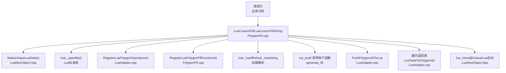
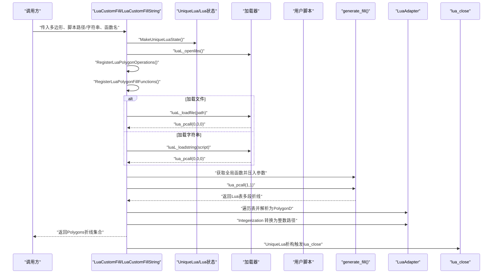
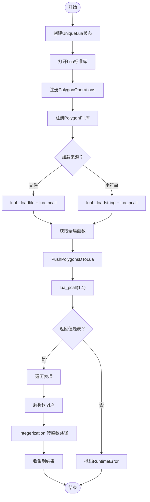
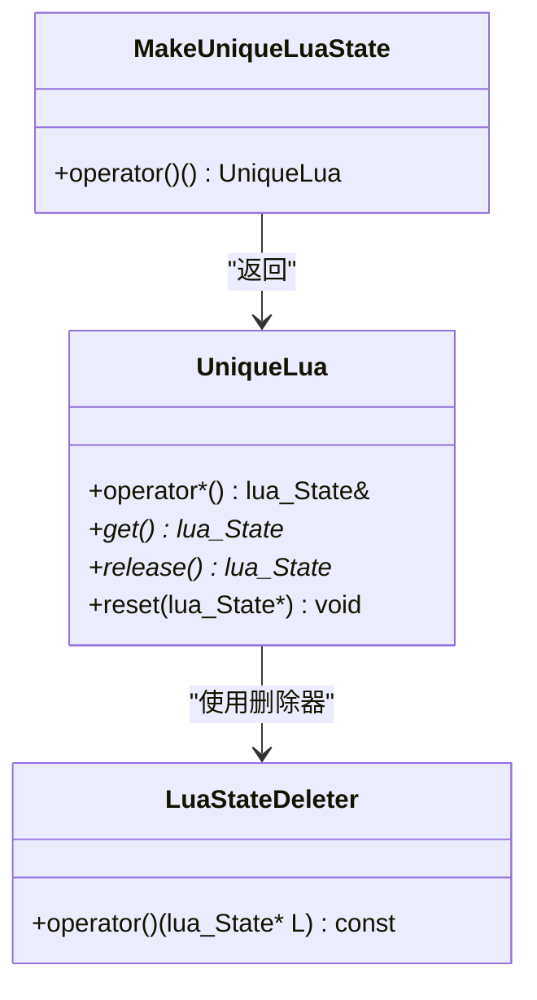
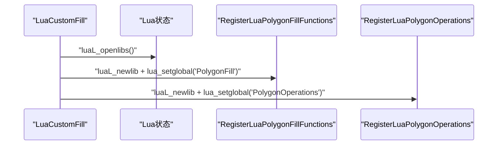
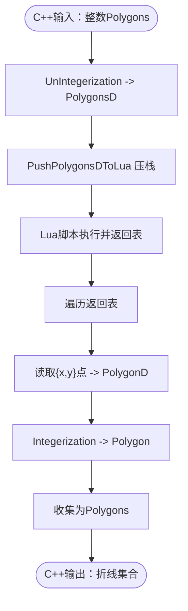
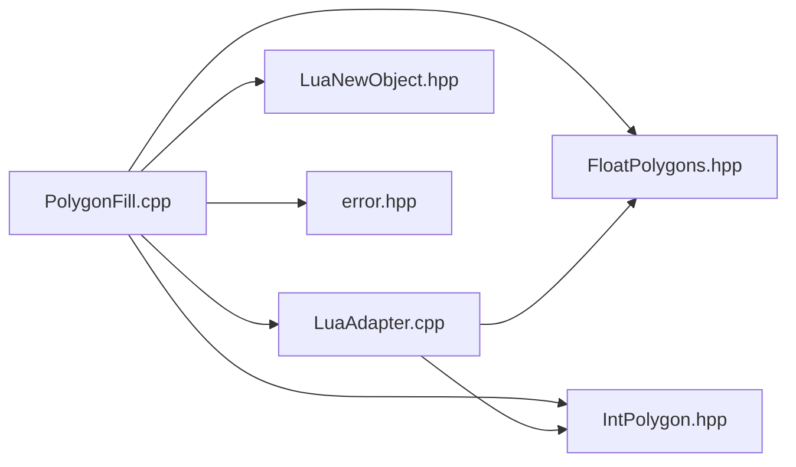

# Lua自定义填充调用机制

<cite>
**本文引用的文件列表**
- [PolygonFill.hpp](file://2D/PolygonFill.hpp)
- [PolygonFill.cpp](file://2D/PolygonFill.cpp)
- [LuaAdapter.hpp](file://2D/LuaAdapter.hpp)
- [LuaAdapter.cpp](file://2D/LuaAdapter.cpp)
- [LuaNewObject.hpp](file://utils/LuaNewObject.hpp)
- [IntPolygon.hpp](file://2D/IntPolygon.hpp)
- [FloatPolygons.hpp](file://2D/FloatPolygons.hpp)
- [error.hpp](file://base/error.hpp)
- [custom_fill.lua](file://tests/PolygonFill/custom_fill.lua)
- [polygon_fill_test.cpp](file://tests/PolygonFill/polygon_fill_test.cpp)
</cite>

## 目录
1. [简介](#简介)
2. [项目结构](#项目结构)
3. [核心组件](#核心组件)
4. [架构总览](#架构总览)
5. [详细组件分析](#详细组件分析)
6. [依赖关系分析](#依赖关系分析)
7. [性能考量](#性能考量)
8. [故障排查指南](#故障排查指南)
9. [结论](#结论)
10. [附录](#附录)

## 简介
本文围绕“Lua自定义填充调用机制”展开，系统性说明：
- 如何在C++中创建Lua虚拟机环境、加载并执行外部Lua脚本；
- MakeUniqueLuaState()的安全资源管理机制；
- luaL_loadfile/luaL_loadstring与lua_pcall的异常处理流程；
- RegisterLuaPolygonFillFunctions如何通过luaL_newlib注册PolygonFill库函数（offsetFill、lineFill等）到Lua全局表；
- C++通过PushPolygonsDToLua将IntPolygon转换为浮点型PolygonD并压入Lua栈的数据传递过程；
- LuaTableToPolygonsD如何解析返回的多边形表结构；
- 完整的调用时序图、Lua状态生命周期管理、错误传播机制（l_report）及资源自动释放策略。

## 项目结构
与Lua自定义填充直接相关的模块位于2D目录与utils目录：
- 2D/PolygonFill：提供LuaCustomFill/LuaCustomFillString入口，封装Lua状态生命周期与调用流程，并注册PolygonFill库函数；
- 2D/LuaAdapter：提供多边形与Lua表之间的双向转换工具，以及PolygonOperations库注册；
- 2D/FloatPolygons与2D/IntPolygon：定义整数/浮点多边形类型与整数化/反整数化工具；
- utils/LuaNewObject：提供Lua状态的RAII包装与自动关闭；
- tests/PolygonFill/custom_fill.lua：示例脚本，演示generate_fill函数返回多段折线；
- base/error：统一的运行时错误类型，用于抛出异常。

图表来源
- [PolygonFill.cpp](file://2D/PolygonFill.cpp#L1082-L1240)
- [LuaAdapter.cpp](file://2D/LuaAdapter.cpp#L148-L287)
- [LuaNewObject.hpp](file://utils/LuaNewObject.hpp#L47-L62)

章节来源
- [PolygonFill.cpp](file://2D/PolygonFill.cpp#L1082-L1240)
- [LuaAdapter.cpp](file://2D/LuaAdapter.cpp#L148-L287)
- [LuaNewObject.hpp](file://utils/LuaNewObject.hpp#L47-L62)

## 核心组件
- LuaCustomFill/LuaCustomFillString：对外暴露的两个入口，负责创建Lua状态、加载脚本、调用用户函数、解析返回值并转换回整数路径集合。
- MakeUniqueLuaState/UniqueLua：基于RAII的Lua状态管理器，确保异常或提前退出时自动关闭Lua状态，避免泄漏。
- RegisterLuaPolygonOperations/RegisterLuaPolygonFillFunctions：分别注册PolygonOperations与PolygonFill两个库，供脚本侧调用原生几何与填充算法。
- PushPolygonsDToLua/LuaTableToPolygonsD：在C++与Lua之间传递浮点多边形数据，支持数组+字段的表结构。
- 整数化/反整数化：通过UnIntegerization/Integerization在整数坐标与浮点坐标间转换，保证精度与兼容性。

章节来源
- [PolygonFill.hpp](file://2D/PolygonFill.hpp#L38-L42)
- [PolygonFill.cpp](file://2D/PolygonFill.cpp#L1082-L1240)
- [LuaAdapter.hpp](file://2D/LuaAdapter.hpp#L12-L21)
- [LuaAdapter.cpp](file://2D/LuaAdapter.cpp#L148-L287)
- [FloatPolygons.hpp](file://2D/FloatPolygons.hpp#L51-L56)
- [IntPolygon.hpp](file://2D/IntPolygon.hpp#L10-L15)
- [LuaNewObject.hpp](file://utils/LuaNewObject.hpp#L47-L62)

## 架构总览
下图展示从调用方到Lua脚本执行再到结果解析的整体流程，包括状态生命周期与错误传播。

图表来源
- [PolygonFill.cpp](file://2D/PolygonFill.cpp#L1082-L1240)
- [LuaAdapter.cpp](file://2D/LuaAdapter.cpp#L148-L287)
- [LuaNewObject.hpp](file://utils/LuaNewObject.hpp#L47-L62)

## 详细组件分析

### 组件A：LuaCustomFill 与 LuaCustomFillString
- 功能职责
  - 创建Lua状态并打开标准库；
  - 注册PolygonOperations与PolygonFill库；
  - 加载外部脚本（文件或字符串），执行并调用指定函数；
  - 将输入的整数多边形转换为浮点多边形后传入Lua；
  - 解析Lua返回的表结构，收集每条折线并转换回整数路径；
  - 异常统一抛出RuntimeError，便于上层捕获与处理。
- 关键流程要点
  - 使用UniqueLua确保状态生命周期可控；
  - 使用luaL_loadfile/luaL_loadstring与lua_pcall组合进行加载与执行；
  - 通过PushPolygonsDToLua与LuaTableToPolygonsD完成数据传递；
  - 返回值为折线集合，不进行合并/并集等操作，保持脚本灵活性。

图表来源
- [PolygonFill.cpp](file://2D/PolygonFill.cpp#L1082-L1240)
- [LuaAdapter.cpp](file://2D/LuaAdapter.cpp#L148-L287)

章节来源
- [PolygonFill.hpp](file://2D/PolygonFill.hpp#L38-L42)
- [PolygonFill.cpp](file://2D/PolygonFill.cpp#L1082-L1240)

### 组件B：MakeUniqueLuaState 的安全资源管理
- 设计目标
  - 通过std::unique_ptr配合自定义删除器，确保Lua状态在作用域结束时自动关闭；
  - 避免因异常或早退导致的状态泄漏。
- 关键实现
  - LuaStateDeleter在析构时调用lua_close；
  - MakeUniqueLuaState返回UniqueLua对象，内部持有lua_State指针；
  - 外部仅通过UniqueLua访问Lua状态，无需手动管理生命周期。

图表来源
- [LuaNewObject.hpp](file://utils/LuaNewObject.hpp#L47-L62)

章节来源
- [LuaNewObject.hpp](file://utils/LuaNewObject.hpp#L47-L62)

### 组件C：RegisterLuaPolygonFillFunctions 与 PolygonOperations
- PolygonFill库注册
  - 通过luaL_newlib创建库表，再设置为全局“PolygonFill”，脚本侧可直接调用offsetFill、lineFill等；
  - 每个注册函数均以l_xxx命名，接收Lua栈参数，调用对应C++算法，再将结果压回Lua栈。
- PolygonOperations库注册
  - 通过luaL_newlib创建库表，设置为全局“PolygonOperations”，提供布尔运算、偏移、凸包等常用几何操作；
  - 便于在自定义脚本中复用原生高性能算法。

图表来源
- [PolygonFill.cpp](file://2D/PolygonFill.cpp#L388-L392)
- [LuaAdapter.cpp](file://2D/LuaAdapter.cpp#L282-L287)

章节来源
- [PolygonFill.cpp](file://2D/PolygonFill.cpp#L377-L392)
- [LuaAdapter.cpp](file://2D/LuaAdapter.cpp#L134-L145)
- [LuaAdapter.cpp](file://2D/LuaAdapter.cpp#L282-L287)

### 组件D：数据传递与转换（PushPolygonsDToLua 与 LuaTableToPolygonsD）
- 输入转换（C++ -> Lua）
  - 将整数多边形集合转换为浮点多边形集合；
  - 逐点构造Lua表，每个点为包含"x"和"y"字段的子表，外层为数组索引；
  - 通过PushPolygonsDToLua/PushPolygonDToLua完成压栈。
- 输出解析（Lua -> C++）
  - 遍历返回表，逐项读取子表；
  - 从子表读取"x"、"y"字段，构建PolygonD；
  - 通过Integerization转换为整数路径集合，作为最终结果返回。

图表来源
- [PolygonFill.cpp](file://2D/PolygonFill.cpp#L1082-L1240)
- [LuaAdapter.cpp](file://2D/LuaAdapter.cpp#L148-L287)
- [FloatPolygons.hpp](file://2D/FloatPolygons.hpp#L51-L56)
- [IntPolygon.hpp](file://2D/IntPolygon.hpp#L10-L15)

章节来源
- [LuaAdapter.cpp](file://2D/LuaAdapter.cpp#L148-L287)
- [FloatPolygons.hpp](file://2D/FloatPolygons.hpp#L51-L56)
- [IntPolygon.hpp](file://2D/IntPolygon.hpp#L10-L15)

### 组件E：异常处理与错误传播（l_report 与 RuntimeError）
- 错误传播机制
  - 在PolygonFill库内部，l_report用于格式化错误消息并调用luaL_error，将错误传播给Lua；
  - LuaCustomFill/LuaCustomFillString在加载、执行、调用、解析各阶段捕获Lua错误，统一转换为RuntimeError抛出；
  - 由于使用UniqueLua，异常发生时Lua状态仍会被正确关闭。
- 典型错误场景
  - 无法创建Lua状态；
  - 加载脚本失败；
  - 函数不存在或返回值非表；
  - 调用用户函数时发生错误。

章节来源
- [PolygonFill.cpp](file://2D/PolygonFill.cpp#L159-L165)
- [PolygonFill.cpp](file://2D/PolygonFill.cpp#L1082-L1240)
- [error.hpp](file://base/error.hpp#L1-L139)

## 依赖关系分析
- 外部依赖
  - Lua C API：状态创建、库注册、栈操作、错误处理；
  - Clipper2：几何运算（偏移、布尔运算、点在多边形内判断等）；
  - Boost.Test：测试用例验证行为。
- 内部依赖
  - PolygonFill依赖LuaAdapter进行数据转换；
  - PolygonFill依赖LuaNewObject进行状态管理；
  - FloatPolygons/IntPolygon提供坐标类型与整数化/反整数化工具。

图表来源
- [PolygonFill.cpp](file://2D/PolygonFill.cpp#L1-L1240)
- [LuaAdapter.cpp](file://2D/LuaAdapter.cpp#L1-L287)
- [LuaNewObject.hpp](file://utils/LuaNewObject.hpp#L1-L62)
- [FloatPolygons.hpp](file://2D/FloatPolygons.hpp#L1-L72)
- [IntPolygon.hpp](file://2D/IntPolygon.hpp#L1-L75)
- [error.hpp](file://base/error.hpp#L1-L139)

章节来源
- [PolygonFill.cpp](file://2D/PolygonFill.cpp#L1-L1240)
- [LuaAdapter.cpp](file://2D/LuaAdapter.cpp#L1-L287)
- [LuaNewObject.hpp](file://utils/LuaNewObject.hpp#L1-L62)
- [FloatPolygons.hpp](file://2D/FloatPolygons.hpp#L1-L72)
- [IntPolygon.hpp](file://2D/IntPolygon.hpp#L1-L75)
- [error.hpp](file://base/error.hpp#L1-L139)

## 性能考量
- 数据转换成本
  - 整数与浮点之间的转换（UnIntegerization/Integerization）涉及多次分配与拷贝，建议在批量处理时减少重复转换；
  - Lua表遍历与字段读取存在开销，尽量避免深层嵌套与冗余字段。
- Lua状态生命周期
  - 使用UniqueLua避免频繁创建/销毁状态带来的额外成本；
  - 若需多次调用同一脚本，可考虑复用状态并在业务层控制调用频率。
- 算法复杂度
  - 填充算法本身与扫描行数量、多边形顶点数相关，应根据实际需求选择合适的间距与角度。

## 故障排查指南
- 常见问题与定位
  - “无法创建Lua状态”：检查MakeUniqueLuaState是否成功；确认内存与Lua库初始化；
  - “加载脚本失败”：检查文件路径或字符串内容，关注lua_tostring返回的错误信息；
  - “函数不存在”：确认脚本中导出的函数名与调用一致；
  - “返回值不是表”：检查脚本返回结构，确保为数组形式的折线集合；
  - “调用用户函数报错”：查看l_report生成的错误信息，定位脚本内部逻辑问题。
- 建议排查步骤
  - 打印关键阶段的Lua错误信息；
  - 使用最小化脚本验证流程；
  - 对比测试用例中的custom_fill.lua与业务脚本差异。

章节来源
- [PolygonFill.cpp](file://2D/PolygonFill.cpp#L1082-L1240)
- [polygon_fill_test.cpp](file://tests/PolygonFill/polygon_fill_test.cpp#L92-L116)
- [custom_fill.lua](file://tests/PolygonFill/custom_fill.lua#L1-L16)

## 结论
该机制通过RAII封装Lua状态、标准化数据转换与严格的异常处理，实现了“在C++中安全地加载并执行外部Lua脚本”的完整闭环。开发者可通过Lua脚本灵活定义填充策略，同时借助PolygonOperations与PolygonFill库复用高性能几何算法。整体设计兼顾易用性与安全性，适合在复杂切片/填充场景中扩展自定义逻辑。

## 附录
- 示例脚本参考：tests/PolygonFill/custom_fill.lua 展示了generate_fill函数的基本写法与返回结构；
- 测试用例参考：polygon_fill_test.cpp 展示了LuaCustomFill与LuaCustomFillString的典型调用方式。

章节来源
- [custom_fill.lua](file://tests/PolygonFill/custom_fill.lua#L1-L16)
- [polygon_fill_test.cpp](file://tests/PolygonFill/polygon_fill_test.cpp#L92-L116)