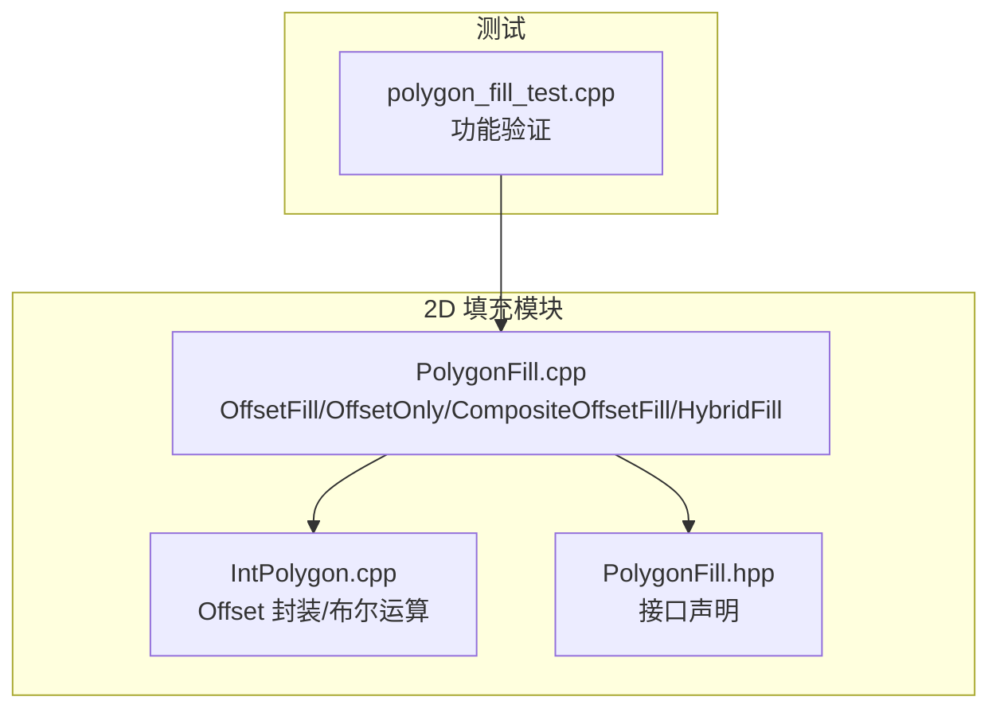
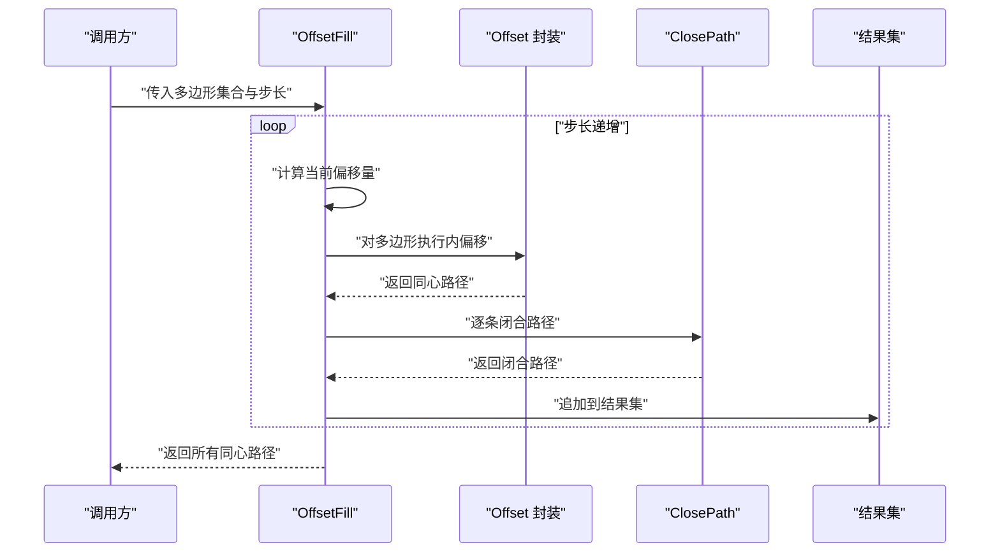
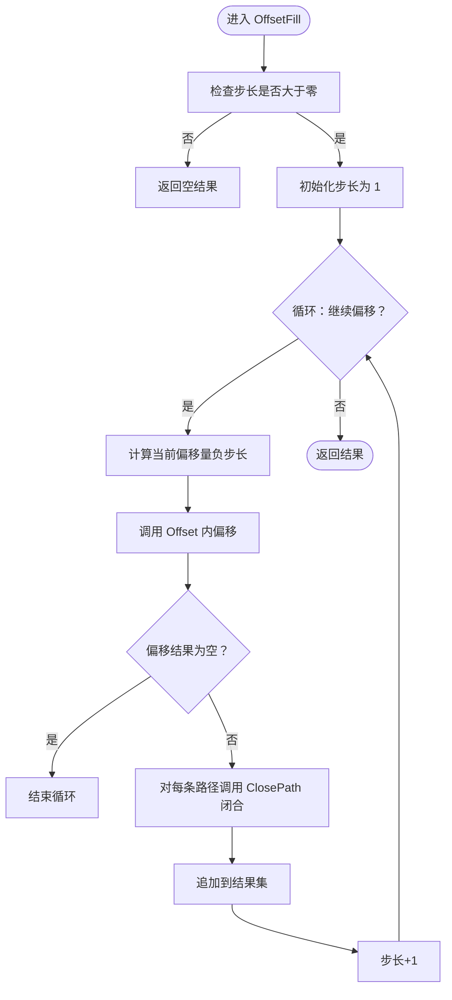
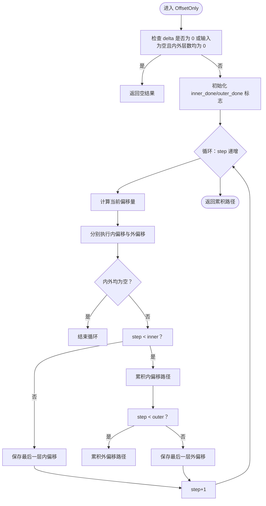
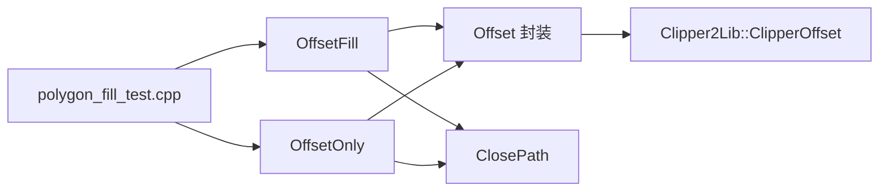
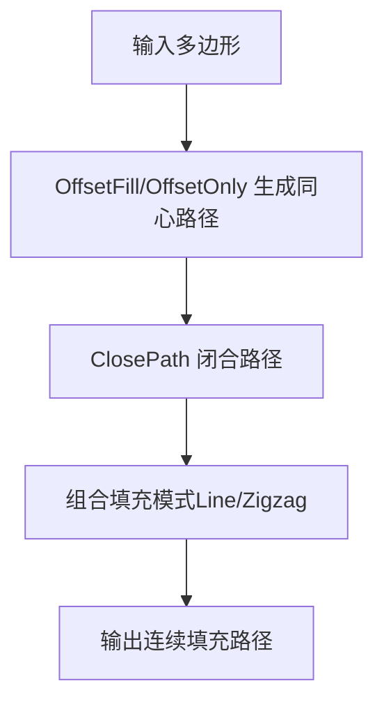

# 偏移填充

<cite>
**本文引用的文件**
- [PolygonFill.cpp](file://2D/PolygonFill.cpp)
- [IntPolygon.cpp](file://2D/IntPolygon.cpp)
- [PolygonFill.hpp](file://2D/PolygonFill.hpp)
- [polygon_fill_test.cpp](file://tests/PolygonFill/polygon_fill_test.cpp)
</cite>

## 目录
1. [简介](#简介)
2. [项目结构](#项目结构)
3. [核心组件](#核心组件)
4. [架构总览](#架构总览)
5. [详细组件分析](#详细组件分析)
6. [依赖关系分析](#依赖关系分析)
7. [性能考量](#性能考量)
8. [故障排查指南](#故障排查指南)
9. [结论](#结论)
10. [附录](#附录)

## 简介
本篇文档围绕 OffsetFill 算法进行深入解析，阐述其如何通过不断向内偏移原始轮廓生成同心路径，从而实现外轮廓或内腔的螺旋填充。算法基于 Clipper2Lib 的多边形偏移能力，结合 ClosePath 辅助函数确保路径闭合，形成连续且结构完整的填充路径集合。同时，本文系统说明 join_type 参数（Square、Round、Bevel、Miter）对拐角处理的影响，结合 OffsetOnly 函数分析内外偏移层数的控制逻辑，并给出偏移步长选择建议、性能考量以及与其他填充模式的组合使用方法。最后，提供可视化示例思路与小半径内角自交问题的应对策略。

## 项目结构
OffsetFill 及相关功能位于 2D 填充模块中，核心实现集中在 PolygonFill.cpp；多边形偏移封装位于 IntPolygon.cpp；对外接口声明位于 PolygonFill.hpp；测试用例位于 tests/PolygonFill/polygon_fill_test.cpp。

图表来源
- [PolygonFill.cpp](file://2D/PolygonFill.cpp#L1-L1243)
- [IntPolygon.cpp](file://2D/IntPolygon.cpp#L1-L190)
- [PolygonFill.hpp](file://2D/PolygonFill.hpp#L1-L46)
- [polygon_fill_test.cpp](file://tests/PolygonFill/polygon_fill_test.cpp#L77-L116)

章节来源
- [PolygonFill.cpp](file://2D/PolygonFill.cpp#L1-L1243)
- [IntPolygon.cpp](file://2D/IntPolygon.cpp#L1-L190)
- [PolygonFill.hpp](file://2D/PolygonFill.hpp#L1-L46)
- [polygon_fill_test.cpp](file://tests/PolygonFill/polygon_fill_test.cpp#L77-L116)

## 核心组件
- OffsetFill：沿内侧方向以固定步长递增偏移，生成同心路径并闭合为多段连续路径。
- OffsetOnly：按指定内外层数分别生成偏移路径，支持返回最后一层内外偏移结果以便后续填充。
- Offset 封装：基于 Clipper2Lib::ClipperOffset 执行单个或多边形集的偏移。
- ClosePath：为路径添加首点作为终点，保证路径闭合。
- JoinType 参数：控制拐角类型（Square、Round、Bevel、Miter），影响偏移后路径的几何形态与自交倾向。

章节来源
- [PolygonFill.cpp](file://2D/PolygonFill.cpp#L395-L418)
- [PolygonFill.cpp](file://2D/PolygonFill.cpp#L115-L157)
- [IntPolygon.cpp](file://2D/IntPolygon.cpp#L53-L68)
- [PolygonFill.hpp](file://2D/PolygonFill.hpp#L12-L46)

## 架构总览
OffsetFill 的执行流程如下：输入多边形集合，循环以负步长递增偏移，每次得到一组同心环，将其闭合后加入结果集。OffsetOnly 则在给定内外层数阈值下，分别累积偏移路径并在达到阈值时停止并输出剩余层。

图表来源
- [PolygonFill.cpp](file://2D/PolygonFill.cpp#L395-L418)
- [IntPolygon.cpp](file://2D/IntPolygon.cpp#L53-L68)

章节来源
- [PolygonFill.cpp](file://2D/PolygonFill.cpp#L395-L418)
- [IntPolygon.cpp](file://2D/IntPolygon.cpp#L53-L68)

## 详细组件分析

### OffsetFill 组件分析
OffsetFill 的核心在于“同心路径”的生成与闭合：
- 步长策略：以负值步长递增（向内偏移），直至某一层偏移结果为空。
- 路径闭合：对每一条偏移得到的路径调用 ClosePath，确保起点与终点一致，形成连续路径。
- 结果合并：将所有闭合后的路径加入最终结果集。

图表来源
- [PolygonFill.cpp](file://2D/PolygonFill.cpp#L395-L418)
- [IntPolygon.cpp](file://2D/IntPolygon.cpp#L53-L68)

章节来源
- [PolygonFill.cpp](file://2D/PolygonFill.cpp#L395-L418)
- [IntPolygon.cpp](file://2D/IntPolygon.cpp#L53-L68)

### OffsetOnly 组件分析
OffsetOnly 提供更精细的内外偏移控制：
- 输入参数：delta（步长）、inner（内层数）、outer（外层数）、join_type。
- 控制逻辑：以 delta 为步长递增，分别对多边形做内偏移与外偏移；当 step 达到 inner 或 outer 阈值时，停止继续累积并记录最后一层偏移结果，用于后续填充或进一步处理。
- 输出：累积的所有偏移路径，以及最后一层内外偏移结果。

图表来源
- [PolygonFill.cpp](file://2D/PolygonFill.cpp#L115-L157)

章节来源
- [PolygonFill.cpp](file://2D/PolygonFill.cpp#L115-L157)

### ClosePath 辅助函数的作用
ClosePath 的职责是确保路径闭合：若路径非空且首尾不重合，则复制首点作为末点，使路径形成闭环。这在 OffsetFill 中至关重要，保证每一条同心路径都可直接用于后续填充或路径连接。

章节来源
- [PolygonFill.cpp](file://2D/PolygonFill.cpp#L17-L23)

### JoinType 对拐角处理的影响
- Square：端点延长形成直角尖角，适合需要锐利转角的场景，但可能在小半径内角处产生自交风险。
- Round：以圆弧过渡，平滑转角，降低自交概率，但可能增加路径长度与材料用量。
- Bevel：以斜角过渡，折中于 Square 与 Round，自交风险适中。
- Miter：以尖角延伸，适合大半径内角，但在小半径内角处易产生过长延伸导致自交。

章节来源
- [PolygonFill.cpp](file://2D/PolygonFill.cpp#L167-L193)
- [PolygonFill.cpp](file://2D/PolygonFill.cpp#L246-L286)
- [PolygonFill.cpp](file://2D/PolygonFill.cpp#L290-L330)
- [PolygonFill.cpp](file://2D/PolygonFill.cpp#L332-L375)

### 与 OffsetOnly 的内外偏移层数控制
OffsetOnly 通过 inner 与 outer 参数控制累积层数，超过阈值后仅保存最后一层偏移结果，避免无意义的大量路径堆积。该机制常与后续填充（如 LineFill、SimpleZigzagFill、ZigzagFill）配合使用，先用 OffsetOnly 获取内外边界，再在边界范围内生成填充路径。

章节来源
- [PolygonFill.cpp](file://2D/PolygonFill.cpp#L115-L157)
- [PolygonFill.cpp](file://2D/PolygonFill.cpp#L972-L1021)
- [PolygonFill.cpp](file://2D/PolygonFill.cpp#L1023-L1079)

### 与其它填充模式的组合使用
- 与 LineFill/SimpleZigzagFill/ZigzagFill 组合：先用 OffsetOnly 或 CompositeOffsetFill/HybridFill 生成内外边界，再在边界范围内生成线段或锯齿路径，实现“边界+内部填充”的复合效果。
- 与 CompositeOffsetFill/HybridFill 组合：先按 outwardCount/inwardCount 生成多层偏移边界，再在每层边界上应用 LineFill/SimpleZigzagFill/ZigzagFill，形成多层同心填充。

章节来源
- [PolygonFill.cpp](file://2D/PolygonFill.cpp#L972-L1021)
- [PolygonFill.cpp](file://2D/PolygonFill.cpp#L1023-L1079)
- [PolygonFill.hpp](file://2D/PolygonFill.hpp#L12-L46)

## 依赖关系分析
- OffsetFill/OffsetOnly 依赖 Offset 封装（IntPolygon.cpp）完成多边形偏移。
- Offset 封装依赖 Clipper2Lib::ClipperOffset 执行偏移操作。
- OffsetFill/OffsetOnly 在生成路径后调用 ClosePath 确保闭合。
- 测试用例 polygon_fill_test.cpp 验证了混合填充等组合模式的有效性。

图表来源
- [PolygonFill.cpp](file://2D/PolygonFill.cpp#L395-L418)
- [PolygonFill.cpp](file://2D/PolygonFill.cpp#L115-L157)
- [IntPolygon.cpp](file://2D/IntPolygon.cpp#L53-L68)
- [polygon_fill_test.cpp](file://tests/PolygonFill/polygon_fill_test.cpp#L77-L116)

章节来源
- [PolygonFill.cpp](file://2D/PolygonFill.cpp#L395-L418)
- [PolygonFill.cpp](file://2D/PolygonFill.cpp#L115-L157)
- [IntPolygon.cpp](file://2D/IntPolygon.cpp#L53-L68)
- [polygon_fill_test.cpp](file://tests/PolygonFill/polygon_fill_test.cpp#L77-L116)

## 性能考量
- 步长与层数：较小步长会生成更多同心路径，增加偏移与闭合开销；合理设置 inner/outer 与步长可平衡质量与性能。
- JoinType 选择：Round/Miter 在小半径内角处更易产生自交或过长延伸，Square/Bevel 更稳定；根据几何特征选择合适类型。
- 多边形复杂度：输入多边形顶点数越多，偏移计算越耗时；必要时先简化几何或分块处理。
- 迭代终止：OffsetFill 设置了最大迭代上限，避免极端情况下的无限循环；OffsetOnly 通过内外层数阈值提前终止。

章节来源
- [PolygonFill.cpp](file://2D/PolygonFill.cpp#L395-L418)
- [PolygonFill.cpp](file://2D/PolygonFill.cpp#L115-L157)

## 故障排查指南
- 偏移结果为空：可能是步长过大或已到达几何极限，适当减小步长或检查输入多边形。
- 自交问题：小半径内角易出现自交，优先尝试 Bevel 或 Round；必要时增大步长以减少内角深度。
- 路径未闭合：确认是否调用了 ClosePath；在某些组合模式中需显式闭合路径。
- 性能异常：检查 JoinType 与步长设置；对复杂几何考虑先简化或分块处理。

章节来源
- [PolygonFill.cpp](file://2D/PolygonFill.cpp#L395-L418)
- [PolygonFill.cpp](file://2D/PolygonFill.cpp#L115-L157)

## 结论
OffsetFill 通过持续内偏移生成同心路径，并以 ClosePath 确保路径闭合，适用于外轮廓或内腔的螺旋填充。结合 OffsetOnly 的内外层数控制与 JoinType 的拐角策略，可在保证路径连续性的同时灵活应对不同几何特征。与 LineFill/SimpleZigzagFill/ZigzagFill 等模式组合使用，可实现从边界到内部的完整填充方案。针对小半径内角的自交问题，建议优先采用 Bevel/Round 并调整步长与层数，以获得稳定且高效的填充效果。

## 附录
- 可视化示例思路（概念图）
  - 外轮廓填充：以 OffsetFill 生成同心路径，路径闭合后形成连续的螺旋路径。
  - 内腔填充：以 OffsetOnly 生成内层边界，再在边界范围内生成线段或锯齿路径。
  - 小半径内角：展示 Square 与 Round 的差异，突出 Round 在平滑过渡方面的优势与潜在自交风险。

[此图为概念示意，无需图表来源]