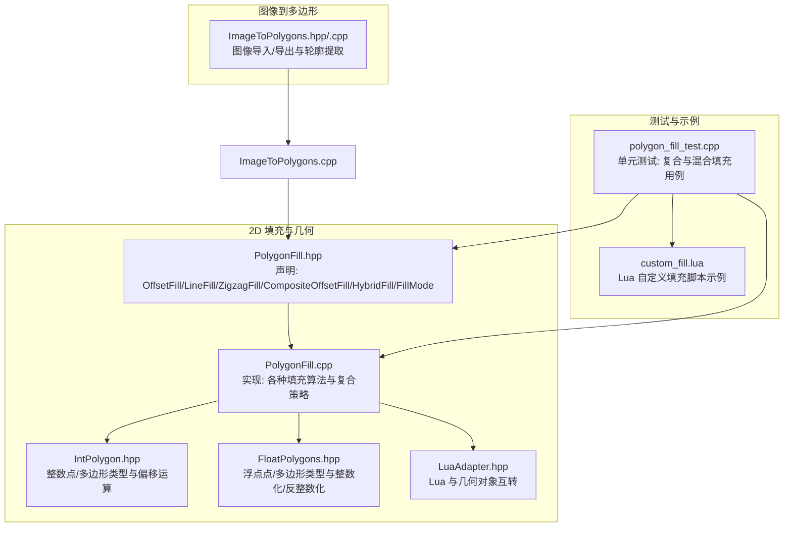
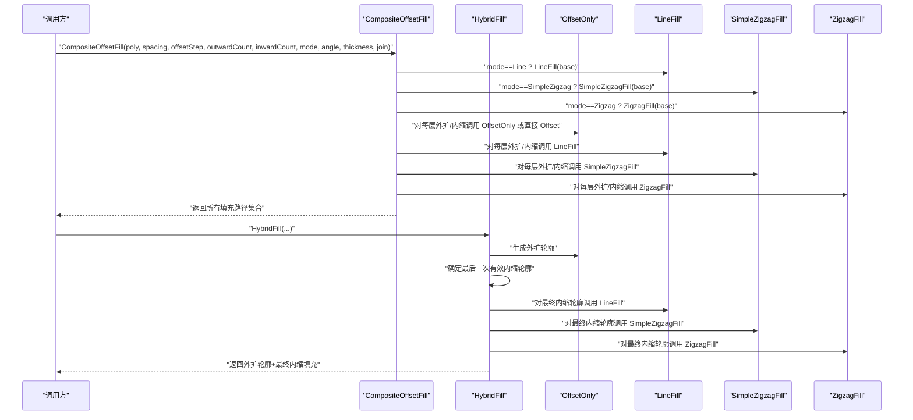
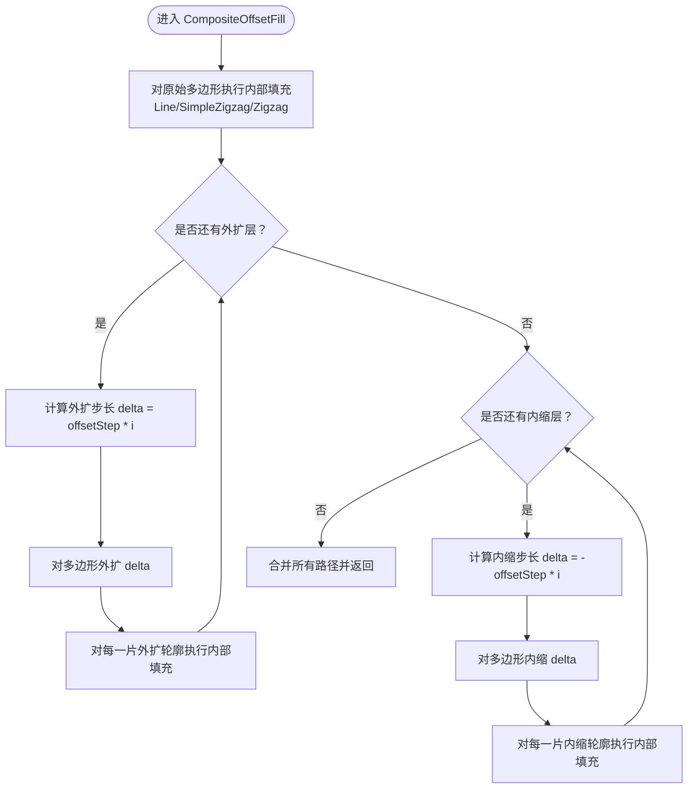
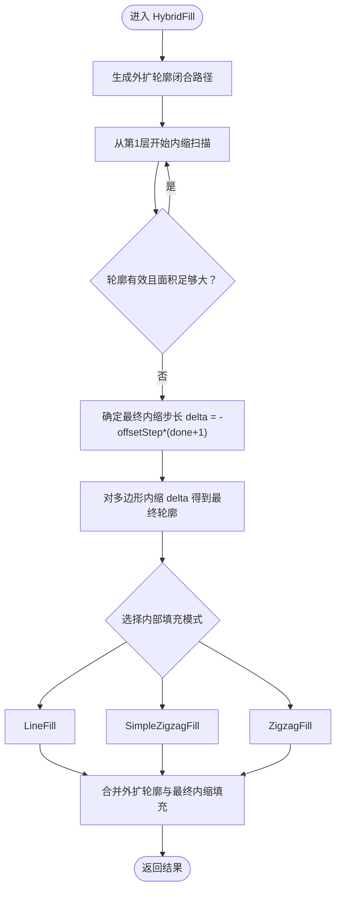
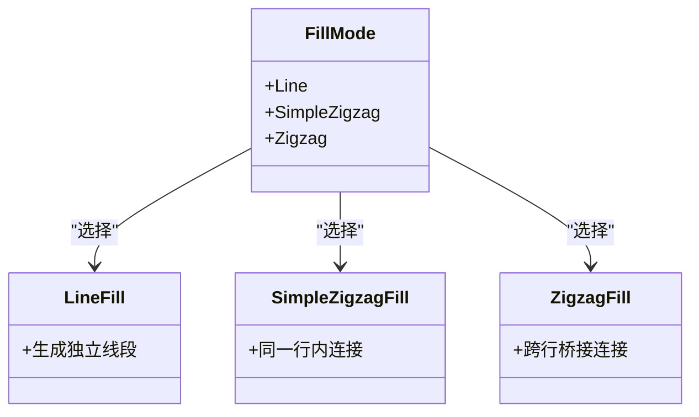
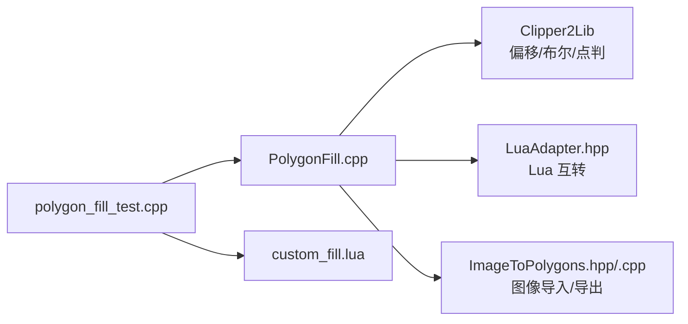

# 复合填充

<cite>
**本文引用的文件列表**
- [PolygonFill.hpp](file://2D/PolygonFill.hpp)
- [PolygonFill.cpp](file://2D/PolygonFill.cpp)
- [IntPolygon.hpp](file://2D/IntPolygon.hpp)
- [FloatPolygons.hpp](file://2D/FloatPolygons.hpp)
- [polygon_fill_test.cpp](file://tests/PolygonFill/polygon_fill_test.cpp)
- [custom_fill.lua](file://tests/PolygonFill/custom_fill.lua)
- [ImageToPolygons.hpp](file://2D/ImageToPolygons.hpp)
- [ImageToPolygons.cpp](file://2D/ImageToPolygons.cpp)
- [LuaAdapter.hpp](file://2D/LuaAdapter.hpp)
</cite>

## 目录
1. [简介](#简介)
2. [项目结构](#项目结构)
3. [核心组件](#核心组件)
4. [架构总览](#架构总览)
5. [详细组件分析](#详细组件分析)
6. [依赖关系分析](#依赖关系分析)
7. [性能考量](#性能考量)
8. [故障排查指南](#故障排查指南)
9. [结论](#结论)
10. [附录](#附录)

## 简介
本篇文档系统化介绍两种复合填充策略：CompositeOffsetFill 与 HybridFill。它们均基于多层偏移（外扩与内缩）与内部填充相结合的方式，实现边界致密、内部高效、路径连续的填充结构。其中：
- CompositeOffsetFill 先对整体进行一次基础填充，再按顺序对外扩层与内缩层分别进行填充，形成“多层同心带+中心实心”的复合路径集合。
- HybridFill 则先生成外扩轮廓，再在最后一次有效内缩轮廓上进行填充，确保路径连续性与边界致密。

文档将深入解析参数作用（outwardCount、inwardCount、offsetStep）、FillMode 枚举对内部填充类型的影响，并给出分阶段处理流程图与典型应用场景（如高强度零件打印）及不同模式下的路径长度与打印质量对比建议。

## 项目结构
围绕复合填充功能的核心文件位于 2D 目录，包含多边形数据结构、填充算法与测试验证；图像到多边形的转换工具用于从位图生成几何轮廓，便于后续填充。



图表来源
- [PolygonFill.hpp](file://2D/PolygonFill.hpp#L1-L46)
- [PolygonFill.cpp](file://2D/PolygonFill.cpp#L1-L120)
- [IntPolygon.hpp](file://2D/IntPolygon.hpp#L1-L75)
- [FloatPolygons.hpp](file://2D/FloatPolygons.hpp#L1-L72)
- [polygon_fill_test.cpp](file://tests/PolygonFill/polygon_fill_test.cpp#L1-L117)
- [custom_fill.lua](file://tests/PolygonFill/custom_fill.lua#L1-L16)
- [ImageToPolygons.hpp](file://2D/ImageToPolygons.hpp#L1-L26)
- [ImageToPolygons.cpp](file://2D/ImageToPolygons.cpp#L1-L200)
- [LuaAdapter.hpp](file://2D/LuaAdapter.hpp#L1-L25)

章节来源
- [PolygonFill.hpp](file://2D/PolygonFill.hpp#L1-L46)
- [PolygonFill.cpp](file://2D/PolygonFill.cpp#L1-L120)
- [IntPolygon.hpp](file://2D/IntPolygon.hpp#L1-L75)
- [FloatPolygons.hpp](file://2D/FloatPolygons.hpp#L1-L72)
- [polygon_fill_test.cpp](file://tests/PolygonFill/polygon_fill_test.cpp#L1-L117)
- [custom_fill.lua](file://tests/PolygonFill/custom_fill.lua#L1-L16)
- [ImageToPolygons.hpp](file://2D/ImageToPolygons.hpp#L1-L26)
- [ImageToPolygons.cpp](file://2D/ImageToPolygons.cpp#L1-L200)
- [LuaAdapter.hpp](file://2D/LuaAdapter.hpp#L1-L25)

## 核心组件
- 基础填充函数
  - OffsetFill：沿内外方向逐步偏移并收集路径，形成同心环状路径集。
  - LineFill：生成独立线段（每条路径仅两点）。
  - SimpleZigzagFill：在同一扫描行内连接相邻线段，形成连续折线路径。
  - ZigzagFill：在相邻扫描行之间建立桥接路径，形成连续折线路径。
- 复合填充策略
  - CompositeOffsetFill：先对原始多边形进行一次基础填充，再依次对外扩层与内缩层进行相同模式的填充。
  - HybridFill：先生成外扩轮廓，再在最后一次有效内缩轮廓上进行填充，保证路径连续性。
- 参数与枚举
  - FillMode：控制内部填充类型（Line/SimpleZigzag/Zigzag）。
  - outwardCount、inwardCount：分别指定外扩与内缩的层数。
  - offsetStep：每层偏移步长。
  - angle_deg、lineThickness：填充方向与线宽。
  - join_type：偏移连接类型（Square/Bevel/Round/Miter）。

章节来源
- [PolygonFill.hpp](file://2D/PolygonFill.hpp#L12-L40)
- [PolygonFill.cpp](file://2D/PolygonFill.cpp#L395-L1080)
- [IntPolygon.hpp](file://2D/IntPolygon.hpp#L1-L75)
- [FloatPolygons.hpp](file://2D/FloatPolygons.hpp#L1-L72)

## 架构总览
复合填充的整体流程由“偏移—填充—合并”三阶段构成，具体如下：



图表来源
- [PolygonFill.cpp](file://2D/PolygonFill.cpp#L972-L1080)
- [PolygonFill.cpp](file://2D/PolygonFill.cpp#L115-L157)
- [PolygonFill.cpp](file://2D/PolygonFill.cpp#L420-L439)
- [PolygonFill.cpp](file://2D/PolygonFill.cpp#L441-L609)
- [PolygonFill.cpp](file://2D/PolygonFill.cpp#L611-L970)

## 详细组件分析

### CompositeOffsetFill 分析
CompositeOffsetFill 的处理流程分为三个阶段：
1) 基础填充：对原始多边形执行一次内部填充（由 FillMode 决定）。
2) 外扩填充：按 outwardCount 层次，逐层外扩后进行相同内部填充。
3) 内缩填充：按 inwardCount 层次，逐层内缩后进行相同内部填充。
4) 结果合并：将上述所有路径合并为单一输出集合。



图表来源
- [PolygonFill.cpp](file://2D/PolygonFill.cpp#L972-L1021)

参数与行为要点
- outwardCount、inwardCount：控制偏移层数，越大越致密但路径越长。
- offsetStep：决定层间间距，影响边界致密度与内部填充效率。
- FillMode：Line 产生短直段路径，适合高密度；SimpleZigzag/Zigzag 产生连续折线，利于路径连续性与打印稳定性。
- join_type：影响偏移连接形状，Square/Bevel/Round/Miter 对路径连续性与打印质量有不同影响。

章节来源
- [PolygonFill.cpp](file://2D/PolygonFill.cpp#L972-L1021)
- [PolygonFill.hpp](file://2D/PolygonFill.hpp#L27-L40)

### HybridFill 分析
HybridFill 的处理流程强调路径连续性：
1) 生成外扩轮廓：按 outwardCount 逐层外扩并闭合路径，作为外框。
2) 确定有效内缩轮廓：从第 1 层开始向内缩进，跳过面积过小或为空的轮廓，记录最后有效层。
3) 最终内缩填充：对最后一次有效内缩轮廓执行内部填充（由 FillMode 决定）。
4) 合并输出：将外扩轮廓与最终内缩填充合并返回。



图表来源
- [PolygonFill.cpp](file://2D/PolygonFill.cpp#L1023-L1080)

参数与行为要点
- outwardCount：决定外框轮廓数量，影响边界致密性。
- inwardCount：用于扫描确定有效内缩层，避免无效或过小轮廓。
- offsetStep：控制内外层间距，影响最终内缩轮廓的厚度与内部填充密度。
- FillMode：决定最终内缩轮廓上的填充路径连续性与路径长度。

章节来源
- [PolygonFill.cpp](file://2D/PolygonFill.cpp#L1023-L1080)
- [PolygonFill.hpp](file://2D/PolygonFill.hpp#L32-L36)

### 内部填充类型与 FillMode
FillMode 控制内部填充类型，直接影响路径连续性与路径长度：
- Line：生成独立线段（每条路径仅两点），路径短、密度高，适合高强度打印场景。
- SimpleZigzag：在同一扫描行内连接相邻线段，形成连续折线，减少转向次数。
- Zigzag：在相邻扫描行之间建立桥接路径，形成连续折线，路径最长但连续性最好。



图表来源
- [PolygonFill.hpp](file://2D/PolygonFill.hpp#L25-L26)
- [PolygonFill.cpp](file://2D/PolygonFill.cpp#L420-L439)
- [PolygonFill.cpp](file://2D/PolygonFill.cpp#L441-L609)
- [PolygonFill.cpp](file://2D/PolygonFill.cpp#L611-L970)

章节来源
- [PolygonFill.hpp](file://2D/PolygonFill.hpp#L25-L26)
- [PolygonFill.cpp](file://2D/PolygonFill.cpp#L420-L439)
- [PolygonFill.cpp](file://2D/PolygonFill.cpp#L441-L609)
- [PolygonFill.cpp](file://2D/PolygonFill.cpp#L611-L970)

### 偏移与路径闭合
- 偏移函数 Offset：支持对单个或多边形进行外扩/内缩，可设置连接类型与端点类型。
- 路径闭合 ClosePath：为每条路径添加首尾点，确保路径闭合。
- 整数化/反整数化：在浮点与整数坐标之间转换，提高几何运算精度与兼容性。

```mermaid
sequenceDiagram
participant Poly as "输入多边形"
participant Off as "Offset"
participant Cls as "ClosePath"
participant Int as "整数化/反整数化"
Poly->>Off : "外扩/内缩 delta"
Off-->>Cls : "返回偏移后的路径"
Cls-->>Int : "闭合路径"
Int-->>Poly : "整数化/反整数化"
```

图表来源
- [IntPolygon.hpp](file://2D/IntPolygon.hpp#L47-L54)
- [PolygonFill.cpp](file://2D/PolygonFill.cpp#L115-L157)
- [PolygonFill.cpp](file://2D/PolygonFill.cpp#L395-L418)
- [FloatPolygons.hpp](file://2D/FloatPolygons.hpp#L51-L55)

章节来源
- [IntPolygon.hpp](file://2D/IntPolygon.hpp#L1-L75)
- [FloatPolygons.hpp](file://2D/FloatPolygons.hpp#L1-L72)
- [PolygonFill.cpp](file://2D/PolygonFill.cpp#L115-L157)
- [PolygonFill.cpp](file://2D/PolygonFill.cpp#L395-L418)

### 参数详解与典型配置
- outwardCount、inwardCount：控制偏移层数，越大边界越致密，内部填充越密集，路径越长。
- offsetStep：控制层间距，影响边界致密度与内部填充效率。
- FillMode：Line 适合高强度打印；SimpleZigzag/Zigzag 适合需要路径连续性的场景。
- angle_deg、lineThickness：控制填充方向与线宽，影响路径长度与打印质量。
- join_type：Square/Bevel/Round/Miter 影响偏移连接形状，进而影响路径连续性与打印质量。

章节来源
- [PolygonFill.hpp](file://2D/PolygonFill.hpp#L27-L40)
- [PolygonFill.cpp](file://2D/PolygonFill.cpp#L972-L1080)

## 依赖关系分析
复合填充依赖于以下模块：
- Clipper2Lib：提供偏移、布尔运算、点在多边形内的判断等几何运算。
- Lua：用于自定义填充脚本与图像到多边形的 Lua 集成。
- 测试与示例：通过单元测试验证复合与混合填充的行为。



图表来源
- [PolygonFill.cpp](file://2D/PolygonFill.cpp#L1-L120)
- [IntPolygon.hpp](file://2D/IntPolygon.hpp#L1-L75)
- [FloatPolygons.hpp](file://2D/FloatPolygons.hpp#L1-L72)
- [ImageToPolygons.hpp](file://2D/ImageToPolygons.hpp#L1-L26)
- [ImageToPolygons.cpp](file://2D/ImageToPolygons.cpp#L1-L200)
- [LuaAdapter.hpp](file://2D/LuaAdapter.hpp#L1-L25)
- [polygon_fill_test.cpp](file://tests/PolygonFill/polygon_fill_test.cpp#L1-L117)
- [custom_fill.lua](file://tests/PolygonFill/custom_fill.lua#L1-L16)

章节来源
- [PolygonFill.cpp](file://2D/PolygonFill.cpp#L1-L120)
- [IntPolygon.hpp](file://2D/IntPolygon.hpp#L1-L75)
- [FloatPolygons.hpp](file://2D/FloatPolygons.hpp#L1-L72)
- [ImageToPolygons.hpp](file://2D/ImageToPolygons.hpp#L1-L26)
- [ImageToPolygons.cpp](file://2D/ImageToPolygons.cpp#L1-L200)
- [LuaAdapter.hpp](file://2D/LuaAdapter.hpp#L1-L25)
- [polygon_fill_test.cpp](file://tests/PolygonFill/polygon_fill_test.cpp#L1-L117)
- [custom_fill.lua](file://tests/PolygonFill/custom_fill.lua#L1-L16)

## 性能考量
- 路径长度与密度
  - CompositeOffsetFill：随着 outwardCount、inwardCount 增加，路径长度显著增加；FillMode::Line 密度最高，路径最短。
  - HybridFill：外扩轮廓数量受 outwardCount 影响；最终内缩填充受 FillMode 影响，路径长度与连续性平衡较好。
- 计算复杂度
  - 偏移操作的时间复杂度与多边形顶点数和层数相关；内部填充算法（Line/SimpleZigzag/Zigzag）随扫描行数与段数增长。
- 连续性与质量
  - ZigzagFill 在相邻扫描行之间建立桥接，路径连续性最佳，适合对路径连续性要求高的场景。
  - SimpleZigzagFill 在同一行内连接，减少转向次数，适合中等连续性需求。
  - LineFill 路径最短，适合高强度打印，但连续性相对较差。

[本节为通用性能讨论，不直接分析具体文件]

## 故障排查指南
- 偏移无效或空轮廓
  - 检查 offsetStep 是否过大导致偏移后面积过小被裁剪；检查 inwardCount 是否导致最后一层面积小于阈值。
- 路径不连续
  - 使用 ZigzagFill 或 SimpleZigzagFill 提升连续性；调整 angle_deg 与 spacing 以改善桥接效果。
- Lua 自定义填充异常
  - 确认 Lua 脚本返回的是多段折线数组；检查 Lua 函数名与参数传递；参考测试脚本格式。
- 图像导入问题
  - 确认图像格式与像素尺寸设置正确；检查阈值与像素大小对轮廓提取的影响。

章节来源
- [polygon_fill_test.cpp](file://tests/PolygonFill/polygon_fill_test.cpp#L59-L117)
- [custom_fill.lua](file://tests/PolygonFill/custom_fill.lua#L1-L16)
- [ImageToPolygons.cpp](file://2D/ImageToPolygons.cpp#L136-L200)

## 结论
- CompositeOffsetFill 适合追求边界致密与内部高密度的场景，可通过合理设置 outwardCount、inwardCount 与 FillMode 平衡路径长度与打印质量。
- HybridFill 更注重路径连续性，适合对路径连续性要求较高的打印任务，同时保持较好的边界致密性。
- 参数选择建议：
  - 强度优先：Line + 较小 offsetStep + 适中 outwardCount/inwardCount。
  - 连续性优先：Zigzag/SimpleZigzag + 中等 offsetStep + 适度 outwardCount。
  - 综合平衡：根据实际打印设备与材料特性微调 angle_deg、lineThickness 与 join_type。

[本节为总结性内容，不直接分析具体文件]

## 附录
- 典型应用场景
  - 高强度零件打印：优先考虑 Line 填充与较小 offsetStep，提升致密度与强度。
  - 大面积薄壁结构：优先考虑 Zigzag/SimpleZigzag，提升路径连续性与层间结合。
  - 复杂轮廓与高精度：结合 ImageToPolygons 将图像转换为多边形后，再使用复合填充策略。
- 参考测试用例
  - 单元测试展示了 CompositeOffsetFill 与 HybridFill 的基本行为与期望输出特征。

章节来源
- [polygon_fill_test.cpp](file://tests/PolygonFill/polygon_fill_test.cpp#L1-L117)
- [ImageToPolygons.hpp](file://2D/ImageToPolygons.hpp#L1-L26)
- [ImageToPolygons.cpp](file://2D/ImageToPolygons.cpp#L136-L200)