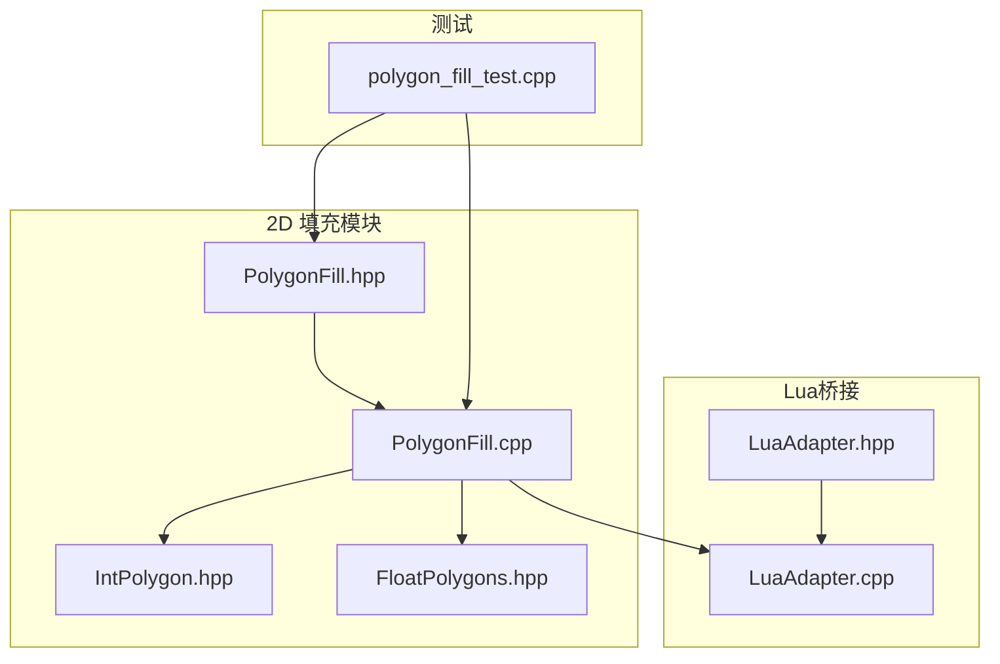
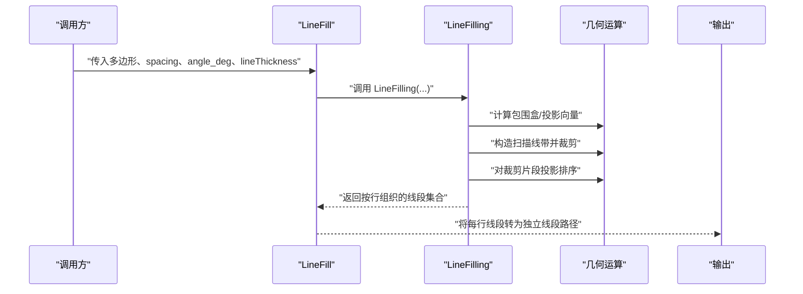
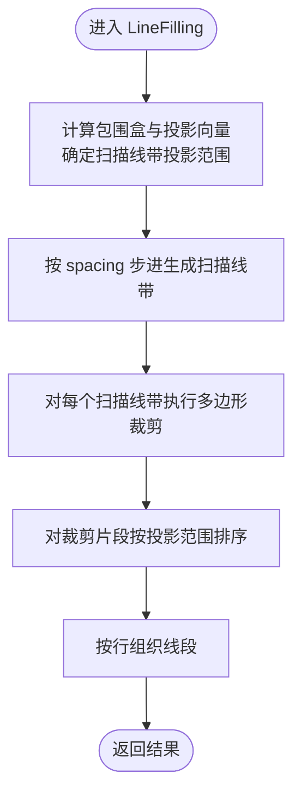
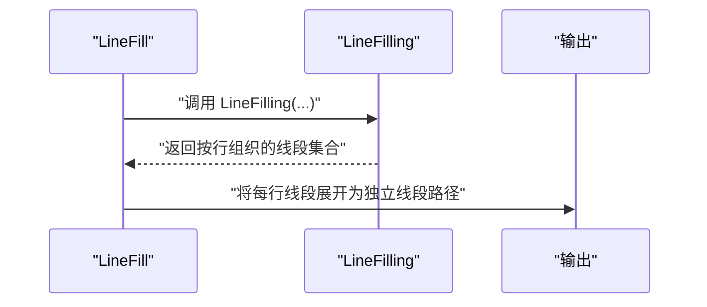
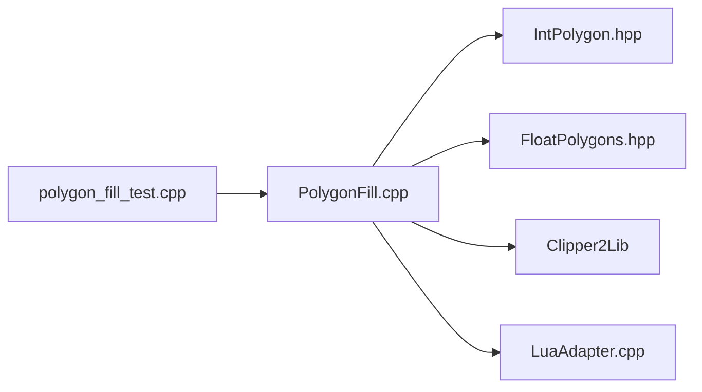

# 直线填充

<cite>
**本文引用的文件**
- [PolygonFill.cpp](file://2D/PolygonFill.cpp)
- [PolygonFill.hpp](file://2D/PolygonFill.hpp)
- [IntPolygon.hpp](file://2D/IntPolygon.hpp)
- [FloatPolygons.hpp](file://2D/FloatPolygons.hpp)
- [polygon_fill_test.cpp](file://tests/PolygonFill/polygon_fill_test.cpp)
- [LuaAdapter.cpp](file://2D/LuaAdapter.cpp)
- [LuaAdapter.hpp](file://2D/LuaAdapter.hpp)
</cite>

## 目录
1. [简介](#简介)
2. [项目结构](#项目结构)
3. [核心组件](#核心组件)
4. [架构总览](#架构总览)
5. [详细组件分析](#详细组件分析)
6. [依赖关系分析](#依赖关系分析)
7. [性能考量](#性能考量)
8. [故障排查指南](#故障排查指南)
9. [结论](#结论)
10. [附录：C++调用示例与参数配置建议](#附录c调用示例与参数配置建议)

## 简介
本文件系统性解析“直线填充”（LineFill）算法在代码库中的实现与使用，重点阐述：
- 通过指定线间距、填充角度与线宽，生成平行直线路径，用于简单实心区域的填充；
- 深入分析参数 spacing（线间距）、angle_deg（填充角度）、lineThickness（线宽）对路径生成的影响；
- 结合 LineFilling 函数内部的投影计算与裁剪逻辑，说明如何将二维多边形与扫描线求交并生成有效线段；
- 提供 C++ 调用示例与在实际切片中的应用场景；
- 给出算法流程图、参数配置建议、性能优化提示以及高密度填充场景下的性能瓶颈与解决方案。

## 项目结构
与直线填充相关的核心文件位于 2D 目录，主要包含：
- PolygonFill.hpp：声明 LineFill、SimpleZigzagFill、ZigzagFill 等填充接口；
- PolygonFill.cpp：实现 LineFilling 核心算法与各填充模式；
- IntPolygon.hpp、FloatPolygons.hpp：整数/浮点多边形类型与布尔运算、偏移、整数化/反整数化等工具；
- tests/PolygonFill/polygon_fill_test.cpp：单元测试，演示 LineFill 的基本用法；
- 2D/LuaAdapter.*：Lua 与 C++ 的数据桥接，支持通过 Lua 调用 PolygonFill 接口。

图表来源
- [PolygonFill.cpp](file://2D/PolygonFill.cpp#L1-L120)
- [PolygonFill.hpp](file://2D/PolygonFill.hpp#L1-L46)
- [IntPolygon.hpp](file://2D/IntPolygon.hpp#L1-L75)
- [FloatPolygons.hpp](file://2D/FloatPolygons.hpp#L1-L72)
- [polygon_fill_test.cpp](file://tests/PolygonFill/polygon_fill_test.cpp#L1-L117)
- [LuaAdapter.cpp](file://2D/LuaAdapter.cpp#L1-L287)

章节来源
- [PolygonFill.cpp](file://2D/PolygonFill.cpp#L1-L120)
- [PolygonFill.hpp](file://2D/PolygonFill.hpp#L1-L46)

## 核心组件
- LineFill：对外公开的直线填充入口，返回独立线段（每条路径仅两个端点），便于后续路径规划或机器人路径生成。
- LineFilling：内部通用扫描线填充核心，负责：
  - 计算包围盒与投影方向向量；
  - 构造垂直于填充方向的扫描线带（带宽由线宽决定）；
  - 对每个扫描线带进行多边形裁剪；
  - 在裁剪后的片段上计算投影范围并排序，得到行内线段序列。
- SimpleZigzagFill/ZigzagFill：基于 LineFilling 的连接策略扩展，生成连续折线路径，满足更高路径连贯性需求。

章节来源
- [PolygonFill.hpp](file://2D/PolygonFill.hpp#L12-L23)
- [PolygonFill.cpp](file://2D/PolygonFill.cpp#L25-L113)
- [PolygonFill.cpp](file://2D/PolygonFill.cpp#L420-L439)

## 架构总览
下图展示了从输入多边形到输出填充路径的整体流程，包括参数处理、扫描线生成、裁剪与排序等关键步骤。

图表来源
- [PolygonFill.cpp](file://2D/PolygonFill.cpp#L25-L113)
- [PolygonFill.cpp](file://2D/PolygonFill.cpp#L420-L439)

## 详细组件分析

### LineFilling 核心算法
LineFilling 是直线填充的“扫描线+投影+裁剪”核心实现，其关键步骤如下：
- 参数与坐标系准备
  - 将角度转换为单位向量 (ux, uy)，并构造垂直向量 (vx, vy) 作为扫描方向；
  - 计算多边形的最小包围盒，并沿 (vx, vy) 方向投影四角，确定扫描线带的投影范围；
- 扫描线生成与裁剪
  - 沿投影范围以 spacing 步进生成一系列中心点，构建垂直于填充方向的扫描线带；
  - 使用带宽（由 lineThickness 决定）构造矩形扫描带，再与原多边形做裁剪；
- 投影与排序
  - 对每个裁剪片段，计算顶点在填充方向上的投影范围 [s_min, s_max]；
  - 以 s_min 为键对同一行内的线段进行排序，保证路径方向一致；
- 输出组织
  - 返回按行组织的线段列表，每行包含若干 (起点, 终点) 线段对。

图表来源
- [PolygonFill.cpp](file://2D/PolygonFill.cpp#L25-L113)

章节来源
- [PolygonFill.cpp](file://2D/PolygonFill.cpp#L25-L113)

### LineFill 公开接口
LineFill 作为对外 API，直接复用 LineFilling 的核心逻辑，但将输出转换为独立线段（每条路径仅含两个端点）。这使得下游路径规划更灵活，也避免了不必要的路径合并。

图表来源
- [PolygonFill.cpp](file://2D/PolygonFill.cpp#L420-L439)

章节来源
- [PolygonFill.cpp](file://2D/PolygonFill.cpp#L420-L439)
- [PolygonFill.hpp](file://2D/PolygonFill.hpp#L16-L18)

### 参数影响与行为说明
- spacing（线间距）
  - 控制扫描线带之间的距离，直接影响填充密度与路径数量；
  - 较小的 spacing 会生成更多线段，提高覆盖但增加路径长度与后处理复杂度。
- angle_deg（填充角度）
  - 决定填充方向，通过 (ux, uy) 与 (vx, vy) 定义扫描方向与垂直方向；
  - 不同角度可改变路径走向，适合不同纹理或打印方向需求。
- lineThickness（线宽）
  - 影响扫描线带的宽度，从而控制裁剪后线段的截取范围；
  - 在 SimpleZigzagFill/ZigzagFill 中还参与路径连接策略与桥接逻辑。

章节来源
- [PolygonFill.cpp](file://2D/PolygonFill.cpp#L43-L69)
- [PolygonFill.cpp](file://2D/PolygonFill.cpp#L76-L111)
- [PolygonFill.cpp](file://2D/PolygonFill.cpp#L443-L609)
- [PolygonFill.cpp](file://2D/PolygonFill.cpp#L611-L970)

### 与几何与布尔运算的关系
- 整数化/反整数化
  - 使用 integerization（常量）在整数坐标与浮点坐标之间转换，确保几何运算精度与稳定性；
- 多边形裁剪
  - 使用 Intersection 对扫描线带与多边形进行裁剪，得到有效线段；
- 点在多边形判断
  - 使用 PointInPolygons 判断点是否位于多边形内部，用于 SimpleZigzagFill/ZigzagFill 的路径裁剪与桥接。

章节来源
- [IntPolygon.hpp](file://2D/IntPolygon.hpp#L10-L10)
- [FloatPolygons.hpp](file://2D/FloatPolygons.hpp#L51-L56)
- [PolygonFill.cpp](file://2D/PolygonFill.cpp#L76-L80)
- [PolygonFill.cpp](file://2D/PolygonFill.cpp#L453-L457)
- [PolygonFill.cpp](file://2D/PolygonFill.cpp#L690-L694)

### 与 Lua 接口的集成
- LuaAdapter 提供将 C++ 多边形对象与 Lua 表互转的能力；
- PolygonFill Lua 库暴露 lineFill 等函数，允许在脚本中直接调用 C++ 填充算法。

章节来源
- [LuaAdapter.hpp](file://2D/LuaAdapter.hpp#L12-L20)
- [LuaAdapter.cpp](file://2D/LuaAdapter.cpp#L149-L195)
- [LuaAdapter.cpp](file://2D/LuaAdapter.cpp#L198-L238)
- [PolygonFill.cpp](file://2D/PolygonFill.cpp#L195-L209)

## 依赖关系分析
- 内部依赖
  - PolygonFill.cpp 依赖 IntPolygon.hpp 与 FloatPolygons.hpp 提供的整数/浮点多边形类型与运算；
  - LineFilling 使用 Clipper2Lib 的布尔运算与点在多边形判断；
- 外部依赖
  - LuaJIT（通过 LuaAdapter）用于脚本化调用；
  - 测试依赖 Boost.Test 进行断言验证。

图表来源
- [PolygonFill.cpp](file://2D/PolygonFill.cpp#L1-L120)
- [IntPolygon.hpp](file://2D/IntPolygon.hpp#L1-L75)
- [FloatPolygons.hpp](file://2D/FloatPolygons.hpp#L1-L72)
- [LuaAdapter.cpp](file://2D/LuaAdapter.cpp#L1-L287)
- [polygon_fill_test.cpp](file://tests/PolygonFill/polygon_fill_test.cpp#L1-L117)

章节来源
- [PolygonFill.cpp](file://2D/PolygonFill.cpp#L1-L120)
- [polygon_fill_test.cpp](file://tests/PolygonFill/polygon_fill_test.cpp#L1-L117)

## 性能考量
- 时间复杂度
  - 扫描线数量与投影范围成正比，约为 O(N_lines × N_vertices)；
  - 每行内排序与裁剪带来额外开销，整体复杂度受多边形顶点数与扫描线密度影响。
- 空间复杂度
  - 存储按行组织的线段列表，空间与线段总数成正比。
- 高密度填充的性能瓶颈
  - 当 spacing 很小时，扫描线数量与裁剪片段增多，导致 CPU 与内存压力增大；
  - SimpleZigzagFill/ZigzagFill 在连接跨行线段时引入额外的连通性分析与桥接逻辑，进一步增加时间开销。
- 优化建议
  - 合理设置 spacing，避免过小的步长；
  - 对于复杂多边形，先进行预处理（如简化或分块）以减少顶点数；
  - 在需要连续路径时，优先考虑 SimpleZigzagFill/ZigzagFill 的替代方案（如复合偏移+直线条带）以降低连接成本；
  - 使用整数化策略保持数值稳定，减少浮点误差带来的重复计算。

[本节为通用性能讨论，不直接分析具体文件，故无章节来源]

## 故障排查指南
- 输入参数非法
  - spacing 必须大于零，否则直接返回空结果；
  - 角度过大或过小不会报错，但可能导致路径稀疏或密集，需根据打印需求调整。
- 线段为空或数量异常
  - 若多边形面积过小或线宽过大，裁剪后可能无有效线段；检查 spacing 与 lineThickness 的相对比例；
  - 确认多边形方向与包围盒计算正确。
- 路径方向不一致
  - 确保按 s_min 排序的逻辑未被外部修改；必要时重新运行 LineFilling 并检查排序键。
- Lua 调用失败
  - 检查 Lua 表结构与字段名（x/y）是否正确；
  - 确认已注册 PolygonFill 与 PolygonOperations 库。

章节来源
- [PolygonFill.cpp](file://2D/PolygonFill.cpp#L443-L609)
- [PolygonFill.cpp](file://2D/PolygonFill.cpp#L611-L970)
- [polygon_fill_test.cpp](file://tests/PolygonFill/polygon_fill_test.cpp#L22-L56)
- [LuaAdapter.cpp](file://2D/LuaAdapter.cpp#L149-L195)
- [LuaAdapter.cpp](file://2D/LuaAdapter.cpp#L198-L238)

## 结论
LineFill 通过“扫描线+投影+裁剪”的方式，高效地为简单实心区域生成平行直线路径。参数 spacing、angle_deg、lineThickness 直接决定了路径密度、方向与线段长度。结合 SimpleZigzagFill/ZigzagFill 可在需要连续路径时进一步提升路径连贯性。在高密度填充场景下，应关注扫描线数量与连接逻辑带来的性能开销，并通过合理的参数配置与预处理手段进行优化。

[本节为总结性内容，不直接分析具体文件，故无章节来源]

## 附录：C++调用示例与参数配置建议

### C++ 调用示例
以下示例展示如何在 C++ 中调用 LineFill 生成直线填充路径：
- 准备输入多边形（整数坐标）；
- 调用 LineFill(spacing, angle_deg, lineThickness)；
- 遍历返回的路径，每条路径仅包含两个端点；
- 如需浮点坐标，可使用 UnIntegerization 将整数路径转换为浮点路径。

参考测试用例中的调用方式：
- [polygon_fill_test.cpp](file://tests/PolygonFill/polygon_fill_test.cpp#L22-L30)

章节来源
- [polygon_fill_test.cpp](file://tests/PolygonFill/polygon_fill_test.cpp#L22-L30)
- [PolygonFill.hpp](file://2D/PolygonFill.hpp#L16-L18)
- [FloatPolygons.hpp](file://2D/FloatPolygons.hpp#L54-L56)

### 参数配置建议
- spacing
  - 建议与打印层高与喷嘴直径相匹配，避免过密导致路径冗长；
  - 对于较厚区域可适当增大 spacing 以减少路径数量。
- angle_deg
  - 常用 0°/45°/90°，视模型纹理与打印方向而定；
  - 多角度组合可改善表面质量与收缩均匀性。
- lineThickness
  - 通常与挤出宽度一致或略小，确保线段覆盖完整；
  - 在 SimpleZigzagFill/ZigzagFill 中，lineThickness 会影响桥接与连接策略。

章节来源
- [PolygonFill.cpp](file://2D/PolygonFill.cpp#L43-L69)
- [PolygonFill.cpp](file://2D/PolygonFill.cpp#L76-L111)
- [PolygonFill.cpp](file://2D/PolygonFill.cpp#L443-L609)
- [PolygonFill.cpp](file://2D/PolygonFill.cpp#L611-L970)

### 实际切片应用场景
- 简单实心区域的快速填充：使用 LineFill 生成直线条带，便于后续路径规划与机器人路径生成；
- 需要连续路径的区域：使用 SimpleZigzagFill 或 ZigzagFill，通过行间连接形成连续折线；
- 复杂几何体的分层填充：结合复合偏移（CompositeOffsetFill）与混合策略（HybridFill）实现内外多层填充。

章节来源
- [PolygonFill.cpp](file://2D/PolygonFill.cpp#L972-L1021)
- [PolygonFill.cpp](file://2D/PolygonFill.cpp#L1023-L1079)
- [PolygonFill.cpp](file://2D/PolygonFill.cpp#L443-L609)
- [PolygonFill.cpp](file://2D/PolygonFill.cpp#L611-L970)