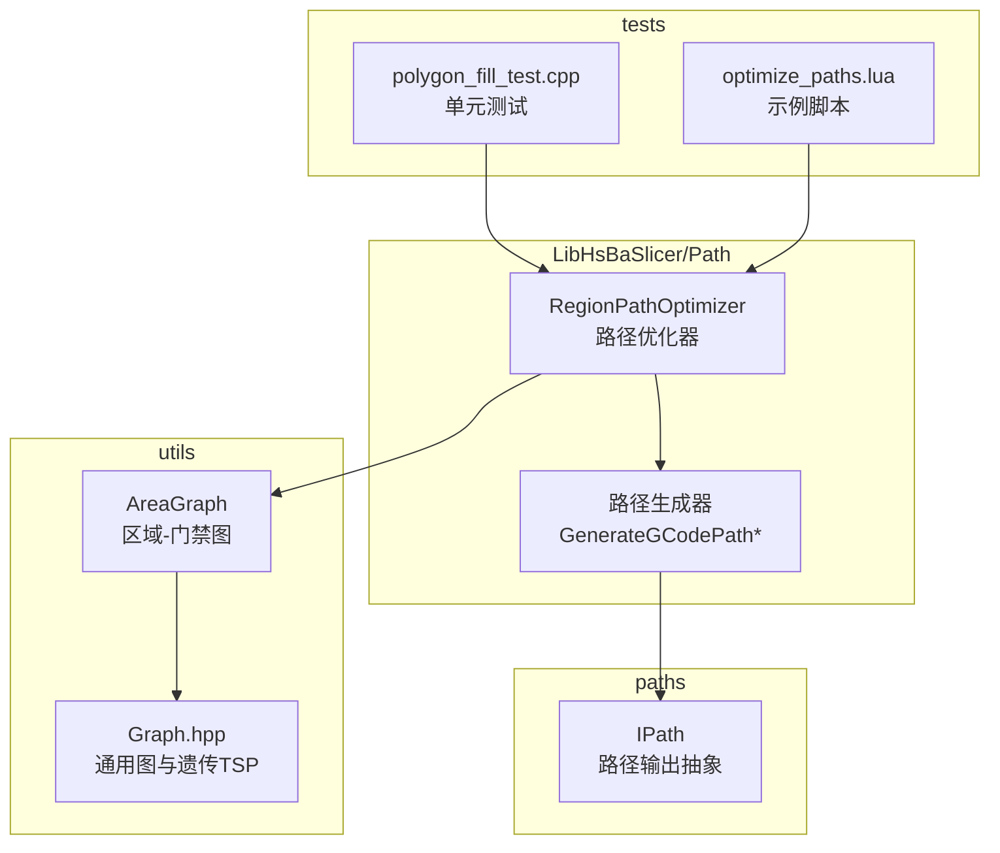
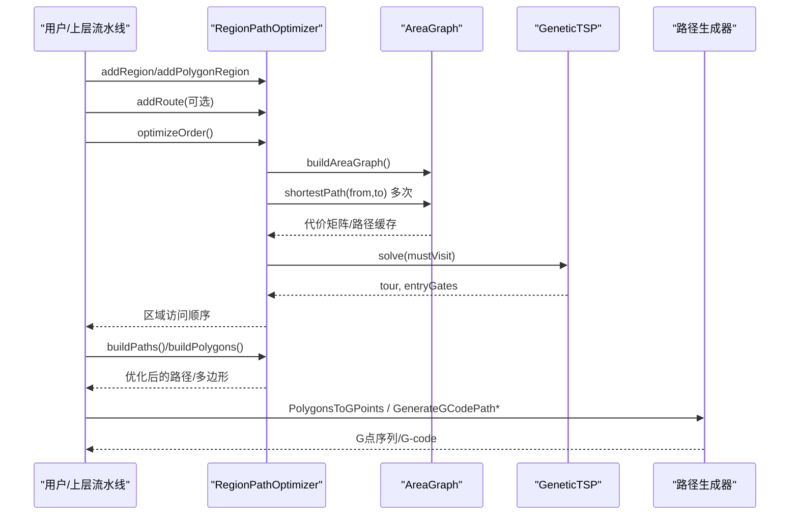
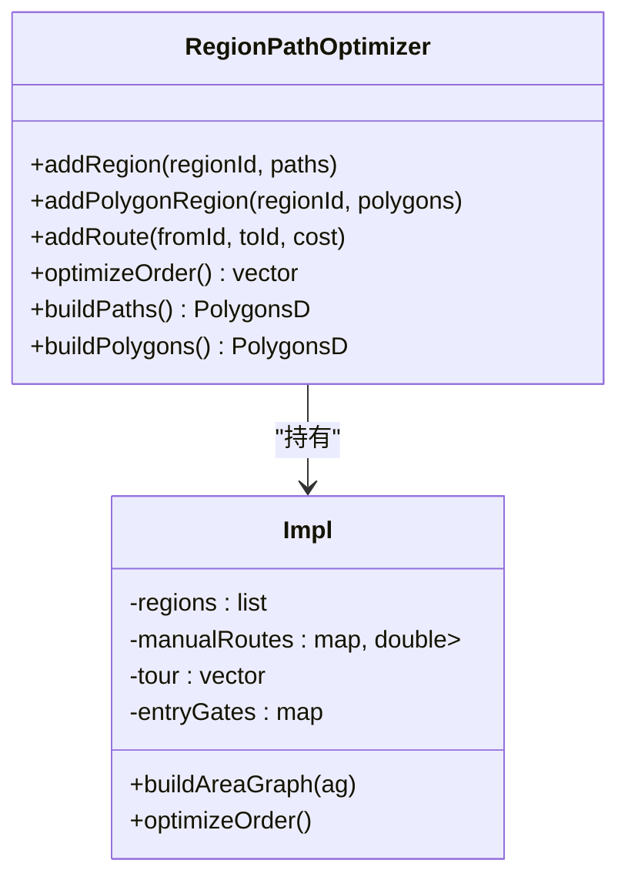
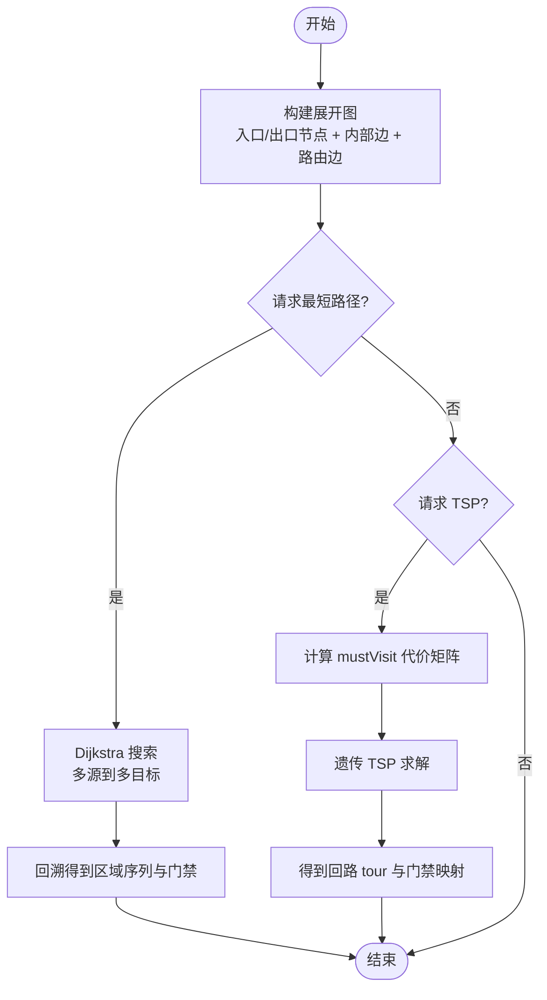
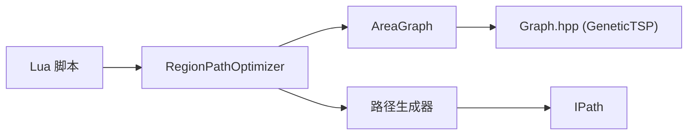

# 路径优化系统

<cite>
**本文引用的文件**
- [README.md](file://README.md)
- [CMakeLists.txt](file://CMakeLists.txt)
- [path_optimizer.hpp](file://LibHsBaSlicer/Path/path_optimizer.hpp)
- [path_optimizer.cpp](file://LibHsBaSlicer/Path/path_optimizer.cpp)
- [AreaGraph.hpp](file://utils/AreaGraph.hpp)
- [Graph.hpp](file://utils/Graph.hpp)
- [path_generator.hpp](file://LibHsBaSlicer/Path/path_generator.hpp)
- [IPath.hpp](file://paths/IPath.hpp)
- [optimize_paths.lua](file://tests/PolygonFill/optimize_paths.lua)
- [polygon_fill_test.cpp](file://tests/PolygonFill/polygon_fill_test.cpp)
</cite>

## 目录
1. [简介](#简介)
2. [项目结构](#项目结构)
3. [核心组件](#核心组件)
4. [架构总览](#架构总览)
5. [详细组件分析](#详细组件分析)
6. [依赖关系分析](#依赖关系分析)
7. [性能考量](#性能考量)
8. [故障排查指南](#故障排查指南)
9. [结论](#结论)
10. [附录](#附录)

## 简介
本系统为 HsBaSlicer 的“路径输出前置优化”子系统，目标是在生成最终打印路径之前，对相互独立的多边形区域进行访问顺序优化，从而显著减少空走距离、提升打印效率。系统提供两种模式：
- 多边形模式（填充前）：以多边形轮廓作为输入，输出按最优顺序排列的多边形集合，供后续填充使用。
- 填充结果模式（填充后）：以已生成的填充路径（支持多点折线）作为输入，输出完整且顺序优化的填充路径。

该子系统通过建模为“区域-门禁”图，并采用遗传算法求解 TSP，结合最短路径与贪心编排，实现高效、可扩展的路径优化。

## 项目结构
围绕路径优化相关的代码主要分布在以下位置：
- LibHsBaSlicer/Path：对外暴露的优化器与路径生成接口
- utils：通用图与“区域-门禁”图 AreaGraph 的实现
- paths：路径抽象与输出接口
- tests/PolygonFill：针对优化器的测试与示例脚本

图表来源
- [path_optimizer.hpp:18-84](file://LibHsBaSlicer/Path/path_optimizer.hpp#L18-L84)
- [AreaGraph.hpp:84-308](file://utils/AreaGraph.hpp#L84-L308)
- [Graph.hpp:799-827](file://utils/Graph.hpp#L799-L827)
- [path_generator.hpp:16-73](file://LibHsBaSlicer/Path/path_generator.hpp#L16-L73)
- [IPath.hpp:16-34](file://paths/IPath.hpp#L16-L34)
- [optimize_paths.lua:1-33](file://tests/PolygonFill/optimize_paths.lua#L1-L33)
- [polygon_fill_test.cpp:229-338](file://tests/PolygonFill/polygon_fill_test.cpp#L229-L338)

章节来源
- [README.md:25-39](file://README.md#L25-L39)
- [CMakeLists.txt:373-413](file://CMakeLists.txt#L373-L413)

## 核心组件
- RegionPathOptimizer：路径优化器，负责将多个独立区域建模为图顶点，求解最小空走代价的区域访问顺序，并按模式输出优化后的多边形或路径。
- AreaGraph：区域-门禁图，封装了“区域 + 门禁 + 内部/路由代价”的图模型，并提供最短路径与 TSP 求解。
- Graph.hpp：通用图结构与算法库，包含遗传 TSP 等启发式算法。
- 路径生成器：将优化后的多边形/路径转换为 G 点序列或 G-code。
- IPath：路径输出的统一抽象，支持保存与字符串化，并可嵌入 Lua 脚本扩展。

章节来源
- [path_optimizer.hpp:18-84](file://LibHsBaSlicer/Path/path_optimizer.hpp#L18-L84)
- [AreaGraph.hpp:84-308](file://utils/AreaGraph.hpp#L84-L308)
- [Graph.hpp:799-827](file://utils/Graph.hpp#L799-L827)
- [path_generator.hpp:16-73](file://LibHsBaSlicer/Path/path_generator.hpp#L16-L73)
- [IPath.hpp:16-34](file://paths/IPath.hpp#L16-L34)

## 架构总览
路径优化系统的整体流程如下：
1. 用户添加若干区域（多边形或填充路径），每个区域定义其“门禁”（候选出入门点）。
2. 构建 AreaGraph，计算区域间的最短路径代价矩阵。
3. 调用遗传 TSP 求解区域访问顺序（≥3 个区域时启用；2 个区域直接比较两个方向）。
4. 根据模式输出：
   - 多边形模式：输出优化顺序的多边形集合，区域内多边形起点旋转至入门禁，保持环绕方向。
   - 填充结果模式：输出完整填充路径，区域内路径方向/次序经贪心编排以减少跳变。
5. 可选：通过 Lua 脚本自定义策略或覆盖区域间空走代价。

图表来源
- [path_optimizer.cpp:113-158](file://LibHsBaSlicer/Path/path_optimizer.cpp#L113-L158)
- [AreaGraph.hpp:231-308](file://utils/AreaGraph.hpp#L231-L308)
- [Graph.hpp:799-827](file://utils/Graph.hpp#L799-L827)
- [path_generator.hpp:46-69](file://LibHsBaSlicer/Path/path_generator.hpp#L46-L69)

## 详细组件分析

### RegionPathOptimizer（路径优化器）
- 职责：管理多个区域，维护区域数据、门禁、手动覆盖的空走代价，执行优化并输出结果。
- 关键方法：
  - addRegion：添加基于填充结果的区域，门禁为每条折线的首尾端点。
  - addPolygonRegion：添加基于多边形本身的区域，门禁为全部多边形顶点。
  - addRoute：手动指定区域间对称空走代价。
  - optimizeOrder：求解区域访问顺序（≤2 区域特殊处理，≥3 区域使用遗传 TSP）。
  - buildPaths/buildPolygons：按模式输出优化后的路径或多边形集合。
- 约束：同一优化器内不可混用两种模式。

图表来源
- [path_optimizer.hpp:18-84](file://LibHsBaSlicer/Path/path_optimizer.hpp#L18-L84)
- [path_optimizer.cpp:38-158](file://LibHsBaSlicer/Path/path_optimizer.cpp#L38-L158)

章节来源
- [path_optimizer.hpp:18-84](file://LibHsBaSlicer/Path/path_optimizer.hpp#L18-L84)
- [path_optimizer.cpp:38-158](file://LibHsBaSlicer/Path/path_optimizer.cpp#L38-L158)

### AreaGraph（区域-门禁图）
- 职责：将“区域 + 门禁 + 内部/路由代价”建模为图，支持最短路径与 TSP 求解。
- 关键特性：
  - 区域配置：门禁可设置允许进入/离开、同门进出限制、内部代价表。
  - 路由：区域间边权重由门禁对决定，支持手动覆盖。
  - 最短路径：在“展开图”上运行 Dijkstra，返回区域序列及出入门禁。
  - TSP：先计算必须访问区域的代价矩阵，再调用遗传 TSP 求解回路。
- 复杂度：
  - 最短路径：O(E log V) 级别（堆优化 Dijkstra）。
  - TSP：近似解，时间取决于种群规模、代数、变异/交叉率。

图表来源
- [AreaGraph.hpp:164-229](file://utils/AreaGraph.hpp#L164-L229)
- [AreaGraph.hpp:231-308](file://utils/AreaGraph.hpp#L231-L308)
- [AreaGraph.hpp:368-429](file://utils/AreaGraph.hpp#L368-L429)
- [AreaGraph.hpp:451-553](file://utils/AreaGraph.hpp#L451-L553)

章节来源
- [AreaGraph.hpp:84-308](file://utils/AreaGraph.hpp#L84-L308)
- [AreaGraph.hpp:368-553](file://utils/AreaGraph.hpp#L368-L553)

### 遗传 TSP（Graph.hpp）
- 职责：在压缩图上求解必须访问节点的近似最短回路。
- 参数：种群规模、最大代数、变异率、交叉率。
- 行为：若图不完整，可能返回次优解或极大代价；mustVisit < 2 会抛出异常。

章节来源
- [Graph.hpp:799-827](file://utils/Graph.hpp#L799-L827)

### 路径生成器与输出
- 路径生成器：将优化后的多边形/路径转换为 G 点序列或 G-code，支持挤出与非挤出段的速度与挤出量计算。
- IPath：统一路径输出抽象，支持保存到文件或字符串化，并可嵌入 Lua 脚本进行定制。

章节来源
- [path_generator.hpp:16-73](file://LibHsBaSlicer/Path/path_generator.hpp#L16-L73)
- [IPath.hpp:16-34](file://paths/IPath.hpp#L16-L34)

### Lua 集成与示例
- 注册函数：PathOptimize.new()、optimizeRegions(regions)、optimizePolygons(regions)。
- 示例脚本：演示一键优化与手动覆盖区域间空走代价。
- 测试用例：验证优化后路径按区域连续分块，无交错。

章节来源
- [path_optimizer.hpp:86-161](file://LibHsBaSlicer/Path/path_optimizer.hpp#L86-L161)
- [optimize_paths.lua:1-33](file://tests/PolygonFill/optimize_paths.lua#L1-L33)
- [polygon_fill_test.cpp:229-338](file://tests/PolygonFill/polygon_fill_test.cpp#L229-L338)

## 依赖关系分析
- RegionPathOptimizer 依赖 AreaGraph 进行代价计算与最短路径求解。
- AreaGraph 依赖 Graph.hpp 提供的通用图结构与遗传 TSP。
- 路径生成器依赖 2D 几何类型与路径输出接口。
- Lua 绑定使脚本层可便捷调用优化器，便于策略定制。

图表来源
- [path_optimizer.hpp:18-84](file://LibHsBaSlicer/Path/path_optimizer.hpp#L18-L84)
- [AreaGraph.hpp:84-308](file://utils/AreaGraph.hpp#L84-L308)
- [Graph.hpp:799-827](file://utils/Graph.hpp#L799-L827)
- [path_generator.hpp:16-73](file://LibHsBaSlicer/Path/path_generator.hpp#L16-L73)
- [IPath.hpp:16-34](file://paths/IPath.hpp#L16-L34)

章节来源
- [CMakeLists.txt:373-413](file://CMakeLists.txt#L373-L413)

## 性能考量
- 区域数较少（≤2）：直接比较两个方向，避免不必要的遗传算法开销。
- 区域数较多（≥3）：使用遗传 TSP，可通过调整种群规模、代数、变异率与交叉率平衡质量与耗时。
- 代价矩阵缓存：最短路径结果被缓存，避免重复计算。
- 展开图惰性构建：仅在首次求解时构建，减少不必要开销。
- 区域内贪心编排：减少路径跳变，降低空走与转向成本。

[本节为一般性指导，不直接分析具体文件]

## 故障排查指南
- 混合模式错误：在同一优化器中同时添加多边形区域与填充结果区域会抛出运行时错误。
- 区域不可达：当区域间无法建立有效路由时，最短路径返回空结果；需检查门禁配置与路由代价。
- 起点/终点门禁缺失：若源区域无出口门禁或目标区域无入口门禁，将抛出运行时错误。
- TSP 失败：当图不完整或代价过大，TSP 可能无法找到有效回路；建议检查区域布局与代价设置。
- Lua 脚本错误：确保脚本函数签名正确，并在环境中注册 PathOptimize 相关函数。

章节来源
- [path_optimizer.cpp:81-111](file://LibHsBaSlicer/Path/path_optimizer.cpp#L81-L111)
- [AreaGraph.hpp:164-229](file://utils/AreaGraph.hpp#L164-L229)
- [AreaGraph.hpp:451-553](file://utils/AreaGraph.hpp#L451-L553)

## 结论
路径优化系统通过“区域-门禁”图建模与遗传 TSP 求解，实现了在切片流水线中对独立区域的高效访问顺序优化。系统提供两种模式以适应不同阶段的需求，并通过 Lua 脚本增强可定制性。结合路径生成器与统一输出接口，能够无缝集成到 FDM/SLA/SLS 等打印流程中，显著提升打印效率与路径质量。

[本节为总结性内容，不直接分析具体文件]

## 附录
- 构建与安装：参考根 README 与 CMakeLists 中的目标与安装说明。
- 头文件布局：安装后可在 include/HsBaSlicer/LibHsBaSlicer/Path 下找到 path_optimizer.hpp 等公开接口。
- 示例与测试：tests/PolygonFill 下的脚本与测试用例展示了典型用法与断言。

章节来源
- [README.md:100-179](file://README.md#L100-L179)
- [CMakeLists.txt:415-611](file://CMakeLists.txt#L415-L611)