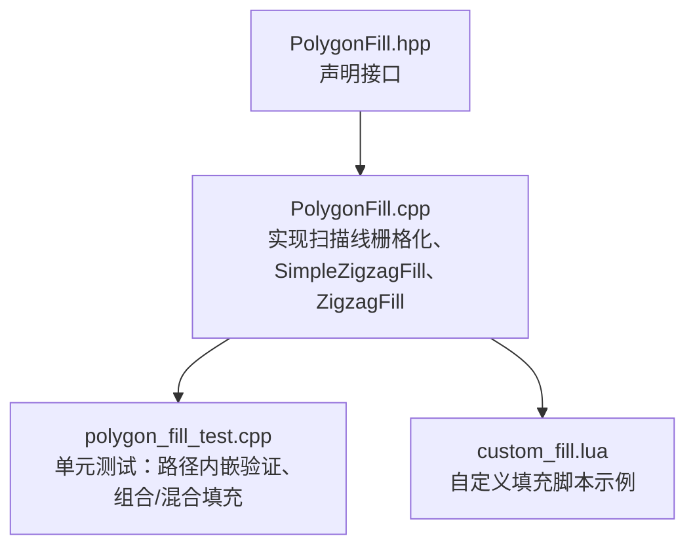
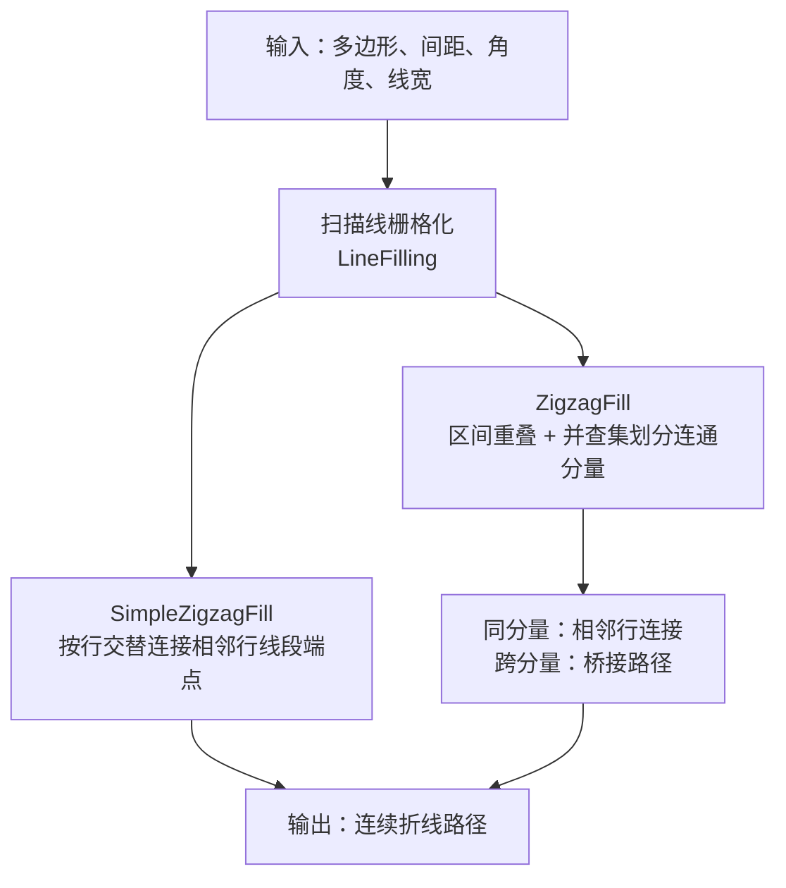
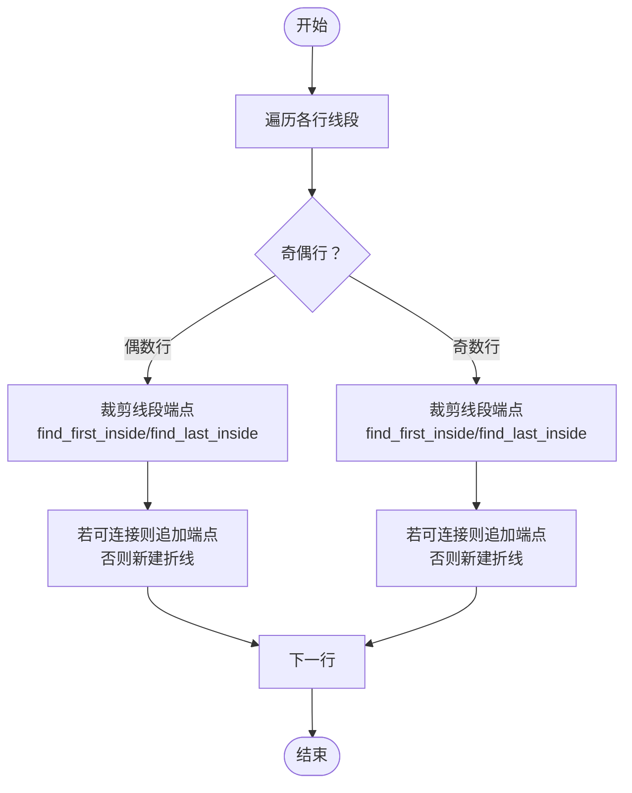
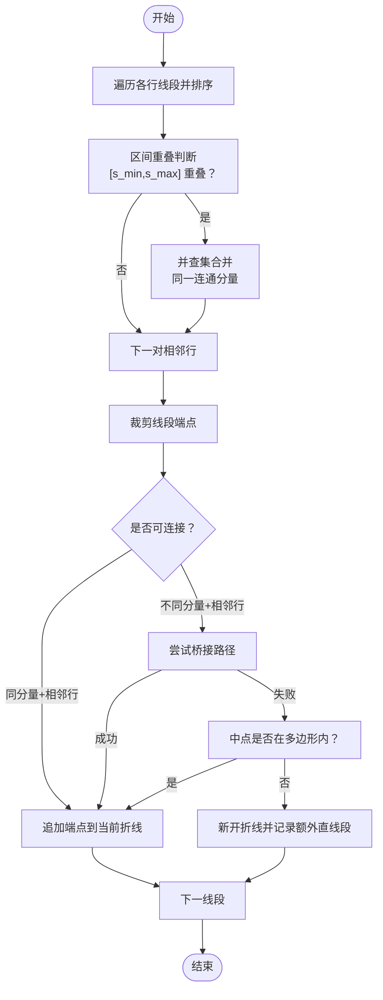
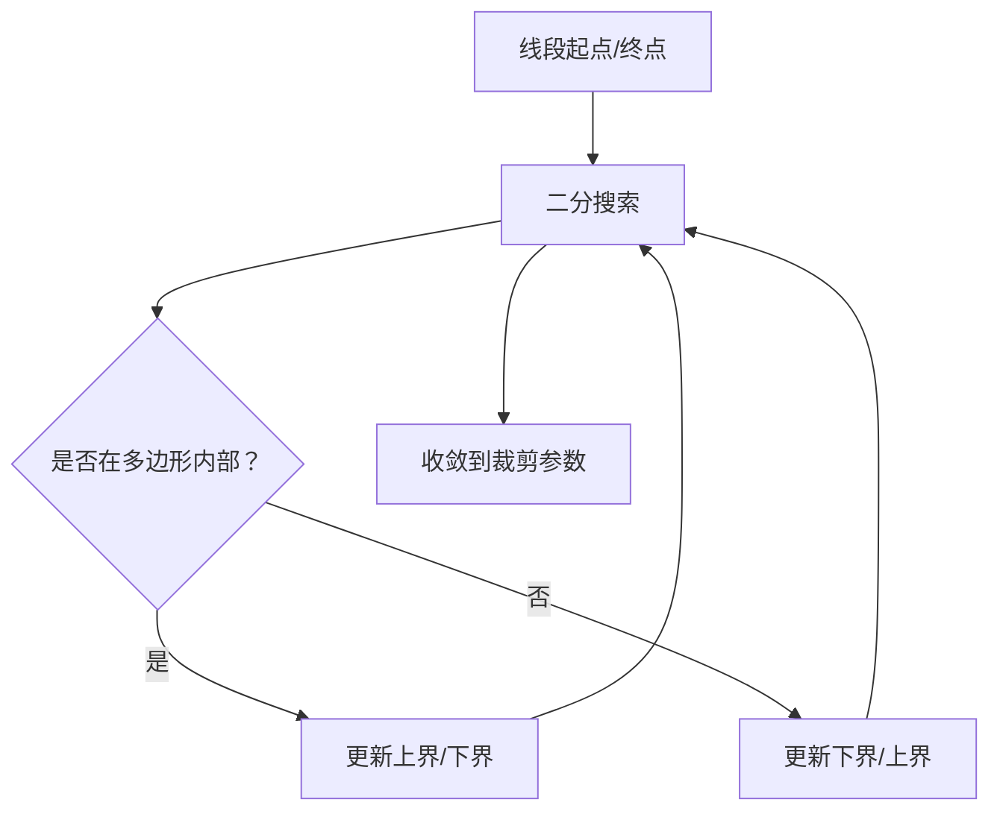
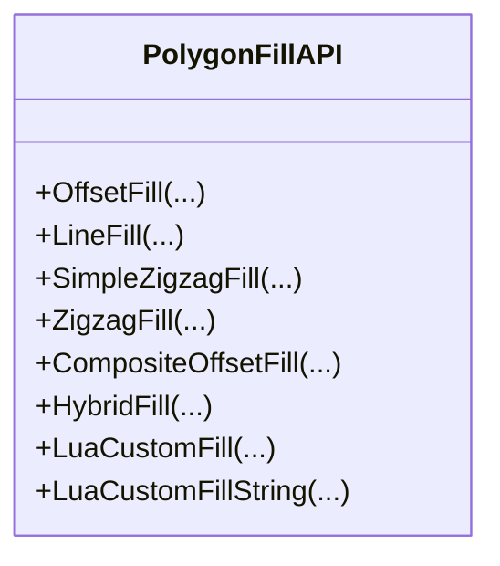
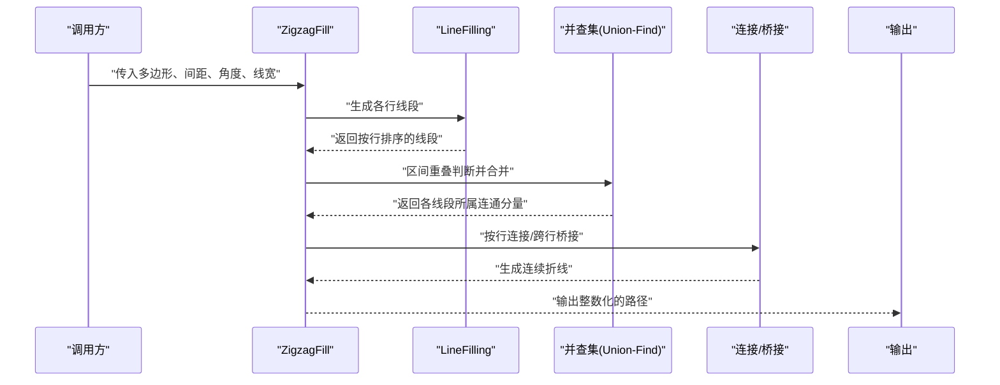
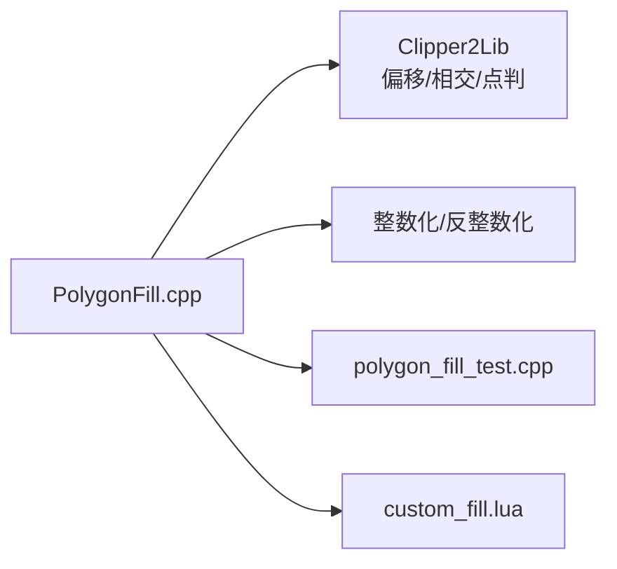

# 锯齿填充

<cite>
**本文引用的文件**
- [PolygonFill.hpp](file://2D/PolygonFill.hpp)
- [PolygonFill.cpp](file://2D/PolygonFill.cpp)
- [polygon_fill_test.cpp](file://tests/PolygonFill/polygon_fill_test.cpp)
- [custom_fill.lua](file://tests/PolygonFill/custom_fill.lua)
</cite>

## 目录
1. [简介](#简介)
2. [项目结构](#项目结构)
3. [核心组件](#核心组件)
4. [架构总览](#架构总览)
5. [详细组件分析](#详细组件分析)
6. [依赖关系分析](#依赖关系分析)
7. [性能考量](#性能考量)
8. [故障排查指南](#故障排查指南)
9. [结论](#结论)
10. [附录](#附录)

## 简介
本文件系统化阐述两种锯齿填充算法：SimpleZigzagFill 与 ZigzagFill 的区别、实现原理与适用场景。重点说明 ZigzagFill 如何通过“连接相邻扫描线上的线段端点”形成连续锯齿路径，从而减少抬笔次数与材料收缩应力；并深入解析其“基于区间重叠的连通性判断与并查集（Union-Find）组件划分”的实现细节。同时对比 SimpleZigzagFill 的简单交替连接策略，强调 ZigzagFill 在复杂轮廓中路径连续性更强的优势，并给出路径端点精确裁剪的实现方式（find_first_inside 与 find_last_inside），以及典型调用方式、参数调优建议与薄壁结构应用案例。

## 项目结构
与锯齿填充相关的核心代码位于 2D 模块的 PolygonFill 组件中，对外暴露统一的填充接口，内部通过扫描线栅格化、区间重叠连通性与桥接路径等策略生成路径。测试用例验证了路径位于多边形内部、不同填充模式的正确性与可选的自定义 Lua 填充脚本。

图表来源
- [PolygonFill.hpp](file://2D/PolygonFill.hpp#L1-L46)
- [PolygonFill.cpp](file://2D/PolygonFill.cpp#L1-L1243)
- [polygon_fill_test.cpp](file://tests/PolygonFill/polygon_fill_test.cpp#L1-L116)
- [custom_fill.lua](file://tests/PolygonFill/custom_fill.lua#L1-L16)

章节来源
- [PolygonFill.hpp](file://2D/PolygonFill.hpp#L1-L46)
- [PolygonFill.cpp](file://2D/PolygonFill.cpp#L1-L1243)

## 核心组件
- 扫描线栅格化（LineFilling）：沿指定角度生成一系列平行线，计算每条线与多边形的交集，得到每行的线段集合。
- SimpleZigzagFill：按行交替方向，连接相邻行线段中心，生成一条连续折线路径。
- ZigzagFill：在 SimpleZigzagFill 基础上，引入“区间重叠连通性 + 并查集（Union-Find）”，对同一连通分量内的线段进行跨行连接，并在跨分量时采用桥接路径，保证路径连续性与路径端点精确裁剪。

章节来源
- [PolygonFill.cpp](file://2D/PolygonFill.cpp#L25-L113)
- [PolygonFill.cpp](file://2D/PolygonFill.cpp#L441-L609)
- [PolygonFill.cpp](file://2D/PolygonFill.cpp#L611-L970)

## 架构总览
下图展示两种锯齿填充的高层流程差异：SimpleZigzagFill 仅考虑行号相邻性；ZigzagFill 进一步引入“区间重叠 + 并查集”划分连通分量，并在跨分量时尝试桥接。

图表来源
- [PolygonFill.cpp](file://2D/PolygonFill.cpp#L25-L113)
- [PolygonFill.cpp](file://2D/PolygonFill.cpp#L441-L609)
- [PolygonFill.cpp](file://2D/PolygonFill.cpp#L611-L970)

## 详细组件分析

### 扫描线栅格化（LineFilling）
- 输入：多边形、间距、角度、线宽。
- 输出：按行组织的线段列表，每行线段按投影坐标排序。
- 关键点：
  - 计算包围盒与投影方向向量，沿法向生成平行线。
  - 将每条平行线与多边形求交，得到线段集合。
  - 对每行线段按投影坐标排序，为后续连接策略提供顺序基础。

章节来源
- [PolygonFill.cpp](file://2D/PolygonFill.cpp#L25-L113)

### SimpleZigzagFill（简单锯齿）
- 连接策略：按行交替方向，将相邻行的线段端点直接连接，形成连续折线。
- 路径端点裁剪：通过二分查找定位线段在多边形内的首尾内侧参数，确保路径始终位于多边形内部。
- 行间连接限制：仅允许在同一行或相邻行之间连接，避免跨多行回环。
- 精确裁剪函数：
  - find_first_inside：从线段起点到终点，二分查找第一个进入多边形内部的参数。
  - find_last_inside：从线段终点到起点，二分查找最后一个仍在多边形内部的参数。
- 优点：实现简单、路径连续性好于独立线段；缺点：在复杂轮廓中可能产生较多抬笔（跨分量连接失败时）。

图表来源
- [PolygonFill.cpp](file://2D/PolygonFill.cpp#L441-L609)

章节来源
- [PolygonFill.cpp](file://2D/PolygonFill.cpp#L441-L609)

### ZigzagFill（区间重叠 + 并查集）
- 连通性判断：对相邻行的线段，比较其在投影方向上的区间 [s_min, s_max] 是否重叠，若重叠则认为属于同一连通分量。
- 并查集（Union-Find）：将同一行内的线段编号映射到全局索引，利用区间重叠建立连通关系，最终得到每个线段所属的连通分量 ID。
- 跨分量连接策略：
  - 同一分量且相邻行：直接连接线段端点。
  - 不同分量且相邻行：尝试桥接路径（从当前折线末尾到下一行线段起始点的路径），若桥接失败则仅当中点在多边形内时连接，否则新开折线并记录额外直线段。
- 路径端点裁剪：同样使用 find_first_inside 与 find_last_inside 精确裁剪线段端点，保证路径完全位于多边形内部。
- 优势：在复杂轮廓中能最大化保持路径连续性，减少抬笔次数，降低材料收缩应力。

图表来源
- [PolygonFill.cpp](file://2D/PolygonFill.cpp#L611-L970)

章节来源
- [PolygonFill.cpp](file://2D/PolygonFill.cpp#L611-L970)

### 路径端点精确裁剪（find_first_inside / find_last_inside）
- 实现思路：在线段上进行二分搜索，逐步缩小至首个/末个位于多边形内部的参数，从而得到精确的裁剪端点。
- 使用场景：在 SimpleZigzagFill 与 ZigzagFill 中均用于裁剪线段端点，确保路径不越界。

图表来源
- [PolygonFill.cpp](file://2D/PolygonFill.cpp#L459-L483)
- [PolygonFill.cpp](file://2D/PolygonFill.cpp#L696-L720)

章节来源
- [PolygonFill.cpp](file://2D/PolygonFill.cpp#L459-L483)
- [PolygonFill.cpp](file://2D/PolygonFill.cpp#L696-L720)

### 类关系与调用序列

#### 类关系图（简化）

图表来源
- [PolygonFill.hpp](file://2D/PolygonFill.hpp#L12-L42)

#### ZigzagFill 调用序列（关键步骤）

图表来源
- [PolygonFill.cpp](file://2D/PolygonFill.cpp#L611-L970)

章节来源
- [PolygonFill.cpp](file://2D/PolygonFill.cpp#L611-L970)

## 依赖关系分析
- 外部几何库：使用 Clipper2Lib 进行多边形偏移、相交与点在多边形内的判定。
- 内部模块：路径输出依赖整数化/反整数化工具，保证数值精度与路径离散化。
- 测试与脚本：测试用例验证路径位于多边形内部；Lua 自定义填充脚本支持外部扩展。

图表来源
- [PolygonFill.cpp](file://2D/PolygonFill.cpp#L1-L1243)
- [polygon_fill_test.cpp](file://tests/PolygonFill/polygon_fill_test.cpp#L1-L116)
- [custom_fill.lua](file://tests/PolygonFill/custom_fill.lua#L1-L16)

章节来源
- [PolygonFill.cpp](file://2D/PolygonFill.cpp#L1-L1243)
- [polygon_fill_test.cpp](file://tests/PolygonFill/polygon_fill_test.cpp#L1-L116)
- [custom_fill.lua](file://tests/PolygonFill/custom_fill.lua#L1-L16)

## 性能考量
- 扫描线数量与线段数量：间距越小，行数越多，线段越多，整体复杂度上升。
- 区间重叠与并查集：相邻行线段的区间重叠判断与合并操作在最坏情况下为 O(R*S^2)，其中 R 为行数，S 为平均每行线段数；并查集近似 O(α(N)) 合并。
- 桥接路径采样：桥接路径会增加额外点数，但能显著提升连续性，减少抬笔。
- 精确裁剪：二分搜索每次迭代常数开销较小，总体影响有限。
- 参数建议：
  - 间距：根据层厚与打印速度权衡，过小导致线段过多，过大影响表面质量。
  - 角度：常用 0°/45°/90°，复杂轮廓可尝试多角度组合。
  - 线宽：与挤出宽度匹配，避免过度稀疏或密集。

[本节为通用性能讨论，无需列出具体文件来源]

## 故障排查指南
- 路径越界：检查 find_first_inside/find_last_inside 是否正确裁剪，确认多边形方向与整数化精度。
- 抬笔过多：在 ZigzagFill 中优先检查区间重叠与并查集连通性，确保相邻行线段有足够重叠；必要时减小间距或调整角度。
- 桥接失败：当跨分量连接失败时，算法会退化为仅当线段中点在多边形内才连接，否则新开折线；可通过增大线宽或调整扫描方向改善。
- 测试验证：使用测试用例验证路径全部位于多边形内部，确保算法正确性。

章节来源
- [polygon_fill_test.cpp](file://tests/PolygonFill/polygon_fill_test.cpp#L1-L57)
- [PolygonFill.cpp](file://2D/PolygonFill.cpp#L696-L720)
- [PolygonFill.cpp](file://2D/PolygonFill.cpp#L849-L940)

## 结论
- SimpleZigzagFill 适合简单轮廓与快速生成，路径连续性良好但可能在复杂轮廓中产生较多抬笔。
- ZigzagFill 通过区间重叠与并查集划分连通分量，并在跨分量时采用桥接路径，显著增强路径连续性，减少抬笔次数，降低材料收缩应力，更适合复杂轮廓与高质量打印。
- 精确的路径端点裁剪（find_first_inside/find_last_inside）是保证路径完全位于多边形内部的关键。
- 参数调优应结合层厚、挤出宽度与打印速度综合考虑，必要时采用多角度组合与桥接策略。

[本节为总结性内容，无需列出具体文件来源]

## 附录

### 典型调用方式与参数说明
- 接口声明（对外）：见 PolygonFill.hpp。
- 典型调用：
  - SimpleZigzagFill：传入多边形、间距、角度、线宽。
  - ZigzagFill：传入多边形、间距、角度、线宽。
  - 可选：通过 CompositeOffsetFill/HybridFill 在偏移基础上选择不同填充模式组合。
- 参数建议：
  - 间距：根据层厚与表面质量需求选择。
  - 角度：0°/45°/90° 或多角度组合。
  - 线宽：与挤出宽度匹配，避免过密或过疏。

章节来源
- [PolygonFill.hpp](file://2D/PolygonFill.hpp#L12-L42)
- [PolygonFill.cpp](file://2D/PolygonFill.cpp#L972-L1021)
- [PolygonFill.cpp](file://2D/PolygonFill.cpp#L1023-L1079)

### 薄壁结构应用案例
- 场景：薄壁结构易出现材料收缩与断裂，需要连续路径减少抬笔与热影响。
- 方案：
  - 采用 ZigzagFill 并开启桥接路径，提高路径连续性。
  - 适当增大线宽与减小间距，保证材料连续供给。
  - 多角度扫描与偏移组合（CompositeOffsetFill/HybridFill）进一步优化填充密度与方向。

章节来源
- [PolygonFill.cpp](file://2D/PolygonFill.cpp#L972-L1021)
- [PolygonFill.cpp](file://2D/PolygonFill.cpp#L1023-L1079)