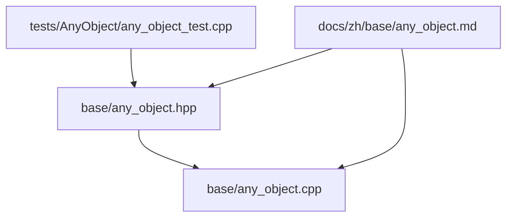
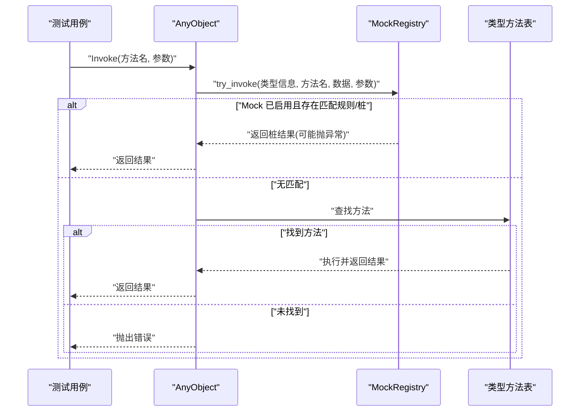
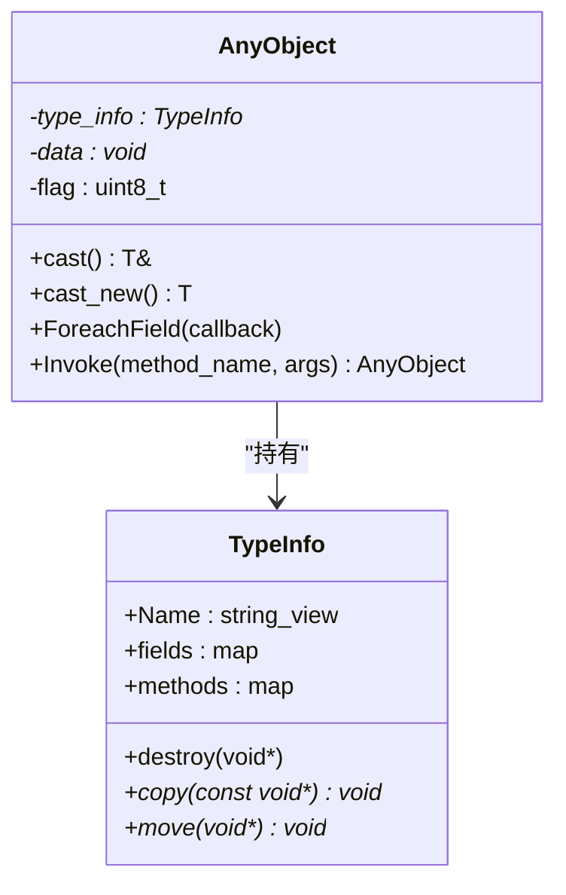
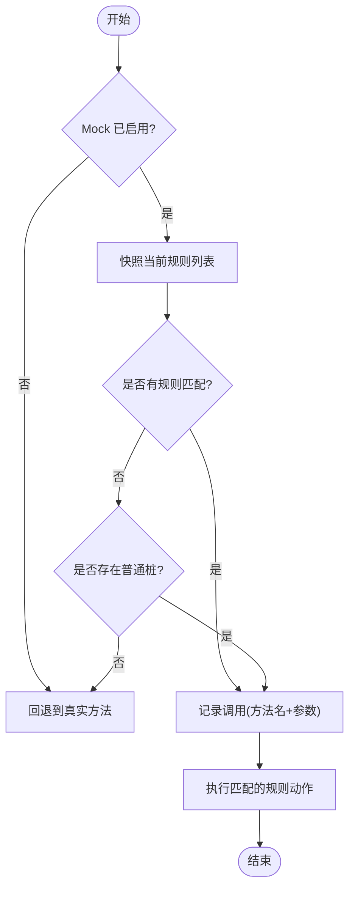
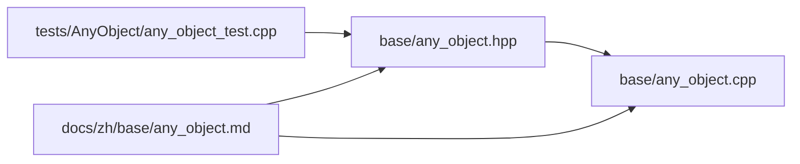

# AnyObject Mock框架

<cite>
**本文引用的文件**
- [base/any_object.hpp](file://base/any_object.hpp)
- [base/any_object.cpp](file://base/any_object.cpp)
- [tests/AnyObject/any_object_test.cpp](file://tests/AnyObject/any_object_test.cpp)
- [docs/zh/base/any_object.md](file://docs/zh/base/any_object.md)
</cite>

## 目录
1. [简介](#简介)
2. [项目结构](#项目结构)
3. [核心组件](#核心组件)
4. [架构总览](#架构总览)
5. [详细组件分析](#详细组件分析)
6. [依赖关系分析](#依赖关系分析)
7. [性能考量](#性能考量)
8. [故障排查指南](#故障排查指南)
9. [结论](#结论)
10. [附录](#附录)

## 简介
本仓库中的 AnyObject 模块不仅提供运行时类型反射与动态方法调用能力，还内置了“Mockit 风格”的测试桩（stub）机制。该 Mock 功能仅在检测到常用测试框架宏或显式启用时编译进入，默认关闭，从而保证生产构建零额外开销。通过统一的 `AnyObject::Invoke` 入口，测试可以拦截任意已注册类型的指定方法，按参数条件选择不同行为、固定返回值或直接抛出异常，并记录调用历史，便于断言。

## 项目结构
围绕 AnyObject 与 Mock 的关键代码分布如下：
- base/any_object.hpp：定义 AnyObject、TypeInfo、以及 Mock 命名空间下的全部桩与规则设施。
- base/any_object.cpp：实现 AnyObject 的生命周期、字段遍历与 Invoke 分派逻辑，并在其中接入 Mock 钩子。
- tests/AnyObject/any_object_test.cpp：覆盖基本用法、虚函数/位域场景、Lua 集成，以及完整的 Mock 行为验证。
- docs/zh/base/any_object.md：中文文档，包含 Mock 启用条件、API 说明与示例。

**图示来源**
- [base/any_object.hpp:1-795](file://base/any_object.hpp#L1-L795)
- [base/any_object.cpp:1-105](file://base/any_object.cpp#L1-L105)
- [tests/AnyObject/any_object_test.cpp:1-504](file://tests/AnyObject/any_object_test.cpp#L1-L504)
- [docs/zh/base/any_object.md:1-627](file://docs/zh/base/any_object.md#L1-L627)

**章节来源**
- [base/any_object.hpp:1-795](file://base/any_object.hpp#L1-L795)
- [base/any_object.cpp:1-105](file://base/any_object.cpp#L1-L105)
- [tests/AnyObject/any_object_test.cpp:1-504](file://tests/AnyObject/any_object_test.cpp#L1-L504)
- [docs/zh/base/any_object.md:1-627](file://docs/zh/base/any_object.md#L1-L627)

## 核心组件
- TypeInfo：描述一个类型的名称、销毁/拷贝/移动回调，以及字段与方法映射表。
- AnyObject：以类型无关的方式持有任意对象实例，支持拷贝/移动语义、字段遍历与动态方法调用。
- MockRegistry：线程安全的桩与规则注册中心，负责在 Invoke 时优先匹配规则与普通桩，未命中则回退到真实方法。
- 动作与谓词工厂：Return/Throw/Do 等动作；AnyArgs/ArgCountIs/ArgAtIs/AllOf/AnyOf/Not 等谓词组合。
- RAII 辅助：ScopedEnable/ScopedStubs 用于作用域内开启 Mock 或隔离桩与调用记录。

**章节来源**
- [base/any_object.hpp:46-109](file://base/any_object.hpp#L46-L109)
- [base/any_object.hpp:111-651](file://base/any_object.hpp#L111-L651)
- [base/any_object.cpp:72-103](file://base/any_object.cpp#L72-L103)

## 架构总览
AnyObject 的动态调用路径如下：
- 构造/赋值/移动：根据 flag 决定是否深拷贝托管数据。
- ForeachField：基于 TypeInfo.fields 迭代字段。
- Invoke：先尝试 Mock 接管；若未接管，则查找并调用对应方法。

**图示来源**
- [base/any_object.cpp:82-103](file://base/any_object.cpp#L82-L103)
- [base/any_object.hpp:270-609](file://base/any_object.hpp#L270-L609)

**章节来源**
- [base/any_object.cpp:82-103](file://base/any_object.cpp#L82-L103)
- [base/any_object.hpp:270-609](file://base/any_object.hpp#L270-L609)

## 详细组件分析

### 类型系统与 AnyObject
- TypeInfo 维护类型元数据与动态方法表，允许为自定义类型扩展方法与字段访问。
- AnyObject 封装原始指针与类型信息，提供类型安全转换 cast/cast_new，以及动态调用接口。
- 针对 std::string 与 std::string_view 提供了特化的 TypeInfo，暴露常用方法如 size/c_str/data/at。

**图示来源**
- [base/any_object.hpp:46-109](file://base/any_object.hpp#L46-L109)
- [base/any_object.hpp:701-791](file://base/any_object.hpp#L701-L791)

**章节来源**
- [base/any_object.hpp:46-109](file://base/any_object.hpp#L46-L109)
- [base/any_object.hpp:701-791](file://base/any_object.hpp#L701-L791)

### Mock 注册中心与优先级
- MockRegistry 使用 (TypeInfo*, method_name) 作为键管理普通桩与规则。
- 规则优先级高于普通桩；同一方法下多条规则按插入顺序评估，首个谓词命中即生效。
- try_invoke 在锁外执行用户谓词与动作，避免死锁；调用记录在动作执行前写入，确保可观测性。

**图示来源**
- [base/any_object.hpp:495-559](file://base/any_object.hpp#L495-L559)

**章节来源**
- [base/any_object.hpp:270-609](file://base/any_object.hpp#L270-L609)

### 动作与谓词工厂
- 动作：Return(value)、Throw(eptr)、ThrowOf<E, Args...>(args...)、Do(callable)。
- 谓词：AnyArgs()、ArgCountIs(n)、ArgAtIs<V>(i, expected)、ArgAtMatches<V>(i, pred)、AllOf/AnyOf/Not。
- 这些工厂可自由组合，形成对参数数量、类型与值的精确匹配策略。

**章节来源**
- [base/any_object.hpp:151-253](file://base/any_object.hpp#L151-L253)

### RAII 辅助与线程安全
- ScopedEnable：进入作用域开启 Mock，退出恢复先前状态。
- ScopedStubs：进入作用域清空所有桩与记录并开启 Mock，退出时清理并恢复状态，适合测试用例隔离。
- 内部互斥保护所有共享状态，谓词与动作在锁外执行，支持并行测试。

**章节来源**
- [base/any_object.hpp:561-609](file://base/any_object.hpp#L561-L609)

### Lua 集成与动态调用
- 测试中展示了将 C++ 类型通过 LuaAnyObject 暴露给 Lua，并通过 AnyObject 进行跨语言动态调用与字段遍历。
- 这体现了 AnyObject 作为统一中间表示的能力，可用于脚本化与插件化场景。

**章节来源**
- [tests/AnyObject/any_object_test.cpp:374-501](file://tests/AnyObject/any_object_test.cpp#L374-L501)

## 依赖关系分析
- any_object.cpp 依赖 any_object.hpp 的类型与 Mock 接口。
- 测试用例依赖 any_object.hpp 提供的 API，并通过自定义 GetTypeInfo 扩展类型系统。
- 文档与测试共同验证 Mock 的行为与优先级。

**图示来源**
- [base/any_object.hpp:1-795](file://base/any_object.hpp#L1-L795)
- [base/any_object.cpp:1-105](file://base/any_object.cpp#L1-L105)
- [tests/AnyObject/any_object_test.cpp:1-504](file://tests/AnyObject/any_object_test.cpp#L1-L504)
- [docs/zh/base/any_object.md:1-627](file://docs/zh/base/any_object.md#L1-L627)

**章节来源**
- [base/any_object.hpp:1-795](file://base/any_object.hpp#L1-L795)
- [base/any_object.cpp:1-105](file://base/any_object.cpp#L1-L105)
- [tests/AnyObject/any_object_test.cpp:1-504](file://tests/AnyObject/any_object_test.cpp#L1-L504)
- [docs/zh/base/any_object.md:1-627](file://docs/zh/base/any_object.md#L1-L627)

## 性能考量
- 默认不启用 Mock：当未检测到测试宏或未显式启用时，Mock 相关代码不会编译进入，Invoke 路径无额外分支。
- 锁粒度与范围：try_invoke 在获取锁后仅做快照与判断，谓词与动作在锁外执行，降低阻塞时间。
- 规则与桩数量：大量规则会增加匹配成本，建议按需拆分与复用规则。
- 调用记录：calls 会复制参数快照，频繁调用时应注意内存分配与拷贝开销。

[本节为通用指导，不直接分析具体文件]

## 故障排查指南
- 方法未找到：当类型信息中没有对应方法时会抛出错误。检查 GetTypeInfo 是否正确注册方法名。
- 类型不匹配：cast 失败会抛出错误。确认参数类型与期望一致，或使用谓词进行更宽松匹配。
- Mock 未生效：确认 Mock 已启用，且规则/桩的键（类型信息与方法名）正确。可使用 call_count/calls 验证是否被记录。
- 并发问题：确保在多线程环境下通过 ScopedStubs 隔离桩与记录，避免交叉污染。

**章节来源**
- [base/any_object.cpp:82-103](file://base/any_object.cpp#L82-L103)
- [base/any_object.hpp:270-609](file://base/any_object.hpp#L270-L609)
- [tests/AnyObject/any_object_test.cpp:188-372](file://tests/AnyObject/any_object_test.cpp#L188-L372)

## 结论
AnyObject 将类型反射、动态调用与测试桩机制整合在一起，既可作为跨语言与插件系统的统一抽象，又能在单元测试中以极小侵入的方式隔离依赖。其设计强调：
- 零开销默认路径（生产构建不引入 Mock）。
- 灵活的规则与谓词组合，满足复杂参数匹配需求。
- 线程安全与作用域隔离，便于并行测试与用例隔离。
- 可扩展的类型系统，支持自定义类型与 Lua 集成。

[本节为总结性内容，不直接分析具体文件]

## 附录
- 启用条件与 API 参考详见中文文档。
- 测试用例覆盖了手动开关、作用域隔离、异常桩、参数依赖规则与组合谓词等关键场景。

**章节来源**
- [docs/zh/base/any_object.md:531-627](file://docs/zh/base/any_object.md#L531-L627)
- [tests/AnyObject/any_object_test.cpp:188-372](file://tests/AnyObject/any_object_test.cpp#L188-L372)