# FDM打印流水线

<cite>
**本文引用的文件**   
- [README.md](file://README.md)
- [CMakeLists.txt](file://CMakeLists.txt)
- [coroutine.hpp](file://base/coroutine.hpp)
- [mesh_slice.hpp](file://LibHsBaSlicer/Slice/mesh_slice.hpp)
- [fdm_pipeline.h](file://DllHsBaSlicer/fdm_pipeline.h)
- [fdm_pipeline.cpp](file://DllHsBaSlicer/fdm_pipeline.cpp)
- [pipeline_convert.h](file://DllHsBaSlicer/pipeline_convert.h)
- [pipeline_convert.cpp](file://DllHsBaSlicer/pipeline_convert.cpp)
- [ModelLoader.hpp](file://preprocess/ModelLoader.hpp)
- [ModelLoader.cpp](file://preprocess/ModelLoader.cpp)
- [FdmSupport.hpp](file://support/FdmSupport.hpp)
- [PolygonFill.hpp](file://2D/PolygonFill.hpp)
- [PointsPath.hpp](file://paths/PointsPath.hpp)
- [GCodePath.hpp](file://paths/gcodepath.hpp)
- [GCodePath.cpp](file://paths/gcodepath.cpp)
- [model_preprocess.hpp](file://LibHsBaSlicer/Preprocess/model_preprocess.hpp)
- [model_preprocess.cpp](file://LibHsBaSlicer/Preprocess/model_preprocess.cpp)
- [fdm_support.hpp](file://LibHsBaSlicer/Support/fdm_support.hpp)
- [polygon_fill.hpp](file://LibHsBaSlicer/Fill/polygon_fill.hpp)
- [path_generator.hpp](file://LibHsBaSlicer/Path/path_generator.hpp)
- [path_generator.cpp](file://LibHsBaSlicer/Path/path_generator.cpp)
- [LuaSupport.hpp](file://support/LuaSupport.hpp)
- [LuaSupport.cpp](file://support/LuaSupport.cpp)
- [my_infill.lua](file://samples/FDM/scripts/my_infill.lua)
- [my_support.lua](file://samples/FDM/scripts/my_support.lua)
- [CMakeLists.txt（LibHsBaSlicer）](file://LibHsBaSlicer/CMakeLists.txt)
- [CMakeLists.txt（paths）](file://paths/CMakeLists.txt)
- [pipeline_types.h](file://pipelinetypes/pipeline_types.h)
- [hsba_slicer.cppm](file://ModuleHsBaSlicer/hsba_slicer.cppm)
- [fdm_pipeline.proto](file://proto/fdm_pipeline.proto)
- [sla_pipeline.proto](file://proto/sla_pipeline.proto)
- [PipelineConfig2Msg.hpp](file://convert/PipelineConfig2Msg.hpp)
- [PipelineConfig2Msg.cpp](file://convert/PipelineConfig2Msg.cpp)
- [Msg2PipelineConfig.hpp](file://convert/Msg2PipelineConfig.hpp)
- [Msg2PipelineConfig.cpp](file://convert/Msg2PipelineConfig.cpp)
</cite>

## 更新摘要
**所做更改**
- 新增GCodePath类替代PointsPath，支持多固件目标输出（Marlin、RepRap、Klipper）
- 增强打印机配置系统，包含喷嘴直径、耗材直径、温度控制、回抽参数和速度设置
- 更新路径生成逻辑，使用GenerateGCodePathV2函数替代原有的GenerateGCodePath
- 完善C API和模块接口以支持新的固件类型和打印机配置

## 目录
1. [简介](#简介)
2. [项目结构](#项目结构)
3. [核心组件](#核心组件)
4. [架构总览](#架构总览)
5. [详细组件分析](#详细组件分析)
6. [依赖关系分析](#依赖关系分析)
7. [性能考虑](#性能考虑)
8. [故障排查指南](#故障排查指南)
9. [结论](#结论)
10. [附录](#附录)

## 简介
本项目为面向FDM（熔融沉积成型）的切片与路径生成系统，提供从模型预处理、切片、支撑、填充到G-code路径生成的完整流水线。上层通过C兼容API暴露同步与异步接口，内部基于C++20协程实现分步执行与进度回调，便于集成到桌面或移动端应用。

**更新** 系统现已支持通过Protobuf进行配置和结果的跨语言序列化交换，新增完整的C API转换函数，支持多种编程语言的数据格式互操作。每个Pipeline实例拥有独立的模型池，避免多次运行时的模型名冲突问题，并增强了Lua脚本自定义算法的支持能力。**最新改进**：路径生成系统已升级为GCodePath类，支持多固件目标输出和增强的打印机配置管理。

## 项目结构
整体采用分层模块化设计：
- base/utils：基础类型、工具与协程基础设施
- preprocess/support/2D/paths：底层算法模块（模型加载、支撑、填充、路径）
- convert：Protobuf消息与C结构体之间的转换层
- proto：Protobuf定义文件，支持多语言代码生成
- LibHsBaSlicer：对外静态/动态库封装层，统一调用底层模块
- DllHsBaSlicer：最终导出DLL，提供C API与协程驱动的全流程Pipeline

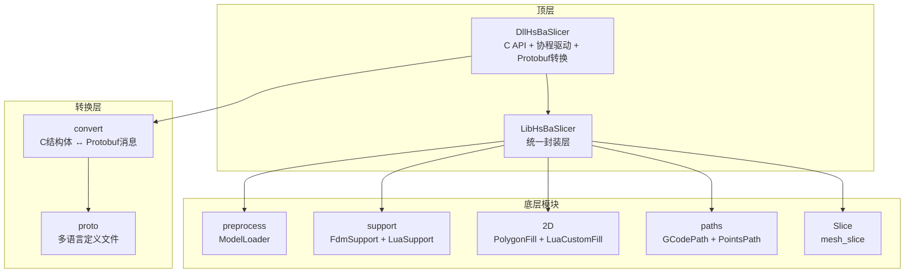

**图表来源**
- [CMakeLists.txt:304-327](file://CMakeLists.txt#L304-L327)
- [CMakeLists.txt（LibHsBaSlicer）:1-59](file://LibHsBaSlicer/CMakeLists.txt#L1-L59)
- [proto/CMakeLists.txt:1-37](file://proto/CMakeLists.txt#L1-L37)

**章节来源**
- [README.md:1-40](file://README.md#L1-L40)
- [CMakeLists.txt:304-327](file://CMakeLists.txt#L304-L327)

## 核心组件
- 协程基础设施：Task/Generator/Executor，提供异步任务、逐层迭代与调度能力
- 预处理封装：LoadModel/GetModelInfo/变换操作等，现支持Pipeline独立模型池
- 切片接口：按Z高度进行安全/不安全切片
- 支撑生成：柱状/树状/蜂窝三种模式，支持Lua自定义算法
- 填充生成：线型/锯齿/高级锯齿及带边框复合填充，支持Lua自定义算法
- **更新** 路径生成：GCodePath类支持多固件目标输出，PointsPath保持向后兼容
- **新增** Protobuf转换层：提供C结构体与Protobuf消息的双向转换，支持跨语言数据交换

**章节来源**
- [coroutine.hpp:1-120](file://base/coroutine.hpp#L1-L120)
- [model_preprocess.hpp:1-88](file://LibHsBaSlicer/Preprocess/model_preprocess.hpp#L1-L88)
- [mesh_slice.hpp:1-28](file://LibHsBaSlicer/Slice/mesh_slice.hpp#L1-L28)
- [fdm_support.hpp:1-36](file://LibHsBaSlicer/Support/fdm_support.hpp#L1-L36)
- [polygon_fill.hpp:1-36](file://LibHsBaSlicer/Fill/polygon_fill.hpp#L1-L36)
- [path_generator.hpp:1-74](file://LibHsBaSlicer/Path/path_generator.hpp#L1-L74)
- [gcodepath.hpp:1-83](file://paths/gcodepath.hpp#L1-L83)
- [pipeline_convert.h:1-124](file://DllHsBaSlicer/pipeline_convert.h#L1-L124)

## 架构总览
下图展示了C API到内部协程流水线的调用链，以及新增的GCodePath类和Protobuf转换层在跨语言集成中的作用。

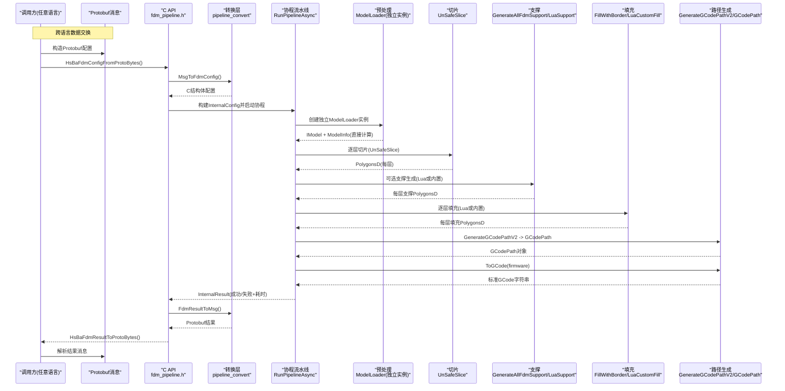

**图表来源**
- [fdm_pipeline.h:94-141](file://DllHsBaSlicer/fdm_pipeline.h#L94-L141)
- [pipeline_convert.h:21-59](file://DllHsBaSlicer/pipeline_convert.h#L21-L59)
- [pipeline_convert.cpp:23-99](file://DllHsBaSlicer/pipeline_convert.cpp#L23-L99)
- [Msg2PipelineConfig.hpp:14-22](file://convert/Msg2PipelineConfig.hpp#L14-22)
- [PipelineConfig2Msg.hpp:14-24](file://convert/PipelineConfig2Msg.hpp#L14-24)

## 详细组件分析

### 协程基础设施（Task/Generator/Executor）
- Task<T>：封装异步任务结果与异常传播，支持then/catching/finally回调链
- Generator<T>：用于逐层yield数据，适合"切片->支撑/填充"的流式处理
- Executor：默认AsyncExecutor，可替换为NoopExecutor或其他调度器

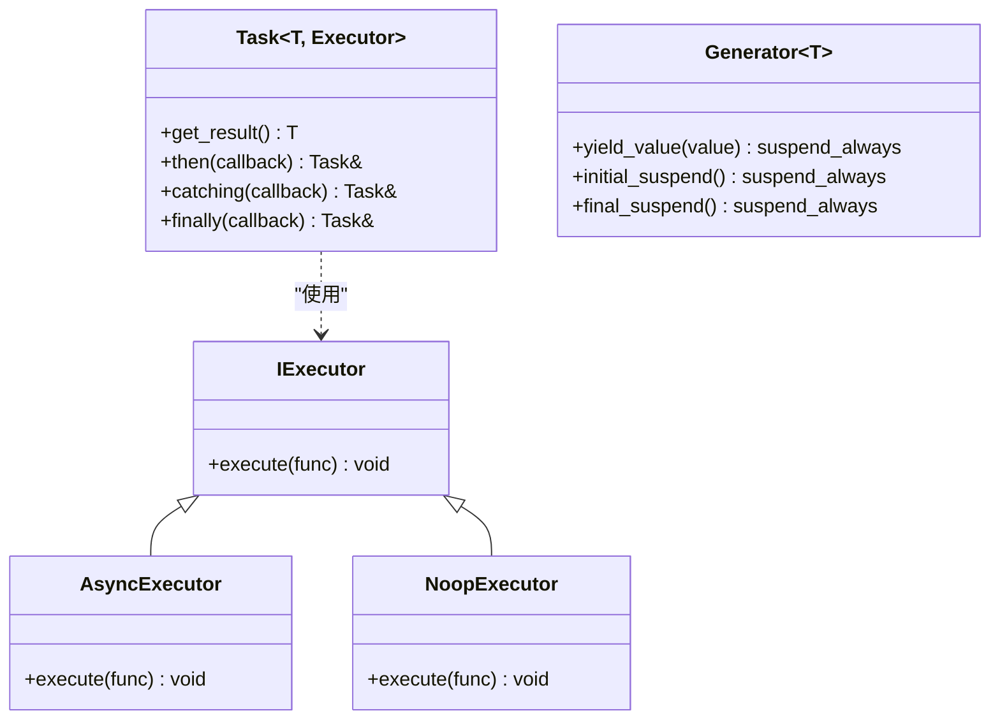

**图表来源**
- [coroutine.hpp:42-66](file://base/coroutine.hpp#L42-66)
- [coroutine.hpp:200-377](file://base/coroutine.hpp#L200-377)
- [coroutine.hpp:779-800](file://base/coroutine.hpp#L779-800)

**章节来源**
- [coroutine.hpp:1-120](file://base/coroutine.hpp#L1-L120)
- [coroutine.hpp:200-377](file://base/coroutine.hpp#L200-L377)
- [coroutine.hpp:779-800](file://base/coroutine.hpp#L779-L800)

### 预处理封装（LibHsBaSlicer::Preprocess）
- LoadModel/GetModel：基于命名对象池管理模型生命周期
- 变换操作：Translate/Rotate/Scale
- GetModelInfo：返回包围盒与体积等信息

**更新** Pipeline现在使用独立的ModelLoader实例，避免了全局线程局部存储带来的模型名冲突问题。

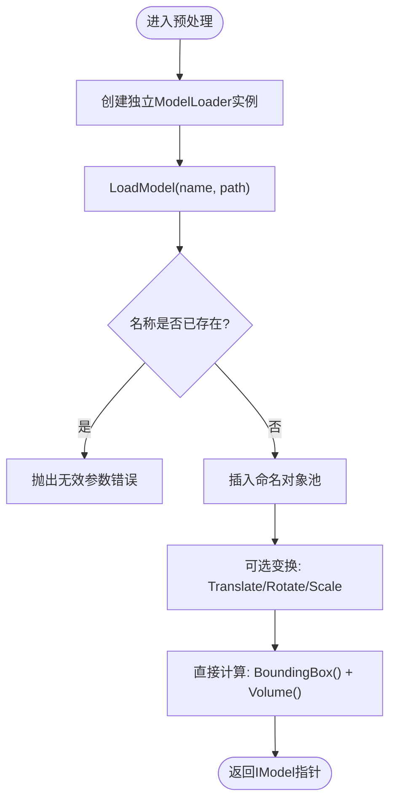

**图表来源**
- [model_preprocess.hpp:35-77](file://LibHsBaSlicer/Preprocess/model_preprocess.hpp#L35-L77)
- [ModelLoader.hpp:49-82](file://preprocess/ModelLoader.hpp#L49-L82)
- [fdm_pipeline.cpp:211-228](file://DllHsBaSlicer/fdm_pipeline.cpp#L211-L228)

**章节来源**
- [model_preprocess.hpp:1-88](file://LibHsBaSlicer/Preprocess/model_preprocess.hpp#L1-L88)
- [ModelLoader.hpp:19-82](file://preprocess/ModelLoader.hpp#L19-L82)
- [model_preprocess.cpp:1-56](file://LibHsBaSlicer/Preprocess/model_preprocess.cpp#L1-L56)

### Protobuf转换层（新增）

**新功能** 系统新增了完整的Protobuf转换层，支持C结构体与Protobuf消息的双向转换，实现跨语言数据交换。

#### C API转换函数
- `HsBaFdmConfigFromProtoBytes`：从Protobuf字节流反序列化为FDM配置
- `HsBaFdmConfigToProtoBytes`：将FDM配置序列化为Protobuf字节流
- `HsBaFdmResultFromProtoBytes`：从Protobuf字节流反序列化为FDM结果
- `HsBaFdmResultToProtoBytes`：将FDM结果序列化为Protobuf字节流
- `HsBaFreeFdmConfigStrings`：释放配置中的动态分配字符串内存

#### Protobuf消息定义
- `msg_fdm_pipeline_config`：FDM流水线配置消息
- `msg_fdm_pipe_result`：FDM流水线结果消息
- `msg_fdm_filltype`：填充类型枚举
- `msg_fdm_support_pattern`：支撑模式枚举

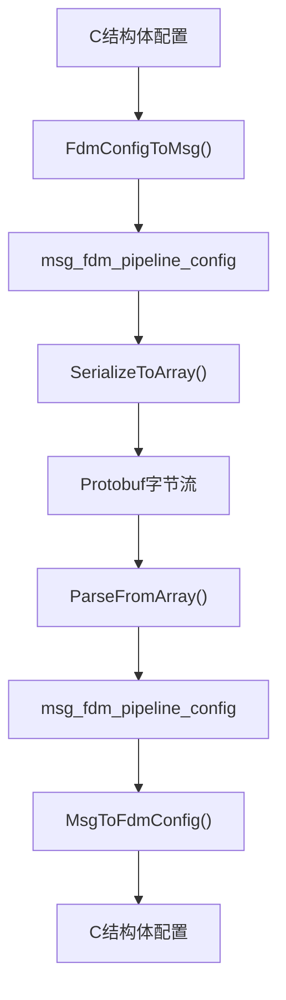

**图表来源**
- [pipeline_convert.cpp:23-60](file://DllHsBaSlicer/pipeline_convert.cpp#L23-L60)
- [PipelineConfig2Msg.cpp:6-48](file://convert/PipelineConfig2Msg.cpp#L6-L48)
- [Msg2PipelineConfig.cpp:27-64](file://convert/Msg2PipelineConfig.cpp#L27-L64)
- [fdm_pipeline.proto:19-54](file://proto/fdm_pipeline.proto#L19-L54)

**章节来源**
- [pipeline_convert.h:21-59](file://DllHsBaSlicer/pipeline_convert.h#L21-L59)
- [pipeline_convert.cpp:23-99](file://DllHsBaSlicer/pipeline_convert.cpp#L23-L99)
- [PipelineConfig2Msg.hpp:14-24](file://convert/PipelineConfig2Msg.hpp#L14-L24)
- [PipelineConfig2Msg.cpp:6-59](file://convert/PipelineConfig2Msg.cpp#L6-L59)
- [Msg2PipelineConfig.hpp:14-32](file://convert/Msg2PipelineConfig.hpp#L14-L32)
- [Msg2PipelineConfig.cpp:27-73](file://convert/Msg2PipelineConfig.cpp#L27-L73)
- [fdm_pipeline.proto:1-63](file://proto/fdm_pipeline.proto#L1-L63)

### 切片接口（LibHsBaSlicer::Slice）
- Slice/UnSafeSlice：按Z高度切片，前者忽略不封闭轮廓，后者包含
- Lua扩展：支持脚本化切片策略

**章节来源**
- [mesh_slice.hpp:17-24](file://LibHsBaSlicer/Slice/mesh_slice.hpp#L17-L24)

### 支撑生成（LibHsBaSlicer::Support）
- GenerateFdmSupport/GenerateAllFdmSupport：单层/全层支撑生成
- 底层实现：FdmPlaneSupport/FdmTreeSupport/FdmHoneycombSupport
- **新增** LuaSupport类：支持完全自定义的支撑生成算法

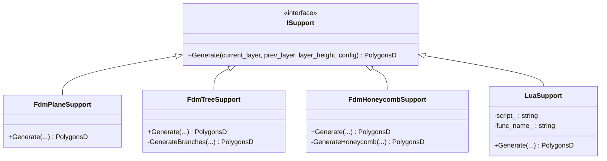

**图表来源**
- [FdmSupport.hpp:15-59](file://support/FdmSupport.hpp#L15-59)
- [fdm_support.hpp:21-31](file://LibHsBaSlicer/Support/fdm_support.hpp#L21-L31)
- [LuaSupport.hpp:32-69](file://support/LuaSupport.hpp#L32-L69)

**章节来源**
- [FdmSupport.hpp:1-63](file://support/FdmSupport.hpp#L1-L63)
- [fdm_support.hpp:1-36](file://LibHsBaSlicer/Support/fdm_support.hpp#L1-L36)
- [LuaSupport.hpp:1-73](file://support/LuaSupport.hpp#L1-L73)
- [LuaSupport.cpp:1-162](file://support/LuaSupport.cpp#L1-L162)

### 填充生成（LibHsBaSlicer::Fill）
- FillPolygon/FillWithBorder：线型/锯齿/高级锯齿填充，支持外边框偏移
- 底层算法：LineFill/SimpleZigzagFill/ZigzagFill/CompositeOffsetFill/HybridFill
- **新增** LuaCustomFill/LuaCustomFillString：支持Lua脚本自定义填充算法

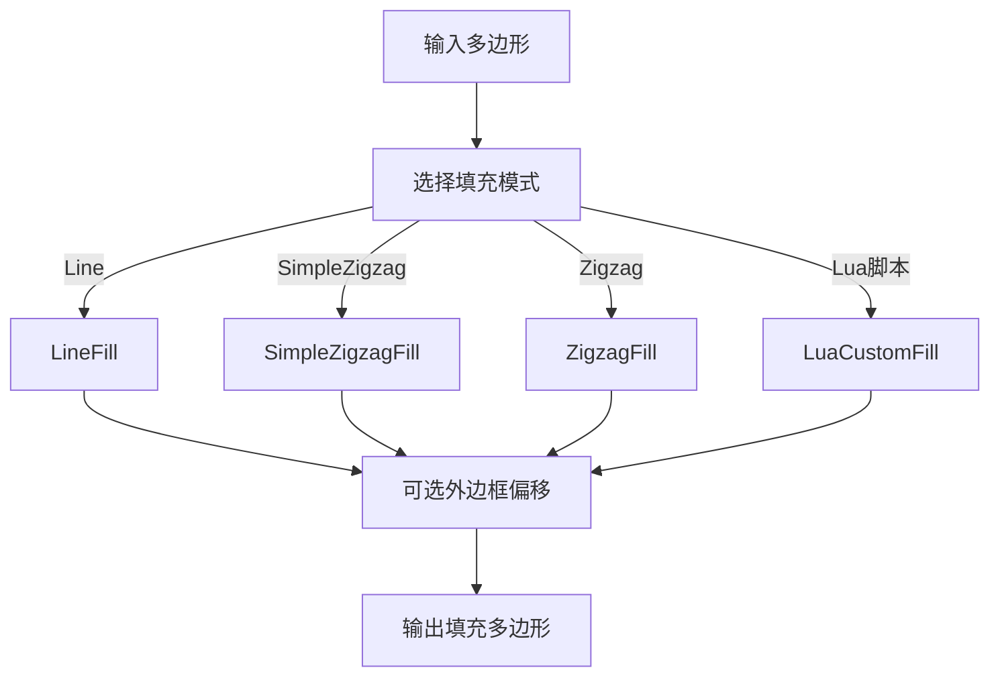

**图表来源**
- [polygon_fill.hpp:19-31](file://LibHsBaSlicer/Fill/polygon_fill.hpp#L19-L31)
- [PolygonFill.hpp:23-98](file://2D/PolygonFill.hpp#L23-L98)
- [PolygonFill.hpp:111-126](file://2D/PolygonFill.hpp#L111-L126)

**章节来源**
- [polygon_fill.hpp:1-36](file://LibHsBaSlicer/Fill/polygon_fill.hpp#L1-L36)
- [PolygonFill.hpp:1-130](file://2D/PolygonFill.hpp#L1-L130)

### 路径生成（LibHsBaSlicer::Path）

**重大更新** 路径生成系统已全面升级，新增GCodePath类替代传统的PointsPath，支持多固件目标输出。

#### GCodePath类（新增）
- **继承LayersPath**：保留层数据存储和Lua扩展能力
- **多固件支持**：支持Marlin、RepRap/RRF、Klipper三种主流固件
- **增强配置**：包含喷嘴直径、耗材直径、温度控制、回抽参数等完整打印机配置
- **标准GCode输出**：根据固件类型生成符合规范的GCode头部、层数据和尾部命令

#### 固件类型支持
- **Marlin**：最常用FDM固件，支持标准M104/M109/M140/M190温度命令
- **RepRap/RRF**：支持额外风扇控制和显式挤出模式切换
- **Klipper**：支持压力前馈、速度流量百分比和专用风扇控制

#### 打印机配置参数
```cpp
struct GCodePrinterConfig {
    float nozzle_diameter = 0.4f;       // 喷嘴直径(mm)
    float filament_diameter = 1.75f;    // 耗材直径(mm)
    float nozzle_temp = 200.0f;         // 喷嘴温度(°C)
    float bed_temp = 60.0f;             // 热床温度(°C)
    float retract_length = 1.0f;        // 回抽长度(mm)
    float retract_speed = 40.0f;        // 回抽速度(mm/s)
    float print_speed = 50.0f;          // 打印速度(mm/s)
    float travel_speed = 100.0f;        // 移动速度(mm/s)
    float first_layer_speed = 20.0f;    // 首层速度(mm/s)
    float layer_height = 0.2f;          // 层高(mm)
    float line_width = 0.4f;            // 线宽(mm)
    float extrusion_multiplier = 1.0f;  // 挤出倍率
    bool relative_extrusion = false;    // 相对挤出(M83 vs M82)
    bool enable_retraction = true;      // 启用回抽
};
```

#### GenerateGCodePathV2函数（新增）
- 替代原有的GenerateGCodePath函数
- 接受GCodePrinterConfig参数进行打印机配置
- 返回GCodePath对象而非PointsPath
- 保持向后兼容性，原函数仍可使用

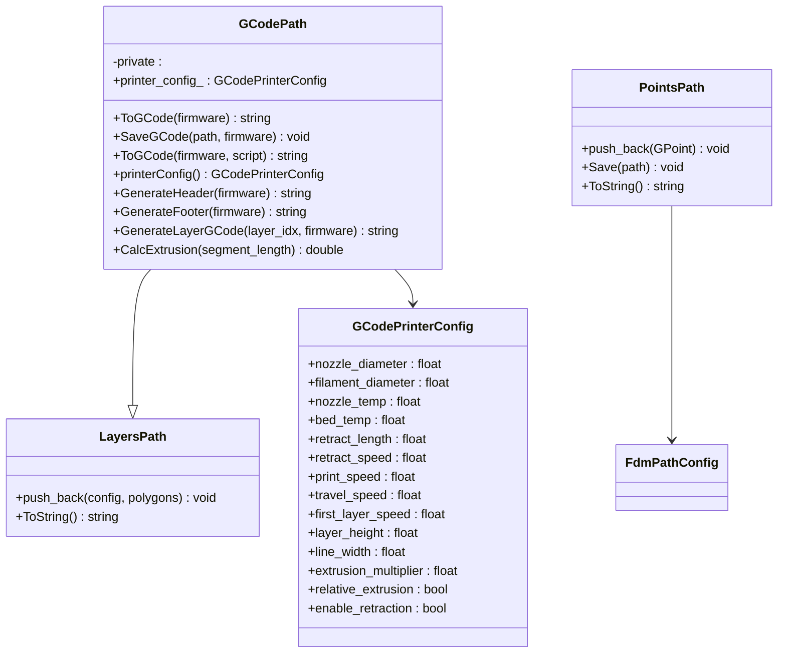

**图表来源**
- [gcodepath.hpp:49-78](file://paths/gcodepath.hpp#L49-L78)
- [layerspath.hpp:1-50](file://paths/layerspath.hpp#L1-L50)
- [pointspath.hpp:46-72](file://paths/pointspath.hpp#L46-L72)
- [gcodepath.hpp:27-43](file://paths/gcodepath.hpp#L27-L43)

**章节来源**
- [path_generator.hpp:1-74](file://LibHsBaSlicer/Path/path_generator.hpp#L1-L74)
- [path_generator.cpp:1-113](file://LibHsBaSlicer/Path/path_generator.cpp#L1-L113)
- [gcodepath.hpp:1-83](file://paths/gcodepath.hpp#L1-L83)
- [gcodepath.cpp:1-377](file://paths/gcodepath.cpp#L1-L377)
- [pointspath.hpp:1-77](file://paths/pointspath.hpp#L1-L77)

### 全流程协程流水线（DllHsBaSlicer）
- C API：HsBaCreateDefaultConfig/HsBaRunFdmPipeline/HsBaRunFdmPipelineAsync/HsBaFreePipelineResult
- 协程核心：RunPipelineAsync，分阶段推进并报告进度
- 内存管理：OwnedCString RAII守卫确保C字符串正确释放

**更新** 流水线现在在每个协程中创建独立的ModelLoader实例，并使用GenerateGCodePathV2和GCodePath进行路径生成。

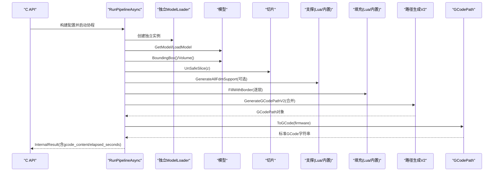

**图表来源**
- [fdm_pipeline.h:94-141](file://DllHsBaSlicer/fdm_pipeline.h#L94-L141)
- [fdm_pipeline.cpp:200-410](file://DllHsBaSlicer/fdm_pipeline.cpp#L200-L410)

**章节来源**
- [fdm_pipeline.h:1-147](file://DllHsBaSlicer/fdm_pipeline.h#L1-L147)
- [fdm_pipeline.cpp:1-410](file://DllHsBaSlicer/fdm_pipeline.cpp#L1-L410)

### Lua自定义算法支持

**新增功能** 系统现在支持通过Lua脚本完全自定义填充和支撑生成算法，提供灵活的扩展机制。

#### 填充生成Lua支持
- `LuaCustomFill`：从文件加载Lua脚本生成自定义填充
- `LuaCustomFillString`：从字符串加载内联Lua脚本
- 支持全局变量：`current_layer`、`layer_index`、`layer_height`、`config`
- 提供PolygonOperations工具函数集

#### 支撑生成Lua支持
- `LuaSupport`类：完整的Lua支撑生成器
- 支持全局变量：`current_layer`、`prev_layer`、`layer_height`、`config`
- 提供Support模块：内置支撑生成器接口
- 支持多种支撑模式：平面、树状、蜂窝

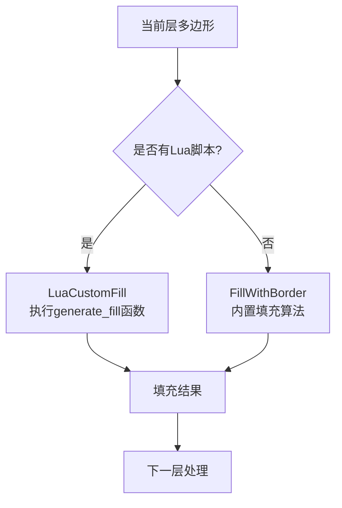

**图表来源**
- [fdm_pipeline.cpp:287-327](file://DllHsBaSlicer/fdm_pipeline.cpp#L287-L327)
- [PolygonFill.hpp:111-126](file://2D/PolygonFill.hpp#L111-L126)
- [LuaSupport.hpp:32-69](file://support/LuaSupport.hpp#L32-L69)

**章节来源**
- [fdm_pipeline.cpp:287-327](file://DllHsBaSlicer/fdm_pipeline.cpp#L287-L327)
- [PolygonFill.hpp:111-126](file://2D/PolygonFill.hpp#L111-L126)
- [LuaSupport.hpp:1-73](file://support/LuaSupport.hpp#L1-L73)
- [my_infill.lua:1-40](file://samples/FDM/scripts/my_infill.lua#L1-L40)
- [my_support.lua:1-83](file://samples/FDM/scripts/my_support.lua#L1-L83)

### C API和模块接口更新

**更新** C API和模块接口已适配新的GCodePath系统和固件类型支持。

#### C API更新
- `HsBaGCodeFirmware_t`枚举：新增HSBA_GCODE_MARLIN、HSBA_GCODE_REPRAP、HSBA_GCODE_KLIPPER
- `HsBaFdmPipelineConfig_t`结构体：新增打印机配置字段
- `HsBaFdmConfigDefault()`：初始化新字段默认值

#### 模块接口更新
- `FdmPipeline::generatePath`：返回类型为`std::unique_ptr<GCodePath>`
- `FdmPipeline::run`：使用`ToGCode(firmware)`输出GCode
- 新增类型别名：`GCodeFirmware`、`GCodePrinterConfig`

**章节来源**
- [pipeline_types.h:46-51](file://pipelinetypes/pipeline_types.h#L46-L51)
- [pipeline_types.h:92-100](file://pipelinetypes/pipeline_types.h#L92-L100)
- [pipeline_types.h:317-357](file://pipelinetypes/pipeline_types.h#L317-L357)
- [hsba_slicer.cppm:429-454](file://ModuleHsBaSlicer/hsba_slicer.cppm#L429-L454)

## 依赖关系分析
- LibHsBaSlicer依赖：
  - HsBaSlicerBase/HsBaSlicerUtils/HsBaSlicerMesh/HsBaSlicer2D/HsBaPreprocess/HsBaSupport/HsBaPaths
  - 可选CAD内核（非移动平台）
- DllHsBaSlicer依赖：
  - LibHsBaSlicer所有封装模块
  - base/coroutine.hpp（协程基础设施）
  - **新增** protobuf转换层（convert/*）
  - **新增** protobuf定义文件（proto/*.proto）

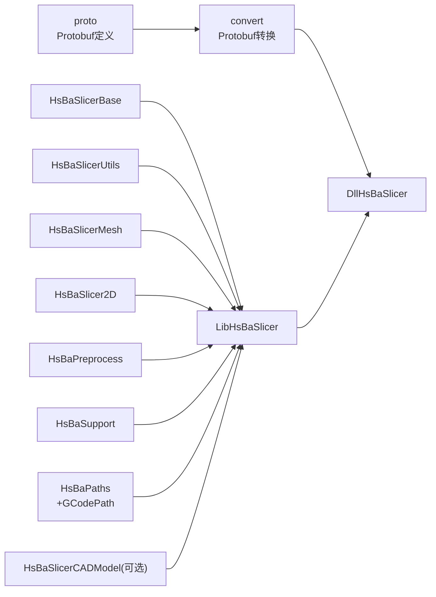

**图表来源**
- [CMakeLists.txt（LibHsBaSlicer）:37-50](file://LibHsBaSlicer/CMakeLists.txt#L37-L50)
- [CMakeLists.txt:304-327](file://CMakeLists.txt#L304-L327)
- [proto/CMakeLists.txt:1-37](file://proto/CMakeLists.txt#L1-L37)
- [paths/CMakeLists.txt:1-19](file://paths/CMakeLists.txt#L1-L19)

**章节来源**
- [CMakeLists.txt:304-327](file://CMakeLists.txt#L304-L327)
- [CMakeLists.txt（LibHsBaSlicer）:1-59](file://LibHsBaSlicer/CMakeLists.txt#L1-L59)
- [proto/CMakeLists.txt:1-37](file://proto/CMakeLists.txt#L1-L37)
- [paths/CMakeLists.txt:1-19](file://paths/CMakeLists.txt#L1-L19)

## 性能考虑
- 协程分步执行：避免阻塞主线程，便于UI更新与取消
- 逐层并行潜力：当前实现为顺序推进，未来可将支撑/填充改为基于Generator的并发处理
- 内存分配：OwnedCString RAII减少泄漏风险；建议对大模型启用对象池复用
- 数值精度：整数化/反整数化在填充前后进行，注意累积误差
- **更新** 独立模型池减少了跨Pipeline的内存竞争，提高了并发安全性
- **新增** Protobuf序列化优化：使用ByteSizeLong预分配缓冲区，避免重复内存分配
- **新增** GCodePath优化：按需生成固件特定GCode，避免不必要的字符串拼接

[本节为通用指导，无需源码引用]

## 故障排查指南
- 模型加载失败：检查文件路径与格式支持；确认命名对象池容量与唯一性
- 层高计算异常：当模型高度<=0时返回0层；调整first_layer_height与layer_height
- 支撑未生成：确认enable_support开关与overhang_angle阈值
- 填充为空：检查输入多边形是否为空或仅含开放轮廓
- **更新** G-code生成失败：检查LayerPathData中各层数据完整性与单位设置；确认GCodePath配置正确
- **新增** 固件类型错误：检查GCodeFirmware枚举值是否正确映射
- **新增** 打印机配置问题：验证喷嘴直径、耗材直径等参数合理性
- **新增** Protobuf转换失败：检查消息字段映射是否正确；确认版本兼容性
- **新增** 跨语言集成问题：验证Protobuf定义文件版本；检查字节序和编码格式
- **新增** Lua脚本错误：检查脚本语法和函数名称；确认全局变量是否正确传递

**章节来源**
- [fdm_pipeline.cpp:91-131](file://DllHsBaSlicer/fdm_pipeline.cpp#L91-L131)
- [fdm_pipeline.cpp:200-410](file://DllHsBaSlicer/fdm_pipeline.cpp#L200-L410)
- [pipeline_convert.cpp:23-99](file://DllHsBaSlicer/pipeline_convert.cpp#L23-L99)

## 结论
本方案以协程为核心，将FDM流水线拆分为清晰阶段，并通过C API提供跨语言集成能力。LibHsBaSlicer作为统一封装层屏蔽底层差异，DllHsBaSlicer负责对外暴露稳定接口。最新改进包括Pipeline独立模型池以避免并发冲突，Lua脚本支持的灵活扩展机制，完整的Protobuf转换层实现跨语言数据交换，以及**全新的GCodePath系统支持多固件目标输出**。后续可在支撑/填充阶段引入逐层并行以提升吞吐，同时完善错误码与诊断日志。

[本节为总结，无需源码引用]

## 附录
- 构建与依赖：参考顶层CMakeLists与README中的平台说明
- 单元测试：tests目录下包含多项功能验证用例
- **新增** Protobuf多语言支持：支持C++、Java、Python、PHP等多种语言的代码生成
- **新增** Lua脚本示例：samples/FDM/scripts/目录下提供填充和支撑的Lua脚本示例
- **新增** 跨语言集成示例：通过C API转换函数实现不同编程语言间的配置和结果交换
- **新增** GCodePath固件支持：Marlin、RepRap/RRF、Klipper三种主流固件的标准GCode输出
- **新增** 打印机配置模板：完整的喷嘴、耗材、温度、回抽等参数配置示例

**章节来源**
- [README.md:41-194](file://README.md#L41-L194)
- [CMakeLists.txt:330-366](file://CMakeLists.txt#L330-L366)
- [proto/CMakeLists.txt:1-99](file://proto/CMakeLists.txt#L1-L99)
- [my_infill.lua:1-40](file://samples/FDM/scripts/my_infill.lua#L1-L40)
- [my_support.lua:1-83](file://samples/FDM/scripts/my_support.lua#L1-L83)
- [gcodepath.hpp:1-83](file://paths/gcodepath.hpp#L1-L83)
- [gcodepath.cpp:1-377](file://paths/gcodepath.cpp#L1-L377)