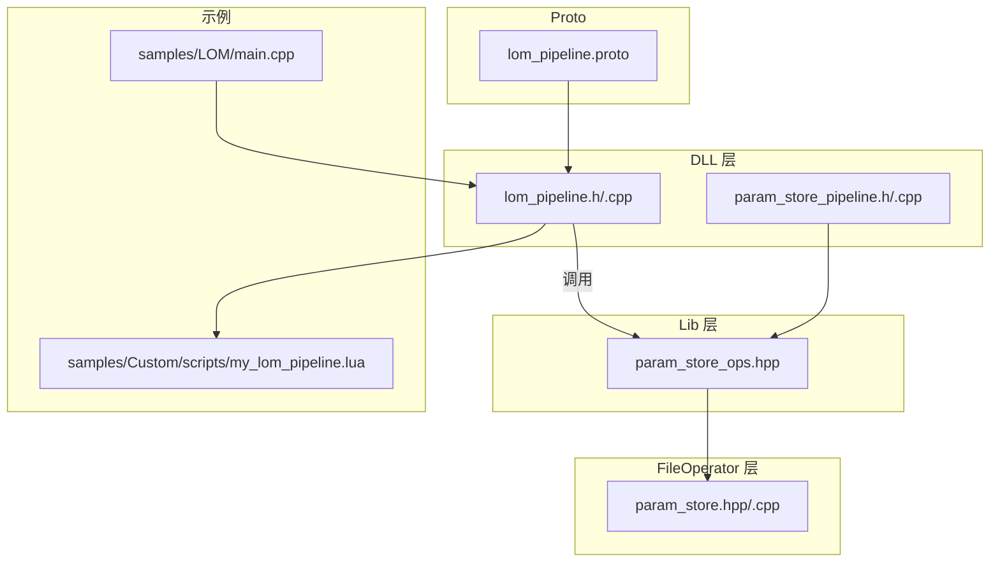
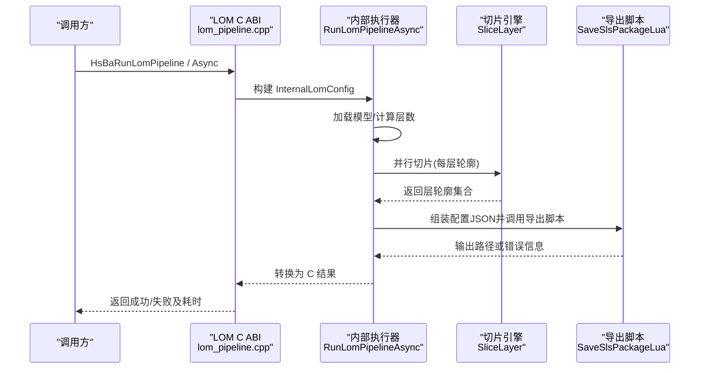
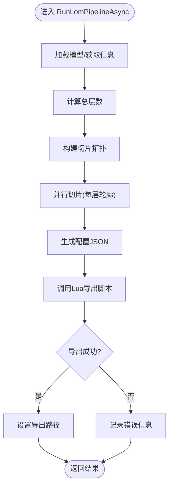
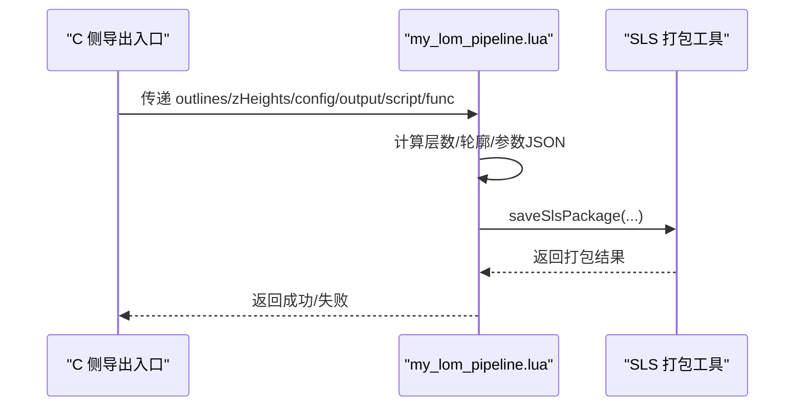
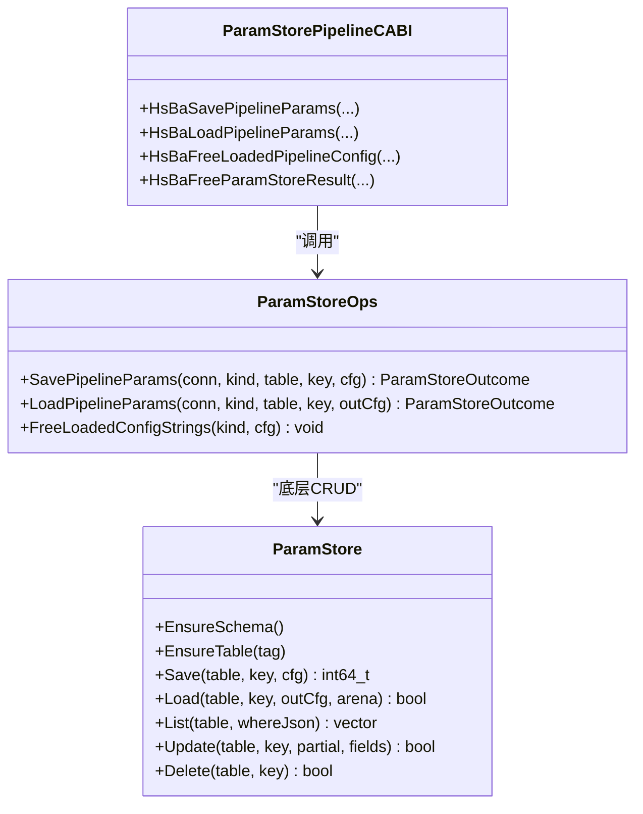
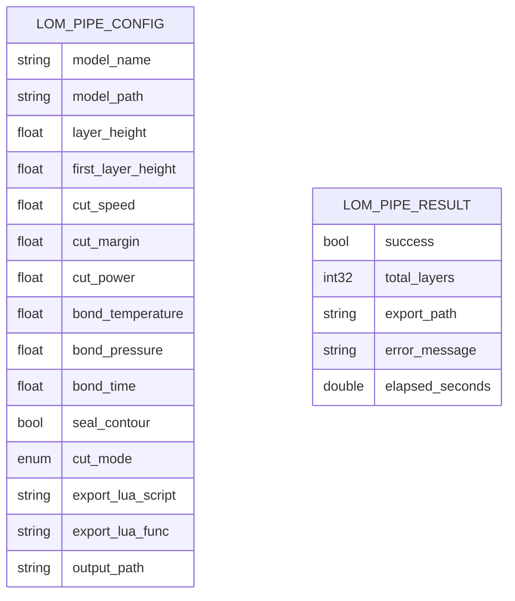
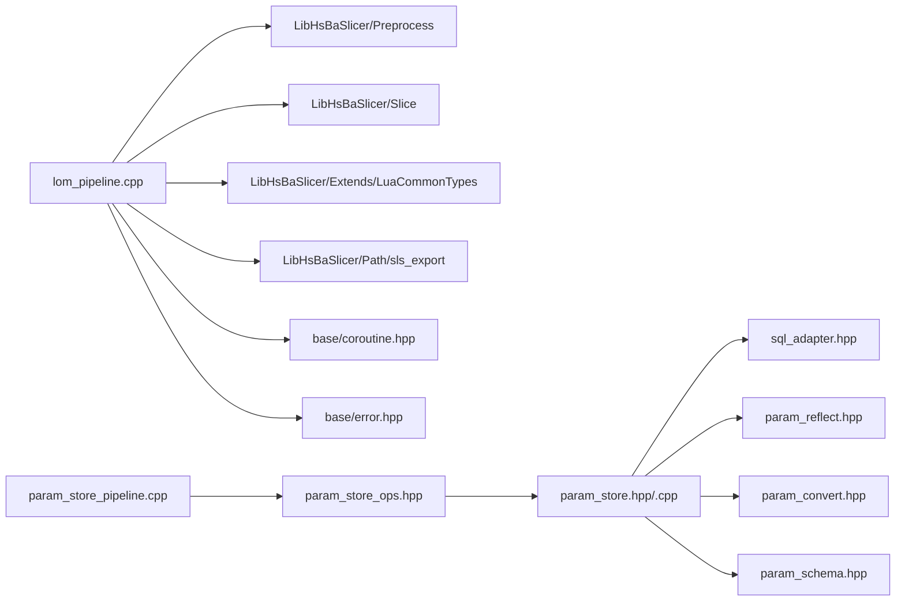

# LOM层压物体制造流水线

<cite>
**本文引用的文件**   
- [lom_pipeline.h](file://DllHsBaSlicer/lom_pipeline.h)
- [lom_pipeline.cpp](file://DllHsBaSlicer/lom_pipeline.cpp)
- [lom_pipeline.proto](file://proto/lom_pipeline.proto)
- [samples/LOM/main.cpp](file://samples/LOM/main.cpp)
- [samples/Custom/scripts/my_lom_pipeline.lua](file://samples/Custom/scripts/my_lom_pipeline.lua)
- [param_store.hpp](file://fileoperator/param_store.hpp)
- [param_store.cpp](file://fileoperator/param_store.cpp)
- [param_store_ops.hpp](file://LibHsBaSlicer/ParamStore/param_store_ops.hpp)
- [param_store_pipeline.h](file://DllHsBaSlicer/param_store_pipeline.h)
- [param_store_pipeline.cpp](file://DllHsBaSlicer/param_store_pipeline.cpp)
- [README.md](file://README.md)
</cite>

## 目录
1. [简介](#简介)
2. [项目结构](#项目结构)
3. [核心组件](#核心组件)
4. [架构总览](#架构总览)
5. [详细组件分析](#详细组件分析)
6. [依赖关系分析](#依赖关系分析)
7. [性能与并发特性](#性能与并发特性)
8. [故障排查指南](#故障排查指南)
9. [结论](#结论)
10. [附录：API 与配置参考](#附录api-与配置参考)

## 简介
本文件面向“LOM（层压物体制造）切片流水线”的 C ABI、内部执行流程、Lua 导出扩展点，以及与“工艺参数存储 ParamStore”之间的集成关系。LOM 流水线按片厚逐层切片，将每层轮廓与切割/粘结参数交给 Lua 导出脚本，最终输出由脚本控制（通常为 zip + 数据库注册）。同时，项目提供跨语言可复用的工艺参数持久化能力，支持 SQLite/MySQL/PostgreSQL 三后端，并通过 Lib/Dll/Module 三层暴露 C ABI。

## 项目结构
围绕 LOM 流水线的相关代码主要分布在以下位置：
- Dll 层 C ABI：`DllHsBaSlicer/lom_pipeline.{h,cpp}`
- Proto 定义：`proto/lom_pipeline.proto`
- 示例程序：`samples/LOM/main.cpp`
- Lua 导出脚本样例：`samples/Custom/scripts/my_lom_pipeline.lua`
- 工艺参数存储（ParamStore）：`fileoperator/param_store.{hpp,cpp}`、`LibHsBaSlicer/ParamStore/param_store_ops.hpp`、`DllHsBaSlicer/param_store_pipeline.{h,cpp}`
- 顶层构建与安装说明：`README.md`

**图示来源**
- [lom_pipeline.h:1-63](file://DllHsBaSlicer/lom_pipeline.h#L1-L63)
- [lom_pipeline.cpp:1-344](file://DllHsBaSlicer/lom_pipeline.cpp#L1-L344)
- [param_store_pipeline.h:1-76](file://DllHsBaSlicer/param_store_pipeline.h#L1-L76)
- [param_store_pipeline.cpp:1-168](file://DllHsBaSlicer/param_store_pipeline.cpp#L1-L168)
- [param_store_ops.hpp:1-94](file://LibHsBaSlicer/ParamStore/param_store_ops.hpp#L1-L94)
- [param_store.hpp:1-109](file://fileoperator/param_store.hpp#L1-L109)
- [param_store.cpp:1-356](file://fileoperator/param_store.cpp#L1-L356)
- [lom_pipeline.proto:1-46](file://proto/lom_pipeline.proto#L1-L46)
- [samples/LOM/main.cpp:1-194](file://samples/LOM/main.cpp#L1-L194)
- [samples/Custom/scripts/my_lom_pipeline.lua:1-92](file://samples/Custom/scripts/my_lom_pipeline.lua#L1-L92)

**章节来源**
- [README.md:25-39](file://README.md#L25-L39)

## 核心组件
- LOM 流水线 C ABI：对外暴露默认配置创建、同步/异步运行、结果释放等接口。
- LOM 内部执行器：负责模型加载、拓扑构建、并行切片、Lua 导出打包。
- Lua 导出脚本：接收轮廓与工艺参数，完成 zip/数据库等自定义输出。
- 工艺参数存储（ParamStore）：为各流水线提供统一的参数 upsert/load 能力，支持多后端。
- Lib/Dll 桥接：Lib 层封装 ParamStore 的 C++ API；Dll 层将其包装为 C ABI。

**章节来源**
- [lom_pipeline.h:17-56](file://DllHsBaSlicer/lom_pipeline.h#L17-L56)
- [lom_pipeline.cpp:28-56](file://DllHsBaSlicer/lom_pipeline.cpp#L28-L56)
- [param_store_ops.hpp:24-89](file://LibHsBaSlicer/ParamStore/param_store_ops.hpp#L24-L89)
- [param_store_pipeline.h:17-69](file://DllHsBaSlicer/param_store_pipeline.h#L17-L69)

## 架构总览
LOM 流水线采用“C ABI + 内部协程任务 + Lua 导出”的分层设计：
- 调用方通过 C ABI 传入配置与回调。
- 内部使用协程任务组织预处理、切片、导出三个阶段。
- 切片阶段对每层独立计算，使用并行循环提升吞吐。
- 导出阶段复用 SLS 的包结构，通过 Lua 脚本实现灵活输出。

**图示来源**
- [lom_pipeline.cpp:187-299](file://DllHsBaSlicer/lom_pipeline.cpp#L187-L299)
- [lom_pipeline.cpp:305-344](file://DllHsBaSlicer/lom_pipeline.cpp#L305-L344)

## 详细组件分析

### LOM 流水线 C ABI 与内部执行器
- 对外接口
  - 默认配置构造：`HsBaCreateDefaultLomConfig`
  - 同步运行：`HsBaRunLomPipeline`
  - 异步运行：`HsBaRunLomPipelineAsync`
  - 结果释放：`HsBaFreeLomPipelineResult`
- 内部数据结构
  - `InternalLomConfig`：保存模型名/路径、层厚、切割/粘结参数、Lua 脚本路径与函数名、输出路径、进度回调等。
  - `InternalLomResult`：保存成功标志、总层数、导出路径、错误信息、耗时。
- 关键处理逻辑
  - 层数计算：根据模型高度与首层厚度/常规层厚计算总层数。
  - 层 Z 坐标：首层使用首层厚度，后续层按常规层厚累加。
  - 进度上报：在加载、切片、导出等阶段向调用方回调进度百分比与阶段描述。
  - 配置 JSON：将切割/粘结/切片参数序列化为 JSON，供 Lua 脚本消费。
  - 并行切片：共享拓扑只读，逐层并行切片以提升性能。
  - Lua 导出：复用 SLS 包结构，将层轮廓、Z 高度、配置 JSON 传给 Lua 脚本进行打包。

**图示来源**
- [lom_pipeline.cpp:95-146](file://DllHsBaSlicer/lom_pipeline.cpp#L95-L146)
- [lom_pipeline.cpp:187-299](file://DllHsBaSlicer/lom_pipeline.cpp#L187-L299)

**章节来源**
- [lom_pipeline.h:17-56](file://DllHsBaSlicer/lom_pipeline.h#L17-L56)
- [lom_pipeline.cpp:28-56](file://DllHsBaSlicer/lom_pipeline.cpp#L28-L56)
- [lom_pipeline.cpp:95-146](file://DllHsBaSlicer/lom_pipeline.cpp#L95-L146)
- [lom_pipeline.cpp:187-299](file://DllHsBaSlicer/lom_pipeline.cpp#L187-L299)
- [lom_pipeline.cpp:305-344](file://DllHsBaSlicer/lom_pipeline.cpp#L305-L344)

### Lua 导出脚本与 SLS 包复用
- LOM 导出脚本样例位于 `samples/Custom/scripts/my_lom_pipeline.lua`，其职责包括：
  - 读取全局变量（模型名/路径、输出路径、流水线配置等）。
  - 计算层数与逐层轮廓。
  - 组装切割/粘结参数 JSON。
  - 调用 `saveSlsPackage` 复用 SLS 的 zip+数据库打包流程。
- C 侧通过 `SaveSlsPackageLua` 将层轮廓、Z 高度、配置 JSON 传递给 Lua 脚本，并由脚本决定最终产物格式。

**图示来源**
- [samples/Custom/scripts/my_lom_pipeline.lua:19-90](file://samples/Custom/scripts/my_lom_pipeline.lua#L19-L90)
- [lom_pipeline.cpp:247-285](file://DllHsBaSlicer/lom_pipeline.cpp#L247-L285)

**章节来源**
- [samples/Custom/scripts/my_lom_pipeline.lua:1-92](file://samples/Custom/scripts/my_lom_pipeline.lua#L1-L92)
- [lom_pipeline.cpp:247-285](file://DllHsBaSlicer/lom_pipeline.cpp#L247-L285)

### 工艺参数存储（ParamStore）与 Lib/Dll 桥接
- Lib 层（`param_store_ops.hpp`）
  - 定义 `ParamPipelineKind`、`ParamBackend`、`ParamStoreConn`、`ParamStoreOutcome`。
  - 暴露 `SavePipelineParams`、`LoadPipelineParams`、`FreeLoadedConfigStrings`。
- FileOperator 层（`param_store.hpp/.cpp`）
  - 实现基于反射的 Save/Load/Update/Delete/List 等 CRUD。
  - 每个 PipelineConfig 类型对应一张宽表，自动建表与字段映射。
- Dll 层（`param_store_pipeline.h/.cpp`）
  - 将 C ABI 枚举/结构体转换为 Lib 层类型。
  - 统一错误消息与耗时统计，并提供 `HsBaFreeParamStoreResult` 释放结果内存。

**图示来源**
- [param_store.hpp:33-93](file://fileoperator/param_store.hpp#L33-L93)
- [param_store_ops.hpp:24-89](file://LibHsBaSlicer/ParamStore/param_store_ops.hpp#L24-L89)
- [param_store_pipeline.h:17-69](file://DllHsBaSlicer/param_store_pipeline.h#L17-L69)
- [param_store_pipeline.cpp:38-110](file://DllHsBaSlicer/param_store_pipeline.cpp#L38-L110)

**章节来源**
- [param_store_ops.hpp:24-89](file://LibHsBaSlicer/ParamStore/param_store_ops.hpp#L24-L89)
- [param_store.hpp:33-93](file://fileoperator/param_store.hpp#L33-L93)
- [param_store.cpp:148-206](file://fileoperator/param_store.cpp#L148-L206)
- [param_store_pipeline.h:17-69](file://DllHsBaSlicer/param_store_pipeline.h#L17-L69)
- [param_store_pipeline.cpp:124-168](file://DllHsBaSlicer/param_store_pipeline.cpp#L124-L168)

### Proto 定义与 C ABI 字段对齐
- `lom_pipeline.proto` 定义了 LOM 流水线的配置与结果消息，包含层厚、首层厚度、切割速度/功率/偏移、粘结温度/压力/时间、封边开关、切割模式、Lua 脚本路径/函数名、输出路径等。
- C ABI 结构与 Proto 字段语义一致，便于跨语言序列化与调试。

**图示来源**
- [lom_pipeline.proto:13-45](file://proto/lom_pipeline.proto#L13-L45)

**章节来源**
- [lom_pipeline.proto:1-46](file://proto/lom_pipeline.proto#L1-L46)

## 依赖关系分析
- Dll 层仅调用 Lib 层，不直接引用 fileoperator，遵循 Lib/Dll/Module 分层约束。
- LOM 流水线依赖：
  - 模型预处理与切片（LibHsBaSlicer/Preprocess、Slice）。
  - Lua 通用类型与 SLS 导出（LibHsBaSlicer/Extends、Path/sls_export）。
  - 协程与错误处理（base/coroutine.hpp、base/error.hpp）。
- ParamStore 依赖：
  - SQL 适配器（sql_adapter.hpp）。
  - 反射与类型收敛（param_reflect.hpp、param_convert.hpp）。
  - Schema 管理（param_schema.hpp）。

**图示来源**
- [lom_pipeline.cpp:17-23](file://DllHsBaSlicer/lom_pipeline.cpp#L17-L23)
- [param_store_pipeline.cpp:12-12](file://DllHsBaSlicer/param_store_pipeline.cpp#L12-L12)
- [param_store_ops.hpp:1-12](file://LibHsBaSlicer/ParamStore/param_store_ops.hpp#L1-L12)
- [param_store.hpp:22-26](file://fileoperator/param_store.hpp#L22-L26)

**章节来源**
- [lom_pipeline.cpp:17-23](file://DllHsBaSlicer/lom_pipeline.cpp#L17-L23)
- [param_store_pipeline.cpp:12-12](file://DllHsBaSlicer/param_store_pipeline.cpp#L12-L12)
- [param_store_ops.hpp:1-12](file://LibHsBaSlicer/ParamStore/param_store_ops.hpp#L1-L12)
- [param_store.hpp:22-26](file://fileoperator/param_store.hpp#L22-L26)

## 性能与并发特性
- 并行切片：共享拓扑只读，逐层切片使用并行循环，减少整体切片时间。
- 协程任务：内部执行器以协程组织阶段，避免阻塞主线程（异步场景）。
- 进度回调：在关键阶段上报进度，便于 UI 或上层监控。
- 结果对象：C 结果中的字符串由库分配，需显式释放，避免泄漏。

优化建议：
- 对超大模型，优先确保切片拓扑构建阶段的内存占用可控。
- 合理设置层数与并行度，避免 I/O 瓶颈（Lua 导出阶段）。
- 使用异步接口时，注意回调线程安全与资源生命周期。

[本节为通用指导，不直接分析具体文件]

## 故障排查指南
- 模型加载失败
  - 检查模型路径与名称是否正确。
  - 确认模型可用且尺寸合法（非零高度）。
- 切片异常
  - 检查层厚与首层厚度是否合理。
  - 关注进度回调中“切片”阶段的错误信息。
- Lua 导出失败
  - 确认 `export_lua_script` 不为空且路径正确。
  - 检查 Lua 脚本中 `saveSlsPackage` 的参数与返回值。
- 参数存储失败
  - 检查连接参数（SQLite 路径或 MySQL/PGSQL host/port/user/password/database）。
  - 确认表名与业务键唯一性。
  - 使用 `HsBaFreeParamStoreResult` 释放错误消息。

**章节来源**
- [lom_pipeline.cpp:196-219](file://DllHsBaSlicer/lom_pipeline.cpp#L196-L219)
- [lom_pipeline.cpp:247-285](file://DllHsBaSlicer/lom_pipeline.cpp#L247-L285)
- [param_store_pipeline.cpp:124-168](file://DllHsBaSlicer/param_store_pipeline.cpp#L124-L168)

## 结论
LOM 流水线通过 C ABI 暴露简洁的同步/异步接口，内部以协程与并行切片提升性能，并以 Lua 脚本实现灵活的导出策略。配合 ParamStore，用户可将各流水线的工艺参数持久化到数据库，实现参数的复用与迁移。整体架构清晰、可扩展性强，适合研究与生产环境使用。

[本节为总结性内容，不直接分析具体文件]

## 附录：API 与配置参考

### LOM 流水线 C API
- 默认配置：`HsBaCreateDefaultLomConfig`
- 同步运行：`HsBaRunLomPipeline`
- 异步运行：`HsBaRunLomPipelineAsync`
- 结果释放：`HsBaFreeLomPipelineResult`

**章节来源**
- [lom_pipeline.h:17-56](file://DllHsBaSlicer/lom_pipeline.h#L17-L56)

### 示例用法
- 基本用法：最小配置运行 LOM 流水线。
- 自定义参数：调整切割/粘结参数。
- 异步运行：通过回调获取结果。

**章节来源**
- [samples/LOM/main.cpp:55-82](file://samples/LOM/main.cpp#L55-L82)
- [samples/LOM/main.cpp:87-130](file://samples/LOM/main.cpp#L87-L130)
- [samples/LOM/main.cpp:154-175](file://samples/LOM/main.cpp#L154-L175)

### 工艺参数存储 C API
- 保存参数：`HsBaSavePipelineParams`
- 加载参数：`HsBaLoadPipelineParams`
- 释放加载的配置字符串：`HsBaFreeLoadedPipelineConfig`
- 释放结果：`HsBaFreeParamStoreResult`

**章节来源**
- [param_store_pipeline.h:17-69](file://DllHsBaSlicer/param_store_pipeline.h#L17-L69)
- [param_store_pipeline.cpp:124-168](file://DllHsBaSlicer/param_store_pipeline.cpp#L124-L168)