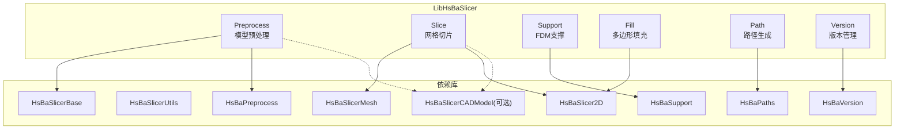
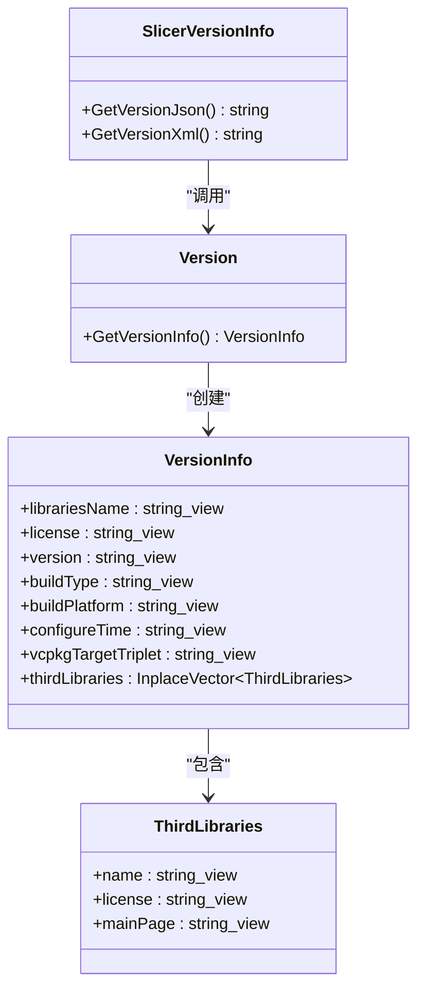
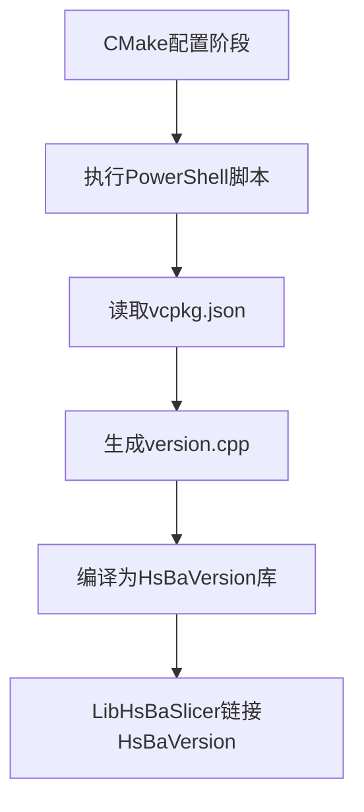
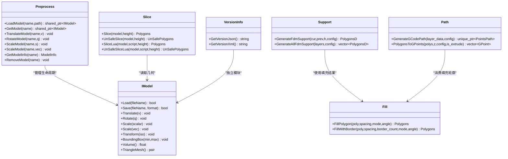
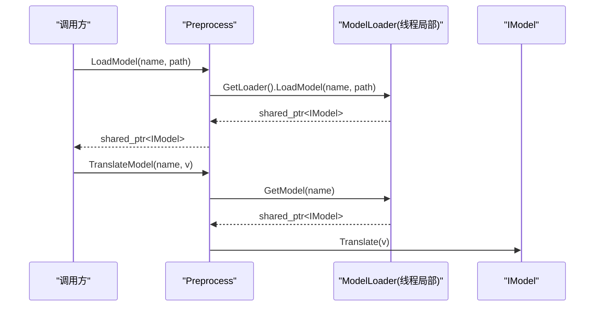
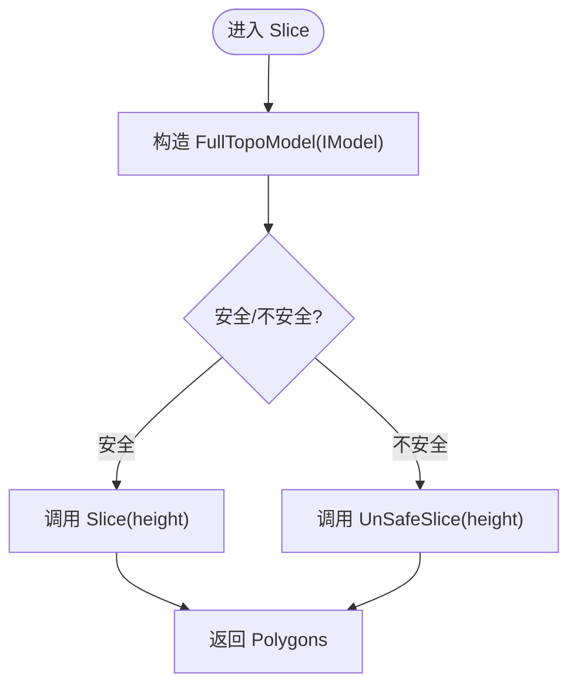
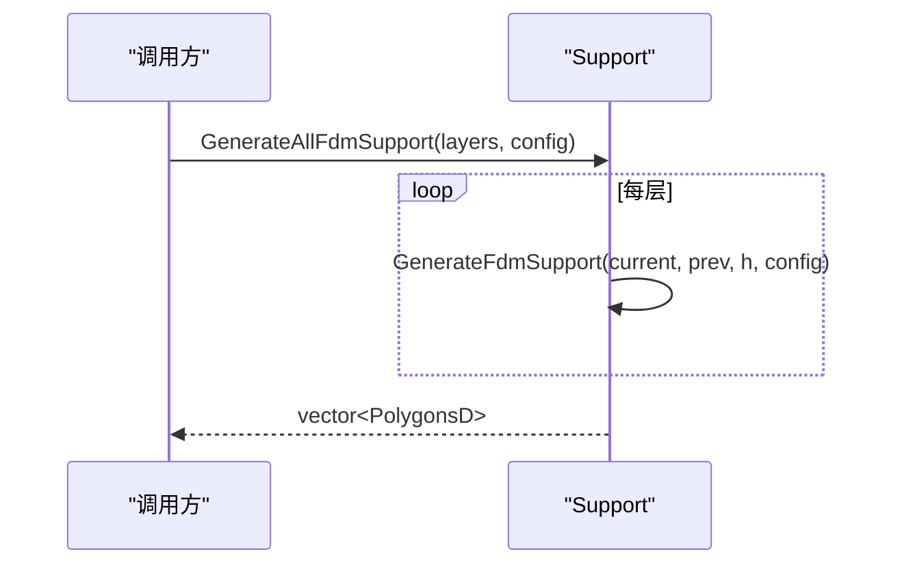
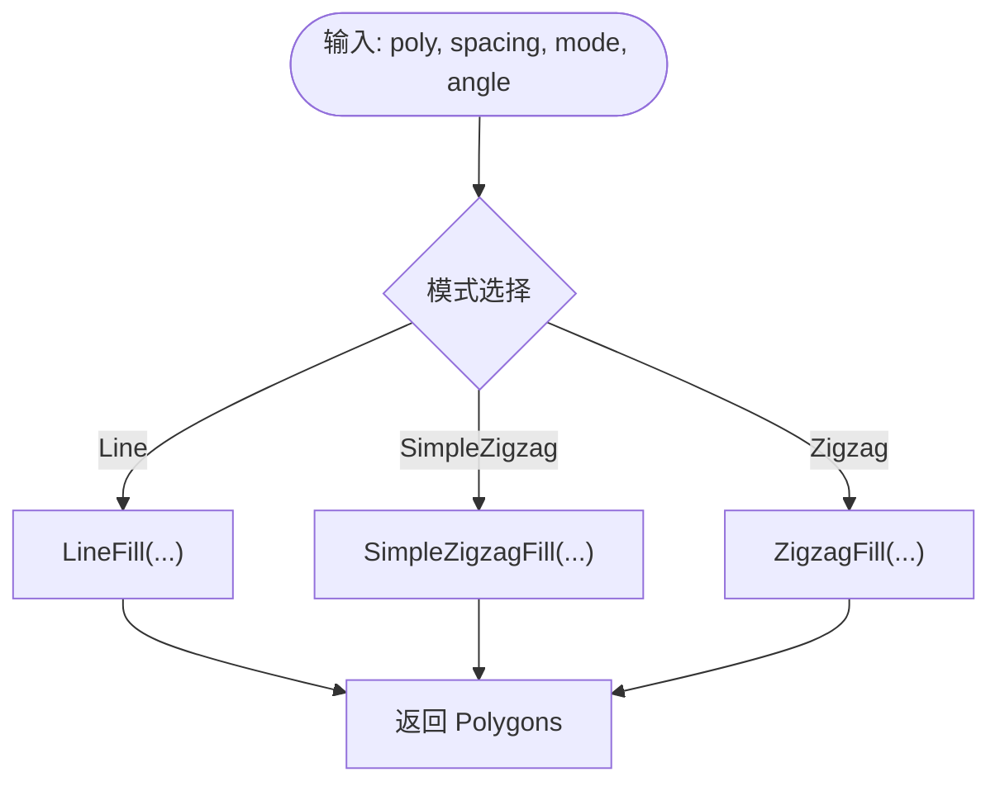
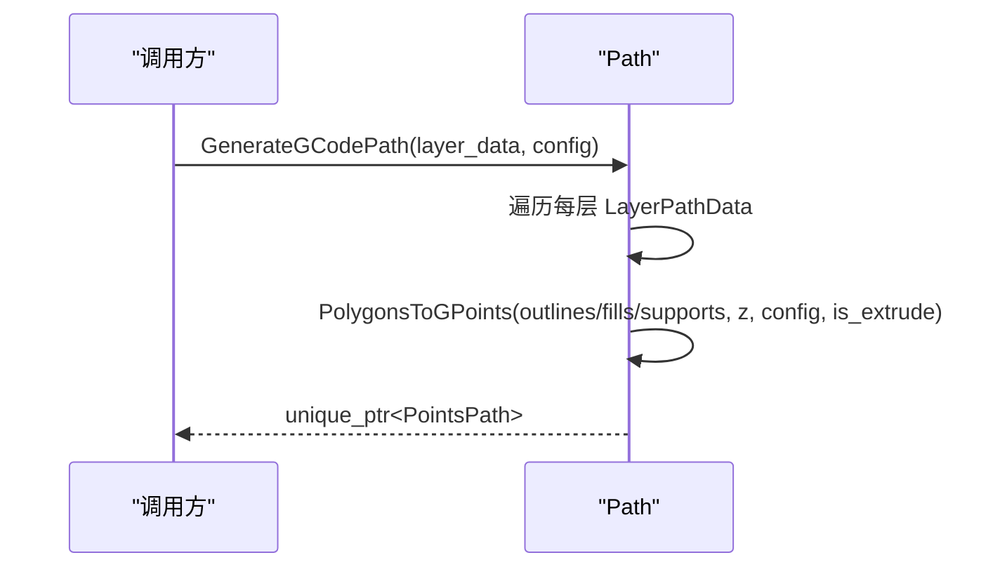
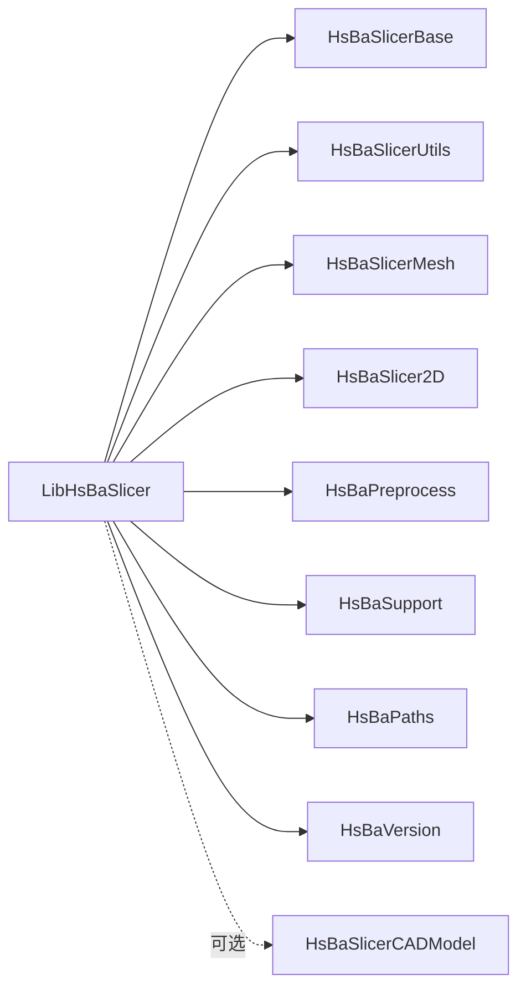

# LibHsBaSlicer核心库文档

<cite>
**本文引用的文件**   
- [CMakeLists.txt](file://LibHsBaSlicer/CMakeLists.txt)
- [export.h](file://LibHsBaSlicer/export.h)
- [pch_headers.hpp](file://LibHsBaSlicer/pch_headers.hpp)
- [model_preprocess.hpp](file://LibHsBaSlicer/Preprocess/model_preprocess.hpp)
- [model_preprocess.cpp](file://LibHsBaSlicer/Preprocess/model_preprocess.cpp)
- [mesh_slice.hpp](file://LibHsBaSlicer/Slice/mesh_slice.hpp)
- [mesh_slice.cpp](file://LibHsBaSlicer/Slice/mesh_slice.cpp)
- [fdm_support.hpp](file://LibHsBaSlicer/Support/fdm_support.hpp)
- [polygon_fill.hpp](file://LibHsBaSlicer/Fill/polygon_fill.hpp)
- [polygon_fill.cpp](file://LibHsBaSlicer/Fill/polygon_fill.cpp)
- [path_generator.hpp](file://LibHsBaSlicer/Path/path_generator.hpp)
- [IModel.hpp](file://base/IModel.hpp)
- [README.md](file://docs/zh/LibHsBaSlicer/README.md)
- [main.cpp](file://samples/FDM/main.cpp)
- [version_info.hpp](file://LibHsBaSlicer/version_info.hpp)
- [version_info.cpp](file://LibHsBaSlicer/version_info.cpp)
- [version.hpp](file://version/version.hpp)
- [version.cpp.in](file://version/version.cpp.in)
- [CMakeLists.txt](file://version/CMakeLists.txt)
</cite>

## 更新摘要
**所做更改**   
- 新增版本信息管理模块章节，详细说明统一的版本API接口
- 更新项目结构图，包含版本管理组件
- 添加版本信息架构重构说明
- 更新依赖关系分析，包含HsBaVersion库
- 新增版本信息使用示例和最佳实践

## 目录
1. [简介](#简介)
2. [项目结构](#项目结构)
3. [核心组件](#核心组件)
4. [版本信息管理](#版本信息管理)
5. [架构总览](#架构总览)
6. [详细组件分析](#详细组件分析)
7. [依赖关系分析](#依赖关系分析)
8. [性能与并发特性](#性能与并发特性)
9. [故障排查指南](#故障排查指南)
10. [结论](#结论)
11. [附录：API参考](#附录api参考)

## 简介
LibHsBaSlicer 是 HsBaSlicer 的核心 C++ 静态/共享库，提供五大切片能力：模型预处理、网格切片、FDM支撑生成、多边形填充与路径生成。所有对外 API 位于命名空间 HsBa::Slicer，并通过统一的导出宏在 Windows 平台进行 DLL 导出控制。该库面向 FDM/SLA 等增材制造流程，支持 STL/OBJ/STEP/IGES 等常见格式输入，输出层轮廓、支撑截面、填充线与 G-code 路径序列。

典型工作流为：加载并变换模型 → 按层高切片 → 生成支撑 → 填充内腔 → 生成打印路径。

**更新** 版本管理功能已从DllHsBaSlicer迁移到LibHsBaSlicer核心库，提供统一的GetVersionJson()和GetVersionXml()接口，实现跨平台的版本信息查询。

章节来源
- [README.md:1-49](file://docs/zh/LibHsBaSlicer/README.md#L1-L49)

## 项目结构
LibHsBaSlicer 采用"功能子模块"组织方式，每个子模块对应一个切片阶段，内部包含头文件与实现文件，统一通过 CMake 构建为静态或共享库。

图表来源
- [CMakeLists.txt:1-68](file://LibHsBaSlicer/CMakeLists.txt#L1-L68)

章节来源
- [CMakeLists.txt:1-68](file://LibHsBaSlicer/CMakeLists.txt#L1-L68)

## 核心组件
- 预处理（Preprocess）：模型加载、查询与几何变换；维护线程局部模型池。
- 切片（Slice）：Z 向平面切片，返回安全/不安全轮廓集合，支持 Lua 脚本扩展。
- 支撑（Support）：基于悬垂检测与配置参数生成单层/全层支撑截面。
- 填充（Fill）：线型/之字形/简单之字形等多种填充模式，支持带边框的复合偏移填充。
- 路径（Path）：将层数据转换为 G-code 点序列，封装挤出/移动段与速度、线宽等工艺参数。
- **版本管理（Version）**：提供统一的版本信息查询接口，支持JSON和XML格式输出。

章节来源
- [model_preprocess.hpp:15-85](file://LibHsBaSlicer/Preprocess/model_preprocess.hpp#L15-L85)
- [mesh_slice.hpp:13-25](file://LibHsBaSlicer/Slice/mesh_slice.hpp#L13-L25)
- [fdm_support.hpp:11-33](file://LibHsBaSlicer/Support/fdm_support.hpp#L11-L33)
- [polygon_fill.hpp:9-33](file://LibHsBaSlicer/Fill/polygon_fill.hpp#L9-L33)
- [path_generator.hpp:13-59](file://LibHsBaSlicer/Path/path_generator.hpp#L13-L59)
- [version_info.hpp:11-21](file://LibHsBaSlicer/version_info.hpp#L11-L21)

## 版本信息管理

### 架构设计
版本管理功能已完成架构重构，从DllHsBaSlicer迁移到LibHsBaSlicer核心库，实现了统一的版本信息访问接口。新版本管理架构采用分层设计：

图表来源
- [version.hpp:17-31](file://version/version.hpp#L17-L31)
- [version_info.hpp:9-23](file://LibHsBaSlicer/version_info.hpp#L9-L23)

### 核心API接口
LibHsBaSlicer提供两个主要的版本信息查询接口：

- `GetVersionJson()`：获取格式化的JSON字符串版本信息
- `GetVersionXml()`：获取XML格式的版本信息

这两个接口都返回UTF-8编码的字符串，便于跨语言使用。

### 版本信息结构
版本信息包含以下关键字段：
- **基础信息**：库名称、许可证、版本号
- **构建信息**：构建类型、目标平台、配置时间、vcpkg三元组
- **第三方库**：依赖的第三方库列表及其许可证信息

### 构建系统集成
版本信息通过CMake构建系统自动生成，支持动态配置：

图表来源
- [CMakeLists.txt:28-45](file://version/CMakeLists.txt#L28-L45)

**章节来源**
- [version_info.hpp:11-21](file://LibHsBaSlicer/version_info.hpp#L11-L21)
- [version_info.cpp:9-19](file://LibHsBaSlicer/version_info.cpp#L9-L19)
- [version.hpp:17-31](file://version/version.hpp#L17-L31)
- [CMakeLists.txt:47-56](file://version/CMakeLists.txt#L47-L56)

## 架构总览
LibHsBaSlicer 以 IModel 抽象为核心，上层各模块围绕其提供的几何接口进行切片与后处理。导出宏 HSBA_SLICER_LIB_API 用于跨平台符号导出。

图表来源
- [IModel.hpp:107-136](file://base/IModel.hpp#L107-L136)
- [model_preprocess.hpp:15-85](file://LibHsBaSlicer/Preprocess/model_preprocess.hpp#L15-L85)
- [mesh_slice.hpp:13-25](file://LibHsBaSlicer/Slice/mesh_slice.hpp#L13-L25)
- [fdm_support.hpp:11-33](file://LibHsBaSlicer/Support/fdm_support.hpp#L11-L33)
- [polygon_fill.hpp:9-33](file://LibHsBaSlicer/Fill/polygon_fill.hpp#L9-L33)
- [path_generator.hpp:13-59](file://LibHsBaSlicer/Path/path_generator.hpp#L13-L59)
- [version_info.hpp:11-21](file://LibHsBaSlicer/version_info.hpp#L11-L21)

## 详细组件分析

### 预处理（Preprocess）
- 职责：加载多种格式的 3D 模型，维护名称到模型的映射，提供平移/旋转/缩放/仿射变换与信息查询（包围盒、体积）。
- 关键设计：
  - 使用线程局部存储的 ModelLoader 实例，避免全局状态竞争。
  - 对不存在的模型名返回空指针或忽略操作，保证健壮性。
- 复杂度与性能：
  - 加载与保存取决于底层格式解析器；查询与变换为 O(1) 索引访问与几何计算。
- 错误处理：
  - 重复名称或非法格式抛出 InvalidArgumentError；IO 失败抛出 RuntimeError。

图表来源
- [model_preprocess.cpp:17-34](file://LibHsBaSlicer/Preprocess/model_preprocess.cpp#L17-L34)
- [model_preprocess.hpp:27-56](file://LibHsBaSlicer/Preprocess/model_preprocess.hpp#L27-L56)

章节来源
- [model_preprocess.hpp:15-85](file://LibHsBaSlicer/Preprocess/model_preprocess.hpp#L15-L85)
- [model_preprocess.cpp:1-81](file://LibHsBaSlicer/Preprocess/model_preprocess.cpp#L1-L81)

### 切片（Slice）
- 职责：对 IModel 进行 Z 向切片，返回安全或不安全的二维轮廓集合；支持 Lua 脚本定制切片逻辑。
- 关键设计：
  - 内部构造 FullTopoModel 包装 IModel，再调用其 Slice/UnSafeSlice 等方法。
  - 安全切片会过滤非封闭轮廓；不安全切片保留原始拓扑信息。
- 复杂度与性能：
  - 主要开销来自三角网格切片与拓扑重建；可按层高并行化（注释提示协程场景）。

图表来源
- [mesh_slice.cpp:5-14](file://LibHsBaSlicer/Slice/mesh_slice.cpp#L5-L14)
- [mesh_slice.hpp:15-21](file://LibHsBaSlicer/Slice/mesh_slice.hpp#L15-L21)

章节来源
- [mesh_slice.hpp:13-25](file://LibHsBaSlicer/Slice/mesh_slice.hpp#L13-L25)
- [mesh_slice.cpp:1-28](file://LibHsBaSlicer/Slice/mesh_slice.cpp#L1-L28)

### 支撑（Support）
- 职责：根据当前层与上一层轮廓、层高与配置，生成 FDM 支撑截面；支持批量全层生成。
- 关键设计：
  - 单层层级函数 GenerateFdmSupport 与全层函数 GenerateAllFdmSupport 分离，便于流水线集成。
  - 配置项由 Support::FdmSupportConfig 提供（如悬垂角度、间距、密度等）。
- 复杂度与性能：
  - 逐层扫描与区域判定为主；可结合分层并行策略提升吞吐。

图表来源
- [fdm_support.hpp:20-31](file://LibHsBaSlicer/Support/fdm_support.hpp#L20-L31)

章节来源
- [fdm_support.hpp:11-33](file://LibHsBaSlicer/Support/fdm_support.hpp#L11-L33)

### 填充（Fill）
- 职责：对二维多边形执行不同模式的填充，并提供带边框的复合偏移填充。
- 关键设计：
  - FillPolygon 根据模式分派至 Line/SimpleZigzag/Zigzag 算法。
  - FillWithBorder 使用 CompositeOffsetFill 实现向内偏移生成边框后再填充。
- 复杂度与性能：
  - 填充算法通常为 O(n·k)，n 为边界点数，k 为填充线数；角度与间距影响 k。

图表来源
- [polygon_fill.cpp:5-18](file://LibHsBaSlicer/Fill/polygon_fill.cpp#L5-L18)
- [polygon_fill.hpp:11-31](file://LibHsBaSlicer/Fill/polygon_fill.hpp#L11-L31)

章节来源
- [polygon_fill.hpp:9-33](file://LibHsBaSlicer/Fill/polygon_fill.hpp#L9-L33)
- [polygon_fill.cpp:1-29](file://LibHsBaSlicer/Fill/polygon_fill.cpp#L1-L29)

### 路径（Path）
- 职责：将层数据（轮廓、填充、支撑）转换为 G-code 点序列，封装挤出/移动段与速度、线宽、单位等工艺参数。
- 关键设计：
  - LayerPathData 聚合一层所需的路径元素与 Z 高度。
  - GenerateGCodePath 接收多层数据与 FdmPathConfig，输出 PointsPath。
  - PolygonsToGPoints 作为辅助，将 PolygonsD 转为 GPoint 序列。
- 复杂度与性能：
  - 路径生成主要为线性遍历与坐标变换；可通过批处理与内存池优化。

图表来源
- [path_generator.hpp:18-57](file://LibHsBaSlicer/Path/path_generator.hpp#L18-L57)

章节来源
- [path_generator.hpp:13-59](file://LibHsBaSlicer/Path/path_generator.hpp#L13-L59)

## 依赖关系分析
LibHsBaSlicer 通过 CMake 链接多个基础与领域库，并在非移动端/主机平台可选链接 CAD 内核。

图表来源
- [CMakeLists.txt:45-54](file://LibHsBaSlicer/CMakeLists.txt#L45-L54)

章节来源
- [CMakeLists.txt:1-68](file://LibHsBaSlicer/CMakeLists.txt#L1-L68)

## 性能与并发特性
- 线程局部模型池：预处理模块使用 thread_local 的 ModelLoader，避免多线程竞争，提高并发安全性与性能。
- 切片并行潜力：注释指出在层间路径规划不干涉时可考虑协程并行处理单层路径，适合高吞吐流水线。
- 预编译头：通过 pch_headers.hpp 集中引入常用标准库与第三方头，减少重复编译开销。
- 版本信息缓存：版本信息在构建时生成，运行时直接访问，无额外性能开销。
- 建议：
  - 大批量模型处理时复用模型对象，避免频繁加载/释放。
  - 合理设置填充间距与壁厚，平衡质量与时间。
  - 对超大模型优先使用不安全切片获取完整拓扑，再进行后处理筛选。

章节来源
- [model_preprocess.cpp:9-14](file://LibHsBaSlicer/Preprocess/model_preprocess.cpp#L9-L14)
- [mesh_slice.hpp:15-16](file://LibHsBaSlicer/Slice/mesh_slice.hpp#L15-L16)
- [pch_headers.hpp:1-40](file://LibHsBaSlicer/pch_headers.hpp#L1-L40)

## 故障排查指南
- 模型加载失败
  - 检查文件路径与格式是否受支持；确认未重复注册同名模型。
  - 关注抛出的 InvalidArgumentError 与 RuntimeError 异常类型。
- 切片结果为空
  - 确认层高是否在模型包围盒范围内；必要时使用不安全切片查看原始轮廓。
- 支撑/填充异常
  - 调整悬垂角度、填充间距与壁厚；检查输入轮廓是否为有效闭合多边形。
- 路径生成问题
  - 核对 FdmPathConfig 的单位、线宽与速度设置；确保层数据中 z_height 正确递增。
- **版本信息查询失败**
  - 确认已正确链接 HsBaVersion 库；检查构建类型是否正确传递。
  - 验证 PowerShell 环境是否正常，确保版本信息生成脚本可执行。

章节来源
- [model_preprocess.hpp:27-35](file://LibHsBaSlicer/Preprocess/model_preprocess.hpp#L27-L35)
- [mesh_slice.hpp:17-21](file://LibHsBaSlicer/Slice/mesh_slice.hpp#L17-L21)
- [fdm_support.hpp:13-22](file://LibHsBaSlicer/Support/fdm_support.hpp#L13-L22)
- [polygon_fill.hpp:11-31](file://LibHsBaSlicer/Fill/polygon_fill.hpp#L11-L31)
- [path_generator.hpp:18-57](file://LibHsBaSlicer/Path/path_generator.hpp#L18-L57)

## 结论
LibHsBaSlicer 提供了从模型预处理到 G-code 路径生成的完整切片链路，具备清晰的模块化设计与良好的可扩展性（Lua 脚本、多后端模型）。通过合理的参数配置与并发策略，可在多平台上稳定高效地服务 FDM/SLA 等工艺需求。

**更新** 版本管理功能的架构重构进一步增强了库的完整性，提供了统一的版本信息查询接口，便于调试、日志记录和兼容性检查。

## 附录：API参考
- 预处理
  - LoadModel / GetModel / TranslateModel / RotateModel / ScaleModel / GetModelInfo / RemoveModel
- 切片
  - Slice / UnSafeSlice / SliceLua / UnSafeSliceLua
- 支撑
  - GenerateFdmSupport / GenerateAllFdmSupport
- 填充
  - FillPolygon / FillWithBorder
- 路径
  - GenerateGCodePath / PolygonsToGPoints
- **版本管理**
  - GetVersionJson / GetVersionXml
- 导出宏
  - HSBA_SLICER_LIB_API（Windows 下 __declspec(dllexport/dllimport)，其他平台为空）

章节来源
- [model_preprocess.hpp:15-85](file://LibHsBaSlicer/Preprocess/model_preprocess.hpp#L15-L85)
- [mesh_slice.hpp:13-25](file://LibHsBaSlicer/Slice/mesh_slice.hpp#L13-L25)
- [fdm_support.hpp:11-33](file://LibHsBaSlicer/Support/fdm_support.hpp#L11-L33)
- [polygon_fill.hpp:9-33](file://LibHsBaSlicer/Fill/polygon_fill.hpp#L9-L33)
- [path_generator.hpp:13-59](file://LibHsBaSlicer/Path/path_generator.hpp#L13-L59)
- [version_info.hpp:11-21](file://LibHsBaSlicer/version_info.hpp#L11-L21)
- [export.h:1-15](file://LibHsBaSlicer/export.h#L1-L15)