# LibHsBaSlicer核心库文档

<cite>
**本文引用的文件**   
- [CMakeLists.txt](file://LibHsBaSlicer/CMakeLists.txt)
- [export.h](file://LibHsBaSlicer/export.h)
- [pch_headers.hpp](file://LibHsBaSlicer/pch_headers.hpp)
- [model_preprocess.hpp](file://LibHsBaSlicer/Preprocess/model_preprocess.hpp)
- [model_preprocess.cpp](file://LibHsBaSlicer/Preprocess/model_preprocess.cpp)
- [mesh_slice.hpp](file://LibHsBaSlicer/Slice/mesh_slice.hpp)
- [mesh_slice.cpp](file://LibHsBaSlicer/Slice/mesh_slice.cpp)
- [fdm_support.hpp](file://LibHsBaSlicer/Support/fdm_support.hpp)
- [polygon_fill.hpp](file://LibHsBaSlicer/Fill/polygon_fill.hpp)
- [polygon_fill.cpp](file://LibHsBaSlicer/Fill/polygon_fill.cpp)
- [path_generator.hpp](file://LibHsBaSlicer/Path/path_generator.hpp)
- [path_optimizer.hpp](file://LibHsBaSlicer/Path/path_optimizer.hpp)
- [path_optimizer.cpp](file://LibHsBaSlicer/Path/path_optimizer.cpp)
- [sls_export.hpp](file://LibHsBaSlicer/Path/sls_export.hpp)
- [sls_export.cpp](file://LibHsBaSlicer/Path/sls_export.cpp)
- [sla_floor.hpp](file://LibHsBaSlicer/Floor/sla_floor.hpp)
- [LuaAdapter.hpp](file://fileoperator/LuaAdapter.hpp)
- [IModel.hpp](file://base/IModel.hpp)
- [AreaGraph.hpp](file://utils/AreaGraph.hpp)
- [README.md](file://docs/zh/LibHsBaSlicer/README.md)
- [main.cpp](file://samples/FDM/main.cpp)
- [version_info.hpp](file://LibHsBaSlicer/version_info.hpp)
- [version_info.cpp](file://LibHsBaSlicer/version_info.cpp)
- [version.hpp](file://version/version.hpp)
- [version.cpp.in](file://version/version.cpp.in)
- [CMakeLists.txt](file://version/CMakeLists.txt)
- [sls_pipeline.h](file://DllHsBaSlicer/sls_pipeline.h)
- [pipeline_types.h](file://pipelinetypes/pipeline_types.h)
- [optimize_paths.lua](file://tests/PolygonFill/optimize_paths.lua)
</cite>

## 更新摘要
**所做更改**   
- 新增路径优化功能完整说明章节，包括RegionPathOptimizer类和AreaGraph算法实现
- 增强Fill阶段集成细节，展示路径优化如何与填充脚本无缝集成
- 添加Lua脚本接口详细说明，包括PathOptimize全局表和两种优化模式
- 更新API参考文档，包含路径优化的C++和Lua接口
- 新增路径优化使用示例和最佳实践指南

## 目录
1. [简介](#简介)
2. [项目结构](#项目结构)
3. [核心组件](#核心组件)
4. [路径优化功能](#路径优化功能)
5. [SLS导出功能](#sls导出功能)
6. [版本信息管理](#版本信息管理)
7. [架构总览](#架构总览)
8. [详细组件分析](#详细组件分析)
9. [依赖关系分析](#依赖关系分析)
10. [性能与并发特性](#性能与并发特性)
11. [故障排查指南](#故障排查指南)
12. [结论](#结论)
13. [附录：API参考](#附录api参考)

## 简介
LibHsBaSlicer 是 HsBaSlicer 的核心 C++ 静态/共享库，提供五大切片能力：模型预处理、网格切片、FDM支撑生成、多边形填充与路径生成。所有对外 API 位于命名空间 HsBa::Slicer，并通过统一的导出宏在 Windows 平台进行 DLL 导出控制。该库面向 FDM/SLA/SLS 等增材制造流程，支持 STL/OBJ/STEP/IGES 等常见格式输入，输出层轮廓、支撑截面、填充线与 G-code 路径序列。

典型工作流为：加载并变换模型 → 按层高切片 → 生成支撑 → 填充内腔 → **路径优化** → 生成打印路径。

**更新** 新增了完整的路径优化功能，通过RegionPathOptimizer类实现独立多边形区域的访问顺序优化，支持填充前和填充后两种优化模式，大幅减少空走距离并提升打印效率。同时增强了Fill阶段集成，使路径优化能够无缝嵌入自定义填充脚本中。

章节来源
- [README.md:1-49](file://docs/zh/LibHsBaSlicer/README.md#L1-L49)

## 项目结构
LibHsBaSlicer 采用"功能子模块"组织方式，每个子模块对应一个切片阶段，内部包含头文件与实现文件，统一通过 CMake 构建为静态或共享库。

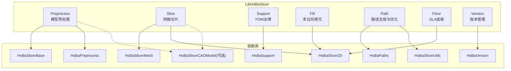

图表来源
- [CMakeLists.txt:1-78](file://LibHsBaSlicer/CMakeLists.txt#L1-L78)

章节来源
- [CMakeLists.txt:1-78](file://LibHsBaSlicer/CMakeLists.txt#L1-L78)

## 核心组件
- 预处理（Preprocess）：模型加载、查询与几何变换；维护线程局部模型池。
- 切片（Slice）：Z 向平面切片，返回安全/不安全轮廓集合，支持 Lua 脚本扩展。
- 支撑（Support）：基于悬垂检测与配置参数生成单层/全层支撑截面。
- 填充（Fill）：线型/之字形/简单之字形等多种填充模式，支持带边框的复合偏移填充。
- **路径优化（Path Optimizer）**：独立多边形区域访问顺序优化，减少空走距离，支持填充前和填充后两种模式。
- 路径生成（Path）：将层数据转换为 G-code 点序列，封装挤出/移动段与速度、线宽等工艺参数。
- SLS导出（SLS Export）：为选择性激光烧结工艺提供专用的数据包封装和Lua脚本导出功能。
- 底板（Floor）：为SLA工艺生成接触底板和支撑结构。
- 版本管理（Version）：提供统一的版本信息查询接口，支持JSON和XML格式输出。

章节来源
- [model_preprocess.hpp:15-85](file://LibHsBaSlicer/Preprocess/model_preprocess.hpp#L15-L85)
- [mesh_slice.hpp:13-25](file://LibHsBaSlicer/Slice/mesh_slice.hpp#L13-25)
- [fdm_support.hpp:11-33](file://LibHsBaSlicer/Support/fdm_support.hpp#L11-L33)
- [polygon_fill.hpp:9-33](file://LibHsBaSlicer/Fill/polygon_fill.hpp#L9-33)
- [path_optimizer.hpp:18-84](file://LibHsBaSlicer/Path/path_optimizer.hpp#L18-84)
- [path_generator.hpp:13-59](file://LibHsBaSlicer/Path/path_generator.hpp#L13-59)
- [sls_export.hpp:20-47](file://LibHsBaSlicer/Path/sls_export.hpp#L20-47)
- [sla_floor.hpp:20-74](file://LibHsBaSlicer/Floor/sla_floor.hpp#L20-74)
- [version_info.hpp:11-21](file://LibHsBaSlicer/version_info.hpp#L11-21)

## 路径优化功能

### 架构设计
路径优化功能通过RegionPathOptimizer类实现独立多边形区域的访问顺序优化，利用AreaGraph算法求解最短路径问题。该功能支持两种优化模式：

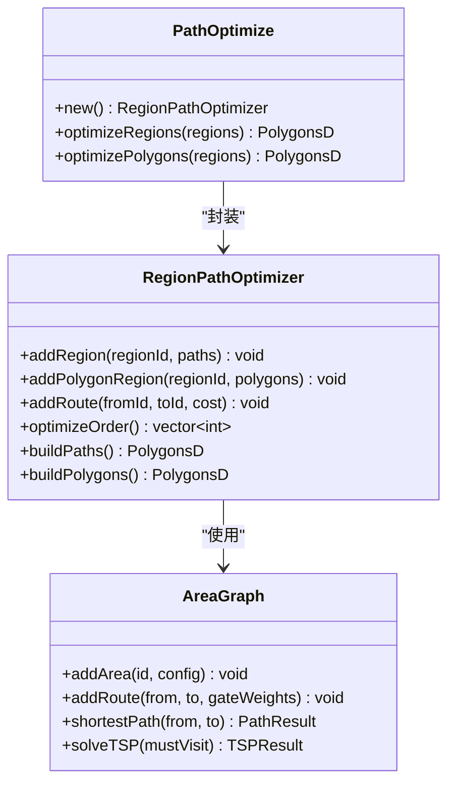

图表来源
- [path_optimizer.hpp:33-84](file://LibHsBaSlicer/Path/path_optimizer.hpp#L33-84)
- [AreaGraph.hpp:87-308](file://utils/AreaGraph.hpp#L87-308)

### 核心API接口
路径优化功能提供以下主要接口：

#### C++ API
- `RegionPathOptimizer`：核心优化器类，支持两种区域类型
- `addRegion()`：添加基于填充结果的区域（填充后优化）
- `addPolygonRegion()`：添加基于多边形本身的区域（填充前优化）
- `addRoute()`：手动指定区域间空走代价
- `optimizeOrder()`：求解区域访问顺序
- `buildPaths()`：输出优化后的完整填充路径
- `buildPolygons()`：输出优化顺序的多边形集合

#### Lua API
- `PathOptimize.new()`：创建优化器对象
- `PathOptimize.optimizeRegions()`：一键优化填充结果
- `PathOptimize.optimizePolygons()`：一键优化多边形集合

### 优化模式详解

#### 填充结果模式（填充后优化）
适用于已生成的填充路径，支持多点折线数据结构：
- 每条路径的首尾端点作为门禁点
- 通过TSP算法求解最优访问顺序
- 区域内路径方向自动调整以减少跳变

#### 多边形模式（填充前优化）
适用于原始多边形轮廓，在填充执行前优化：
- 多边形全部顶点作为候选门禁点
- 输出优化顺序的多边形集合供后续填充使用
- 保持多边形环绕方向不变

### AreaGraph算法实现
AreaGraph提供了核心的图论算法支持：

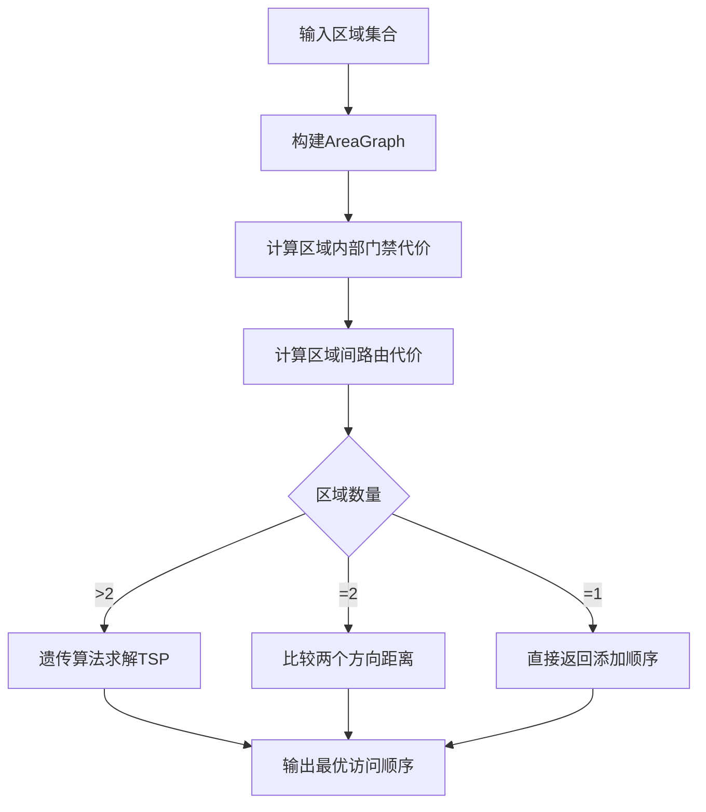

图表来源
- [AreaGraph.hpp:231-308](file://utils/AreaGraph.hpp#L231-308)
- [path_optimizer.cpp:113-161](file://LibHsBaSlicer/Path/path_optimizer.cpp#L113-161)

### Fill阶段集成
路径优化功能已深度集成到Fill阶段，通过Lua脚本扩展机制实现无缝调用：

```mermaid
sequenceDiagram
participant App as "应用"
participant Fill as "填充模块"
participant Lua as "Lua环境"
participant Opt as "路径优化器"
App->>Fill : LuaCustomFillByFile(poly, script)
Fill->>Lua : 创建Lua状态
Fill->>Lua : 注册PathOptimize函数
Fill->>Lua : 执行填充脚本
Lua->>Opt : optimizeRegions()/optimizePolygons()
Opt-->>Lua : 返回优化结果
Lua-->>Fill : 返回填充路径
Fill-->>App : 返回最终结果
```

图表来源
- [polygon_fill.cpp:32-44](file://LibHsBaSlicer/Fill/polygon_fill.cpp#L32-44)
- [path_optimizer.cpp:569-582](file://LibHsBaSlicer/Path/path_optimizer.cpp#L569-582)

### 使用示例
路径优化功能提供了丰富的使用示例：

#### 基础用法
```lua
-- 填充结果模式一键优化
function optimize_paths(regions)
    return PathOptimize.optimizeRegions(regions)
end

-- 多边形模式一键优化  
function optimize_polygons(regions)
    return PathOptimize.optimizePolygons(regions)
end
```

#### 高级定制
```lua
-- 手动构建优化器，自定义区域间代价
function optimize_paths_manual(regions)
    local opt = PathOptimize.new()
    for i, paths in ipairs(regions) do
        opt:addRegion(i, paths)
    end
    -- 手动指定区域间的空走代价
    opt:addRoute(1, 2, 15.0)
    local order = opt:optimizeOrder()
    return opt:buildPaths()
end
```

**章节来源**
- [path_optimizer.hpp:18-161](file://LibHsBaSlicer/Path/path_optimizer.hpp#L18-161)
- [path_optimizer.cpp:38-662](file://LibHsBaSlicer/Path/path_optimizer.cpp#L38-662)
- [polygon_fill.cpp:32-44](file://LibHsBaSlicer/Fill/polygon_fill.cpp#L32-44)
- [optimize_paths.lua:1-34](file://tests/PolygonFill/optimize_paths.lua#L1-L34)

## SLS导出功能

### 架构设计
SLS（选择性激光烧结）导出功能专为粉末床熔融工艺设计，无需底板和支撑结构，输出格式完全由Lua脚本控制。该功能提供了灵活的数据包封装机制和强大的脚本扩展能力。

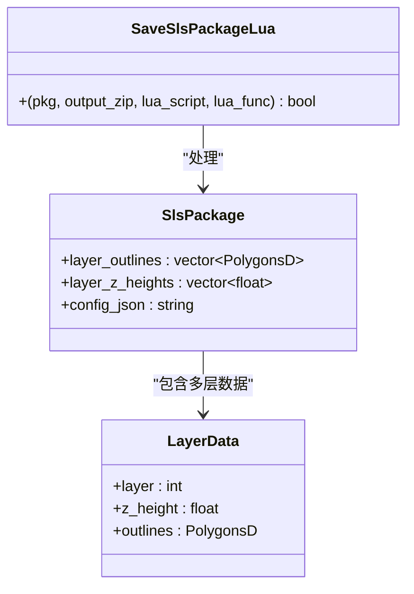

图表来源
- [sls_export.hpp:20-47](file://LibHsBaSlicer/Path/sls_export.hpp#L20-47)

### 核心API接口
SLS导出功能提供以下主要接口：

- `SlsPackage` 数据结构：封装SLS导出的核心数据，包括每层轮廓、Z高度和配置信息
- `SaveSlsPackageLua()`：使用Lua脚本执行自定义导出逻辑，支持zip打包和数据库注册

### 数据包结构
SlsPackage包含以下关键字段：
- **layer_outlines**：每层的二维多边形轮廓数组
- **layer_z_heights**：对应的Z轴高度值（毫米）
- **config_json**：JSON格式的配置文件内容

### Lua脚本环境
SLS导出脚本运行在完整的Lua环境中，提供以下全局变量：
- `config`：包含路径和配置字符串的表
- `images`：每层数据的数组，每个元素包含路径和数据
- `output_path`：输出文件路径
- 已注册的Lua库：Zipper、Cipher、SQLite、MySQL、PostgreSQL等

### 构建系统集成
SLS导出功能通过CMake构建系统自动集成到LibHsBaSlicer库中，支持动态编译选项控制第三方库的可用性。

**章节来源**
- [sls_export.hpp:20-47](file://LibHsBaSlicer/Path/sls_export.hpp#L20-47)
- [sls_export.cpp:50-94](file://LibHsBaSlicer/Path/sls_export.cpp#L50-94)
- [LuaAdapter.hpp:25-58](file://fileoperator/LuaAdapter.hpp#L25-58)

## 版本信息管理

### 架构设计
版本管理功能已完成架构重构，从DllHsBaSlicer迁移到LibHsBaSlicer核心库，实现了统一的版本信息访问接口。新版本管理架构采用分层设计：

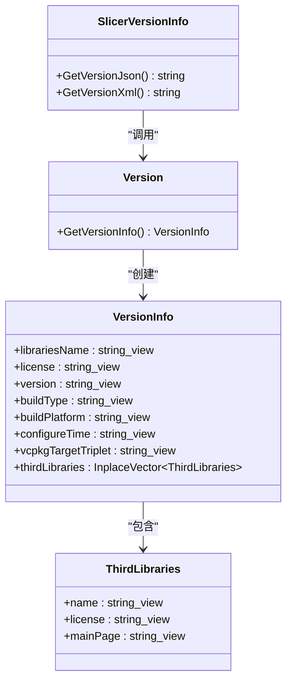

图表来源
- [version.hpp:17-31](file://version/version.hpp#L17-L31)
- [version_info.hpp:9-23](file://LibHsBaSlicer/version_info.hpp#L9-23)

### 核心API接口
LibHsBaSlicer提供两个主要的版本信息查询接口：

- `GetVersionJson()`：获取格式化的JSON字符串版本信息
- `GetVersionXml()`：获取XML格式的版本信息

这两个接口都返回UTF-8编码的字符串，便于跨语言使用。

### 版本信息结构
版本信息包含以下关键字段：
- **基础信息**：库名称、许可证、版本号
- **构建信息**：构建类型、目标平台、配置时间、vcpkg三元组
- **第三方库**：依赖的第三方库列表及其许可证信息

### 构建系统集成
版本信息通过CMake构建系统自动生成，支持动态配置：

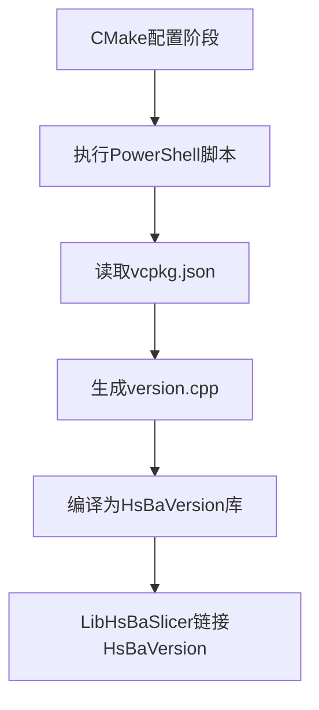

图表来源
- [CMakeLists.txt:28-45](file://version/CMakeLists.txt#L28-L45)

**章节来源**
- [version_info.hpp:11-21](file://LibHsBaSlicer/version_info.hpp#L11-21)
- [version_info.cpp:9-19](file://LibHsBaSlicer/version_info.cpp#L9-19)
- [version.hpp:17-31](file://version/version.hpp#L17-L31)
- [CMakeLists.txt:47-56](file://version/CMakeLists.txt#L47-L56)

## 架构总览
LibHsBaSlicer 以 IModel 抽象为核心，上层各模块围绕其提供的几何接口进行切片与后处理。导出宏 HSBA_SLICER_LIB_API 用于跨平台符号导出。

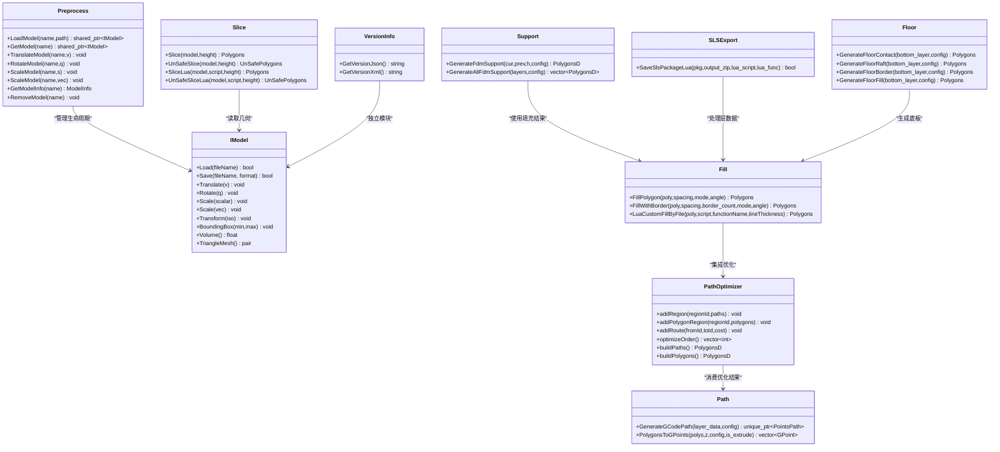

图表来源
- [IModel.hpp:107-136](file://base/IModel.hpp#L107-L136)
- [model_preprocess.hpp:15-85](file://LibHsBaSlicer/Preprocess/model_preprocess.hpp#L15-L85)
- [mesh_slice.hpp:13-25](file://LibHsBaSlicer/Slice/mesh_slice.hpp#L13-25)
- [fdm_support.hpp:11-33](file://LibHsBaSlicer/Support/fdm_support.hpp#L11-L33)
- [polygon_fill.hpp:9-33](file://LibHsBaSlicer/Fill/polygon_fill.hpp#L9-33)
- [path_optimizer.hpp:18-84](file://LibHsBaSlicer/Path/path_optimizer.hpp#L18-84)
- [path_generator.hpp:13-59](file://LibHsBaSlicer/Path/path_generator.hpp#L13-59)
- [sls_export.hpp:20-47](file://LibHsBaSlicer/Path/sls_export.hpp#L20-47)
- [sla_floor.hpp:20-74](file://LibHsBaSlicer/Floor/sla_floor.hpp#L20-74)
- [version_info.hpp:11-21](file://LibHsBaSlicer/version_info.hpp#L11-21)

## 详细组件分析

### 预处理（Preprocess）
- 职责：加载多种格式的 3D 模型，维护名称到模型的映射，提供平移/旋转/缩放/仿射变换与信息查询（包围盒、体积）。
- 关键设计：
  - 使用线程局部存储的 ModelLoader 实例，避免全局状态竞争。
  - 对不存在的模型名返回空指针或忽略操作，保证健壮性。
- 复杂度与性能：
  - 加载与保存取决于底层格式解析器；查询与变换为 O(1) 索引访问与几何计算。
- 错误处理：
  - 重复名称或非法格式抛出 InvalidArgumentError；IO 失败抛出 RuntimeError。

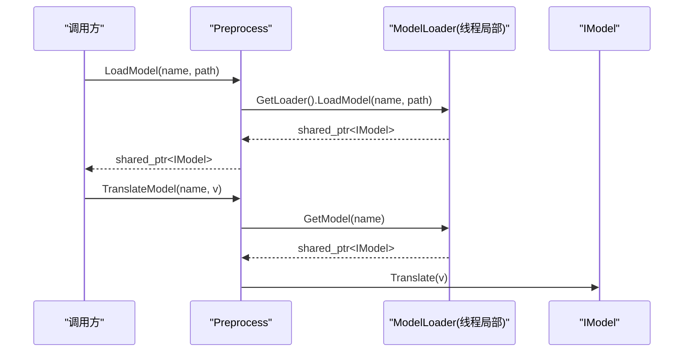

图表来源
- [model_preprocess.cpp:17-34](file://LibHsBaSlicer/Preprocess/model_preprocess.cpp#L17-L34)
- [model_preprocess.hpp:27-56](file://LibHsBaSlicer/Preprocess/model_preprocess.hpp#L27-L56)

章节来源
- [model_preprocess.hpp:15-85](file://LibHsBaSlicer/Preprocess/model_preprocess.hpp#L15-L85)
- [model_preprocess.cpp:1-81](file://LibHsBaSlicer/Preprocess/model_preprocess.cpp#L1-L81)

### 切片（Slice）
- 职责：对 IModel 进行 Z 向切片，返回安全或不安全的二维轮廓集合；支持 Lua 脚本定制切片逻辑。
- 关键设计：
  - 内部构造 FullTopoModel 包装 IModel，再调用其 Slice/UnSafeSlice 等方法。
  - 安全切片会过滤非封闭轮廓；不安全切片保留原始拓扑信息。
- 复杂度与性能：
  - 主要开销来自三角网格切片与拓扑重建；可按层高并行化（注释提示协程场景）。


图表来源
- [mesh_slice.cpp:5-14](file://LibHsBaSlicer/Slice/mesh_slice.cpp#L5-L14)
- [mesh_slice.hpp:15-21](file://LibHsBaSlicer/Slice/mesh_slice.hpp#L15-L21)

章节来源
- [mesh_slice.hpp:13-25](file://LibHsBaSlicer/Slice/mesh_slice.hpp#L13-25)
- [mesh_slice.cpp:1-28](file://LibHsBaSlicer/Slice/mesh_slice.cpp#L1-L28)

### 支撑（Support）
- 职责：根据当前层与上一层轮廓、层高与配置，生成 FDM 支撑截面；支持批量全层生成。
- 关键设计：
  - 单层层级函数 GenerateFdmSupport 与全层函数 GenerateAllFdmSupport 分离，便于流水线集成。
  - 配置项由 Support::FdmSupportConfig 提供（如悬垂角度、间距、密度等）。
- 复杂度与性能：
  - 逐层扫描与区域判定为主；可结合分层并行策略提升吞吐。

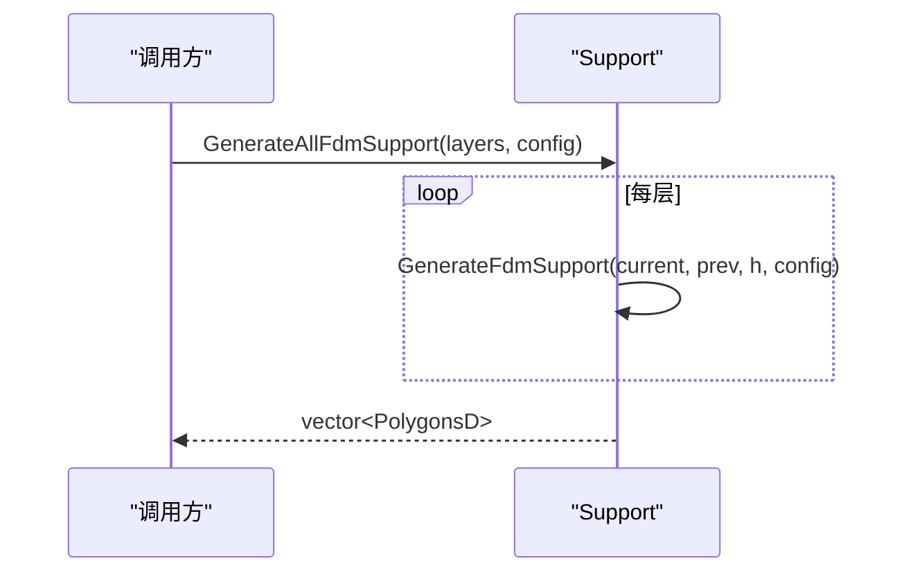

图表来源
- [fdm_support.hpp:20-31](file://LibHsBaSlicer/Support/fdm_support.hpp#L20-31)

章节来源
- [fdm_support.hpp:11-33](file://LibHsBaSlicer/Support/fdm_support.hpp#L11-L33)

### 填充（Fill）
- 职责：对二维多边形执行不同模式的填充，并提供带边框的复合偏移填充。
- 关键设计：
  - FillPolygon 根据模式分派至 Line/SimpleZigzag/Zigzag 算法。
  - FillWithBorder 使用 CompositeOffsetFill 实现向内偏移生成边框后再填充。
  - **新增**：LuaCustomFillByFile 集成了路径优化功能，支持在填充脚本中使用PathOptimize。
- 复杂度与性能：
  - 填充算法通常为 O(n·k)，n 为边界点数，k 为填充线数；角度与间距影响 k。

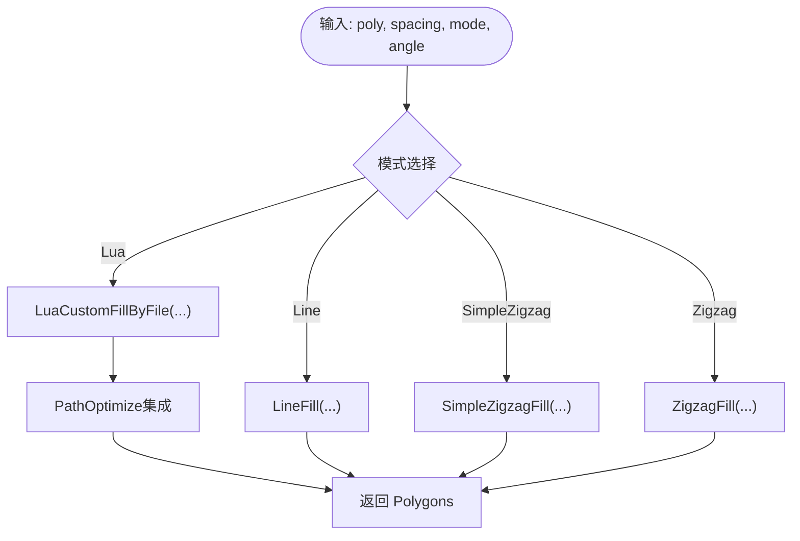

图表来源
- [polygon_fill.cpp:9-44](file://LibHsBaSlicer/Fill/polygon_fill.cpp#L9-44)
- [polygon_fill.hpp:21-49](file://LibHsBaSlicer/Fill/polygon_fill.hpp#L21-49)

章节来源
- [polygon_fill.hpp:9-33](file://LibHsBaSlicer/Fill/polygon_fill.hpp#L9-33)
- [polygon_fill.cpp:1-47](file://LibHsBaSlicer/Fill/polygon_fill.cpp#L1-L47)

### 路径优化（Path Optimizer）
- 职责：独立多边形区域访问顺序优化，减少空走距离，提升打印效率。
- 关键设计：
  - RegionPathOptimizer 支持两种优化模式：填充结果模式和多边形模式。
  - AreaGraph 提供核心图论算法，包括最短路径和TSP求解。
  - Lua绑定提供完整的脚本扩展能力。
- 复杂度与性能：
  - TSP求解使用遗传算法，时间复杂度O(n²·G)，G为迭代次数。
  - 区域内贪心编排为O(n²)，整体性能适合中等规模区域集合。
- 错误处理：
  - 模式混用检查，区域ID重复检查，TSP求解失败回退。

```mermaid
sequenceDiagram
participant App as "调用方"
participant Opt as "RegionPathOptimizer"
participant AG as "AreaGraph"
participant GA as "遗传算法"
App->>Opt : addRegion()/addPolygonRegion()
Opt->>AG : buildAreaGraph()
App->>Opt : optimizeOrder()
Opt->>AG : solveTSP(mustVisit)
AG->>GA : GeneticTSP.solve()
GA-->>AG : 最优路径
AG-->>Opt : tour + entryGates
Opt-->>App : 优化顺序
```

图表来源
- [path_optimizer.cpp:113-161](file://LibHsBaSlicer/Path/path_optimizer.cpp#L113-161)
- [AreaGraph.hpp:231-308](file://utils/AreaGraph.hpp#L231-308)

章节来源
- [path_optimizer.hpp:18-161](file://LibHsBaSlicer/Path/path_optimizer.hpp#L18-161)
- [path_optimizer.cpp:1-662](file://LibHsBaSlicer/Path/path_optimizer.cpp#L1-662)
- [AreaGraph.hpp:1-558](file://utils/AreaGraph.hpp#L1-558)

### 路径生成（Path）
- 职责：将层数据（轮廓、填充、支撑）转换为 G-code 点序列，封装挤出/移动段与速度、线宽、单位等工艺参数。
- 关键设计：
  - LayerPathData 聚合一层所需的路径元素与 Z 高度。
  - GenerateGCodePath 接收多层数据与 FdmPathConfig，输出 PointsPath。
  - PolygonsToGPoints 作为辅助，将 PolygonsD 转为 GPoint 序列。
- 复杂度与性能：
  - 路径生成主要为线性遍历与坐标变换；可通过批处理与内存池优化。

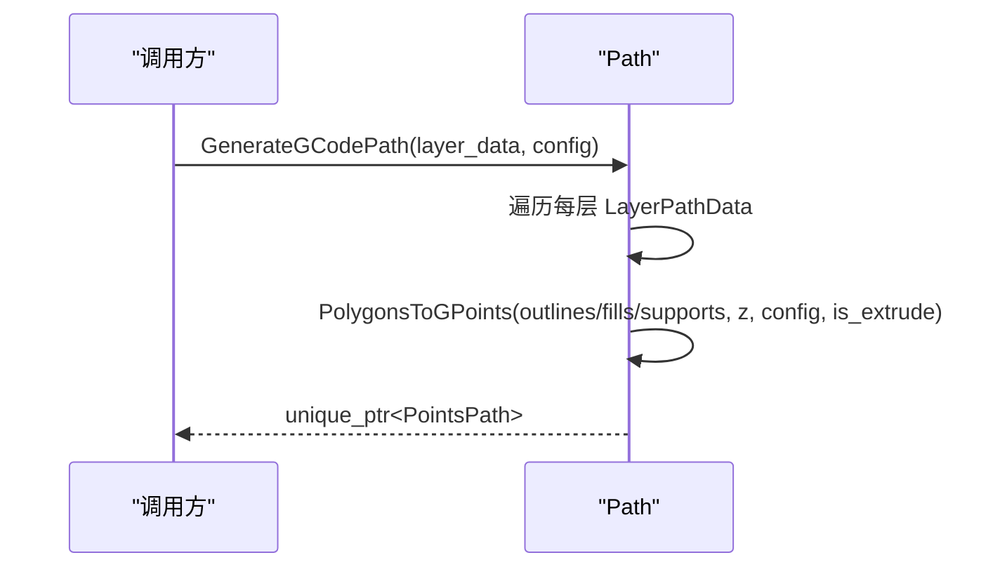

图表来源
- [path_generator.hpp:18-57](file://LibHsBaSlicer/Path/path_generator.hpp#L18-57)

章节来源
- [path_generator.hpp:13-59](file://LibHsBaSlicer/Path/path_generator.hpp#L13-59)

### SLS导出（SLS Export）
- 职责：为选择性激光烧结工艺提供专用导出功能，支持Lua脚本驱动的自定义输出格式。
- 关键设计：
  - SlsPackage 数据结构封装层轮廓、Z高度和配置信息。
  - SaveSlsPackageLua 函数提供完整的Lua脚本执行环境，支持zip打包和数据库操作。
  - 内置JSON序列化功能，将多边形数据转换为标准格式。
- 复杂度与性能：
  - JSON序列化开销与层数和顶点数量成正比；Lua脚本执行时间取决于自定义逻辑复杂度。
- 错误处理：
  - 捕获所有异常并返回布尔值表示成功/失败；支持可选的错误消息传递。

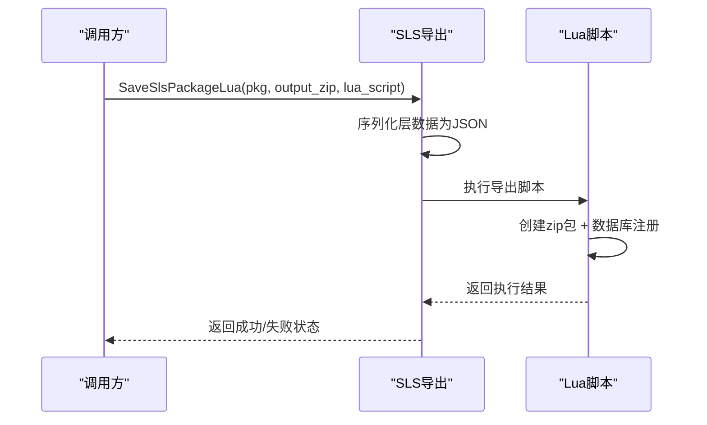

图表来源
- [sls_export.cpp:50-94](file://LibHsBaSlicer/Path/sls_export.cpp#L50-94)

章节来源
- [sls_export.hpp:20-47](file://LibHsBaSlicer/Path/sls_export.hpp#L20-47)
- [sls_export.cpp:1-97](file://LibHsBaSlicer/Path/sls_export.cpp#L1-97)

### 底板（Floor）
- 职责：为SLA工艺生成接触底板和支撑结构，支持凸包和凹包简化算法。
- 关键设计：
  - GenerateFloorContact 计算接触区域，支持凸包和凹包简化。
  - GenerateFloorRaft 生成完整的底板结构，包括边框和内填充。
  - 支持Lua脚本自定义底板生成逻辑。
- 复杂度与性能：
  - 凸包算法复杂度为O(n log n)；凹包算法复杂度更高但能更好地贴合复杂形状。

章节来源
- [sla_floor.hpp:20-74](file://LibHsBaSlicer/Floor/sla_floor.hpp#L20-74)

## 依赖关系分析
LibHsBaSlicer 通过 CMake 链接多个基础与领域库，并在非移动端/主机平台可选链接 CAD 内核。

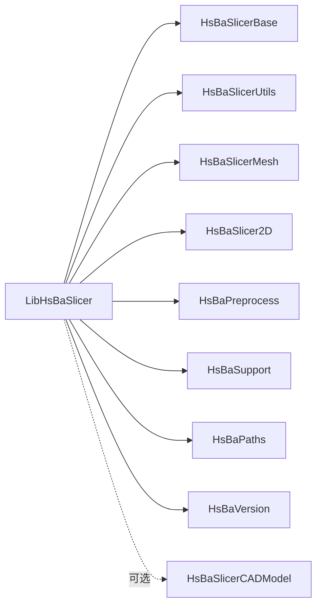

图表来源
- [CMakeLists.txt:45-54](file://LibHsBaSlicer/CMakeLists.txt#L45-54)

章节来源
- [CMakeLists.txt:1-78](file://LibHsBaSlicer/CMakeLists.txt#L1-78)

## 性能与并发特性
- 线程局部模型池：预处理模块使用 thread_local 的 ModelLoader，避免多线程竞争，提高并发安全性与性能。
- 切片并行潜力：注释指出在层间路径规划不干涉时可考虑协程并行处理单层路径，适合高吞吐流水线。
- 预编译头：通过 pch_headers.hpp 集中引入常用标准库与第三方头，减少重复编译开销。
- 版本信息缓存：版本信息在构建时生成，运行时直接访问，无额外性能开销。
- SLS导出优化：JSON序列化采用流式处理，避免大对象内存分配；Lua脚本执行支持异步回调。
- **路径优化优化**：AreaGraph使用懒加载机制，仅在需要时构建扩展图；TSP求解支持参数调优平衡精度与速度。
- 建议：
  - 大批量模型处理时复用模型对象，避免频繁加载/释放。
  - 合理设置填充间距与壁厚，平衡质量与时间。
  - 对超大模型优先使用不安全切片获取完整拓扑，再进行后处理筛选。
  - SLS导出时使用合适的压缩级别，平衡文件大小和处理时间。
  - 路径优化时根据区域数量选择合适的TSP参数，小区域集可使用默认参数，大规模区域集建议增加populationSize。

章节来源
- [model_preprocess.cpp:9-14](file://LibHsBaSlicer/Preprocess/model_preprocess.cpp#L9-L14)
- [mesh_slice.hpp:15-16](file://LibHsBaSlicer/Slice/mesh_slice.hpp#L15-L16)
- [pch_headers.hpp:1-40](file://LibHsBaSlicer/pch_headers.hpp#L1-L40)
- [sls_export.cpp:50-94](file://LibHsBaSlicer/Path/sls_export.cpp#L50-94)
- [AreaGraph.hpp:231-308](file://utils/AreaGraph.hpp#L231-308)

## 故障排查指南
- 模型加载失败
  - 检查文件路径与格式是否受支持；确认未重复注册同名模型。
  - 关注抛出的 InvalidArgumentError 与 RuntimeError 异常类型。
- 切片结果为空
  - 确认层高是否在模型包围盒范围内；必要时使用不安全切片查看原始轮廓。
- 支撑/填充异常
  - 调整悬垂角度、填充间距与壁厚；检查输入轮廓是否为有效闭合多边形。
- 路径生成问题
  - 核对 FdmPathConfig 的单位、线宽与速度设置；确保层数据中 z_height 正确递增。
- **路径优化失败**
  - 检查区域ID是否重复；确认同一优化器内未混用两种模式。
  - 验证AreaGraph构建是否成功；检查区域间是否存在可达路径。
  - 对于大规模区域集，适当调整TSP参数（populationSize、maxGenerations）。
- **Lua脚本错误**
  - 确认PathOptimize函数是否正确注册；检查脚本语法和函数签名。
  - 验证regions数据结构是否符合要求；检查点坐标格式是否正确。
- **SLS导出失败**
  - 检查Lua脚本语法和路径是否正确；确认输出目录具有写入权限。
  - 验证Lua环境中必要的库（Zipper、数据库适配器）是否正确注册。
  - 检查SlsPackage数据结构中的层数据是否为空或无效。
- **版本信息查询失败**
  - 确认已正确链接 HsBaVersion 库；检查构建类型是否正确传递。
  - 验证 PowerShell 环境是否正常，确保版本信息生成脚本可执行。

章节来源
- [model_preprocess.hpp:27-35](file://LibHsBaSlicer/Preprocess/model_preprocess.hpp#L27-35)
- [mesh_slice.hpp:17-21](file://LibHsBaSlicer/Slice/mesh_slice.hpp#L17-21)
- [fdm_support.hpp:13-22](file://LibHsBaSlicer/Support/fdm_support.hpp#L13-22)
- [polygon_fill.hpp:11-31](file://LibHsBaSlicer/Fill/polygon_fill.hpp#L11-31)
- [path_optimizer.hpp:41-79](file://LibHsBaSlicer/Path/path_optimizer.hpp#L41-79)
- [path_generator.hpp:18-57](file://LibHsBaSlicer/Path/path_generator.hpp#L18-57)
- [sls_export.cpp:50-94](file://LibHsBaSlicer/Path/sls_export.cpp#L50-94)

## 结论
LibHsBaSlicer 提供了从模型预处理到 G-code 路径生成的完整切片链路，具备清晰的模块化设计与良好的可扩展性（Lua 脚本、多后端模型）。通过合理的参数配置与并发策略，可在多平台上稳定高效地服务 FDM/SLA/SLS 等工艺需求。

**更新** 新增的完整路径优化功能进一步增强了库的工艺覆盖范围，通过RegionPathOptimizer类和AreaGraph算法实现了高效的独立区域访问顺序优化。该功能支持填充前和填充后两种模式，能够显著减少打印过程中的空走距离，提升打印效率。同时，路径优化功能与Fill阶段的深度集成使得用户可以在自定义填充脚本中直接使用PathOptimize，提供了极大的灵活性。SLS导出功能的完善和版本管理架构的重构也进一步提升了库的完整性，为用户提供了更加专业和可靠的增材制造解决方案。

## 附录：API参考
- 预处理
  - LoadModel / GetModel / TranslateModel / RotateModel / ScaleModel / GetModelInfo / RemoveModel
- 切片
  - Slice / UnSafeSlice / SliceLua / UnSafeSliceLua
- 支撑
  - GenerateFdmSupport / GenerateAllFdmSupport
- 填充
  - FillPolygon / FillWithBorder / LuaCustomFillByFile
- **路径优化**
  - RegionPathOptimizer / addRegion / addPolygonRegion / addRoute / optimizeOrder / buildPaths / buildPolygons
  - PathOptimize / new / optimizeRegions / optimizePolygons
  - LuaOptimizeRegionPaths / LuaOptimizeRegionPathsString / LuaOptimizeRegionPolygons / LuaOptimizeRegionPolygonsString
- 路径生成
  - GenerateGCodePath / PolygonsToGPoints
- SLS导出
  - SlsPackage / SaveSlsPackageLua
- 底板
  - GenerateFloorContact / GenerateFloorRaft / GenerateFloorBorder / GenerateFloorFill
  - LuaCustomFloorByFile / LuaCustomFloorByString
  - RenderPolygonsToImage / SaveSlaPackage / SaveSlaPackageLua
- 版本管理
  - GetVersionJson / GetVersionXml
- 导出宏
  - HSBA_SLICER_LIB_API（Windows 下 __declspec(dllexport/dllimport)，其他平台为空）

章节来源
- [model_preprocess.hpp:15-85](file://LibHsBaSlicer/Preprocess/model_preprocess.hpp#L15-L85)
- [mesh_slice.hpp:13-25](file://LibHsBaSlicer/Slice/mesh_slice.hpp#L13-25)
- [fdm_support.hpp:11-33](file://LibHsBaSlicer/Support/fdm_support.hpp#L11-L33)
- [polygon_fill.hpp:9-33](file://LibHsBaSlicer/Fill/polygon_fill.hpp#L9-33)
- [path_optimizer.hpp:18-161](file://LibHsBaSlicer/Path/path_optimizer.hpp#L18-161)
- [path_generator.hpp:13-59](file://LibHsBaSlicer/Path/path_generator.hpp#L13-59)
- [sls_export.hpp:20-47](file://LibHsBaSlicer/Path/sls_export.hpp#L20-47)
- [sla_floor.hpp:20-178](file://LibHsBaSlicer/Floor/sla_floor.hpp#L20-178)
- [version_info.hpp:11-21](file://LibHsBaSlicer/version_info.hpp#L11-21)
- [export.h:1-15](file://LibHsBaSlicer/export.h#L1-L15)