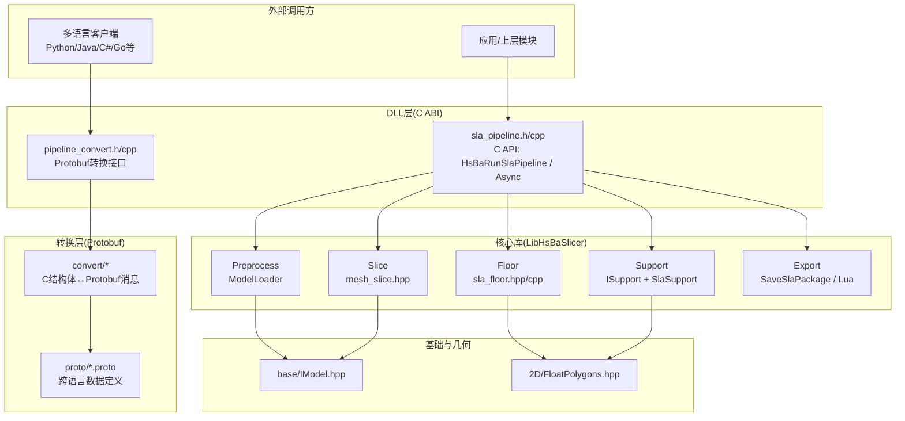
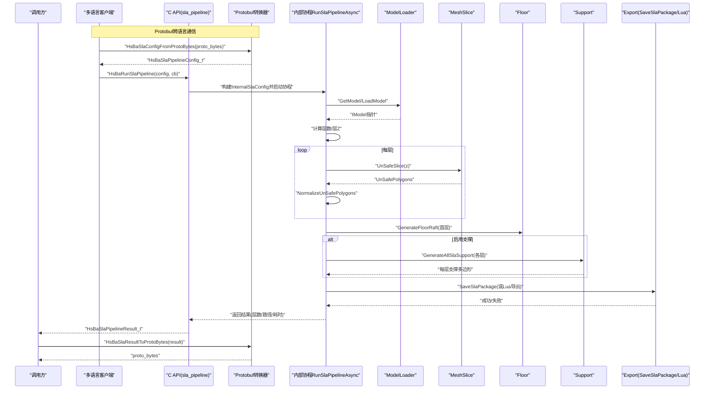
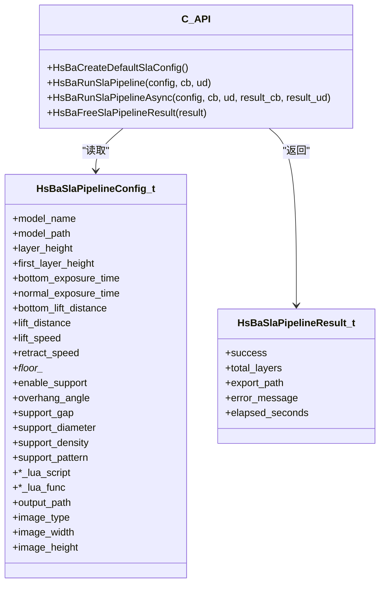
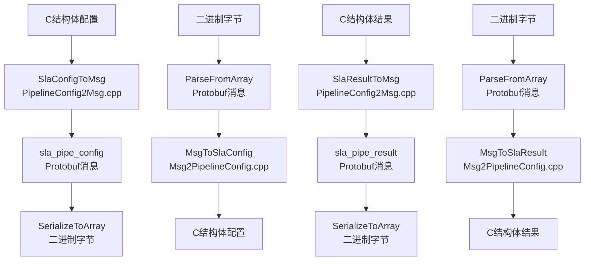
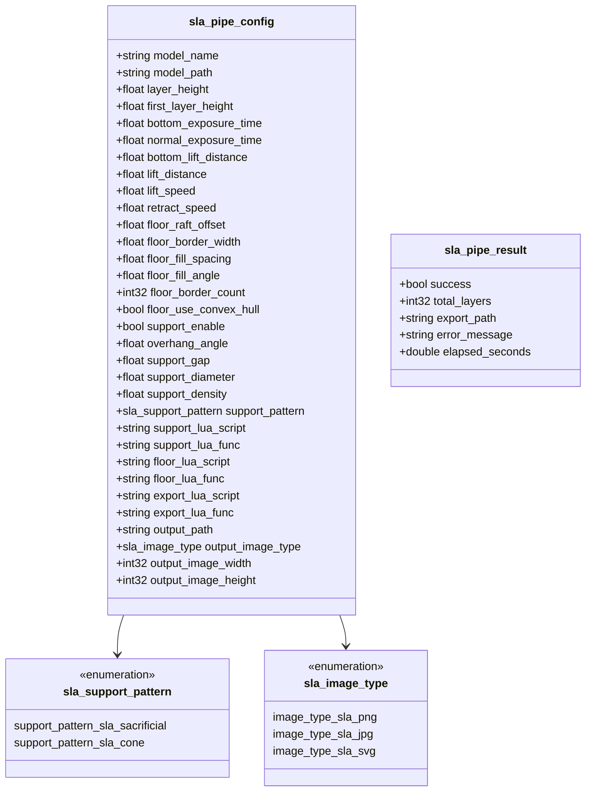
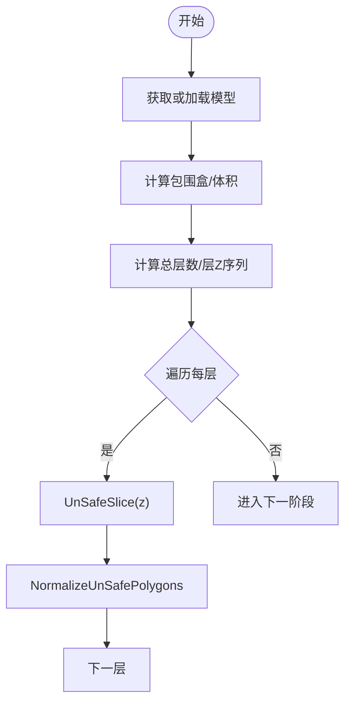
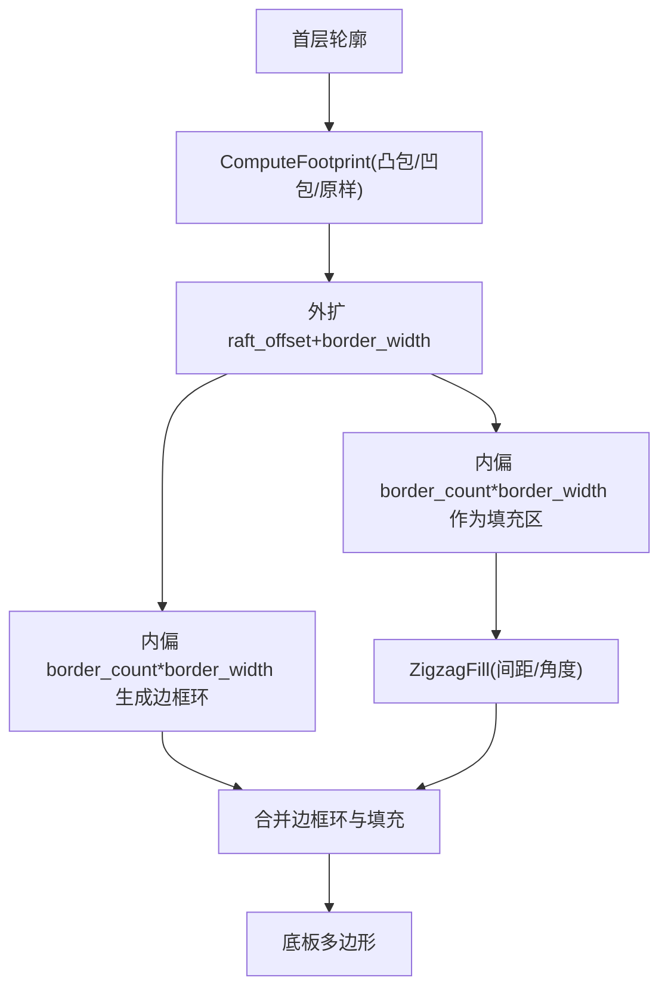
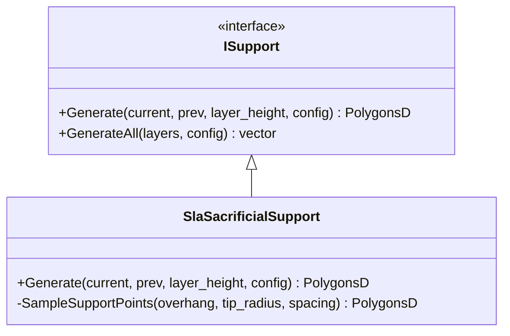
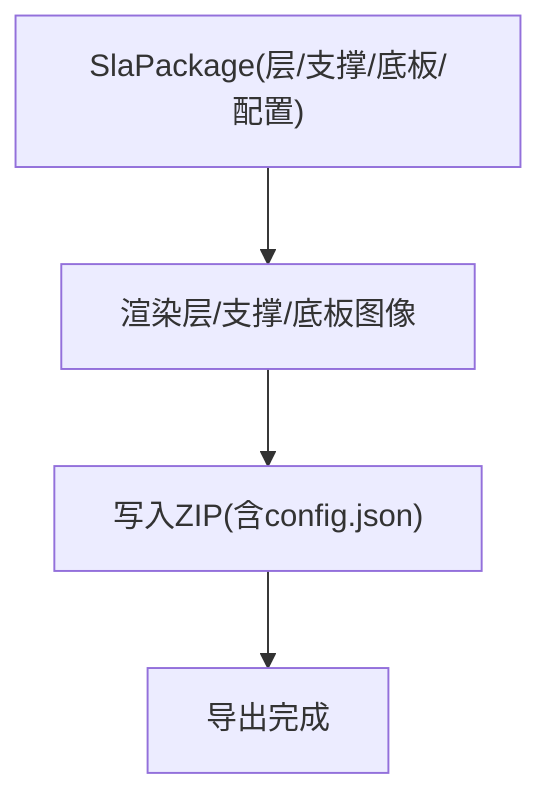
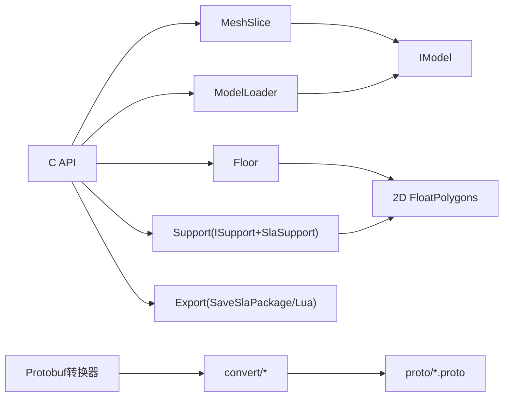

# SLA立体光刻流水线

<cite>
**本文引用的文件**   
- [README.md](file://README.md)
- [DllHsBaSlicer/sla_pipeline.h](file://DllHsBaSlicer/sla_pipeline.h)
- [DllHsBaSlicer/sla_pipeline.cpp](file://DllHsBaSlicer/sla_pipeline.cpp)
- [DllHsBaSlicer/pipeline_convert.h](file://DllHsBaSlicer/pipeline_convert.h)
- [DllHsBaSlicer/pipeline_convert.cpp](file://DllHsBaSlicer/pipeline_convert.cpp)
- [convert/PipelineConfig2Msg.hpp](file://convert/PipelineConfig2Msg.hpp)
- [convert/PipelineConfig2Msg.cpp](file://convert/PipelineConfig2Msg.cpp)
- [convert/Msg2PipelineConfig.hpp](file://convert/Msg2PipelineConfig.hpp)
- [convert/Msg2PipelineConfig.cpp](file://convert/Msg2PipelineConfig.cpp)
- [proto/sla_pipeline.proto](file://proto/sla_pipeline.proto)
- [LibHsBaSlicer/Floor/sla_floor.hpp](file://LibHsBaSlicer/Floor/sla_floor.hpp)
- [LibHsBaSlicer/Floor/sla_floor.cpp](file://LibHsBaSlicer/Floor/sla_floor.cpp)
- [support/SlaSupport.hpp](file://support/SlaSupport.hpp)
- [support/SlaSupport.cpp](file://support/SlaSupport.cpp)
- [support/ISupport.hpp](file://support/ISupport.hpp)
- [LibHsBaSlicer/Slice/mesh_slice.hpp](file://LibHsBaSlicer/Slice/mesh_slice.hpp)
- [preprocess/ModelLoader.hpp](file://preprocess/ModelLoader.hpp)
- [base/IModel.hpp](file://base/IModel.hpp)
- [2D/FloatPolygons.hpp](file://2D/FloatPolygons.hpp)
- [samples/SLA/main.cpp](file://samples/SLA/main.cpp)
</cite>

## 更新摘要
**变更内容**   
- 新增Protobuf配置和结果交换功能，支持跨语言集成
- 添加C API转换函数用于Proto字节与C结构体之间的双向转换
- 扩展架构以支持多语言客户端通过Protobuf进行通信
- 新增内存管理辅助函数用于清理转换后的字符串字段

## 目录
1. [简介](#简介)
2. [项目结构](#项目结构)
3. [核心组件](#核心组件)
4. [架构总览](#架构总览)
5. [详细组件分析](#详细组件分析)
6. [依赖关系分析](#依赖关系分析)
7. [性能与可扩展性](#性能与可扩展性)
8. [故障排查指南](#故障排查指南)
9. [结论](#结论)
10. [附录：API与配置速查](#附录api与配置速查)

## 简介
本仓库提供面向SLA（立体光刻）的高性能C++切片框架，包含从模型加载、网格切片、底板生成、支撑生成到打包导出的完整流水线。对外暴露C ABI接口，支持同步与异步调用，并提供Lua脚本扩展点以自定义底板、支撑与导出逻辑。**现已新增Protobuf序列化支持，允许通过标准协议缓冲区格式进行配置和结果交换，实现跨语言集成能力。**

## 项目结构
- DllHsBaSlicer：导出C ABI的运行时流水线接口，封装同步/异步入口与进度回调，**新增Protobuf转换接口**。
- LibHsBaSlicer：静态库，提供核心切片能力（预处理、切片、底板、支撑、导出）。
- convert：Protobuf消息与C结构体之间的双向转换工具集。
- proto：Protobuf定义文件，描述配置和结果的跨语言数据结构。
- support：支撑算法抽象与SLA牺牲型支撑实现。
- preprocess：统一模型加载器，按后缀自动选择IGL或OCCT后端。
- base：基础类型与IModel接口定义。
- 2D：二维几何与多边形运算封装。
- samples/SLA：示例程序演示基本用法、参数定制、Lua自定义与异步调用。

**图表来源**
- [DllHsBaSlicer/sla_pipeline.h:1-160](file://DllHsBaSlicer/sla_pipeline.h#L1-L160)
- [DllHsBaSlicer/pipeline_convert.h:1-123](file://DllHsBaSlicer/pipeline_convert.h#L1-L123)
- [convert/PipelineConfig2Msg.hpp:1-28](file://convert/PipelineConfig2Msg.hpp#L1-L28)
- [proto/sla_pipeline.proto:1-67](file://proto/sla_pipeline.proto#L1-L67)

## 核心组件
- C API与流水线编排：提供默认配置、同步/异步执行、进度回调与结果释放。
- **Protobuf转换系统：提供C结构体与Protobuf消息之间的双向转换，支持跨语言通信。**
- 模型管理：统一加载与命名池管理，自动选择IGL/OCCT后端。
- 切片：安全/不安全切片与规范化处理，输出每层轮廓。
- 底板/托板：接触面计算、外扩边界、内圈边框与填充，支持凸包/凹包简化。
- 支撑：基于悬垂检测的牺牲型支撑，逐层生成圆形截面并合并。
- 导出：将层图像、底板图、支撑图与配置JSON打包为ZIP；支持Lua自定义导出。

**章节来源**
- [DllHsBaSlicer/sla_pipeline.h:1-160](file://DllHsBaSlicer/sla_pipeline.h#L1-L160)
- [DllHsBaSlicer/pipeline_convert.h:1-123](file://DllHsBaSlicer/pipeline_convert.h#L1-L123)
- [convert/PipelineConfig2Msg.hpp:1-28](file://convert/PipelineConfig2Msg.hpp#L1-L28)

## 架构总览
SLA流水线整体流程如下：
- **Protobuf转换：支持从Protobuf字节序列解析配置，或将C结构体配置序列化为Protobuf字节。**
- 预处理：根据名称获取或加载模型，计算包围盒与层数。
- 切片：遍历各层Z高度进行切片，得到每层轮廓。
- 底板：基于首层轮廓生成底板（外扩、边框、填充），可Lua自定义。
- 支撑：检测悬垂区域，生成牺牲型支撑截面，可Lua自定义。
- 导出：渲染层图像、底板与支撑图像，生成config.json并打包ZIP，可Lua自定义导出。

**图表来源**
- [DllHsBaSlicer/sla_pipeline.cpp:266-430](file://DllHsBaSlicer/sla_pipeline.cpp#L266-L430)
- [DllHsBaSlicer/pipeline_convert.cpp:103-179](file://DllHsBaSlicer/pipeline_convert.cpp#L103-L179)
- [convert/Msg2PipelineConfig.cpp:75-126](file://convert/Msg2PipelineConfig.cpp#L75-L126)

## 详细组件分析

### C API与流水线编排
- 配置结构体覆盖模型、切片、曝光、提升回退、底板、支撑、Lua扩展与输出格式等参数。
- 同步接口直接等待协程完成；异步接口通过then回调返回结果。
- 内部使用协程组织阶段化流程，并在每个阶段上报进度。

**图表来源**
- [DllHsBaSlicer/sla_pipeline.h:31-153](file://DllHsBaSlicer/sla_pipeline.h#L31-L153)
- [DllHsBaSlicer/sla_pipeline.cpp:436-509](file://DllHsBaSlicer/sla_pipeline.cpp#L436-L509)

**章节来源**
- [DllHsBaSlicer/sla_pipeline.h:1-160](file://DllHsBaSlicer/sla_pipeline.h#L1-L160)
- [DllHsBaSlicer/sla_pipeline.cpp:212-509](file://DllHsBaSlicer/sla_pipeline.cpp#L212-L509)

### Protobuf转换系统
**新增** 提供完整的Protobuf序列化/反序列化支持，实现跨语言配置交换：

- **配置转换**：`HsBaSlaConfigFromProtoBytes` 和 `HsBaSlaConfigToProtoBytes` 用于SLA配置的Protobuf序列化
- **结果转换**：`HsBaSlaResultFromProtoBytes` 和 `HsBaSlaResultToProtoBytes` 用于SLA结果的Protobuf序列化  
- **内存管理**：`HsBaFreeSlaConfigStrings` 用于清理转换后分配的字符串内存
- **FDM支持**：同时提供FDM流水线的相同转换接口

**图表来源**
- [DllHsBaSlicer/pipeline_convert.cpp:103-179](file://DllHsBaSlicer/pipeline_convert.cpp#L103-L179)
- [convert/PipelineConfig2Msg.cpp:61-121](file://convert/PipelineConfig2Msg.cpp#L61-L121)
- [convert/Msg2PipelineConfig.cpp:75-126](file://convert/Msg2PipelineConfig.cpp#L75-L126)

**章节来源**
- [DllHsBaSlicer/pipeline_convert.h:61-117](file://DllHsBaSlicer/pipeline_convert.h#L61-L117)
- [DllHsBaSlicer/pipeline_convert.cpp:101-210](file://DllHsBaSlicer/pipeline_convert.cpp#L101-L210)
- [convert/PipelineConfig2Msg.hpp:20-24](file://convert/PipelineConfig2Msg.hpp#L20-L24)
- [convert/Msg2PipelineConfig.hpp:20-24](file://convert/Msg2PipelineConfig.hpp#L20-L24)

### Protobuf数据定义
**新增** 定义了跨语言通信的数据结构：

- **枚举类型**：`sla_support_pattern`（支撑模式）、`sla_image_type`（图像格式）
- **配置消息**：`sla_pipe_config` 包含所有SLA流水线配置参数
- **结果消息**：`sla_pipe_result` 包含流水线执行结果信息

**图表来源**
- [proto/sla_pipeline.proto:18-67](file://proto/sla_pipeline.proto#L18-L67)

**章节来源**
- [proto/sla_pipeline.proto:1-67](file://proto/sla_pipeline.proto#L1-L67)

### 模型管理与切片
- 模型加载：根据文件名后缀自动选择IGL（STL/OBJ/PLY/OFF）或OCCT（STEP/IGES/VRML/BREP），并通过命名对象池管理生命周期。
- 切片：提供安全与不安全两种切片接口；流水线采用不安全切片后做规范化，过滤非封闭轮廓并转为双精度多边形。

**图表来源**
- [preprocess/ModelLoader.hpp:37-76](file://preprocess/ModelLoader.hpp#L37-L76)
- [LibHsBaSlicer/Slice/mesh_slice.hpp:17-36](file://LibHsBaSlicer/Slice/mesh_slice.hpp#L17-L36)

**章节来源**
- [preprocess/ModelLoader.hpp:1-131](file://preprocess/ModelLoader.hpp#L1-L131)
- [LibHsBaSlicer/Slice/mesh_slice.hpp:1-41](file://LibHsBaSlicer/Slice/mesh_slice.hpp#L1-L41)

### 底板/托板生成
- 接触面：可选凸包或凹包简化，或直接取首层轮廓。
- 外扩与边框：向外偏移生成托板外边界，向内偏移生成边框环。
- 填充：在边框内侧区域进行Zigzag填充。
- Lua扩展：支持从文件或字符串加载Lua脚本，传入底部轮廓与配置表，返回多边形集合。

**图表来源**
- [LibHsBaSlicer/Floor/sla_floor.cpp:19-102](file://LibHsBaSlicer/Floor/sla_floor.cpp#L19-L102)
- [LibHsBaSlicer/Floor/sla_floor.hpp:41-102](file://LibHsBaSlicer/Floor/sla_floor.hpp#L41-L102)

**章节来源**
- [LibHsBaSlicer/Floor/sla_floor.hpp:1-183](file://LibHsBaSlicer/Floor/sla_floor.hpp#L1-L183)
- [LibHsBaSlicer/Floor/sla_floor.cpp:1-200](file://LibHsBaSlicer/Floor/sla_floor.cpp#L1-L200)

### 支撑生成（牺牲型）
- 悬垂检测：基于当前层与上一层的差集与角度阈值识别悬垂区域。
- 间隙控制：对悬垂区域进行负偏移以留出支撑间隙。
- 采样与合并：在悬垂区域内按支撑直径间距采样小圆点，最终合并为支撑截面。
- 接口抽象：ISupport定义单层层级生成与全层批量生成接口，SlaSacrificialSupport实现具体策略。

**图表来源**
- [support/ISupport.hpp:18-41](file://support/ISupport.hpp#L18-L41)
- [support/SlaSupport.hpp:16-38](file://support/SlaSupport.hpp#L16-L38)
- [support/SlaSupport.cpp:34-114](file://support/SlaSupport.cpp#L34-L114)

**章节来源**
- [support/ISupport.hpp:1-45](file://support/ISupport.hpp#L1-L45)
- [support/SlaSupport.hpp:1-42](file://support/SlaSupport.hpp#L1-L42)
- [support/SlaSupport.cpp:1-116](file://support/SlaSupport.cpp#L1-L116)

### 导出与打包
- 数据包：包含每层轮廓、每层支撑、底板多边形、配置JSON、图像尺寸与扩展名、是否包含底板/支撑图像等。
- 渲染与打包：将多边形渲染为PNG/JPG/SVG，写入ZIP归档，同时写入config.json。
- Lua导出：允许用户自定义导出逻辑，替换内置打包流程。

**图表来源**
- [LibHsBaSlicer/Floor/sla_floor.hpp:142-178](file://LibHsBaSlicer/Floor/sla_floor.hpp#L142-L178)

**章节来源**
- [LibHsBaSlicer/Floor/sla_floor.hpp:139-178](file://LibHsBaSlicer/Floor/sla_floor.hpp#L139-L178)

## 依赖关系分析
- 外部依赖：Clipper2用于多边形布尔运算与偏移；Eigen用于向量/矩阵；Lua用于脚本扩展；**Protobuf用于跨语言通信**；可选CGAL/OCCT用于高级CAD操作。
- 内部耦合：
  - C API依赖LibHsBaSlicer的预处理、切片、底板、支撑与导出模块。
  - **Protobuf转换层依赖convert模块进行C结构体与消息的双向转换。**
  - 底板与支撑均依赖2D多边形工具。
  - 切片依赖IModel抽象，由ModelLoader选择具体后端。

**图表来源**
- [DllHsBaSlicer/sla_pipeline.cpp:14-18](file://DllHsBaSlicer/sla_pipeline.cpp#L14-L18)
- [DllHsBaSlicer/pipeline_convert.cpp:8-9](file://DllHsBaSlicer/pipeline_convert.cpp#L8-L9)
- [convert/PipelineConfig2Msg.hpp:8-9](file://convert/PipelineConfig2Msg.hpp#L8-L9)

**章节来源**
- [DllHsBaSlicer/sla_pipeline.cpp:1-20](file://DllHsBaSlicer/sla_pipeline.cpp#L1-L20)
- [DllHsBaSlicer/pipeline_convert.cpp:1-10](file://DllHsBaSlicer/pipeline_convert.cpp#L1-L10)
- [convert/PipelineConfig2Msg.hpp:1-10](file://convert/PipelineConfig2Msg.hpp#L1-L10)

## 性能与可扩展性
- 协程驱动：流水线内部使用协程组织阶段，便于插入并行与进度上报。
- 内存与对象池：模型通过命名对象池管理，减少重复加载开销。
- **Protobuf优化：使用高效的二进制序列化格式，减少网络传输和存储开销。**
- 数值稳定性：切片后规范化去除非封闭轮廓，避免后续几何运算异常。
- 可扩展点：
  - 底板：Lua脚本自定义生成逻辑。
  - 支撑：ISupport抽象支持多种策略（牺牲型、锥型等）。
  - 导出：Lua自定义导出流程。
  - **跨语言：Protobuf支持多语言客户端无缝集成。**

## 故障排查指南
- 模型加载失败：检查模型路径与后缀是否受支持；确认命名未冲突。
- 切片结果为空：验证模型高度与层数计算；关注层Z偏移与包围盒。
- 底板/支撑为空：检查悬垂角度阈值、支撑间隙与直径设置；确认首层轮廓有效。
- 导出失败：确认输出路径可写；检查图像尺寸与扩展名；若使用Lua导出，核对函数名与返回值结构。
- 进度回调无响应：确保回调指针与user_data正确传递；异步模式下注意线程上下文。
- **Protobuf转换失败：检查输入字节数组的有效性；确认Protobuf版本兼容性；验证字段映射是否正确。**
- **内存泄漏：确保调用HsBaFreeSlaConfigStrings释放转换后的字符串内存；正确处理malloc分配的缓冲区。**

**章节来源**
- [DllHsBaSlicer/sla_pipeline.cpp:271-430](file://DllHsBaSlicer/sla_pipeline.cpp#L271-L430)
- [DllHsBaSlicer/pipeline_convert.cpp:183-210](file://DllHsBaSlicer/pipeline_convert.cpp#L183-L210)
- [support/SlaSupport.cpp:70-114](file://support/SlaSupport.cpp#L70-L114)
- [LibHsBaSlicer/Floor/sla_floor.cpp:133-200](file://LibHsBaSlicer/Floor/sla_floor.cpp#L133-L200)

## 结论
该SLA流水线以模块化设计实现了从模型到可打印图像的端到端流程，具备跨平台、可扩展与高性能特性。**新增的Protobuf转换系统进一步增强了跨语言集成能力，使得Python、Java、C#、Go等多语言客户端能够无缝使用该框架。**通过C ABI、Lua扩展与Protobuf支持的三重机制，既能满足生产环境集成需求，也便于研究与二次开发。

## 附录：API与配置速查
- 关键C API
  - 创建默认配置：HsBaCreateDefaultSlaConfig
  - 同步运行：HsBaRunSlaPipeline
  - 异步运行：HsBaRunSlaPipelineAsync
  - 释放结果：HsBaFreeSlaPipelineResult
  - **Protobuf转换：HsBaSlaConfigFromProtoBytes/HsBaSlaConfigToProtoBytes**
  - **结果转换：HsBaSlaResultFromProtoBytes/HsBaSlaResultToProtoBytes**
  - **内存清理：HsBaFreeSlaConfigStrings**
- 主要配置项（节选）
  - 切片：layer_height、first_layer_height
  - 曝光/提升：bottom_exposure_time、normal_exposure_time、lift_distance、lift_speed、retract_speed
  - 底板：raft_offset、border_width、fill_spacing、fill_angle、border_count、use_convex_hull
  - 支撑：enable_support、overhang_angle、support_gap、support_diameter、support_density、support_pattern
  - 输出：output_path、image_type、image_width、image_height
- **Protobuf消息类型**
  - sla_pipe_config：SLA流水线配置消息
  - sla_pipe_result：SLA流水线结果消息
  - sla_support_pattern：支撑模式枚举
  - sla_image_type：图像格式枚举
- 示例程序
  - 基本用法、参数定制、Lua自定义、异步调用参见示例入口。

**章节来源**
- [DllHsBaSlicer/sla_pipeline.h:31-153](file://DllHsBaSlicer/sla_pipeline.h#L31-L153)
- [DllHsBaSlicer/pipeline_convert.h:61-117](file://DllHsBaSlicer/pipeline_convert.h#L61-L117)
- [proto/sla_pipeline.proto:18-67](file://proto/sla_pipeline.proto#L18-L67)
- [samples/SLA/main.cpp:52-271](file://samples/SLA/main.cpp#L52-L271)