# SLA立体光刻流水线

<cite>
**本文引用的文件**   
- [README.md](file://README.md)
- [DllHsBaSlicer/sla_pipeline.h](file://DllHsBaSlicer/sla_pipeline.h)
- [DllHsBaSlicer/sla_pipeline.cpp](file://DllHsBaSlicer/sla_pipeline.cpp)
- [DllHsBaSlicer/pipeline_convert.h](file://DllHsBaSlicer/pipeline_convert.h)
- [DllHsBaSlicer/pipeline_convert.cpp](file://DllHsBaSlicer/pipeline_convert.cpp)
- [DllHsBaSlicer/pipeline_parallel.hpp](file://DllHsBaSlicer/pipeline_parallel.hpp)
- [LibHsBaSlicer/Path/path_optimizer.hpp](file://LibHsBaSlicer/Path/path_optimizer.hpp)
- [LibHsBaSlicer/Path/path_optimizer.cpp](file://LibHsBaSlicer/Path/path_optimizer.cpp)
- [utils/AreaGraph.hpp](file://utils/AreaGraph.hpp)
- [base/thread_pool.hpp](file://base/thread_pool.hpp)
- [convert/PipelineConfig2Msg.hpp](file://convert/PipelineConfig2Msg.hpp)
- [convert/PipelineConfig2Msg.cpp](file://convert/PipelineConfig2Msg.cpp)
- [convert/Msg2PipelineConfig.hpp](file://convert/Msg2PipelineConfig.hpp)
- [convert/Msg2PipelineConfig.cpp](file://convert/Msg2PipelineConfig.cpp)
- [proto/sla_pipeline.proto](file://proto/sla_pipeline.proto)
- [LibHsBaSlicer/Floor/sla_floor.hpp](file://LibHsBaSlicer/Floor/sla_floor.hpp)
- [LibHsBaSlicer/Floor/sla_floor.cpp](file://LibHsBaSlicer/Floor/sla_floor.cpp)
- [support/SlaSupport.hpp](file://support/SlaSupport.hpp)
- [support/SlaSupport.cpp](file://support/SlaSupport.cpp)
- [support/ISupport.hpp](file://support/ISupport.hpp)
- [LibHsBaSlicer/Slice/mesh_slice.hpp](file://LibHsBaSlicer/Slice/mesh_slice.hpp)
- [preprocess/ModelLoader.hpp](file://preprocess/ModelLoader.hpp)
- [base/IModel.hpp](file://base/IModel.hpp)
- [2D/FloatPolygons.hpp](file://2D/FloatPolygons.hpp)
- [samples/SLA/main.cpp](file://samples/SLA/main.cpp)
</cite>

## 更新摘要
**变更内容**   
- 新增并行处理框架，支持按层并行执行切片和填充操作
- 实现区域路径优化器，使用遗传算法TSP优化多区域访问顺序
- 添加AreaGraph图结构，支持门控最短路径和TSP求解
- 增强性能优化，通过多线程提升大规模模型处理效率
- 保持向后兼容，自动回退到串行模式

## 目录
1. [简介](#简介)
2. [项目结构](#项目结构)
3. [核心组件](#核心组件)
4. [架构总览](#架构总览)
5. [详细组件分析](#详细组件分析)
6. [依赖关系分析](#依赖关系分析)
7. [性能与可扩展性](#性能与可扩展性)
8. [故障排查指南](#故障排查指南)
9. [结论](#结论)
10. [附录：API与配置速查](#附录api与配置速查)

## 简介
本仓库提供面向SLA（立体光刻）的高性能C++切片框架，包含从模型加载、网格切片、底板生成、支撑生成到打包导出的完整流水线。对外暴露C ABI接口，支持同步与异步调用，并提供Lua脚本扩展点以自定义底板、支撑与导出逻辑。**现已新增并行处理和路径优化功能，通过多线程加速切片过程，并使用遗传算法优化路径访问顺序，显著提升大规模模型的处理性能。**

## 项目结构
- DllHsBaSlicer：导出C ABI的运行时流水线接口，封装同步/异步入口与进度回调，**新增并行处理支持**。
- LibHsBaSlicer：静态库，提供核心切片能力（预处理、切片、底板、支撑、导出），**新增路径优化模块**。
- convert：Protobuf消息与C结构体之间的双向转换工具集。
- proto：Protobuf定义文件，描述配置和结果的跨语言数据结构。
- support：支撑算法抽象与SLA牺牲型支撑实现。
- preprocess：统一模型加载器，按后缀自动选择IGL或OCCT后端。
- base：基础类型与IModel接口定义。
- 2D：二维几何与多边形运算封装。
- utils：**新增AreaGraph图结构**，支持门控最短路径和TSP求解。
- samples/SLA：示例程序演示基本用法、参数定制、Lua自定义与异步调用。

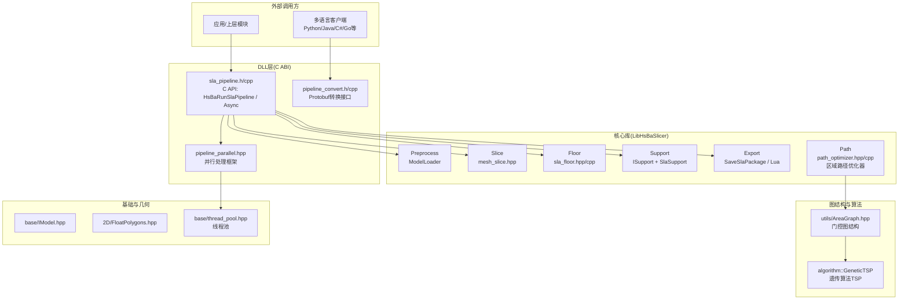
```mermaid
graph TB
subgraph "外部调用方"
App["应用/上层模块"]
MultiLang["多语言客户端<br/>Python/Java/C#/Go等"]
end
subgraph "DLL层(C ABI)"
CAPI["sla_pipeline.h/cpp<br/>C API: HsBaRunSlaPipeline / Async"]
ProtoConvert["pipeline_convert.h/cpp<br/>Protobuf转换接口"]
Parallel["pipeline_parallel.hpp<br/>并行处理框架"]
end
subgraph "核心库(LibHsBaSlicer)"
Pre["Preprocess<br/>ModelLoader"]
Slice["Slice<br/>mesh_slice.hpp"]
Floor["Floor<br/>sla_floor.hpp/cpp"]
Support["Support<br/>ISupport + SlaSupport"]
Export["Export<br/>SaveSlaPackage / Lua"]
PathOpt["Path<br/>path_optimizer.hpp/cpp<br/>区域路径优化器"]
end
subgraph "图结构与算法"
AreaGraph["utils/AreaGraph.hpp<br/>门控图结构"]
GeneticTSP["algorithm::GeneticTSP<br/>遗传算法TSP"]
end
subgraph "基础与几何"
IModel["base/IModel.hpp"]
Poly["2D/FloatPolygons.hpp"]
ThreadPool["base/thread_pool.hpp<br/>线程池"]
end
App --> CAPI
MultiLang --> ProtoConvert
CAPI --> Parallel
Parallel --> ThreadPool
CAPI --> Pre
CAPI --> Slice
CAPI --> Floor
CAPI --> Support
CAPI --> Export
PathOpt --> AreaGraph
AreaGraph --> GeneticTSP
```

**图表来源**
- [DllHsBaSlicer/sla_pipeline.h:1-63](file://DllHsBaSlicer/sla_pipeline.h#L1-L63)
- [DllHsBaSlicer/pipeline_parallel.hpp:1-122](file://DllHsBaSlicer/pipeline_parallel.hpp#L1-L122)
- [LibHsBaSlicer/Path/path_optimizer.hpp:1-191](file://LibHsBaSlicer/Path/path_optimizer.hpp#L1-L191)
- [utils/AreaGraph.hpp:1-200](file://utils/AreaGraph.hpp#L1-L200)

## 核心组件
- C API与流水线编排：提供默认配置、同步/异步执行、进度回调与结果释放。
- **并行处理框架：ParallelForLayers函数支持按层并行执行切片和填充操作，自动管理线程池和进度回调。**
- **区域路径优化器：RegionPathOptimizer类使用遗传算法TSP优化多区域访问顺序，减少空移动距离。**
- **AreaGraph图结构：支持门控最短路径计算和TSP求解，为路径优化提供底层图算法支持。**
- 模型管理：统一加载与命名池管理，自动选择IGL/OCCT后端。
- 切片：安全/不安全切片与规范化处理，输出每层轮廓。
- 底板/托板：接触面计算、外扩边界、内圈边框与填充，支持凸包/凹包简化。
- 支撑：基于悬垂检测的牺牲型支撑，逐层生成圆形截面并合并。
- 导出：将层图像、底板图、支撑图与配置JSON打包为ZIP；支持Lua自定义导出。

**章节来源**
- [DllHsBaSlicer/sla_pipeline.h:1-63](file://DllHsBaSlicer/sla_pipeline.h#L1-L63)
- [DllHsBaSlicer/pipeline_parallel.hpp:22-42](file://DllHsBaSlicer/pipeline_parallel.hpp#L22-L42)
- [LibHsBaSlicer/Path/path_optimizer.hpp:23-43](file://LibHsBaSlicer/Path/path_optimizer.hpp#L23-L43)
- [utils/AreaGraph.hpp:95-108](file://utils/AreaGraph.hpp#L95-L108)

## 架构总览
SLA流水线整体流程如下：
- 预处理：根据名称获取或加载模型，计算包围盒与层数。
- **并行切片：使用ParallelForLayers按层并行执行切片操作，显著提升处理速度。**
- 底板：基于首层轮廓生成底板（外扩、边框、填充），可Lua自定义。
- 支撑：检测悬垂区域，生成牺牲型支撑截面，可Lua自定义。
- **路径优化：对独立区域进行路径访问顺序优化，减少空移动距离。**
- 导出：渲染层图像、底板与支撑图像，生成config.json并打包ZIP，可Lua自定义导出。

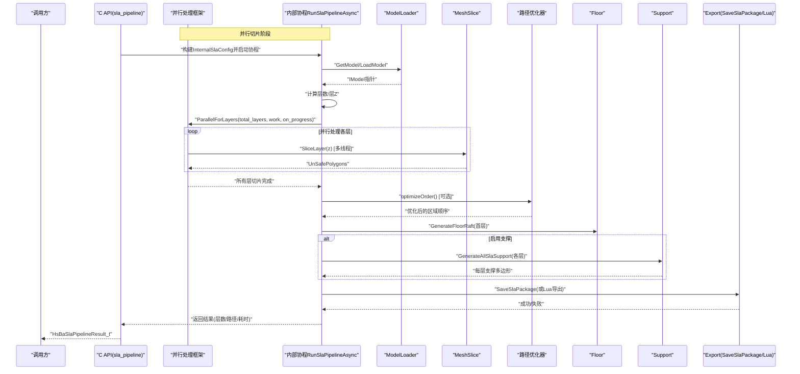
```mermaid
sequenceDiagram
participant Caller as "调用方"
participant DLL as "C API(sla_pipeline)"
participant Parallel as "并行处理框架"
participant Core as "内部协程RunSlaPipelineAsync"
participant Model as "ModelLoader"
participant Slice as "MeshSlice"
participant PathOpt as "路径优化器"
participant Floor as "Floor"
participant Supp as "Support"
participant Export as "Export(SaveSlaPackage/Lua)"
Note over Parallel,Core : 并行切片阶段
DLL->>Core : "构建InternalSlaConfig并启动协程"
Core->>Model : "GetModel/LoadModel"
Model-->>Core : "IModel指针"
Core->>Core : "计算层数/层Z"
Core->>Parallel : "ParallelForLayers(total_layers, work, on_progress)"
loop 并行处理各层
Parallel->>Slice : "SliceLayer(z) [多线程]"
Slice-->>Parallel : "UnSafePolygons"
end
Parallel-->>Core : "所有层切片完成"
Core->>PathOpt : "optimizeOrder() [可选]"
PathOpt-->>Core : "优化后的区域顺序"
Core->>Floor : "GenerateFloorRaft(首层)"
alt 启用支撑
Core->>Supp : "GenerateAllSlaSupport(各层)"
Supp-->>Core : "每层支撑多边形"
end
Core->>Export : "SaveSlaPackage(或Lua导出)"
Export-->>Core : "成功/失败"
Core-->>DLL : "返回结果(层数/路径/耗时)"
DLL-->>Caller : "HsBaSlaPipelineResult_t"
```

**图表来源**
- [DllHsBaSlicer/sla_pipeline.cpp:281-463](file://DllHsBaSlicer/sla_pipeline.cpp#L281-L463)
- [DllHsBaSlicer/pipeline_parallel.hpp:41-117](file://DllHsBaSlicer/pipeline_parallel.hpp#L41-L117)
- [LibHsBaSlicer/Path/path_optimizer.cpp:118-166](file://LibHsBaSlicer/Path/path_optimizer.cpp#L118-L166)

## 详细组件分析

### 并行处理框架
**新增** 提供了高效的层级别并行处理框架，专门针对切片和填充等热路径优化：

- **ParallelForLayers函数**：将层索引分配到线程池中并行执行，保证进度回调在主线程中串行调用
- **自适应线程数**：根据硬件并发数和环境变量HSBA_PIPELINE_THREADS动态调整线程数量
- **块状处理**：将层分组为块，减少进度回调频率，提高性能
- **异常安全**：工作函数中的异常会被重新抛出到调用者
- **向后兼容**：单核或单层时自动回退到串行模式

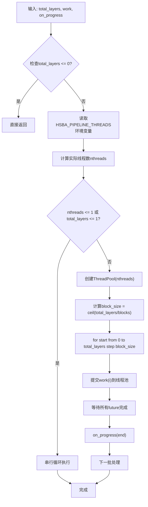
```mermaid
flowchart TD
A["输入: total_layers, work, on_progress"] --> B{"检查total_layers <= 0?"}
B --> |是| C["直接返回"]
B --> |否| D["读取HSBA_PIPELINE_THREADS环境变量"]
D --> E["计算实际线程数nthreads"]
E --> F{"nthreads <= 1 或 total_layers <= 1?"}
F --> |是| G["串行循环执行"]
F --> |否| H["创建ThreadPool(nthreads)"]
H --> I["计算block_size = ceil(total_layers/blocks)"]
I --> J["for start from 0 to total_layers step block_size"]
J --> K["提交work(i)到线程池"]
K --> L["等待所有future完成"]
L --> M["on_progress(end)"]
M --> N["下一批处理"]
G --> O["完成"]
N --> O
```

**图表来源**
- [DllHsBaSlicer/pipeline_parallel.hpp:41-117](file://DllHsBaSlicer/pipeline_parallel.hpp#L41-L117)

**章节来源**
- [DllHsBaSlicer/pipeline_parallel.hpp:1-122](file://DllHsBaSlicer/pipeline_parallel.hpp#L1-L122)

### 区域路径优化器
**新增** 实现了基于AreaGraph的区域路径优化系统，用于优化多个独立区域的访问顺序：

- **双模式支持**：支持填充结果模式（多段折线）和多边形模式（预填充优化）
- **遗传算法TSP**：使用遗传算法求解旅行商问题，找到最优的区域访问顺序
- **门控系统**：每个区域有多个门控点，支持进出方向控制
- **成本计算**：区域内门控点到门控点的直线距离作为内部成本，区域间门控点对的距离作为空移动成本
- **贪心排列**：在区域内使用最近邻贪心算法安排路径方向

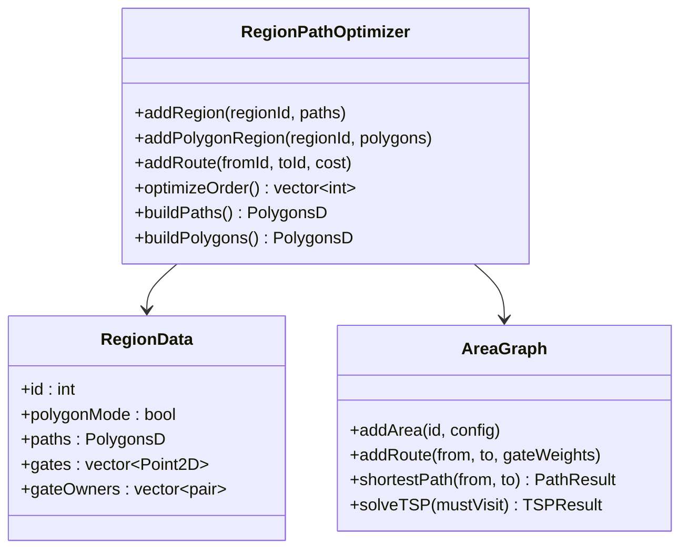
```mermaid
classDiagram
class RegionPathOptimizer {
+addRegion(regionId, paths)
+addPolygonRegion(regionId, polygons)
+addRoute(fromId, toId, cost)
+optimizeOrder() vector~int~
+buildPaths() PolygonsD
+buildPolygons() PolygonsD
}
class RegionData {
+id : int
+polygonMode : bool
+paths : PolygonsD
+gates : vector~Point2D~
+gateOwners : vector~pair~
}
class AreaGraph {
+addArea(id, config)
+addRoute(from, to, gateWeights)
+shortestPath(from, to) PathResult
+solveTSP(mustVisit) TSPResult
}
RegionPathOptimizer --> RegionData
RegionPathOptimizer --> AreaGraph
```

**图表来源**
- [LibHsBaSlicer/Path/path_optimizer.hpp:44-100](file://LibHsBaSlicer/Path/path_optimizer.hpp#L44-L100)
- [LibHsBaSlicer/Path/path_optimizer.cpp:43-55](file://LibHsBaSlicer/Path/path_optimizer.cpp#L43-L55)

**章节来源**
- [LibHsBaSlicer/Path/path_optimizer.hpp:1-191](file://LibHsBaSlicer/Path/path_optimizer.hpp#L1-L191)
- [LibHsBaSlicer/Path/path_optimizer.cpp:1-663](file://LibHsBaSlicer/Path/path_optimizer.cpp#L1-L663)

### AreaGraph图结构
**新增** 实现了支持门控的最短路径和TSP求解的AreaGraph模板类：

- **双层图结构**：区域级图和展开的门控顶点图
- **门控语义**：每个区域有进入/出口门控，支持方向性约束
- **最短路径**：支持区域间最短路径计算，考虑门控进出约束
- **遗传算法TSP**：使用遗传算法求解多区域访问顺序优化
- **缓存机制**：缓存成对最短路径，避免重复计算

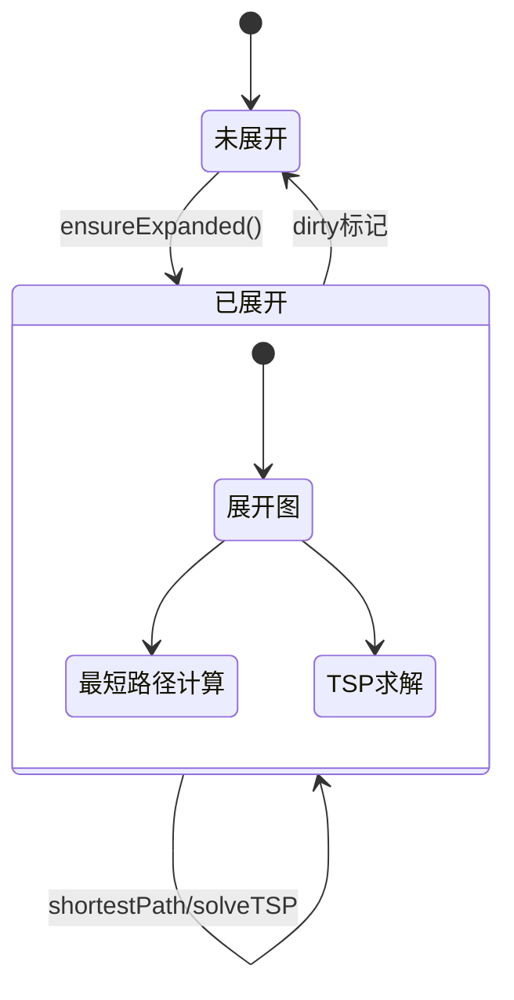
```mermaid
stateDiagram-v2
[*] --> 未展开
未展开 --> 已展开 : ensureExpanded()
已展开 --> 已展开 : addArea/addRoute
已展开 --> 已展开 : shortestPath/solveTSP
已展开 --> 未展开 : dirty标记
state 已展开 {
[*] --> 展开图
展开图 --> 最短路径计算
展开图 --> TSP求解
}
```

**图表来源**
- [utils/AreaGraph.hpp:95-108](file://utils/AreaGraph.hpp#L95-L108)
- [utils/AreaGraph.hpp:253-318](file://utils/AreaGraph.hpp#L253-L318)

**章节来源**
- [utils/AreaGraph.hpp:1-597](file://utils/AreaGraph.hpp#L1-L597)

### C API与流水线编排
- 配置结构体覆盖模型、切片、曝光、提升回退、底板、支撑、Lua扩展与输出格式等参数。
- 同步接口直接等待协程完成；异步接口通过then回调返回结果。
- 内部使用协程组织阶段化流程，并在每个阶段上报进度。
- **集成并行处理：在切片阶段使用ParallelForLayers进行并行执行。**

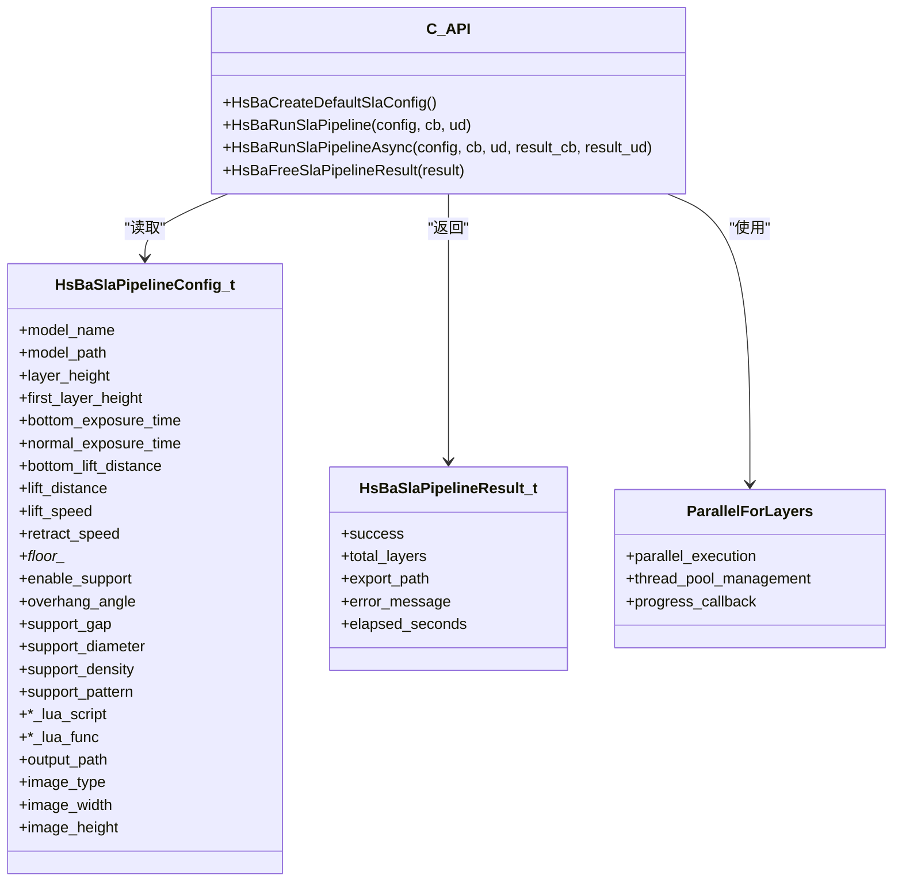
```mermaid
classDiagram
class HsBaSlaPipelineConfig_t {
+model_name
+model_path
+layer_height
+first_layer_height
+bottom_exposure_time
+normal_exposure_time
+bottom_lift_distance
+lift_distance
+lift_speed
+retract_speed
+floor_*
+enable_support
+overhang_angle
+support_gap
+support_diameter
+support_density
+support_pattern
+*_lua_script
+*_lua_func
+output_path
+image_type
+image_width
+image_height
}
class HsBaSlaPipelineResult_t {
+success
+total_layers
+export_path
+error_message
+elapsed_seconds
}
class C_API {
+HsBaCreateDefaultSlaConfig()
+HsBaRunSlaPipeline(config, cb, ud)
+HsBaRunSlaPipelineAsync(config, cb, ud, result_cb, result_ud)
+HsBaFreeSlaPipelineResult(result)
}
class ParallelForLayers {
+parallel_execution
+thread_pool_management
+progress_callback
}
C_API --> HsBaSlaPipelineConfig_t : "读取"
C_API --> HsBaSlaPipelineResult_t : "返回"
C_API --> ParallelForLayers : "使用"
```

**图表来源**
- [DllHsBaSlicer/sla_pipeline.h:17-56](file://DllHsBaSlicer/sla_pipeline.h#L17-L56)
- [DllHsBaSlicer/sla_pipeline.cpp:281-463](file://DllHsBaSlicer/sla_pipeline.cpp#L281-L463)

**章节来源**
- [DllHsBaSlicer/sla_pipeline.h:1-63](file://DllHsBaSlicer/sla_pipeline.h#L1-L63)
- [DllHsBaSlicer/sla_pipeline.cpp:1-508](file://DllHsBaSlicer/sla_pipeline.cpp#L1-L508)

### Protobuf转换系统
**新增** 提供完整的Protobuf序列化/反序列化支持，实现跨语言配置交换：

- **配置转换**：`HsBaSlaConfigFromProtoBytes` 和 `HsBaSlaConfigToProtoBytes` 用于SLA配置的Protobuf序列化
- **结果转换**：`HsBaSlaResultFromProtoBytes` 和 `HsBaSlaResultToProtoBytes` 用于SLA结果的Protobuf序列化  
- **内存管理**：`HsBaFreeSlaConfigStrings` 用于清理转换后分配的字符串内存
- **FDM支持**：同时提供FDM流水线的相同转换接口

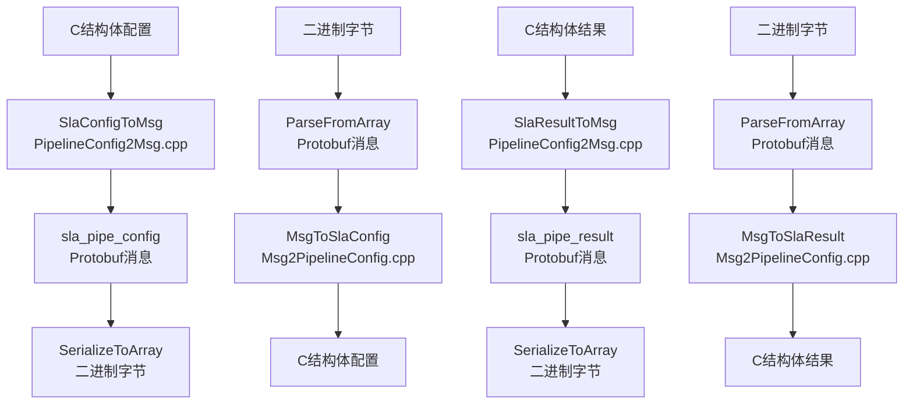
```mermaid
flowchart TD
A["C结构体配置"] --> B["SlaConfigToMsg<br/>PipelineConfig2Msg.cpp"]
B --> C["sla_pipe_config<br/>Protobuf消息"]
C --> D["SerializeToArray<br/>二进制字节"]
E["二进制字节"] --> F["ParseFromArray<br/>Protobuf消息"]
F --> G["MsgToSlaConfig<br/>Msg2PipelineConfig.cpp"]
G --> H["C结构体配置"]
I["C结构体结果"] --> J["SlaResultToMsg<br/>PipelineConfig2Msg.cpp"]
J --> K["sla_pipe_result<br/>Protobuf消息"]
K --> L["SerializeToArray<br/>二进制字节"]
M["二进制字节"] --> N["ParseFromArray<br/>Protobuf消息"]
N --> O["MsgToSlaResult<br/>Msg2PipelineConfig.cpp"]
O --> P["C结构体结果"]
```

**图表来源**
- [DllHsBaSlicer/pipeline_convert.cpp:103-179](file://DllHsBaSlicer/pipeline_convert.cpp#L103-L179)
- [convert/PipelineConfig2Msg.cpp:61-121](file://convert/PipelineConfig2Msg.cpp#L61-L121)
- [convert/Msg2PipelineConfig.cpp:75-126](file://convert/Msg2PipelineConfig.cpp#L75-L126)

**章节来源**
- [DllHsBaSlicer/pipeline_convert.h:61-117](file://DllHsBaSlicer/pipeline_convert.h#L61-L117)
- [DllHsBaSlicer/pipeline_convert.cpp:101-210](file://DllHsBaSlicer/pipeline_convert.cpp#L101-L210)
- [convert/PipelineConfig2Msg.hpp:20-24](file://convert/PipelineConfig2Msg.hpp#L20-L24)
- [convert/Msg2PipelineConfig.hpp:20-24](file://convert/Msg2PipelineConfig.hpp#L20-L24)

### Protobuf数据定义
**新增** 定义了跨语言通信的数据结构：

- **枚举类型**：`sla_support_pattern`（支撑模式）、`sla_image_type`（图像格式）
- **配置消息**：`sla_pipe_config` 包含所有SLA流水线配置参数
- **结果消息**：`sla_pipe_result` 包含流水线执行结果信息

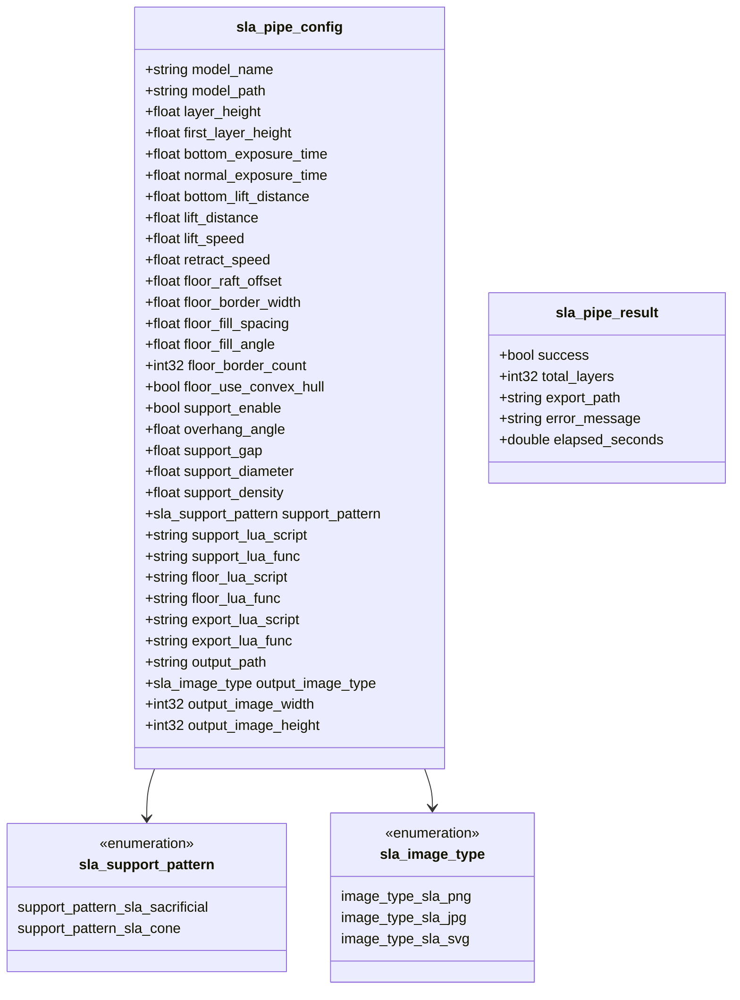
```mermaid
classDiagram
class sla_pipe_config {
+string model_name
+string model_path
+float layer_height
+float first_layer_height
+float bottom_exposure_time
+float normal_exposure_time
+float bottom_lift_distance
+float lift_distance
+float lift_speed
+float retract_speed
+float floor_raft_offset
+float floor_border_width
+float floor_fill_spacing
+float floor_fill_angle
+int32 floor_border_count
+bool floor_use_convex_hull
+bool support_enable
+float overhang_angle
+float support_gap
+float support_diameter
+float support_density
+sla_support_pattern support_pattern
+string support_lua_script
+string support_lua_func
+string floor_lua_script
+string floor_lua_func
+string export_lua_script
+string export_lua_func
+string output_path
+sla_image_type output_image_type
+int32 output_image_width
+int32 output_image_height
}
class sla_pipe_result {
+bool success
+int32 total_layers
+string export_path
+string error_message
+double elapsed_seconds
}
class sla_support_pattern {
<<enumeration>>
support_pattern_sla_sacrificial
support_pattern_sla_cone
}
class sla_image_type {
<<enumeration>>
image_type_sla_png
image_type_sla_jpg
image_type_sla_svg
}
sla_pipe_config --> sla_support_pattern
sla_pipe_config --> sla_image_type
```

**图表来源**
- [proto/sla_pipeline.proto:18-67](file://proto/sla_pipeline.proto#L18-L67)

**章节来源**
- [proto/sla_pipeline.proto:1-67](file://proto/sla_pipeline.proto#L1-L67)

### 模型管理与切片
- 模型加载：根据文件名后缀自动选择IGL（STL/OBJ/PLY/OFF）或OCCT（STEP/IGES/VRML/BREP），并通过命名对象池管理生命周期。
- 切片：提供安全与不安全两种切片接口；流水线采用不安全切片后做规范化，过滤非封闭轮廓并转为双精度多边形。
- **并行切片：使用ParallelForLayers将切片任务分配到多个线程并行执行。**

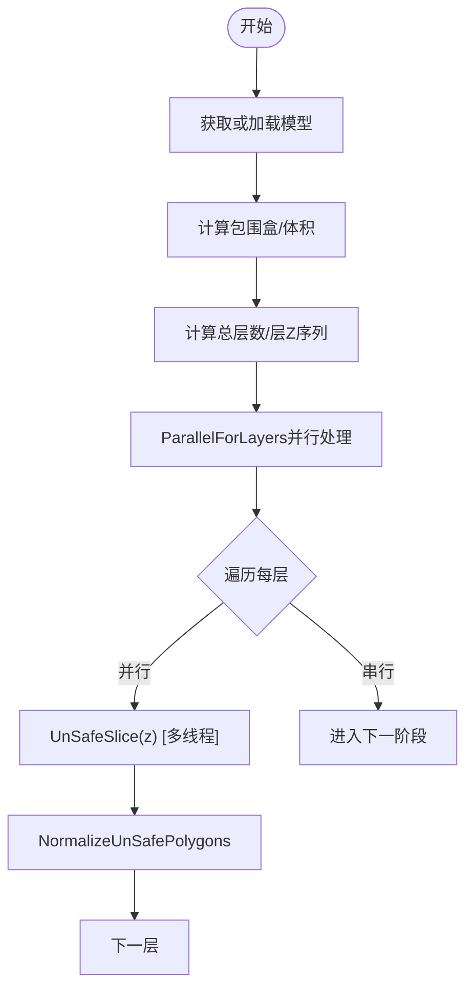
```mermaid
flowchart TD
Start(["开始"]) --> Load["获取或加载模型"]
Load --> BBox["计算包围盒/体积"]
BBox --> Layers["计算总层数/层Z序列"]
Layers --> Parallel["ParallelForLayers并行处理"]
Parallel --> ForEach{"遍历每层"}
ForEach --> |并行| Slice["UnSafeSlice(z) [多线程]"]
Slice --> Normalize["NormalizeUnSafePolygons"]
Normalize --> Next["下一层"]
ForEach --> |串行| Done["进入下一阶段"]
```

**图表来源**
- [preprocess/ModelLoader.hpp:37-76](file://preprocess/ModelLoader.hpp#L37-L76)
- [LibHsBaSlicer/Slice/mesh_slice.hpp:17-36](file://LibHsBaSlicer/Slice/mesh_slice.hpp#L17-L36)
- [DllHsBaSlicer/pipeline_parallel.hpp:41-117](file://DllHsBaSlicer/pipeline_parallel.hpp#L41-L117)

**章节来源**
- [preprocess/ModelLoader.hpp:1-131](file://preprocess/ModelLoader.hpp#L1-L131)
- [LibHsBaSlicer/Slice/mesh_slice.hpp:1-41](file://LibHsBaSlicer/Slice/mesh_slice.hpp#L1-L41)

### 底板/托板生成
- 接触面：可选凸包或凹包简化，或直接取首层轮廓。
- 外扩与边框：向外偏移生成托板外边界，向内偏移生成边框环。
- 填充：在边框内侧区域进行Zigzag填充。
- Lua扩展：支持从文件或字符串加载Lua脚本，传入底部轮廓与配置表，返回多边形集合。

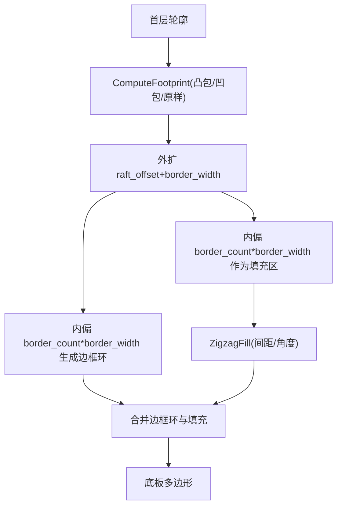
```mermaid
flowchart TD
A["首层轮廓"] --> Footprint["ComputeFootprint(凸包/凹包/原样)"]
Footprint --> Outer["外扩 raft_offset+border_width"]
Outer --> BorderLoops["内偏 border_count*border_width 生成边框环"]
Outer --> FillRegion["内偏 border_count*border_width 作为填充区"]
FillRegion --> Zigzag["ZigzagFill(间距/角度)"]
BorderLoops --> Merge["合并边框环与填充"]
Zigzag --> Merge
Merge --> Result["底板多边形"]
```

**图表来源**
- [LibHsBaSlicer/Floor/sla_floor.cpp:19-102](file://LibHsBaSlicer/Floor/sla_floor.cpp#L19-L102)
- [LibHsBaSlicer/Floor/sla_floor.hpp:41-102](file://LibHsBaSlicer/Floor/sla_floor.hpp#L41-L102)

**章节来源**
- [LibHsBaSlicer/Floor/sla_floor.hpp:1-183](file://LibHsBaSlicer/Floor/sla_floor.hpp#L1-L183)
- [LibHsBaSlicer/Floor/sla_floor.cpp:1-200](file://LibHsBaSlicer/Floor/sla_floor.cpp#L1-L200)

### 支撑生成（牺牲型）
- 悬垂检测：基于当前层与上一层的差集与角度阈值识别悬垂区域。
- 间隙控制：对悬垂区域进行负偏移以留出支撑间隙。
- 采样与合并：在悬垂区域内按支撑直径间距采样小圆点，最终合并为支撑截面。
- 接口抽象：ISupport定义单层层级生成与全层批量生成接口，SlaSacrificialSupport实现具体策略。

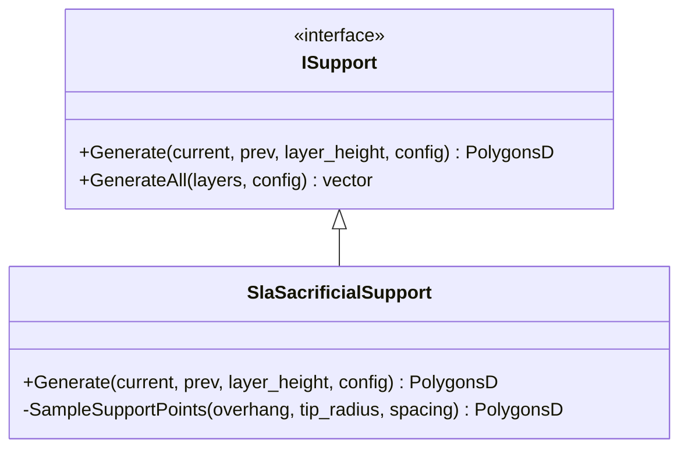
```mermaid
classDiagram
class ISupport {
<<interface>>
+Generate(current, prev, layer_height, config) PolygonsD
+GenerateAll(layers, config) vector<PolygonsD>
}
class SlaSacrificialSupport {
+Generate(current, prev, layer_height, config) PolygonsD
-SampleSupportPoints(overhang, tip_radius, spacing) PolygonsD
}
ISupport <|-- SlaSacrificialSupport
```

**图表来源**
- [support/ISupport.hpp:18-41](file://support/ISupport.hpp#L18-L41)
- [support/SlaSupport.hpp:16-38](file://support/SlaSupport.hpp#L16-L38)
- [support/SlaSupport.cpp:34-114](file://support/SlaSupport.cpp#L34-L114)

**章节来源**
- [support/ISupport.hpp:1-45](file://support/ISupport.hpp#L1-L45)
- [support/SlaSupport.hpp:1-42](file://support/SlaSupport.hpp#L1-L42)
- [support/SlaSupport.cpp:1-116](file://support/SlaSupport.cpp#L1-L116)

### 导出与打包
- 数据包：包含每层轮廓、每层支撑、底板多边形、配置JSON、图像尺寸与扩展名、是否包含底板/支撑图像等。
- 渲染与打包：将多边形渲染为PNG/JPG/SVG，写入ZIP归档，同时写入config.json。
- Lua导出：允许用户自定义导出逻辑，替换内置打包流程。

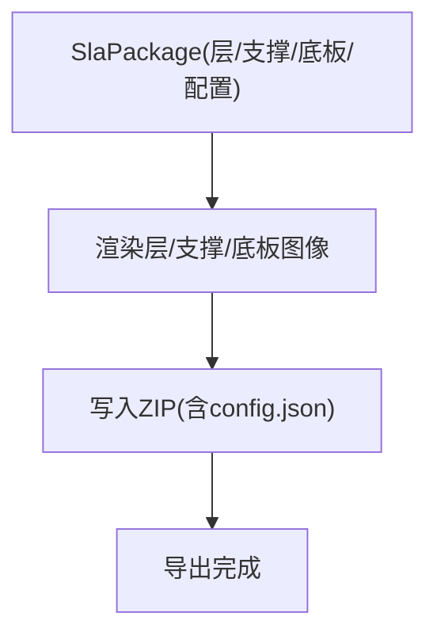
```mermaid
flowchart TD
Pkg["SlaPackage(层/支撑/底板/配置)"] --> Render["渲染层/支撑/底板图像"]
Render --> Zip["写入ZIP(含config.json)"]
Zip --> Done["导出完成"]
```

**图表来源**
- [LibHsBaSlicer/Floor/sla_floor.hpp:142-178](file://LibHsBaSlicer/Floor/sla_floor.hpp#L142-L178)

**章节来源**
- [LibHsBaSlicer/Floor/sla_floor.hpp:139-178](file://LibHsBaSlicer/Floor/sla_floor.hpp#L139-L178)

## 依赖关系分析
- 外部依赖：Clipper2用于多边形布尔运算与偏移；Eigen用于向量/矩阵；Lua用于脚本扩展；**Protobuf用于跨语言通信**；可选CGAL/OCCT用于高级CAD操作。
- 内部耦合：
  - C API依赖LibHsBaSlicer的预处理、切片、底板、支撑与导出模块。
  - **并行处理框架依赖线程池和协程系统。**
  - **路径优化器依赖AreaGraph图结构和遗传算法TSP。**
  - **AreaGraph依赖Boost Graph库和遗传算法。**
  - 底板与支撑均依赖2D多边形工具。
  - 切片依赖IModel抽象，由ModelLoader选择具体后端。

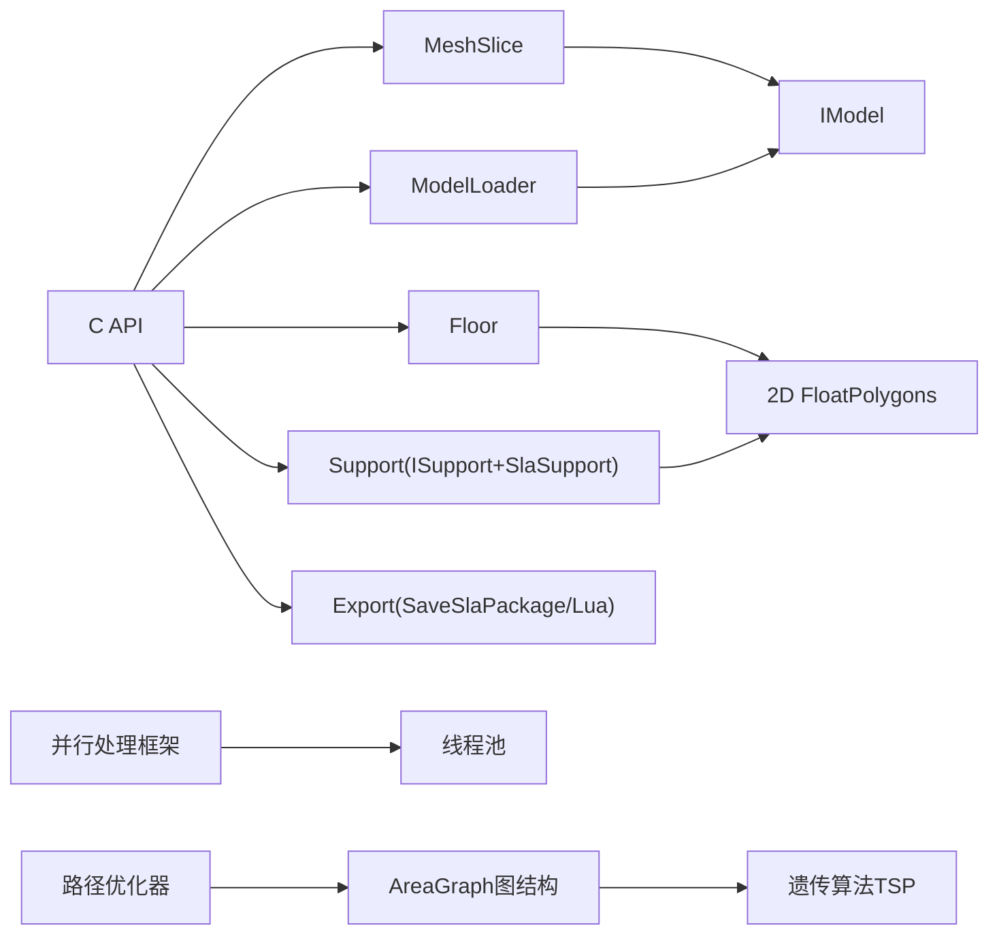
```mermaid
graph LR
CAPI["C API"] --> Pre["ModelLoader"]
CAPI --> Slice["MeshSlice"]
CAPI --> Floor["Floor"]
CAPI --> Supp["Support(ISupport+SlaSupport)"]
CAPI --> Export["Export(SaveSlaPackage/Lua)"]
Parallel["并行处理框架"] --> ThreadPool["线程池"]
PathOpt["路径优化器"] --> AreaGraph["AreaGraph图结构"]
AreaGraph --> GeneticTSP["遗传算法TSP"]
Floor --> Poly["2D FloatPolygons"]
Supp --> Poly
Slice --> IModel["IModel"]
Pre --> IModel
```

**图表来源**
- [DllHsBaSlicer/sla_pipeline.cpp:14-25](file://DllHsBaSlicer/sla_pipeline.cpp#L14-L25)
- [DllHsBaSlicer/pipeline_parallel.hpp:17-17](file://DllHsBaSlicer/pipeline_parallel.hpp#L17-L17)
- [LibHsBaSlicer/Path/path_optimizer.cpp:16-21](file://LibHsBaSlicer/Path/path_optimizer.cpp#L16-L21)
- [utils/AreaGraph.hpp:9-13](file://utils/AreaGraph.hpp#L9-L13)

**章节来源**
- [DllHsBaSlicer/sla_pipeline.cpp:1-25](file://DllHsBaSlicer/sla_pipeline.cpp#L1-L25)
- [DllHsBaSlicer/pipeline_parallel.hpp:1-17](file://DllHsBaSlicer/pipeline_parallel.hpp#L1-L17)
- [LibHsBaSlicer/Path/path_optimizer.cpp:1-21](file://LibHsBaSlicer/Path/path_optimizer.cpp#L1-L21)
- [utils/AreaGraph.hpp:1-13](file://utils/AreaGraph.hpp#L1-L13)

## 性能与可扩展性
- **并行驱动：流水线内部使用ParallelForLayers进行层级别并行处理，显著提升大规模模型处理速度。**
- 协程驱动：流水线内部使用协程组织阶段，便于插入并行与进度上报。
- 内存与对象池：模型通过命名对象池管理，减少重复加载开销。
- **路径优化：使用遗传算法TSP优化区域访问顺序，减少空移动距离。**
- **数值稳定性：切片后规范化去除非封闭轮廓，避免后续几何运算异常。**
- **自适应性能：根据硬件并发和环境变量自动调整并行度，支持性能对比测试。**
- 可扩展点：
  - 底板：Lua脚本自定义生成逻辑。
  - 支撑：ISupport抽象支持多种策略（牺牲型、锥型等）。
  - 导出：Lua自定义导出流程。
  - **路径优化：支持自定义区域访问策略和成本函数。**
  - **并行处理：可自定义并行策略和线程池配置。**

## 故障排查指南
- 模型加载失败：检查模型路径与后缀是否受支持；确认命名未冲突。
- 切片结果为空：验证模型高度与层数计算；关注层Z偏移与包围盒。
- 底板/支撑为空：检查悬垂角度阈值、支撑间隙与直径设置；确认首层轮廓有效。
- 导出失败：确认输出路径可写；检查图像尺寸与扩展名；若使用Lua导出，核对函数名与返回值结构。
- 进度回调无响应：确保回调指针与user_data正确传递；异步模式下注意线程上下文。
- **并行处理问题：检查HSBA_PIPELINE_THREADS环境变量设置；确认线程池初始化成功；验证工作函数的线程安全性。**
- **路径优化失败：检查区域ID唯一性；确认门控点配置正确；验证遗传算法参数设置。**
- **性能问题：监控线程利用率；检查是否有过多的细粒度任务；考虑调整并行块大小。**
- **内存泄漏：确保调用HsBaFreeSlaConfigStrings释放转换后的字符串内存；正确处理malloc分配的缓冲区。**

**章节来源**
- [DllHsBaSlicer/sla_pipeline.cpp:271-463](file://DllHsBaSlicer/sla_pipeline.cpp#L271-L463)
- [DllHsBaSlicer/pipeline_parallel.hpp:49-72](file://DllHsBaSlicer/pipeline_parallel.hpp#L49-L72)
- [LibHsBaSlicer/Path/path_optimizer.cpp:63-116](file://LibHsBaSlicer/Path/path_optimizer.cpp#L63-L116)
- [support/SlaSupport.cpp:70-114](file://support/SlaSupport.cpp#L70-L114)
- [LibHsBaSlicer/Floor/sla_floor.cpp:133-200](file://LibHsBaSlicer/Floor/sla_floor.cpp#L133-L200)

## 结论
该SLA流水线以模块化设计实现了从模型到可打印图像的端到端流程，具备跨平台、可扩展与高性能特性。**新增的并行处理框架和路径优化系统进一步提升了处理性能和输出质量，通过多线程加速切片过程，并使用遗传算法优化路径访问顺序，显著减少了空移动距离。**通过C ABI、Lua扩展、并行处理、路径优化与Protobuf支持的五重机制，既能满足生产环境集成需求，也便于研究与二次开发。

## 附录：API与配置速查
- 关键C API
  - 创建默认配置：HsBaCreateDefaultSlaConfig
  - 同步运行：HsBaRunSlaPipeline
  - 异步运行：HsBaRunSlaPipelineAsync
  - 释放结果：HsBaFreeSlaPipelineResult
  - **并行处理：ParallelForLayers（内部使用）**
  - **路径优化：RegionPathOptimizer类方法**
  - **Protobuf转换：HsBaSlaConfigFromProtoBytes/HsBaSlaConfigToProtoBytes**
  - **结果转换：HsBaSlaResultFromProtoBytes/HsBaSlaResultToProtoBytes**
  - **内存清理：HsBaFreeSlaConfigStrings**
- 主要配置项（节选）
  - 切片：layer_height、first_layer_height
  - 曝光/提升：bottom_exposure_time、normal_exposure_time、lift_distance、lift_speed、retract_speed
  - 底板：raft_offset、border_width、fill_spacing、fill_angle、border_count、use_convex_hull
  - 支撑：enable_support、overhang_angle、support_gap、support_diameter、support_density、support_pattern
  - 输出：output_path、image_type、image_width、image_height
  - **并行：HSBA_PIPELINE_THREADS环境变量**
- **路径优化API**
  - RegionPathOptimizer：区域路径优化器主类
  - addRegion/addPolygonRegion：添加区域
  - optimizeOrder：计算最优访问顺序
  - buildPaths/buildPolygons：构建优化后的路径或多边形
- **AreaGraph图结构API**
  - addArea：添加区域
  - addRoute：添加区域间连接
  - shortestPath：计算最短路径
  - solveTSP：求解TSP问题
- **Protobuf消息类型**
  - sla_pipe_config：SLA流水线配置消息
  - sla_pipe_result：SLA流水线结果消息
  - sla_support_pattern：支撑模式枚举
  - sla_image_type：图像格式枚举
- 示例程序
  - 基本用法、参数定制、Lua自定义、异步调用参见示例入口。

**章节来源**
- [DllHsBaSlicer/sla_pipeline.h:17-56](file://DllHsBaSlicer/sla_pipeline.h#L17-L56)
- [DllHsBaSlicer/pipeline_parallel.hpp:41-117](file://DllHsBaSlicer/pipeline_parallel.hpp#L41-L117)
- [LibHsBaSlicer/Path/path_optimizer.hpp:44-186](file://LibHsBaSlicer/Path/path_optimizer.hpp#L44-L186)
- [utils/AreaGraph.hpp:117-318](file://utils/AreaGraph.hpp#L117-L318)
- [DllHsBaSlicer/pipeline_convert.h:61-117](file://DllHsBaSlicer/pipeline_convert.h#L61-L117)
- [proto/sla_pipeline.proto:18-67](file://proto/sla_pipeline.proto#L18-L67)
- [samples/SLA/main.cpp:52-271](file://samples/SLA/main.cpp#L52-L271)