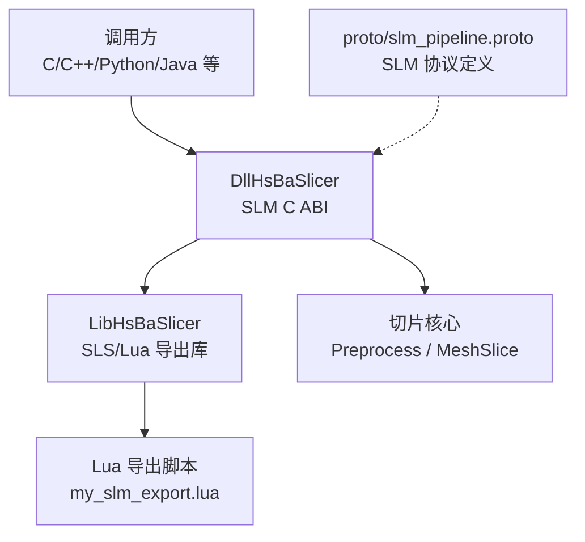
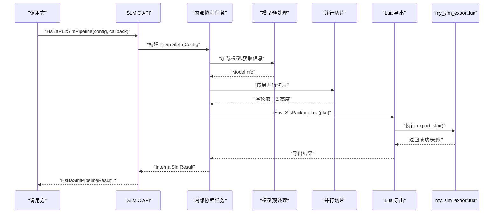
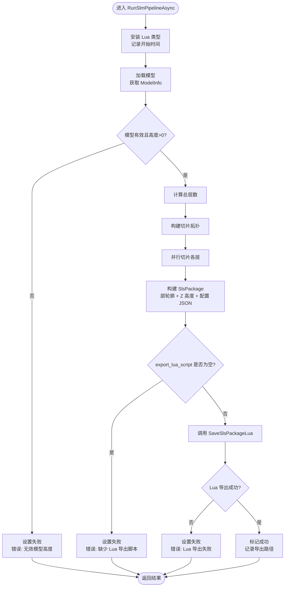
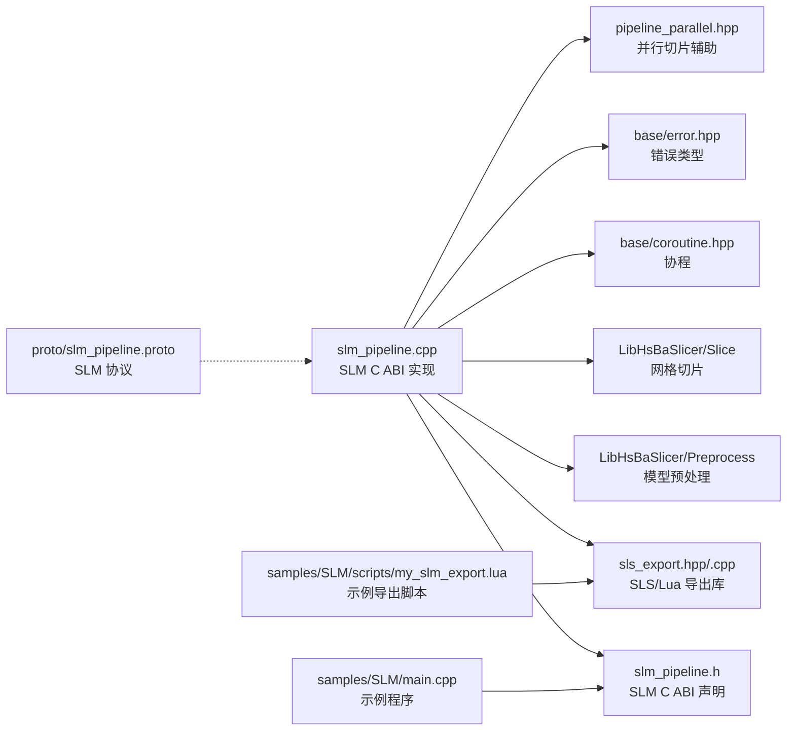

# SLM 选择性激光熔化流水线

<cite>
**本文引用的文件**   
- [README.md](file://README.md)
- [proto/slm_pipeline.proto](file://proto/slm_pipeline.proto)
- [DllHsBaSlicer/slm_pipeline.h](file://DllHsBaSlicer/slm_pipeline.h)
- [DllHsBaSlicer/slm_pipeline.cpp](file://DllHsBaSlicer/slm_pipeline.cpp)
- [samples/SLM/main.cpp](file://samples/SLM/main.cpp)
- [samples/SLM/scripts/my_slm_export.lua](file://samples/SLM/scripts/my_slm_export.lua)
- [LibHsBaSlicer/Path/sls_export.hpp](file://LibHsBaSlicer/Path/sls_export.hpp)
- [LibHsBaSlicer/Path/sls_export.cpp](file://LibHsBaSlicer/Path/sls_export.cpp)
- [ModuleHsBaSlicer/hsba_slicer.cppm](file://ModuleHsBaSlicer/hsba_slicer.cppm)
</cite>

## 目录
1. [引言](#引言)
2. [项目结构定位](#项目结构定位)
3. [核心组件](#核心组件)
4. [架构总览](#架构总览)
5. [详细组件分析](#详细组件分析)
6. [依赖关系分析](#依赖关系分析)
7. [性能与并发特性](#性能与并发特性)
8. [故障排查指南](#故障排查指南)
9. [结论](#结论)
10. [附录：API 与数据模型速查](#附录api-与数据模型速查)

## 引言
SLM（Selective Laser Melting，选择性激光熔化）是金属粉末床增材制造的一种工艺。在 HsBaSlicer 中，SLM 流水线复用 SLS 的“切片 + Lua 驱动导出”模式，但增加金属工艺参数（材料、光源、保护气），并把层轮廓与配置 JSON 交给 Lua 脚本生成最终产物（例如 zip 归档与数据库登记）。该设计把“几何切片”和“输出格式”解耦：C++ 负责稳定高效的切片与并行计算，Lua 负责灵活的可插拔输出。

从 README 可知，HsBaSlicer 是一个面向 3D 打印切片的高性能 C++ 框架，提供模块化、跨平台的切片核心能力；`DllHsBaSlicer` 导出 C ABI 流水线接口，`LibHsBaSlicer` 封装 C++ 全流程切片能力。SLM 正是通过这两层暴露给外部语言或上层应用。

**章节来源**
- [README.md:21-38](file://README.md#L21-L38)

## 项目结构定位
SLM 相关代码分布在以下位置：
- 协议定义：`proto/slm_pipeline.proto`
- C ABI 头文件：`DllHsBaSlicer/slm_pipeline.h`
- C ABI 实现：`DllHsBaSlicer/slm_pipeline.cpp`
- 示例程序：`samples/SLM/main.cpp`
- 示例导出脚本：`samples/SLM/scripts/my_slm_export.lua`
- SLS/Lua 导出通用库：`LibHsBaSlicer/Path/sls_export.hpp`、`sls_export.cpp`
- C++20 模块封装：`ModuleHsBaSlicer/hsba_slicer.cppm`

**图表来源**
- [DllHsBaSlicer/slm_pipeline.h:1-63](file://DllHsBaSlicer/slm_pipeline.h#L1-L63)
- [DllHsBaSlicer/slm_pipeline.cpp:1-387](file://DllHsBaSlicer/slm_pipeline.cpp#L1-L387)
- [LibHsBaSlicer/Path/sls_export.hpp:1-60](file://LibHsBaSlicer/Path/sls_export.hpp#L1-L60)
- [samples/SLM/scripts/my_slm_export.lua:1-63](file://samples/SLM/scripts/my_slm_export.lua#L1-L63)
- [proto/slm_pipeline.proto:1-65](file://proto/slm_pipeline.proto#L1-L65)

**章节来源**
- [README.md:104-124](file://README.md#L104-L124)
- [proto/slm_pipeline.proto:1-65](file://proto/slm_pipeline.proto#L1-L65)

## 核心组件
SLM 流水线的核心由四个层次组成：
1. **C ABI 层**：对外暴露 `HsBaCreateDefaultSlmConfig`、`HsBaRunSlmPipeline`、`HsBaRunSlmPipelineAsync`、`HsBaFreeSlmPipelineResult`。
2. **内部任务层**：将 C 配置转换为内部结构，构建协程任务，执行预处理、切片、导出。
3. **切片与导出层**：复用 SLS 的 `SlsPackage` 与 `SaveSlsPackageLua`，把层轮廓、Z 高度、配置 JSON 传给 Lua。
4. **Lua 导出层**：示例脚本把配置文件、每层多边形 JSON、说明文本打包为 zip，并可选写入 SQLite 历史表。

关键职责划分：
- C ABI 不直接处理几何，只负责参数转换、错误包装、内存所有权。
- 内部任务使用协程与并行切片，保证进度回调与异常安全。
- Lua 脚本完全控制最终输出格式，因此 SLM 没有固定标准输出。

**章节来源**
- [DllHsBaSlicer/slm_pipeline.h:17-56](file://DllHsBaSlicer/slm_pipeline.h#L17-L56)
- [DllHsBaSlicer/slm_pipeline.cpp:28-56](file://DllHsBaSlicer/slm_pipeline.cpp#L28-L56)
- [LibHsBaSlicer/Path/sls_export.hpp:17-56](file://LibHsBaSlicer/Path/sls_export.hpp#L17-L56)
- [samples/SLM/scripts/my_slm_export.lua:1-63](file://samples/SLM/scripts/my_slm_export.lua#L1-L63)

## 架构总览
SLM 流水线整体流程如下：

**图表来源**
- [DllHsBaSlicer/slm_pipeline.cpp:230-342](file://DllHsBaSlicer/slm_pipeline.cpp#L230-L342)
- [LibHsBaSlicer/Path/sls_export.hpp:35-56](file://LibHsBaSlicer/Path/sls_export.hpp#L35-L56)
- [samples/SLM/scripts/my_slm_export.lua:15-60](file://samples/SLM/scripts/my_slm_export.lua#L15-L60)

## 详细组件分析

### SLM C ABI 接口
`slm_pipeline.h` 定义了对外 C ABI：
- 默认配置构造：`HsBaCreateDefaultSlmConfig`
- 同步运行：`HsBaRunSlmPipeline`
- 异步运行：`HsBaRunSlmPipelineAsync`
- 结果释放：`HsBaFreeSlmPipelineResult`

这些函数都位于 `extern "C"` 段内，并通过 `HSBA_SLICER_API` 导出，供外部语言或上层应用调用。文档注释明确说明 SLM 流水线包含“预处理 -> 切片 -> Lua 导出”，并且金属参数会折叠进配置 JSON。

**章节来源**
- [DllHsBaSlicer/slm_pipeline.h:1-63](file://DllHsBaSlicer/slm_pipeline.h#L1-L63)

### 内部配置与结果结构
`slm_pipeline.cpp` 定义了两个内部结构：
- `InternalSlmResult`：保存是否成功、总层数、导出路径、错误消息、耗时。
- `InternalSlmConfig`：保存模型名称、模型路径、层高、首层层高、激光功率、扫描速度、 Hatch 间距、Hatch 旋转、基板温度、材料、光源、保护气、Lua 脚本路径、Lua 函数名、输出路径、进度回调及用户数据。

这些结构用于在 C ABI 与内部协程任务之间传递参数，避免直接把 C ABI 结构体贯穿到切片逻辑中。

**章节来源**
- [DllHsBaSlicer/slm_pipeline.cpp:28-56](file://DllHsBaSlicer/slm_pipeline.cpp#L28-L56)

### 切片与导出主流程
`RunSlmPipelineAsync` 是 SLM 流水线的核心协程函数，主要阶段包括：

1. **初始化**：安装通用 Lua AnyObject 类型，记录开始时间。
2. **预处理**：根据 `model_name` 获取或加载模型，获取 `ModelInfo`，计算总层数。
3. **切片**：构建切片拓扑，使用并行循环对每一层调用 `SliceLayer`，同时记录每层 Z 高度。
4. **导出**：校验 Lua 导出脚本必填，构建配置 JSON，填充 `SlsPackage`，调用 `SaveSlsPackageLua`。
5. **结果包装**：捕获 `RuntimeError`，计算耗时，返回内部结果。

**图表来源**
- [DllHsBaSlicer/slm_pipeline.cpp:230-342](file://DllHsBaSlicer/slm_pipeline.cpp#L230-L342)

**章节来源**
- [DllHsBaSlicer/slm_pipeline.cpp:230-342](file://DllHsBaSlicer/slm_pipeline.cpp#L230-L342)

### 配置 JSON 与金属参数
SLM 在导出前会构建一个 JSON 字符串，包含：
- 版本、工艺名 `SLM`
- 切片参数：层高、首层层高、总层数
- 激光参数：功率、扫描速度、Hatch 间距、Hatch 旋转
- 基板温度
- 金属材料：铁、铝、钛、未知
- 光源：激光、电子束、未知
- 保护气体：氩气、氦气、氮气、二氧化碳、未知

这些值来自 `InternalSlmConfig`，并通过枚举转字符串函数生成可读字段。JSON 随后放入 `SlsPackage.config_json`，由 Lua 脚本原样归档。

**章节来源**
- [DllHsBaSlicer/slm_pipeline.cpp:121-189](file://DllHsBaSlicer/slm_pipeline.cpp#L121-L189)
- [DllHsBaSlicer/slm_pipeline.cpp:308-313](file://DllHsBaSlicer/slm_pipeline.cpp#L308-L313)

### Lua 导出脚本约定
示例脚本 `my_slm_export.lua` 展示了 SLM 导出的典型行为：
- 使用全局 `config.path` 与 `config.configStr` 写入配置文件。
- 遍历全局 `images`，写入每层多边形 JSON。
- 写入 `README.txt`。
- 使用 `Zipper.Save` 写出 zip。
- 尝试连接 SQLite 并写入导出历史表。
- 返回 `{success=true, export_path=...}`。

脚本注释强调：返回值不能是字符串，否则会被 C++ 覆盖输出文件；必须返回 table 或 nil。

**章节来源**
- [samples/SLM/scripts/my_slm_export.lua:1-63](file://samples/SLM/scripts/my_slm_export.lua#L1-L63)

### SLS/Lua 导出库
`sls_export.hpp` 定义了 `SlsPackage` 与 `SaveSlsPackageLua`：
- `SlsPackage` 包含层轮廓、层 Z 高度、配置 JSON、螺旋模式标志。
- `SaveSlsPackageLua` 接收包数据、输出路径、Lua 脚本路径、Lua 函数名，并可选择返回错误详情。

SLM 直接使用这个通用导出库，而不是重新实现 Lua 导出逻辑。这是 SLM 复用 SLS 架构的关键点。

**章节来源**
- [LibHsBaSlicer/Path/sls_export.hpp:17-56](file://LibHsBaSlicer/Path/sls_export.hpp#L17-L56)

### C++20 模块中的 SLM 封装
`ModuleHsBaSlicer/hsba_slicer.cppm` 中包含 `SlmPipeline` 的实现片段：
- 构造函数接收 `HsBaSlmPipelineConfig_t`。
- `run(model)` 计算层数，逐层切片，填充 `SlsPackage`，然后调用 `SaveSlsPackageLua`。
- 默认 Lua 函数名为 `export_slm`。

这说明 SLM 不仅在 Dll 层有 C ABI，也在 Module 层提供 C++20 模块封装，便于 C++ 项目直接复用。

**章节来源**
- [ModuleHsBaSlicer/hsba_slicer.cppm:893-917](file://ModuleHsBaSlicer/hsba_slicer.cppm#L893-L917)

### 示例程序用法
`samples/SLM/main.cpp` 演示了三种用法：
1. 基本 SLM 流水线：设置模型、Lua 脚本、输出路径，同步运行。
2. 自定义金属参数：调整层高、激光功率、扫描速度、Hatch 参数、基板温度、材料、光源、保护气。
3. 异步流水线：注册完成回调，轮询等待完成标志。

示例还展示了如何创建默认配置、如何处理成功/失败结果、如何释放结果内存。

**章节来源**
- [samples/SLM/main.cpp:56-84](file://samples/SLM/main.cpp#L56-L84)
- [samples/SLM/main.cpp:89-132](file://samples/SLM/main.cpp#L89-L132)
- [samples/SLM/main.cpp:137-177](file://samples/SLM/main.cpp#L137-L177)

## 依赖关系分析
SLM 流水线的依赖关系可以概括为：

**图表来源**
- [DllHsBaSlicer/slm_pipeline.cpp:1-24](file://DllHsBaSlicer/slm_pipeline.cpp#L1-L24)
- [LibHsBaSlicer/Path/sls_export.hpp:1-60](file://LibHsBaSlicer/Path/sls_export.hpp#L1-L60)
- [proto/slm_pipeline.proto:1-65](file://proto/slm_pipeline.proto#L1-L65)
- [samples/SLM/main.cpp:1-25](file://samples/SLM/main.cpp#L1-L25)
- [samples/SLM/scripts/my_slm_export.lua:1-14](file://samples/SLM/scripts/my_slm_export.lua#L1-L14)

**章节来源**
- [DllHsBaSlicer/slm_pipeline.cpp:1-24](file://DllHsBaSlicer/slm_pipeline.cpp#L1-L24)
- [LibHsBaSlicer/Path/sls_export.hpp:1-60](file://LibHsBaSlicer/Path/sls_export.hpp#L1-L60)

## 性能与并发特性
SLM 流水线在切片阶段采用并行策略：
- 先构建一次切片拓扑。
- 使用 `ParallelForLayers` 对每层调用 `SliceLayer`。
- 每层切片相互独立，且只读取共享拓扑，因此适合并行。
- 进度回调在每层完成后更新，百分比范围从 15% 到 50%。

这种设计把 I/O 和 Lua 导出放在切片之后，避免在 I/O 阻塞时占用切片线程池。同时，协程使异步 API 能够非阻塞地调度任务，并通过 `then` 回调通知调用方。

需要注意：
- 如果模型高度无效，流水线会在早期失败，避免无意义计算。
- 如果未提供 Lua 导出脚本，流水线会直接失败，因为 SLM 的输出格式由 Lua 决定。
- 如果 Lua 导出失败，错误消息会包含 Lua 侧返回的错误详情。

**章节来源**
- [DllHsBaSlicer/slm_pipeline.cpp:266-288](file://DllHsBaSlicer/slm_pipeline.cpp#L266-L288)
- [DllHsBaSlicer/slm_pipeline.cpp:293-328](file://DllHsBaSlicer/slm_pipeline.cpp#L293-L328)

## 故障排查指南
常见失败场景与定位方式：

| 现象 | 可能原因 | 排查建议 |
|---|---|---|
| 流水线失败并提示“加载模型失败” | 模型名称不存在或模型路径不可读 | 检查 `model_name` 与 `model_path`，确认模型已注册或路径正确 |
| 流水线失败并提示“无效模型高度” | 模型高度 ≤ 0，无法计算层数 | 检查模型几何，确认 Z 方向有实际高度 |
| 流水线失败并提示“需要 Lua 导出脚本” | `export_lua_script` 为空 | 设置有效的 Lua 脚本路径 |
| 流水线失败并提示“Lua 导出失败” | Lua 脚本语法错误、Zipper/SQLite 调用失败、返回格式不正确 | 检查 `my_slm_export.lua`，确保返回 table 而非字符串 |
| 导出 zip 被覆盖或损坏 | Lua 脚本返回字符串 | 修改脚本返回 `{success=true, export_path=...}` |
| 数据库登记失败 | SQLite 连接或 SQL 执行失败 | 脚本中已有警告输出，可忽略或修复数据库权限 |

此外，结果结构中的 `error_message` 由库分配内存，调用方必须调用 `HsBaFreeSlmPipelineResult` 释放，否则会造成内存泄漏。

**章节来源**
- [DllHsBaSlicer/slm_pipeline.cpp:246-262](file://DllHsBaSlicer/slm_pipeline.cpp#L246-L262)
- [DllHsBaSlicer/slm_pipeline.cpp:293-328](file://DllHsBaSlicer/slm_pipeline.cpp#L293-L328)
- [samples/SLM/scripts/my_slm_export.lua:18-19](file://samples/SLM/scripts/my_slm_export.lua#L18-L19)
- [samples/SLM/scripts/my_slm_export.lua:52-54](file://samples/SLM/scripts/my_slm_export.lua#L52-L54)
- [DllHsBaSlicer/slm_pipeline.cpp:380-386](file://DllHsBaSlicer/slm_pipeline.cpp#L380-L386)

## 结论
SLM 选择性激光熔化流水线在 HsBaSlicer 中采用“C ABI + 内部协程 + SLS/Lua 导出”的分层设计：
- C ABI 提供稳定、跨语言的入口。
- 内部协程负责参数转换、进度回调、异常处理和计时。
- 切片阶段利用并行提升吞吐。
- Lua 导出脚本承担输出格式定制，使 SLM 不需要固定标准输出。
- 示例程序和协议定义提供了清晰的扩展点。

对于使用者而言，最关键的是正确设置模型、层高、激光参数、Lua 导出脚本，并在异步模式下正确处理结果回调与内存释放。对于扩展者而言，新增 SLM 变体通常只需替换 Lua 脚本或调整配置 JSON 字段，而不必改动切片核心。

[本节不直接分析具体文件，无需章节来源]

## 附录：API 与数据模型速查

### SLM C ABI 函数
| 函数 | 作用 | 备注 |
|---|---|---|
| `HsBaCreateDefaultSlmConfig` | 创建默认 SLM 配置 | 默认材料为钛，光源为激光，保护气为氩气 |
| `HsBaRunSlmPipeline` | 同步运行 SLM 流水线 | 支持进度回调 |
| `HsBaRunSlmPipelineAsync` | 异步运行 SLM 流水线 | 需要完成回调 |
| `HsBaFreeSlmPipelineResult` | 释放流水线结果内存 | 必须调用，防止内存泄漏 |

**章节来源**
- [DllHsBaSlicer/slm_pipeline.h:17-56](file://DllHsBaSlicer/slm_pipeline.h#L17-L56)

### SLM 协议字段
`proto/slm_pipeline.proto` 定义了 SLM 管道配置与结果的消息结构，包括：
- 材料枚举：铁、铝、钛、未知
- 光源枚举：激光、电子束、未知
- 保护气体枚举：氩气、氦气、氮气、二氧化碳、未知
- 配置字段：模型名称、模型路径、层高、首层层高、激光功率、扫描速度、Hatch 间距、Hatch 旋转、基板温度、材料、光源、保护气体、Lua 脚本、Lua 函数、输出路径
- 结果字段：成功标志、总层数、导出路径、错误消息、耗时

**章节来源**
- [proto/slm_pipeline.proto:9-64](file://proto/slm_pipeline.proto#L9-L64)

### SLS/Lua 导出数据结构
`SlsPackage` 是 SLM 复用的导出数据包：
- `layer_outlines`：每层多边形轮廓
- `layer_z_heights`：每层 Z 高度
- `config_json`：配置 JSON 内容
- `spiral_mode`：螺旋模式标志（SLM 默认不使用）

`SaveSlsPackageLua` 是 Lua 导出入口，Lua 脚本可通过全局变量访问配置、图像数据和输出路径。

**章节来源**
- [LibHsBaSlicer/Path/sls_export.hpp:17-56](file://LibHsBaSlicer/Path/sls_export.hpp#L17-L56)