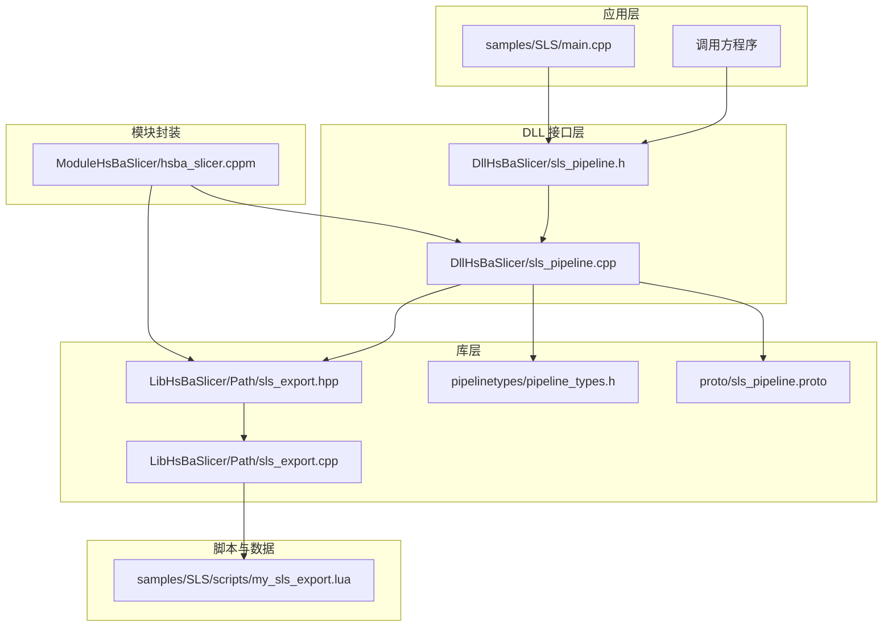
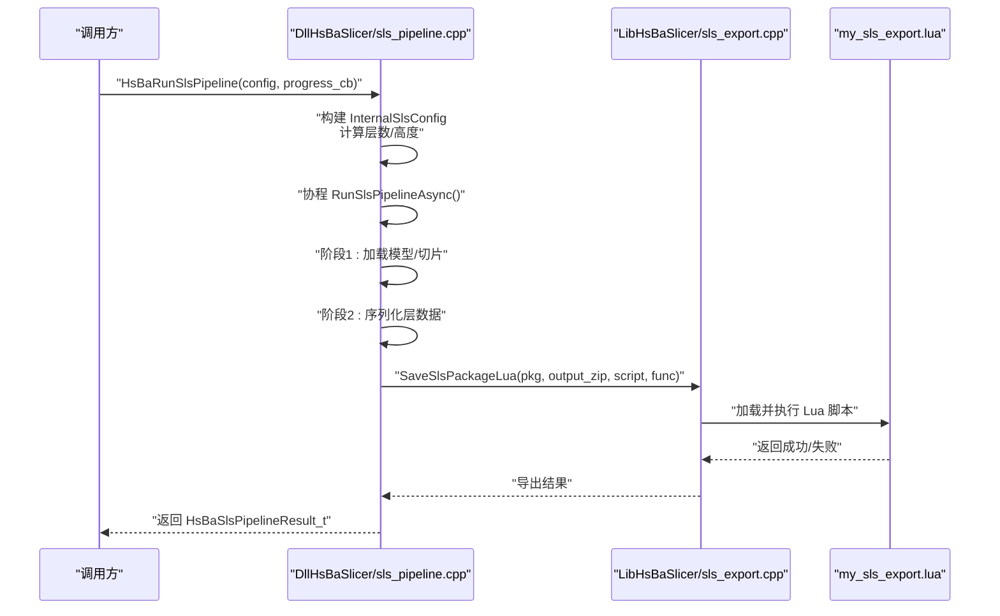
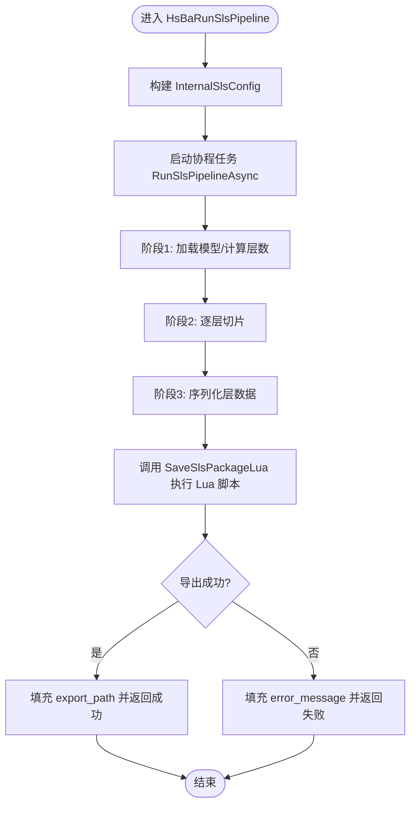
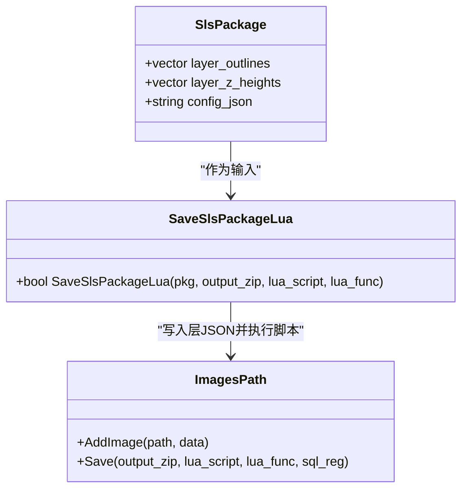
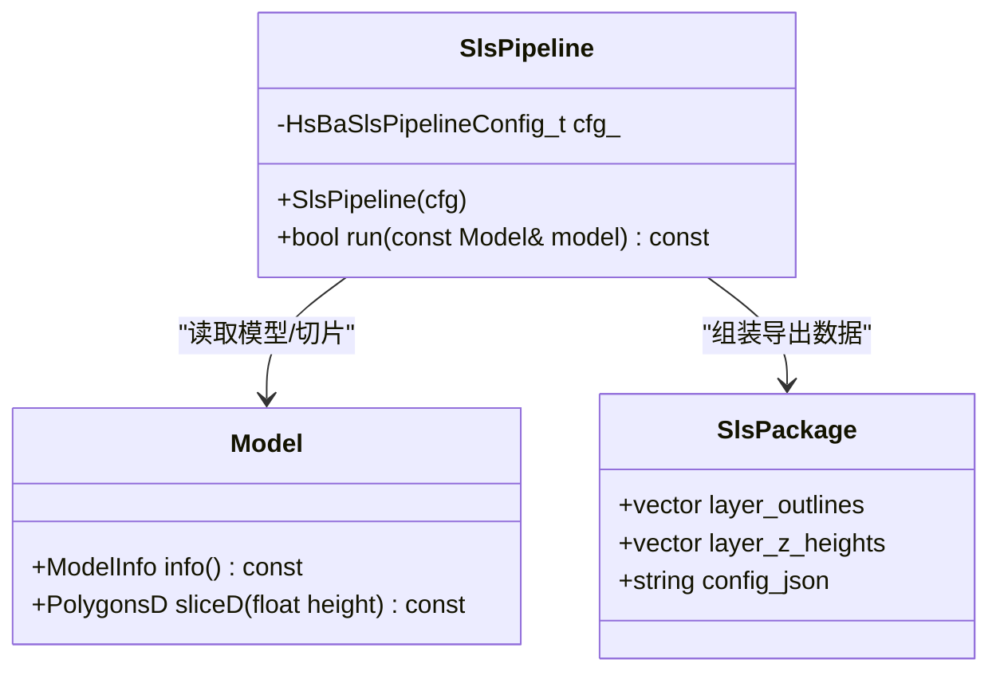
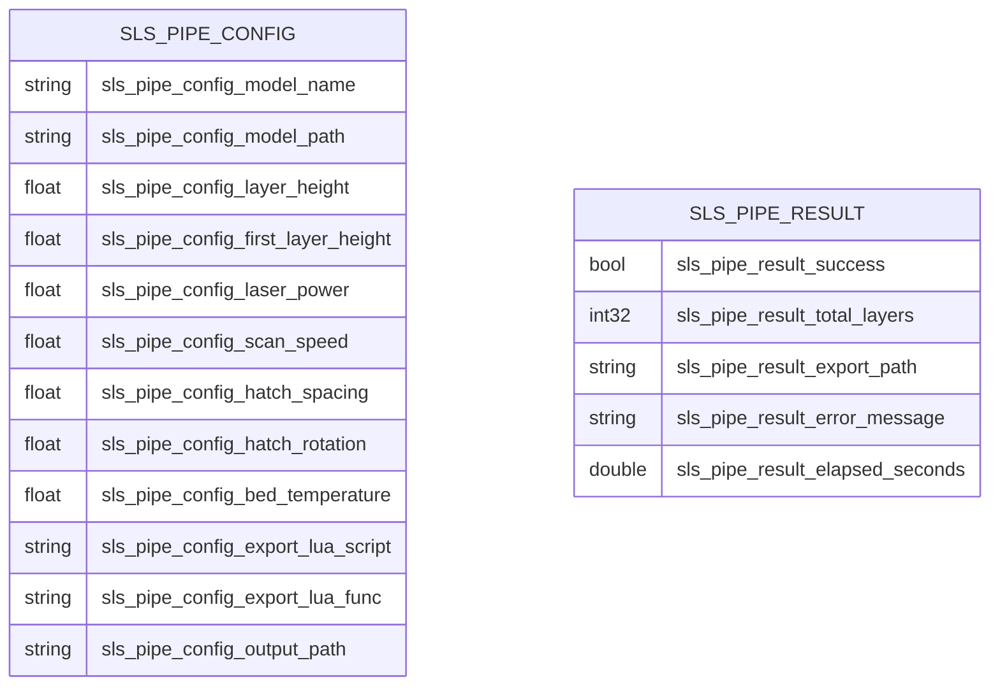
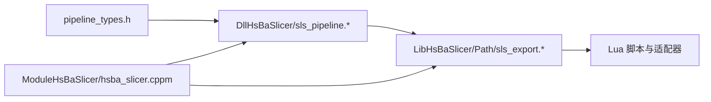

# SLS选择性激光烧结流水线

<cite>
**本文引用的文件列表**
- [hsba_slicer.cppm](file://ModuleHsBaSlicer/hsba_slicer.cppm)
- [sls_pipeline.h](file://DllHsBaSlicer/sls_pipeline.h)
- [sls_pipeline.cpp](file://DllHsBaSlicer/sls_pipeline.cpp)
- [sls_export.hpp](file://LibHsBaSlicer/Path/sls_export.hpp)
- [sls_export.cpp](file://LibHsBaSlicer/Path/sls_export.cpp)
- [pipeline_types.h](file://pipelinetypes/pipeline_types.h)
- [sls_pipeline.proto](file://proto/sls_pipeline.proto)
- [main.cpp](file://samples/SLS/main.cpp)
- [my_sls_export.lua](file://samples/SLS/scripts/my_sls_export.lua)
</cite>

## 目录
1. [简介](#简介)
2. [项目结构](#项目结构)
3. [核心组件](#核心组件)
4. [架构总览](#架构总览)
5. [详细组件分析](#详细组件分析)
6. [依赖关系分析](#依赖关系分析)
7. [性能与扩展性](#性能与扩展性)
8. [故障排查指南](#故障排查指南)
9. [结论](#结论)
10. [附录：API与配置速查](#附录api与配置速查)

## 简介
本文件围绕 HsBaSlicer 中的 SLS（Selective Laser Sintering，选择性激光烧结）流水线进行系统化文档化。SLS 采用粉末床工艺，无需底网/支撑结构，输出格式完全由 Lua 导出脚本驱动。仓库提供了 C/C++ API、C++20 模块封装、协程异步执行、Lua 自定义导出以及跨平台示例，形成从模型切片到数据打包的完整流程。

## 项目结构
与 SLS 流水线直接相关的代码分布在以下位置：
- DllHsBaSlicer：对外暴露的 C API（同步/异步），内部实现基于协程的任务编排
- LibHsBaSlicer：库层实现，包含 SLS 数据打包与 Lua 导出桥接
- ModuleHsBaSlicer：C++20 模块包装，提供类风格 API（含 SlsPipeline）
- proto：Protocol Buffers 定义，用于跨进程/语言传递配置与结果
- samples/SLS：使用示例与 Lua 导出脚本样例

图表来源
- [sls_pipeline.h:1-60](file://DllHsBaSlicer/sls_pipeline.h#L1-L60)
- [sls_pipeline.cpp:1-316](file://DllHsBaSlicer/sls_pipeline.cpp#L1-L316)
- [sls_export.hpp:1-52](file://LibHsBaSlicer/Path/sls_export.hpp#L1-L52)
- [sls_export.cpp:1-97](file://LibHsBaSlicer/Path/sls_export.cpp#L1-L97)
- [pipeline_types.h:224-393](file://pipelinetypes/pipeline_types.h#L224-L393)
- [sls_pipeline.proto:1-33](file://proto/sls_pipeline.proto#L1-L33)
- [hsba_slicer.cppm:221-237](file://ModuleHsBaSlicer/hsba_slicer.cppm#L221-L237)

章节来源
- [sls_pipeline.h:1-60](file://DllHsBaSlicer/sls_pipeline.h#L1-L60)
- [sls_pipeline.cpp:1-316](file://DllHsBaSlicer/sls_pipeline.cpp#L1-L316)
- [sls_export.hpp:1-52](file://LibHsBaSlicer/Path/sls_export.hpp#L1-L52)
- [sls_export.cpp:1-97](file://LibHsBaSlicer/Path/sls_export.cpp#L1-L97)
- [pipeline_types.h:224-393](file://pipelinetypes/pipeline_types.h#L224-L393)
- [sls_pipeline.proto:1-33](file://proto/sls_pipeline.proto#L1-L33)
- [hsba_slicer.cppm:221-237](file://ModuleHsBaSlicer/hsba_slicer.cppm#L221-L237)

## 核心组件
- C API（同步/异步）：提供创建默认配置、运行流水线、释放结果的函数族，支持进度回调与完成回调
- 协程任务编排：内部以协程组织预处理、切片、导出阶段，并上报进度与耗时
- SLS 数据包与 Lua 导出：将每层轮廓多边形序列化为 JSON，连同配置 JSON 一起交由 Lua 脚本生成最终产物（如 zip + 数据库注册）
- C++20 模块封装：在 hsba.slicer 模块中导出 SlsPipeline 类，简化上层使用

章节来源
- [sls_pipeline.h:1-60](file://DllHsBaSlicer/sls_pipeline.h#L1-L60)
- [sls_pipeline.cpp:169-316](file://DllHsBaSlicer/sls_pipeline.cpp#L169-L316)
- [sls_export.hpp:1-52](file://LibHsBaSlicer/Path/sls_export.hpp#L1-L52)
- [sls_export.cpp:50-97](file://LibHsBaSlicer/Path/sls_export.cpp#L50-L97)
- [hsba_slicer.cppm:221-237](file://ModuleHsBaSlicer/hsba_slicer.cppm#L221-L237)

## 架构总览
SLS 流水线整体分为三个阶段：
- 预处理与切片：加载模型、计算层数、逐层切片得到多边形轮廓
- 数据序列化：将每层轮廓转为 JSON，组装为 SlsPackage
- Lua 导出：通过 SaveSlsPackageLua 执行用户脚本，完成归档与可选数据库注册

图表来源
- [sls_pipeline.cpp:169-316](file://DllHsBaSlicer/sls_pipeline.cpp#L169-L316)
- [sls_export.cpp:50-97](file://LibHsBaSlicer/Path/sls_export.cpp#L50-L97)
- [my_sls_export.lua:1-80](file://samples/SLS/scripts/my_sls_export.lua#L1-L80)

## 详细组件分析

### C API 与协程任务编排（DllHsBaSlicer）
- 对外接口
  - 创建默认配置：HsBaCreateDefaultSlsConfig
  - 同步运行：HsBaRunSlsPipeline
  - 异步运行：HsBaRunSlsPipelineAsync
  - 释放结果：HsBaFreeSlsPipelineResult
- 内部实现要点
  - 将外部配置转换为内部结构 InternalSlsConfig
  - 使用协程 Task 组织流水线，分阶段报告进度
  - 切片阶段对每层 z 坐标进行归一化处理，并调用底层切片接口
  - 导出阶段构造 SlsPackage 并调用 SaveSlsPackageLua
  - 异常捕获与错误信息回传，统计耗时

图表来源
- [sls_pipeline.cpp:135-316](file://DllHsBaSlicer/sls_pipeline.cpp#L135-L316)

章节来源
- [sls_pipeline.h:1-60](file://DllHsBaSlicer/sls_pipeline.h#L1-L60)
- [sls_pipeline.cpp:1-316](file://DllHsBaSlicer/sls_pipeline.cpp#L1-L316)

### SLS 数据包与 Lua 导出（LibHsBaSlicer）
- SlsPackage 数据结构
  - layer_outlines：每层的多边形轮廓（双精度）
  - layer_z_heights：每层的 Z 高度（mm）
  - config_json：配置 JSON 内容
- SaveSlsPackageLua 实现
  - 将每层多边形序列化为 JSON，并以 layers/N.json 形式加入 ImagesPath
  - 注册 SQLite/MySQL/PostgreSQL Lua 适配器（按编译选项）
  - 调用 ImagesPath.Save 执行 Lua 脚本，完成归档与数据库操作

图表来源
- [sls_export.hpp:1-52](file://LibHsBaSlicer/Path/sls_export.hpp#L1-L52)
- [sls_export.cpp:1-97](file://LibHsBaSlicer/Path/sls_export.cpp#L1-L97)

章节来源
- [sls_export.hpp:1-52](file://LibHsBaSlicer/Path/sls_export.hpp#L1-L52)
- [sls_export.cpp:1-97](file://LibHsBaSlicer/Path/sls_export.cpp#L1-L97)

### C++20 模块封装（ModuleHsBaSlicer）
- 模块接口导出 SlsPipeline 类，封装 SLS 流水线
- run(model) 内部步骤：
  - 读取模型尺寸，计算层数
  - 逐层切片并转为双精度多边形
  - 构造 SlsPackage 并调用 SaveSlsPackageLua 执行 Lua 导出脚本
- 若未设置 export_lua_script，抛出 SlicerError

图表来源
- [hsba_slicer.cppm:221-237](file://ModuleHsBaSlicer/hsba_slicer.cppm#L221-L237)
- [hsba_slicer.cppm:576-601](file://ModuleHsBaSlicer/hsba_slicer.cppm#L576-L601)

章节来源
- [hsba_slicer.cppm:221-237](file://ModuleHsBaSlicer/hsba_slicer.cppm#L221-L237)
- [hsba_slicer.cppm:576-601](file://ModuleHsBaSlicer/hsba_slicer.cppm#L576-L601)

### 配置与协议（Types & Proto）
- pipeline_types.h 定义了 HsBaSlsPipelineConfig_t 与 HsBaSlsPipelineResult_t，并提供默认初始化函数
- sls_pipeline.proto 定义了跨进程/语言的配置与结果消息体，字段与 C 结构一致

图表来源
- [sls_pipeline.proto:1-33](file://proto/sls_pipeline.proto#L1-L33)
- [pipeline_types.h:224-393](file://pipelinetypes/pipeline_types.h#L224-L393)

章节来源
- [pipeline_types.h:224-393](file://pipelinetypes/pipeline_types.h#L224-L393)
- [sls_pipeline.proto:1-33](file://proto/sls_pipeline.proto#L1-L33)

### 使用示例与 Lua 导出脚本
- samples/SLS/main.cpp 展示了三种用法：
  - 基本用法：最小配置运行
  - 自定义参数：调整层高、激光功率、扫描速度、栅格间距、旋转角度、粉床温度等
  - 异步运行：非阻塞执行并通过回调获取结果
- my_sls_export.lua 演示了：
  - 将配置 JSON 与每层多边形 JSON 写入 zip
  - 可选地注册 SQLite 数据库记录

章节来源
- [main.cpp:1-219](file://samples/SLS/main.cpp#L1-L219)
- [my_sls_export.lua:1-80](file://samples/SLS/scripts/my_sls_export.lua#L1-L80)

## 依赖关系分析
- 模块间耦合
  - DllHsBaSlicer 依赖 LibHsBaSlicer 的导出接口与类型定义
  - ModuleHsBaSlicer 通过 import 复用 LibHsBaSlicer 能力，并以类风格封装
- 外部依赖
  - Lua 运行时与已注册的 Zipper/Cipher/SQL 适配器
  - Clipper2/Eigen 等几何与数学库（在模块接口中引入）
- 潜在循环依赖
  - 当前设计通过明确分层避免循环；Lua 脚本仅消费数据，不反向依赖 C++ 层

图表来源
- [pipeline_types.h:224-393](file://pipelinetypes/pipeline_types.h#L224-L393)
- [sls_pipeline.cpp:1-316](file://DllHsBaSlicer/sls_pipeline.cpp#L1-L316)
- [sls_export.cpp:1-97](file://LibHsBaSlicer/Path/sls_export.cpp#L1-L97)
- [hsba_slicer.cppm:221-237](file://ModuleHsBaSlicer/hsba_slicer.cppm#L221-L237)

章节来源
- [pipeline_types.h:224-393](file://pipelinetypes/pipeline_types.h#L224-L393)
- [sls_pipeline.cpp:1-316](file://DllHsBaSlicer/sls_pipeline.cpp#L1-L316)
- [sls_export.cpp:1-97](file://LibHsBaSlicer/Path/sls_export.cpp#L1-L97)
- [hsba_slicer.cppm:221-237](file://ModuleHsBaSlicer/hsba_slicer.cppm#L221-L237)

## 性能与扩展性
- 协程异步：内部以协程组织流水线，便于集成进度回调与超时控制
- 内存管理：DLL 层使用 OwnedCString 管理字符串生命周期，避免跨边界泄漏
- 可扩展点
  - Lua 导出脚本可自由扩展归档结构与数据库注册逻辑
  - SQL 适配器可按需启用 MySQL/PostgreSQL（编译期宏控制）
- 优化建议
  - 大模型切片时可采用并行策略（当前串行切片，可在未来扩展）
  - 对层 JSON 序列化进行缓冲与批量写入，减少 I/O 次数

[本节为通用指导，不涉及具体文件分析]

## 故障排查指南
- 常见错误
  - 未提供 export_lua_script：SLS 流水线要求必须指定导出脚本路径
  - Lua 脚本执行失败：检查脚本路径、函数名、Zipper/SQL 适配器可用性
  - 模型无效或高度为零：检查模型路径与模型有效性
- 定位方法
  - 关注 HsBaSlsPipelineResult_t 的 success 与 error_message 字段
  - 利用进度回调观察各阶段是否到达
  - 检查输出路径是否存在及权限是否正确

章节来源
- [sls_pipeline.cpp:222-270](file://DllHsBaSlicer/sls_pipeline.cpp#L222-L270)
- [sls_export.cpp:50-97](file://LibHsBaSlicer/Path/sls_export.cpp#L50-L97)
- [hsba_slicer.cppm:576-601](file://ModuleHsBaSlicer/hsba_slicer.cppm#L576-L601)

## 结论
SLS 流水线以“切片 + Lua 导出”为核心，具备高灵活性与跨平台能力。通过 C API、C++20 模块封装与协程异步，既满足工程易用性，又保留强大的扩展空间。建议在项目中优先使用 C++20 模块封装以获得更现代的 API 体验，同时结合 Lua 脚本定制输出格式与数据库注册流程。

[本节为总结，不涉及具体文件分析]

## 附录：API与配置速查
- C API
  - HsBaCreateDefaultSlsConfig：创建默认配置
  - HsBaRunSlsPipeline：同步运行
  - HsBaRunSlsPipelineAsync：异步运行
  - HsBaFreeSlsPipelineResult：释放结果内存
- 关键配置字段（节选）
  - 模型：model_name、model_path
  - 切片：layer_height、first_layer_height
  - 激光：laser_power、scan_speed、hatch_spacing、hatch_rotation、bed_temperature
  - 导出：export_lua_script、export_lua_func
  - 输出：output_path
- 结果字段（节选）
  - success、total_layers、export_path、error_message、elapsed_seconds

章节来源
- [sls_pipeline.h:1-60](file://DllHsBaSlicer/sls_pipeline.h#L1-L60)
- [pipeline_types.h:224-393](file://pipelinetypes/pipeline_types.h#L224-L393)
- [sls_pipeline.proto:1-33](file://proto/sls_pipeline.proto#L1-L33)