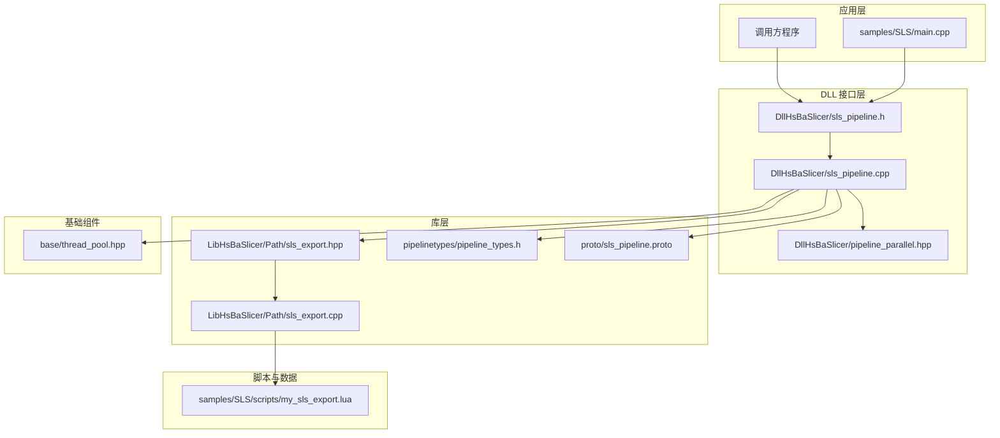
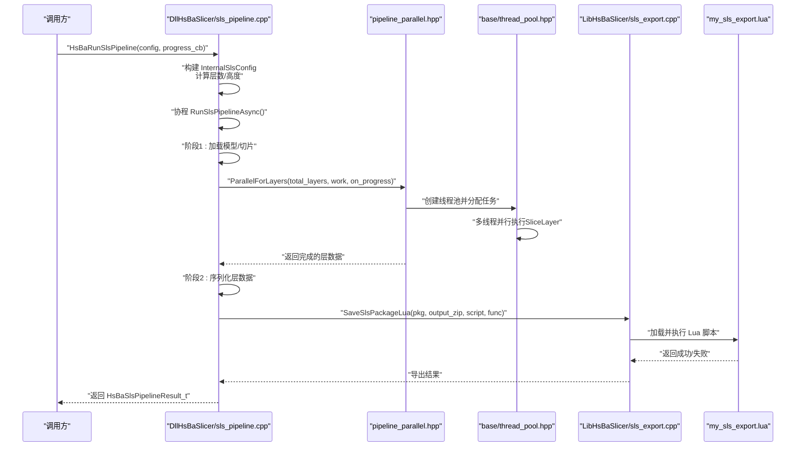
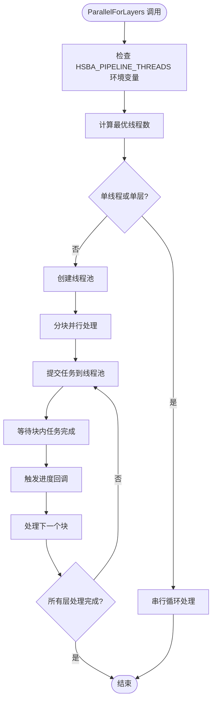
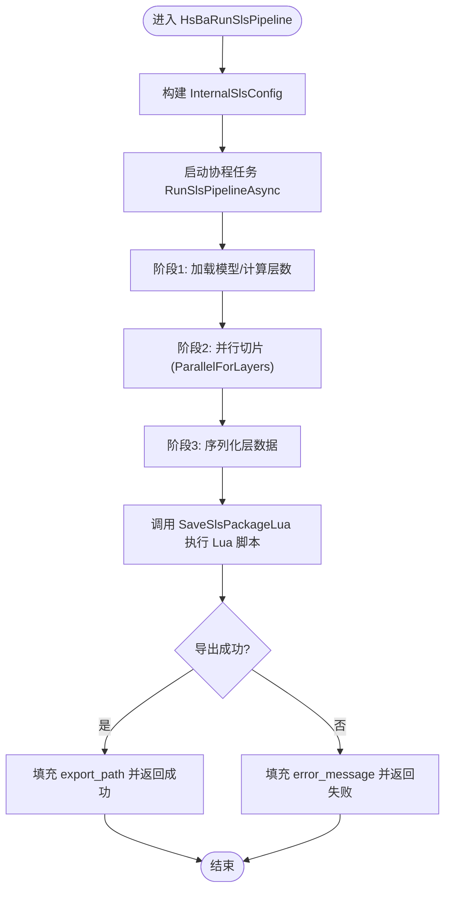
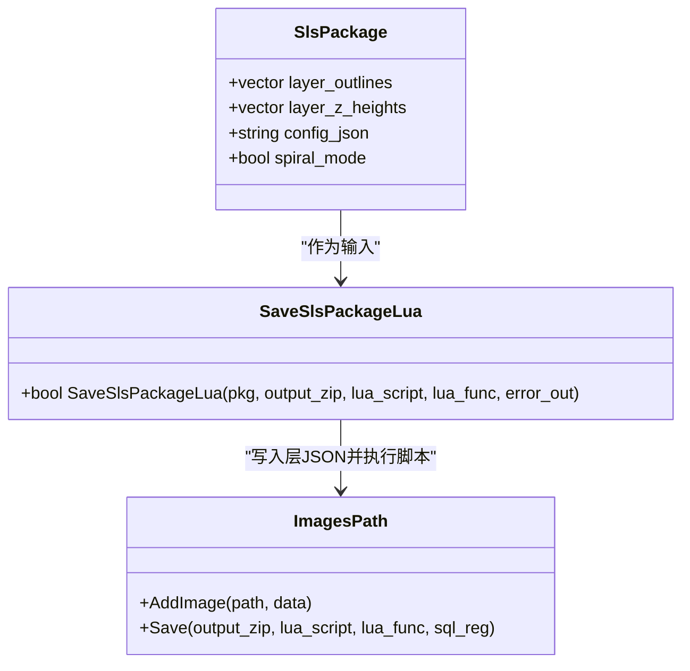
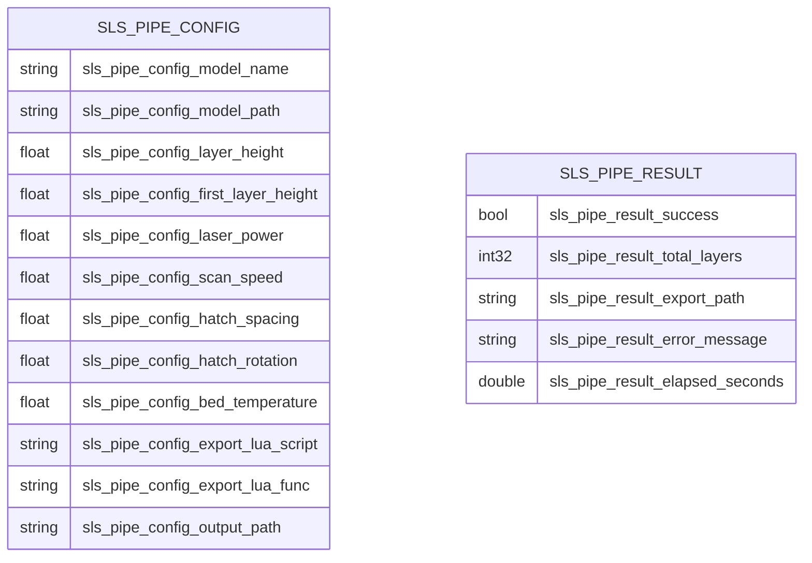
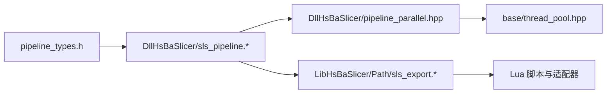

# SLS选择性激光烧结流水线

<cite>
**本文引用的文件列表**
- [sls_pipeline.h](file://DllHsBaSlicer/sls_pipeline.h)
- [sls_pipeline.cpp](file://DllHsBaSlicer/sls_pipeline.cpp)
- [pipeline_parallel.hpp](file://DllHsBaSlicer/pipeline_parallel.hpp)
- [thread_pool.hpp](file://base/thread_pool.hpp)
- [sls_export.hpp](file://LibHsBaSlicer/Path/sls_export.hpp)
- [sls_export.cpp](file://LibHsBaSlicer/Path/sls_export.cpp)
- [pipeline_types.h](file://pipelinetypes/pipeline_types.h)
- [sls_pipeline.proto](file://proto/sls_pipeline.proto)
- [main.cpp](file://samples/SLS/main.cpp)
- [my_sls_export.lua](file://samples/SLS/scripts/my_sls_export.lua)
</cite>

## 更新摘要
**变更内容**
- **新增高性能并行切片引擎**：通过`ParallelForLayers`函数实现多线程并行处理独立层切片
- **增强错误处理机制**：改进异常捕获和错误信息传递，提供更详细的错误诊断
- **优化性能监控**：添加精确的耗时统计和进度回调系统
- **支持环境变量控制**：通过`HSBA_PIPELINE_THREADS`环境变量灵活控制并行度
- **改进内存管理**：使用`OwnedCString`智能管理跨边界字符串生命周期

## 目录
1. [简介](#简介)
2. [项目结构](#项目结构)
3. [核心组件](#核心组件)
4. [架构总览](#架构总览)
5. [详细组件分析](#详细组件分析)
6. [依赖关系分析](#依赖关系分析)
7. [性能与扩展性](#性能与扩展性)
8. [故障排查指南](#故障排查指南)
9. [结论](#结论)
10. [附录：API与配置速查](#附录api与配置速查)

## 简介
本文件围绕 HsBaSlicer 中的 SLS（Selective Laser Sintering，选择性激光烧结）流水线进行系统化文档化。SLS 采用粉末床工艺，无需底网/支撑结构，输出格式完全由 Lua 导出脚本驱动。**最新增强**：集成了高性能的并行切片处理能力，通过多线程并行处理独立层切片，显著提升大模型的处理速度。同时增强了错误处理和性能监控能力，提供完整的从模型切片到数据打包的现代化流水线解决方案。

## 项目结构
与 SLS 流水线直接相关的代码分布在以下位置：
- DllHsBaSlicer：对外暴露的 C API（同步/异步），内部实现基于协程的任务编排和并行处理
- LibHsBaSlicer：库层实现，包含 SLS 数据打包与 Lua 导出桥接
- base：基础组件，包括线程池等并发工具
- proto：Protocol Buffers 定义，用于跨进程/语言传递配置与结果
- samples/SLS：使用示例与 Lua 导出脚本样例

```mermaid
graph TB
subgraph "应用层"
APP["调用方程序"]
SAMPLE["samples/SLS/main.cpp"]
end
subgraph "DLL 接口层"
DLL_H["DllHsBaSlicer/sls_pipeline.h"]
DLL_CPP["DllHsBaSlicer/sls_pipeline.cpp"]
PARALLEL["DllHsBaSlicer/pipeline_parallel.hpp"]
end
subgraph "库层"
LIB_HPP["LibHsBaSlicer/Path/sls_export.hpp"]
LIB_CPP["LibHsBaSlicer/Path/sls_export.cpp"]
TYPES["pipelinetypes/pipeline_types.h"]
PROTO["proto/sls_pipeline.proto"]
end
subgraph "基础组件"
THREAD_POOL["base/thread_pool.hpp"]
end
subgraph "脚本与数据"
LUA["samples/SLS/scripts/my_sls_export.lua"]
end
APP --> DLL_H
SAMPLE --> DLL_H
DLL_H --> DLL_CPP
DLL_CPP --> PARALLEL
DLL_CPP --> LIB_HPP
LIB_HPP --> LIB_CPP
DLL_CPP --> TYPES
DLL_CPP --> PROTO
DLL_CPP --> THREAD_POOL
LIB_CPP --> LUA
```

图表来源
- [sls_pipeline.h:1-63](file://DllHsBaSlicer/sls_pipeline.h#L1-L63)
- [sls_pipeline.cpp:1-334](file://DllHsBaSlicer/sls_pipeline.cpp#L1-L334)
- [pipeline_parallel.hpp:1-122](file://DllHsBaSlicer/pipeline_parallel.hpp#L1-L122)
- [thread_pool.hpp:1-214](file://base/thread_pool.hpp#L1-L214)
- [sls_export.hpp:1-61](file://LibHsBaSlicer/Path/sls_export.hpp#L1-L61)
- [sls_export.cpp:1-133](file://LibHsBaSlicer/Path/sls_export.cpp#L1-L133)
- [pipeline_types.h:224-393](file://pipelinetypes/pipeline_types.h#L224-L393)
- [sls_pipeline.proto:1-33](file://proto/sls_pipeline.proto#L1-L33)

章节来源
- [sls_pipeline.h:1-63](file://DllHsBaSlicer/sls_pipeline.h#L1-L63)
- [sls_pipeline.cpp:1-334](file://DllHsBaSlicer/sls_pipeline.cpp#L1-L334)
- [pipeline_parallel.hpp:1-122](file://DllHsBaSlicer/pipeline_parallel.hpp#L1-L122)
- [thread_pool.hpp:1-214](file://base/thread_pool.hpp#L1-L214)
- [sls_export.hpp:1-61](file://LibHsBaSlicer/Path/sls_export.hpp#L1-L61)
- [sls_export.cpp:1-133](file://LibHsBaSlicer/Path/sls_export.cpp#L1-L133)
- [pipeline_types.h:224-393](file://pipelinetypes/pipeline_types.h#L224-L393)
- [sls_pipeline.proto:1-33](file://proto/sls_pipeline.proto#L1-L33)

## 核心组件
- **高性能并行切片引擎**：新增的`ParallelForLayers`函数，支持多线程同时处理多个独立层，显著提升大模型处理性能
- **智能线程池管理**：基于ThreadPool的高效任务调度，自动平衡工作负载并支持协程集成
- **增强的C API（同步/异步）**：提供创建默认配置、运行流水线、释放结果的函数族，支持进度回调与完成回调
- **协程任务编排**：内部以协程组织预处理、切片、导出阶段，并上报进度与耗时
- **SLS 数据包与 Lua 导出**：将每层轮廓多边形序列化为 JSON，连同配置 JSON 一起交由 Lua 脚本生成最终产物（如 zip + 数据库注册）
- **改进的错误处理**：完善的异常捕获机制，详细的错误信息传递和诊断

章节来源
- [sls_pipeline.cpp:176-334](file://DllHsBaSlicer/sls_pipeline.cpp#L176-L334)
- [pipeline_parallel.hpp:22-117](file://DllHsBaSlicer/pipeline_parallel.hpp#L22-L117)
- [thread_pool.hpp:29-162](file://base/thread_pool.hpp#L29-L162)
- [sls_export.cpp:72-133](file://LibHsBaSlicer/Path/sls_export.cpp#L72-L133)

## 架构总览
SLS 流水线整体分为三个阶段，现已集成高性能并行处理能力：
- 预处理与**并行切片**：加载模型、计算层数、**多线程并行切片得到多边形轮廓**
- 数据序列化：将每层轮廓转为 JSON，组装为 SlsPackage
- Lua 导出：通过 SaveSlsPackageLua 执行用户脚本，完成归档与可选数据库注册

```mermaid
sequenceDiagram
participant App as "调用方"
participant DLL as "DllHsBaSlicer/sls_pipeline.cpp"
participant Parallel as "pipeline_parallel.hpp"
participant ThreadPool as "base/thread_pool.hpp"
participant Core as "LibHsBaSlicer/sls_export.cpp"
participant Lua as "my_sls_export.lua"
App->>DLL : "HsBaRunSlsPipeline(config, progress_cb)"
DLL->>DLL : "构建 InternalSlsConfig<br/>计算层数/高度"
DLL->>DLL : "协程 RunSlsPipelineAsync()"
DLL->>DLL : "阶段1 : 加载模型/切片"
DLL->>Parallel : "ParallelForLayers(total_layers, work, on_progress)"
Parallel->>ThreadPool : "创建线程池并分配任务"
ThreadPool->>ThreadPool : "多线程并行执行SliceLayer"
Parallel-->>DLL : "返回完成的层数据"
DLL->>DLL : "阶段2 : 序列化层数据"
DLL->>Core : "SaveSlsPackageLua(pkg, output_zip, script, func)"
Core->>Lua : "加载并执行 Lua 脚本"
Lua-->>Core : "返回成功/失败"
Core-->>DLL : "导出结果"
DLL-->>App : "返回 HsBaSlsPipelineResult_t"
```

图表来源
- [sls_pipeline.cpp:176-334](file://DllHsBaSlicer/sls_pipeline.cpp#L176-L334)
- [pipeline_parallel.hpp:41-117](file://DllHsBaSlicer/pipeline_parallel.hpp#L41-L117)
- [thread_pool.hpp:67-90](file://base/thread_pool.hpp#L67-L90)
- [sls_export.cpp:72-133](file://LibHsBaSlicer/Path/sls_export.cpp#L72-L133)
- [my_sls_export.lua:1-80](file://samples/SLS/scripts/my_sls_export.lua#L1-L80)

## 详细组件分析

### 高性能并行切片引擎（新增）
**新增** 高性能并行切片系统，显著提升大模型处理性能：

- **ParallelForLayers 函数**
  - 自动检测硬件并发数并优化线程数量
  - 支持环境变量 `HSBA_PIPELINE_THREADS` 控制并行度
  - 智能分块处理，平衡负载均衡和进度回调频率
  - 异常安全，worker线程异常会传播到主线程

- **线程池管理**
  - 基于ThreadPool的高效任务调度
  - 支持协程集成和任务监控
  - 自动资源管理和优雅关闭

```mermaid
flowchart TD
Start(["ParallelForLayers 调用"]) --> CheckEnv["检查 HSBA_PIPELINE_THREADS 环境变量"]
CheckEnv --> CalcThreads["计算最优线程数"]
CalcThreads --> CheckSerial{"单线程或单层?"}
CheckSerial --> |是| SerialLoop["串行循环处理"]
CheckSerial --> |否| CreatePool["创建线程池"]
CreatePool --> BlockProcess["分块并行处理"]
BlockProcess --> SubmitTasks["提交任务到线程池"]
SubmitTasks --> WaitComplete["等待块内任务完成"]
WaitComplete --> ProgressCallback["触发进度回调"]
ProgressCallback --> NextBlock["处理下一个块"]
NextBlock --> AllDone{"所有层处理完成?"}
AllDone --> |否| SubmitTasks
AllDone --> |是| End(["结束"])
SerialLoop --> End
```

图表来源
- [pipeline_parallel.hpp:41-117](file://DllHsBaSlicer/pipeline_parallel.hpp#L41-L117)
- [thread_pool.hpp:67-90](file://base/thread_pool.hpp#L67-L90)

章节来源
- [pipeline_parallel.hpp:1-122](file://DllHsBaSlicer/pipeline_parallel.hpp#L1-L122)
- [thread_pool.hpp:1-214](file://base/thread_pool.hpp#L1-L214)

### 增强的C API与协程任务编排（DllHsBaSlicer）
- 对外接口
  - 创建默认配置：HsBaCreateDefaultSlsConfig
  - 同步运行：HsBaRunSlsPipeline
  - 异步运行：HsBaRunSlsPipelineAsync
  - 释放结果：HsBaFreeSlsPipelineResult
- 内部实现要点
  - 将外部配置转换为内部结构 InternalSlsConfig
  - 使用协程 Task 组织流水线，分阶段报告进度
  - **切片阶段对每层 z 坐标进行归一化处理，并使用 ParallelForLayers 进行并行切片**
  - 导出阶段构造 SlsPackage 并调用 SaveSlsPackageLua
  - **增强的异常捕获与错误信息回传，统计耗时**

```mermaid
flowchart TD
Start(["进入 HsBaRunSlsPipeline"]) --> BuildCfg["构建 InternalSlsConfig"]
BuildCfg --> Task["启动协程任务 RunSlsPipelineAsync"]
Task --> Preprocess["阶段1: 加载模型/计算层数"]
Preprocess --> ParallelSlice["阶段2: 并行切片 (ParallelForLayers)"]
ParallelSlice --> Serialize["阶段3: 序列化层数据"]
Serialize --> ExportLua["调用 SaveSlsPackageLua 执行 Lua 脚本"]
ExportLua --> Result{"导出成功?"}
Result --> |是| Success["填充 export_path 并返回成功"]
Result --> |否| Fail["填充 error_message 并返回失败"]
Success --> End(["结束"])
Fail --> End
```

图表来源
- [sls_pipeline.cpp:176-334](file://DllHsBaSlicer/sls_pipeline.cpp#L176-L334)

章节来源
- [sls_pipeline.h:1-63](file://DllHsBaSlicer/sls_pipeline.h#L1-L63)
- [sls_pipeline.cpp:1-334](file://DllHsBaSlicer/sls_pipeline.cpp#L1-L334)

### SLS 数据包与 Lua 导出（LibHsBaSlicer）
- SlsPackage 数据结构
  - layer_outlines：每层的多边形轮廓（双精度）
  - layer_z_heights：每层的 Z 高度（mm）
  - config_json：配置 JSON 内容
  - spiral_mode：螺旋模式标志，支持连续路径生成
- SaveSlsPackageLua 实现
  - 将每层多边形序列化为 JSON，并以 layers/N.json 形式加入 ImagesPath
  - 注册 SQLite/MySQL/PostgreSQL Lua 适配器（按编译选项）
  - 调用 ImagesPath.Save 执行 Lua 脚本，完成归档与数据库操作
  - **增强的错误处理，支持错误信息回传**

```mermaid
classDiagram
class SlsPackage {
+vector<PolygonsD> layer_outlines
+vector<float> layer_z_heights
+string config_json
+bool spiral_mode
}
class SaveSlsPackageLua {
+bool SaveSlsPackageLua(pkg, output_zip, lua_script, lua_func, error_out)
}
class ImagesPath {
+AddImage(path, data)
+Save(output_zip, lua_script, lua_func, sql_reg)
}
SlsPackage --> SaveSlsPackageLua : "作为输入"
SaveSlsPackageLua --> ImagesPath : "写入层JSON并执行脚本"
```

图表来源
- [sls_export.hpp:1-61](file://LibHsBaSlicer/Path/sls_export.hpp#L1-L61)
- [sls_export.cpp:1-133](file://LibHsBaSlicer/Path/sls_export.cpp#L1-L133)

章节来源
- [sls_export.hpp:1-61](file://LibHsBaSlicer/Path/sls_export.hpp#L1-L61)
- [sls_export.cpp:1-133](file://LibHsBaSlicer/Path/sls_export.cpp#L1-L133)

### 配置与协议（Types & Proto）
- pipeline_types.h 定义了 HsBaSlsPipelineConfig_t 与 HsBaSlsPipelineResult_t，并提供默认初始化函数
- sls_pipeline.proto 定义了跨进程/语言的配置与结果消息体，字段与 C 结构一致

```mermaid
erDiagram
SLS_PIPE_CONFIG {
string sls_pipe_config_model_name
string sls_pipe_config_model_path
float sls_pipe_config_layer_height
float sls_pipe_config_first_layer_height
float sls_pipe_config_laser_power
float sls_pipe_config_scan_speed
float sls_pipe_config_hatch_spacing
float sls_pipe_config_hatch_rotation
float sls_pipe_config_bed_temperature
string sls_pipe_config_export_lua_script
string sls_pipe_config_export_lua_func
string sls_pipe_config_output_path
}
SLS_PIPE_RESULT {
bool sls_pipe_result_success
int32 sls_pipe_result_total_layers
string sls_pipe_result_export_path
string sls_pipe_result_error_message
double sls_pipe_result_elapsed_seconds
}
```

图表来源
- [sls_pipeline.proto:1-33](file://proto/sls_pipeline.proto#L1-L33)
- [pipeline_types.h:224-393](file://pipelinetypes/pipeline_types.h#L224-L393)

章节来源
- [pipeline_types.h:224-393](file://pipelinetypes/pipeline_types.h#L224-L393)
- [sls_pipeline.proto:1-33](file://proto/sls_pipeline.proto#L1-L33)

### 使用示例与 Lua 导出脚本
- samples/SLS/main.cpp 展示了三种用法：
  - 基本用法：最小配置运行
  - 自定义参数：调整层高、激光功率、扫描速度、栅格间距、旋转角度、粉床温度等
  - 异步运行：非阻塞执行并通过回调获取结果
- my_sls_export.lua 演示了：
  - 将配置 JSON 与每层多边形 JSON 写入 zip
  - 可选地注册 SQLite 数据库记录

章节来源
- [main.cpp:1-209](file://samples/SLS/main.cpp#L1-L209)
- [my_sls_export.lua:1-80](file://samples/SLS/scripts/my_sls_export.lua#L1-L80)

## 依赖关系分析
- 模块间耦合
  - DllHsBaSlicer 依赖 LibHsBaSlicer 的导出接口与类型定义
  - **新增** DllHsBaSlicer 依赖 pipeline_parallel.hpp 进行并行处理
  - **新增** pipeline_parallel.hpp 依赖 base/thread_pool.hpp 进行线程管理
- 外部依赖
  - Lua 运行时与已注册的 Zipper/Cipher/SQL 适配器
  - Clipper2/Eigen 等几何与数学库（在模块接口中引入）
- 潜在循环依赖
  - 当前设计通过明确分层避免循环；Lua 脚本仅消费数据，不反向依赖 C++ 层

```mermaid
graph LR
Types["pipeline_types.h"] --> DLL["DllHsBaSlicer/sls_pipeline.*"]
DLL --> Parallel["DllHsBaSlicer/pipeline_parallel.hpp"]
Parallel --> ThreadPool["base/thread_pool.hpp"]
DLL --> LibExport["LibHsBaSlicer/Path/sls_export.*"]
LibExport --> Lua["Lua 脚本与适配器"]
```

图表来源
- [pipeline_types.h:224-393](file://pipelinetypes/pipeline_types.h#L224-L393)
- [sls_pipeline.cpp:1-334](file://DllHsBaSlicer/sls_pipeline.cpp#L1-L334)
- [pipeline_parallel.hpp:1-122](file://DllHsBaSlicer/pipeline_parallel.hpp#L1-L122)
- [thread_pool.hpp:1-214](file://base/thread_pool.hpp#L1-L214)
- [sls_export.cpp:1-133](file://LibHsBaSlicer/Path/sls_export.cpp#L1-L133)

章节来源
- [pipeline_types.h:224-393](file://pipelinetypes/pipeline_types.h#L224-L393)
- [sls_pipeline.cpp:1-334](file://DllHsBaSlicer/sls_pipeline.cpp#L1-L334)
- [pipeline_parallel.hpp:1-122](file://DllHsBaSlicer/pipeline_parallel.hpp#L1-L122)
- [thread_pool.hpp:1-214](file://base/thread_pool.hpp#L1-L214)
- [sls_export.cpp:1-133](file://LibHsBaSlicer/Path/sls_export.cpp#L1-L133)

## 性能与扩展性
- **并行切片性能提升**：**新增** 多层并行切片可显著提升大模型处理速度，特别是对于具有数百层的复杂模型
- **可调并行度**：通过环境变量 `HSBA_PIPELINE_THREADS` 控制线程数量，便于性能调优和基准测试
- **智能负载均衡**：自动根据硬件并发数和层数动态调整线程数量，避免过度并行化
- **协程异步**：内部以协程组织流水线，便于集成进度回调与超时控制
- **改进的内存管理**：DLL 层使用 OwnedCString 管理字符串生命周期，避免跨边界泄漏
- **增强的错误处理**：完善的异常捕获机制，详细的错误信息传递和诊断
- **可扩展点**
  - Lua 导出脚本可自由扩展归档结构与数据库注册逻辑
  - SQL 适配器可按需启用 MySQL/PostgreSQL（编译期宏控制）
  - **新增** 并行策略可根据不同流水线阶段进行定制
- **优化建议**
  - 大模型切片时可采用并行策略（**已实现**）
  - 对层 JSON 序列化进行缓冲与批量写入，减少 I/O 次数

[本节为通用指导，不涉及具体文件分析]

## 故障排查指南
- 常见错误
  - 未提供 export_lua_script：SLS 流水线要求必须指定导出脚本路径
  - Lua 脚本执行失败：检查脚本路径、函数名、Zipper/SQL 适配器可用性
  - 模型无效或高度为零：检查模型路径与模型有效性
  - **新增** 并行处理异常：检查 HSBA_PIPELINE_THREADS 环境变量设置是否合理
  - **新增** 内存泄漏：确保正确调用 HsBaFreeSlsPipelineResult 释放结果内存
- 定位方法
  - 关注 HsBaSlsPipelineResult_t 的 success 与 error_message 字段
  - 利用进度回调观察各阶段是否到达
  - 检查输出路径是否存在及权限是否正确
  - **新增** 使用 HSBA_PIPELINE_THREADS=1 强制串行模式进行性能对比测试
  - **新增** 检查 elapsed_seconds 字段了解各阶段耗时分布

章节来源
- [sls_pipeline.cpp:279-288](file://DllHsBaSlicer/sls_pipeline.cpp#L279-L288)
- [sls_export.cpp:124-133](file://LibHsBaSlicer/Path/sls_export.cpp#L124-L133)
- [pipeline_parallel.hpp:49-61](file://DllHsBaSlicer/pipeline_parallel.hpp#L49-L61)

## 结论
SLS 流水线以"切片 + Lua 导出"为核心，具备高灵活性与跨平台能力。**最新增强**：通过集成高性能的并行切片引擎，显著提升了大模型的处理性能。并行切片系统能够自动检测硬件能力并优化线程分配，同时保持向后兼容性。增强的错误处理机制提供了更详细的诊断信息，改进的内存管理避免了潜在的内存泄漏问题。通过 C API、协程异步和完善的性能监控，既满足工程易用性，又保留强大的扩展空间。建议在项目中优先使用并行切片功能以获得最佳性能，同时结合 Lua 脚本定制输出格式与数据库注册流程。

[本节为总结，不涉及具体文件分析]

## 附录：API与配置速查
- C API
  - HsBaCreateDefaultSlsConfig：创建默认配置
  - HsBaRunSlsPipeline：同步运行
  - HsBaRunSlsPipelineAsync：异步运行
  - HsBaFreeSlsPipelineResult：释放结果内存
- 关键配置字段（节选）
  - 模型：model_name、model_path
  - 切片：layer_height、first_layer_height
  - 激光：laser_power、scan_speed、hatch_spacing、hatch_rotation、bed_temperature
  - 导出：export_lua_script、export_lua_func
  - 输出：output_path
- 结果字段（节选）
  - success、total_layers、export_path、error_message、elapsed_seconds
- **新增** 性能调优环境变量
  - HSBA_PIPELINE_THREADS：控制并行切片线程数，设为1可强制串行模式进行性能对比
- **新增** 性能监控
  - elapsed_seconds：总执行时间统计
  - 进度回调：实时反馈各阶段处理状态

章节来源
- [sls_pipeline.h:1-63](file://DllHsBaSlicer/sls_pipeline.h#L1-L63)
- [pipeline_types.h:224-393](file://pipelinetypes/pipeline_types.h#L224-L393)
- [sls_pipeline.proto:1-33](file://proto/sls_pipeline.proto#L1-L33)
- [pipeline_parallel.hpp:49-61](file://DllHsBaSlicer/pipeline_parallel.hpp#L49-L61)