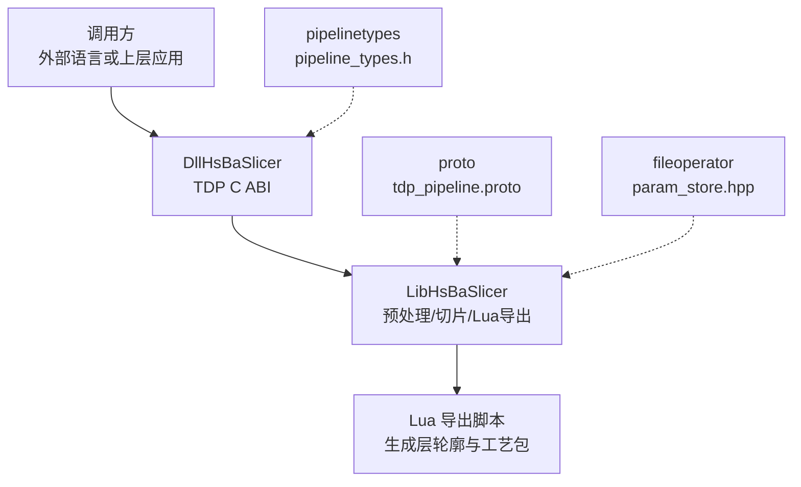
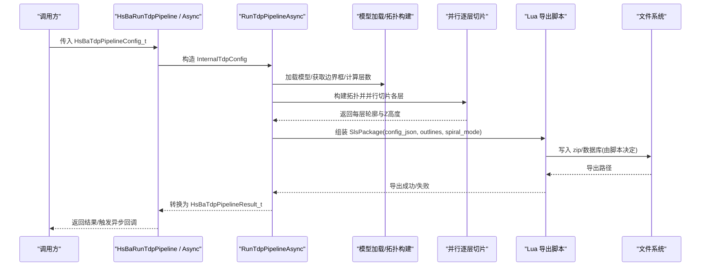
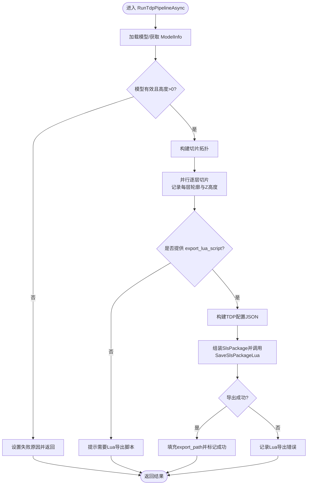
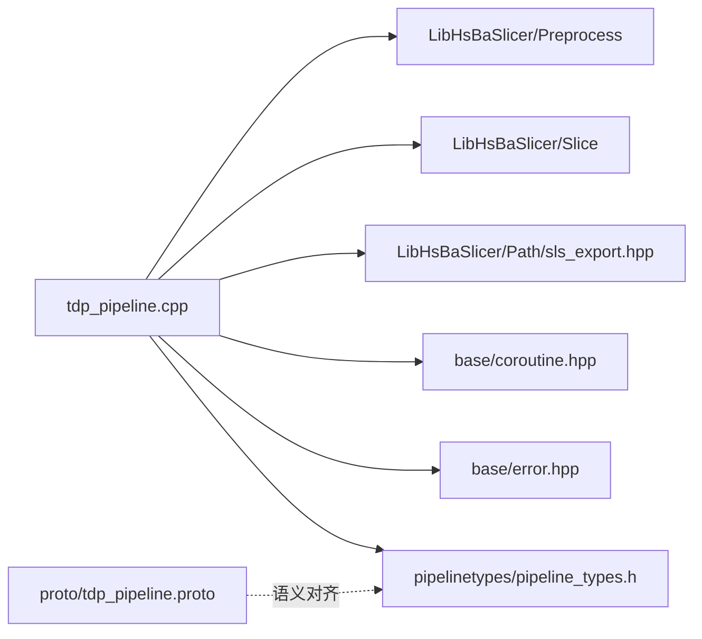
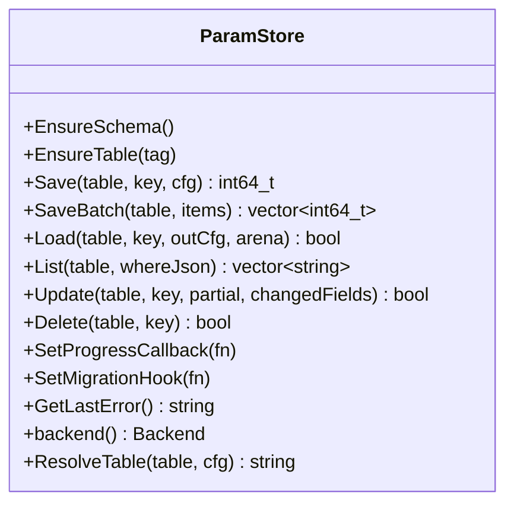

# TDP三维打印流水线

<cite>
**本文引用的文件**   
- [README.md](file://README.md)
- [tdp_pipeline.h](file://DllHsBaSlicer/tdp_pipeline.h)
- [tdp_pipeline.cpp](file://DllHsBaSlicer/tdp_pipeline.cpp)
- [pipeline_types.h](file://pipelinetypes/pipeline_types.h)
- [tdp_pipeline.proto](file://proto/tdp_pipeline.proto)
- [param_store.hpp](file://fileoperator/param_store.hpp)
</cite>

## 目录
1. [简介](#简介)
2. [项目结构](#项目结构)
3. [核心组件](#核心组件)
4. [架构总览](#架构总览)
5. [详细组件分析](#详细组件分析)
6. [依赖关系分析](#依赖关系分析)
7. [性能与并发特性](#性能与并发特性)
8. [参数存储（ParamStore）能力说明](#参数存储paramstore能力说明)
9. [故障排查指南](#故障排查指南)
10. [结论](#结论)

## 简介
TDP（Three-Dimensional Printing，粘结剂喷射）流水线面向粉末床+液体粘结剂的增材制造流程。该实现以 C ABI 暴露同步与异步接口，内部完成模型加载、切片拓扑构建、并行逐层切片，并通过 Lua 导出脚本输出层轮廓与工艺参数包。同时，项目提供 ParamStore 能力，用于按 key 对任意 PipelineConfig 进行持久化保存与读取，支持 SQLite/MySQL/PostgreSQL 后端。

本仓库的 README 将 HsBaSlicer 定位为“面向 3D 打印切片领域的高性能 C++ 软件框架”，并提供 DllHsBaSlicer（C ABI）、LibHsBaSlicer（C++ 全流程封装）等库目标。

**章节来源**
- [README.md:21-39](file://README.md#L21-L39)

## 项目结构
围绕 TDP 流水线的关键位置如下：
- DllHsBaSlicer/tdp_pipeline.{h,cpp}：对外 C ABI 入口与流水线实现
- pipelinetypes/pipeline_types.h：所有流水线 C 类型定义，包括 TDP 配置/结果/回调
- proto/tdp_pipeline.proto：TDP 配置的 Protobuf 定义
- fileoperator/param_store.hpp：ParamStore 主类，提供 Save/Load/List/Update/Delete 等能力

**图表来源**
- [tdp_pipeline.h:1-63](file://DllHsBaSlicer/tdp_pipeline.h#L1-L63)
- [tdp_pipeline.cpp:1-355](file://DllHsBaSlicer/tdp_pipeline.cpp#L1-L355)
- [pipeline_types.h:463-521](file://pipelinetypes/pipeline_types.h#L463-L521)
- [tdp_pipeline.proto:1-47](file://proto/tdp_pipeline.proto#L1-L47)
- [param_store.hpp:1-109](file://fileoperator/param_store.hpp#L1-L109)

**章节来源**
- [tdp_pipeline.h:1-63](file://DllHsBaSlicer/tdp_pipeline.h#L1-L63)
- [pipeline_types.h:463-521](file://pipelinetypes/pipeline_types.h#L463-L521)
- [tdp_pipeline.proto:1-47](file://proto/tdp_pipeline.proto#L1-L47)
- [param_store.hpp:1-109](file://fileoperator/param_store.hpp#L1-L109)

## 核心组件
- TDP C ABI 接口
  - 创建默认配置：HsBaCreateDefaultTdpConfig
  - 同步执行：HsBaRunTdpPipeline
  - 异步执行：HsBaRunTdpPipelineAsync
  - 释放结果：HsBaFreeTdpPipelineResult
- TDP 配置与结果类型
  - HsBaTdpPipelineConfig_t：包含模型路径、层高、粘结剂参数、Lua 导出脚本、输出路径、螺旋模式等
  - HsBaTdpPipelineResult_t：成功标志、总层数、导出路径、错误信息、耗时
- 进度与结果回调
  - HsBaTdpProgressCallback：进度百分比与阶段描述
  - HsBaTdpResultCallback：异步结果回调

这些类型与回调在 pipeline_types.h 中统一定义，确保跨语言 ABI 稳定。

**章节来源**
- [tdp_pipeline.h:17-56](file://DllHsBaSlicer/tdp_pipeline.h#L17-L56)
- [pipeline_types.h:463-521](file://pipelinetypes/pipeline_types.h#L463-L521)

## 架构总览
TDP 流水线采用“预处理 → 切片 → Lua 导出”三段式流程，并以协程 + 并行层切片提升吞吐。

**图表来源**
- [tdp_pipeline.cpp:197-310](file://DllHsBaSlicer/tdp_pipeline.cpp#L197-L310)
- [tdp_pipeline.cpp:316-354](file://DllHsBaSlicer/tdp_pipeline.cpp#L316-L354)

## 详细组件分析

### TDP 流水线实现（DllHsBaSlicer/tdp_pipeline.cpp）
- 内部数据结构
  - InternalTdpResult：封装 success、total_layers、export_path、error_message、elapsed_seconds
  - InternalTdpConfig：映射 C ABI 配置到内部字段，含进度回调与用户数据
- 关键算法与流程
  - 层数计算：根据模型高度、首层层高与普通层高估算 total_layers
  - Z 坐标计算：首层使用 first_layer_height，后续层按 layer_height 步进
  - 进度上报：通过 ReportProgress 回调，覆盖加载、切片、导出等阶段
  - 切片并行：基于 ParallelForLayers 对每层独立切片，共享拓扑只读
  - Lua 导出：将层轮廓、Z 高度、配置 JSON、螺旋模式打包为 SlsPackage，调用 SaveSlsPackageLua
- 异常与计时
  - 捕获 RuntimeError，统一转为 error_message
  - 使用 steady_clock 统计 elapsed_seconds

**图表来源**
- [tdp_pipeline.cpp:94-157](file://DllHsBaSlicer/tdp_pipeline.cpp#L94-L157)
- [tdp_pipeline.cpp:197-310](file://DllHsBaSlicer/tdp_pipeline.cpp#L197-L310)

**章节来源**
- [tdp_pipeline.cpp:28-55](file://DllHsBaSlicer/tdp_pipeline.cpp#L28-L55)
- [tdp_pipeline.cpp:94-157](file://DllHsBaSlicer/tdp_pipeline.cpp#L94-L157)
- [tdp_pipeline.cpp:197-310](file://DllHsBaSlicer/tdp_pipeline.cpp#L197-L310)

### C ABI 接口（DllHsBaSlicer/tdp_pipeline.h）
- 默认配置初始化：HsBaCreateDefaultTdpConfig
- 同步执行：HsBaRunTdpPipeline
- 异步执行：HsBaRunTdpPipelineAsync
- 结果释放：HsBaFreeTdpPipelineResult

这些函数均位于 extern "C" 段内，保证跨语言 ABI 兼容。

**章节来源**
- [tdp_pipeline.h:17-56](file://DllHsBaSlicer/tdp_pipeline.h#L17-L56)

### C 类型定义（pipelinetypes/pipeline_types.h）
- HsBaTdpBinderMode_t：全彩/单通道/烧结辅助三种粘结剂模式
- HsBaTdpPipelineConfig_t：模型、层高、粘结剂参数、Lua 导出脚本、输出路径、螺旋模式
- HsBaTdpPipelineResult_t：成功标志、总层数、导出路径、错误信息、耗时
- HsBaTdpProgressCallback/HsBaTdpResultCallback：进度与异步结果回调
- HsBaTdpConfigDefault：默认值初始化器

此外，同文件中还定义了 ParamStore 相关的 C 类型（见下一节）。

**章节来源**
- [pipeline_types.h:463-521](file://pipelinetypes/pipeline_types.h#L463-L521)
- [pipeline_types.h:903-921](file://pipelinetypes/pipeline_types.h#L903-L921)

### Protobuf 定义（proto/tdp_pipeline.proto）
- tdp_binder_mode：枚举，对应粘结剂模式
- tdp_pipe_config：TDP 配置消息，包含模型、层高、粘结剂参数、Lua 导出脚本、输出路径、螺旋模式
- tdp_pipe_result：TDP 结果消息，包含成功标志、总层数、导出路径、错误信息、耗时

该定义与 C ABI 配置/结果语义一致，便于跨语言序列化。

**章节来源**
- [tdp_pipeline.proto:8-37](file://proto/tdp_pipeline.proto#L8-L37)
- [tdp_pipeline.proto:39-46](file://proto/tdp_pipeline.proto#L39-L46)

## 依赖关系分析
- DllHsBaSlicer/tdp_pipeline.cpp 依赖 LibHsBaSlicer 的预处理、切片与 SLS 导出能力，并通过 base/coroutine.hpp 与 base/error.hpp 处理协程与错误
- 类型定义集中在 pipelinetypes/pipeline_types.h，供 Dll 与 convert 等模块复用
- Proto 定义与 C ABI 保持语义对齐，便于多语言集成

**图表来源**
- [tdp_pipeline.cpp:17-23](file://DllHsBaSlicer/tdp_pipeline.cpp#L17-L23)
- [pipeline_types.h:463-521](file://pipelinetypes/pipeline_types.h#L463-L521)
- [tdp_pipeline.proto:1-47](file://proto/tdp_pipeline.proto#L1-L47)

**章节来源**
- [tdp_pipeline.cpp:17-23](file://DllHsBaSlicer/tdp_pipeline.cpp#L17-L23)
- [pipeline_types.h:463-521](file://pipelinetypes/pipeline_types.h#L463-L521)
- [tdp_pipeline.proto:1-47](file://proto/tdp_pipeline.proto#L1-L47)

## 性能与并发特性
- 层切片并行：通过 ParallelForLayers 对每层独立切片，共享拓扑只读，避免锁竞争
- 进度回调：在加载、切片、导出阶段上报进度，便于 UI 或上层监控
- 计时统计：使用 steady_clock 统计整体耗时，便于性能评估
- Lua 导出：具体 I/O 与打包策略由脚本决定，可灵活优化

[本节为通用性能讨论，不直接分析具体文件]

## 参数存储（ParamStore）能力说明
ParamStore 提供针对 PipelineConfig 的统一持久化能力：
- EnsureSchema/EnsureTable：按需建表
- Save/SaveBatch：按 key upsert 单个或批量配置，SaveBatch 包裹事务
- Load：按 key 回填到 AnyObject 包装的目标结构体，const char* 字段由 StringArena 管理
- List/Update/Delete：查询、增量更新、删除
- 错误处理：last_error 记录最近失败，异常不被吞掉，继续上抛给调用方
- 后端支持：SQLite/MySQL/PostgreSQL，移动端仅 SQLite

在 pipeline_types.h 中还定义了 C 侧的 ParamStore 类型：
- HsBaPipelineKind：与 PipelineConfigTag 一一对应
- HsBaParamStoreBackend：后端选择
- HsBaParamStoreConn_t：连接参数（SQLite 用 sqlite_path；MySQL/PGSQL 用 host/port/user/password/database）
- HsBaParamStoreResult_t：保存/加载结果（success、param_id、error_message、elapsed_seconds）

**图表来源**
- [param_store.hpp:33-105](file://fileoperator/param_store.hpp#L33-L105)

**章节来源**
- [param_store.hpp:1-109](file://fileoperator/param_store.hpp#L1-L109)
- [pipeline_types.h:985-1042](file://pipelinetypes/pipeline_types.h#L985-L1042)

## 故障排查指南
- 模型加载失败
  - 现象：result.success=false，error_message 包含“Failed to load model”
  - 排查：确认 model_name/model_path 正确，模型文件存在且可读
- 模型高度无效
  - 现象：result.success=false，error_message 包含“Invalid model height”
  - 排查：检查模型几何有效性，确认 bbox 高度大于 0
- 缺少 Lua 导出脚本
  - 现象：result.success=false，error_message 提示需要提供 export_lua_script
  - 排查：确保 export_lua_script 非空，且脚本路径可访问
- Lua 导出失败
  - 现象：result.success=false，error_message 包含“Failed to export 3DP package via Lua script”
  - 排查：检查 Lua 脚本语法、导出函数名、输出路径权限
- 资源释放
  - 必须调用 HsBaFreeTdpPipelineResult 释放 export_path 与 error_message
  - 若使用 ParamStore，需使用专用释放函数释放 error_message

**章节来源**
- [tdp_pipeline.cpp:206-229](file://DllHsBaSlicer/tdp_pipeline.cpp#L206-L229)
- [tdp_pipeline.cpp:257-296](file://DllHsBaSlicer/tdp_pipeline.cpp#L257-L296)
- [tdp_pipeline.cpp:348-354](file://DllHsBaSlicer/tdp_pipeline.cpp#L348-L354)

## 结论
TDP 三维打印流水线以稳定的 C ABI 暴露同步与异步接口，内部通过预处理、并行切片与 Lua 导出脚本组合，形成可扩展的层轮廓与工艺参数输出方案。ParamStore 提供了统一的工艺参数持久化能力，支持多后端与事务化批量操作。整体设计强调模块化、跨语言兼容性与可观测性（进度回调、耗时统计），便于在生产环境中集成与扩展。