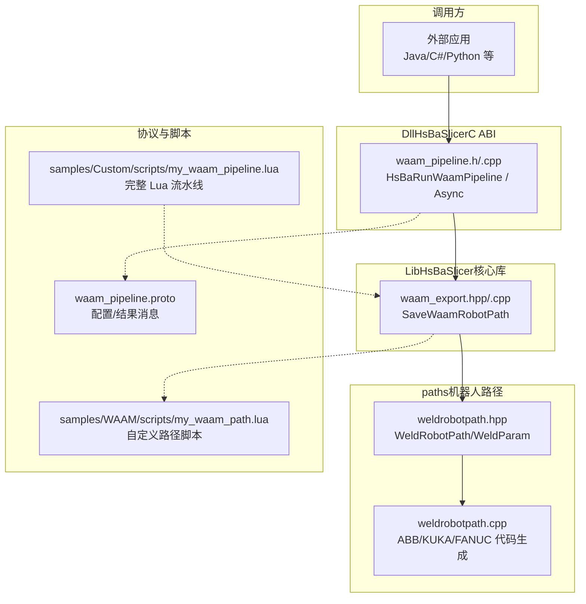
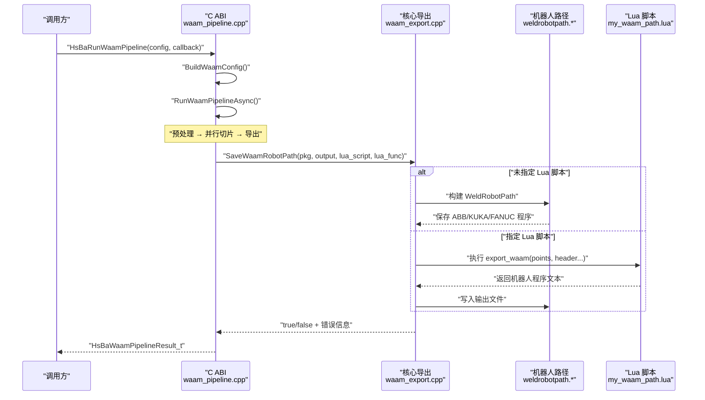
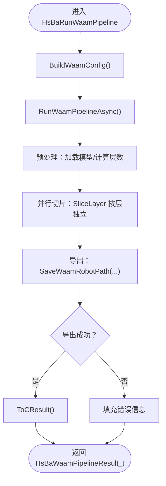
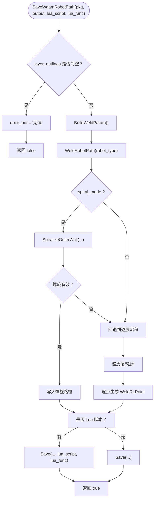
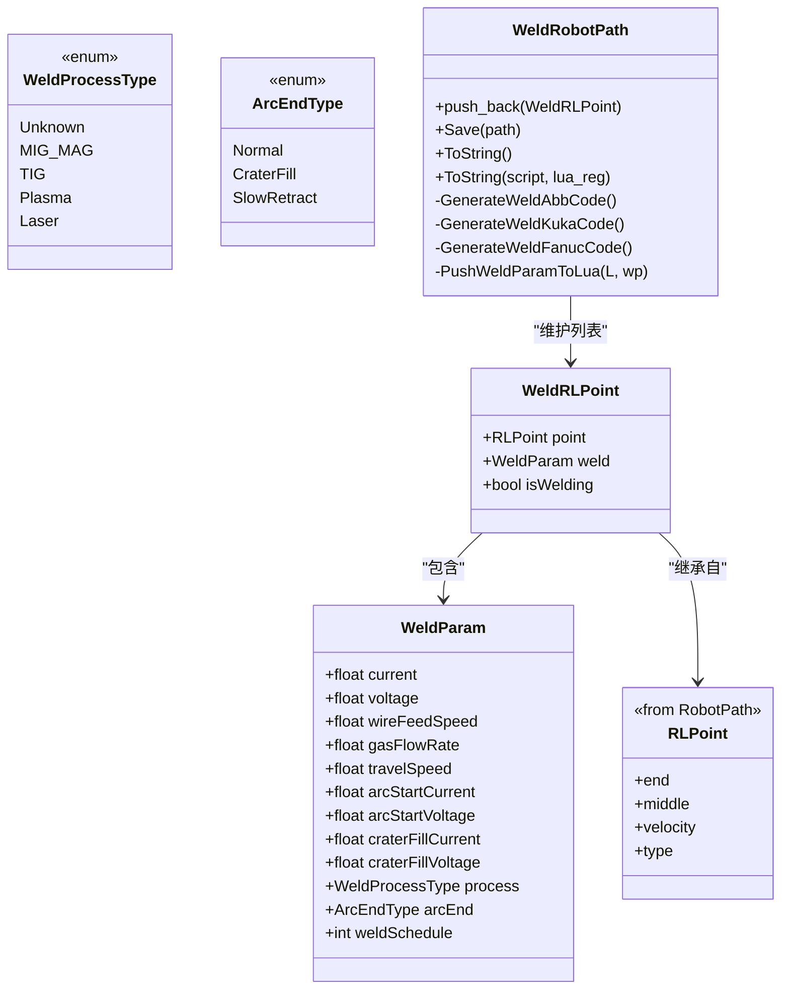
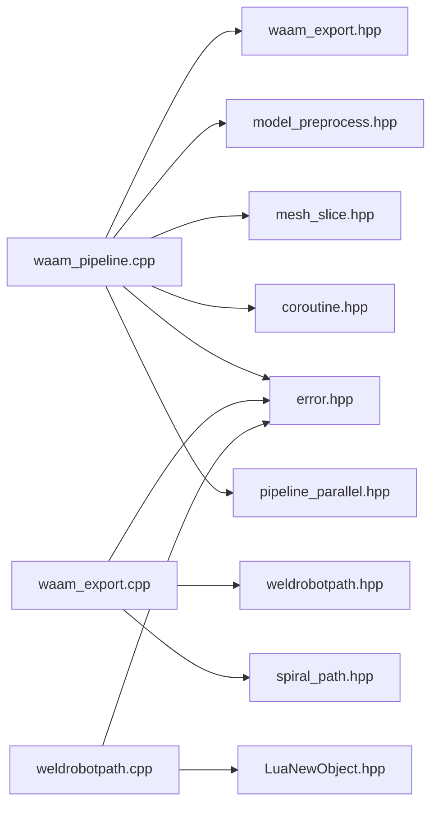
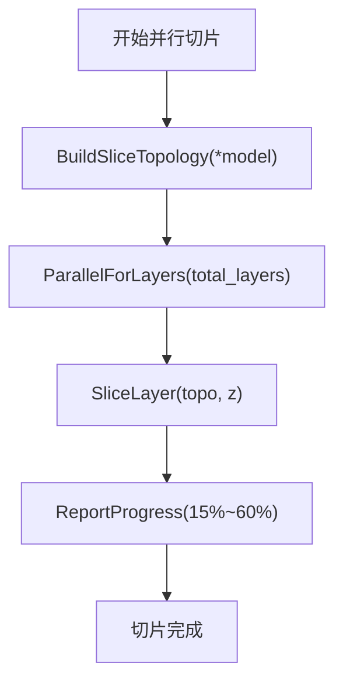

# WAAM电弧增材制造流水线

<cite>
**本文引用的文件**   
- [waam_pipeline.h](file://DllHsBaSlicer/waam_pipeline.h)
- [waam_pipeline.cpp](file://DllHsBaSlicer/waam_pipeline.cpp)
- [waam_export.hpp](file://LibHsBaSlicer/Path/waam_export.hpp)
- [waam_export.cpp](file://LibHsBaSlicer/Path/waam_export.cpp)
- [weldrobotpath.hpp](file://paths/weldrobotpath.hpp)
- [weldrobotpath.cpp](file://paths/weldrobotpath.cpp)
- [waam_pipeline.proto](file://proto/waam_pipeline.proto)
- [my_waam_path.lua](file://samples/WAAM/scripts/my_waam_path.lua)
- [my_waam_pipeline.lua](file://samples/Custom/scripts/my_waam_pipeline.lua)
</cite>

## 目录
1. [引言](#引言)
2. [项目结构](#项目结构)
3. [核心组件](#核心组件)
4. [架构总览](#架构总览)
5. [详细组件分析](#详细组件分析)
6. [依赖关系分析](#依赖关系分析)
7. [性能与并行切片](#性能与并行切片)
8. [故障排查](#故障排查)
9. [结论](#结论)
10. [附录：Lua 脚本契约](#附录lua-脚本契约)

## 引言
本文件面向“WAAM（Wire Arc Additive Manufacturing，电弧增材制造）”机器人金属熔覆流水线。与粉末床或叠层工艺不同，WAAM 的输出不是层图压缩包，而是机器人语言程序（ABB RAPID、KUKA KRL、FANUC TP），由逐层沉积轮廓驱动机器人逐道熔敷焊丝。

该流水线在 DllHsBaSlicer 暴露 C ABI，在 LibHsBaSlicer 提供核心导出能力，底层使用 paths 模块的焊接机器人路径生成器，并支持可选 Lua 自定义代码生成。

## 项目结构
围绕 WAAM 的关键源码分布在以下位置：
- DllHsBaSlicer：C ABI 入口与同步/异步执行封装
- LibHsBaSlicer/Path：WAAM 机器人程序导出 API
- paths：WeldRobotPath 及 ABB/KUKA/FANUC 代码生成
- proto：WAAM 配置与结果的 Protobuf 定义
- samples：内置示例 Lua 脚本（路径脚本与完整流水线脚本）

**图示来源**
- [waam_pipeline.h:1-64](file://DllHsBaSlicer/waam_pipeline.h#L1-L64)
- [waam_pipeline.cpp:16-22](file://DllHsBaSlicer/waam_pipeline.cpp#L16-L22)
- [waam_export.hpp:1-77](file://LibHsBaSlicer/Path/waam_export.hpp#L1-L77)
- [weldrobotpath.hpp:1-100](file://paths/weldrobotpath.hpp#L1-L100)
- [weldrobotpath.cpp:1-16](file://paths/weldrobotpath.cpp#L1-L16)
- [waam_pipeline.proto:1-89](file://proto/waam_pipeline.proto#L1-L89)
- [my_waam_path.lua:1-46](file://samples/WAAM/scripts/my_waam_path.lua#L1-L46)
- [my_waam_pipeline.lua:1-94](file://samples/Custom/scripts/my_waam_pipeline.lua#L1-L94)

**章节来源**
- [waam_pipeline.h:1-64](file://DllHsBaSlicer/waam_pipeline.h#L1-L64)
- [waam_pipeline.cpp:1-322](file://DllHsBaSlicer/waam_pipeline.cpp#L1-L322)
- [waam_export.hpp:1-77](file://LibHsBaSlicer/Path/waam_export.hpp#L1-L77)
- [waam_export.cpp:1-179](file://LibHsBaSlicer/Path/waam_export.cpp#L1-L179)
- [weldrobotpath.hpp:1-100](file://paths/weldrobotpath.hpp#L1-L100)
- [weldrobotpath.cpp:1-479](file://paths/weldrobotpath.cpp#L1-L479)
- [waam_pipeline.proto:1-89](file://proto/waam_pipeline.proto#L1-L89)
- [my_waam_path.lua:1-46](file://samples/WAAM/scripts/my_waam_path.lua#L1-L46)
- [my_waam_pipeline.lua:1-94](file://samples/Custom/scripts/my_waam_pipeline.lua#L1-L94)

## 核心组件
- C ABI 接口（DllHsBaSlicer）
  - HsBaCreateDefaultWaamConfig：创建默认配置
  - HsBaRunWaamPipeline：同步执行预处理→切片→机器人路径导出
  - HsBaRunWaamPipelineAsync：异步执行，回调返回结果
  - HsBaFreeWaamPipelineResult：释放结果中的字符串内存
- 导出 API（LibHsBaSlicer）
  - WaamRobotPackage：携带每层轮廓、Z 高度、焊接参数、机器人类型、珠宽、螺旋模式等
  - SaveWaamRobotPath：将包转换为 WeldRobotPath 并写出机器人程序文本
- 机器人路径（paths）
  - WeldRobotPath：继承 RobotPath，扩展焊接点与焊接参数
  - 支持 ABB/KUKA/FANUC 三种机器人语言的代码生成
  - 支持通过 Lua 脚本替换内置代码生成逻辑
- 协议（proto）
  - waam_pipe_config：模型、层高、焊接参数、保护气体、机器人类型、输出路径、螺旋模式等
  - waam_pipe_result：成功标志、层数、输出路径、错误信息、耗时

**章节来源**
- [waam_pipeline.h:17-57](file://DllHsBaSlicer/waam_pipeline.h#L17-L57)
- [waam_export.hpp:17-72](file://LibHsBaSlicer/Path/waam_export.hpp#L17-L72)
- [weldrobotpath.hpp:16-96](file://paths/weldrobotpath.hpp#L16-L96)
- [waam_pipeline.proto:9-88](file://proto/waam_pipeline.proto#L9-L88)

## 架构总览
WAAM 流水线从 C ABI 进入，内部以协程方式组织三个阶段：加载模型、并行切片、机器人路径导出。导出阶段可选择内置 ABB/KUKA/FANUC 代码生成，或通过 Lua 脚本完全自定义输出。

**图示来源**
- [waam_pipeline.cpp:168-277](file://DllHsBaSlicer/waam_pipeline.cpp#L168-L277)
- [waam_export.cpp:61-175](file://LibHsBaSlicer/Path/waam_export.cpp#L61-L175)
- [weldrobotpath.cpp:72-100](file://paths/weldrobotpath.cpp#L72-L100)
- [my_waam_path.lua:17-45](file://samples/WAAM/scripts/my_waam_path.lua#L17-L45)

## 详细组件分析

### C ABI 层（DllHsBaSlicer）
- 职责
  - 接收外部配置，构造内部配置对象
  - 调度协程任务，统一进度回调与错误处理
  - 将内部结果转换为 C ABI 结构体，管理字符串所有权
- 关键流程
  - BuildWaamConfig：映射 C 配置到内部结构
  - RunWaamPipelineAsync：三阶段流水线（预处理、切片、导出）
  - ToCResult/HsBaFreeWaamPipelineResult：安全释放 malloc 字符串

**图示来源**
- [waam_pipeline.cpp:126-166](file://DllHsBaSlicer/waam_pipeline.cpp#L126-L166)
- [waam_pipeline.cpp:168-277](file://DllHsBaSlicer/waam_pipeline.cpp#L168-L277)
- [waam_pipeline.cpp:288-321](file://DllHsBaSlicer/waam_pipeline.cpp#L288-L321)

**章节来源**
- [waam_pipeline.cpp:26-59](file://DllHsBaSlicer/waam_pipeline.cpp#L26-L59)
- [waam_pipeline.cpp:64-96](file://DllHsBaSlicer/waam_pipeline.cpp#L64-L96)
- [waam_pipeline.cpp:98-122](file://DllHsBaSlicer/waam_pipeline.cpp#L98-L122)
- [waam_pipeline.cpp:126-166](file://DllHsBaSlicer/waam_pipeline.cpp#L126-L166)
- [waam_pipeline.cpp:168-277](file://DllHsBaSlicer/waam_pipeline.cpp#L168-L277)
- [waam_pipeline.cpp:283-321](file://DllHsBaSlicer/waam_pipeline.cpp#L283-L321)

### 导出层（LibHsBaSlicer/Path）
- 职责
  - 将 WaamRobotPackage 转换为 WeldRobotPath
  - 支持“螺旋模式”（vase mode）：将所有层外轮廓合并为一条连续上升焊缝
  - 支持可选 Lua 脚本进行后处理/替换
- 关键逻辑
  - 空层检查、默认速度回退
  - 螺旋模式优先尝试；若退化则回退到逐层沉积
  - 非螺旋模式下，逐层、逐轮廓生成 MoveJ 快速移动 + MoveL 焊接点

**图示来源**
- [waam_export.cpp:61-175](file://LibHsBaSlicer/Path/waam_export.cpp#L61-L175)
- [weldrobotpath.cpp:72-100](file://paths/weldrobotpath.cpp#L72-L100)

**章节来源**
- [waam_export.hpp:17-72](file://LibHsBaSlicer/Path/waam_export.hpp#L17-L72)
- [waam_export.cpp:18-57](file://LibHsBaSlicer/Path/waam_export.cpp#L18-L57)
- [waam_export.cpp:61-175](file://LibHsBaSlicer/Path/waam_export.cpp#L61-L175)

### 机器人路径层（paths）
- 数据结构
  - WeldProcessType/ArcEndType：焊接工艺与收弧策略
  - WeldParam：电流、电压、送丝速度、气体流量、行走速度、起弧/收弧参数等
  - WeldRLPoint：基础机器人点 + 焊接参数 + 是否焊接标记
  - WeldRobotPath：继承 RobotPath，维护 weldPoints_，并提供 ToString/Save/Lua 导出
- 代码生成
  - ABB：ArcLStart/ArcLEnd 指令，带 seam/weave/tool 数据
  - KUKA：ARC_On/Off、ARC_SetWeldParam、ARC_CraterFill
  - FANUC：TP 程序，ARC START/END，配合 Schedule 编号
- Lua 集成
  - 将 points 表与 weld 参数推入 Lua 环境
  - 执行用户脚本，返回字符串作为最终机器人程序

**图示来源**
- [weldrobotpath.hpp:16-96](file://paths/weldrobotpath.hpp#L16-L96)
- [weldrobotpath.cpp:192-219](file://paths/weldrobotpath.cpp#L192-L219)
- [weldrobotpath.cpp:221-476](file://paths/weldrobotpath.cpp#L221-L476)

**章节来源**
- [weldrobotpath.hpp:16-96](file://paths/weldrobotpath.hpp#L16-L96)
- [weldrobotpath.cpp:54-100](file://paths/weldrobotpath.cpp#L54-L100)
- [weldrobotpath.cpp:103-190](file://paths/weldrobotpath.cpp#L103-L190)
- [weldrobotpath.cpp:221-476](file://paths/weldrobotpath.cpp#L221-L476)

### 协议与配置（proto）
- waam_material：钢/铝/钛/铜/未知
- waam_weld_process：电弧/激光/未知
- waam_protection：保护气/真空/未知
- waam_protect_gas：氩/氦/氮/二氧化碳/未知
- waam_robot_type：ABB/KUKA/FANUC/未知
- waam_pipe_config：模型名/路径、层高、第一层高、珠宽、行走速度、送丝速度、电流、电压、气体流量、材料、焊接工艺、保护、保护气体、层间温度、机器人类型、Lua 脚本/函数、输出路径、螺旋模式
- waam_pipe_result：成功、总层数、输出路径、错误信息、耗时

**章节来源**
- [waam_pipeline.proto:9-88](file://proto/waam_pipeline.proto#L9-L88)

## 依赖关系分析
- DllHsBaSlicer/waam_pipeline.cpp
  - 依赖 LibHsBaSlicer/Path/waam_export.hpp（导出 API）
  - 依赖 LibHsBaSlicer/Preprocess/model_preprocess.hpp（模型加载）
  - 依赖 LibHsBaSlicer/Slice/mesh_slice.hpp（切片）
  - 依赖 base/coroutine.hpp（协程）、base/error.hpp（错误）
  - 依赖 pipeline_parallel.hpp（并行切片）
- LibHsBaSlicer/Path/waam_export.cpp
  - 依赖 paths/weldrobotpath.hpp（焊接机器人路径）
  - 依赖 spiral_path.hpp（螺旋路径算法）
  - 依赖 base/error.hpp（RuntimeError）
- paths/weldrobotpath.*
  - 依赖 utils/LuaNewObject.hpp（Lua 状态）
  - 依赖 base/error.hpp（异常）

**图示来源**
- [waam_pipeline.cpp:16-22](file://DllHsBaSlicer/waam_pipeline.cpp#L16-L22)
- [waam_export.cpp:11-13](file://LibHsBaSlicer/Path/waam_export.cpp#L11-L13)
- [weldrobotpath.cpp:12-15](file://paths/weldrobotpath.cpp#L12-L15)

**章节来源**
- [waam_pipeline.cpp:16-22](file://DllHsBaSlicer/waam_pipeline.cpp#L16-L22)
- [waam_export.cpp:11-13](file://LibHsBaSlicer/Path/waam_export.cpp#L11-L13)
- [weldrobotpath.cpp:12-15](file://paths/weldrobotpath.cpp#L12-L15)

## 性能与并行切片
- 切片阶段采用 ParallelForLayers，对每层独立调用 SliceLayer，共享拓扑只读，提升多核利用率
- 进度回调按完成层数线性插值更新，避免 UI 卡顿
- 螺旋模式可显著减少层间抬刀与熄弧/引弧次数，适合单闭合外轮廓场景

**图示来源**
- [waam_pipeline.cpp:202-224](file://DllHsBaSlicer/waam_pipeline.cpp#L202-L224)

**章节来源**
- [waam_pipeline.cpp:202-224](file://DllHsBaSlicer/waam_pipeline.cpp#L202-L224)

## 故障排查
- 模型加载失败
  - 现象：total_layers <= 0 或无法获取 ModelInfo
  - 处理：设置 success=false，error_message 包含路径信息
- 切片为空或无效
  - 现象：layer_outlines 为空
  - 处理：SaveWaamRobotPath 返回 false，error_out 提示“无层”
- 螺旋模式退化
  - 现象：外层轮廓不闭合，SpiralizeOuterWall 返回不足两点
  - 处理：自动回退到逐层沉积
- Lua 脚本错误
  - 现象：loadbuffer/pcall 失败
  - 处理：抛出 RuntimeError，错误信息包含 Lua 报错
- 不支持的机器人类型
  - 现象：robot_type 不在 ABB/KUKA/FANUC
  - 处理：WeldRobotPath::ToString 抛出 NotSupportedError，建议使用 Lua 脚本

**章节来源**
- [waam_pipeline.cpp:173-198](file://DllHsBaSlicer/waam_pipeline.cpp#L173-L198)
- [waam_export.cpp:67-73](file://LibHsBaSlicer/Path/waam_export.cpp#L67-L73)
- [waam_export.cpp:114-122](file://LibHsBaSlicer/Path/waam_export.cpp#L114-L122)
- [weldrobotpath.cpp:103-170](file://paths/weldrobotpath.cpp#L103-L170)
- [weldrobotpath.cpp:97-99](file://paths/weldrobotpath.cpp#L97-L99)

## 结论
WAAM 流水线以清晰的三层结构实现：C ABI 负责跨语言调用与生命周期管理，Lib 层负责数据装配与导出决策，paths 层负责具体机器人语言代码生成。其设计优势包括：
- 明确的阶段划分与进度反馈
- 并行切片提升性能
- 螺旋模式优化连续焊缝
- Lua 脚本可扩展性强，适配未知机器人品牌或特殊工艺

## 附录：Lua 脚本契约
- 路径脚本（my_waam_path.lua）
  - 全局变量：header、startProgramFunc、endProgramFunc、points
  - 函数：export_waam()
  - 返回值：字符串（完整机器人程序文本）
- 完整流水线脚本（my_waam_pipeline.lua）
  - 使用 HsBa.saveWaamPackage 算子，传入 outlines、zHeights、weld、robotType、beadWidth、config、output
  - 自行控制进度、模型生命周期与输出路径

**章节来源**
- [my_waam_path.lua:1-46](file://samples/WAAM/scripts/my_waam_path.lua#L1-L46)
- [my_waam_pipeline.lua:1-94](file://samples/Custom/scripts/my_waam_pipeline.lua#L1-L94)