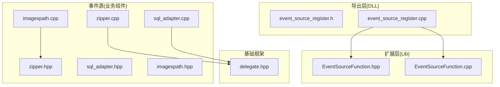
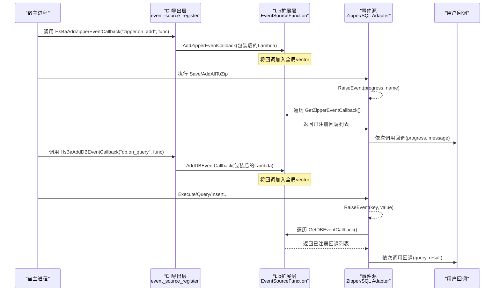
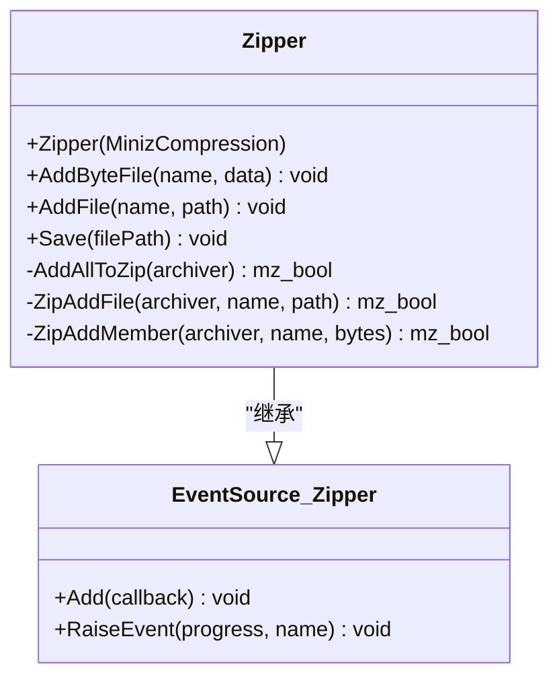
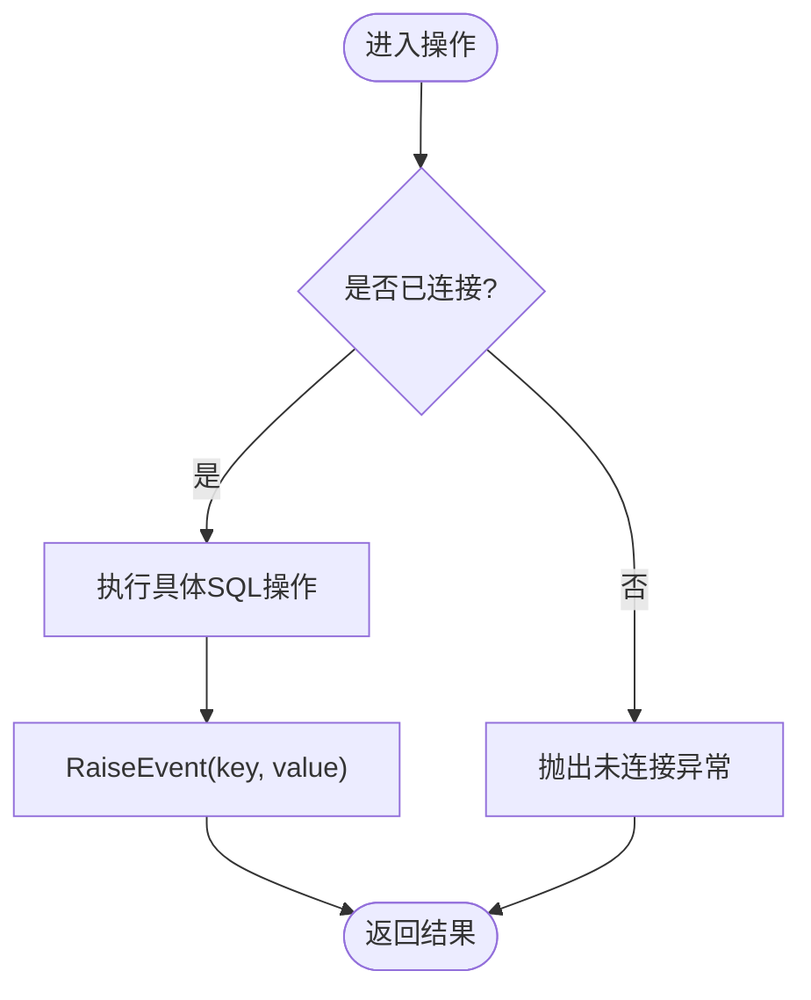
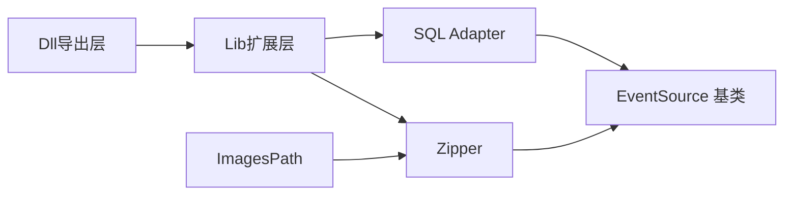

# 事件源注册系统

<cite>
**本文引用的文件**   
- [event_source_register.h](file://DllHsBaSlicer/event_source_register.h)
- [event_source_register.cpp](file://DllHsBaSlicer/event_source_register.cpp)
- [EventSourceFunction.hpp](file://LibHsBaSlicer/Extends/EventSourceFunction.hpp)
- [EventSourceFunction.cpp](file://LibHsBaSlicer/Extends/EventSourceFunction.cpp)
- [zipper.hpp](file://fileoperator/zipper.hpp)
- [zipper.cpp](file://fileoperator/zipper.cpp)
- [sql_adapter.hpp](file://fileoperator/sql_adapter.hpp)
- [sql_adapter.cpp](file://fileoperator/sql_adapter.cpp)
- [imagespath.hpp](file://paths/imagespath.hpp)
- [imagespath.cpp](file://paths/imagespath.cpp)
- [delegate.hpp](file://base/delegate.hpp)
- [README.md（英文）](file://docs/en/DllHsBaSlicer/README.md)
</cite>

## 目录
1. [简介](#简介)
2. [项目结构](#项目结构)
3. [核心组件](#核心组件)
4. [架构总览](#架构总览)
5. [详细组件分析](#详细组件分析)
6. [依赖关系分析](#依赖关系分析)
7. [性能考虑](#性能考虑)
8. [故障排查指南](#故障排查指南)
9. [结论](#结论)
10. [附录](#附录)

## 简介
本文件围绕 HsBaSlicer 中的“事件源注册系统”进行系统化文档化，重点覆盖以下方面：
- 通过 C/C++ API 向库内事件源注册回调，用于监听压缩进度与数据库操作事件
- 基于模板化的 EventSource 机制实现对象级事件派发
- 全局回调容器管理 Zipper 与 DB 两类事件回调
- 典型使用场景：图像打包、SQL 适配器操作等

该系统的目标是提供统一、可扩展且线程安全的事件分发能力，使上层宿主（如 Qt/wxWidgets/Unity/UE）能够以最小耦合接入底层处理流程的进度与状态通知。

## 项目结构
事件源注册系统涉及三个层次：
- 导出层（DLL 接口）：对外暴露 C 风格函数，供非 C++ 或简单宿主调用
- 扩展层（Lib 内部）：维护全局回调列表，提供 Add/Get 方法
- 事件源层（业务组件）：继承 EventSource 并在关键路径 RaiseEvent

图表来源
- [event_source_register.h:1-18](file://DllHsBaSlicer/event_source_register.h#L1-L18)
- [event_source_register.cpp:1-27](file://DllHsBaSlicer/event_source_register.cpp#L1-L27)
- [EventSourceFunction.hpp:1-40](file://LibHsBaSlicer/Extends/EventSourceFunction.hpp#L1-L40)
- [EventSourceFunction.cpp:1-23](file://LibHsBaSlicer/Extends/EventSourceFunction.cpp#L1-L23)
- [zipper.hpp:1-92](file://fileoperator/zipper.hpp#L1-L92)
- [zipper.cpp:1-213](file://fileoperator/zipper.cpp#L1-L213)
- [sql_adapter.hpp:1-606](file://fileoperator/sql_adapter.hpp#L1-L606)
- [sql_adapter.cpp:1-800](file://fileoperator/sql_adapter.cpp#L1-L800)
- [imagespath.hpp:1-47](file://paths/imagespath.hpp#L1-L47)
- [imagespath.cpp:1-346](file://paths/imagespath.cpp#L1-L346)
- [delegate.hpp:195-246](file://base/delegate.hpp#L195-L246)

章节来源
- [event_source_register.h:1-18](file://DllHsBaSlicer/event_source_register.h#L1-L18)
- [event_source_register.cpp:1-27](file://DllHsBaSlicer/event_source_register.cpp#L1-L27)
- [EventSourceFunction.hpp:1-40](file://LibHsBaSlicer/Extends/EventSourceFunction.hpp#L1-L40)
- [EventSourceFunction.cpp:1-23](file://LibHsBaSlicer/Extends/EventSourceFunction.cpp#L1-L23)
- [zipper.hpp:1-92](file://fileoperator/zipper.hpp#L1-L92)
- [zipper.cpp:1-213](file://fileoperator/zipper.cpp#L1-L213)
- [sql_adapter.hpp:1-606](file://fileoperator/sql_adapter.hpp#L1-L606)
- [sql_adapter.cpp:1-800](file://fileoperator/sql_adapter.cpp#L1-L800)
- [imagespath.hpp:1-47](file://paths/imagespath.hpp#L1-L47)
- [imagespath.cpp:1-346](file://paths/imagespath.cpp#L1-L346)
- [delegate.hpp:195-246](file://base/delegate.hpp#L195-L246)

## 核心组件
- C 风格事件注册接口（DLL 导出）
  - HsBaAddZipperEventCallback：注册压缩事件回调
  - HsBaAddDBEventCallback：注册数据库事件回调
- 全局回调容器（Lib 扩展）
  - AddZipperEventCallback / GetZipperEventCallback
  - AddDBEventCallback / GetDBEventCallback
- 事件源基类（模板化）
  - Utils::EventSource：提供 Add/RaiseEvent 等能力
- 具体事件源
  - Zipper：压缩过程按文件粒度触发进度事件
  - SQLiteAdapter/MySQLAdapter/PostgreSQLAdapter：连接与查询等操作触发键值事件
- 集成点
  - ImagesPath：在保存时注入回调到 Zipper

章节来源
- [event_source_register.h:1-18](file://DllHsBaSlicer/event_source_register.h#L1-L18)
- [event_source_register.cpp:1-27](file://DllHsBaSlicer/event_source_register.cpp#L1-L27)
- [EventSourceFunction.hpp:1-40](file://LibHsBaSlicer/Extends/EventSourceFunction.hpp#L1-L40)
- [EventSourceFunction.cpp:1-23](file://LibHsBaSlicer/Extends/EventSourceFunction.cpp#L1-L23)
- [zipper.hpp:1-92](file://fileoperator/zipper.hpp#L1-L92)
- [zipper.cpp:1-213](file://fileoperator/zipper.cpp#L1-L213)
- [sql_adapter.hpp:1-606](file://fileoperator/sql_adapter.hpp#L1-L606)
- [sql_adapter.cpp:1-800](file://fileoperator/sql_adapter.cpp#L1-L800)
- [imagespath.hpp:1-47](file://paths/imagespath.hpp#L1-L47)
- [imagespath.cpp:1-346](file://paths/imagespath.cpp#L1-L346)

## 架构总览
下图展示了从外部 C 接口到内部事件源的完整调用链，以及回调的分发方式。

图表来源
- [event_source_register.cpp:1-27](file://DllHsBaSlicer/event_source_register.cpp#L1-L27)
- [EventSourceFunction.cpp:1-23](file://LibHsBaSlicer/Extends/EventSourceFunction.cpp#L1-L23)
- [zipper.cpp:1-213](file://fileoperator/zipper.cpp#L1-L213)
- [sql_adapter.cpp:1-800](file://fileoperator/sql_adapter.cpp#L1-L800)

## 详细组件分析

### C 风格事件注册接口（DLL 导出）
- 职责
  - 暴露 C ABI 函数，便于任意语言/宿主调用
  - 将 C 回调封装为 std::function，并传入 Lib 扩展层的全局回调容器
- 关键点
  - 事件名匹配：当前实现仅对特定事件名（如 "zipper.on_add"、"db.on_query"）转发
  - 参数适配：C 回调与 C++ 回调之间进行类型转换（const char* 与 string_view）

章节来源
- [event_source_register.h:1-18](file://DllHsBaSlicer/event_source_register.h#L1-L18)
- [event_source_register.cpp:1-27](file://DllHsBaSlicer/event_source_register.cpp#L1-L27)

### 全局回调容器（Lib 扩展）
- 职责
  - 维护 Zipper 与 DB 两类事件的全局回调列表
  - 提供添加与获取接口，供事件源在运行时遍历调用
- 数据结构
  - 两个静态 vector，分别存储 ZipperEventCallback 与 DBEventCallback
- 复杂度
  - 添加 O(1)，遍历 O(n)；n 为已注册回调数量

章节来源
- [EventSourceFunction.hpp:1-40](file://LibHsBaSlicer/Extends/EventSourceFunction.hpp#L1-L40)
- [EventSourceFunction.cpp:1-23](file://LibHsBaSlicer/Extends/EventSourceFunction.cpp#L1-L23)

### 事件源基类（模板化 EventSource）
- 职责
  - 提供统一的 Add/RaiseEvent 机制，支持多回调订阅与派发
- 设计要点
  - 基于 delegate 实现，支持 += 语法添加回调
  - 线程安全由 delegate 保证，但回调自身需保证线程安全
  - Remove 已被弃用（std::function 无 operator==）

章节来源
- [delegate.hpp:195-246](file://base/delegate.hpp#L195-L246)

### Zipper 事件源
- 职责
  - 压缩过程中按文件粒度触发进度事件（百分比 + 文件名）
- 触发点
  - AddAllToZip 循环中，每处理一个文件后 RaiseEvent
- 集成
  - ImagesPath 在保存时将回调注入 Zipper

图表来源
- [zipper.hpp:1-92](file://fileoperator/zipper.hpp#L1-L92)
- [zipper.cpp:1-213](file://fileoperator/zipper.cpp#L1-L213)
- [delegate.hpp:195-246](file://base/delegate.hpp#L195-L246)

章节来源
- [zipper.hpp:1-92](file://fileoperator/zipper.hpp#L1-L92)
- [zipper.cpp:1-213](file://fileoperator/zipper.cpp#L1-L213)

### SQL 适配器事件源
- 职责
  - 在连接、执行、查询、插入、删除、更新、建表、删表等操作后触发事件
- 事件语义
  - 键值对形式：key 描述操作类型，value 包含相关上下文（如 SQL、连接信息等）
- 线程安全
  - 各方法使用 shared_mutex 保护内部状态

图表来源
- [sql_adapter.hpp:1-606](file://fileoperator/sql_adapter.hpp#L1-L606)
- [sql_adapter.cpp:1-800](file://fileoperator/sql_adapter.cpp#L1-L800)

章节来源
- [sql_adapter.hpp:1-606](file://fileoperator/sql_adapter.hpp#L1-L606)
- [sql_adapter.cpp:1-800](file://fileoperator/sql_adapter.cpp#L1-L800)

### ImagesPath 集成点
- 职责
  - 在保存图像包时，将外部注册的 Zipper 回调注入 Zipper，从而获得压缩进度
- 行为
  - 构造时接收回调列表，Save 时逐一添加到 Zipper
  - ToString 也会触发一次占位回调（提示不用于字符串输出）

章节来源
- [imagespath.hpp:1-47](file://paths/imagespath.hpp#L1-L47)
- [imagespath.cpp:1-346](file://paths/imagespath.cpp#L1-L346)

## 依赖关系分析
- 模块间依赖
  - Dll 导出层依赖 Lib 扩展层（Add/Get 回调）
  - 事件源（Zipper/SQL Adapter）依赖 EventSource 基类
  - ImagesPath 依赖 Zipper 以注入回调
- 外部依赖
  - miniz（压缩）
  - sqlite3/mysql/postgresql（数据库）
  - Lua（脚本环境，与 ImagesPath 配合）

图表来源
- [event_source_register.cpp:1-27](file://DllHsBaSlicer/event_source_register.cpp#L1-L27)
- [EventSourceFunction.cpp:1-23](file://LibHsBaSlicer/Extends/EventSourceFunction.cpp#L1-L23)
- [zipper.hpp:1-92](file://fileoperator/zipper.hpp#L1-L92)
- [sql_adapter.hpp:1-606](file://fileoperator/sql_adapter.hpp#L1-L606)
- [imagespath.cpp:1-346](file://paths/imagespath.cpp#L1-L346)

章节来源
- [event_source_register.cpp:1-27](file://DllHsBaSlicer/event_source_register.cpp#L1-L27)
- [EventSourceFunction.cpp:1-23](file://LibHsBaSlicer/Extends/EventSourceFunction.cpp#L1-L23)
- [zipper.hpp:1-92](file://fileoperator/zipper.hpp#L1-L92)
- [sql_adapter.hpp:1-606](file://fileoperator/sql_adapter.hpp#L1-L606)
- [imagespath.cpp:1-346](file://paths/imagespath.cpp#L1-L346)

## 性能考虑
- 回调数量影响
  - 每次事件触发都会遍历所有已注册回调，O(n) 开销；建议控制回调数量
- 线程模型
  - 回调在库内部工作线程触发，宿主需自行跨线程同步至 UI 线程
  - delegate 本身线程安全，但回调实现需保证线程安全
- 字符串生命周期
  - 回调中的字符串视图仅在回调期间有效，需要持久化应拷贝

[本节为通用指导，无需引用具体文件]

## 故障排查指南
- 回调未触发
  - 检查是否正确调用 AddZipperEventCallback/AddDBEventCallback
  - 确认事件名匹配（当前实现仅对特定事件名转发）
- 回调崩溃
  - 检查回调中使用的指针/引用是否在回调期间有效
  - 避免在回调中执行耗时操作
- 线程问题
  - 确保 UI 更新回到主线程
  - 回调内部共享资源加锁
- 数据库事件
  - 检查连接状态与权限
  - 关注异常类型（未连接、查询失败、超时等）

章节来源
- [event_source_register.cpp:1-27](file://DllHsBaSlicer/event_source_register.cpp#L1-L27)
- [sql_adapter.hpp:1-606](file://fileoperator/sql_adapter.hpp#L1-L606)
- [README.md（英文）:329-374](file://docs/en/DllHsBaSlicer/README.md#L329-L374)

## 结论
事件源注册系统通过“导出层—扩展层—事件源”的分层设计，实现了稳定、可扩展的事件分发机制。结合模板化的 EventSource 与全局回调容器，既满足 C 风格接口的易用性，又保留了 C++ 的高性能与灵活性。对于宿主应用而言，只需在初始化阶段注册回调，即可在压缩与数据库操作中实时获取进度与状态信息。

[本节为总结，无需引用具体文件]

## 附录
- 参考文档（英文）
  - C++ 事件源注册说明与线程模型约定

章节来源
- [README.md（英文）:329-374](file://docs/en/DllHsBaSlicer/README.md#L329-L374)