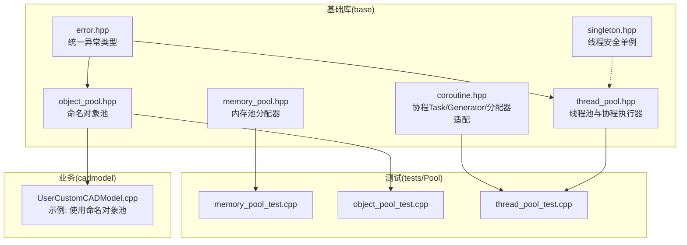
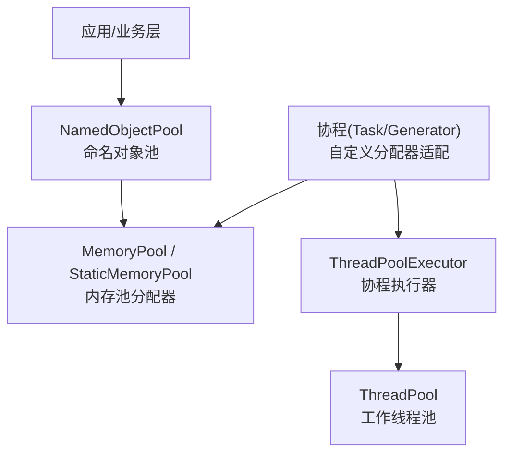
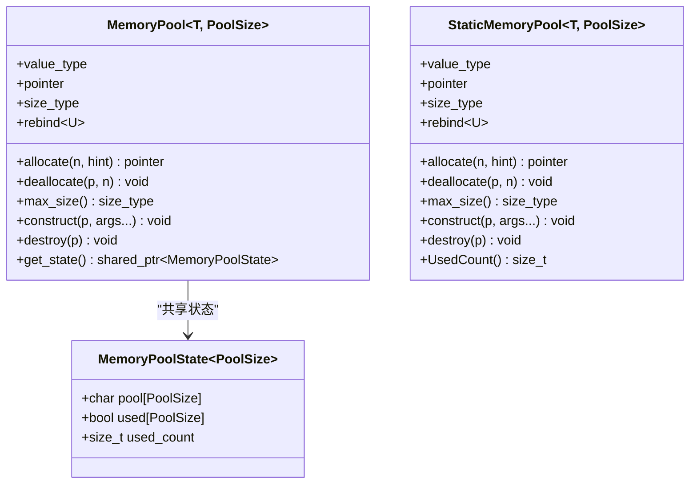
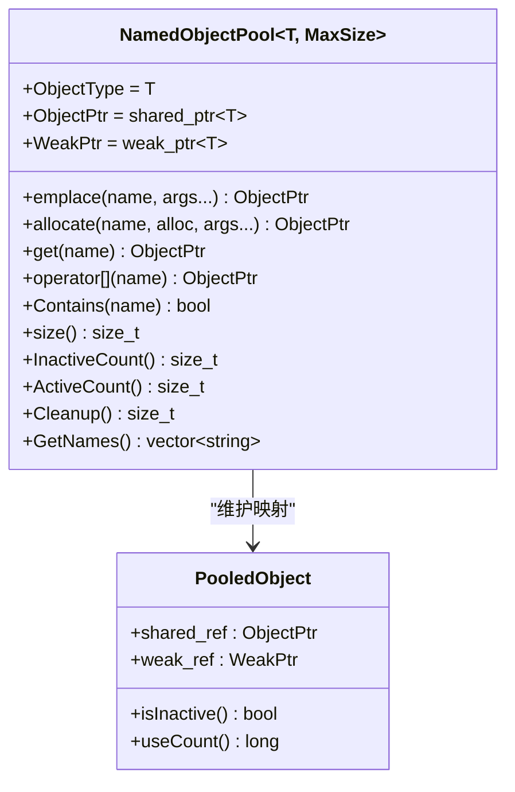
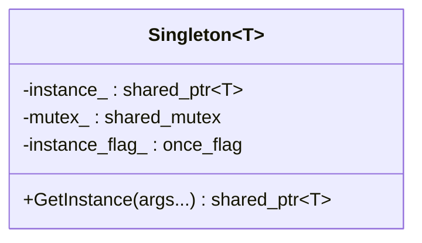
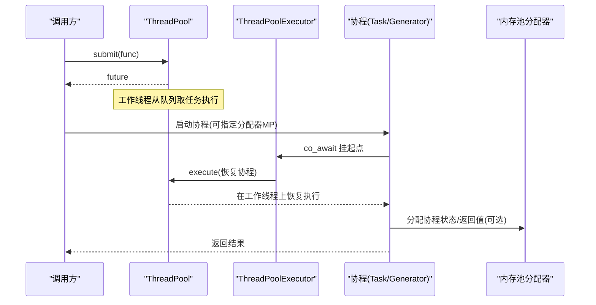
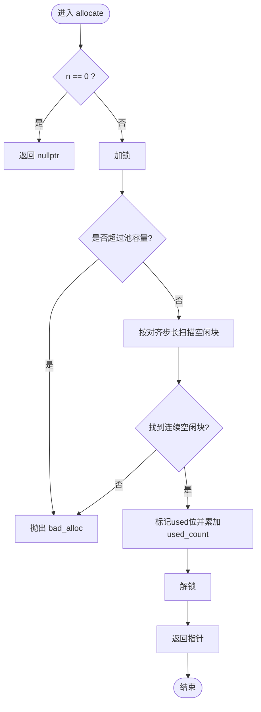
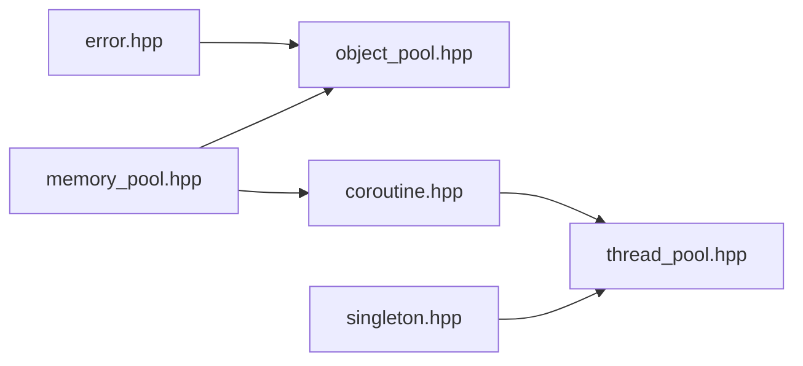

# 内存管理系统

<cite>
**本文引用的文件**   
- [memory_pool.hpp](file://base/memory_pool.hpp)
- [object_pool.hpp](file://base/object_pool.hpp)
- [singleton.hpp](file://base/singleton.hpp)
- [thread_pool.hpp](file://base/thread_pool.hpp)
- [coroutine.hpp](file://base/coroutine.hpp)
- [error.hpp](file://base/error.hpp)
- [memory_pool_test.cpp](file://tests/Pool/memory_pool_test.cpp)
- [object_pool_test.cpp](file://tests/Pool/object_pool_test.cpp)
- [thread_pool_test.cpp](file://tests/Pool/thread_pool_test.cpp)
- [UserCustomCADModel.cpp](file://cadmodel/UserCustomCADModel.cpp)
</cite>

## 目录
1. [简介](#简介)
2. [项目结构](#项目结构)
3. [核心组件](#核心组件)
4. [架构总览](#架构总览)
5. [详细组件分析](#详细组件分析)
6. [依赖关系分析](#依赖关系分析)
7. [性能考量](#性能考量)
8. [故障排查指南](#故障排查指南)
9. [结论](#结论)
10. [附录](#附录)

## 简介
本仓库的内存管理系统围绕“高效、可控、可复用”的目标，提供三类关键能力：
- 底层内存池分配器：MemoryPool 与 StaticMemoryPool，符合 STL Allocator 接口，支持线程安全分配与释放，适用于高频小对象分配场景。
- 命名对象池：NamedObjectPool，基于名称管理共享对象的生命周期，支持自动清理非活跃对象、容量限制与并发访问。
- 单例与线程池：Singleton 提供线程安全的单例模式；ThreadPool 提供任务队列与协程执行器集成，便于在多线程环境下使用自定义分配器进行异步计算。

该体系可与 C++20 协程结合，通过自定义分配器将协程状态与返回值分配到指定内存池，从而降低系统堆分配开销并提升局部性。

## 项目结构
内存管理相关代码集中在 base 目录，测试位于 tests/Pool，文档位于 docs/zh/base。实际业务中可在其他模块（如 cadmodel）引入 NamedObjectPool 进行资源管理。

图示来源
- [memory_pool.hpp:1-370](file://base/memory_pool.hpp#L1-L370)
- [object_pool.hpp:1-235](file://base/object_pool.hpp#L1-L235)
- [singleton.hpp:1-63](file://base/singleton.hpp#L1-L63)
- [thread_pool.hpp:1-214](file://base/thread_pool.hpp#L1-L214)
- [coroutine.hpp:1-200](file://base/coroutine.hpp#L1-L200)
- [error.hpp:1-147](file://base/error.hpp#L1-L147)
- [memory_pool_test.cpp:1-100](file://tests/Pool/memory_pool_test.cpp#L1-L100)
- [object_pool_test.cpp:1-162](file://tests/Pool/object_pool_test.cpp#L1-L162)
- [thread_pool_test.cpp:1-82](file://tests/Pool/thread_pool_test.cpp#L1-L82)
- [UserCustomCADModel.cpp:17-17](file://cadmodel/UserCustomCADModel.cpp#L17-L17)

章节来源
- [memory_pool.hpp:1-370](file://base/memory_pool.hpp#L1-L370)
- [object_pool.hpp:1-235](file://base/object_pool.hpp#L1-L235)
- [singleton.hpp:1-63](file://base/singleton.hpp#L1-L63)
- [thread_pool.hpp:1-214](file://base/thread_pool.hpp#L1-L214)
- [coroutine.hpp:1-200](file://base/coroutine.hpp#L1-L200)
- [error.hpp:1-147](file://base/error.hpp#L1-L147)
- [memory_pool_test.cpp:1-100](file://tests/Pool/memory_pool_test.cpp#L1-L100)
- [object_pool_test.cpp:1-162](file://tests/Pool/object_pool_test.cpp#L1-L162)
- [thread_pool_test.cpp:1-82](file://tests/Pool/thread_pool_test.cpp#L1-L82)
- [UserCustomCADModel.cpp:17-17](file://cadmodel/UserCustomCADModel.cpp#L17-L17)

## 核心组件
- 内存池分配器
  - MemoryPool：基于 shared_ptr 共享状态的固定大小内存池，线程安全，支持任意类型分配，符合 STL Allocator 接口。
  - StaticMemoryPool：全局静态内存池，所有实例共享同一块内存区域，零实例开销，所有实例被视为相等，同样符合 STL Allocator 接口。
- 命名对象池
  - NamedObjectPool：以名称为键管理 std::shared_ptr<T>，支持 emplace/allocate/get/Contains/Cleanup/GetNames 等，具备容量上限与自动清理非活跃对象的机制。
- 单例
  - Singleton：线程安全的单例模板，使用 call_once 保证唯一构造，返回 shared_ptr 管理生命周期。
- 线程池与协程
  - ThreadPool：工作线程池，提交任务返回 future，支持 WaitAll 等待完成。
  - ThreadPoolExecutor：协程执行器适配器，将 co_await 调度到线程池。
  - coroutine.hpp：提供 Task/Generator 及带自定义分配器的变体，使协程状态与返回值可分配到指定内存池。

章节来源
- [memory_pool.hpp:1-370](file://base/memory_pool.hpp#L1-L370)
- [object_pool.hpp:1-235](file://base/object_pool.hpp#L1-L235)
- [singleton.hpp:1-63](file://base/singleton.hpp#L1-L63)
- [thread_pool.hpp:1-214](file://base/thread_pool.hpp#L1-L214)
- [coroutine.hpp:1-200](file://base/coroutine.hpp#L1-L200)

## 架构总览
下图展示了内存管理与并发执行的协作方式：上层业务通过 NamedObjectPool 管理对象，对象内部或协程可通过自定义分配器将数据分配到 MemoryPool/StaticMemoryPool；协程由 ThreadPoolExecutor 调度到 ThreadPool 执行。

图示来源
- [object_pool.hpp:1-235](file://base/object_pool.hpp#L1-L235)
- [memory_pool.hpp:1-370](file://base/memory_pool.hpp#L1-L370)
- [coroutine.hpp:1-200](file://base/coroutine.hpp#L1-L200)
- [thread_pool.hpp:1-214](file://base/thread_pool.hpp#L1-L214)

## 详细组件分析

### 内存池分配器（MemoryPool 与 StaticMemoryPool）
- 设计要点
  - 固定大小池 + 字节级 used 标记 + 对齐保障，确保任何类型的构造与析构正确。
  - 线程安全：分配/释放路径加锁。
  - 容量检查：超出池容量抛出 bad_alloc。
  - STL 兼容：实现 rebind、construct/destroy、max_size 等必要接口。
- 复杂度与行为
  - allocate：线性扫描空闲块，时间复杂度 O(PoolSize/alignof(T))，空间 O(1)。
  - deallocate：按偏移定位并清零 used 位，时间复杂度 O(n*sizeof(T))。
  - max_size：O(1)。
- 适用场景
  - 高频小对象分配、容器元素分配、协程状态与返回值分配。

图示来源
- [memory_pool.hpp:28-203](file://base/memory_pool.hpp#L28-L203)
- [memory_pool.hpp:210-367](file://base/memory_pool.hpp#L210-L367)

章节来源
- [memory_pool.hpp:1-370](file://base/memory_pool.hpp#L1-L370)

### 命名对象池（NamedObjectPool）
- 设计要点
  - 以名称为键维护 PooledObject{shared_ptr, weak_ptr}，通过 use_count==1 判定非活跃。
  - 容量 MaxSize：达到上限时先尝试 CleanupInactiveObjects，仍满则抛错。
  - 并发控制：读写分离锁（shared_mutex），读操作共享锁，写操作独占锁。
  - 支持自定义分配器：allocate(name, alloc, args...) 使用外部分配器创建对象。
- 复杂度与行为
  - emplace/allocate：查找与插入 O(logN) 或平均 O(1)（unordered_map），必要时遍历清理。
  - get/Contains：O(1) 平均。
  - Cleanup：遍历清理非活跃项，最坏 O(N)。
- 典型用法
  - 资源集中管理、缓存、插件/动态库句柄池等。

图示来源
- [object_pool.hpp:22-232](file://base/object_pool.hpp#L22-L232)

章节来源
- [object_pool.hpp:1-235](file://base/object_pool.hpp#L1-L235)

### 单例（Singleton）
- 设计要点
  - 使用 call_once 保证首次构造仅一次，返回 shared_ptr 管理生命周期。
  - 构造函数受保护，需友元访问权限。
- 适用场景
  - 全局配置、日志、资源管理器、线程池默认实例等。

图示来源
- [singleton.hpp:21-61](file://base/singleton.hpp#L21-L61)

章节来源
- [singleton.hpp:1-63](file://base/singleton.hpp#L1-L63)

### 线程池与协程执行器（ThreadPool 与 ThreadPoolExecutor）
- 设计要点
  - ThreadPool：维护任务队列与工作线程，submit 返回 future，WaitAll 阻塞直到无待处理且无活跃任务。
  - ThreadPoolExecutor：实现 IExecutor 接口，将协程恢复调度到线程池；支持设置默认池。
- 复杂度与行为
  - submit：入队 O(1)，唤醒一个工作线程。
  - WorkerLoop：条件变量等待，任务执行后更新活跃计数并通知完成条件。
- 与协程集成
  - 通过 CustomAllocatorTask/Generator 可将协程状态与返回值分配到指定内存池，减少系统分配。

图示来源
- [thread_pool.hpp:29-162](file://base/thread_pool.hpp#L29-L162)
- [thread_pool.hpp:168-207](file://base/thread_pool.hpp#L168-L207)
- [coroutine.hpp:118-174](file://base/coroutine.hpp#L118-L174)

章节来源
- [thread_pool.hpp:1-214](file://base/thread_pool.hpp#L1-L214)
- [coroutine.hpp:1-200](file://base/coroutine.hpp#L1-L200)

### 分配流程与错误处理（流程图）

图示来源
- [memory_pool.hpp:111-142](file://base/memory_pool.hpp#L111-L142)
- [memory_pool.hpp:261-291](file://base/memory_pool.hpp#L261-L291)

章节来源
- [memory_pool.hpp:1-370](file://base/memory_pool.hpp#L1-L370)

## 依赖关系分析
- 组件耦合
  - NamedObjectPool 依赖 error.hpp 中的异常类型用于容量与重复名错误。
  - ThreadPool 依赖 coroutine.hpp 的 IExecutor 接口（在启用协程宏时）。
  - 协程 Task/Generator 可接受自定义分配器，配合 MemoryPool/StaticMemoryPool 使用。
- 外部依赖
  - 标准库：std::mutex、std::shared_mutex、std::future、std::thread、std::unordered_map 等。
  - C++20 协程（可选）：coroutine/generator。

图示来源
- [error.hpp:1-147](file://base/error.hpp#L1-L147)
- [object_pool.hpp:1-235](file://base/object_pool.hpp#L1-L235)
- [coroutine.hpp:1-200](file://base/coroutine.hpp#L1-L200)
- [thread_pool.hpp:1-214](file://base/thread_pool.hpp#L1-L214)
- [memory_pool.hpp:1-370](file://base/memory_pool.hpp#L1-L370)
- [singleton.hpp:1-63](file://base/singleton.hpp#L1-L63)

章节来源
- [error.hpp:1-147](file://base/error.hpp#L1-L147)
- [object_pool.hpp:1-235](file://base/object_pool.hpp#L1-L235)
- [coroutine.hpp:1-200](file://base/coroutine.hpp#L1-L200)
- [thread_pool.hpp:1-214](file://base/thread_pool.hpp#L1-L214)
- [memory_pool.hpp:1-370](file://base/memory_pool.hpp#L1-L370)
- [singleton.hpp:1-63](file://base/singleton.hpp#L1-L63)

## 性能考量
- 分配器选择
  - 高频同构小对象优先使用 StaticMemoryPool（零实例开销、全局共享）。
  - 需要多实例隔离或跨作用域共享时使用 MemoryPool。
- 容器适配
  - 将容器与内存池分配器绑定，可减少系统堆分配次数，提高缓存局部性。
- 线程安全成本
  - 分配/释放路径加锁，高并发下存在竞争；建议按热点类型划分多个池以降低锁粒度。
- 碎片化
  - 采用首次适配策略，可能产生碎片；对严格实时场景可考虑更复杂的空闲链表或分块策略。
- 协程优化
  - 使用 CustomAllocatorTask/Generator 将协程状态与返回值分配到内存池，避免额外堆分配。

## 故障排查指南
- 常见问题
  - 分配失败：当请求大小或累计占用超过池容量时，allocate 会抛出 bad_alloc。检查 PoolSize 与对象数量。
  - 非法指针释放：deallocate 校验指针是否在池范围内，越界将抛出 invalid_argument。确认指针来源与生命周期。
  - 对象池已满：NamedObjectPool 在达到 MaxSize 且无可清理的非活跃对象时会抛出 RuntimeError。增加 MaxSize 或主动调用 Cleanup。
  - 重复名称：emplace/allocate 同名对象会抛出 InvalidArgumentError。确保名称唯一。
  - 线程池停止后提交任务：ThreadPool 在 stop 状态下提交任务会抛出 RuntimeError。确保线程池未销毁。
- 诊断手段
  - 使用 StaticMemoryPool::UsedCount 监控已用字节数。
  - 使用 NamedObjectPool::ActiveCount/InactiveCount 观察对象活跃度。
  - 使用 ThreadPool::PendingTasks/ActiveTasks 观察任务负载。

章节来源
- [memory_pool.hpp:111-175](file://base/memory_pool.hpp#L111-L175)
- [memory_pool.hpp:261-319](file://base/memory_pool.hpp#L261-L319)
- [object_pool.hpp:65-122](file://base/object_pool.hpp#L65-L122)
- [object_pool.hpp:190-228](file://base/object_pool.hpp#L190-L228)
- [thread_pool.hpp:67-90](file://base/thread_pool.hpp#L67-L90)
- [error.hpp:1-147](file://base/error.hpp#L1-L147)

## 结论
本内存管理系统通过“内存池分配器 + 命名对象池 + 线程池/协程”的组合，提供了从底层到高层的完整内存与并发管理能力。其优势在于：
- 确定性内存分配与低延迟：固定池分配避免系统堆抖动。
- 对象生命周期集中管理：命名对象池简化资源回收与容量控制。
- 与协程无缝集成：自定义分配器让协程也受益于池化内存。
建议在热点路径与高频小对象场景中优先采用该方案，并结合单元测试与性能基准持续验证。

## 附录
- 使用示例与参考
  - 内存池与智能指针、STL 容器、协程的集成见测试用例。
  - 命名对象池在业务中的使用见 cadmodel 模块。

章节来源
- [memory_pool_test.cpp:1-100](file://tests/Pool/memory_pool_test.cpp#L1-L100)
- [object_pool_test.cpp:1-162](file://tests/Pool/object_pool_test.cpp#L1-L162)
- [thread_pool_test.cpp:1-82](file://tests/Pool/thread_pool_test.cpp#L1-L82)
- [UserCustomCADModel.cpp:17-17](file://cadmodel/UserCustomCADModel.cpp#L17-L17)