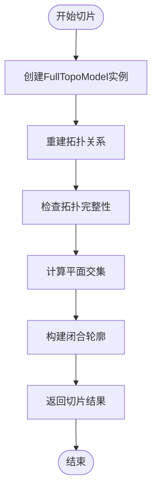
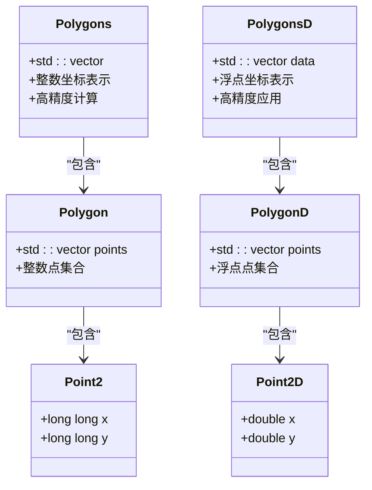
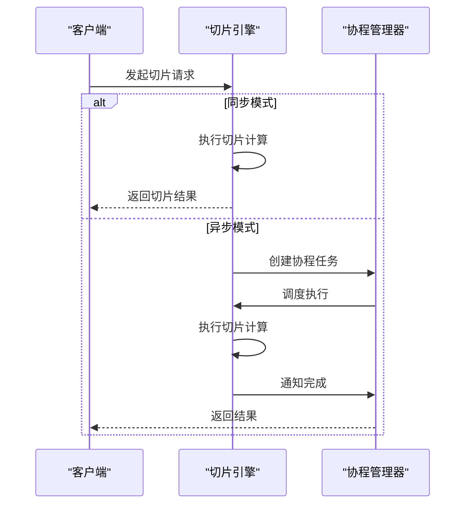
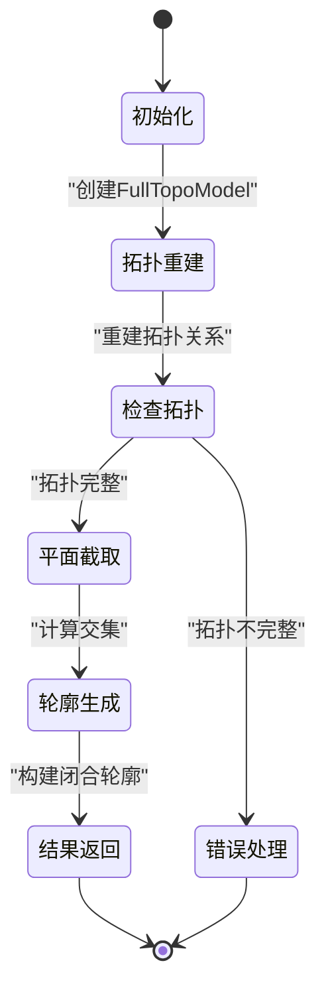

# 切片引擎

<cite>
**本文档引用的文件**   
- [mesh_slice.hpp](file://LibHsBaSlicer/Slice/mesh_slice.hpp)
- [mesh_slice.cpp](file://LibHsBaSlicer/Slice/mesh_slice.cpp)
- [FullTopoModel.hpp](file://meshmodel/FullTopoModel.hpp)
- [FullTopoModel.cpp](file://meshmodel/FullTopoModel.cpp)
- [CgalModel.hpp](file://meshmodel/CgalModel.hpp)
- [CgalModel.cpp](file://meshmodel/CgalModel.cpp)
- [IntPolygon.hpp](file://2D/IntPolygon.hpp)
- [FloatPolygons.hpp](file://2D/FloatPolygons.hpp)
- [coroutine.hpp](file://base/coroutine.hpp)
- [error.hpp](file://base/error.hpp)
</cite>

## 更新摘要
**所做更改**   
- 更新了FullTopoModel切片方法的精度控制机制说明
- 新增tolerance参数的详细技术实现分析
- 更新了输入参数对切片精度的影响章节
- 增强了性能优化建议中的精度配置指导
- 添加了数值稳定性相关的最佳实践

## 目录
1. [引言](#引言)
2. [项目结构](#项目结构)
3. [核心组件](#核心组件)
4. [切片算法原理](#切片算法原理)
5. [输入参数对切片的影响](#输入参数对切片的影响)
6. [切片结果数据结构](#切片结果数据结构)
7. [精度控制与数值稳定性](#精度控制与数值稳定性)
8. [性能优化建议](#性能优化建议)
9. [同步与异步调用模式](#同步与异步调用模式)
10. [错误传播机制](#错误传播机制)
11. [切片流程状态机](#切片流程状态机)
12. [内存使用模式分析](#内存使用模式分析)
13. [上层应用集成示例](#上层应用集成示例)
14. [结论](#结论)

## 引言
切片引擎是3D打印和增材制造系统中的核心组件，负责将三维模型分解为一系列二维截面轮廓。本文档全面解析`mesh_slice`模块的工作机制，阐述其基于平面截取算法的分层切片原理。文档详细说明输入参数对输出多边形的影响，解释内部如何调用`CgalModel`进行几何交集计算并生成闭合轮廓，描述切片结果的数据结构及其拓扑属性维护方式。同时提供性能优化建议，结合实际代码展示同步与异步切片调用模式，并说明错误传播机制。

**更新** 新增了关于精度控制和数值稳定性的深入分析，特别是可配置的tolerance参数对切片质量的影响。

## 项目结构
切片引擎模块位于`LibHsBaSlicer/Slice/`目录下，主要由`mesh_slice.hpp`和`mesh_slice.cpp`两个文件构成。该模块依赖于`meshmodel`目录下的`CgalModel`和`FullTopoModel`类进行几何计算和拓扑重建，同时利用`2D`目录下的`FloatPolygons`和`IntPolygon`进行二维多边形操作。整个项目采用CMake构建系统，支持跨平台编译。

**Section sources**
- [mesh_slice.hpp](file://LibHsBaSlicer/Slice/mesh_slice.hpp)
- [mesh_slice.cpp](file://LibHsBaSlicer/Slice/mesh_slice.cpp)

## 核心组件
切片引擎的核心组件包括`mesh_slice`模块、`FullTopoModel`类和`CgalModel`类。`mesh_slice`模块提供高层切片接口，`FullTopoModel`负责拓扑关系的重建和管理，而`CgalModel`则基于CGAL库实现精确的几何计算。这些组件协同工作，确保切片过程的准确性和高效性。

**Section sources**
- [mesh_slice.hpp](file://LibHsBaSlicer/Slice/mesh_slice.hpp)
- [FullTopoModel.hpp](file://meshmodel/FullTopoModel.hpp)
- [CgalModel.hpp](file://meshmodel/CgalModel.hpp)

## 切片算法原理
切片算法基于平面截取原理，通过在指定高度上与三维模型进行交集计算来生成二维轮廓。算法首先将输入模型转换为`FullTopoModel`，重建完整的拓扑关系，然后在Z方向上进行平面截取。



**Diagram sources**
- [FullTopoModel.cpp:256-342](file://meshmodel/FullTopoModel.cpp#L256-L342)
- [mesh_slice.cpp:5-9](file://LibHsBaSlicer/Slice/mesh_slice.cpp#L5-L9)

## 输入参数对切片的影响
切片操作的主要输入参数包括切片高度、起始高度、法向量和精度容差。切片高度决定了截取平面的位置，直接影响生成的二维轮廓形状。起始高度用于确定切片的基准位置，而法向量则定义了截取平面的方向。**新增** tolerance参数用于控制几何计算的精度和数值稳定性，默认值为0.001。

**Section sources**
- [mesh_slice.hpp:10-13](file://LibHsBaSlicer/Slice/mesh_slice.hpp#L10-L13)
- [FullTopoModel.hpp:93-95](file://meshmodel/FullTopoModel.hpp#L93-L95)

## 切片结果数据结构
切片结果以`Polygons`和`PolygonsD`数据结构存储。`Polygons`使用整数坐标，适用于精确计算，而`PolygonsD`使用浮点坐标，适用于高精度应用。



**Diagram sources**
- [IntPolygon.hpp:12-14](file://2D/IntPolygon.hpp#L12-L14)
- [FloatPolygons.hpp:13-15](file://2D/FloatPolygons.hpp#L13-L15)

## 精度控制与数值稳定性

**新增章节** FullTopoModel的切片算法实现了可配置的精度控制机制，通过tolerance参数调节几何计算的数值稳定性。

### 精度控制机制
tolerance参数在切片过程中发挥关键作用，主要应用于以下几个方面：

1. **坐标舍入控制**：通过`integerization`缩放因子将浮点坐标转换为整数坐标，tolerance决定舍入精度
2. **点合并阈值**：使用网格哈希和并查集算法合并接近的点，coord_eps由tolerance计算得出
3. **数值稳定性**：防止浮点误差导致的拓扑连接错误

### 技术实现细节
```cpp
// 坐标转换和精度控制
const long long coord_eps = std::max(1LL, std::llround(tolerance * integerization));

auto is_same_point = [&](const Key& a, const Key& b) -> bool
{
    long long dx = a.first > b.first ? a.first - b.first : b.first - a.first;
    long long dy = a.second > b.second ? a.second - b.second : b.second - a.second;
    return dx <= coord_eps && dy <= coord_eps;
};
```

### 精度参数调优指南
- **高精度场景**（SLA光固化）：建议使用较小的tolerance值（如0.0001），以获得更精确的轮廓
- **通用场景**（FDM熔融沉积）：默认值0.001通常足够，平衡精度和性能
- **大尺度模型**：可适当增大tolerance值以提高数值稳定性
- **复杂曲面**：保持较小tolerance值以避免轮廓失真

**Section sources**
- [FullTopoModel.cpp:322-341](file://meshmodel/FullTopoModel.cpp#L322-L341)
- [FullTopoModel.cpp:598-617](file://meshmodel/FullTopoModel.cpp#L598-L617)

## 性能优化建议
为了平衡精度与计算开销，建议合理设置切片间隔和精度参数。过小的切片间隔会增加计算时间和内存消耗，而过大的切片间隔可能导致细节丢失。**新增** tolerance参数的选择对性能有显著影响：

- **精度与性能的权衡**：较大的tolerance值会减少点合并的计算量，提高性能但可能降低精度
- **内存使用优化**：合理的tolerance设置可以减少中间数据结构的规模
- **并行处理建议**：对于大规模模型，结合异步调用模式和适当的精度设置可获得最佳性能

**Section sources**
- [mesh_slice.hpp](file://LibHsBaSlicer/Slice/mesh_slice.hpp)
- [coroutine.hpp](file://base/coroutine.hpp)

## 同步与异步调用模式
切片引擎支持同步和异步两种调用模式。同步模式直接返回结果，适用于简单场景；异步模式通过协程实现，适用于需要并行处理多个切片任务的场景。



**Diagram sources**
- [coroutine.hpp](file://base/coroutine.hpp)
- [mesh_slice.cpp](file://LibHsBaSlicer/Slice/mesh_slice.cpp)

## 错误传播机制
切片引擎通过异常机制进行错误传播。当检测到无效模型状态或计算错误时，会抛出相应的异常，如`RuntimeError`或`InvalidArgumentError`，确保错误能够被上层应用及时捕获和处理。

**Section sources**
- [error.hpp](file://base/error.hpp)
- [FullTopoModel.cpp](file://meshmodel/FullTopoModel.cpp)

## 切片流程状态机
切片流程可以建模为一个状态机，包括初始化、拓扑重建、平面截取、轮廓生成和结果返回等状态。



**Diagram sources**
- [FullTopoModel.cpp](file://meshmodel/FullTopoModel.cpp)
- [mesh_slice.cpp](file://LibHsBaSlicer/Slice/mesh_slice.cpp)

## 内存使用模式分析
切片引擎在内存使用上采用分层管理策略。`CgalModel`负责底层几何数据的存储，`FullTopoModel`维护拓扑关系，而切片结果则以紧凑的整数坐标形式存储，有效控制内存消耗。**新增** 精度参数对内存使用也有影响：

- **坐标精度**：较高的精度要求会导致更大的坐标范围，增加内存占用
- **中间数据结构**：tolerance参数影响网格哈希表和并查集的大小
- **结果存储**：最终的多边形数据以整数坐标存储，有效减少内存消耗

**Section sources**
- [CgalModel.hpp](file://meshmodel/CgalModel.hpp)
- [FullTopoModel.hpp](file://meshmodel/FullTopoModel.hpp)

## 上层应用集成示例
上层应用可以通过简单的API调用来集成切片引擎，实现三维模型的分层切片。


**Diagram sources**
- [mesh_slice.hpp](file://LibHsBaSlicer/Slice/mesh_slice.hpp)
- [CgalModel.hpp](file://meshmodel/CgalModel.hpp)

## 结论
切片引擎通过`mesh_slice`模块、`FullTopoModel`和`CgalModel`的协同工作，实现了高效准确的三维模型分层切片。文档详细解析了切片算法原理、输入参数影响、数据结构设计、性能优化策略和错误处理机制，为上层应用的集成提供了全面的技术支持。**新增** 精度控制机制的引入进一步提升了切片算法的鲁棒性和适应性，使得用户可以根据具体应用场景灵活调整精度参数，在计算效率和结果质量之间找到最佳平衡点。