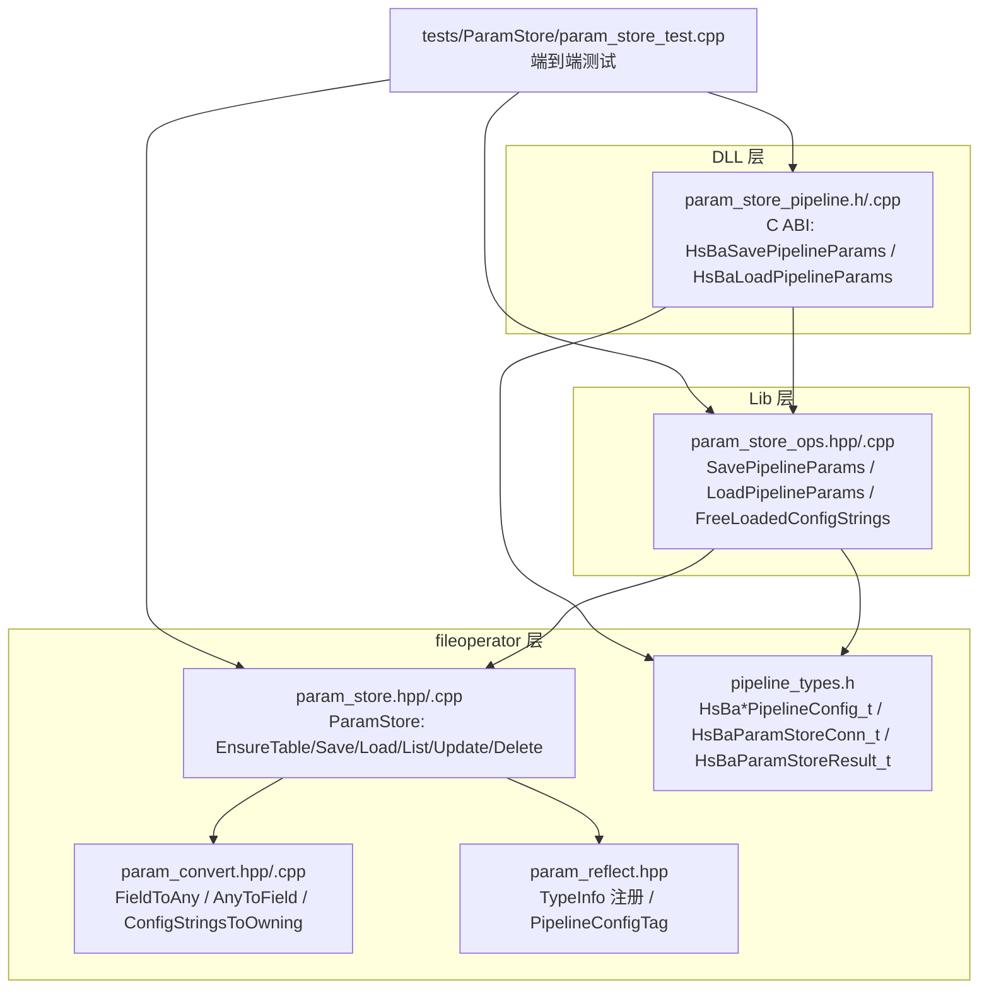
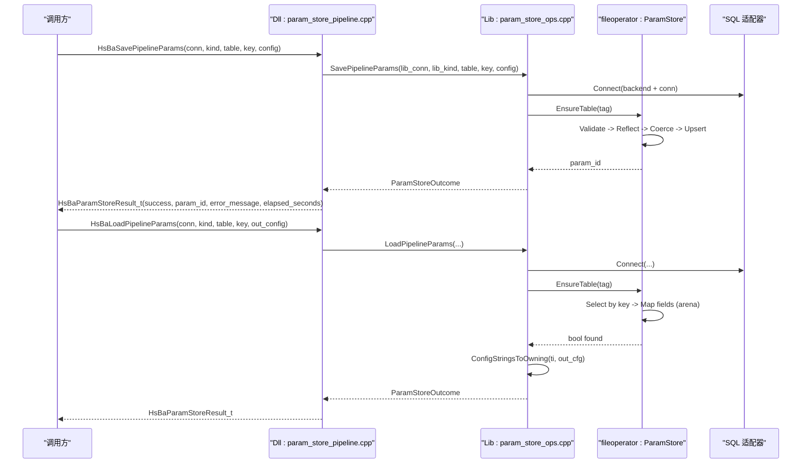
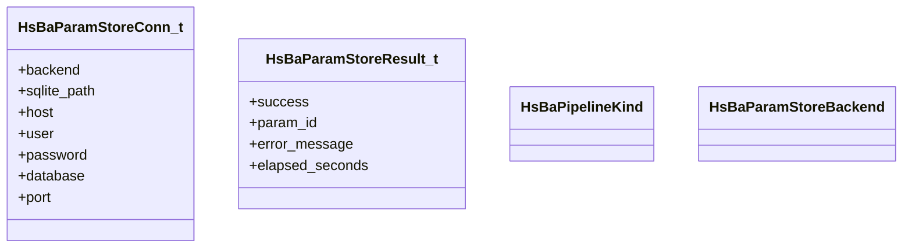
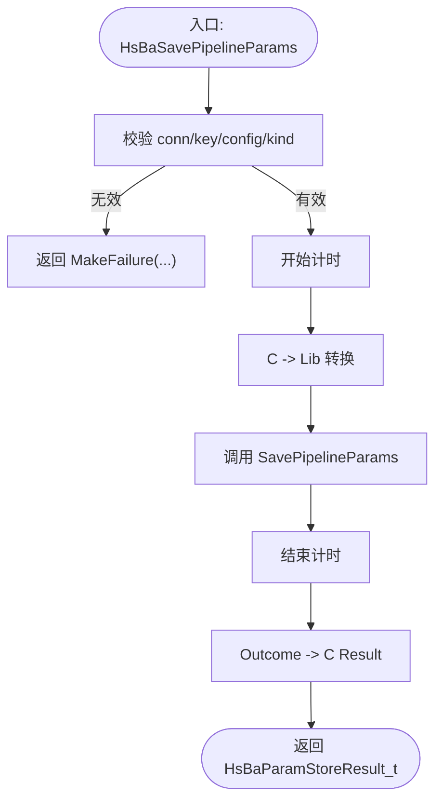
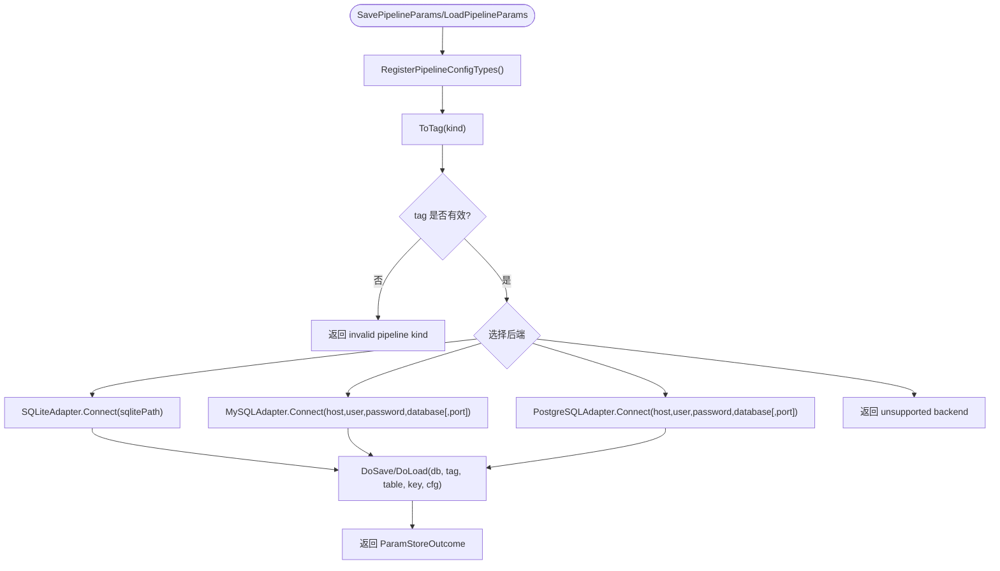
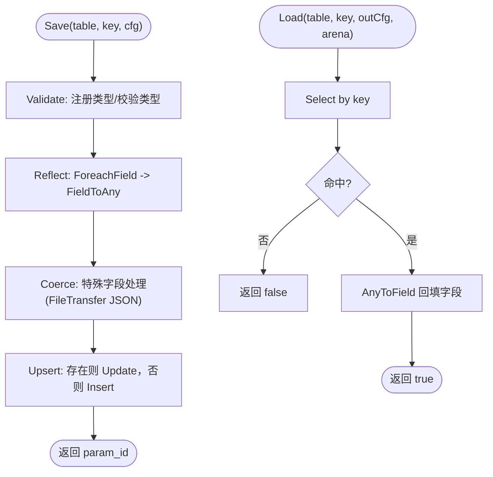
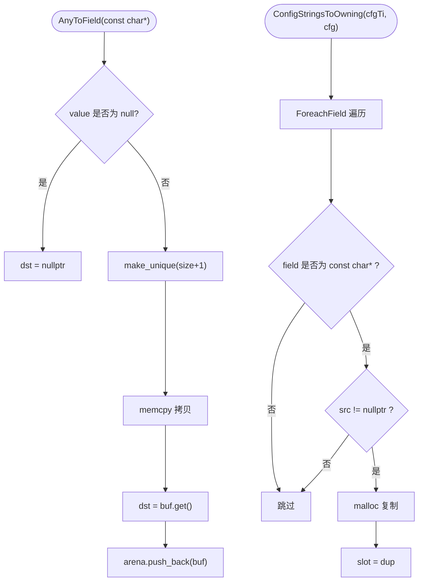
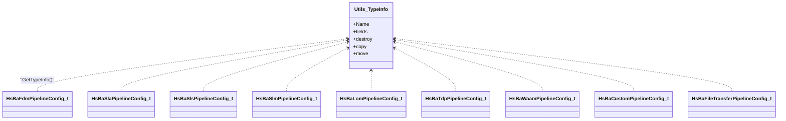
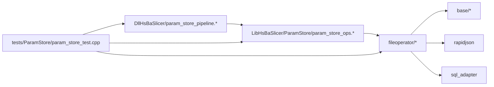

# 参数存储系统 ParamStore

<cite>
**本文引用的文件**   
- [pipeline_types.h](file://pipelinetypes/pipeline_types.h)
- [param_store_pipeline.h](file://DllHsBaSlicer\param_store_pipeline.h)
- [param_store_pipeline.cpp](file://DllHsBaSlicer\param_store_pipeline.cpp)
- [param_store_ops.hpp](file://LibHsBaSlicer\ParamStore\param_store_ops.hpp)
- [param_store_ops.cpp](file://LibHsBaSlicer\ParamStore\param_store_ops.cpp)
- [param_store.hpp](file://fileoperator\param_store.hpp)
- [param_store.cpp](file://fileoperator\param_store.cpp)
- [param_convert.hpp](file://fileoperator\param_convert.hpp)
- [param_convert.cpp](file://fileoperator\param_convert.cpp)
- [param_reflect.hpp](file://fileoperator\param_reflect.hpp)
- [param_store_test.cpp](file://tests\ParamStore\param_store_test.cpp)
</cite>

## 目录
1. [引言](#引言)
2. [项目结构](#项目结构)
3. [核心组件](#核心组件)
4. [架构总览](#架构总览)
5. [详细组件分析](#详细组件分析)
6. [依赖关系分析](#依赖关系分析)
7. [性能与可扩展性](#性能与可扩展性)
8. [故障排查指南](#故障排查指南)
9. [结论](#结论)
10. [附录：API 与使用要点](#附录api-与使用要点)

## 引言
ParamStore 是 HsBaSlicer 的“工艺参数写入/读取”子系统，负责把各流水线（FDM、SLA、SLS、SLM、LOM、TDP、WAAM、Custom、FileTransfer）的工艺参数持久化到数据库并复用。其设计遵循 Lib/Dll/Module 三层架构：
- Dll 层提供 C ABI 导出接口，供外部语言或跨模块调用；
- Lib 层封装 fileoperator 能力，暴露 C++ 友好 API；
- fileoperator 层实现反射、类型收敛、Schema、CRUD 与多后端适配。

本系统的核心目标是：以类型化的 C 结构体为输入输出，通过反射自动映射字段，统一 upsert 语义，支持 SQLite/MySQL/PostgreSQL 三后端，并在移动端仅启用 SQLite。

## 项目结构
ParamStore 相关代码分布在三个层次：
- pipelinetypes：C ABI 枚举与结构体定义；
- DllHsBaSlicer：C 导出函数实现；
- LibHsBaSlicer：Lib 层 Save/Load 封装；
- fileoperator：ParamStore 核心实现、类型收敛与反射注册；
- tests：覆盖反射完整性、往返一致性、SQLite CRUD、Lua 冒烟、批量事务、Lib/C 层端到端与后端守卫用例。

**图示来源**
- [param_store_pipeline.h:1-76](file://DllHsBaSlicer\param_store_pipeline.h#L1-L76)
- [param_store_pipeline.cpp:122-168](file://DllHsBaSlicer\param_store_pipeline.cpp#L122-L168)
- [param_store_ops.hpp:1-94](file://LibHsBaSlicer\ParamStore\param_store_ops.hpp#L1-L94)
- [param_store_ops.cpp:130-299](file://LibHsBaSlicer\ParamStore\param_store_ops.cpp#L130-L299)
- [param_store.hpp:1-109](file://fileoperator\param_store.hpp#L1-L109)
- [param_store.cpp:148-356](file://fileoperator\param_store.cpp#L148-L356)
- [param_convert.hpp:1-70](file://fileoperator\param_convert.hpp#L1-L70)
- [param_convert.cpp:54-221](file://fileoperator\param_convert.cpp#L54-L221)
- [param_reflect.hpp:378-419](file://fileoperator\param_reflect.hpp#L378-L419)
- [pipeline_types.h:1009-1048](file://pipelinetypes/pipeline_types.h#L1009-L1048)
- [param_store_test.cpp:356-447](file://tests\ParamStore\param_store_test.cpp#L356-L447)

**章节来源**
- [pipeline_types.h:1009-1048](file://pipelinetypes/pipeline_types.h#L1009-L1048)
- [param_store_pipeline.h:1-76](file://DllHsBaSlicer\param_store_pipeline.h#L1-L76)
- [param_store_ops.hpp:1-94](file://LibHsBaSlicer\ParamStore\param_store_ops.hpp#L1-L94)
- [param_store.hpp:1-109](file://fileoperator\param_store.hpp#L1-L109)

## 核心组件
- C ABI 类型与结果对象：
  - 流水线种类枚举 `HsBaPipelineKind`；
  - 后端枚举 `HsBaParamStoreBackend`；
  - 连接参数 `HsBaParamStoreConn_t`；
  - 保存/加载结果 `HsBaParamStoreResult_t`。
- Dll 层 C 导出：
  - `HsBaSavePipelineParams`：按 key upsert 一个 PipelineConfig；
  - `HsBaLoadPipelineParams`：按 key 回填到调用方提供的结构体；
  - `HsBaFreeLoadedPipelineConfig`：释放读取到的堆字符串；
  - `HsBaFreeParamStoreResult`：释放错误消息。
- Lib 层封装：
  - `SavePipelineParams` / `LoadPipelineParams`：选择后端、连接数据库、调用 ParamStore；
  - `FreeLoadedConfigStrings`：释放由库分配的 const char* 字段。
- fileoperator 核心：
  - `ParamStore`：EnsureTable/Save/Load/List/Update/Delete，带进度回调与迁移钩子；
  - `FieldToAny` / `AnyToField`：C 字段与 SQL 白名单类型的双向转换；
  - `ConfigStringsToOwning` / `FreeConfigStrings`：字符串所有权在 arena/malloc 之间转移与释放；
  - 反射注册：为每个 `HsBa*PipelineConfig_t` 生成 TypeInfo，驱动 ForeachField。

**章节来源**
- [pipeline_types.h:1009-1048](file://pipelinetypes/pipeline_types.h#L1009-L1048)
- [param_store_pipeline.h:17-69](file://DllHsBaSlicer\param_store_pipeline.h#L17-L69)
- [param_store_ops.hpp:24-89](file://LibHsBaSlicer\ParamStore\param_store_ops.hpp#L24-L89)
- [param_store.hpp:33-105](file://fileoperator\param_store.hpp#L33-L105)
- [param_convert.hpp:23-66](file://fileoperator\param_convert.hpp#L23-L66)

## 架构总览
ParamStore 的调用链从 C ABI 进入，经 Lib 层桥接到 fileoperator 的 ParamStore，最终落到具体 SQL 适配器。

**图示来源**
- [param_store_pipeline.cpp:124-152](file://DllHsBaSlicer\param_store_pipeline.cpp#L124-L152)
- [param_store_ops.cpp:130-208](file://LibHsBaSlicer\ParamStore\param_store_ops.cpp#L130-L208)
- [param_store_ops.cpp:210-288](file://LibHsBaSlicer\ParamStore\param_store_ops.cpp#L210-L288)
- [param_store.cpp:148-207](file://fileoperator\param_store.cpp#L148-L207)
- [param_store.cpp:251-275](file://fileoperator\param_store.cpp#L251-L275)

## 详细组件分析

### C ABI 类型与结果对象
- `HsBaPipelineKind`：与 `PipelineConfigTag` 顺序对齐，转换采用显式 switch，避免整型强转带来的脆弱性。
- `HsBaParamStoreBackend`：SQLite/MySQL/PostgreSQL；移动端仅 SQLite。
- `HsBaParamStoreConn_t`：POD 结构，SQLite 用 sqlite_path，MySQL/PGSQL 用 host/port/user/password/database。
- `HsBaParamStoreResult_t`：success/param_id/error_message/elapsed_seconds；error_message 由库 malloc，需通过 `HsBaFreeParamStoreResult` 释放。

**图示来源**
- [pipeline_types.h:1009-1048](file://pipelinetypes/pipeline_types.h#L1009-L1048)

**章节来源**
- [pipeline_types.h:1009-1048](file://pipelinetypes/pipeline_types.h#L1009-L1048)

### Dll 层 C 导出实现
- 参数校验：conn/key/config/kind 非空且 kind 有效；
- 计时：steady_clock 计算 elapsed_seconds；
- 转换：C enum -> Lib enum，C conn -> Lib conn；
- 错误处理：MakeFailure/ToCResult 将 Lib Outcome 转为 C Result，error_message 通过 DupToHeap 分配；
- 释放：HsBaFreeLoadedPipelineConfig 委托 Lib 层释放字符串；HsBaFreeParamStoreResult 释放 error_message。

**图示来源**
- [param_store_pipeline.cpp:124-137](file://DllHsBaSlicer\param_store_pipeline.cpp#L124-L137)
- [param_store_pipeline.cpp:154-168](file://DllHsBaSlicer\param_store_pipeline.cpp#L154-L168)

**章节来源**
- [param_store_pipeline.cpp:19-117](file://DllHsBaSlicer\param_store_pipeline.cpp#L19-L117)
- [param_store_pipeline.cpp:124-168](file://DllHsBaSlicer\param_store_pipeline.cpp#L124-L168)

### Lib 层封装与后端选择
- 后端分支：根据 `ParamBackend` 选择 SQLite/MySQL/PostgreSQL；未编译进的后端返回 BackendUnavailable；
- 连接管理：构造对应 Adapter 并 Connect；
- 业务逻辑：DoSave/DoLoad 内部创建 ParamStore，EnsureTable，执行 Save/Load；
- 字符串所有权：Load 后调用 ConfigStringsToOwning，将 arena 持有的字符串指针替换为 malloc 副本，以便跨 C ABI 安全释放。

**图示来源**
- [param_store_ops.cpp:130-208](file://LibHsBaSlicer\ParamStore\param_store_ops.cpp#L130-L208)
- [param_store_ops.cpp:210-288](file://LibHsBaSlicer\ParamStore\param_store_ops.cpp#L210-L288)

**章节来源**
- [param_store_ops.cpp:16-127](file://LibHsBaSlicer\ParamStore\param_store_ops.cpp#L16-L127)
- [param_store_ops.cpp:130-299](file://LibHsBaSlicer\ParamStore\param_store_ops.cpp#L130-L299)

### fileoperator 核心：ParamStore
- EnsureSchema/EnsureTable：按 tag 注册 TypeInfo，检查表是否存在，不存在则创建；
- Save：Validate -> Reflect -> Coerce -> Upsert；对 FileTransfer 额外序列化 file_paths 为 JSON TEXT；
- Load：Select by key，AnyToField 回填到目标结构体，使用 StringArena 持有 const char*；
- List/Update/Delete：基于 whereJson 查询键列表、选择性更新字段、删除行；
- 批处理：SaveBatch 包裹事务，失败回滚；
- 错误传播：Guard 记录 last_error_ 并重新抛出异常，确保错误不被吞掉。

**图示来源**
- [param_store.cpp:148-207](file://fileoperator\param_store.cpp#L148-L207)
- [param_store.cpp:251-275](file://fileoperator\param_store.cpp#L251-L275)

**章节来源**
- [param_store.hpp:33-105](file://fileoperator\param_store.hpp#L33-L105)
- [param_store.cpp:104-146](file://fileoperator\param_store.cpp#L104-L146)
- [param_store.cpp:148-356](file://fileoperator\param_store.cpp#L148-L356)

### 类型收敛与字符串所有权
- FieldToAny：float/double/int/int64/std::string/const char*/enum -> std::any；
- AnyToField：std::any -> 目标字段；const char* 使用 arena 持有 new[] 副本；
- ConfigStringsToOwning：遍历 const char* 字段，malloc 复制并替换指针；
- FreeConfigStrings：free 所有 const char* 并置 NULL。

**图示来源**
- [param_convert.cpp:80-179](file://fileoperator\param_convert.cpp#L80-L179)
- [param_convert.cpp:181-218](file://fileoperator\param_convert.cpp#L181-L218)

**章节来源**
- [param_convert.hpp:23-66](file://fileoperator\param_convert.hpp#L23-L66)
- [param_convert.cpp:54-221](file://fileoperator\param_convert.cpp#L54-L221)

### 反射注册与表名推导
- 为每个 `HsBa*PipelineConfig_t` 生成 TypeInfo，字段通过宏 HSBA_PARAM_FIELD 注册；
- DefaultTableName 派生默认表名（如 hsba_param_fdm）；
- FileTransfer 的 file_paths 不注册为普通字段，而是作为 JSON TEXT 列单独处理。

**图示来源**
- [param_reflect.hpp:55-105](file://fileoperator\param_reflect.hpp#L55-L105)
- [param_reflect.hpp:110-155](file://fileoperator\param_reflect.hpp#L110-L155)
- [param_reflect.hpp:160-185](file://fileoperator\param_reflect.hpp#L160-L185)
- [param_reflect.hpp:190-218](file://fileoperator\param_reflect.hpp#L190-L218)
- [param_reflect.hpp:223-251](file://fileoperator\param_reflect.hpp#L223-L251)
- [param_reflect.hpp:256-283](file://fileoperator\param_reflect.hpp#L256-L283)
- [param_reflect.hpp:288-321](file://fileoperator\param_reflect.hpp#L288-L321)
- [param_reflect.hpp:326-346](file://fileoperator\param_reflect.hpp#L326-L346)
- [param_reflect.hpp:354-371](file://fileoperator\param_reflect.hpp#L354-L371)

**章节来源**
- [param_reflect.hpp:1-15](file://fileoperator\param_reflect.hpp#L1-L15)
- [param_reflect.hpp:378-419](file://fileoperator\param_reflect.hpp#L378-L419)

## 依赖关系分析
- Dll 层仅依赖 Lib 层与 C ABI 类型头，不直接引用 fileoperator；
- Lib 层依赖 fileoperator 的 ParamStore、Convert、Reflect、SqlAdapter；
- fileoperator 层依赖 base/any_object、rapidjson、sql_adapter；
- 测试覆盖 Dll/Lib/fileoperator 三层，验证反射完整性、往返一致性、SQLite CRUD、Lua 冒烟、批量事务、后端守卫。

**图示来源**
- [param_store_pipeline.cpp:12](file://DllHsBaSlicer\param_store_pipeline.cpp#L12)
- [param_store_ops.cpp:6-10](file://LibHsBaSlicer\ParamStore\param_store_ops.cpp#L6-L10)
- [param_store.cpp:11-13](file://fileoperator\param_store.cpp#L11-L13)
- [param_store_test.cpp:18-25](file://tests\ParamStore\param_store_test.cpp#L18-L25)

**章节来源**
- [param_store_pipeline.cpp:1-168](file://DllHsBaSlicer\param_store_pipeline.cpp#L1-L168)
- [param_store_ops.cpp:1-299](file://LibHsBaSlicer\ParamStore\param_store_ops.cpp#L1-L299)
- [param_store.cpp:1-356](file://fileoperator\param_store.cpp#L1-L356)
- [param_store_test.cpp:1-579](file://tests\ParamStore\param_store_test.cpp#L1-L579)

## 性能与可扩展性
- 批处理事务：SaveBatch 使用 BEGIN/COMMIT/ROLLBACK，提升批量写入吞吐；
- 表名推导：DefaultTableName 减少手工维护成本；
- 扩展新流水线：新增 `HsBaXxxPipelineConfig_t` 并在 param_reflect.hpp 中注册 TypeInfo，无需手写 CRUD；
- 后端扩展：新增 SQL 适配器并在 Lib 层分支中添加连接逻辑；
- 移动端限制：仅启用 SQLite，避免引入重型后端依赖。

[本节为通用指导，不直接分析具体文件]

## 故障排查指南
- 常见错误：
  - 未注册流水线类型：Lib 层返回 invalid pipeline kind；
  - 后端未编译：返回 BackendUnavailable；
  - 连接失败：Connect 抛异常被捕获，error 填充；
  - 未命中 key：Load 返回 success=false，error 包含 not found；
  - 内存泄漏：未调用 HsBaFreeLoadedPipelineConfig/HsBaFreeParamStoreResult。
- 调试建议：
  - 检查 Kind/Backend 枚举值是否与 C ABI 一致；
  - 确认 table/key 非空且业务唯一；
  - 查看 LastError/Outcome.error 获取底层异常信息；
  - 使用测试用例模板快速复现问题。

**章节来源**
- [param_store_ops.cpp:120-127](file://LibHsBaSlicer\ParamStore\param_store_ops.cpp#L120-L127)
- [param_store_ops.cpp:130-208](file://LibHsBaSlicer\ParamStore\param_store_ops.cpp#L130-L208)
- [param_store_pipeline.cpp:92-117](file://DllHsBaSlicer\param_store_pipeline.cpp#L92-L117)
- [param_store_test.cpp:398-447](file://tests\ParamStore\param_store_test.cpp#L398-L447)

## 结论
ParamStore 通过反射与类型收敛，将 C 结构体与数据库宽表无缝对接，实现了统一的 upsert 语义与多后端支持。Dll/Lib/fileoperator 三层架构清晰，C ABI 所有权明确，测试覆盖全面，便于扩展新的流水线与后端。

[本节为总结性内容，不直接分析具体文件]

## 附录：API 与使用要点
- C ABI：
  - HsBaSavePipelineParams：保存/更新；
  - HsBaLoadPipelineParams：读取并回填；
  - HsBaFreeLoadedPipelineConfig：释放读取到的字符串；
  - HsBaFreeParamStoreResult：释放结果中的错误消息。
- Lib API：
  - SavePipelineParams/LoadPipelineParams：选择后端、连接、执行；
  - FreeLoadedConfigStrings：释放库分配的 const char*。
- 使用要点：
  - 初始化结构体时使用 *ConfigDefault；
  - 读取后必须释放字符串；
  - 表名为空时自动派生；
  - MySQL/PGSQL 需要编译宏与环境变量配合测试。

**章节来源**
- [param_store_pipeline.h:17-69](file://DllHsBaSlicer\param_store_pipeline.h#L17-L69)
- [param_store_ops.hpp:66-89](file://LibHsBaSlicer\ParamStore\param_store_ops.hpp#L66-L89)
- [param_store_test.cpp:356-447](file://tests\ParamStore\param_store_test.cpp#L356-L447)