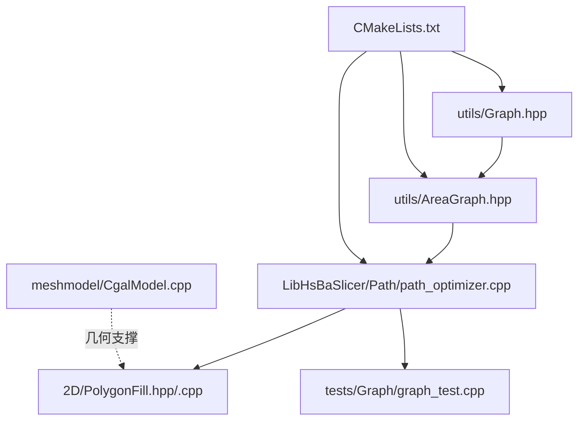
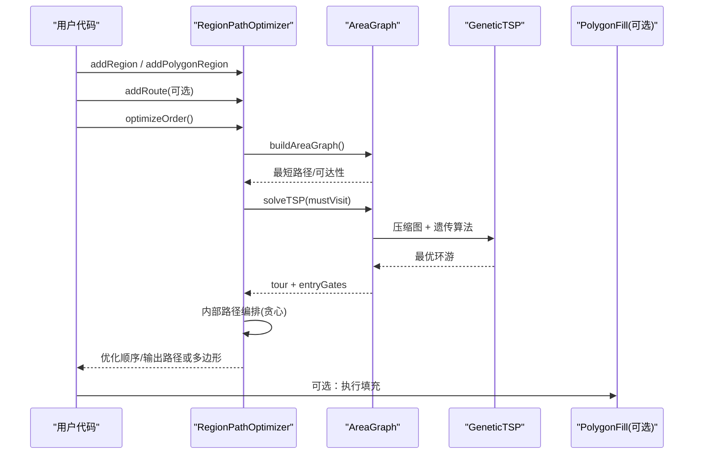
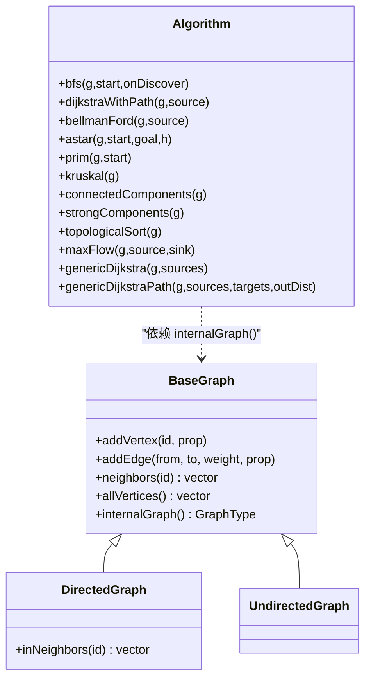
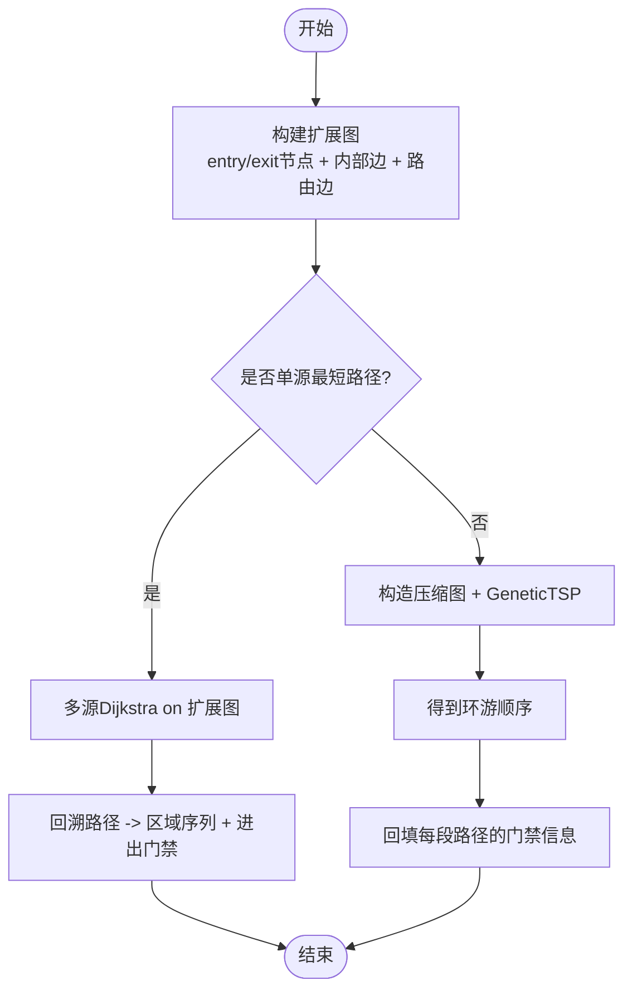
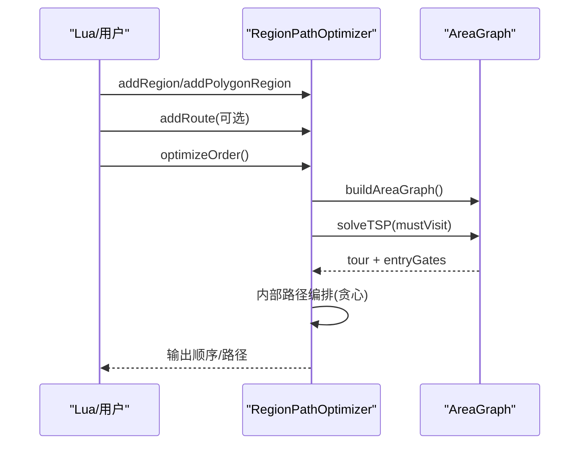
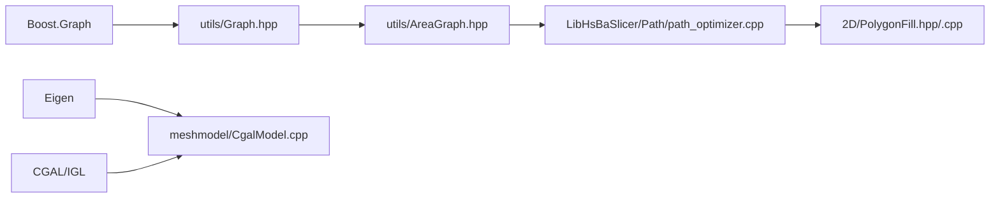

# 图论工具库

<cite>
**本文引用的文件**
- [utils/Graph.hpp](file://utils/Graph.hpp)
- [utils/AreaGraph.hpp](file://utils/AreaGraph.hpp)
- [LibHsBaSlicer/Path/path_optimizer.cpp](file://LibHsBaSlicer/Path/path_optimizer.cpp)
- [2D/PolygonFill.hpp](file://2D/PolygonFill.hpp)
- [2D/PolygonFill.cpp](file://2D/PolygonFill.cpp)
- [meshmodel/CgalModel.cpp](file://meshmodel/CgalModel.cpp)
- [tests/Graph/graph_test.cpp](file://tests/Graph/graph_test.cpp)
- [CMakeLists.txt](file://CMakeLists.txt)
- [README.md](file://README.md)
</cite>

## 目录
1. [简介](#简介)
2. [项目结构](#项目结构)
3. [核心组件](#核心组件)
4. [架构总览](#架构总览)
5. [详细组件分析](#详细组件分析)
6. [依赖关系分析](#依赖关系分析)
7. [性能考量](#性能考量)
8. [故障排查指南](#故障排查指南)
9. [结论](#结论)
10. [附录](#附录)

## 简介
本仓库提供一套面向三维切片与路径规划的图论工具库，围绕“通用图抽象 + 区域图建模 + 路径优化”的主线，封装了最短路径、最小生成树、连通分量、拓扑排序、最大流、TSP（遗传算法）等常用图算法，并在此基础上实现了面向多边形区域的访问顺序优化。该工具库以 C++20 实现，基于 Boost.Graph 构建底层数据结构，对外暴露简洁的模板化接口，便于在切片流水线中复用。

## 项目结构
- utils：图论核心（Graph.hpp 提供基础图与算法；AreaGraph.hpp 提供区域图建模）
- LibHsBaSlicer/Path：路径优化器（将区域建模为 AreaGraph，使用 TSP 求解访问顺序）
- 2D：多边形填充与偏移（PolygonFill），与路径优化配合形成“先优化后填充”或“先填充后优化”的工作流
- meshmodel：网格模型与几何处理（CGAL/IGL），用于体积、三角化、表面测地线等
- tests：覆盖图算法与区域优化的单元测试
- 顶层 CMake 与 README：构建配置、安装导出与模块说明

图表来源
- [utils/Graph.hpp:1-120](file://utils/Graph.hpp#L1-L120)
- [utils/AreaGraph.hpp:1-120](file://utils/AreaGraph.hpp#L1-L120)
- [LibHsBaSlicer/Path/path_optimizer.cpp:1-120](file://LibHsBaSlicer/Path/path_optimizer.cpp#L1-L120)
- [CMakeLists.txt:373-403](file://CMakeLists.txt#L373-L403)

章节来源
- [CMakeLists.txt:373-403](file://CMakeLists.txt#L373-L403)
- [README.md:25-39](file://README.md#L25-L39)

## 核心组件
- 通用图抽象与算法（Graph.hpp）
  - 有向/无向图模板类，支持顶点属性、边属性、顶点描述
  - 算法：BFS/DFS、Dijkstra（算术权重）、Bellman-Ford、A*、Prim/Kruskal、连通分量、强连通分量、拓扑排序、最大流（Boykov-Kolmogorov）、通用多源 Dijkstra（TSPWeight）
- 区域图建模（AreaGraph.hpp）
  - 将“区域 + 门禁”抽象为可扩展图，支持区域内门到门的内部代价、区域间路由代价
  - 提供最短路径与 TSP 求解（压缩图为 DirectedGraph + GeneticTSP）
- 路径优化器（path_optimizer.cpp）
  - 两种模式：多边形模式（填充前）与填充结果模式（填充后）
  - 自动计算区域间空走代价（点距），支持手动覆盖
  - 输出优化后的区域访问顺序与内部路径编排

章节来源
- [utils/Graph.hpp:138-380](file://utils/Graph.hpp#L138-L380)
- [utils/Graph.hpp:384-800](file://utils/Graph.hpp#L384-L800)
- [utils/AreaGraph.hpp:28-162](file://utils/AreaGraph.hpp#L28-L162)
- [utils/AreaGraph.hpp:164-308](file://utils/AreaGraph.hpp#L164-L308)
- [LibHsBaSlicer/Path/path_optimizer.cpp:32-162](file://LibHsBaSlicer/Path/path_optimizer.cpp#L32-L162)

## 架构总览
整体流程：
- 业务侧准备区域数据（多边形或填充路径）
- 通过 RegionPathOptimizer 构建 AreaGraph，设置区域内/间代价
- 调用 optimizeOrder() 执行 TSP 求解访问顺序
- 根据模式输出优化后的多边形集合或完整填充路径
- 可选：结合 PolygonFill 进行填充，或在填充后对路径进行重排

图表来源
- [LibHsBaSlicer/Path/path_optimizer.cpp:113-162](file://LibHsBaSlicer/Path/path_optimizer.cpp#L113-L162)
- [utils/AreaGraph.hpp:231-308](file://utils/AreaGraph.hpp#L231-L308)
- [utils/Graph.hpp:799-800](file://utils/Graph.hpp#L799-L800)

## 详细组件分析

### 通用图与算法（Graph.hpp）
- 设计要点
  - BaseGraph 统一封装顶点/边操作、属性存取、邻居遍历、ID 映射
  - DirectedGraph/UndirectedGraph 固定方向标签，简化使用
  - algorithm 命名空间提供泛型算法，约束 WeightType 满足 ArithmeticWeight 或 TSPWeight
- 关键算法复杂度
  - BFS/DFS：O(V+E)
  - Dijkstra（Boost）：O((V+E) log V)
  - Bellman-Ford：O(VE)
  - A*：启发式相关，通常优于 Dijkstra
  - Prim/Kruskal：O(E log V)
  - 连通分量/强连通分量：O(V+E)
  - 拓扑排序：O(V+E)
  - 最大流（BK）：取决于网络规模与结构
  - 通用多源 Dijkstra：O((V+E) log V)
- 扩展建议
  - 新增算法可复用 internalGraph() 与类型别名，遵循现有 duck-typing 风格
  - 异常契约统一使用 RuntimeError，错误消息可借助 detail::toString

图表来源
- [utils/Graph.hpp:138-380](file://utils/Graph.hpp#L138-L380)
- [utils/Graph.hpp:384-800](file://utils/Graph.hpp#L384-L800)

章节来源
- [utils/Graph.hpp:138-380](file://utils/Graph.hpp#L138-L380)
- [utils/Graph.hpp:384-800](file://utils/Graph.hpp#L384-L800)

### 区域图建模（AreaGraph.hpp）
- 概念
  - 区域（AreaId）具有多个门禁（GateId），每个门禁可配置进入/退出能力
  - 区域内门到门存在内部代价（默认相同门禁内部代价 sameGateInternalCost，或 per-pair 的 internalCosts）
  - 区域间路由通过 addRoute 指定门对到门对的代价
- 算法流程
  - ensureExpanded() 构建扩展图（entry/exit 节点 + 内部边 + 路由边）
  - shortestPath：从起点区域出口集合出发，目标为终点区域入口集合，返回区域序列与进出门禁
  - solveTSP：对所有必访区域两两求最短路径，构建压缩 DirectedGraph，调用 GeneticTSP 求解环游，再回填具体门禁
- 复杂度
  - 扩展图规模：O(A*(G_in+G_out)+R)，其中 A 为区域数，G 为门禁数，R 为路由边数
  - 最短路径：O((V_exp+E_exp) log V_exp)
  - TSP：遗传算法，参数可调（种群大小、代数、变异率、交叉率）

图表来源
- [utils/AreaGraph.hpp:368-429](file://utils/AreaGraph.hpp#L368-L429)
- [utils/AreaGraph.hpp:451-553](file://utils/AreaGraph.hpp#L451-L553)
- [utils/AreaGraph.hpp:231-308](file://utils/AreaGraph.hpp#L231-L308)

章节来源
- [utils/AreaGraph.hpp:28-162](file://utils/AreaGraph.hpp#L28-L162)
- [utils/AreaGraph.hpp:164-308](file://utils/AreaGraph.hpp#L164-L308)
- [utils/AreaGraph.hpp:368-429](file://utils/AreaGraph.hpp#L368-L429)
- [utils/AreaGraph.hpp:451-553](file://utils/AreaGraph.hpp#L451-L553)

### 路径优化器（path_optimizer.cpp）
- 功能
  - 支持两种模式：多边形模式（填充前）与填充结果模式（填充后）
  - 自动计算区域间空走代价（点距），支持手动覆盖
  - 内部路径编排采用贪心策略，减少跳跃距离
- 工作流
  - 添加区域与路由 -> 构建 AreaGraph -> optimizeOrder() -> 输出顺序/路径
  - 多边形模式：输出优化顺序的多边形集合，供后续填充使用
  - 填充结果模式：输出完整填充路径，保持区域连续分块
- Lua 绑定
  - 提供 PathOptimize.new() 与 optimizeRegions/optimizePolygons 便捷函数
  - 支持加载脚本并调用自定义优化函数

图表来源
- [LibHsBaSlicer/Path/path_optimizer.cpp:113-162](file://LibHsBaSlicer/Path/path_optimizer.cpp#L113-L162)
- [LibHsBaSlicer/Path/path_optimizer.cpp:217-264](file://LibHsBaSlicer/Path/path_optimizer.cpp#L217-L264)
- [LibHsBaSlicer/Path/path_optimizer.cpp:266-374](file://LibHsBaSlicer/Path/path_optimizer.cpp#L266-L374)

章节来源
- [LibHsBaSlicer/Path/path_optimizer.cpp:32-162](file://LibHsBaSlicer/Path/path_optimizer.cpp#L32-L162)
- [LibHsBaSlicer/Path/path_optimizer.cpp:217-374](file://LibHsBaSlicer/Path/path_optimizer.cpp#L217-L374)
- [LibHsBaSlicer/Path/path_optimizer.cpp:499-551](file://LibHsBaSlicer/Path/path_optimizer.cpp#L499-L551)

### 多边形填充（PolygonFill）
- 功能
  - 直线填充、简单锯齿填充、高级锯齿填充
  - 复合偏移填充（内外偏移层 + 内部填充）
  - 混合填充（先偏移，再填充最外层偏移多边形）
- 与路径优化协作
  - 多边形模式：先优化多边形顺序，再进行填充
  - 填充结果模式：先填充，再优化路径顺序

章节来源
- [2D/PolygonFill.hpp:38-96](file://2D/PolygonFill.hpp#L38-L96)
- [2D/PolygonFill.cpp:271-338](file://2D/PolygonFill.cpp#L271-L338)
- [2D/PolygonFill.cpp:1180-1226](file://2D/PolygonFill.cpp#L1180-L1226)

### 网格与几何处理（CgalModel）
- 功能
  - 网格修复、三角化、体积计算、边界框
  - 表面测地线、最近点查询（AABB 树）
- 与图论协作
  - 为区域间的几何代价提供支撑（如点距、投影）
  - 与路径优化结合，提升最终路径质量

章节来源
- [meshmodel/CgalModel.cpp:45-115](file://meshmodel/CgalModel.cpp#L45-L115)
- [meshmodel/CgalModel.cpp:219-233](file://meshmodel/CgalModel.cpp#L219-L233)
- [meshmodel/CgalModel.cpp:937-1007](file://meshmodel/CgalModel.cpp#L937-L1007)

## 依赖关系分析
- 外部依赖
  - Boost.Graph：图结构与算法实现
  - Eigen：矩阵与向量运算
  - CGAL/IGL：网格处理（可选，受 HSBA_COPL 控制）
  - OpenVDB：点云与体素（可选）
  - Protobuf/RapidJSON/YAML：序列化与配置
- 内部依赖
  - Graph.hpp 被 AreaGraph.hpp 引用
  - AreaGraph.hpp 被 path_optimizer.cpp 引用
  - PolygonFill 与 path_optimizer 协同工作
  - CgalModel 提供几何支撑

图表来源
- [CMakeLists.txt:245-327](file://CMakeLists.txt#L245-L327)
- [utils/Graph.hpp:27-45](file://utils/Graph.hpp#L27-L45)
- [utils/AreaGraph.hpp:1-22](file://utils/AreaGraph.hpp#L1-L22)
- [LibHsBaSlicer/Path/path_optimizer.cpp:1-17](file://LibHsBaSlicer/Path/path_optimizer.cpp#L1-L17)

章节来源
- [CMakeLists.txt:245-327](file://CMakeLists.txt#L245-L327)
- [utils/Graph.hpp:27-45](file://utils/Graph.hpp#L27-L45)
- [utils/AreaGraph.hpp:1-22](file://utils/AreaGraph.hpp#L1-L22)
- [LibHsBaSlicer/Path/path_optimizer.cpp:1-17](file://LibHsBaSlicer/Path/path_optimizer.cpp#L1-L17)

## 性能考量
- 图存储与删除
  - 基于 vecS 存储，不支持删除顶点/边；需要删除语义时重建图
- 算法选择
  - 算术权重优先使用 Boost 原生算法（Dijkstra/Bellman-Ford/A*/MST/最大流）
  - 非算术权重使用 genericDijkstra/genericDijkstraPath
- 内存与并发
  - 模型池大小由 HSBA_MODEL_POOL_SIZE 控制（含/不含 copyleft 内核不同）
  - 线程池协程支持可通过 HSBA_ENABLE_THREAD_POOL_COROUTINE 启用
- TSP 参数调优
  - 种群大小、最大代数、变异率、交叉率影响收敛速度与稳定性

章节来源
- [utils/Graph.hpp:123-128](file://utils/Graph.hpp#L123-L128)
- [CMakeLists.txt:281-287](file://CMakeLists.txt#L281-L287)
- [CMakeLists.txt:239-243](file://CMakeLists.txt#L239-L243)

## 故障排查指南
- 常见错误
  - 顶点/边不存在：查找失败抛出 RuntimeError，检查 ID 映射与建图顺序
  - 区域不可达：TSP 失败时回退到添加顺序，检查 addRoute 与门禁配置
  - 模式混用：多边形模式与填充结果模式不可混用，确保单一优化器内一致
- 调试建议
  - 打印 AreaGraph 的扩展图规模与边集，确认内部/路由边正确
  - 校验 TSP 结果的 totalCost 与 generations，必要时调整参数
  - 使用 tests/Graph/graph_test.cpp 中的用例验证算法行为

章节来源
- [utils/Graph.hpp:157-167](file://utils/Graph.hpp#L157-L167)
- [utils/Graph.hpp:225-238](file://utils/Graph.hpp#L225-L238)
- [LibHsBaSlicer/Path/path_optimizer.cpp:81-104](file://LibHsBaSlicer/Path/path_optimizer.cpp#L81-L104)
- [tests/Graph/graph_test.cpp:233-244](file://tests/Graph/graph_test.cpp#L233-L244)
- [tests/Graph/graph_test.cpp:253-274](file://tests/Graph/graph_test.cpp#L253-L274)

## 结论
本图论工具库以通用图抽象为基础，结合区域图建模与路径优化，提供了从最短路径到 TSP 的完整解决方案。其模块化设计与清晰的 API 使得在切片流水线中易于集成与扩展。通过合理的参数调优与算法选择，可在保证性能的同时获得高质量的区域访问顺序与路径输出。

## 附录
- 构建与安装
  - 使用 CMake 预设或命令行构建，支持 Windows/Linux/macOS/Android/iOS
  - 安装后可通过 find_package(HsBaSlicer) 引用
- 文档与示例
  - docs 目录下提供中英文文档与示例脚本
  - samples 提供 FDM/SLA/SLS 示例工程

章节来源
- [README.md:41-124](file://README.md#L41-L124)
- [README.md:126-185](file://README.md#L126-L185)