# 序列化与配置管理

<cite>
**本文引用的文件列表**
- [README.md](file://README.md)
- [utils/struct_json.hpp](file://utils/struct_json.hpp)
- [utils/struct_yaml.hpp](file://utils/struct_yaml.hpp)
- [utils/struct_xml.hpp](file://utils/struct_xml.hpp)
- [utils/app_config.hpp](file://utils/app_config.hpp)
- [utils/app_config.cpp](file://utils/app_config.cpp)
- [base/static_reflect.hpp](file://base/static_reflect.hpp)
- [utils/struct_concepts.hpp](file://utils/struct_concepts.hpp)
- [fileoperator/properties_doc.hpp](file://fileoperator/properties_doc.hpp)
- [fileoperator/properties_doc.cpp](file://fileoperator/properties_doc.cpp)
- [fileoperator/rw_ptree.hpp](file://fileoperator/rw_ptree.hpp)
- [proto/base_config.proto](file://proto/base_config.proto)
- [proto/slice_config.proto](file://proto/slice_config.proto)
- [proto/mesh.proto](file://proto/mesh.proto)
- [proto/CMakeLists.txt](file://proto/CMakeLists.txt)
</cite>

## 目录
1. [简介](#简介)
2. [项目结构](#项目结构)
3. [核心组件](#核心组件)
4. [架构总览](#架构总览)
5. [详细组件分析](#详细组件分析)
6. [依赖关系分析](#依赖关系分析)
7. [性能考虑](#性能考虑)
8. [故障排查指南](#故障排查指南)
9. [结论](#结论)
10. [附录](#附录)

## 简介
本文件聚焦于 HsBaSlicer 中的“序列化与配置管理”能力，涵盖：
- 结构化数据的通用序列化（JSON、YAML、XML）
- 基于静态反射的零样板代码序列化
- 应用级配置单例与轻量属性文档
- 基于 Protobuf 的多语言跨进程数据交换

目标是帮助读者快速理解系统如何以类型安全、可扩展的方式完成配置的读写与持久化。

## 项目结构
与序列化与配置相关的核心位置如下：
- utils：通用序列化头文件与应用配置单例
- base：静态反射与概念定义
- fileoperator：轻量 JSON 属性文档与属性树读写
- proto：Protobuf 协议定义与生成脚本

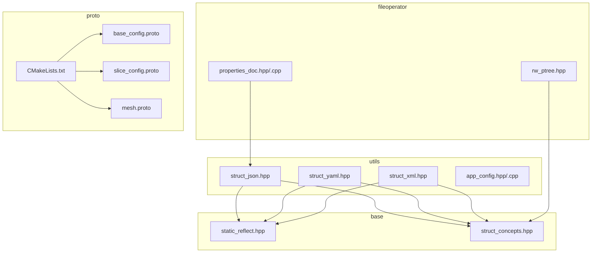

图表来源
- [utils/struct_json.hpp:1-800](file://utils/struct_json.hpp#L1-L800)
- [utils/struct_yaml.hpp:1-667](file://utils/struct_yaml.hpp#L1-L667)
- [utils/struct_xml.hpp:1-800](file://utils/struct_xml.hpp#L1-L800)
- [utils/app_config.hpp:1-46](file://utils/app_config.hpp#L1-L46)
- [utils/app_config.cpp:1-37](file://utils/app_config.cpp#L1-L37)
- [base/static_reflect.hpp:1-188](file://base/static_reflect.hpp#L1-L188)
- [utils/struct_concepts.hpp:1-53](file://utils/struct_concepts.hpp#L1-L53)
- [fileoperator/properties_doc.hpp:1-276](file://fileoperator/properties_doc.hpp#L1-L276)
- [fileoperator/properties_doc.cpp:1-49](file://fileoperator/properties_doc.cpp#L1-L49)
- [fileoperator/rw_ptree.hpp:1-400](file://fileoperator/rw_ptree.hpp#L1-L400)
- [proto/base_config.proto:1-70](file://proto/base_config.proto#L1-L70)
- [proto/slice_config.proto:1-27](file://proto/slice_config.proto#L1-L27)
- [proto/mesh.proto:1-31](file://proto/mesh.proto#L1-L31)
- [proto/CMakeLists.txt:1-131](file://proto/CMakeLists.txt#L1-L131)

章节来源
- [README.md:1-194](file://README.md#L1-L194)

## 核心组件
- 通用序列化库（JSON/YAML/XML）：提供对聚合类型、可反射类型、可选类型、枚举、容器的自动序列化/反序列化，支持字符串流、内存字符串与文件路径接口。
- 静态反射系统：通过 FieldList/MethodList/ClassName 元信息在编译期遍历字段，避免手写转换逻辑。
- 应用配置单例：线程安全的单例，用于集中获取运行时配置项（如外部工具路径）。
- 轻量属性文档：面向简单键值与数组的 JSON 文档封装，适合配置文件或参数表。
- 属性树与变体配置映射：将任意键值转换为 Boost property_tree，并支持类型安全与类型擦除两种存储策略。
- Protobuf 协议：定义跨语言消息结构，配合 CMake 自动生成多语言源码。

章节来源
- [utils/struct_json.hpp:1-800](file://utils/struct_json.hpp#L1-L800)
- [utils/struct_yaml.hpp:1-667](file://utils/struct_yaml.hpp#L1-L667)
- [utils/struct_xml.hpp:1-800](file://utils/struct_xml.hpp#L1-L800)
- [base/static_reflect.hpp:1-188](file://base/static_reflect.hpp#L1-L188)
- [utils/struct_concepts.hpp:1-53](file://utils/struct_concepts.hpp#L1-L53)
- [utils/app_config.hpp:1-46](file://utils/app_config.hpp#L1-L46)
- [utils/app_config.cpp:1-37](file://utils/app_config.cpp#L1-L37)
- [fileoperator/properties_doc.hpp:1-276](file://fileoperator/properties_doc.hpp#L1-L276)
- [fileoperator/properties_doc.cpp:1-49](file://fileoperator/properties_doc.cpp#L1-L49)
- [fileoperator/rw_ptree.hpp:1-400](file://fileoperator/rw_ptree.hpp#L1-L400)
- [proto/CMakeLists.txt:1-131](file://proto/CMakeLists.txt#L1-L131)

## 架构总览
下图展示了从高层到实现层的调用关系与数据流向。

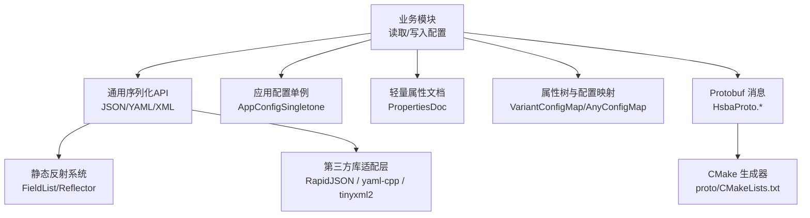

图表来源
- [utils/struct_json.hpp:1-800](file://utils/struct_json.hpp#L1-L800)
- [utils/struct_yaml.hpp:1-667](file://utils/struct_yaml.hpp#L1-L667)
- [utils/struct_xml.hpp:1-800](file://utils/struct_xml.hpp#L1-L800)
- [base/static_reflect.hpp:1-188](file://base/static_reflect.hpp#L1-L188)
- [utils/app_config.hpp:1-46](file://utils/app_config.hpp#L1-L46)
- [fileoperator/properties_doc.hpp:1-276](file://fileoperator/properties_doc.hpp#L1-L276)
- [fileoperator/rw_ptree.hpp:1-400](file://fileoperator/rw_ptree.hpp#L1-L400)
- [proto/CMakeLists.txt:1-131](file://proto/CMakeLists.txt#L1-L131)

## 详细组件分析

### 通用序列化（JSON/YAML/XML）
- 设计要点
  - 统一概念约束：Aggregte、Reflectable、OptionalLike 等，确保模板分支正确选择处理路径。
  - 三种序列化后端：
    - JSON：基于 RapidJSON，提供紧凑与美化输出、流式与字符串接口、文件读写。
    - YAML：基于 yaml-cpp，节点树模型，支持 Map/Sequence 与空值语义。
    - XML：基于 tinyxml2，元素树模型，支持根节点命名与数组包装。
  - 反射驱动：对于 Reflectable 类型，按 FieldList 展开字段名与访问器，无需手写 to_/from_。
  - 容器与可选：对 std::vector/list/array 与 std::optional 进行递归处理，保持空值与缺失字段的语义一致。
  - 错误处理：非法类型或缺失字段时抛出运行时异常，便于上层捕获与诊断。

- 关键流程（以 JSON 为例）
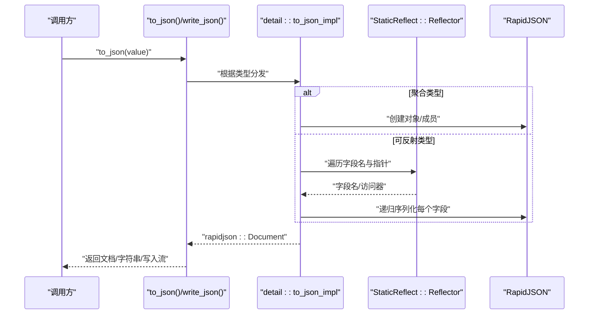

图表来源
- [utils/struct_json.hpp:1-800](file://utils/struct_json.hpp#L1-L800)
- [base/static_reflect.hpp:1-188](file://base/static_reflect.hpp#L1-L188)

- 关键流程（以 YAML 为例）
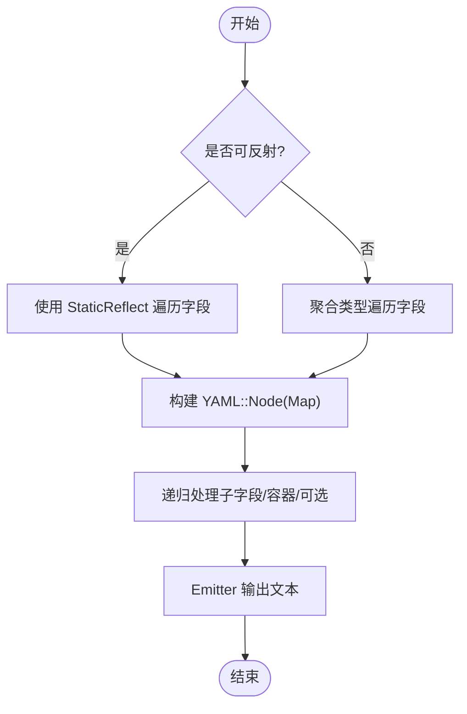

图表来源
- [utils/struct_yaml.hpp:1-667](file://utils/struct_yaml.hpp#L1-L667)
- [base/static_reflect.hpp:1-188](file://base/static_reflect.hpp#L1-L188)

- 关键流程（以 XML 为例）
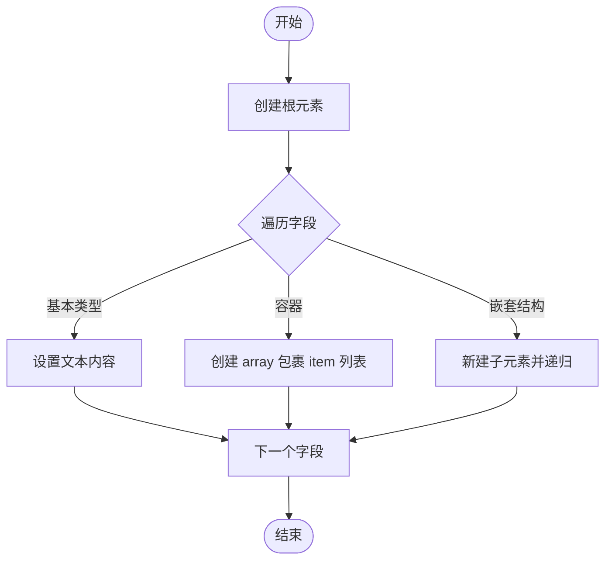

图表来源
- [utils/struct_xml.hpp:1-800](file://utils/struct_xml.hpp#L1-L800)

章节来源
- [utils/struct_json.hpp:1-800](file://utils/struct_json.hpp#L1-L800)
- [utils/struct_yaml.hpp:1-667](file://utils/struct_yaml.hpp#L1-L667)
- [utils/struct_xml.hpp:1-800](file://utils/struct_xml.hpp#L1-L800)
- [base/static_reflect.hpp:1-188](file://base/static_reflect.hpp#L1-L188)
- [utils/struct_concepts.hpp:1-53](file://utils/struct_concepts.hpp#L1-L53)

### 静态反射系统
- 目标：在不引入 RTTI 的前提下，通过编译期元数据（FieldList/MethodList/ClassName）实现对类成员的遍历与访问。
- 关键点
  - FieldInfo/MethodInfo 保存类型、名称与访问器。
  - Reflector<T> 暴露字段数量、名称、访问方法以及按名称调用成员函数。
  - 序列化库据此自动展开字段，避免手工维护 to_/from_ 逻辑。

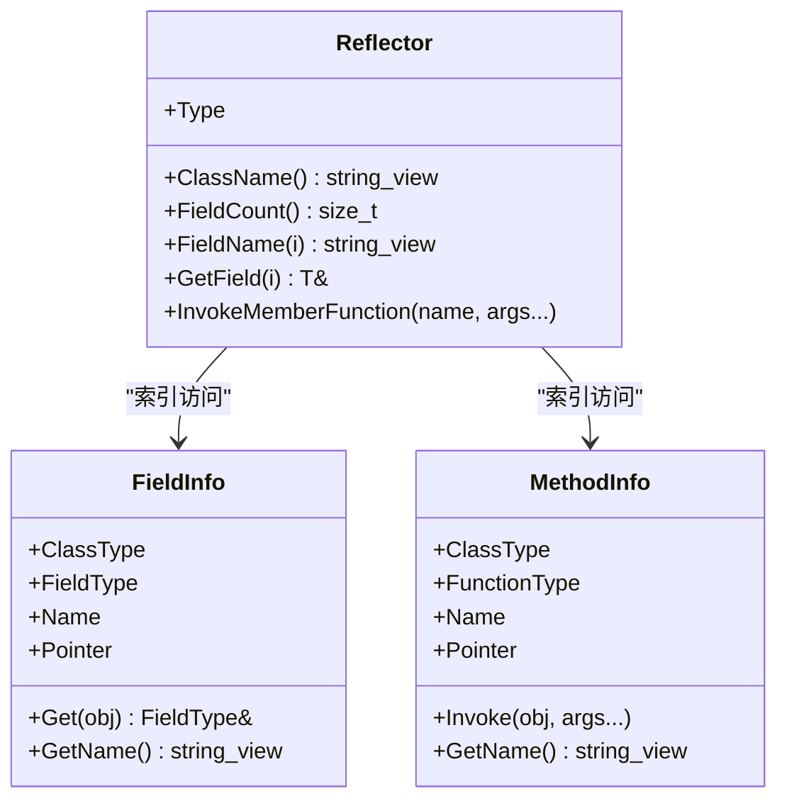

图表来源
- [base/static_reflect.hpp:1-188](file://base/static_reflect.hpp#L1-L188)

章节来源
- [base/static_reflect.hpp:1-188](file://base/static_reflect.hpp#L1-L188)

### 应用配置单例 AppConfigSingletone
- 作用：提供线程安全的单例，集中管理应用级配置（例如外部工具路径）。
- 特性：内部使用互斥锁保护实例生命周期与读操作；对外暴露 GetInstance/DeleteInstance 与查询接口。

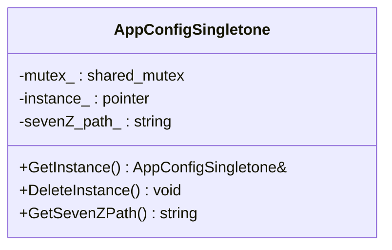

图表来源
- [utils/app_config.hpp:1-46](file://utils/app_config.hpp#L1-L46)
- [utils/app_config.cpp:1-37](file://utils/app_config.cpp#L1-L37)

章节来源
- [utils/app_config.hpp:1-46](file://utils/app_config.hpp#L1-L46)
- [utils/app_config.cpp:1-37](file://utils/app_config.cpp#L1-L37)

### 轻量属性文档 PropertiesDoc
- 定位：面向简单键值与数组的 JSON 文档封装，适合配置文件或参数表。
- 能力：加载/保存 JSON；按 key 获取基础类型与数组；动态添加成员与数组；直接访问底层 rapidjson::Value。

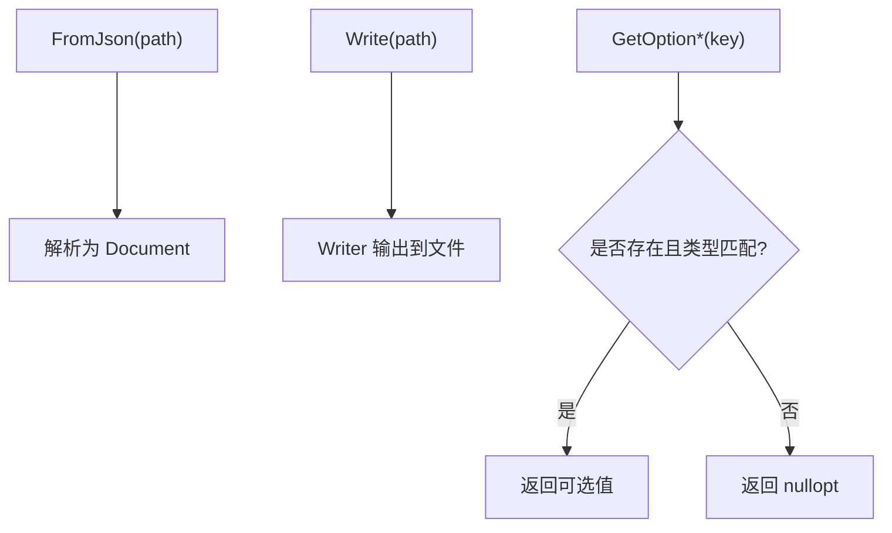

图表来源
- [fileoperator/properties_doc.hpp:1-276](file://fileoperator/properties_doc.hpp#L1-L276)
- [fileoperator/properties_doc.cpp:1-49](file://fileoperator/properties_doc.cpp#L1-L49)

章节来源
- [fileoperator/properties_doc.hpp:1-276](file://fileoperator/properties_doc.hpp#L1-L276)
- [fileoperator/properties_doc.cpp:1-49](file://fileoperator/properties_doc.cpp#L1-L49)

### 属性树与配置映射 VariantConfigMap/AnyConfigMap
- 目标：将配置值以键值形式存储，并提供两种策略：
  - VariantConfigMap：编译期限定允许的类型集合，类型安全。
  - AnyConfigMap：运行期类型擦除，灵活但需显式转换。
- 与 Boost property_tree 互通：可导出为 ptree 并序列化为 INI/XML/JSON，也可从 ptree 导入。

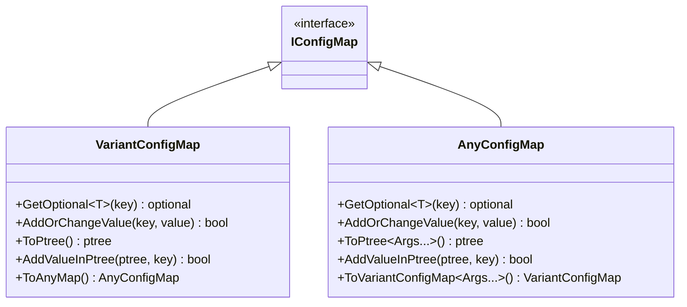

图表来源
- [fileoperator/rw_ptree.hpp:1-400](file://fileoperator/rw_ptree.hpp#L1-L400)

章节来源
- [fileoperator/rw_ptree.hpp:1-400](file://fileoperator/rw_ptree.hpp#L1-L400)

### Protobuf 消息与生成
- 用途：跨语言/跨进程的数据交换，定义切片、网格、向量、点等数据结构。
- 生成：通过 CMake 自定义命令与 protobuf 编译器生成 C++/Java/Python/PHP 源码。

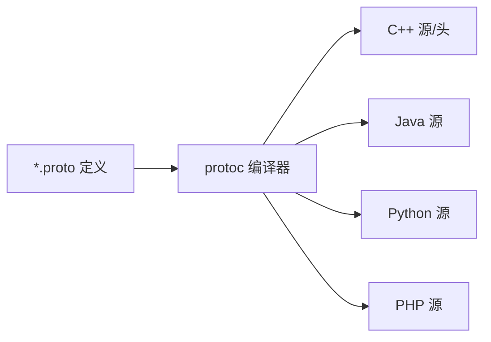

图表来源
- [proto/CMakeLists.txt:1-131](file://proto/CMakeLists.txt#L1-L131)
- [proto/base_config.proto:1-70](file://proto/base_config.proto#L1-L70)
- [proto/slice_config.proto:1-27](file://proto/slice_config.proto#L1-L27)
- [proto/mesh.proto:1-31](file://proto/mesh.proto#L1-L31)

章节来源
- [proto/CMakeLists.txt:1-131](file://proto/CMakeLists.txt#L1-L131)
- [proto/base_config.proto:1-70](file://proto/base_config.proto#L1-L70)
- [proto/slice_config.proto:1-27](file://proto/slice_config.proto#L1-L27)
- [proto/mesh.proto:1-31](file://proto/mesh.proto#L1-L31)

## 依赖关系分析
- 序列化库依赖
  - JSON：RapidJSON（文档/写入器/字符串缓冲）
  - YAML：yaml-cpp（Node/Emit/Lib）
  - XML：tinyxml2（Document/Element/Printer）
  - 三者均依赖静态反射与概念约束，以实现泛型序列化。
- 配置子系统依赖
  - PropertiesDoc 依赖 RapidJSON。
  - rw_ptree 依赖 Boost.PropertyTree 与 any_visit。
  - AppConfigSingletone 仅依赖标准库互斥量。
- 协议层依赖
  - proto 目录下的 .proto 文件由 CMake 驱动 protoc 生成多语言源码，供各模块使用。

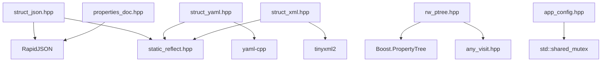

图表来源
- [utils/struct_json.hpp:1-800](file://utils/struct_json.hpp#L1-L800)
- [utils/struct_yaml.hpp:1-667](file://utils/struct_yaml.hpp#L1-L667)
- [utils/struct_xml.hpp:1-800](file://utils/struct_xml.hpp#L1-L800)
- [base/static_reflect.hpp:1-188](file://base/static_reflect.hpp#L1-L188)
- [fileoperator/properties_doc.hpp:1-276](file://fileoperator/properties_doc.hpp#L1-L276)
- [fileoperator/rw_ptree.hpp:1-400](file://fileoperator/rw_ptree.hpp#L1-L400)
- [utils/app_config.hpp:1-46](file://utils/app_config.hpp#L1-L46)

章节来源
- [utils/struct_json.hpp:1-800](file://utils/struct_json.hpp#L1-L800)
- [utils/struct_yaml.hpp:1-667](file://utils/struct_yaml.hpp#L1-L667)
- [utils/struct_xml.hpp:1-800](file://utils/struct_xml.hpp#L1-L800)
- [base/static_reflect.hpp:1-188](file://base/static_reflect.hpp#L1-L188)
- [fileoperator/properties_doc.hpp:1-276](file://fileoperator/properties_doc.hpp#L1-L276)
- [fileoperator/rw_ptree.hpp:1-400](file://fileoperator/rw_ptree.hpp#L1-L400)
- [utils/app_config.hpp:1-46](file://utils/app_config.hpp#L1-L46)

## 性能考虑
- 序列化开销
  - JSON/YAML/XML 均为递归遍历结构，复杂嵌套与大量容器会显著增加 CPU 与内存分配。
  - 建议：
    - 优先使用紧凑格式（JSON 紧凑版）传输大对象，仅在调试时使用美化输出。
    - 复用 Document/Node 或预分配缓冲区以减少频繁分配。
    - 对热点路径采用自定义 RapidJsonValueConvertible/YAMLValueConvertible/TinyXmlConvertible 实现，绕过通用分支。
- 反射成本
  - 静态反射在编译期展开，无运行时 RTTI 开销，但模板实例化会增加编译时间。
- 配置读取
  - PropertiesDoc 直接操作 RapidJSON，适合小中型配置；超大配置建议使用流式解析或分块加载。
  - VariantConfigMap/AnyConfigMap 与 ptree 的转换涉及多次拷贝，批量写入时可先构造 ptree 再一次性落盘。

[本节为通用指导，不直接分析具体文件]

## 故障排查指南
- 常见异常与定位
  - 不支持的类型：当字段类型不在支持的集合内时，序列化/反序列化会抛出运行时异常。检查类型是否满足 Aggregte/Reflectable/OptionalLike 或是否实现了对应可转换概念。
  - 字段缺失或类型不匹配：JSON/YAML/XML 中缺少字段或类型不符会导致解析失败或返回空值。确认键名与大小写、默认值与可选语义。
  - 文件 IO 错误：打开/写入失败会抛出 IO 相关异常。检查路径权限与编码转换（PropertiesDoc 内部有本地编码转换）。
- 建议的诊断步骤
  - 打印中间产物：使用 write_pretty_json/write_yaml/write_xml 输出可读文本，对比期望结构。
  - 最小复现：将问题结构简化为最小字段集，逐步恢复以定位问题字段。
  - 单元测试参考：查看 tests 下 ConfigMap 与 struct_* 测试用例，对照断言行为。

章节来源
- [utils/struct_json.hpp:1-800](file://utils/struct_json.hpp#L1-L800)
- [utils/struct_yaml.hpp:1-667](file://utils/struct_yaml.hpp#L1-L667)
- [utils/struct_xml.hpp:1-800](file://utils/struct_xml.hpp#L1-L800)
- [fileoperator/properties_doc.cpp:1-49](file://fileoperator/properties_doc.cpp#L1-L49)

## 结论
本项目提供了完善而统一的序列化与配置管理能力：
- 通过静态反射与概念约束，实现了对多种数据结构的零样板序列化。
- 提供 JSON/YAML/XML 三套后端，覆盖人类可读与机器高效场景。
- 结合轻量属性文档、属性树与配置映射，满足不同规模与类型的配置需求。
- 借助 Protobuf 建立跨语言数据契约，支撑多端协作。

在实际工程中，建议：
- 新结构优先声明为 Reflectable 或使用聚合类型，以获得最佳兼容性。
- 对高频路径定制专用转换实现，减少模板分支与分配。
- 严格校验输入与边界条件，利用单元测试保障向后兼容。

[本节为总结性内容，不直接分析具体文件]

## 附录
- 使用建议速查
  - 需要人类可读配置：优先 YAML。
  - 需要跨语言/跨进程：使用 Protobuf。
  - 需要高性能网络传输：JSON 紧凑模式。
  - 需要与现有 Boost.PropertyTree 生态集成：使用 VariantConfigMap/AnyConfigMap。

[本节为补充说明，不直接分析具体文件]