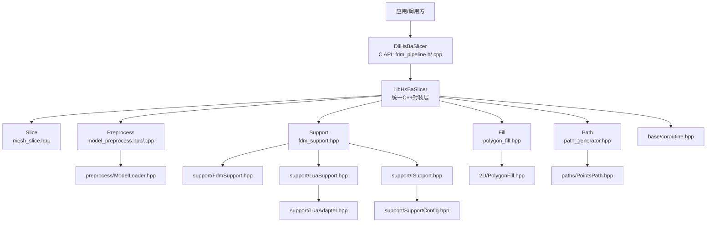
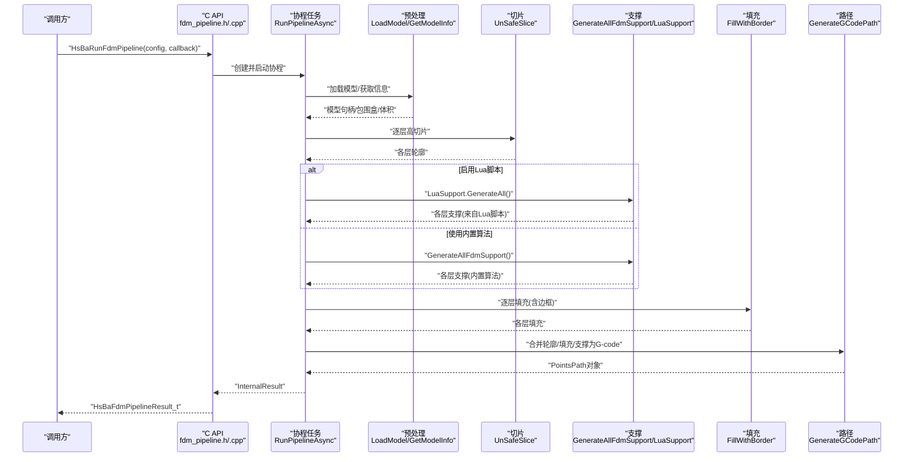
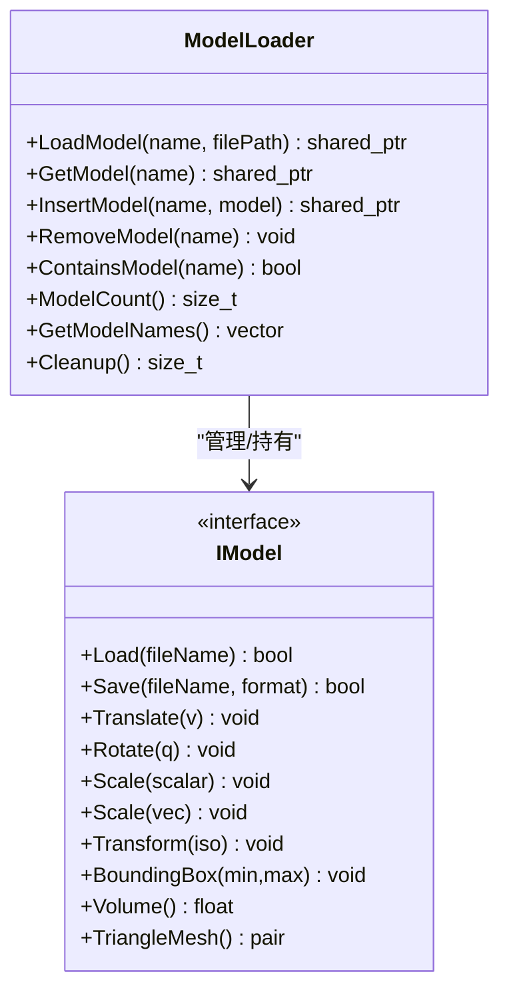
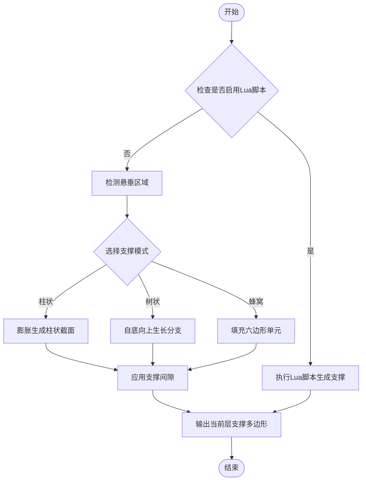
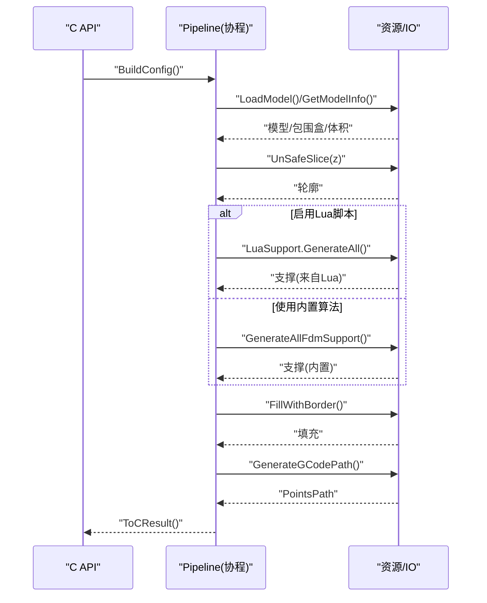
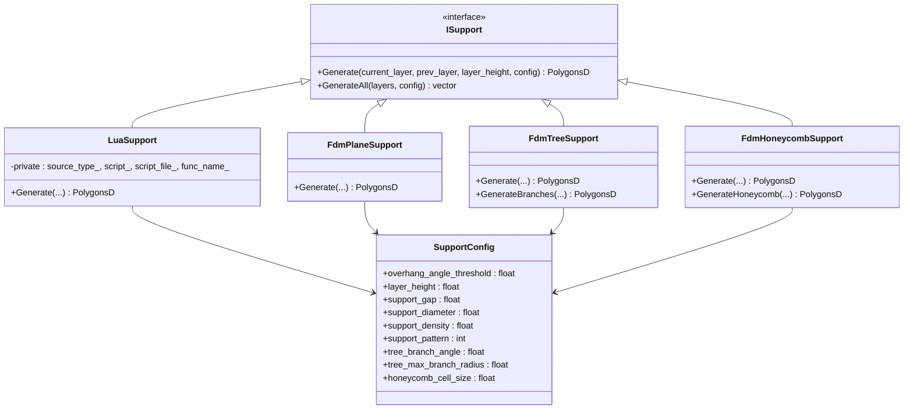
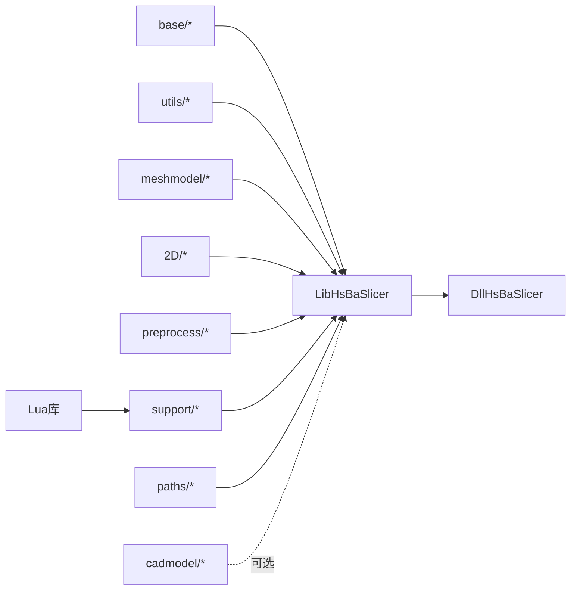

# 支撑生成系统

<cite>
**本文引用的文件**
- [README.md](file://README.md)
- [coroutine.hpp](file://base/coroutine.hpp)
- [IModel.hpp](file://base/IModel.hpp)
- [mesh_slice.hpp](file://LibHsBaSlicer/Slice/mesh_slice.hpp)
- [model_preprocess.hpp](file://LibHsBaSlicer/Preprocess/model_preprocess.hpp)
- [model_preprocess.cpp](file://LibHsBaSlicer/Preprocess/model_preprocess.cpp)
- [fdm_support.hpp](file://LibHsBaSlicer/Support/fdm_support.hpp)
- [polygon_fill.hpp](file://LibHsBaSlicer/Fill/polygon_fill.hpp)
- [path_generator.hpp](file://LibHsBaSlicer/Path/path_generator.hpp)
- [CMakeLists.txt](file://LibHsBaSlicer/CMakeLists.txt)
- [fdm_pipeline.h](file://DllHsBaSlicer/fdm_pipeline.h)
- [fdm_pipeline.cpp](file://DllHsBaSlicer/fdm_pipeline.cpp)
- [ModelLoader.hpp](file://preprocess/ModelLoader.hpp)
- [FdmSupport.hpp](file://support/FdmSupport.hpp)
- [FdmSupport.cpp](file://support/FdmSupport.cpp)
- [ISupport.hpp](file://support/ISupport.hpp)
- [LuaSupport.hpp](file://support/LuaSupport.hpp)
- [LuaSupport.cpp](file://support/LuaSupport.cpp)
- [LuaAdapter.hpp](file://support/LuaAdapter.hpp)
- [LuaAdapter.cpp](file://support/LuaAdapter.cpp)
- [PolygonFill.hpp](file://2D/PolygonFill.hpp)
- [PointsPath.hpp](file://paths/PointsPath.hpp)
- [SupportConfig.hpp](file://support/SupportConfig.hpp)
- [my_support.lua](file://samples/FDM/scripts/my_support.lua)
</cite>

## 更新摘要
**变更内容**   
- 新增Lua脚本支持模块，允许通过Lua脚本自定义支撑生成算法
- 扩展支撑配置系统，支持更多参数选项
- 增强支撑生成架构，提供统一的ISupport接口
- 添加完整的Lua绑定和测试用例

## 目录
1. [简介](#简介)
2. [项目结构](#项目结构)
3. [核心组件](#核心组件)
4. [架构总览](#架构总览)
5. [详细组件分析](#详细组件分析)
6. [Lua脚本集成](#lua脚本集成)
7. [依赖关系分析](#依赖关系分析)
8. [性能与并发特性](#性能与并发特性)
9. [故障排查指南](#故障排查指南)
10. [结论](#结论)
11. [附录：API定义与配置项](#附录api定义与配置项)

## 简介
本仓库实现了一个面向FDM（熔融沉积成型）的切片与路径生成系统，提供从模型预处理、切片、支撑生成、填充到G-code路径生成的完整流水线。系统在LibHsBaSlicer中暴露统一的C++接口，在DllHsBaSlicer中以C兼容API对外导出，并通过C++20协程实现异步执行与进度回调。底层模块包括模型加载、几何切片、2D多边形填充、支撑算法与路径输出等。

**更新** 新增Lua脚本支持，允许用户通过Lua脚本完全自定义支撑生成算法，提供灵活的扩展机制。

## 项目结构
整体采用分层组织：基础类型与工具（base）、上层封装库（LibHsBaSlicer）、动态库对外接口（DllHsBaSlicer），以及各功能域子模块（preprocess、support、2D、paths等）。构建系统使用CMake，支持静态/动态库构建，并在Android/iOS等平台进行条件编译。

图表来源
- [fdm_pipeline.h:1-147](file://DllHsBaSlicer/fdm_pipeline.h#L1-L147)
- [fdm_pipeline.cpp:1-357](file://DllHsBaSlicer/fdm_pipeline.cpp#L1-L357)
- [model_preprocess.hpp:1-88](file://LibHsBaSlicer/Preprocess/model_preprocess.hpp#L1-L88)
- [model_preprocess.cpp:1-81](file://LibHsBaSlicer/Preprocess/model_preprocess.cpp#L1-L81)
- [fdm_support.hpp:1-36](file://LibHsBaSlicer/Support/fdm_support.hpp#L1-L36)
- [polygon_fill.hpp:1-36](file://LibHsBaSlicer/Fill/polygon_fill.hpp#L1-L36)
- [path_generator.hpp:1-62](file://LibHsBaSlicer/Path/path_generator.hpp#L1-L62)
- [mesh_slice.hpp:1-28](file://LibHsBaSlicer/Slice/mesh_slice.hpp#L1-L28)
- [ModelLoader.hpp:1-131](file://preprocess/ModelLoader.hpp#L1-L131)
- [FdmSupport.hpp:1-63](file://support/FdmSupport.hpp#L1-L63)
- [LuaSupport.hpp:1-73](file://support/LuaSupport.hpp#L1-L73)
- [ISupport.hpp:1-45](file://support/ISupport.hpp#L1-L45)
- [LuaAdapter.hpp:1-30](file://support/LuaAdapter.hpp#L1-L30)
- [PolygonFill.hpp:1-130](file://2D/PolygonFill.hpp#L1-L130)
- [PointsPath.hpp:1-77](file://paths/PointsPath.hpp#L1-L77)
- [coroutine.hpp:1-800](file://base/coroutine.hpp#L1-L800)
- [SupportConfig.hpp:1-43](file://support/SupportConfig.hpp#L1-L43)

章节来源
- [README.md:1-194](file://README.md#L1-L194)
- [CMakeLists.txt:1-59](file://LibHsBaSlicer/CMakeLists.txt#L1-L59)

## 核心组件
- 预处理封装（LibHsBaSlicer/Preprocess）
  - 负责模型加载、变换、信息查询与池化管理，内部基于线程局部ModelLoader实例，避免跨线程共享状态冲突。
- 切片接口（LibHsBaSlicer/Slice）
  - 提供安全/不安全两种切片方式，返回二维轮廓集合，供后续支撑与填充使用。
- 支撑生成（LibHsBaSlicer/Support）
  - 封装FDM支撑策略（柱状、树状、蜂窝），按层计算支撑截面，现支持Lua脚本自定义算法。
- 填充生成（LibHsBaSlicer/Fill）
  - 封装多种填充模式（平行线、锯齿等），支持带边框复合填充。
- 路径生成（LibHsBaSlicer/Path）
  - 将轮廓、填充、支撑合并为G-code点序列，并输出字符串或文件。
- 协程基础设施（base/coroutine.hpp）
  - 提供Task、Generator、Executor抽象，用于异步编排与逐层迭代。
- 对外C API（DllHsBaSlicer）
  - 以C兼容结构体与函数暴露全流程能力，支持同步与异步调用，并提供进度回调与结果释放。

**更新** 支撑生成模块现在支持Lua脚本自定义算法，通过统一的ISupport接口实现插件化架构。

章节来源
- [model_preprocess.hpp:1-88](file://LibHsBaSlicer/Preprocess/model_preprocess.hpp#L1-L88)
- [model_preprocess.cpp:1-81](file://LibHsBaSlicer/Preprocess/model_preprocess.cpp#L1-L81)
- [mesh_slice.hpp:1-28](file://LibHsBaSlicer/Slice/mesh_slice.hpp#L1-L28)
- [fdm_support.hpp:1-36](file://LibHsBaSlicer/Support/fdm_support.hpp#L1-L36)
- [polygon_fill.hpp:1-36](file://LibHsBaSlicer/Fill/polygon_fill.hpp#L1-L36)
- [path_generator.hpp:1-62](file://LibHsBaSlicer/Path/path_generator.hpp#L1-L62)
- [coroutine.hpp:1-800](file://base/coroutine.hpp#L1-L800)
- [fdm_pipeline.h:1-147](file://DllHsBaSlicer/fdm_pipeline.h#L1-L147)
- [fdm_pipeline.cpp:1-357](file://DllHsBaSlicer/fdm_pipeline.cpp#L1-L357)

## 架构总览
系统通过C API进入，内部以协程驱动五阶段流水线：预处理→切片→支撑→填充→路径生成。每阶段可报告进度，错误通过异常捕获并转换为结构化结果。

**更新** 支撑阶段现在支持Lua脚本自定义算法，通过配置文件中的support_lua_script字段启用。

图表来源
- [fdm_pipeline.cpp:182-292](file://DllHsBaSlicer/fdm_pipeline.cpp#L182-L292)
- [model_preprocess.cpp:17-78](file://LibHsBaSlicer/Preprocess/model_preprocess.cpp#L17-L78)
- [mesh_slice.hpp:17-24](file://LibHsBaSlicer/Slice/mesh_slice.hpp#L17-L24)
- [fdm_support.hpp:20-31](file://LibHsBaSlicer/Support/fdm_support.hpp#L20-L31)
- [polygon_fill.hpp:18-31](file://LibHsBaSlicer/Fill/polygon_fill.hpp#L18-L31)
- [path_generator.hpp:44-46](file://LibHsBaSlicer/Path/path_generator.hpp#L44-L46)

## 详细组件分析

### 预处理模块（LibHsBaSlicer/Preprocess）
- 职责
  - 加载模型到命名对象池，提供平移/旋转/缩放等操作，查询包围盒与体积。
- 关键设计
  - 使用线程局部ModelLoader实例，避免多线程竞争；对外接口对空指针进行保护。
- 复杂度与性能
  - 加载与变换时间取决于模型规模与内核（IGL/Occt）；体积与包围盒计算为O(n)三角面遍历。
- 错误处理
  - 名称重复、格式不支持、文件不可读等抛出运行时异常，由上层捕获。

图表来源
- [ModelLoader.hpp:26-127](file://preprocess/ModelLoader.hpp#L26-L127)
- [IModel.hpp:107-136](file://base/IModel.hpp#L107-L136)

章节来源
- [model_preprocess.hpp:1-88](file://LibHsBaSlicer/Preprocess/model_preprocess.hpp#L1-L88)
- [model_preprocess.cpp:1-81](file://LibHsBaSlicer/Preprocess/model_preprocess.cpp#L1-L81)
- [ModelLoader.hpp:1-131](file://preprocess/ModelLoader.hpp#L1-L131)
- [IModel.hpp:1-148](file://base/IModel.hpp#L1-L148)

### 切片模块（LibHsBaSlicer/Slice）
- 职责
  - 提供安全/不安全两种Z向平面切片，返回二维轮廓集合；Lua脚本扩展切片逻辑。
- 输入输出
  - 输入：IModel与高度；输出：Polygons或UnSafePolygons。
- 注意事项
  - 不安全切片可能包含未封闭轮廓，适用于特定工艺场景。

章节来源
- [mesh_slice.hpp:1-28](file://LibHsBaSlicer/Slice/mesh_slice.hpp#L1-L28)

### 支撑模块（LibHsBaSlicer/Support）
- 职责
  - 根据悬垂区域生成FDM支撑截面，支持柱状、树状、蜂窝三种模式，现支持Lua脚本自定义算法。
- 配置
  - 使用Support::FdmSupportConfig，包含悬垂阈值、间距、直径、密度、模式、接口层等参数。
- 流程
  - 单层生成：基于当前层与前一层轮廓计算支撑；全层生成：遍历所有层累积支撑。

**更新** 新增Lua脚本支持，通过ISupport接口实现统一的支撑生成抽象。

图表来源
- [FdmSupport.hpp:15-59](file://support/FdmSupport.hpp#L15-L59)
- [SupportConfig.hpp:10-30](file://support/SupportConfig.hpp#L10-L30)
- [LuaSupport.hpp:14-31](file://support/LuaSupport.hpp#L14-L31)

章节来源
- [fdm_support.hpp:1-36](file://LibHsBaSlicer/Support/fdm_support.hpp#L1-L36)
- [FdmSupport.hpp:1-63](file://support/FdmSupport.hpp#L1-L63)
- [SupportConfig.hpp:1-43](file://support/SupportConfig.hpp#L1-L43)

### 填充模块（LibHsBaSlicer/Fill）
- 职责
  - 提供多种填充模式与复合填充（带边框），支持角度与线宽控制。
- 模式
  - 平行线、简单锯齿、高级锯齿；CompositeOffsetFill/HybridFill组合偏移与填充。
- 复杂度
  - 填充算法主要受多边形复杂度与间距影响，通常近似O(n)。

章节来源
- [polygon_fill.hpp:1-36](file://LibHsBaSlicer/Fill/polygon_fill.hpp#L1-L36)
- [PolygonFill.hpp:1-130](file://2D/PolygonFill.hpp#L1-L130)

### 路径生成模块（LibHsBaSlicer/Path）
- 职责
  - 将轮廓、填充、支撑合并为G-code点序列，支持单位设置与速度/挤出倍率。
- 数据结构
  - LayerPathData聚合每层的三类路径与Z高度；PointsPath保存GPoint序列并可序列化。
- 输出
  - ToString/Save支持直接字符串或文件输出，可扩展Lua脚本定制。

章节来源
- [path_generator.hpp:1-62](file://LibHsBaSlicer/Path/path_generator.hpp#L1-L62)
- [PointsPath.hpp:1-77](file://paths/PointsPath.hpp#L1-L77)

### 协程与流水线（DllHsBaSlicer）
- 职责
  - 以C API暴露同步/异步全流程，内部使用协程编排阶段，提供进度回调与结果释放。
- 关键流程
  - 构建内部配置→加载模型→计算层数→逐层切片→可选支撑→逐层填充→路径生成→汇总结果。
- 错误处理
  - 捕获异常并写入error_message；成功时success=1，失败则success=0。

**更新** 支撑阶段现在支持Lua脚本，通过配置文件中的support_lua_script字段启用自定义算法。

图表来源
- [fdm_pipeline.cpp:133-292](file://DllHsBaSlicer/fdm_pipeline.cpp#L133-L292)
- [coroutine.hpp:200-377](file://base/coroutine.hpp#L200-L377)

章节来源
- [fdm_pipeline.h:1-147](file://DllHsBaSlicer/fdm_pipeline.h#L1-L147)
- [fdm_pipeline.cpp:1-357](file://DllHsBaSlicer/fdm_pipeline.cpp#L1-L357)
- [coroutine.hpp:1-800](file://base/coroutine.hpp#L1-L800)

## Lua脚本集成

### 架构设计
支撑生成系统现在支持通过Lua脚本完全自定义支撑算法，提供以下核心组件：

- **ISupport接口**：统一的支撑生成抽象接口
- **LuaSupport类**：Lua脚本支撑生成器实现
- **LuaAdapter模块**：Lua与C++之间的数据绑定
- **内置支撑生成器**：FdmPlaneSupport、FdmTreeSupport、FdmHoneycombSupport

图表来源
- [ISupport.hpp:18-41](file://support/ISupport.hpp#L18-L41)
- [LuaSupport.hpp:32-69](file://support/LuaSupport.hpp#L32-L69)
- [FdmSupport.hpp:15-59](file://support/FdmSupport.hpp#L15-L59)
- [SupportConfig.hpp:10-21](file://support/SupportConfig.hpp#L10-L21)

### Lua环境配置
Lua脚本在执行时可获得以下全局变量和函数：

**全局变量：**
- `current_layer`：当前层多边形表
- `prev_layer`：上一层多边形表（首层为空）
- `layer_height`：层高（mm）
- `config`：支撑配置表

**可用函数：**
- `PolygonOperations.offsetOperation(polys, delta)`：多边形偏移
- `PolygonOperations.intersection(polys_a, polys_b)`：多边形交集
- `PolygonOperations.difference(polys_a, polys_b)`：多边形差集
- `PolygonOperations.union(polys_a, polys_b)`：多边形并集
- `PolygonOperations.makeCircle(cx, cy, r)`：生成圆形多边形
- `PolygonOperations.area(poly)`：计算面积

**Support模块函数：**
- `Support.new_plane()`：创建平面支撑生成器
- `Support.new_tree()`：创建树状支撑生成器
- `Support.new_honeycomb()`：创建蜂窝支撑生成器
- `Support.new_sla()`：创建SLA支撑生成器
- `Support.generate(obj, current, prev, height, cfg)`：用指定生成器生成支撑
- `Support.detect_overhang(current, prev, height, angle)`：检测悬垂区域
- `Support.default_config()`：获取默认支撑配置表

### 脚本示例
系统提供了完整的示例脚本 `samples/FDM/scripts/my_support.lua`，展示了如何使用内置支撑生成器和多边形操作函数来创建自定义支撑算法。

**章节来源**
- [LuaSupport.hpp:14-31](file://support/LuaSupport.hpp#L14-L31)
- [LuaSupport.cpp:62-85](file://support/LuaSupport.cpp#L62-L85)
- [LuaAdapter.hpp:9-26](file://support/LuaAdapter.hpp#L9-L26)
- [my_support.lua:1-83](file://samples/FDM/scripts/my_support.lua#L1-L83)

## 依赖关系分析
- LibHsBaSlicer链接基础库、2D几何、预处理、支撑、路径等模块，并在非移动平台链接CAD内核。
- DllHsBaSlicer依赖LibHsBaSlicer提供的统一接口，并通过协程基础设施进行异步编排。
- 支撑模块新增Lua支持，需要链接Lua库。

图表来源
- [CMakeLists.txt:37-50](file://LibHsBaSlicer/CMakeLists.txt#L37-L50)

章节来源
- [CMakeLists.txt:1-59](file://LibHsBaSlicer/CMakeLists.txt#L1-L59)

## 性能与并发特性
- 协程与异步
  - Task默认使用AsyncExecutor，可在后台线程执行；then/catching/finally提供链式回调。
- 逐层并行潜力
  - 当前流水线串行处理各层，但Generator可用于流式产出切片结果，便于后续阶段并行消费不同层。
- 内存与分配
  - 自定义分配器Task变体支持promise级自定义分配，减少频繁分配开销。
- Lua脚本性能
  - Lua脚本执行有额外开销，适合复杂算法而非简单计算；建议缓存脚本解析结果。
- 建议优化
  - 对大模型切片与填充阶段引入层间并行；对支撑生成使用空间索引加速悬垂检测；对路径生成进行路径重排序以减少空走距离。

## 故障排查指南
- 常见问题
  - 模型加载失败：检查文件路径与格式支持；确认命名唯一性。
  - 无效层高：模型高度≤0或首层层高大于模型高度导致层数为0。
  - 支撑未生成：检查enable_support开关与悬垂阈值配置。
  - G-code为空：路径生成失败或层数据缺失。
  - Lua脚本错误：检查脚本语法和函数名；确认全局变量正确设置。
- 定位方法
  - 查看HsBaFdmPipelineResult.error_message；启用进度回调观察卡滞阶段。
  - 逐步关闭支撑/填充验证问题范围。
  - 使用小模型与默认参数复现。
  - 对于Lua脚本问题，先使用内置算法验证，再逐步切换到自定义脚本。

**更新** 新增Lua脚本相关的故障排查指导。

章节来源
- [fdm_pipeline.cpp:182-292](file://DllHsBaSlicer/fdm_pipeline.cpp#L182-L292)
- [fdm_pipeline.h:77-140](file://DllHsBaSlicer/fdm_pipeline.h#L77-L140)

## 结论
本系统通过清晰的模块化设计与C/C++双栈接口，实现了FDM全流程的可插拔与可扩展。协程基础设施为异步与进度反馈提供了良好支撑。**更新** 新增的Lua脚本支持为用户提供了极大的灵活性，可以完全自定义支撑生成算法，同时保持与内置算法的兼容性。建议在后续版本中增强层间并行、路径优化与更丰富的填充/支撑模式，以提升大规模模型的吞吐与打印质量。

## 附录：API定义与配置项
- C API入口
  - HsBaCreateDefaultConfig：创建默认配置
  - HsBaRunFdmPipeline：同步运行
  - HsBaRunFdmPipelineAsync：异步运行
  - HsBaFreePipelineResult：释放结果内存
- 配置项（节选）
  - 模型：model_name、model_path
  - 切片：layer_height、first_layer_height
  - 填充：fill_spacing、fill_mode、fill_angle、wall_count
  - 支撑：enable_support、overhang_angle、support_gap、support_diameter、support_density、support_pattern、interface_layers、interface_density、**support_lua_script**、**support_lua_func**
  - 路径：line_width、print_speed、travel_speed、extrusion_multiplier
  - 输出：output_path

**更新** 新增支撑相关的Lua脚本配置项：
- `support_lua_script`：Lua脚本文件或内联脚本内容
- `support_lua_func`：要调用的Lua函数名（默认为"generate_support"）

章节来源
- [fdm_pipeline.h:35-140](file://DllHsBaSlicer/fdm_pipeline.h#L35-L140)
- [fdm_pipeline.cpp:298-322](file://DllHsBaSlicer/fdm_pipeline.cpp#L298-L322)