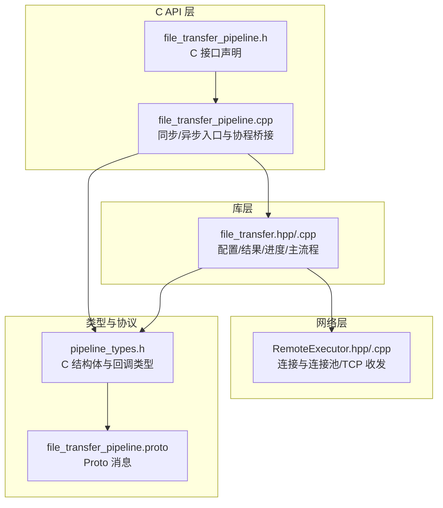
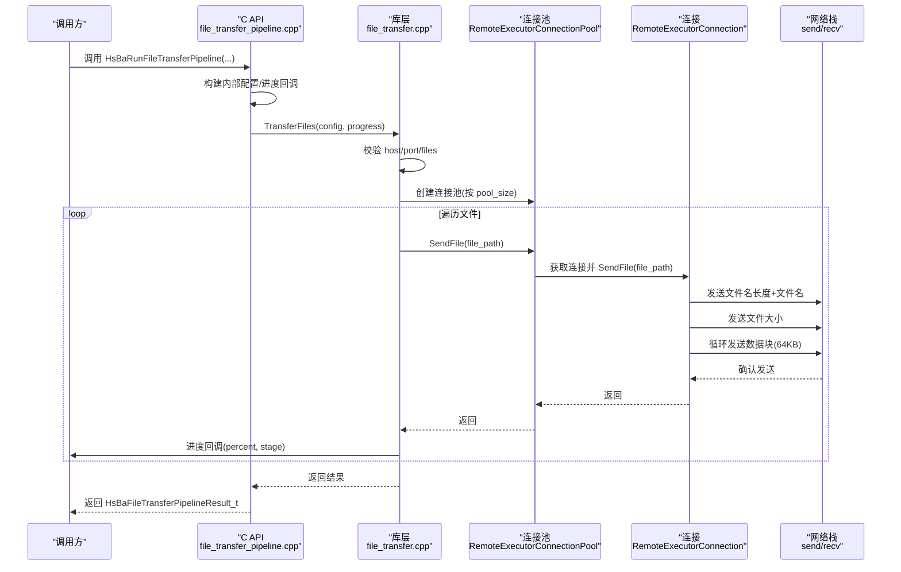
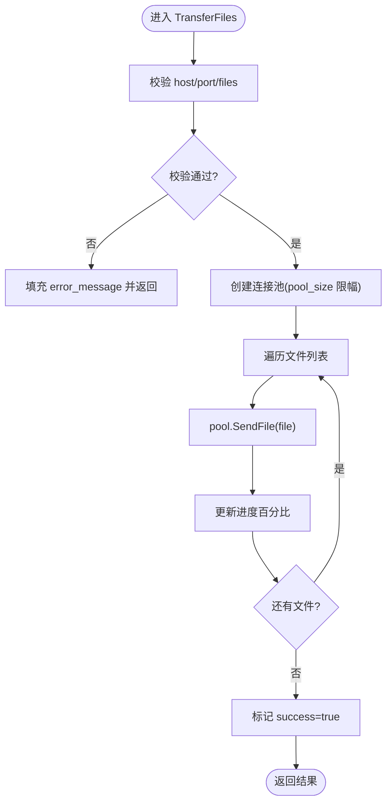
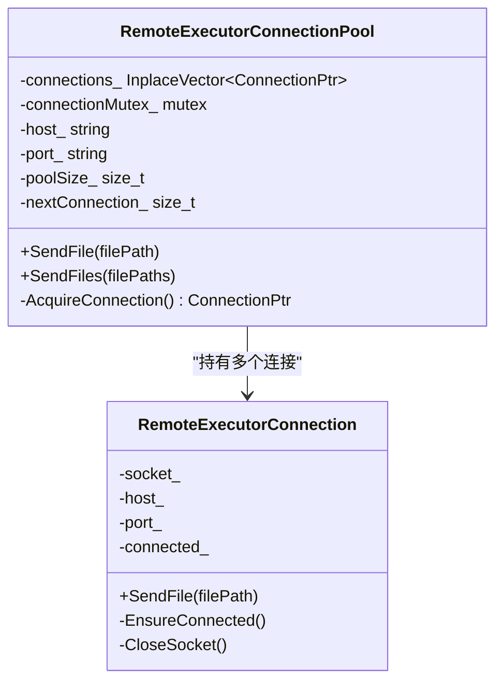
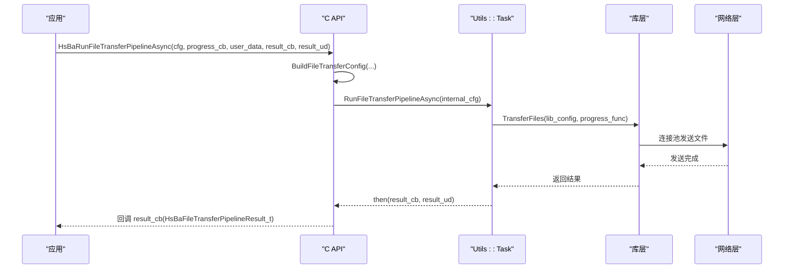
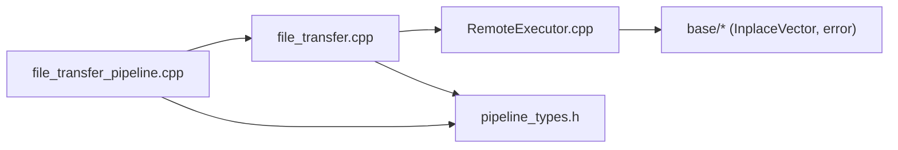

# 文件传输管道

<cite>
**本文引用的文件**   
- [file_transfer.hpp](file://LibHsBaSlicer/Transfer/file_transfer.hpp)
- [file_transfer.cpp](file://LibHsBaSlicer/Transfer/file_transfer.cpp)
- [RemoteExecutor.hpp](file://fileoperator/RemoteExecutor.hpp)
- [RemoteExecutor.cpp](file://fileoperator/RemoteExecutor.cpp)
- [file_transfer_pipeline.h](file://DllHsBaSlicer/file_transfer_pipeline.h)
- [file_transfer_pipeline.cpp](file://DllHsBaSlicer/file_transfer_pipeline.cpp)
- [pipeline_types.h](file://pipelinetypes/pipeline_types.h)
- [file_transfer_pipeline.proto](file://proto/file_transfer_pipeline.proto)
- [coroutine.hpp](file://base/coroutine.hpp)
</cite>

## 目录
1. [简介](#简介)
2. [项目结构](#项目结构)
3. [核心组件](#核心组件)
4. [架构总览](#架构总览)
5. [详细组件分析](#详细组件分析)
6. [依赖关系分析](#依赖关系分析)
7. [性能考量](#性能考量)
8. [故障排查指南](#故障排查指南)
9. [结论](#结论)
10. [附录](#附录)

## 简介
本文件聚焦于 HsBaSlicer 中的“文件传输管道”，用于将本地文件批量、可靠地传输到远程执行服务。该管道提供：
- C++ 库接口（LibHsBaSlicer）与 C API（DllHsBaSlicer）双入口，便于不同语言与宿主环境集成
- 同步与异步两种调用方式，支持进度回调与结果回调
- 连接池复用 TCP 连接，提升多文件传输吞吐
- 跨平台网络实现与健壮的错误处理

## 项目结构
文件传输管道涉及三个层次：
- 协议与类型定义层：C 兼容结构与 Proto 消息
- 核心逻辑层：配置校验、连接建立、文件发送、进度上报
- 底层网络层：TCP 连接、分块发送、字节序转换、错误封装

图表来源
- [file_transfer_pipeline.h:1-63](file://DllHsBaSlicer/file_transfer_pipeline.h#L1-L63)
- [file_transfer_pipeline.cpp:1-189](file://DllHsBaSlicer/file_transfer_pipeline.cpp#L1-L189)
- [file_transfer.hpp:1-61](file://LibHsBaSlicer/Transfer/file_transfer.hpp#L1-L61)
- [file_transfer.cpp:1-91](file://LibHsBaSlicer/Transfer/file_transfer.cpp#L1-L91)
- [RemoteExecutor.hpp:1-103](file://fileoperator/RemoteExecutor.hpp#L1-L103)
- [RemoteExecutor.cpp:1-313](file://fileoperator/RemoteExecutor.cpp#L1-L313)
- [pipeline_types.h:318-356](file://pipelinetypes/pipeline_types.h#L318-L356)
- [file_transfer_pipeline.proto:1-21](file://proto/file_transfer_pipeline.proto#L1-L21)

章节来源
- [file_transfer_pipeline.h:1-63](file://DllHsBaSlicer/file_transfer_pipeline.h#L1-L63)
- [file_transfer_pipeline.cpp:1-189](file://DllHsBaSlicer/file_transfer_pipeline.cpp#L1-L189)
- [file_transfer.hpp:1-61](file://LibHsBaSlicer/Transfer/file_transfer.hpp#L1-L61)
- [file_transfer.cpp:1-91](file://LibHsBaSlicer/Transfer/file_transfer.cpp#L1-L91)
- [RemoteExecutor.hpp:1-103](file://fileoperator/RemoteExecutor.hpp#L1-L103)
- [RemoteExecutor.cpp:1-313](file://fileoperator/RemoteExecutor.cpp#L1-L313)
- [pipeline_types.h:318-356](file://pipelinetypes/pipeline_types.h#L318-L356)
- [file_transfer_pipeline.proto:1-21](file://proto/file_transfer_pipeline.proto#L1-L21)

## 核心组件
- 配置与结果
  - FileTransferConfig：主机、端口、连接池大小、待传文件列表
  - FileTransferResult：成功标志、已传数量、总数、错误信息
- 进度回调
  - FileTransferProgressFunc：百分比与阶段描述
- 网络抽象
  - RemoteExecutorConnection：单连接，负责建立 TCP、发送文件名与数据块
  - RemoteExecutorConnectionPool：连接池，轮询分配连接，支持批量发送
- C API
  - HsBaRunFileTransferPipeline：同步运行
  - HsBaRunFileTransferPipelineAsync：异步运行，基于 C++20 协程
  - HsBaCreateDefaultFileTransferConfig / HsBaFreeFileTransferPipelineResult：默认配置与内存释放

章节来源
- [file_transfer.hpp:19-56](file://LibHsBaSlicer/Transfer/file_transfer.hpp#L19-L56)
- [RemoteExecutor.hpp:23-98](file://fileoperator/RemoteExecutor.hpp#L23-L98)
- [pipeline_types.h:318-356](file://pipelinetypes/pipeline_types.h#L318-L356)
- [file_transfer_pipeline.h:17-56](file://DllHsBaSlicer/file_transfer_pipeline.h#L17-L56)

## 架构总览
文件传输管道采用分层设计：上层 C API 暴露稳定接口；中间层完成参数校验、连接池管理、进度上报；底层通过 TCP 协议以二进制流形式发送文件名与文件内容，使用固定大小的分块缓冲提高 I/O 效率。

图表来源
- [file_transfer_pipeline.cpp:155-162](file://DllHsBaSlicer/file_transfer_pipeline.cpp#L155-L162)
- [file_transfer.cpp:21-88](file://LibHsBaSlicer/Transfer/file_transfer.cpp#L21-L88)
- [RemoteExecutor.cpp:295-311](file://fileoperator/RemoteExecutor.cpp#L295-L311)
- [RemoteExecutor.cpp:142-183](file://fileoperator/RemoteExecutor.cpp#L142-L183)

## 详细组件分析

### 库层：文件传输主流程
- 输入校验
  - 检查 host、port 非空
  - 检查 files 非空且每个路径存在
- 连接池初始化
  - 根据 pool_size 限制在 [1, MaxConnections]
  - 构造 RemoteExecutorConnectionPool
- 逐文件发送
  - 顺序调用 pool.SendFile
  - 计算进度百分比并回调
- 结果汇总
  - 设置 success、files_transferred、total_files
  - 记录 elapsed_seconds（由上层统计）

图表来源
- [file_transfer.cpp:21-88](file://LibHsBaSlicer/Transfer/file_transfer.cpp#L21-L88)

章节来源
- [file_transfer.cpp:1-91](file://LibHsBaSlicer/Transfer/file_transfer.cpp#L1-L91)

### 网络层：连接与连接池
- RemoteExecutorConnection
  - 懒连接：首次 SendFile 时建立 TCP 连接
  - 协议：先发送文件名长度（64位网络字节序），再发文件名，再发文件大小（64位网络字节序），最后循环发送数据块（64KB）
  - 错误：封装为 IOError，包含系统级错误信息
- RemoteExecutorConnectionPool
  - 维护固定数量的连接，线程安全地轮询分配
  - SendFile/SendFiles 对外暴露统一接口

图表来源
- [RemoteExecutor.hpp:23-98](file://fileoperator/RemoteExecutor.hpp#L23-L98)
- [RemoteExecutor.cpp:136-256](file://fileoperator/RemoteExecutor.cpp#L136-L256)
- [RemoteExecutor.cpp:270-311](file://fileoperator/RemoteExecutor.cpp#L270-L311)

章节来源
- [RemoteExecutor.hpp:1-103](file://fileoperator/RemoteExecutor.hpp#L1-L103)
- [RemoteExecutor.cpp:1-313](file://fileoperator/RemoteExecutor.cpp#L1-L313)

### C API 层：同步与异步
- 同步接口
  - HsBaRunFileTransferPipeline：构建内部配置，调用协程任务并阻塞等待结果
- 异步接口
  - HsBaRunFileTransferPipelineAsync：基于 Utils::Task 的 C++20 协程，完成后通过 result_callback 返回
- 内存管理
  - OwnedCString 管理 C 字符串生命周期
  - HsBaFreeFileTransferPipelineResult 释放 error_message

图表来源
- [file_transfer_pipeline.cpp:164-181](file://DllHsBaSlicer/file_transfer_pipeline.cpp#L164-L181)
- [file_transfer_pipeline.cpp:111-144](file://DllHsBaSlicer/file_transfer_pipeline.cpp#L111-L144)
- [file_transfer.cpp:21-88](file://LibHsBaSlicer/Transfer/file_transfer.cpp#L21-L88)

章节来源
- [file_transfer_pipeline.h:17-56](file://DllHsBaSlicer/file_transfer_pipeline.h#L17-L56)
- [file_transfer_pipeline.cpp:1-189](file://DllHsBaSlicer/file_transfer_pipeline.cpp#L1-L189)
- [coroutine.hpp:1-200](file://base/coroutine.hpp#L1-L200)

### 类型与协议
- C 结构体
  - HsBaFileTransferPipelineConfig_t：host、port、pool_size、file_paths、file_count
  - HsBaFileTransferPipelineResult_t：success、files_transferred、total_files、error_message、elapsed_seconds
  - 回调类型：HsBaFileTransferProgressCallback、HsBaFileTransferResultCallback
- Proto 消息
  - file_transfer_pipe_config：对应 C 配置字段
  - file_transfer_pipe_result：对应 C 结果字段

章节来源
- [pipeline_types.h:318-356](file://pipelinetypes/pipeline_types.h#L318-L356)
- [file_transfer_pipeline.proto:1-21](file://proto/file_transfer_pipeline.proto#L1-L21)

## 依赖关系分析
- 模块耦合
  - C API 依赖库层（file_transfer.*）与协程工具（coroutine.hpp）
  - 库层依赖网络层（RemoteExecutor*）
  - 所有层共享 pipeline_types.h 作为 C 兼容契约
- 外部依赖
  - 操作系统网络 API（WinSock/POSIX socket）
  - 文件系统访问（std::filesystem）
- 潜在循环依赖
  - 无直接循环，层级清晰：API -> Lib -> Network

图表来源
- [file_transfer_pipeline.cpp:1-189](file://DllHsBaSlicer/file_transfer_pipeline.cpp#L1-L189)
- [file_transfer.cpp:1-91](file://LibHsBaSlicer/Transfer/file_transfer.cpp#L1-L91)
- [RemoteExecutor.cpp:1-313](file://fileoperator/RemoteExecutor.cpp#L1-L313)
- [pipeline_types.h:318-356](file://pipelinetypes/pipeline_types.h#L318-L356)

章节来源
- [file_transfer_pipeline.cpp:1-189](file://DllHsBaSlicer/file_transfer_pipeline.cpp#L1-L189)
- [file_transfer.cpp:1-91](file://LibHsBaSlicer/Transfer/file_transfer.cpp#L1-L91)
- [RemoteExecutor.cpp:1-313](file://fileoperator/RemoteExecutor.cpp#L1-L313)
- [pipeline_types.h:318-356](file://pipelinetypes/pipeline_types.h#L318-L356)

## 性能考量
- 连接池复用
  - 避免频繁握手开销，提升并发与吞吐
  - 最大连接数上限为 16，防止资源耗尽
- 分块传输
  - 64KB 分块平衡内存占用与 I/O 效率
- 进度回调
  - 细粒度反馈，便于 UI 或监控展示
- 建议
  - 合理设置 pool_size（通常 4-8 较均衡）
  - 大文件场景可考虑并行化（当前实现为顺序发送）
  - 监控网络延迟与丢包，必要时增加重试策略

[本节为通用指导，不直接分析具体文件]

## 故障排查指南
- 常见错误
  - 参数为空：host/port/files 未设置或文件不存在
  - 连接失败：DNS 解析失败、目标不可达、权限不足
  - 发送中断：对端关闭连接、网络异常
- 定位方法
  - 关注 error_message 中的系统级错误信息
  - 检查连接池大小是否超过上限
  - 验证远端服务监听地址与端口是否正确
- 恢复策略
  - 重试机制（可在上层封装）
  - 降级为单连接模式排查问题
  - 启用更详细的日志输出

章节来源
- [file_transfer.cpp:27-54](file://LibHsBaSlicer/Transfer/file_transfer.cpp#L27-L54)
- [RemoteExecutor.cpp:186-233](file://fileoperator/RemoteExecutor.cpp#L186-L233)
- [RemoteExecutor.cpp:83-106](file://fileoperator/RemoteExecutor.cpp#L83-L106)

## 结论
文件传输管道以清晰的三层架构实现了稳定高效的文件上传能力。通过连接池与分块传输优化了性能，通过 C/C++ 双接口与协程支持提升了易用性与扩展性。建议在大规模部署中结合监控与重试策略，以获得更高的可靠性与可观测性。

[本节为总结性内容，不直接分析具体文件]

## 附录
- 使用要点
  - 同步调用适合简单脚本或批处理
  - 异步调用适合 GUI 或高并发服务端
  - 务必调用 HsBaFreeFileTransferPipelineResult 释放内存
- 扩展方向
  - 支持断点续传与增量校验
  - 增加压缩与加密通道
  - 提供 HTTP/REST 或 gRPC 适配层

[本节为补充说明，不直接分析具体文件]