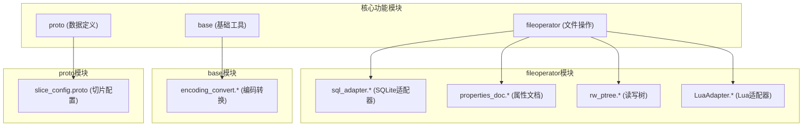
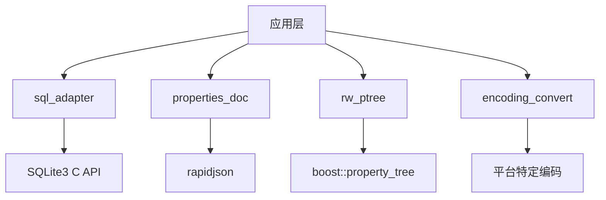
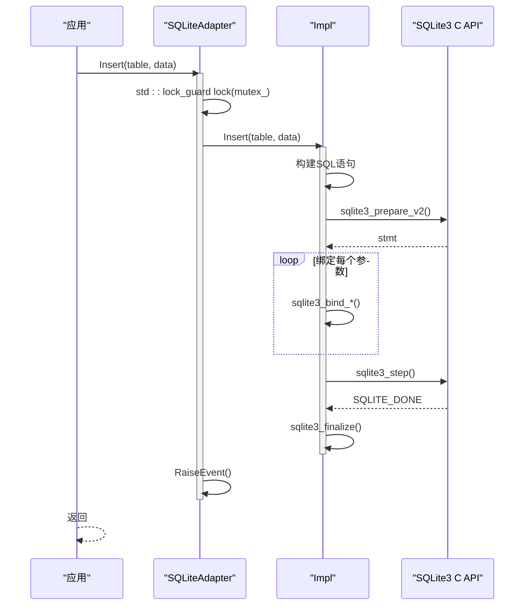
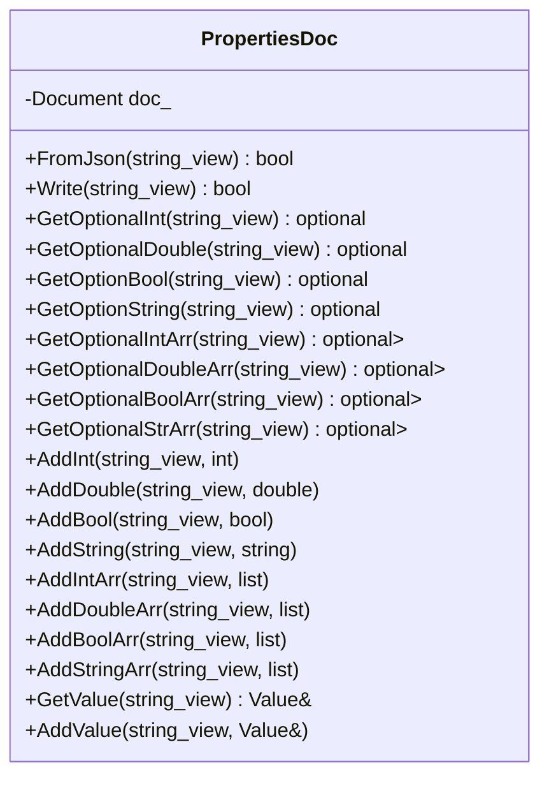
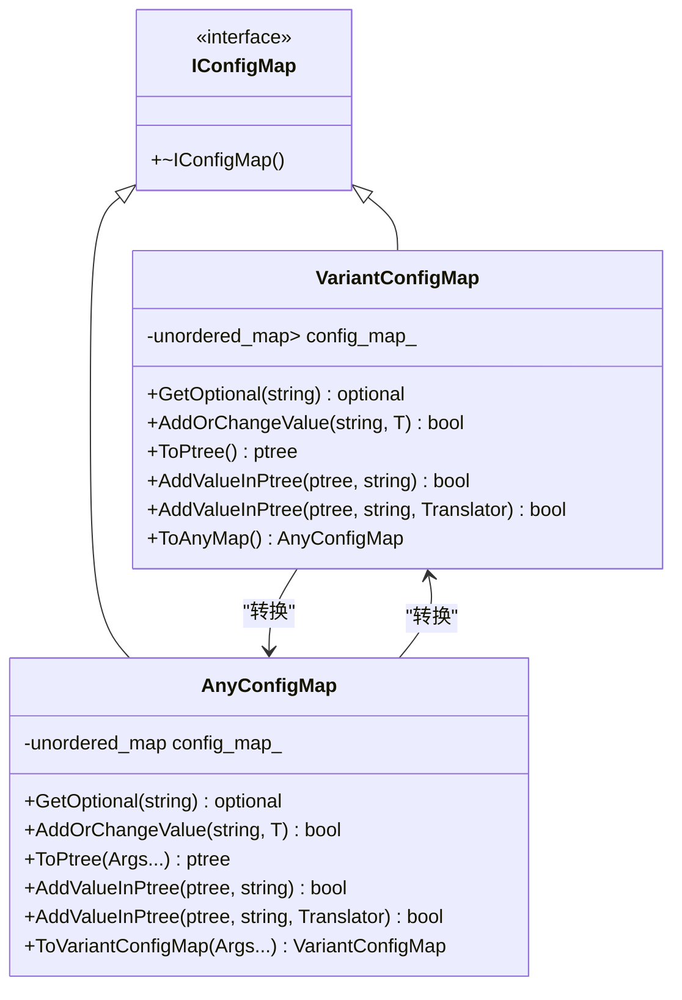
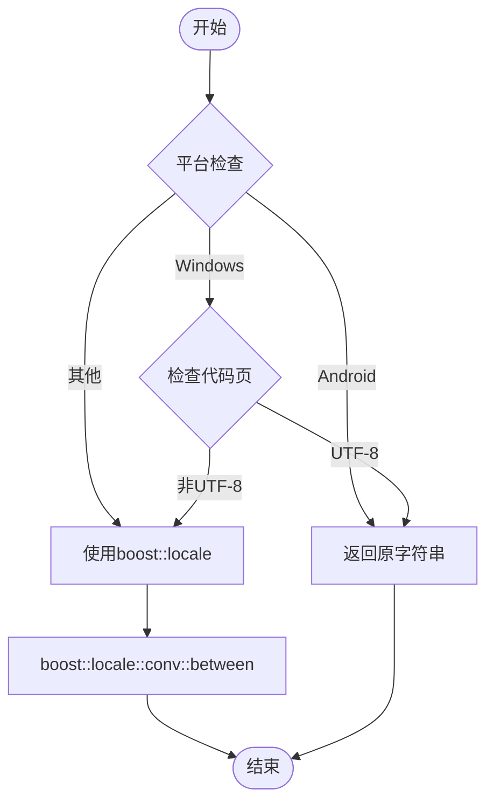
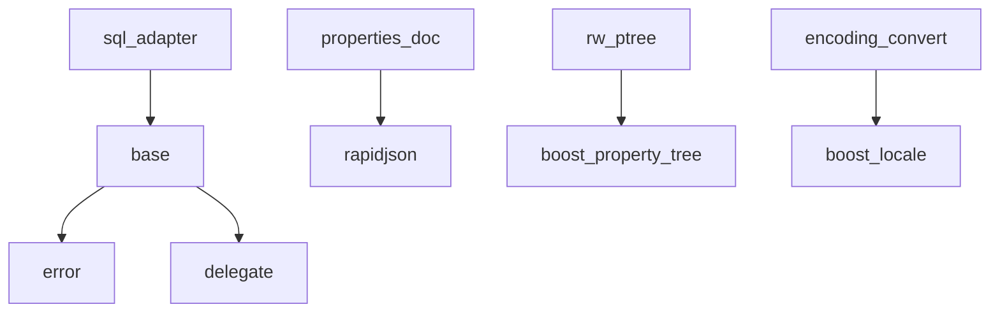

# SQLite数据库操作

<cite>
**本文档引用的文件**   
- [sql_adapter.cpp](file://fileoperator/sql_adapter.cpp)
- [sql_adapter.hpp](file://fileoperator/sql_adapter.hpp)
- [properties_doc.cpp](file://fileoperator/properties_doc.cpp)
- [properties_doc.hpp](file://fileoperator/properties_doc.hpp)
- [rw_ptree.cpp](file://fileoperator/rw_ptree.cpp)
- [rw_ptree.hpp](file://fileoperator/rw_ptree.hpp)
- [encoding_convert.cpp](file://base/encoding_convert.cpp)
- [encoding_convert.hpp](file://base/encoding_convert.hpp)
- [slice_config.proto](file://proto/slice_config.proto)
- [LuaAdapter.cpp](file://fileoperator/LuaAdapter.cpp)
</cite>

## 目录
1. [引言](#引言)
2. [项目结构](#项目结构)
3. [核心组件](#核心组件)
4. [架构概述](#架构概述)
5. [详细组件分析](#详细组件分析)
6. [依赖分析](#依赖分析)
7. [性能考虑](#性能考虑)
8. [故障排除指南](#故障排除指南)
9. [结论](#结论)

## 引言
本文档系统阐述了`sql_adapter`与`properties_doc`组件如何实现结构化数据持久化。详细说明`sql_adapter`如何封装SQLite3 C API，提供安全的参数化查询接口以防止SQL注入，支持事务管理（BEGIN/COMMIT/ROLLBACK）确保配置写入原子性。描述`properties_doc`如何基于boost::property_tree::ptree构建层次化键值存储模型，并通过`rw_ptree`实现JSON/YAML/INI格式互操作。解释编码转换模块（`encoding_convert`）如何确保跨平台路径字符串在数据库中的正确存储与检索。提供示例代码展示如何将切片参数（`slice_config.proto`）序列化后存入SQLite，以及如何通过Lua脚本动态查询配置项。包含数据库Schema设计图、ACID特性保障说明及并发访问控制策略。

## 项目结构
项目结构清晰地组织了各个功能模块，其中`fileoperator`目录包含了`sql_adapter`和`properties_doc`等关键文件操作组件，`base`目录包含了基础工具如`encoding_convert`，`proto`目录定义了数据结构如`slice_config.proto`。



**图源**
- [sql_adapter.cpp](file://fileoperator/sql_adapter.cpp#L1-L1705)
- [properties_doc.cpp](file://fileoperator/properties_doc.cpp#L1-L284)
- [rw_ptree.cpp](file://fileoperator/rw_ptree.cpp#L1-L51)
- [encoding_convert.cpp](file://base/encoding_convert.cpp#L1-L130)
- [slice_config.proto](file://proto/slice_config.proto#L1-L27)

**本节源**
- [sql_adapter.cpp](file://fileoperator/sql_adapter.cpp#L1-L1705)
- [properties_doc.cpp](file://fileoperator/properties_doc.cpp#L1-L284)
- [rw_ptree.cpp](file://fileoperator/rw_ptree.cpp#L1-L51)
- [encoding_convert.cpp](file://base/encoding_convert.cpp#L1-L130)
- [slice_config.proto](file://proto/slice_config.proto#L1-L27)

## 核心组件
`sql_adapter`组件封装了SQLite3 C API，提供了`SQLiteAdapter`类，实现了`ISQLAdapter`接口，支持连接、执行查询、插入、更新、删除、选择、创建和删除表等操作。`properties_doc`组件基于`rapidjson`库实现了`PropertiesDoc`类，用于处理JSON格式的配置文件。`rw_ptree`组件利用`boost::property_tree`库实现了`from_ini`、`from_xml`、`from_json`等函数，支持多种格式的配置文件读写。`encoding_convert`组件提供了`utf8_to_local`和`local_to_utf8`等函数，确保跨平台路径字符串的正确转换。

**本节源**
- [sql_adapter.hpp](file://fileoperator/sql_adapter.hpp#L1-L336)
- [properties_doc.hpp](file://fileoperator/properties_doc.hpp#L1-L117)
- [rw_ptree.hpp](file://fileoperator/rw_ptree.hpp#L1-L218)
- [encoding_convert.hpp](file://base/encoding_convert.hpp#L1-L161)

## 架构概述
系统架构通过`sql_adapter`实现数据库操作，`properties_doc`处理配置文件，`rw_ptree`提供多格式支持，`encoding_convert`确保编码正确性。各组件通过清晰的接口进行交互，确保了系统的模块化和可维护性。



**图源**
- [sql_adapter.cpp](file://fileoperator/sql_adapter.cpp#L1-L1705)
- [properties_doc.cpp](file://fileoperator/properties_doc.cpp#L1-L284)
- [rw_ptree.cpp](file://fileoperator/rw_ptree.cpp#L1-L51)
- [encoding_convert.cpp](file://base/encoding_convert.cpp#L1-L130)

## 详细组件分析

### sql_adapter分析
`sql_adapter`组件通过封装SQLite3 C API，提供了安全的数据库操作接口。`SQLiteAdapter`类的`Insert`、`Update`、`Delete`等方法使用参数化查询，有效防止SQL注入。`Select`方法支持复杂的查询条件，包括排序、限制和偏移。`CreateTable`和`RemoveTable`方法支持动态创建和删除表。

#### 类图
```mermaid
classDiagram
class ISQLAdapter {
<<interface>>
+Rows Query(string)
+void Execute(string)
+bool IsConnected()
+void Insert(string, map<string, any>)
+void Delete(string, map<string, any>)
+void Update(string, map<string, any>, map<string, any>)
+Rows Select(string, vector<string>, map<string, any>, optional<string>, int64_t, int64_t)
+void CreateTable(string, map<string, string>)
+void RemoveTable(string)
}
class SQLiteAdapter {
-shared_mutex mutex_
-unique_ptr<Impl> impl_
+Connect(string_view)
+Connect(string_view, string_view, string_view, string_view, unsigned int)
+Execute(string)
+Query(string) Rows
+IsConnected() bool
+Insert(string, map<string, any>)
+Delete(string, map<string, any>)
+Update(string, map<string, any>, map<string, any>)
+Select(string, vector<string>, map<string, any>, optional<string>, int64_t, int64_t) Rows
+CreateTable(string, map<string, string>)
+RemoveTable(string)
}
class SQLiteAdapter : : Impl {
-sqlite3* db
-bool connected
-string lastError
+Connect(string_view)
+Execute(string)
+Query(string) Rows
}
ISQLAdapter <|-- SQLiteAdapter
SQLiteAdapter o-- SQLiteAdapter : : Impl
```

**图源**
- [sql_adapter.hpp](file://fileoperator/sql_adapter.hpp#L20-L135)
- [sql_adapter.cpp](file://fileoperator/sql_adapter.cpp#L23-L119)

#### 序列图


**图源**
- [sql_adapter.cpp](file://fileoperator/sql_adapter.cpp#L166-L236)

**本节源**
- [sql_adapter.cpp](file://fileoperator/sql_adapter.cpp#L166-L236)
- [sql_adapter.hpp](file://fileoperator/sql_adapter.hpp#L116-L130)

### properties_doc分析
`properties_doc`组件基于`rapidjson`库实现了`PropertiesDoc`类，用于处理JSON格式的配置文件。`FromJson`和`Write`方法支持从文件读取和写入JSON数据。`GetOptional*`和`Add*`系列方法提供了类型安全的访问接口。

#### 类图


**图源**
- [properties_doc.hpp](file://fileoperator/properties_doc.hpp#L23-L114)
- [properties_doc.cpp](file://fileoperator/properties_doc.cpp#L9-L284)

**本节源**
- [properties_doc.cpp](file://fileoperator/properties_doc.cpp#L9-L284)
- [properties_doc.hpp](file://fileoperator/properties_doc.hpp#L23-L114)

### rw_ptree分析
`rw_ptree`组件利用`boost::property_tree`库实现了`from_ini`、`from_xml`、`from_json`等函数，支持多种格式的配置文件读写。`to_ini`、`to_xml`、`to_json`函数支持将`ptree`写入文件。

#### 类图


**图源**
- [rw_ptree.hpp](file://fileoperator/rw_ptree.hpp#L31-L181)
- [rw_ptree.cpp](file://fileoperator/rw_ptree.cpp#L11-L51)

**本节源**
- [rw_ptree.cpp](file://fileoperator/rw_ptree.cpp#L11-L51)
- [rw_ptree.hpp](file://fileoperator/rw_ptree.hpp#L31-L181)

### encoding_convert分析
`encoding_convert`组件提供了`utf8_to_local`和`local_to_utf8`等函数，确保跨平台路径字符串的正确转换。在Windows系统上，通过`windows_chcp_utf8`检查代码页，使用`boost::locale`进行编码转换。

#### 流程图


**图源**
- [encoding_convert.cpp](file://base/encoding_convert.cpp#L35-L73)
- [encoding_convert.hpp](file://base/encoding_convert.hpp#L12-L14)

**本节源**
- [encoding_convert.cpp](file://base/encoding_convert.cpp#L35-L73)
- [encoding_convert.hpp](file://base/encoding_convert.hpp#L12-L14)

## 依赖分析
系统各组件之间的依赖关系清晰，`sql_adapter`依赖于`base`模块的`error`和`delegate`，`properties_doc`依赖于`rapidjson`，`rw_ptree`依赖于`boost::property_tree`，`encoding_convert`在非Android平台上依赖于`boost::locale`。



**图源**
- [sql_adapter.hpp](file://fileoperator/sql_adapter.hpp#L18-L19)
- [properties_doc.hpp](file://fileoperator/properties_doc.hpp#L15-L17)
- [rw_ptree.hpp](file://fileoperator/rw_ptree.hpp#L12-L13)
- [encoding_convert.cpp](file://base/encoding_convert.cpp#L10-L11)

**本节源**
- [sql_adapter.hpp](file://fileoperator/sql_adapter.hpp#L18-L19)
- [properties_doc.hpp](file://fileoperator/properties_doc.hpp#L15-L17)
- [rw_ptree.hpp](file://fileoperator/rw_ptree.hpp#L12-L13)
- [encoding_convert.cpp](file://base/encoding_convert.cpp#L10-L11)

## 性能考虑
`sql_adapter`通过使用`std::shared_mutex`实现读写锁，允许多个读操作并发执行，提高并发性能。`properties_doc`和`rw_ptree`通过直接操作内存中的数据结构，避免了频繁的磁盘I/O操作。`encoding_convert`在Android平台上直接返回原字符串，避免不必要的转换开销。

## 故障排除指南
- **数据库连接失败**：检查数据库文件路径是否正确，确保文件有读写权限。
- **SQL注入**：确保所有用户输入都通过参数化查询处理。
- **编码问题**：在Windows系统上，确保控制台代码页设置为UTF-8。
- **Lua集成失败**：检查Lua脚本语法是否正确，确保`SQLiteAdapter`对象已正确创建。

**本节源**
- [sql_adapter.cpp](file://fileoperator/sql_adapter.cpp#L39-L46)
- [encoding_convert.cpp](file://base/encoding_convert.cpp#L42-L45)
- [LuaAdapter.cpp](file://fileoperator/LuaAdapter.cpp#L294-L306)

## 结论
`sql_adapter`和`properties_doc`组件通过封装底层API，提供了安全、高效、易用的接口，实现了结构化数据的持久化。`encoding_convert`组件确保了跨平台的编码正确性。通过Lua脚本集成，系统具备了动态查询和配置的能力。整体架构清晰，模块化程度高，易于维护和扩展。