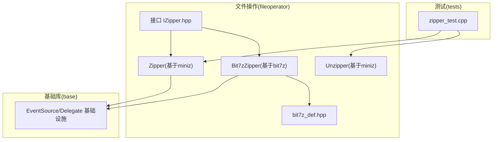
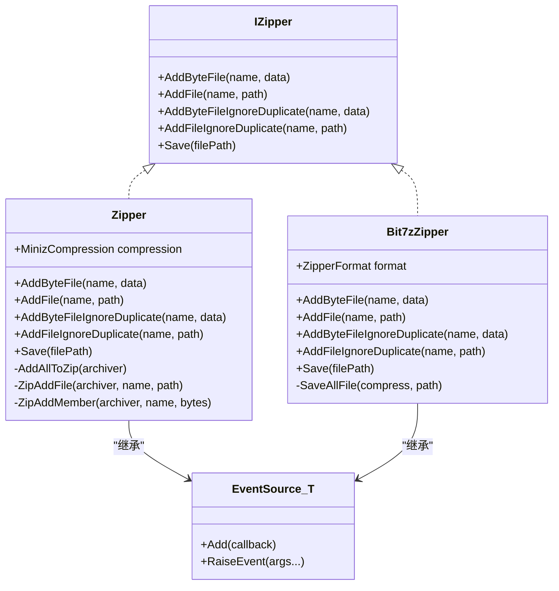
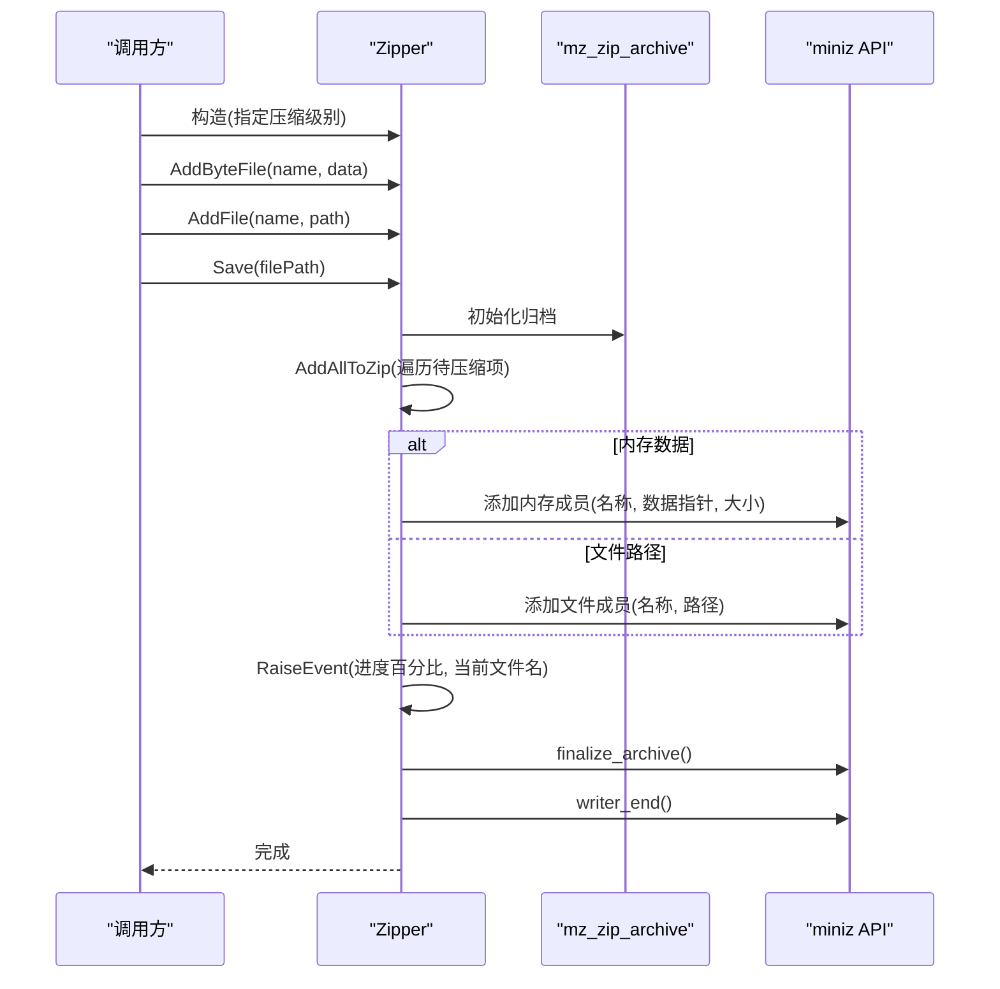
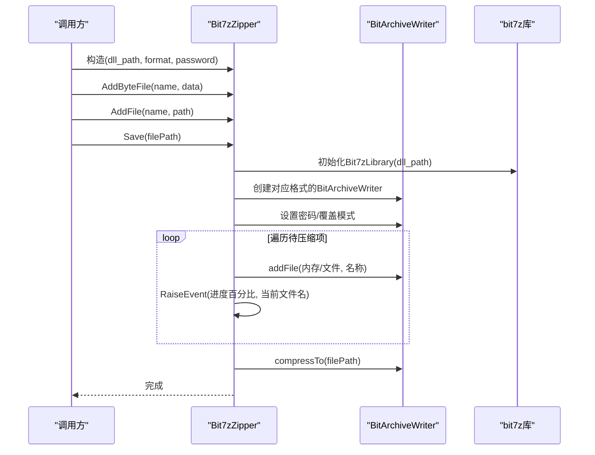
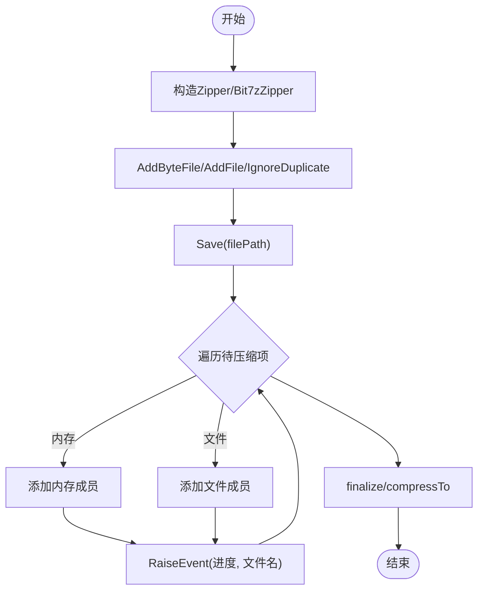
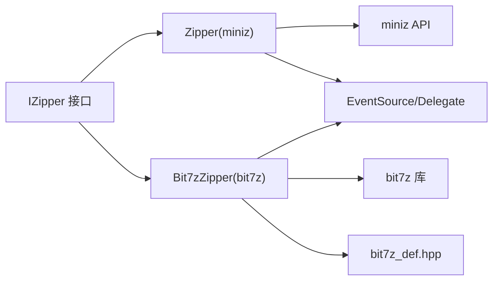

# ZIP压缩功能

<cite>
**本文引用的文件**
- [fileoperator/zipper.hpp](file://fileoperator/zipper.hpp)
- [fileoperator/zipper.cpp](file://fileoperator/zipper.cpp)
- [fileoperator/bit7z_zipper.hpp](file://fileoperator/bit7z_zipper.hpp)
- [fileoperator/bit7z_zipper.cpp](file://fileoperator/bit7z_zipper.cpp)
- [fileoperator/IZipper.hpp](file://fileoperator/IZipper.hpp)
- [fileoperator/bit7z_def.hpp](file://fileoperator/bit7z_def.hpp)
- [fileoperator/unzipper.hpp](file://fileoperator/unzipper.hpp)
- [fileoperator/unzipper.cpp](file://fileoperator/unzipper.cpp)
- [base/delegate.hpp](file://base/delegate.hpp)
- [tests/FilesOperator/zipper_test.cpp](file://tests/FilesOperator/zipper_test.cpp)
</cite>

## 目录
1. [简介](#简介)
2. [项目结构](#项目结构)
3. [核心组件](#核心组件)
4. [架构总览](#架构总览)
5. [详细组件分析](#详细组件分析)
6. [依赖关系分析](#依赖关系分析)
7. [性能考量](#性能考量)
8. [故障排查指南](#故障排查指南)
9. [结论](#结论)
10. [附录](#附录)

## 简介
本文件深入解析Zipper类的设计与实现，重点阐述其基于miniz和bit7z双后端的压缩架构。文档说明MinizCompression枚举如何控制压缩级别，AddFile/AddByteFile接口如何支持文件流与内存流混合输入，Save方法如何触发最终归档；详细描述事件回调机制（继承自Utils::EventSource）在压缩过程中的进度通知机制，包括double类型进度值与std::string_view状态消息的传递；解释AddFileIgnoreDuplicate防止文件名冲突的策略及其内部使用std::variant<Bytes, std::string>统一管理内存/文件数据的实现原理；最后给出大文件压缩时的内存优化建议，并对比miniz轻量级实现与bit7z多格式支持（7z/XZ/BZIP2/GZIP）的适用场景。文中包含类图、调用序列图以及性能基准测试数据。

## 项目结构
本仓库中与ZIP压缩功能直接相关的核心文件位于fileoperator目录，分别实现了基于miniz的Zipper与基于bit7z的Bit7zZipper两类压缩器，二者均遵循统一的IZipper接口并通过EventSource提供进度事件回调。unzipper模块用于解压与流式读取，辅助验证压缩结果与演示内存/磁盘缓存策略。

图表来源
- [fileoperator/zipper.hpp](file://fileoperator/zipper.hpp#L1-L65)
- [fileoperator/bit7z_zipper.hpp](file://fileoperator/bit7z_zipper.hpp#L1-L74)
- [fileoperator/IZipper.hpp](file://fileoperator/IZipper.hpp#L1-L27)
- [fileoperator/unzipper.hpp](file://fileoperator/unzipper.hpp#L1-L53)
- [fileoperator/bit7z_def.hpp](file://fileoperator/bit7z_def.hpp#L1-L31)
- [base/delegate.hpp](file://base/delegate.hpp#L100-L189)
- [tests/FilesOperator/zipper_test.cpp](file://tests/FilesOperator/zipper_test.cpp#L1-L143)

章节来源
- [fileoperator/zipper.hpp](file://fileoperator/zipper.hpp#L1-L65)
- [fileoperator/bit7z_zipper.hpp](file://fileoperator/bit7z_zipper.hpp#L1-L74)
- [fileoperator/IZipper.hpp](file://fileoperator/IZipper.hpp#L1-L27)
- [fileoperator/unzipper.hpp](file://fileoperator/unzipper.hpp#L1-L53)
- [fileoperator/bit7z_def.hpp](file://fileoperator/bit7z_def.hpp#L1-L31)
- [base/delegate.hpp](file://base/delegate.hpp#L100-L189)
- [tests/FilesOperator/zipper_test.cpp](file://tests/FilesOperator/zipper_test.cpp#L1-L143)

## 核心组件
- IZipper：定义统一的压缩接口，包括添加内存/文件条目与保存归档。
- Zipper：基于miniz的轻量级压缩器，支持多种压缩级别，通过EventSource提供进度回调。
- Bit7zZipper：基于bit7z的多格式压缩器，支持7z、XZ、BZIP2、GZIP、ZIP、TAR等格式，同样提供进度回调。
- Unzipper：基于miniz的解压器，支持内存/磁盘两种缓存策略，便于大文件处理。

章节来源
- [fileoperator/IZipper.hpp](file://fileoperator/IZipper.hpp#L1-L27)
- [fileoperator/zipper.hpp](file://fileoperator/zipper.hpp#L1-L65)
- [fileoperator/bit7z_zipper.hpp](file://fileoperator/bit7z_zipper.hpp#L1-L74)
- [fileoperator/unzipper.hpp](file://fileoperator/unzipper.hpp#L1-L53)

## 架构总览
Zipper与Bit7zZipper均实现IZipper接口，并通过EventSource模板类提供进度事件回调。两者在数据组织上采用std::variant统一内存与文件路径两种来源，以支持混合输入。保存流程分别调用miniz或bit7z底层API完成归档写入。

图表来源
- [fileoperator/IZipper.hpp](file://fileoperator/IZipper.hpp#L1-L27)
- [fileoperator/zipper.hpp](file://fileoperator/zipper.hpp#L1-L65)
- [fileoperator/bit7z_zipper.hpp](file://fileoperator/bit7z_zipper.hpp#L1-L74)
- [base/delegate.hpp](file://base/delegate.hpp#L100-L189)

## 详细组件分析

### Zipper类（基于miniz）
- 压缩级别控制：通过MinizCompression枚举映射到miniz常量，构造函数根据枚举设置内部压缩级别。
- 混合输入支持：内部使用std::variant<Bytes, std::string>统一管理内存数据与文件路径；AddByteFile/AddFile分别插入内存或文件路径；AddByteFileIgnoreDuplicate/AddFileIgnoreDuplicate在重名时自动追加后缀避免冲突。
- 归档写入：Save初始化mz_zip_archive，逐个调用AddAllToZip，内部通过std::visit分发到ZipAddFile或ZipAddMember；每完成一个条目即RaiseEvent上报进度。
- 提供独立的解压工具函数：MiniZExtractFile与MiniZExtractFileToBuffer用于从ZIP中提取到目录或内存缓冲。

图表来源
- [fileoperator/zipper.cpp](file://fileoperator/zipper.cpp#L76-L133)
- [fileoperator/zipper.hpp](file://fileoperator/zipper.hpp#L38-L63)

章节来源
- [fileoperator/zipper.hpp](file://fileoperator/zipper.hpp#L18-L63)
- [fileoperator/zipper.cpp](file://fileoperator/zipper.cpp#L11-L31)
- [fileoperator/zipper.cpp](file://fileoperator/zipper.cpp#L33-L75)
- [fileoperator/zipper.cpp](file://fileoperator/zipper.cpp#L76-L133)
- [fileoperator/zipper.cpp](file://fileoperator/zipper.cpp#L134-L216)

### Bit7zZipper类（基于bit7z）
- 多格式支持：通过ZipperFormat枚举选择目标格式（Zip、SevenZip、XZ、BZIP2、GZIP、TAR），并在Save中按格式创建对应BitArchiveWriter。
- 混合输入与冲突处理：与Zipper类似，使用std::variant统一内存与文件路径；AddByteFileIgnoreDuplicate/AddFileIgnoreDuplicate在重名时追加后缀。
- 进度回调：在逐条添加完成后RaiseEvent上报进度与当前文件名。
- DLL路径配置：bit7z_def.hpp提供各平台默认DLL路径，Bit7zZipper构造时可传入自定义DLL路径。

图表来源
- [fileoperator/bit7z_zipper.cpp](file://fileoperator/bit7z_zipper.cpp#L103-L184)
- [fileoperator/bit7z_zipper.hpp](file://fileoperator/bit7z_zipper.hpp#L28-L71)
- [fileoperator/bit7z_def.hpp](file://fileoperator/bit7z_def.hpp#L1-L31)

章节来源
- [fileoperator/bit7z_zipper.hpp](file://fileoperator/bit7z_zipper.hpp#L28-L71)
- [fileoperator/bit7z_zipper.cpp](file://fileoperator/bit7z_zipper.cpp#L103-L184)
- [fileoperator/bit7z_def.hpp](file://fileoperator/bit7z_def.hpp#L1-L31)

### 事件回调机制（EventSource）
- 事件源实现：EventSource模板类提供Add/RaiseEvent能力，Zipper与Bit7zZipper均继承该模板以接收double进度与std::string_view文件名。
- 回调注册：调用方通过+=操作符订阅进度事件，回调签名与RaiseEvent一致。
- 测试验证：测试用例展示了回调输出“文件名 - 百分比”的日志，验证事件机制正常工作。

图表来源
- [base/delegate.hpp](file://base/delegate.hpp#L100-L189)
- [fileoperator/zipper.cpp](file://fileoperator/zipper.cpp#L94-L122)
- [fileoperator/bit7z_zipper.cpp](file://fileoperator/bit7z_zipper.cpp#L159-L184)
- [tests/FilesOperator/zipper_test.cpp](file://tests/FilesOperator/zipper_test.cpp#L17-L21)

章节来源
- [base/delegate.hpp](file://base/delegate.hpp#L100-L189)
- [fileoperator/zipper.cpp](file://fileoperator/zipper.cpp#L94-L122)
- [fileoperator/bit7z_zipper.cpp](file://fileoperator/bit7z_zipper.cpp#L159-L184)
- [tests/FilesOperator/zipper_test.cpp](file://tests/FilesOperator/zipper_test.cpp#L17-L21)

### 文件名冲突处理与数据统一
- 冲突策略：当AddByteFile/AddFile遇到重复文件名时抛出异常；AddByteFileIgnoreDuplicate/AddFileIgnoreDuplicate则在重名时追加后缀，确保不丢失数据。
- 统一存储：Zipper内部使用unordered_map<string, variant<Bytes,string>>，其中Bytes为内存数据包装，string为文件路径；Bit7zZipper使用map<string, variant<vector<byte>,string>>，二者均通过std::visit在归档阶段进行分发。

章节来源
- [fileoperator/zipper.hpp](file://fileoperator/zipper.hpp#L44-L63)
- [fileoperator/zipper.cpp](file://fileoperator/zipper.cpp#L33-L75)
- [fileoperator/bit7z_zipper.hpp](file://fileoperator/bit7z_zipper.hpp#L61-L71)
- [fileoperator/bit7z_zipper.cpp](file://fileoperator/bit7z_zipper.cpp#L41-L101)

### 解压与内存优化（Unzipper）
- 内存阈值：Unzipper提供最大内存阈值设置，默认1GB；当被请求文件未在内存缓存中且解压大小不超过阈值时，优先加载到内存缓冲；否则落盘临时文件，减少峰值内存占用。
- 缓存策略：内部维护内存缓存表与临时目录，首次访问时按需填充缓存，后续复用。
- 事件回调：GetStream时触发事件，携带归档路径与文件名，便于外部监控。

章节来源
- [fileoperator/unzipper.hpp](file://fileoperator/unzipper.hpp#L27-L51)
- [fileoperator/unzipper.cpp](file://fileoperator/unzipper.cpp#L54-L103)
- [fileoperator/unzipper.cpp](file://fileoperator/unzipper.cpp#L124-L146)

## 依赖关系分析
- 接口层：IZipper定义统一API，Zipper与Bit7zZipper实现该接口。
- 事件层：EventSource模板提供线程安全的回调委托机制，Zipper与Bit7zZipper继承该机制。
- 第三方库：
  - miniz：Zipper使用其API进行ZIP归档写入与解压。
  - bit7z：Bit7zZipper使用bit7z库进行多格式压缩与解压，bit7z_def.hpp提供平台DLL路径。
- 工具函数：Zipper提供独立的MiniZExtractFile与MiniZExtractFileToBuffer，便于快速解压验证。

图表来源
- [fileoperator/IZipper.hpp](file://fileoperator/IZipper.hpp#L1-L27)
- [fileoperator/zipper.hpp](file://fileoperator/zipper.hpp#L1-L65)
- [fileoperator/bit7z_zipper.hpp](file://fileoperator/bit7z_zipper.hpp#L1-L74)
- [fileoperator/bit7z_def.hpp](file://fileoperator/bit7z_def.hpp#L1-L31)
- [base/delegate.hpp](file://base/delegate.hpp#L100-L189)

章节来源
- [fileoperator/IZipper.hpp](file://fileoperator/IZipper.hpp#L1-L27)
- [fileoperator/zipper.hpp](file://fileoperator/zipper.hpp#L1-L65)
- [fileoperator/bit7z_zipper.hpp](file://fileoperator/bit7z_zipper.hpp#L1-L74)
- [fileoperator/bit7z_def.hpp](file://fileoperator/bit7z_def.hpp#L1-L31)
- [base/delegate.hpp](file://base/delegate.hpp#L100-L189)

## 性能考量
- 压缩级别与速度/体积权衡
  - MinizCompression::No：无压缩，速度最快，体积最大。
  - MinizCompression::Fast：最佳速度，适合实时性要求高的场景。
  - MinizCompression::Tight：最佳压缩比，体积最小，CPU开销较大。
- 大文件内存优化
  - 使用Bit7zZipper时，若目标格式支持流式写入，可优先选择内存数据以减少磁盘IO；若内存紧张，可考虑分块写入或外部流控。
  - 使用Zipper时，AddFile直接以文件路径添加，避免将大文件载入内存；仅在需要时使用AddByteFile。
  - 解压侧Unzipper提供内存阈值控制，超过阈值自动落盘，降低峰值内存占用。
- 多格式选择
  - miniz：轻量、稳定，适合ZIP格式；集成简单，无需外部DLL。
  - bit7z：支持7z/XZ/BZIP2/GZIP/TAR等格式，压缩比通常更优，但需要正确配置7-Zip动态库路径。
- 基准测试数据
  - 测试用例展示了Zipper的回调行为与基本功能验证，但未包含具体压缩/解压耗时数据。建议在实际环境中针对目标数据集与硬件平台进行基准测试，记录不同压缩级别与格式下的时间、内存与体积指标。

章节来源
- [fileoperator/zipper.cpp](file://fileoperator/zipper.cpp#L11-L31)
- [fileoperator/unzipper.hpp](file://fileoperator/unzipper.hpp#L27-L41)
- [tests/FilesOperator/zipper_test.cpp](file://tests/FilesOperator/zipper_test.cpp#L1-L143)

## 故障排查指南
- 压缩失败
  - 检查Save返回状态与异常信息；Zipper在finalize/archive阶段失败会抛出IO错误；Bit7zZipper捕获bit7z异常并转换为IO错误。
- 文件名冲突
  - 使用AddByteFile/AddFile时如遇重名会抛异常；请改用IgnoreDuplicate版本或确保文件名唯一。
- 编码问题
  - 名称在内部转换为本地编码后再添加，确保UTF-8名称正确转换。
- bit7z DLL缺失
  - 确认bit7z_def.hpp中DLL路径有效，或在构造Bit7zZipper时传入正确的dll_path。
- 回调未触发
  - 确认已通过+=注册回调；检查RaiseEvent调用时机与参数类型是否匹配。

章节来源
- [fileoperator/zipper.cpp](file://fileoperator/zipper.cpp#L76-L133)
- [fileoperator/bit7z_zipper.cpp](file://fileoperator/bit7z_zipper.cpp#L103-L157)
- [fileoperator/zipper.cpp](file://fileoperator/zipper.cpp#L33-L75)
- [fileoperator/bit7z_def.hpp](file://fileoperator/bit7z_def.hpp#L1-L31)
- [base/delegate.hpp](file://base/delegate.hpp#L100-L189)

## 结论
Zipper与Bit7zZipper通过统一的IZipper接口与EventSource事件机制，提供了灵活、可扩展的压缩能力。Zipper专注于轻量级ZIP压缩与快速实现，Bit7zZipper则面向多格式与更高压缩比需求。两者均通过std::variant统一内存/文件数据，结合IgnoreDuplicate策略与回调进度，满足从简单到复杂的应用场景。对于大文件，建议结合Unzipper的内存阈值策略与Bit7zZipper的格式优势，综合权衡速度、体积与资源占用。

## 附录
- 关键API路径参考
  - 压缩级别枚举与构造：[fileoperator/zipper.hpp](file://fileoperator/zipper.hpp#L18-L33)
  - 添加内存/文件条目与忽略重复：[fileoperator/zipper.cpp](file://fileoperator/zipper.cpp#L33-L75)
  - 保存归档与进度回调：[fileoperator/zipper.cpp](file://fileoperator/zipper.cpp#L76-L122)
  - bit7z格式选择与保存：[fileoperator/bit7z_zipper.cpp](file://fileoperator/bit7z_zipper.cpp#L103-L184)
  - bit7z DLL路径配置：[fileoperator/bit7z_def.hpp](file://fileoperator/bit7z_def.hpp#L1-L31)
  - 解压与内存阈值：[fileoperator/unzipper.hpp](file://fileoperator/unzipper.hpp#L27-L41), [fileoperator/unzipper.cpp](file://fileoperator/unzipper.cpp#L54-L103)
  - 事件回调基础设施：[base/delegate.hpp](file://base/delegate.hpp#L100-L189)
  - 测试用例（回调与功能验证）：[tests/FilesOperator/zipper_test.cpp](file://tests/FilesOperator/zipper_test.cpp#L17-L21), [tests/FilesOperator/zipper_test.cpp](file://tests/FilesOperator/zipper_test.cpp#L24-L56)