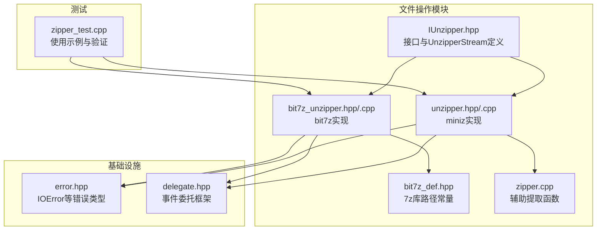
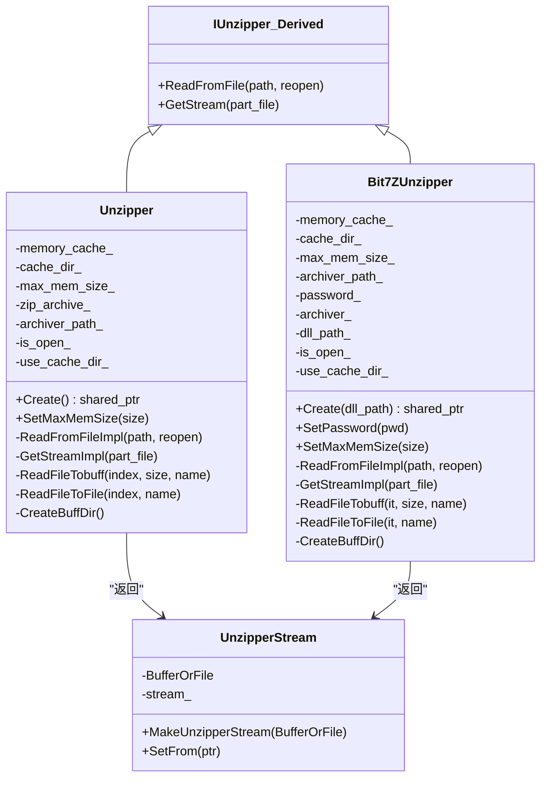
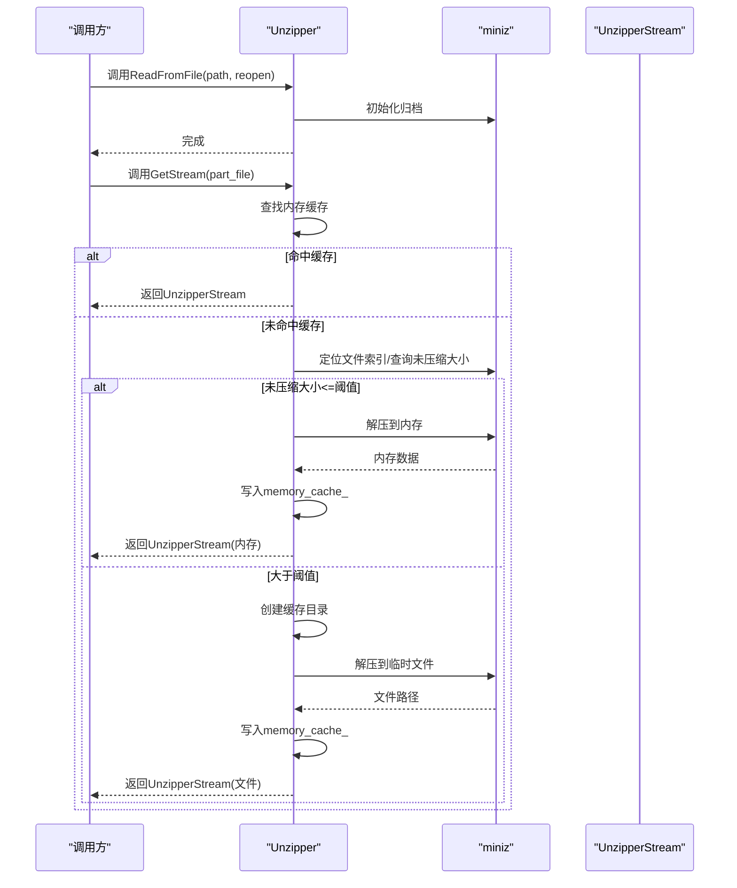
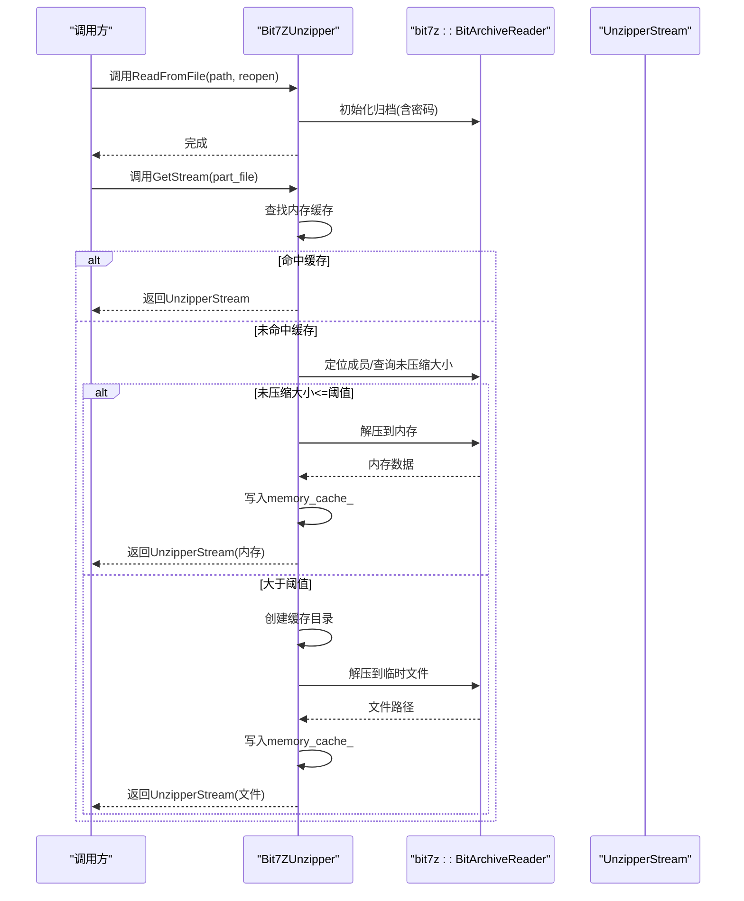
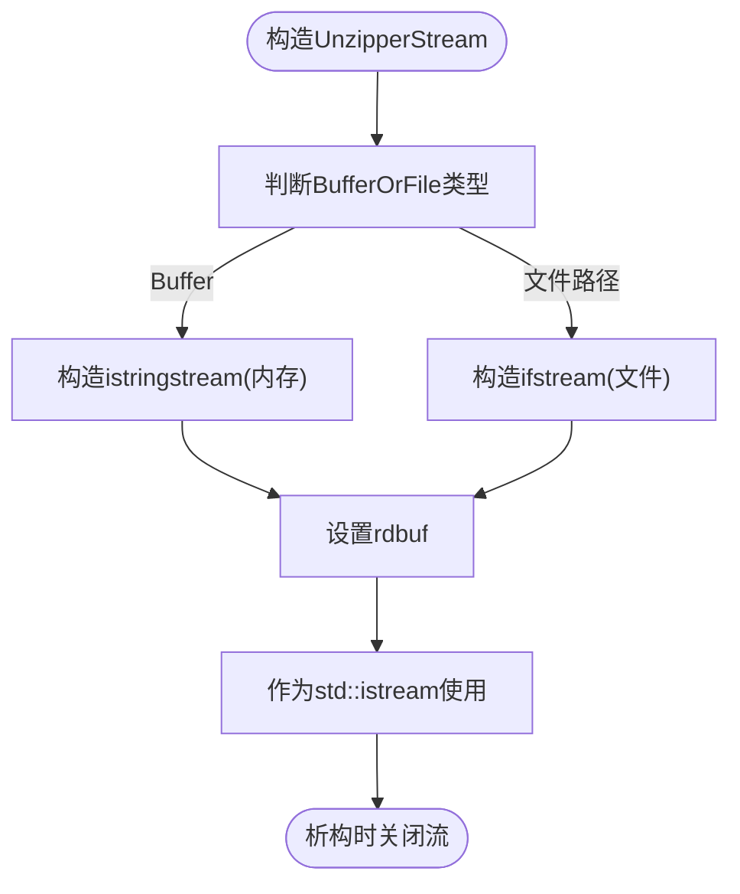
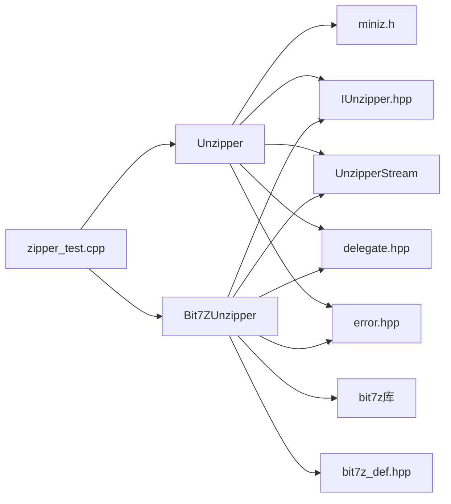

# ZIP解压功能

<cite>
**本文引用的文件列表**
- [unzipper.hpp](file://fileoperator/unzipper.hpp)
- [unzipper.cpp](file://fileoperator/unzipper.cpp)
- [bit7z_unzipper.hpp](file://fileoperator/bit7z_unzipper.hpp)
- [bit7z_unzipper.cpp](file://fileoperator/bit7z_unzipper.cpp)
- [IUnzipper.hpp](file://fileoperator/IUnzipper.hpp)
- [bit7z_def.hpp](file://fileoperator/bit7z_def.hpp)
- [delegate.hpp](file://base/delegate.hpp)
- [error.hpp](file://base/error.hpp)
- [zipper_test.cpp](file://tests/FilesOperator/zipper_test.cpp)
- [zipper.cpp](file://fileoperator/zipper.cpp)
</cite>

## 目录
1. [简介](#简介)
2. [项目结构](#项目结构)
3. [核心组件](#核心组件)
4. [架构总览](#架构总览)
5. [详细组件分析](#详细组件分析)
6. [依赖关系分析](#依赖关系分析)
7. [性能考量](#性能考量)
8. [故障排查指南](#故障排查指南)
9. [结论](#结论)
10. [附录](#附录)

## 简介
本文件系统性阐述Unzipper类的ZIP解压机制，重点覆盖以下方面：
- 基于miniz的底层封装与bit7z后端扩展能力
- 静态工厂方法Create()返回shared_ptr管理实例
- SetMaxMemSize配置默认1GB内存阈值以控制缓存行为
- ReadFromFileImpl与GetStreamImpl协同从文件路径加载ZIP归档并按需提取成员
- memory_cache_与cache_dir_双层缓存策略：小文件直接解压至内存unordered_map，大文件自动转存临时目录
- UnzipperStream::BufferOrFile联合体统一处理内存缓冲与磁盘文件输出
- 事件回调机制通知解压进度与错误状态
- 典型用法：加载加密ZIP包、流式读取切片图像等
- 避免内存溢出的最佳实践

## 项目结构
围绕ZIP解压功能的相关文件组织如下：
- 接口与抽象基类：IUnzipper.hpp
- miniz实现：unzipper.hpp, unzipper.cpp
- bit7z实现：bit7z_unzipper.hpp, bit7z_unzipper.cpp
- 事件委托：base/delegate.hpp
- 错误类型：base/error.hpp
- 测试用例：tests/FilesOperator/zipper_test.cpp
- 辅助函数：fileoperator/zipper.cpp中的MiniZExtractFileToBuffer等

图表来源
- [IUnzipper.hpp](file://fileoperator/IUnzipper.hpp#L1-L134)
- [unzipper.hpp](file://fileoperator/unzipper.hpp#L1-L53)
- [unzipper.cpp](file://fileoperator/unzipper.cpp#L1-L146)
- [bit7z_unzipper.hpp](file://fileoperator/bit7z_unzipper.hpp#L1-L72)
- [bit7z_unzipper.cpp](file://fileoperator/bit7z_unzipper.cpp#L1-L132)
- [bit7z_def.hpp](file://fileoperator/bit7z_def.hpp#L1-L31)
- [zipper.cpp](file://fileoperator/zipper.cpp#L127-L218)
- [error.hpp](file://base/error.hpp#L1-L139)
- [delegate.hpp](file://base/delegate.hpp#L1-L190)
- [zipper_test.cpp](file://tests/FilesOperator/zipper_test.cpp#L58-L101)

章节来源
- [unzipper.hpp](file://fileoperator/unzipper.hpp#L1-L53)
- [unzipper.cpp](file://fileoperator/unzipper.cpp#L1-L146)
- [bit7z_unzipper.hpp](file://fileoperator/bit7z_unzipper.hpp#L1-L72)
- [bit7z_unzipper.cpp](file://fileoperator/bit7z_unzipper.cpp#L1-L132)
- [IUnzipper.hpp](file://fileoperator/IUnzipper.hpp#L1-L134)
- [bit7z_def.hpp](file://fileoperator/bit7z_def.hpp#L1-L31)
- [zipper.cpp](file://fileoperator/zipper.cpp#L127-L218)
- [error.hpp](file://base/error.hpp#L1-L139)
- [delegate.hpp](file://base/delegate.hpp#L1-L190)
- [zipper_test.cpp](file://tests/FilesOperator/zipper_test.cpp#L58-L101)

## 核心组件
- Unzipper：基于miniz的ZIP解压器，提供静态工厂Create()、内存阈值配置SetMaxMemSize()、从文件加载ReadFromFileImpl()、按需提取GetStreamImpl()、内存与磁盘双层缓存策略、事件回调RaiseEvent()。
- Bit7ZUnzipper：基于bit7z的ZIP/7Z解压器，支持密码设置、与Unzipper相同的接口契约，同样具备内存阈值与缓存策略。
- IUnzipper<Derived>：模板接口，统一ReadFromFile()/GetStream()入口，内部通过派生类实现具体逻辑。
- UnzipperStream：可同时承载内存缓冲或磁盘文件的输入流，通过BufferOrFile联合体与MakeUnzipperStream工厂方法统一构造。
- EventSource与Delegate：事件委托框架，用于在GetStreamImpl中触发“开始解压某成员”的回调。

章节来源
- [unzipper.hpp](file://fileoperator/unzipper.hpp#L15-L50)
- [unzipper.cpp](file://fileoperator/unzipper.cpp#L25-L146)
- [bit7z_unzipper.hpp](file://fileoperator/bit7z_unzipper.hpp#L18-L71)
- [bit7z_unzipper.cpp](file://fileoperator/bit7z_unzipper.cpp#L22-L132)
- [IUnzipper.hpp](file://fileoperator/IUnzipper.hpp#L111-L131)
- [IUnzipper.hpp](file://fileoperator/IUnzipper.hpp#L18-L109)
- [delegate.hpp](file://base/delegate.hpp#L150-L188)

## 架构总览
Unzipper与Bit7ZUnzipper均继承自IUnzipper<Derived>，并通过UnzipperStream统一输出。二者共享同一事件回调机制，且都受max_mem_size_阈值控制缓存策略。

图表来源
- [IUnzipper.hpp](file://fileoperator/IUnzipper.hpp#L111-L131)
- [unzipper.hpp](file://fileoperator/unzipper.hpp#L15-L50)
- [bit7z_unzipper.hpp](file://fileoperator/bit7z_unzipper.hpp#L18-L71)
- [IUnzipper.hpp](file://fileoperator/IUnzipper.hpp#L18-L109)

## 详细组件分析

### Unzipper类解压流程
- 静态工厂Create()返回shared_ptr管理实例，确保生命周期安全与跨模块传递。
- SetMaxMemSize(size=1GB)为全局阈值，决定小文件走内存缓存还是大文件走磁盘缓存。
- ReadFromFileImpl(path, reopen)：若已打开且路径相同且不强制重开，则直接返回；否则初始化miniz归档、清理旧缓存、重置状态。
- GetStreamImpl(part_file)：若命中内存缓存则直接返回对应UnzipperStream；否则定位文件索引、查询未压缩大小、根据阈值选择ReadFileTobuff或ReadFileToFile。
- ReadFileTobuff：分配Buffer并调用miniz解压到内存，写入memory_cache_。
- ReadFileToFile：创建临时目录与唯一文件名，调用miniz解压到文件，写入memory_cache_。
- CreateBuffDir：首次使用时创建基于当前路径+归档路径哈希的临时目录作为缓存根。
- 事件回调：在GetStreamImpl中RaiseEvent(archiver_path_, part_file)，供订阅者记录日志或统计。

图表来源
- [unzipper.cpp](file://fileoperator/unzipper.cpp#L25-L146)
- [unzipper.hpp](file://fileoperator/unzipper.hpp#L21-L50)
- [IUnzipper.hpp](file://fileoperator/IUnzipper.hpp#L111-L131)

章节来源
- [unzipper.hpp](file://fileoperator/unzipper.hpp#L21-L50)
- [unzipper.cpp](file://fileoperator/unzipper.cpp#L25-L146)
- [IUnzipper.hpp](file://fileoperator/IUnzipper.hpp#L111-L131)

### Bit7ZUnzipper类解压流程
- 与Unzipper一致的接口契约，但底层使用bit7z::BitArchiveReader，支持密码设置(SetPassword)。
- ReadFromFileImpl通过Bit7zLibrary加载指定7z库(dll_path_)并初始化归档。
- GetStreamImpl通过archiver_->find定位成员，随后根据阈值选择内存或磁盘路径。
- ReadFileTobuff使用extractTo将数据写入Buffer；ReadFileToFile使用extractTo将数据写入文件流。
- 其余缓存与事件机制与Unzipper一致。

图表来源
- [bit7z_unzipper.cpp](file://fileoperator/bit7z_unzipper.cpp#L22-L132)
- [bit7z_unzipper.hpp](file://fileoperator/bit7z_unzipper.hpp#L18-L71)
- [bit7z_def.hpp](file://fileoperator/bit7z_def.hpp#L1-L31)
- [IUnzipper.hpp](file://fileoperator/IUnzipper.hpp#L111-L131)

章节来源
- [bit7z_unzipper.hpp](file://fileoperator/bit7z_unzipper.hpp#L18-L71)
- [bit7z_unzipper.cpp](file://fileoperator/bit7z_unzipper.cpp#L22-L132)
- [bit7z_def.hpp](file://fileoperator/bit7z_def.hpp#L1-L31)

### UnzipperStream与BufferOrFile联合体
- BufferOrFile为std::variant<Buffer, std::string>，分别表示内存缓冲或磁盘文件路径。
- MakeUnzipperStream根据BufferOrFile类型构造UnzipperStream：内存时构造istringstream，文件时构造ifstream。
- Buffer持有shared_ptr<char[]>与size，避免额外拷贝。
- UnzipperStream析构时会关闭底层流，确保资源释放。

图表来源
- [IUnzipper.hpp](file://fileoperator/IUnzipper.hpp#L18-L109)

章节来源
- [IUnzipper.hpp](file://fileoperator/IUnzipper.hpp#L18-L109)

### 事件回调机制
- Unzipper与Bit7ZUnzipper均继承自Utils::EventSource<..., void, std::string_view, std::string_view>，在GetStreamImpl中调用RaiseEvent(archiver_path_, part_file)。
- 订阅者可通过+=注册回调，用于记录日志、统计进度或监控错误。
- 该机制与miniz/bit7z解压过程解耦，便于上层观察与诊断。

章节来源
- [unzipper.hpp](file://fileoperator/unzipper.hpp#L15-L20)
- [bit7z_unzipper.hpp](file://fileoperator/bit7z_unzipper.hpp#L18-L24)
- [delegate.hpp](file://base/delegate.hpp#L150-L188)

### 双层缓存策略
- 内存缓存(memory_cache_)：键为成员路径，值为BufferOrFile；小文件(<max_mem_size_)解压到内存后缓存。
- 磁盘缓存(cache_dir_)：首次需要磁盘缓存时创建临时目录，后续大文件解压到该目录下唯一文件名，路径写入memory_cache_。
- 生命周期：Unzipper析构时若使用了缓存目录，会删除该目录及其内容；Bit7ZUnzipper同理。

章节来源
- [unzipper.cpp](file://fileoperator/unzipper.cpp#L105-L146)
- [unzipper.hpp](file://fileoperator/unzipper.hpp#L41-L47)
- [bit7z_unzipper.cpp](file://fileoperator/bit7z_unzipper.cpp#L47-L64)
- [bit7z_unzipper.hpp](file://fileoperator/bit7z_unzipper.hpp#L54-L63)

### 错误处理
- 所有失败场景抛出IOError，包含明确的错误信息，便于上层捕获与处理。
- 常见错误：打开ZIP失败、定位成员失败、解压失败、打开文件失败等。

章节来源
- [unzipper.cpp](file://fileoperator/unzipper.cpp#L37-L40)
- [unzipper.cpp](file://fileoperator/unzipper.cpp#L94-L98)
- [unzipper.cpp](file://fileoperator/unzipper.cpp#L137-L140)
- [bit7z_unzipper.cpp](file://fileoperator/bit7z_unzipper.cpp#L32-L36)
- [bit7z_unzipper.cpp](file://fileoperator/bit7z_unzipper.cpp#L100-L108)
- [bit7z_unzipper.cpp](file://fileoperator/bit7z_unzipper.cpp#L123-L126)
- [error.hpp](file://base/error.hpp#L41-L46)

## 依赖关系分析
- Unzipper依赖miniz进行ZIP归档读取与解压。
- Bit7ZUnzipper依赖bit7z库与bit7z_def.hpp提供的平台路径常量。
- 两者均依赖IUnzipper接口与UnzipperStream统一输出。
- 事件回调依赖base/delegate.hpp。
- 错误类型依赖base/error.hpp。
- 测试用例展示Create()、SetMaxMemSize()、GetStream()的典型用法。

图表来源
- [unzipper.hpp](file://fileoperator/unzipper.hpp#L1-L12)
- [bit7z_unzipper.hpp](file://fileoperator/bit7z_unzipper.hpp#L1-L17)
- [bit7z_def.hpp](file://fileoperator/bit7z_def.hpp#L1-L31)
- [IUnzipper.hpp](file://fileoperator/IUnzipper.hpp#L1-L18)
- [delegate.hpp](file://base/delegate.hpp#L1-L190)
- [error.hpp](file://base/error.hpp#L1-L139)
- [zipper_test.cpp](file://tests/FilesOperator/zipper_test.cpp#L58-L101)

章节来源
- [unzipper.hpp](file://fileoperator/unzipper.hpp#L1-L12)
- [bit7z_unzipper.hpp](file://fileoperator/bit7z_unzipper.hpp#L1-L17)
- [bit7z_def.hpp](file://fileoperator/bit7z_def.hpp#L1-L31)
- [IUnzipper.hpp](file://fileoperator/IUnzipper.hpp#L1-L18)
- [delegate.hpp](file://base/delegate.hpp#L1-L190)
- [error.hpp](file://base/error.hpp#L1-L139)
- [zipper_test.cpp](file://tests/FilesOperator/zipper_test.cpp#L58-L101)

## 性能考量
- 内存阈值max_mem_size_默认1GB，建议根据实际内存与并发需求调整：
  - 小文件(<阈值)：内存解压，I/O次数少，延迟低，适合频繁访问的小文件。
  - 大文件(>=阈值)：磁盘解压，减少内存占用，适合超大文件或内存紧张场景。
- 缓存目录cache_dir_仅在首次需要时创建，避免不必要的磁盘IO。
- 用户缓冲user_buff_size固定为4096字节，兼顾miniz解压效率与内存占用。
- 事件回调无阻塞，不影响解压主流程，适合异步统计与日志。

[本节为通用性能讨论，无需特定文件引用]

## 故障排查指南
- 打开ZIP失败：检查路径是否存在、权限是否足够、文件是否损坏。查看IOError异常信息。
- 成员不存在：确认GetStream传入的成员路径是否正确（区分大小写、斜杠方向）。
- 解压失败：确认目标路径可写、磁盘空间充足；对于Bit7ZUnzipper，确认7z库路径正确。
- 内存不足：降低SetMaxMemSize阈值，或改用磁盘缓存；避免同时解压多个超大文件。
- 缓存目录残留：确保Unzipper/Bit7ZUnzipper生命周期结束时正常析构，必要时手动清理。

章节来源
- [unzipper.cpp](file://fileoperator/unzipper.cpp#L37-L40)
- [unzipper.cpp](file://fileoperator/unzipper.cpp#L94-L98)
- [unzipper.cpp](file://fileoperator/unzipper.cpp#L137-L140)
- [bit7z_unzipper.cpp](file://fileoperator/bit7z_unzipper.cpp#L32-L36)
- [bit7z_unzipper.cpp](file://fileoperator/bit7z_unzipper.cpp#L100-L108)
- [bit7z_unzipper.cpp](file://fileoperator/bit7z_unzipper.cpp#L123-L126)
- [error.hpp](file://base/error.hpp#L41-L46)

## 结论
Unzipper与Bit7ZUnzipper提供了统一的ZIP解压接口，结合miniz与bit7z两大后端，既满足轻量内存场景，也支持大文件磁盘缓存。通过BufferOrFile联合体与事件回调机制，系统在易用性与可观测性之间取得平衡。合理设置max_mem_size_与缓存策略，可在不同硬件条件下获得稳定性能。

[本节为总结性内容，无需特定文件引用]

## 附录

### 典型用法与最佳实践
- 加载加密ZIP包（Bit7ZUnzipper）
  - 使用Create(dll_path)创建实例
  - 调用SetPassword设置密码
  - ReadFromFile后GetStream读取成员
  - 参考路径：[bit7z_unzipper.cpp](file://fileoperator/bit7z_unzipper.cpp#L22-L46)
- 流式读取切片图像（Unzipper）
  - 使用Create()创建实例
  - 设置SetMaxMemSize(较小值)以优先磁盘缓存
  - ReadFromFile后对每个切片调用GetStream并顺序读取
  - 参考路径：[unzipper_test.cpp](file://tests/FilesOperator/zipper_test.cpp#L81-L101)
- 避免内存溢出
  - 对超大文件设置较小阈值或禁用内存缓存
  - 合理管理Unzipper/Bit7ZUnzipper生命周期，确保析构清理缓存目录
  - 并发场景下限制同时解压的文件数量

章节来源
- [bit7z_unzipper.cpp](file://fileoperator/bit7z_unzipper.cpp#L22-L46)
- [zipper_test.cpp](file://tests/FilesOperator/zipper_test.cpp#L81-L101)
- [unzipper.cpp](file://fileoperator/unzipper.cpp#L105-L146)
- [bit7z_unzipper.cpp](file://fileoperator/bit7z_unzipper.cpp#L47-L64)